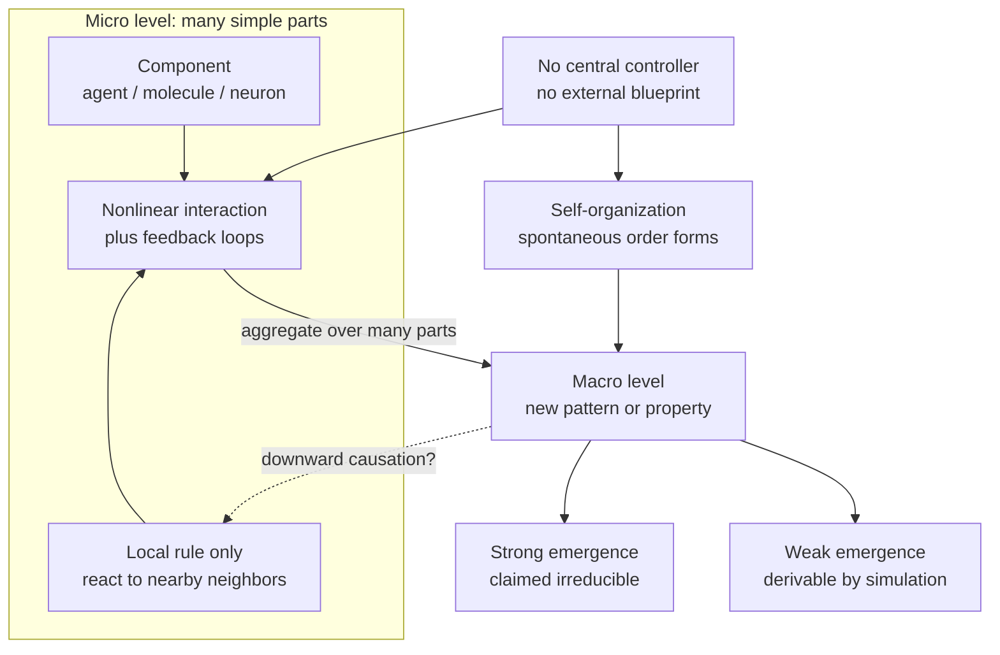

# 🐜 Emergence and Self-Organization

> [!abstract] TL;DR
> **Emergence** is when a system as a whole exhibits properties or patterns that none of its parts possess and that were never explicitly programmed in — temperature from jostling molecules, a traffic jam from individual drivers, a mind from neurons. **Self-organization** is the *process* by which such order appears spontaneously, with no central controller and no external blueprint — the parts follow only local rules, yet global structure crystallizes. The hard questions are philosophical: is the macro pattern merely a convenient shorthand for the micro details (**weak emergence**), or is it genuinely new and irreducible (**strong emergence**)? And can the whole ever *push back down* to constrain its parts (**downward causation**)?

---

## Intuition

**Analogy:** Watch a flock of starlings roll and fold across an evening sky — a **murmuration**. It has a shape, a density, a direction; it flows around a hawk like a single fluid organism. Now ask: *which bird is in charge?* None of them. There is no lead bird issuing commands, no choreographer, no shared plan. Each starling obeys three dumb local rules — stay close to a few neighbors, match their heading, don't collide — and out of ten thousand copies of that trivial rule set, a coherent, breathing, hawk-dodging cloud appears in the air. The cloud is **emergent** (it is a property of the flock, not of any bird), and the way it assembles itself from local rules alone is **self-organization**.

The punchline that unsettles people is this: you can know *everything* about one starling and still not have predicted the murmuration. "More is different" — Philip Anderson's phrase — means that at each new scale, genuinely new descriptions become necessary that could not have been read off from the parts in isolation.

---

## How It Works

### Core Mechanics

1. **Many parts, simple local rules.** Emergence needs a large population of components that each interact only with a *local* neighborhood — molecules with adjacent molecules, drivers with the car ahead, agents with their block. No component sees the whole.
2. **Nonlinearity and feedback.** If the parts simply added up linearly, the whole would be a boring sum. Emergence lives on **nonlinear interactions** and **feedback loops**: small local effects amplify, saturate, or cancel in ways that reshape the collective.
3. **Aggregation crosses a description boundary.** At some scale a *new vocabulary* becomes the natural one. You stop talking about individual molecule velocities and start talking about **temperature** and **pressure** — variables that have no meaning for a single molecule but are precise and predictive for the ensemble.
4. **No blueprint, no conductor (self-organization).** Crucially, the macro order is not imposed from outside. **Bénard convection cells** — the hexagonal tiling that appears in a pan of oil heated from below — are not stamped in by a mold; they self-select because that geometry most efficiently transports heat. The **Belousov–Zhabotinsky reaction** spontaneously oscillates between colors ("a chemical clock") with no external timer.
5. **Possible top-down constraint (downward causation).** Once the macro pattern exists, it can bias the parts: a traffic jam, itself made of cars, *forces* the next car to brake. Whether this is real causation or just re-described micro-causation is the live debate.

### Weak vs Strong Emergence

- **Weak emergence** — the macro pattern is *unexpected* and not analytically shortcut-able, but it is fully *derivable* by simulating the micro rules. Traffic jams, Schelling segregation, and Conway's Game of Life are weakly emergent: surprising, yet nothing beyond the parts is needed to generate them. Most scientists accept weak emergence without controversy.
- **Strong emergence** — the macro property is claimed to be *irreducible in principle*, exerting causal powers not fixed by the micro facts. The stock candidate is **phenomenal consciousness**. Strong emergence is philosophically radical and widely contested; many argue it conflates *we cannot yet reduce it* with *it cannot be reduced*.

### Epistemological vs Ontological Emergence

- **Epistemological emergence** is about *our knowledge*: the whole is emergent because our models, tools, or computational limits cannot predict it from the parts. This is uncontroversial.
- **Ontological emergence** is about *reality itself*: new properties and causal powers actually come into existence at higher levels. This is the strong, disputed claim — and it turns on **supervenience** (no change in the macro without some change in the micro) and whether supervenience is compatible with the macro having its own causal clout.

### Flow / Architecture



---

## Key Concepts

**Secondary (intuition level)**
- A **whole can have properties its parts lack**: a single water molecule is neither wet nor liquid; wetness is a property of many molecules together.
- **Self-organization** means order that builds itself — a snowflake, a sand ripple, a flock — with nobody in charge.
- **Local rules, global patterns**: simple "look at your neighbors" behavior can produce complex large-scale shapes.

**Undergraduate (mechanism level)**
- **Weak emergence** (derivable by simulation) vs **strong emergence** (claimed irreducible), and why traffic jams are weak while consciousness is the disputed strong candidate.
- Canonical examples: **temperature and pressure** from molecular kinetics, **traffic jams** as backward-propagating shock waves, **market prices** aggregating dispersed information, **termite mounds** built by stigmergy with no architect.
- **Self-organizing physical systems**: **Bénard convection cells**, the **Belousov–Zhabotinsky chemical clock**, and **flocking / Boids** rules (separation, alignment, cohesion).
- **Anderson's "More Is Different" (1972)**: reductionism does not imply constructionism — knowing the fundamental laws does not let you reconstruct higher-level science.

**Graduate (foundational debate)**
- **Supervenience**: macro properties supervene on micro if there is no macro difference without a micro difference. This grounds physicalism yet is compatible with epistemic irreducibility.
- **Downward causation**: can a macro-level state (a convection pattern, an institution, a belief) causally constrain its own constituents without violating the **causal closure of the physical**? Kim's *exclusion argument* presses that macro causes are pre-empted by their micro realizers.
- **Ontological vs epistemological emergence**: is emergence a fact about the world's layered causal structure or merely about the limits of our models and computation?
- **Kauffman's "order for free"**: in **random Boolean networks / NK models**, ordered, near-critical dynamics arise generically, suggesting self-organization is a default tendency of complex networks — a proposed complement to natural selection.
- **Emergence vs reduction**: the tension with **inter-theoretic reduction** and Nagel-style bridge laws — the philosophy-of-science frame for whether higher sciences are "just" physics.

---

## Python Demo

Schelling's segregation model (1971) is the canonical demonstration that **mild individual preferences can produce strong collective segregation nobody intended**. Each agent is content as long as *at least ~30%* of its occupied neighbors share its type — a tolerant rule that permits being a local minority. Yet iterating relocations still drives the grid to sharp, near-total separation: an **emergent macro pattern arising purely from micro rules**, with no central planner enforcing it.

```python
# Schelling segregation: tolerant local rules -> intolerant global pattern.
# Two agent types (1, 2) on a grid; 0 = empty. An agent is "content" if the
# fraction of same-type OCCUPIED neighbors >= THRESHOLD; unhappy agents move
# to a random empty cell. We track a macro "segregation index" over time.
import numpy as np
import matplotlib.pyplot as plt
from matplotlib.colors import ListedColormap

rng = np.random.default_rng(42)

N = 50            # grid side length
EMPTY_FRAC = 0.10 # fraction of cells left empty (needed for relocation)
THRESHOLD = 0.30  # min fraction of same-type neighbors to stay put (tolerant!)
STEPS = 40        # relocation sweeps

def make_grid(n, empty_frac):
    r = rng.random((n, n))
    # < empty_frac -> empty(0); next half -> type 1; rest -> type 2
    grid = np.where(r < empty_frac, 0,
           np.where(r < empty_frac + (1 - empty_frac) / 2, 1, 2))
    return grid.astype(int)

def same_fraction(grid, i, j):
    """Fraction of occupied Moore-neighbors sharing this agent's type."""
    t = grid[i, j]
    i0, i1 = max(i - 1, 0), min(i + 2, grid.shape[0])
    j0, j1 = max(j - 1, 0), min(j + 2, grid.shape[1])
    block = grid[i0:i1, j0:j1]
    occupied = np.count_nonzero(block) - 1        # exclude self
    if occupied == 0:
        return 1.0                                # no neighbors -> content
    same = np.count_nonzero(block == t) - 1       # exclude self
    return same / occupied

def segregation_index(grid):
    """Macro measure: mean same-type neighbor fraction across all agents."""
    return float(np.mean([same_fraction(grid, i, j)
                          for i, j in zip(*np.nonzero(grid))]))

def step(grid, threshold):
    empties = list(zip(*np.where(grid == 0)))
    agents = list(zip(*np.nonzero(grid)))
    rng.shuffle(agents)
    for (i, j) in agents:
        if same_fraction(grid, i, j) < threshold and empties:  # unhappy -> move
            k = rng.integers(len(empties))
            ei, ej = empties[k]
            grid[ei, ej] = grid[i, j]
            grid[i, j] = 0
            empties[k] = (i, j)                    # vacated cell becomes empty
    return grid

grid = make_grid(N, EMPTY_FRAC)
before = grid.copy()
history = [segregation_index(grid)]
for _ in range(STEPS):
    grid = step(grid, THRESHOLD)
    history.append(segregation_index(grid))
after = grid.copy()

# --- visualize before/after grids and the segregation index over time ---
cmap = ListedColormap(["white", "#d62728", "#1f77b4"])
fig, ax = plt.subplots(1, 3, figsize=(15, 4.5))
ax[0].imshow(before, cmap=cmap, vmin=0, vmax=2)
ax[0].set_title(f"Before   seg index = {history[0]:.2f}")
ax[1].imshow(after, cmap=cmap, vmin=0, vmax=2)
ax[1].set_title(f"After    seg index = {history[-1]:.2f}")
for a in ax[:2]:
    a.set_xticks([]); a.set_yticks([])
ax[2].plot(history, marker="o", ms=3)
ax[2].axhline(0.5, ls="--", c="gray", label="random baseline ~0.5")
ax[2].set_xlabel("relocation sweep"); ax[2].set_ylabel("segregation index")
ax[2].set_title("Emergent macro segregation from micro preferences")
ax[2].legend()
plt.tight_layout(); plt.show()

print(f"individual tolerance (threshold) = {THRESHOLD:.2f}")
print(f"segregation index: {history[0]:.2f} -> {history[-1]:.2f}")
```

Running it, agents demand only that ~30% of their neighbors be similar, yet the segregation index climbs from ~0.5 (random mixing) toward ~0.8+ (sharp clustering). No agent *wants* full segregation; the pattern is an **unintended macro consequence** of everyone independently avoiding extreme minority status — emergence in its purest, most disquieting form.

---

## Real-World Applications

- **Statistical mechanics and thermodynamics.** Temperature, pressure, and entropy are textbook weak emergents: undefined for one molecule, precise and predictive for the ensemble. The entire success of thermodynamics is a case study in a macro theory that supervenes on but is not practically reduced to molecular dynamics.
- **Traffic engineering.** "Phantom" traffic jams — stop-and-go waves that travel *backward* through freeway flow with no accident or bottleneck — are emergent shock waves from car-following rules. Modern adaptive cruise control is designed specifically to damp this emergent instability.
- **Markets and economics.** A price emerges from thousands of dispersed buy/sell decisions, aggregating information no single trader possesses (Hayek's "knowledge problem"). Flash crashes are emergent instabilities of interacting trading algorithms.
- **Urban and social segregation.** Schelling's model is used by sociologists and policymakers to argue that observed residential segregation need not imply strong individual bigotry — mild preferences plus dynamics suffice, which reframes intervention design.
- **Swarm robotics and distributed systems.** Boids-style local rules power drone swarms, ant-colony optimization for routing, and gossip protocols in distributed databases — engineered self-organization where central control would be brittle or impossible.
- **Neuroscience and the mind.** Whether conscious experience is a (weakly) emergent computational property of neural activity or a (strongly) emergent, irreducible fact is the flashpoint of consciousness science and philosophy of mind.

---

## Common Pitfalls

- **Treating "I can't predict it" as "it's ontologically new."** Conflating epistemological with ontological emergence is the most common error. Chaos and computational irreducibility make many systems *unpredictable in practice* while remaining fully determined by their parts — that is weak, not strong, emergence.
- **Invoking emergence as a magic word.** Saying "consciousness/life/intelligence just *emerges*" explains nothing unless you specify the micro rules and the mechanism of aggregation. Emergence is a phenomenon to be explained, not itself an explanation.
- **Assuming emergence requires a controller.** People instinctively look for the "lead bird" or the planner. Self-organization means the order is genuinely decentralized; searching for a hidden controller misreads the system.
- **Ignoring the causal-exclusion problem for downward causation.** If every macro state is realized by micro states, and the micro level is causally closed, then macro-level "causes" risk being redundant. Assert downward causation only with an account of how it avoids this exclusion argument.
- **Over-reading strong emergence into every hard problem.** Complexity, non-additivity, or surprise do not by themselves establish irreducibility. Strong emergence is a heavy metaphysical claim requiring correspondingly heavy justification.
- **Forgetting nonlinearity is essential.** In a purely linear, non-interacting system the whole *is* the sum of its parts. Without nonlinear interaction or feedback there is no interesting emergence to explain.

---

## Related Concepts

- [[Causation]] — downward causation and the causal-exclusion argument are direct applications of theories of causation to multi-level systems.
- [[Explanation_and_Laws_of_Nature]] — emergence bears on inter-theoretic reduction and whether higher-level sciences carry autonomous explanatory laws.
- [[Scientific_Realism]] — are emergent macro entities (temperature, institutions) real, or convenient instrumental shorthand for micro facts?
- [[Dualism_vs_Physicalism]] — strong emergence of mind is a middle path between reductive physicalism and dualism, hinging on supervenience.
- [[Consciousness_and_the_Hard_Problem]] — phenomenal consciousness is the canonical candidate for strong, irreducible emergence.
- [[Consciousness_and_Awareness]] — the cognitive-science program treats access consciousness as a (weakly) emergent, mechanistically tractable global property.
- [[Connectionism_and_Neural_Networks]] — network-level cognition emerging from simple unit interactions is a computational model of weak emergence.
- [[Collective_Behavior_and_Crowds]] — crowd dynamics and social contagion are sociological cases of emergent macro patterns from local interaction.
- [[Functionalism_and_Systems_Theory]] — sociological systems theory treats society as an emergent order sustained by interacting roles and functions.

---

## Review Questions

1. **(Conceptual)** Distinguish weak from strong emergence, and explain why temperature is a comfortable example of the former while phenomenal consciousness is the standard, contested candidate for the latter. What exactly would have to be true of the world for strong emergence to be real rather than merely apparent?
2. **(Scenario)** You observe sharply segregated neighborhoods in a city and a colleague concludes residents must be strongly prejudiced. Using Schelling's model, construct a counter-argument. What single parameter would you vary in the simulation to demonstrate your point, and what does this teach about inferring micro-motives from macro-patterns?
3. **(Trade-off / foundational)** Kim's exclusion argument holds that if the physical is causally closed and every macro state is micro-realized, then macro-level "downward causation" is either redundant or a violation of physics. Take a side: is downward causation a genuine causal power or a re-description of micro-causation? Defend your answer using the concepts of supervenience and the epistemological–ontological distinction.

---

## Sources

- Anderson, P. W. (1972). "More Is Different." *Science*, 177(4047), 393–396. [DOI link](https://www.science.org/doi/10.1126/science.177.4047.393)
- Schelling, T. C. (1971). "Dynamic Models of Segregation." *Journal of Mathematical Sociology*, 1(2), 143–186. [Taylor & Francis](https://www.tandfonline.com/doi/abs/10.1080/0022250X.1971.9989794)
- O'Connor, T. (2021). "Emergent Properties." *Stanford Encyclopedia of Philosophy*. [SEP entry](https://plato.stanford.edu/entries/properties-emergent/)
- Kauffman, S. A. (1993). *The Origins of Order: Self-Organization and Selection in Evolution*. Oxford University Press. [Publisher page](https://global.oup.com/academic/product/the-origins-of-order-9780195079517)
- Kim, J. (1999). "Making Sense of Emergence." *Philosophical Studies*, 95(1–2), 3–36. [Springer](https://link.springer.com/article/10.1023/A:1004563122154)

---

#complexity #emergence #self-organization #schelling #macro-micro
