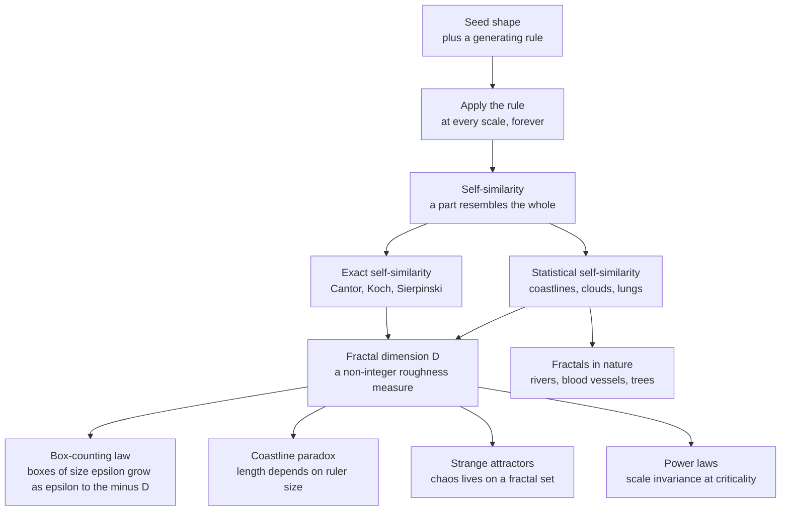

# 🌿 Fractals and Self-Similarity

> [!abstract] TL;DR
> A **fractal** is a shape that keeps revealing detail no matter how far you zoom in, because it is **self-similar**: small pieces echo the structure of the whole. Benoit Mandelbrot noticed that coastlines, clouds, lungs, and lightning are *not* smooth Euclidean objects but rough, scale-invariant ones, and gave them a number — the **fractal dimension** — a *non-integer* measure of roughness that sits between the familiar dimensions 1, 2, and 3. Fractals are the geometry of chaos and criticality: strange attractors are fractal, and power laws are the algebraic signature of scale invariance.

## Intuition — analogy FIRST

Look at a head of **Romanesco broccoli**. The whole head is a spiral cone of florets. Break off one floret — it is a smaller spiral cone of the same shape. Break off a bud from *that* floret — same shape again. There is no "true" size for the broccoli; each part is a shrunken copy of the whole. That is **self-similarity**, and a fractal is any object built from this trick.

Now ask a deceptively simple question: **how long is the coastline of Britain?** Measure it with a 100 km ruler and you get one number. Use a 1 km ruler and you catch bays and headlands the big ruler stepped over, so the length grows. Use a 1 m ruler and you catch every boulder, and it grows again. The coastline has **no well-defined length** — it depends entirely on your ruler. A smooth curve (a circle) converges to a fixed length as your ruler shrinks; a coastline diverges. That divergence *is* the fractal, and the *rate* at which it diverges is the fractal dimension.

The single most important idea: **fractals trade a fixed length for a fixed "roughness," and that roughness is a number strictly between whole dimensions.**

---

## How It Works

A fractal is generated by a **rule applied recursively at every scale**. Start with a seed, apply the rule to get finer structure, apply it again to the result, and repeat forever. Two properties emerge:

1. **Self-similarity** — zooming in reproduces the whole (exactly, or statistically).
2. **Non-integer dimension** — the object fills space more than a line but less than a plane, so its dimension is fractional.



The **coastline paradox** falls out of the box-counting law directly. If you measure a curve with a ruler of length $\epsilon$, the number of ruler-steps scales as $N(\epsilon) \propto \epsilon^{-D}$, so the measured length is

$$L(\epsilon) = N(\epsilon)\,\epsilon \propto \epsilon^{\,1-D}.$$

For a smooth curve $D = 1$ and $L$ is constant. For Britain's west coast $D \approx 1.25$, so $L(\epsilon) \propto \epsilon^{-0.25}$ — the length *diverges* as the ruler shrinks. The coast has no length, but it does have a dimension.

---

## Key Concepts / Details

### Secondary Level

- **Fractal** — a shape with structure at *every* scale; magnifying it never smooths it out, unlike a circle or a triangle.
- **Self-similarity** — the whole is built from smaller copies of itself (broccoli, ferns, snowflakes, tree branching).
- **Classic constructions** you can draw by hand:
  - **Cantor set** — repeatedly delete the middle third of a line segment. What remains is dust with infinitely many points but zero length.
  - **Koch snowflake** — replace the middle third of each edge with a triangular bump, forever. The result has **infinite perimeter** enclosing a **finite area**.
  - **Sierpinski triangle** — remove the central quarter-triangle, recurse on the three that remain.
- **Coastline paradox** — a rough natural boundary has no fixed length; smaller rulers always find more wiggles.

### Undergraduate Level

**Box-counting (Minkowski) dimension.** Cover the object with a grid of boxes of side $\epsilon$ and count how many boxes $N(\epsilon)$ contain any part of it. The dimension is

$$D_{\text{box}} = \lim_{\epsilon \to 0} \frac{\log N(\epsilon)}{\log(1/\epsilon)}.$$

Sanity checks: a line segment gives $D = 1$, a filled square gives $D = 2$. A **Koch curve** gives $D = \log 4 / \log 3 \approx 1.262$ (each step replaces 1 segment with 4, each $1/3$ the length). A **Sierpinski triangle** gives $D = \log 3 / \log 2 \approx 1.585$.

**Exact vs statistical self-similarity.**
- *Exact* — deterministic fractals (Koch, Sierpinski) where a zoom reproduces the whole *precisely*.
- *Statistical* — natural fractals (coastlines, clouds, mountains) where a zoom reproduces the *statistics* — same roughness, not the same picture.

**Iterated Function Systems (IFS).** A fractal can be defined as the unique fixed set of a collection of contraction maps $\{f_1, \dots, f_k\}$. The **chaos game** renders it: start anywhere, repeatedly pick a random map $f_i$ and apply it. The orbit fills the attractor. Barnsley's fern uses just four affine maps; the Sierpinski triangle uses three "move halfway to a random vertex" maps.

**Escape-time fractals — Mandelbrot and Julia sets.** Iterate $z \mapsto z^2 + c$ on the complex plane starting from $z_0 = 0$.
- The **Mandelbrot set** is the set of complex $c$ for which the orbit stays bounded. Its boundary is a fractal of dimension 2.
- A **Julia set** fixes $c$ and asks which starting points $z_0$ stay bounded; each $c$ gives a different Julia set, connected exactly when $c$ lies inside the Mandelbrot set.

**Power laws and scale invariance.** A relationship $y = k\,x^{-\alpha}$ looks identical after rescaling $x$ — it has no characteristic scale, which is precisely what "fractal" means in the frequency or size domain. Power laws are the fingerprint of scale-free systems, from city sizes to earthquake magnitudes.

### Graduate Level

- **Hausdorff dimension.** The rigorous definition. For a cover by sets of diameter $\le \delta$, define the $s$-dimensional Hausdorff measure $\mathcal{H}^s$; the Hausdorff dimension is the critical $s$ at which $\mathcal{H}^s$ jumps from $\infty$ to $0$. It is always $\le$ the box-counting dimension and coincides for self-similar sets satisfying the **open set condition**, giving the similarity dimension $D = \log k / \log(1/r)$ for $k$ copies scaled by $r$.
- **Multifractals.** Many real signals are not characterized by one exponent but a *spectrum* $f(\alpha)$ of local scaling exponents — turbulence, financial volatility, and heartbeat dynamics are multifractal.
- **Strange attractors and chaos.** Dissipative chaotic systems (Lorenz, Rossler, Henon) settle onto attractors that are fractal — locally a stack of sheets, globally of non-integer dimension. The **Kaplan-Yorke conjecture** ties this dimension to the **Lyapunov exponents**, linking sensitive dependence (chaos) to fractal geometry. Chaos is *how* the trajectory moves; the fractal is *where* it lives.
- **Self-organized criticality and scale invariance.** At a critical point, correlation length diverges and fluctuations appear at all scales — the system becomes self-similar, and observables follow power laws. Sandpile avalanches, forest fires, and neuronal cascades exhibit this. Fractal geometry in space and power laws in size distribution are two faces of criticality.
- **Fractional Brownian motion.** A Gaussian process with **Hurst exponent** $H \in (0,1)$ whose sample paths have fractal (graph) dimension $2 - H$; $H = 1/2$ recovers ordinary [[Brownian_Motion]]. Models rough terrain, network traffic, and rough-volatility asset prices.

---

## Python Demo

Two self-contained numpy/matplotlib demonstrations: (1) render the **Mandelbrot set** with a vectorized escape-time iteration, and (2) estimate the **fractal dimension of the Sierpinski triangle** by box-counting and confirm the log-log scaling.

```python
# Fractals demo: Mandelbrot escape-time + Sierpinski box-counting dimension
# Requires only numpy and matplotlib.
import numpy as np
import matplotlib.pyplot as plt

rng = np.random.default_rng(0)

# ---------------------------------------------------------------------------
# 1) MANDELBROT SET via vectorized escape-time iteration of z -> z**2 + c
# ---------------------------------------------------------------------------
def mandelbrot(width=800, height=800, max_iter=120,
               xmin=-2.0, xmax=0.5, ymin=-1.25, ymax=1.25):
    x = np.linspace(xmin, xmax, width)
    y = np.linspace(ymin, ymax, height)
    # Complex grid C; rows are imaginary axis, columns are real axis.
    C = x[np.newaxis, :] + 1j * y[:, np.newaxis]
    Z = np.zeros_like(C)
    escape = np.full(C.shape, max_iter, dtype=float)
    alive = np.ones(C.shape, dtype=bool)          # points not yet escaped
    for n in range(max_iter):
        Z[alive] = Z[alive] * Z[alive] + C[alive]
        escaped = alive & (np.abs(Z) > 2.0)       # |z| > 2 guarantees escape
        escape[escaped] = n                        # record iteration of escape
        alive &= ~escaped                          # stop iterating escaped pts
    return escape

img = mandelbrot()
plt.figure(figsize=(6, 6))
plt.imshow(img, cmap="twilight_shifted",
           extent=[-2.0, 0.5, -1.25, 1.25], origin="lower")
plt.title("Mandelbrot set  (escape-time of z -> z^2 + c)")
plt.xlabel("Re c"); plt.ylabel("Im c")
plt.tight_layout()
plt.show()

# ---------------------------------------------------------------------------
# 2) SIERPINSKI TRIANGLE via the chaos game (an iterated function system),
#    then estimate its fractal dimension by box-counting.
# ---------------------------------------------------------------------------
def sierpinski_points(n=300_000):
    verts = np.array([[0.0, 0.0],
                      [1.0, 0.0],
                      [0.5, np.sqrt(3) / 2]])
    p = np.array([0.5, 0.25])
    pts = np.empty((n, 2))
    for i in range(n):
        v = verts[rng.integers(3)]                 # pick a random vertex
        p = (p + v) / 2.0                          # move halfway toward it
        pts[i] = p
    return pts

def box_count(points, sizes, grid=1024):
    # Rasterize points to a grid, then coarse-grain and count occupied boxes.
    xs = np.clip((points[:, 0] * (grid - 1)).astype(np.int64), 0, grid - 1)
    ys = np.clip((points[:, 1] * (grid - 1)).astype(np.int64), 0, grid - 1)
    counts = []
    for s in sizes:
        bx, by = xs // s, ys // s
        keys = bx * (grid // s + 1) + by           # unique key per box
        counts.append(np.unique(keys).size)        # number of occupied boxes
    return np.array(counts)

grid = 1024
pts = sierpinski_points()
sizes = np.array([1, 2, 4, 8, 16, 32, 64])         # box side in grid cells
counts = box_count(pts, sizes, grid)
eps = sizes / grid                                 # box size as fraction of unit

# Fit slope of log N versus log 1/eps  ->  slope is the fractal dimension.
slope, intercept = np.polyfit(np.log(1 / eps), np.log(counts), 1)
D_theory = np.log(3) / np.log(2)
print(f"Estimated box-counting dimension: {slope:.3f}")
print(f"Theoretical Sierpinski dimension: {D_theory:.3f}  (log3/log2)")

plt.figure(figsize=(6, 5))
plt.plot(np.log(1 / eps), np.log(counts), "o", label="measured boxes")
plt.plot(np.log(1 / eps), np.polyval([slope, intercept], np.log(1 / eps)),
         "--", label=f"fit slope D = {slope:.3f}")
plt.xlabel("log 1/epsilon"); plt.ylabel("log N of epsilon")
plt.title("Box-counting scaling for the Sierpinski triangle")
plt.legend(); plt.tight_layout()
plt.show()
```

Running it prints a measured dimension close to $\log 3 / \log 2 \approx 1.585$ and a clean straight line in the log-log plot — the empirical signature of scale invariance.

---

## Real-World Applications

- **Coastline and terrain modeling.** Statistical self-similarity lets a few parameters (fractal dimension, Hurst exponent) generate convincing synthetic mountains, clouds, and shorelines — the basis of procedural landscapes in film and games.
- **Fractal antennas.** A Koch or Sierpinski antenna packs a long, self-similar conductor into a small area, giving **multi-band, wideband** behavior from one element. This is why compact smartphone and Wi-Fi antennas often use fractal geometry.
- **Medical diagnostics.** Healthy physiology is fractal: the bronchial tree, retinal vasculature, and heart-rate variability all show fractal scaling. A **loss of fractal complexity** — smoother, more regular heartbeats or vessels — is a marker of disease and aging.
- **Image and signal compression.** Fractal compression encodes an image as the IFS whose attractor approximates it; decompression re-runs the maps at any resolution. It underpins resolution-independent zoom in some codecs.
- **Fluid turbulence.** Energy cascades across scales give turbulent flows fractal iso-surfaces and multifractal dissipation, connecting fractal geometry to [[Turbulence_and_Instabilities]].
- **Finance and geophysics.** Price series, earthquake magnitudes, and river discharge follow power laws and fractal roughness, so risk models use fractal and multifractal tools rather than smooth Gaussian assumptions.

---

## Common Pitfalls

- **Confusing self-similarity with periodicity.** A repeating tile pattern is *not* fractal — it has a characteristic scale. Fractals repeat *across* scales, not *along* one scale.
- **Assuming real fractals are infinite.** Physical fractals are only self-similar over a *finite* range of scales (a coastline stops being fractal below the size of a grain of sand). Always report the scaling range, not a single magic dimension.
- **Reading a straight-ish log-log plot as a power law.** A short or noisy log-log line can look linear by accident. Verify the range spans several orders of magnitude and check goodness of fit before claiming a fractal dimension.
- **Mixing up the dimensions.** Box-counting, Hausdorff, information, and correlation dimensions can differ, especially for multifractals. State *which* dimension you computed.
- **Under-resolving escape-time sets.** Too few iterations makes the Mandelbrot boundary look thick and blobby; the fine filaments only appear as `max_iter` grows. Boundary detail is genuinely infinite.
- **Ruler-size bias in measurement.** Reporting a coastline "length" or a curve "perimeter" without stating the ruler size is meaningless for a fractal — the number is an artifact of resolution.

---

## Related Concepts

- [[Turbulence_and_Instabilities]] — turbulent flows have multi-scale, fractal structure and multifractal dissipation; the energy cascade is a physical realization of scale invariance.
- [[Rivers_and_Fluvial_Landscapes]] — drainage networks are statistically self-similar branching trees obeying fractal scaling laws (Horton's laws, Hack's law).
- [[The_Circulatory_and_Respiratory_Systems]] — the bronchial tree and vascular network are space-filling fractal branchings, the geometric basis of allometric $3/4$-power scaling.
- [[Complex_Numbers_and_Functions]] — the Mandelbrot and Julia sets live in the complex plane; iterating $z \mapsto z^2 + c$ requires complex arithmetic.
- [[Brownian_Motion]] — a random walk path is a statistically self-similar fractal of graph dimension $3/2$; fractional Brownian motion generalizes it with a tunable Hurst exponent.

> Sibling notes **Chaos Theory and Sensitive Dependence** and **Criticality** in this section are planned; strange attractors are fractal and criticality produces scale-invariant power laws, so those notes should link here once they exist.

---

## Review Questions

1. **(Secondary)** Why does the coastline of Britain have no single "true" length, while the perimeter of a circle does? Explain in terms of what happens as you shrink the measuring ruler.
2. **(Undergraduate)** The Koch curve replaces each segment with 4 segments, each $1/3$ as long. Compute its box-counting dimension from first principles and explain why the answer lies strictly between 1 and 2.
3. **(Graduate)** A colleague measures a "fractal dimension" of 1.6 from a log-log plot spanning less than one decade of scales. Give two independent reasons to distrust the claim, and describe what evidence would make a fractal-dimension estimate credible. How does this connect strange attractors to power-law behavior at criticality?

---

## Sources

- Mandelbrot, B. B. (1982). *The Fractal Geometry of Nature*. W. H. Freeman.
- Mandelbrot, B. B. (1967). "How Long Is the Coast of Britain? Statistical Self-Similarity and Fractional Dimension." *Science*, 156(3775), 636-638.
- Falconer, K. (2003). *Fractal Geometry: Mathematical Foundations and Applications* (2nd ed.). Wiley.
- Barnsley, M. F. (1988). *Fractals Everywhere*. Academic Press.
- West, G. B., Brown, J. H., & Enquist, B. J. (1997). "A General Model for the Origin of Allometric Scaling Laws in Biology." *Science*, 276(5309), 122-126.

---

#complexity #fractals #self-similarity #mandelbrot #fractal-dimension
