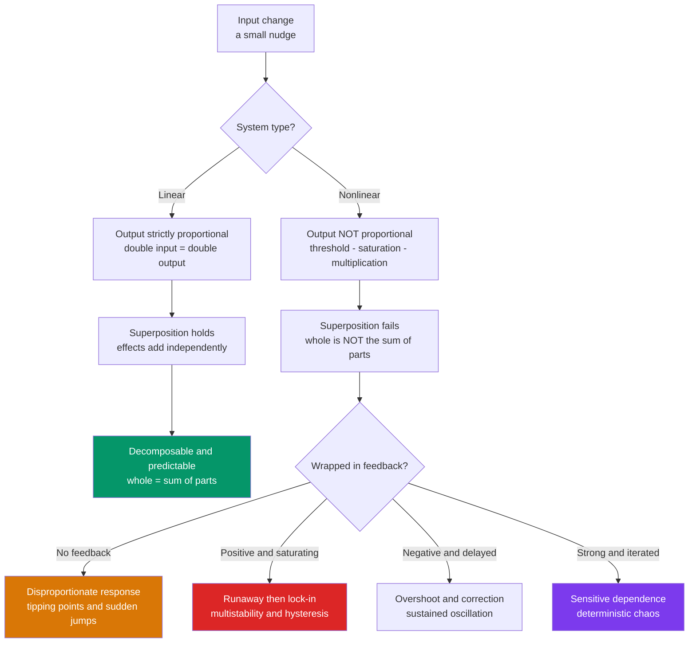

# 🌀 Nonlinearity and Feedback

> [!abstract] TL;DR
> A **linear** system obeys proportionality and superposition — doubling the cause doubles the effect, and separate causes simply add. **Nonlinearity** breaks both rules: the response can be disproportionate, and combined causes can produce something the parts never could. Because nonlinearity lets the whole exceed the sum of its parts, it is the source of nearly all *interesting* behavior in complex systems — thresholds, tipping points, oscillation, multistability, and chaos. When nonlinearity is wrapped inside a **feedback loop**, small nudges can be amplified into system-wide regime shifts, which is exactly why nonlinear systems resist intuition and prediction.

## Intuition

**Analogy — the camel and the straw.** Load straws onto a camel one at a time. For a long while nothing visible happens: the camel absorbs each straw, one straw of load buys one straw of strain. That regime is *linear* — proportional and boring. Then you add one final, identical straw and the camel's back breaks. That last straw was not special; what changed is that the system crossed a **threshold** where the response stopped being proportional to the input. The catastrophe was not caused by the last straw alone — it was caused by the *accumulated nonlinearity* of the whole load. The same tiny cause produced a negligible effect a moment earlier and a total collapse now.

Extend the analogy technically: in a linear world every straw is interchangeable and the total effect is just the count of straws times a fixed cost per straw (superposition). In the real, nonlinear world the *cost of a straw depends on how many are already there* — the effect of a cause is conditioned on the system's state. That state-dependence, especially when the state feeds back on itself, is where complexity comes from.

---

## How It Works

**Linearity** is a two-part promise a system makes about its input–output map $\mathcal{H}$:

1. **Homogeneity (proportionality):** $\mathcal{H}\{a\,x\} = a\,\mathcal{H}\{x\}$ — scale the input, the output scales by the same factor.
2. **Additivity (superposition):** $\mathcal{H}\{x_1 + x_2\} = \mathcal{H}\{x_1\} + \mathcal{H}\{x_2\}$ — the response to a sum is the sum of responses.

Together these say the system can be **decomposed**: understand it on simple pieces, add up the answers, and you have understood the whole. This is why linear systems are so tractable — Fourier analysis, matrix algebra, and impulse-response methods all exploit superposition.

**Nonlinearity** is simply the negation: at least one of those promises fails. The failure has profound consequences:

1. **Disproportionate cause and effect.** Near a threshold, a 1% change in input can cause a 100% change in output (a diode switching on, a neuron firing, a market panic). Elsewhere on the same curve, a huge input change causes almost nothing (**saturation** — the response flattens out because it has hit a ceiling).
2. **The whole is not the sum of the parts.** Because superposition fails, you cannot study a nonlinear system by decomposing it. Two drugs that are each mildly beneficial can be lethal together; two safe subsystems can interact into an unsafe one. Interaction terms (the $x_1 x_2$ *multiplicative* cross-terms) carry the behavior, and additive analysis literally cannot see them.
3. **Multiple regimes.** One nonlinear system can have several qualitatively different behaviors depending on where it sits — a quiet regime, a runaway regime, an oscillating regime — separated by thresholds (**bifurcations**).

**Additive vs multiplicative.** Linear effects *add*: total = A + B. Nonlinear effects often *multiply* or *gate*: total = A × B, or "A only matters if B exceeds a threshold." Multiplicative structure is why removing one factor can zero out the whole (a chain is as strong as its weakest link) and why compounding, contagion, and network effects grow explosively rather than steadily.

**Feedback turns nonlinearity dynamic.** A **feedback loop** routes a system's output back into its own input. Wrap a nonlinearity inside feedback and you get the engine of complex dynamics:

- **Nonlinear positive feedback → runaway or multistability.** Amplification that grows with the state pushes the system hard toward one extreme; a saturating nonlinearity then stops the runaway and *locks in* a stable state. With two such basins you get **bistability** (a light switch, a cell that commits to one fate, a lake that is either clear or algae-choked).
- **Nonlinear negative feedback with delay → oscillation.** Correcting too hard and too late overshoots the target, then overshoots back — producing sustained cycles (predator–prey populations, thermostat hunting, business cycles).
- **Strong nonlinear feedback → chaos.** Push the gain higher and orbits never repeat; the system shows **sensitive dependence on initial conditions** — two nearly identical starts diverge exponentially. (This is the deterministic-but-unpredictable regime treated in depth under chaos; here we only note that chaos *requires* nonlinearity — a purely linear system can never be chaotic.)



---

## Key Concepts

### Secondary (intuition-level)
- **Proportional vs not.** Linear = "twice the push, twice the shove." Nonlinear = "sometimes a small push does nothing, sometimes it does everything."
- **Threshold / tipping point.** A hidden line where behavior flips: water at 99 °C is hot water; at 100 °C it becomes steam. Same one-degree change, totally different result.
- **The last straw.** Big effects can have tiny *immediate* causes when the system was already near a threshold — the cause is really the whole accumulated state.
- **Saturation.** A response can also *stop* responding: once you are full, more food does not make you more full.

### Undergraduate (mechanism-level)
- **Superposition principle** as the defining test of linearity: $\mathcal{H}\{a x_1 + b x_2\} = a\mathcal{H}\{x_1\} + b\mathcal{H}\{x_2\}$. If it fails for any inputs, the system is nonlinear (see [[System_Properties]]).
- **Common nonlinearities:** saturation ($\tanh$, sigmoid), rectification / thresholds (ReLU, step), products ($x_1 x_2$), powers ($x^2$), and division / ratios.
- **Dose–response and sigmoids.** The logistic curve $y = \frac{L}{1+e^{-k(x-x_0)}}$ models tipping behavior: nearly flat, then steep, then saturating — three regimes in one curve.
- **Local linear approximation.** Any smooth nonlinearity looks linear if you zoom in far enough (first-order Taylor / Jacobian). This is powerful *locally* but dangerous globally — the approximation silently discards exactly the threshold and saturation behavior that matters.
- **Feedback sign matters:** positive feedback amplifies deviations (destabilizing / reinforcing); negative feedback damps them (stabilizing / balancing).

### Graduate (system-level)
- **Bifurcations.** As a parameter crosses a critical value, the number or stability of equilibria changes qualitatively (saddle-node, pitchfork, Hopf). A Hopf bifurcation is precisely where a stable equilibrium gives birth to a limit cycle — the mathematical origin of oscillation.
- **Multistability and hysteresis.** Bistable nonlinear feedback creates path dependence: the state you end up in depends on your history, and reversing the input does *not* retrace the same path (the shift up and the shift back happen at different thresholds). This underlies **regime shifts** and why ecological or climate collapses are hard to reverse.
- **Sensitive dependence and Lyapunov exponents.** A positive largest Lyapunov exponent quantifies exponential divergence of nearby trajectories — the signature of chaos, reachable only through nonlinearity (the logistic map $x_{n+1} = r x_n(1-x_n)$ is the canonical minimal example).
- **Why linearization misleads.** Linear stability analysis around an equilibrium tells you about *small* perturbations near *that* point only. It is blind to distant attractors, to the size of the basin of attraction, and to finite-amplitude "shocks" that kick the system over a threshold into another regime. Non-convexity in optimization (see [[Convex_Functions]]) is the static cousin of this problem: multiple basins mean local methods find local, not global, answers.

---

## Python Demo

```python
# Contrast a LINEAR system (superposition holds) with a NONLINEAR system
# (threshold/saturation -> superposition fails, disproportionate tipping response).
# numpy + matplotlib only.
import numpy as np
import matplotlib.pyplot as plt

# ---- Two systems mapping input -> output ----
K = 2.0
def linear(x):
    """Linear: output strictly proportional to input."""
    return K * x

def nonlinear(x):
    """Nonlinear saturating sigmoid: flat -> steep threshold -> ceiling."""
    L, k, x0 = 10.0, 1.5, 4.0          # ceiling, steepness, threshold location
    return L / (1.0 + np.exp(-k * (x - x0)))

# ---- 1. Superposition test: is H(a+b) == H(a)+H(b)? ----
a, b = 2.0, 3.0
lin_sum,  lin_joint  = linear(a) + linear(b),       linear(a + b)
non_sum,  non_joint  = nonlinear(a) + nonlinear(b),  nonlinear(a + b)
print(f"LINEAR   : H(a)+H(b) = {lin_sum:6.3f}  vs  H(a+b) = {lin_joint:6.3f}  -> match")
print(f"NONLINEAR: H(a)+H(b) = {non_sum:6.3f}  vs  H(a+b) = {non_joint:6.3f}  -> superposition FAILS")

# ---- 2. Tipping point: identical small nudge, hugely different effect ----
x0, dx = 4.0, 0.6                        # x0 sits right at the threshold
print(f"Near threshold, a nudge of {dx}: linear jump = {linear(x0+dx)-linear(x0):.3f}, "
      f"nonlinear jump = {nonlinear(x0+dx)-nonlinear(x0):.3f}")

# ---- 3. Nonlinear FEEDBACK -> chaos (logistic map x_{n+1} = r x_n (1 - x_n)) ----
def logistic_map(r, x_init=0.40, n=60):
    xs = np.empty(n); xs[0] = x_init
    for i in range(1, n):
        xs[i] = r * xs[i-1] * (1.0 - xs[i-1])
    return xs

# Sensitive dependence: two starts differing by 1e-9 under strong feedback (r=3.9)
t1, t2 = logistic_map(3.9, 0.400000000), logistic_map(3.9, 0.400000001)

# ---- Plot ----
x = np.linspace(0, 8, 400)
fig, ax = plt.subplots(1, 3, figsize=(15, 4.4))

# Panel A: response curves + threshold
ax[0].plot(x, linear(x),    lw=2, label="Linear  y = K x")
ax[0].plot(x, nonlinear(x), lw=2, label="Nonlinear (sigmoid)")
ax[0].axvline(4.0, ls="--", color="gray", alpha=0.7, label="threshold")
ax[0].annotate("saturation\n(ceiling)", xy=(7, 9.6), fontsize=9, color="C1")
ax[0].set_title("Response curves"); ax[0].set_xlabel("input"); ax[0].set_ylabel("output"); ax[0].legend()

# Panel B: superposition bar test
xp, w = np.arange(2), 0.35
ax[1].bar(xp - w/2, [lin_sum, non_sum],   w, label="H(a) + H(b)")
ax[1].bar(xp + w/2, [lin_joint, non_joint], w, label="H(a + b)")
ax[1].set_xticks(xp); ax[1].set_xticklabels(["Linear", "Nonlinear"])
ax[1].set_title("Superposition test  (a=2, b=3)"); ax[1].set_ylabel("output"); ax[1].legend()

# Panel C: sensitive dependence under nonlinear feedback
ax[2].plot(t1, lw=1.6, label="x0 = 0.400000000")
ax[2].plot(t2, lw=1.6, ls="--", label="x0 = 0.400000001")
ax[2].set_title("Nonlinear feedback (logistic map, r=3.9)")
ax[2].set_xlabel("iteration"); ax[2].set_ylabel("state"); ax[2].legend()

plt.tight_layout(); plt.show()
```

**What you should see:** the linear bars match exactly (`H(a)+H(b) == H(a+b)`) while the nonlinear bars diverge — visual proof that superposition fails. The sigmoid's near-threshold nudge produces a jump many times larger than the identical nudge on the linear line (a **tipping point**). In the third panel, two trajectories that started $10^{-9}$ apart track together for a while and then separate completely — **sensitive dependence**, the fingerprint of chaos, which only nonlinear feedback can produce.

---

## Real-World Applications

- **Pharmacology — dose–response.** Drug effect vs dose is a sigmoid, not a line. Below the threshold a dose does nothing; near the $EC_{50}$ a small increase can flip a patient from no effect to full effect; above it, saturation means more drug adds toxicity without benefit. Linear "twice the dose, twice the effect" reasoning kills people.
- **Networks — network effects (Metcalfe).** A network's value scales roughly with the *number of pairs* of users, $\propto n^2$, not with $n$. This multiplicative/quadratic nonlinearity is why platforms show winner-take-all dynamics and sudden tipping into dominance once a critical mass is crossed.
- **Ecology — regime shifts and collapse.** A lake absorbs nutrient runoff linearly for years, then crosses a threshold and flips abruptly to a turbid, algae-dominated state. Hysteresis means cutting nutrients back to the old level does *not* restore the clear state — you must overshoot far below the original threshold. Fisheries collapse the same way.
- **Neuroscience — the all-or-nothing spike.** A neuron integrates inputs sub-threshold (roughly linearly), but once membrane voltage crosses threshold it fires a full action potential regardless of by how much it was exceeded. Computation lives in the nonlinearity.
- **Finance and climate — cascades and tipping.** Leverage, contagion, and feedback (falling prices force sales that push prices lower) turn small shocks into crashes. Climate tipping elements (ice-albedo feedback, permafrost carbon release) are nonlinear feedbacks where crossing a threshold triggers self-sustaining change.
- **Engineering — saturation and windup.** Amplifiers, actuators, and control loops saturate; a controller tuned on the linear region misbehaves badly once the actuator hits its limit (integral windup), a purely nonlinear failure mode.

---

## Common Pitfalls

- **Assuming small cause ⇒ small effect.** In a nonlinear system, proximity to a threshold decides everything. The "last straw" fallacy blames the trigger and ignores the accumulated state that made the system fragile.
- **Linearizing away the interesting part.** A first-order Taylor / Jacobian approximation is valid only in a small neighborhood. Trusting it globally erases the very thresholds, saturations, and multistability you care about. Local stability does not imply global stability.
- **Adding effects that actually multiply or gate.** Treating combined interventions as additive (drug A + drug B, risk factor 1 + risk factor 2) misses synergistic and antagonistic interactions. The cross-term $x_1 x_2$ is invisible to additive analysis.
- **Confusing time-varying with nonlinear.** A system whose gain changes over time can still be *linear* (superposition holds at each instant). Nonlinearity is about the shape of the input–output map, not about time dependence (see [[System_Properties]]).
- **Expecting reversibility.** Because of hysteresis, undoing the input does not undo the outcome. Managers and policymakers repeatedly assume "we'll just turn it back" and discover the system latched into a new regime.
- **Averaging across a nonlinearity (Jensen's trap).** For a nonlinear $f$, $\mathbb{E}[f(x)] \neq f(\mathbb{E}[x])$. Planning on the average input and then applying the nonlinearity gives a systematically wrong answer whenever the response curves.

---

## Related Concepts

- [[System_Properties]] — Formal definition of linearity and the **superposition** test; the precise criterion whose failure defines a nonlinear system.
- [[Convex_Functions]] — Non-convexity is the static, optimization-landscape face of nonlinearity: multiple basins mean local methods find local, not global, optima — the same "many regimes" problem that multistability creates dynamically.
- [[BIBO_Stability]] — Stability of feedback interconnections; nonlinear feedback can push a system past the boundary where bounded inputs stop producing bounded outputs, into runaway or chaos.

---

## Review Questions

**Tier 1 — Conceptual.**
Explain, using the "straw that breaks the camel's back," why a nonlinear system can turn a tiny cause into a huge effect while an *identical* tiny cause earlier did almost nothing. Which two properties of linearity are being violated?

**Tier 2 — Applied / scenario.**
You are told drug A gives a 5-unit benefit and drug B gives a 5-unit benefit when each is given alone. A colleague concludes that giving both will yield 10 units. State the assumption hidden in that reasoning, name the mathematical property it relies on, and describe two distinct ways reality could differ.

**Tier 3 — Analysis / trade-off.**
A climate or ecosystem model shows a stable equilibrium under linearization around today's conditions. A colleague argues this proves the system is safe from collapse. Explain precisely why local linear stability analysis is insufficient here, and what additional features of the nonlinear system (basins of attraction, hysteresis, finite-amplitude shocks, bifurcation proximity) you would need to examine before agreeing.

---

## Sources

- Strogatz, S. H. *Nonlinear Dynamics and Chaos: With Applications to Physics, Biology, Chemistry, and Engineering*, 2nd ed. (Westview Press, 2015).
- Meadows, D. H. *Thinking in Systems: A Primer* (Chelsea Green, 2008) — feedback loops, nonlinearity, and system traps.
- May, R. M. "Simple mathematical models with very complicated dynamics." *Nature* 261, 459–467 (1976) — the logistic map and route to chaos.
- Scheffer, M. *Critical Transitions in Nature and Society* (Princeton University Press, 2009) — tipping points, multistability, and hysteresis in ecological and social systems.
- Oppenheim, A. V., & Willsky, A. S. *Signals and Systems*, 2nd ed. (Prentice Hall, 1996), Ch. 1 — linearity and superposition as the baseline nonlinearity departs from.

---

#complexity #nonlinearity #feedback #thresholds #superposition
