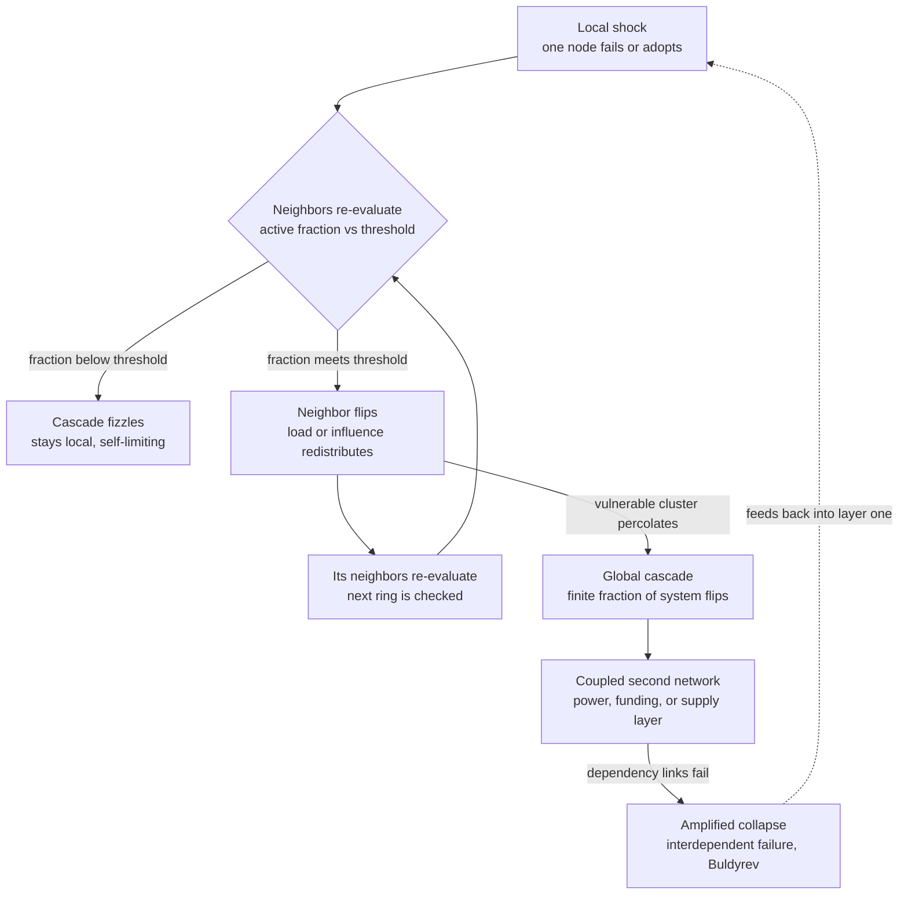

# 💥 Cascades and Systemic Risk

> [!abstract] TL;DR
> A **cascade** is a local failure or change that propagates through a network of coupled components, flipping neighbor after neighbor until it either **fizzles** (stays local, self-limiting) or goes **global** (a finite fraction of the whole system flips at once). Whether a shock dies out or spreads is not mostly about the size of the shock — it is about the **connectivity and thresholds** of the network. **Watts' global cascade model** shows that large cascades are simultaneously **rare and occasionally system-wide**, and that they are only possible inside a **cascade window** of intermediate connectivity: too sparse and the shock can't travel, too dense and each node is too well-buffered to tip. **Systemic risk** is the engineering and financial face of this: **interdependence, tight coupling, and efficiency** — the very things that make a system perform well in calm times — are exactly what convert a small local failure into a **2008-style contagion** or a continent-wide **blackout**. Mitigation means deliberately re-introducing slack: **modularity, buffers, circuit breakers, and firebreaks**.

---

## Intuition

**Analogy — a row of dominoes vs. a blackout grid.** Stand up a thousand dominoes. Tip one over. If they are spaced too far apart, the first one falls and nothing else happens — the shock **fizzles**. If they are packed just right, that single push travels the whole line — a **global cascade** from a trivial cause. Now make it worse: imagine the dominoes are not a single line but a **power grid**. When one overloaded transmission line trips, the current it was carrying does not vanish — it **re-routes onto neighboring lines**, which are now closer to their own limits and more likely to trip, dumping *their* load onto *their* neighbors. A single tree branch touching a wire in Ohio in August 2003 cascaded into a blackout that darkened 50 million people across the northeastern U.S. and Canada within hours.

The crucial, counter-intuitive lesson lives in both pictures: the **size of the trigger tells you almost nothing about the size of the outcome**. The same tiny push produces "nothing" a hundred times and "everything" once. What decides which happens is the **structure of the connections** — how many neighbors each element has, how much load or influence it takes to tip an element, and whether the tippable elements form a single connected mass or scattered islands.

---

## How It Works

### Core Mechanics

1. **Coupling turns a local event into a signal that travels.** In an isolated component a failure stays put. The moment components are **coupled** — electrically, financially, logistically, socially — one element's state becomes an *input* to its neighbors. Failure, load, or influence does not disappear when a node drops out; it **redistributes** onto whoever was connected to it.

2. **Every node has a threshold.** A node flips (fails, defaults, adopts, panics) when the fraction of its neighbors that have already flipped meets or exceeds its personal **threshold** φ. A cautious node (high φ) needs most of its neighbors to fall first; a fragile node (low φ) tips as soon as one does. This single rule — *flip if active-neighbor-fraction ≥ threshold* — is the heart of both **Granovetter's threshold models of collective behavior** (1978) and **Watts' cascade model** (2002).

3. **Vulnerable nodes and the "one-neighbor" trigger.** A node is **vulnerable** if it will flip when just *one* neighbor flips, i.e. when 1/k ≥ φ, where k is its degree. Sparse, low-threshold nodes are vulnerable; densely connected nodes are not, because one active neighbor is a small fraction of many. A cascade can only *start* to spread if the vulnerable nodes form a **connected cluster** that percolates across the network.

4. **The cascade window.** Plot cascade size against average connectivity z and you find a window, not a slope:
   - **Too sparse (below the window):** the network is fragmented into small components; a shock is trapped in its island and dies. **Connectivity is too low to conduct.**
   - **Too dense (above the window):** every node has so many neighbors that a single failure is a negligible fraction of each — no node is vulnerable, the vulnerable cluster stops percolating, and the shock is absorbed. **Connectivity is too high to be *sensitive*.**
   - **In between (the window):** the vulnerable cluster spans the network, and a single seed can trigger a system-wide flip. This is why global cascades are **rare** (they need this window *and* a seed that lands on the vulnerable cluster) yet **occasionally enormous**.

5. **Rare but heavy-tailed.** Because most seeds fizzle and a few go global, cascade sizes are **bimodal / heavy-tailed**: the distribution has a huge spike near zero and a second bump at "whole system." Averages lie here — the *expected* cascade is small, but the *variance* is where the catastrophe lives.

6. **Interdependent networks amplify fragility (Buldyrev et al., 2010).** Real systems are not one network but **coupled networks**: a power grid depends on a communications network that depends on the power grid. When node A in the grid fails, its dependent node B in the comms net fails, which knocks out node A′ in the grid that relied on B, and so on. This **back-and-forth between layers** produces an *abrupt, discontinuous* collapse — a first-order percolation transition — that is far more fragile than either network alone. **Coupling for efficiency is coupling for catastrophe.**

7. **Efficiency and tight coupling raise systemic risk (Perrow, *Normal Accidents*, 1984).** Systems that are **tightly coupled** (little slack, fast propagation, few substitutions) and **interactively complex** (many hidden, non-linear interactions) make some accidents *normal* — statistically inevitable — no matter how careful the operators. Lean, just-in-time, highly-optimized systems remove exactly the buffers that would have absorbed a shock. **Robustness costs efficiency; systems that refuse to pay that cost pay in cascades instead.**

### Flow / Architecture



---

## Key Concepts

### Secondary
- **Cascade:** a chain reaction where one element flipping causes the next to flip, and so on.
- **Threshold:** how much pressure from neighbors an element needs before it too flips — a cautious element needs a lot, a fragile element needs little.
- **Fizzle vs. global:** most shocks stop quickly and locally; a few, in the right structure, spread through the entire system.
- **The trigger size doesn't predict the outcome:** the same small push can do nothing a hundred times and cause a disaster once — structure decides, not the spark.

### Undergraduate
- **Watts global cascade model:** put a threshold φ on every node of a random network, seed a few nodes, and let anyone flip whose active-neighbor fraction reaches its threshold. Global cascades appear only inside a **cascade window** of intermediate average degree.
- **Vulnerable node:** a node that flips from a *single* active neighbor, i.e. degree k ≤ 1/φ. Cascades spread only when these form a connected, percolating cluster.
- **Granovetter threshold model:** collective behavior (riots, adoption, bank runs) as a distribution of individual thresholds — a single low-threshold actor can trigger a chain that sweeps in higher-threshold actors one domino at a time.
- **Financial contagion / systemic risk:** the risk that the failure of one institution propagates through the network of interbank exposures and knocks over others; the basis of **"too big to fail"** and **"too central to fail."**
- **Tight coupling (Perrow):** little slack between components, so a disturbance propagates fast and cannot be locally contained — the structural precondition for a "normal accident."

### Graduate
- **Percolation and the cascade condition:** Watts derives the window's boundaries by asking when the *global vulnerable cluster* percolates, using generating functions on the degree distribution. The window is bounded by two critical points where the giant vulnerable cluster is born and dies.
- **Bimodal cascade-size distribution:** near the *lower* window boundary, cascade sizes follow a power law with the same exponent as random-graph component sizes (τ ≈ 3/2); the system sits at a **critical point** where fluctuations span all scales.
- **Interdependent-network first-order transition (Buldyrev 2010):** coupling two networks changes the percolation transition from *second-order* (continuous) to *first-order* (abrupt), so the interdependent system fails **discontinuously and without warning** at a higher connectivity than a single network would.
- **DebtRank (Battiston et al., 2012):** a centrality-like measure of systemic importance in a financial network — the fraction of total economic value potentially affected if a node distresses — that captures **"too central to fail"** even for institutions that are not the largest.
- **Early-warning signals / critical slowing down (Scheffer et al., 2009):** as a coupled system approaches a tipping point, its recovery from small perturbations slows, so **variance and lag-1 autocorrelation rise** — a generic statistical precursor of an impending cascade, applicable from lakes to markets to grids.

---

## Python Demo

```python
# Watts' global-cascade model on random (Erdos-Renyi) networks, numpy only.
#
# RULE: every node has threshold phi. A node flips (adopts/fails) once the
# FRACTION of its neighbors that have flipped reaches phi. We seed a few nodes
# and let the flip propagate to a fixed point via a frontier queue.
#
# We show the two signature results:
#   (A) The CASCADE WINDOW: for fixed phi and a SINGLE random seed, global
#       cascades occur only for an intermediate average degree z. Too sparse
#       -> shock is trapped; too dense -> every node is too buffered to tip.
#   (B) TIPPING vs. LEVERAGE: cascade size vs. seed fraction for z below /
#       inside / above the window, showing when a tiny seed triggers the whole
#       system and when it does not.

import numpy as np
import matplotlib.pyplot as plt
from collections import deque

rng = np.random.default_rng(7)


def er_csr(N, z, rng):
    """Build an undirected Erdos-Renyi graph in CSR form (indptr, indices, deg).
    Sample about z*N/2 random edges, drop self-loops, symmetrize, then sort."""
    m = int(round(z * N / 2))
    src = rng.integers(0, N, size=m)
    dst = rng.integers(0, N, size=m)
    keep = src != dst                      # drop self-loops
    src, dst = src[keep], dst[keep]
    u = np.concatenate([src, dst])         # make each edge bidirectional
    v = np.concatenate([dst, src])
    order = np.argsort(u, kind="stable")   # group neighbors by source node
    u, v = u[order], v[order]
    deg = np.bincount(u, minlength=N)
    indptr = np.concatenate([[0], np.cumsum(deg)])
    return indptr, v.astype(np.int64), deg


def run_cascade(indptr, indices, deg, thresholds, seeds, N):
    """Deterministic threshold cascade to a fixed point. Returns #active nodes.
    active_nbrs[v] tracks how many of v's neighbors have flipped; v flips when
    active_nbrs[v] >= threshold[v] * deg[v] (fraction rule, no division)."""
    active = np.zeros(N, dtype=bool)
    active_nbrs = np.zeros(N, dtype=np.int64)
    q = deque()
    for s in seeds:
        if not active[s]:
            active[s] = True               # seeds are forced active
            q.append(s)
    while q:
        u = q.popleft()
        for idx in range(indptr[u], indptr[u + 1]):
            w = indices[idx]
            active_nbrs[w] += 1
            if (not active[w]) and deg[w] > 0 and active_nbrs[w] >= thresholds[w] * deg[w]:
                active[w] = True           # w just crossed its threshold
                q.append(w)
    return int(active.sum())


# ---------- (A) The cascade window: P(global) vs average degree z ----------
N_A, PHI, TRIALS_A = 1000, 0.18, 60       # phi = 0.18 is Watts' canonical value
z_grid = np.linspace(0.5, 10.0, 24)
p_global = np.zeros_like(z_grid)          # frequency of a system-wide cascade
mean_size = np.zeros_like(z_grid)         # mean final active fraction

for j, z in enumerate(z_grid):
    sizes = np.empty(TRIALS_A)
    for t in range(TRIALS_A):
        indptr, indices, deg = er_csr(N_A, z, rng)
        thr = np.full(N_A, PHI)
        seed = [int(rng.integers(0, N_A))]           # a single random seed
        sizes[t] = run_cascade(indptr, indices, deg, thr, seed, N_A) / N_A
    p_global[j] = np.mean(sizes > 0.05)              # "global" = reached >5% of nodes
    mean_size[j] = sizes.mean()


# ---------- (B) Tipping vs leverage: cascade size vs seed fraction ----------
N_B, GRAPHS = 1500, 25
rho_grid = np.linspace(0.001, 0.25, 18)
z_cases = {"z = 1.0  (below window)": 1.0,
           "z = 2.6  (inside window)": 2.6,
           "z = 8.0  (above window)": 8.0}
curves = {}

for label, z in z_cases.items():
    graphs = [er_csr(N_B, z, rng) for _ in range(GRAPHS)]   # reuse graphs across rho
    final = np.zeros_like(rho_grid)
    for i, rho in enumerate(rho_grid):
        vals = []
        for (indptr, indices, deg) in graphs:
            thr = np.full(N_B, PHI)
            k = max(1, int(rho * N_B))
            seeds = rng.choice(N_B, size=k, replace=False)
            vals.append(run_cascade(indptr, indices, deg, thr, seeds, N_B) / N_B)
        final[i] = np.mean(vals)
    curves[label] = final


# ---------------------------- plotting ----------------------------
fig, (axA, axB) = plt.subplots(1, 2, figsize=(13, 5))

axA.plot(z_grid, p_global, "o-", color="crimson", label="P(global cascade)")
axA.plot(z_grid, mean_size, "s--", color="navy", label="mean cascade size")
win = z_grid[p_global > 0.05]
if win.size:
    axA.axvspan(win.min(), win.max(), color="gold", alpha=0.25, label="cascade window")
axA.set_title(f"(A) Cascade window  (single seed, phi = {PHI})")
axA.set_xlabel("average degree  z")
axA.set_ylabel("fraction of network")
axA.legend(fontsize=8)
axA.grid(True, alpha=0.3)

for label, final in curves.items():
    axB.plot(rho_grid, final, "o-", linewidth=2, label=label)
axB.plot(rho_grid, rho_grid, "k:", linewidth=1, label="no amplification (y = x)")
axB.set_title("(B) Tipping vs. leverage  (cascade size vs. seed fraction)")
axB.set_xlabel("seed fraction  rho0")
axB.set_ylabel("final active fraction")
axB.legend(fontsize=8)
axB.grid(True, alpha=0.3)

plt.tight_layout()
plt.show()

# Console summary: where the window sits and the leverage effect.
if win.size:
    print(f"Cascade window (P>0.05): z in [{win.min():.1f}, {win.max():.1f}]")
print("Inside-window leverage: a {:.1%} seed already reaches {:.0%} of the network."
      .format(rho_grid[0], curves['z = 2.6  (inside window)'][0]))
```

Panel **(A)** reproduces Watts' signature result: `P(global cascade)` is *zero* for sparse networks (the shock is trapped in fragments), rises to a plateau inside an intermediate band of `z` (the **cascade window**, shaded), then falls back to zero as the network gets dense (every node too buffered to tip). Panel **(B)** shows the strategic payoff: **inside** the window a seed of well under 1% already ignites most of the network (huge leverage / a tipping point), **below** the window the cascade barely exceeds the seed you inject (it hugs the dashed `y = x` line — no amplification), and **above** the window you must directly seed a large fraction before anything global happens (a hard threshold to overcome). Same rule, same threshold — only the connectivity changed.

---

## Real-World Applications

- **Power-grid blackouts.** The 2003 Northeast blackout and 2003 Italy blackout are textbook load-redistribution cascades: a tripped line dumps its power onto neighbors, which trip in turn. The Italy case is the empirical anchor of Buldyrev et al.'s **interdependent-network** theory — the grid and the internet controlling it took each other down.
- **Financial contagion and systemic risk (2008).** Interbank lending, repo, and derivatives form a dense network of exposures. Lehman Brothers' failure propagated because counterparties who were owed money became unable to pay *their* counterparties — a default cascade. Regulators now stress-test for **"too big to fail"** and, via measures like **DebtRank**, **"too central to fail."** See [[Global_Financial_Crises]] and [[Financial_History_and_Crises]].
- **Supply-chain cascades.** A single fab, port, or Tier-2 supplier failing (Fukushima 2011, the 2021 chip shortage, the Suez blockage) ripples up the chain because just-in-time inventory removed the buffers that used to absorb it — **efficiency traded for fragility**, exactly Perrow's point.
- **Social and information cascades.** Viral adoption, bank runs, protest mobilization, and misinformation spread follow **Granovetter threshold** dynamics: a small nucleus of low-threshold actors can trigger a self-reinforcing wave that pulls in the cautious majority.
- **Microservice / distributed-system failures.** A slow downstream service exhausts a shared thread pool, which stalls upstream callers, which stall *their* callers — a **retry-storm cascade**. Contained by [[Circuit_Breaker]] and [[Bulkhead_Pattern]] (deliberate firebreaks and isolation).
- **Ecosystems and climate tipping.** Trophic cascades (removing a keystone predator) and coupled climate tipping elements (ice sheets, monsoons, forests) can flip abruptly, with **critical-slowing-down** early-warning signals preceding the transition.

---

## Common Pitfalls

- **Judging risk by trigger size.** Because cascade size is nearly independent of shock size, "it was only a small failure" is not reassurance — it is precisely the profile of events that occasionally go global. Manage the **structure**, not just the sparks.
- **Assuming more connectivity is always safer (redundancy fallacy).** Connectivity that shares *load* also shares *failure*. Adding links can push a system *into* the cascade window or, across coupled networks, replace a gentle failure with an abrupt one. Redundancy helps only if failures are **independent**; cascades are the case where they are not.
- **Optimizing away all slack.** Lean, tightly-coupled, just-in-time systems maximize throughput in calm periods and have nothing left to absorb a shock. **Buffers and modularity look like waste right up until the cascade they would have stopped.**
- **Averaging a bimodal distribution.** Reporting the *mean* cascade size hides the catastrophe: the mean can be tiny while the tail contains a system-ending event. Use tail risk (VaR/ES-style thinking), not expectations.
- **Ignoring hidden coupling.** The most dangerous dependencies are the ones nobody drew on the architecture diagram — the shared power feed, the common cloud region, the single Tier-3 supplier everyone quietly relies on. Interdependent-network fragility comes from **couplings you didn't know you had.**
- **Treating early-warning signals as guarantees.** Rising variance and autocorrelation (critical slowing down) can precede a tipping point, but cascades can also arrive with **no warning** — especially the first-order transitions of interdependent networks. Absence of a signal is not safety.

---

## Related Concepts

- [[Feedback_Loops_and_Causality]] — a cascade *is* a reinforcing (positive) feedback loop running across a network: each flip makes the next flip more likely, the same runaway logic behind bank runs and viral spread.
- [[General_Systems_Theory]] — cascades and systemic risk are what happen at the **boundaries between coupled open systems**; interdependence is the double edge of the open-system view.
- [[Global_Financial_Crises]] — the macroeconomic account of 2008-style contagion, too-big-to-fail, and systemic collapse this note models structurally.
- [[Financial_History_and_Crises]] — Minsky's instability hypothesis and Kindleberger's anatomy of a bubble: *why stability breeds the next cascade*, the historical mirror of Perrow's tight coupling.
- [[Circuit_Breaker]] — the software mitigation for a failure cascade: trip open to stop a failing dependency from taking the whole system down, a literal firebreak.
- [[Bulkhead_Pattern]] — isolation and modularity so one flooded compartment can't sink the ship; the engineering embodiment of "modularity limits cascade reach."
- [[Credit_Risk_and_Ratings]] — default and downgrade contagion along counterparty exposures, the edges of the financial cascade network.
- [[Operational_Risk]] — the risk-management framing of tail events and interdependent operational failures within an institution.

---

## Review Questions

1. **(Conceptual)** Watts' model produces global cascades only for *intermediate* average degree, vanishing when the network is either very sparse or very dense. Explain the two *different* physical reasons the cascade dies at each end of the window, and why "add more connections" is therefore not a general recipe for either fragility or safety.
2. **(Scenario)** You run a payments platform on microservices. A single downstream fraud-check service slows to a crawl during a traffic spike, and within 40 seconds the entire checkout flow is down. Diagnose this as a cascade: what plays the role of "threshold," what is the "load redistribution," and which two mitigations from this note would you deploy — and at which layer — to bound the blast radius next time?
3. **(Trade-off / critique)** Perrow argues that in tightly-coupled, interactively-complex systems some accidents are *normal* — inevitable. A CFO counters that the just-in-time, zero-slack supply chain saved the company millions a year for a decade. Using the interdependent-network result (Buldyrev) and the bimodal nature of cascade sizes, argue whether the CFO's savings were real, and how you would price the systemic risk that efficiency bought.

---

## Sources

- Watts, D. J. (2002). "A simple model of global cascades on random networks." *Proceedings of the National Academy of Sciences, 99*(9), 5766–5771. — the threshold cascade model and the cascade window.
- Granovetter, M. (1978). "Threshold Models of Collective Behavior." *American Journal of Sociology, 83*(6), 1420–1443. — the individual-threshold origin of collective cascades.
- Buldyrev, S. V., Parshani, R., Paul, G., Stanley, H. E., & Havlin, S. (2010). "Catastrophic cascade of failures in interdependent networks." *Nature, 464*, 1025–1028. — amplified, abrupt fragility of coupled networks.
- Battiston, S., Puliga, M., Kaushik, R., Tasca, P., & Caldarelli, G. (2012). "DebtRank: Too Central to Fail? Financial Networks, the FED and Systemic Risk." *Scientific Reports, 2*, 541. — measuring systemic importance in financial networks.
- Perrow, C. (1984). *Normal Accidents: Living with High-Risk Technologies.* Basic Books. — tight coupling, interactive complexity, and why efficiency breeds catastrophe.
- Scheffer, M., et al. (2009). "Early-warning signals for critical transitions." *Nature, 461*, 53–59. — critical slowing down as a generic precursor of tipping.

---

#complexity #cascades #systemic-risk #contagion #tipping-point
