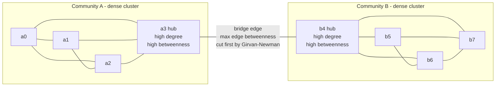

# 🕸️ Centrality and Community Structure

> [!abstract] TL;DR
> A network is not a democracy of equal nodes. **Centrality** measures ask *which nodes matter most*, and there is no single answer: **degree** counts direct connections, **closeness** rewards nodes near everyone, **betweenness** finds the bottlenecks every path must cross, and **eigenvector centrality** — of which **Google's PageRank** is the directed-graph, random-walk version — says *you are important if important nodes point to you*, a self-referential definition solved as the dominant eigenvector of the adjacency matrix via **power iteration**. **Community structure** is the complementary question: real networks are lumpy, splitting into densely connected groups with sparse links between them. **Modularity** (Newman–Girvan) scores how good a partition is, and algorithms like **Girvan–Newman** (peel high-betweenness edges) and **Louvain** (greedily maximize modularity) recover these groups — subject to a **resolution limit** that hides small communities inside big graphs. Together these tools identify influencers, bottlenecks, functional modules in biology, and social groups, and they rank the web.

## Intuition

**Analogy:** Picture a city's road map and ask "which intersections matter most?" You immediately notice the question is ambiguous. One intersection matters because *dozens of streets meet there* — that is **degree**: raw local connectivity. Another matters because *from it you can reach every neighborhood in a few blocks* — that is **closeness**: proximity to the whole. A third is a narrow bridge over a river: hardly any streets touch it, but *nearly every cross-town trip is forced through it*, so if it jams the city halts — that is **betweenness**: control of flow. And a quiet cul-de-sac that happens to connect only to millionaires' driveways borrows their prestige — you are important if *important places* connect to you — that is **eigenvector centrality**, the idea Google turned into **PageRank** for web pages.

Now zoom out from single intersections to the whole map, and a second pattern appears: the city is not a uniform mesh. It clumps into **neighborhoods** — dense tangles of local streets — joined to each other by a handful of highways and bridges. Those clumps are **communities**, and detecting them means finding the cuts (the bridges) that separate dense insides from sparse betweens. Centrality asks *who is the important node*; community structure asks *what are the natural groups* — and, tellingly, the very bridges that betweenness flags as critical are exactly the edges you cut to reveal the communities.

---

## How It Works

### Core Mechanics

Let a graph have adjacency matrix $A$ where $A_{ij} = 1$ if node $i$ links to node $j$ (weighted or directed variants generalize this).

**1. Degree centrality — "how many friends do you have?"**
The simplest measure: $C_D(i) = \sum_j A_{ij}$, the number of edges touching $i$, usually normalized by $n-1$ (the maximum possible). It is purely *local* — it sees only your immediate neighborhood and cannot tell a hub connected to nobodies from a hub connected to other hubs. Cheap to compute, easy to game, and a surprisingly strong baseline.

**2. Closeness centrality — "how near are you to everyone?"**
$C_C(i) = \dfrac{n-1}{\sum_j d(i,j)}$ where $d(i,j)$ is the shortest-path distance. A node with small total distance to all others sits at the network's "center of gravity" and can broadcast information with the fewest hops. Requires all-pairs shortest paths (BFS from every node in unweighted graphs), and it is ill-defined on disconnected graphs where some $d(i,j)=\infty$ — the **harmonic** variant $\sum_j 1/d(i,j)$ fixes that.

**3. Betweenness centrality — "how many paths run through you?"**
$C_B(i) = \sum_{s \ne i \ne t} \dfrac{\sigma_{st}(i)}{\sigma_{st}}$, where $\sigma_{st}$ is the number of shortest paths from $s$ to $t$ and $\sigma_{st}(i)$ how many of them pass through $i$. This finds **bottlenecks and brokers**: nodes (or, for edges, bridges) that control flow between otherwise separated regions. A node can have low degree yet enormous betweenness (a single bridge between two cities). It is the most expensive classic measure; Brandes' algorithm computes it in $O(nm)$ for unweighted graphs.

**4. Eigenvector centrality — "you are important if important nodes point to you."**
Here the definition is *recursive*: your score is proportional to the sum of your neighbors' scores, $x_i = \frac{1}{\lambda}\sum_j A_{ij} x_j$, i.e. $A\mathbf{x} = \lambda \mathbf{x}$. Your importance is an **eigenvector** of the adjacency matrix. By the **Perron–Frobenius theorem**, a connected non-negative $A$ has a unique positive dominant eigenvector (belonging to the largest eigenvalue $\lambda_{\max}$), and that vector *is* the centrality. It captures *quality* of connections, not just quantity: being linked to well-connected nodes lifts your score.

**5. Power iteration — the spectral computation.**
You do not need to solve a full eigendecomposition. Start with any positive vector $\mathbf{x}_0$ and repeatedly multiply by $A$, renormalizing each step:
$$\mathbf{x}_{k+1} = \frac{A\mathbf{x}_k}{\lVert A\mathbf{x}_k \rVert}.$$
Because $A\mathbf{x}$ amplifies the component along the dominant eigenvector fastest, $\mathbf{x}_k$ converges geometrically to it at rate $\lvert\lambda_2/\lambda_1\rvert$. This is the same engine that powers **PageRank**.

**6. PageRank — eigenvector centrality for directed graphs (Google's algorithm).**
On the web, links are *directed* (a citation), so plain eigenvector centrality misbehaves: dangling nodes (no out-links) and sink cliques trap all the score. PageRank fixes this by modeling a **random surfer** who, with probability $d \approx 0.85$, follows a random out-link, and with probability $1-d$ **teleports** to a uniformly random page:
$$PR(i) = \frac{1-d}{n} + d \sum_{j \to i} \frac{PR(j)}{L(j)},$$
where $L(j)$ is $j$'s out-degree. This is exactly the **stationary distribution of a Markov chain** on the "Google matrix" — eigenvector centrality made robust with a damping/teleport term. The teleport guarantees the chain is irreducible and aperiodic, so a unique stationary vector exists and power iteration converges.

**7. Community structure and modularity.**
Real networks are **modular**: nodes cluster into groups with many internal edges and few external ones. To decide whether a proposed partition is *good*, Newman and Girvan defined **modularity**:
$$Q = \frac{1}{2m}\sum_{ij}\left(A_{ij} - \frac{k_i k_j}{2m}\right)\delta(c_i, c_j),$$
where $m$ is the edge count, $k_i$ the degree of $i$, and $\delta(c_i,c_j)=1$ iff $i,j$ share a community. The term $k_ik_j/2m$ is the number of edges expected *by chance* under a degree-preserving random graph. So $Q$ = (fraction of edges inside communities) minus (fraction expected at random). $Q$ near 0 means the partition is no better than random; higher $Q$ (up to ~1) means strong community structure.

**8. Community-detection algorithms.**
- **Girvan–Newman (divisive):** repeatedly compute **edge betweenness** and remove the highest-betweenness edge (the bridges between clusters), producing a dendrogram; cut it at the level of maximum $Q$. Intuitive but $O(m^2 n)$ — too slow for large graphs.
- **Louvain (agglomerative, greedy modularity maximization):** each node starts alone; greedily move nodes into the neighboring community that most increases $Q$, then *collapse* each community into a super-node and repeat. Near-linear in practice, the workhorse for million-node graphs. (Its successor **Leiden** repairs a defect where Louvain can produce internally disconnected communities.)
- **Spectral partitioning:** use the eigenvectors of the **graph Laplacian** $L = D - A$; the sign structure of the second-smallest eigenvector (the *Fiedler vector*) gives a good bisection, connecting community detection back to the same linear-algebra machinery as eigenvector centrality.

### Flow / Architecture



---

## Key Concepts

### Secondary
- **Centrality:** a score for how important or influential a node is in a network. Different measures capture different kinds of importance.
- **Degree:** how many direct connections a node has — the most obvious notion of "popular."
- **Betweenness / bottleneck:** a node or bridge that lots of paths must pass through, so removing it disconnects or slows the network.
- **Community:** a group of nodes with many links inside the group and few links to the outside — a "cluster" or "neighborhood."
- **PageRank:** Google's original ranking idea — a page is important if important pages link to it.

### Undergraduate
- **Closeness vs betweenness:** closeness rewards being *near* everyone (fast broadcasting); betweenness rewards *sitting between* everyone (controlling flow). A node can score high on one and low on the other.
- **Eigenvector centrality:** a node's importance equals a scaled sum of its neighbors' importances, so it is the dominant eigenvector of the adjacency matrix — quality of connections, not just quantity.
- **Power iteration:** repeatedly multiplying a starting vector by the adjacency matrix and renormalizing converges to the dominant eigenvector; the practical way to compute eigenvector centrality and PageRank.
- **Modularity $Q$:** measures how much more clustered a partition is than a random graph with the same degrees; used both to *evaluate* and to *drive* community detection.
- **Girvan–Newman vs Louvain:** divisive (remove high-betweenness bridges) versus agglomerative greedy (merge to raise $Q$); Louvain scales, Girvan–Newman does not.

### Graduate
- **PageRank as a Markov chain:** PageRank is the stationary distribution of a random walk on the damped "Google matrix" $M = dP + (1-d)\frac{1}{n}\mathbf{1}\mathbf{1}^\top$. Teleportation makes the chain irreducible and aperiodic (a rank-1 perturbation), guaranteeing a unique positive stationary vector and a spectral gap $\lambda_2 \le d$ that bounds power-iteration convergence.
- **Spectral community detection:** minimizing the normalized cut relaxes to an eigenproblem on the Laplacian $L = D - A$ (or its normalized form $L_{sym} = I - D^{-1/2}AD^{-1/2}$); the Fiedler vector bisects the graph, and $k$ leading eigenvectors feed $k$-means for $k$-way clustering — a bridge to manifold learning and spectral clustering.
- **The resolution limit (Fortunato–Barthélemy):** modularity maximization *cannot* resolve communities smaller than roughly $\sqrt{2m}$ edges; below that scale, genuine small communities get merged because the null model's expected edge count shrinks with total graph size. Multi-resolution methods add a tunable $\gamma$ parameter, $Q_\gamma = \frac{1}{2m}\sum(A_{ij} - \gamma \frac{k_ik_j}{2m})\delta$, to probe multiple scales.
- **Overlapping and hierarchical communities:** real nodes belong to several groups at once (a person in a family, a workplace, and a hobby club). Hard partitions miss this; **clique percolation**, **link communities** (cluster *edges* instead of nodes), and **mixed-membership stochastic blockmodels** admit overlap, at the cost of higher complexity and harder evaluation.
- **Choosing a centrality is choosing a flow model:** Borgatti showed each centrality implicitly assumes *how things move* on the network — shortest paths (betweenness/closeness), random walks (eigenvector/PageRank), or parallel duplication (degree). Using the wrong measure for the wrong flow (e.g. betweenness for something that diffuses randomly) gives misleading "important" nodes.

---

## Python Demo

```python
# Centrality on a small two-community graph, using ONLY numpy + matplotlib.
# We (1) build an adjacency matrix by hand, (2) compute DEGREE centrality,
# (3) compute EIGENVECTOR centrality via POWER ITERATION on A -- the same
# spectral engine behind Google's PageRank -- and (4) draw the graph with
# node sizes proportional to eigenvector centrality, then print the ranking.

import numpy as np
import matplotlib.pyplot as plt

# ---- 1. Build the graph: two dense clusters joined by a single bridge ----
# Nodes 0-3 form community A, nodes 4-7 form community B.
# The only inter-community edge is 3--4 (the bridge / max-betweenness edge).
labels = ["a0", "a1", "a2", "a3", "b4", "b5", "b6", "b7"]
n = len(labels)
edges = [
    (0, 1), (0, 2), (0, 3), (1, 2), (1, 3), (2, 3),   # community A (near-clique)
    (4, 5), (4, 6), (4, 7), (5, 6), (5, 7), (6, 7),   # community B (near-clique)
    (3, 4),                                            # the bridge
]

A = np.zeros((n, n))
for i, j in edges:
    A[i, j] = 1.0
    A[j, i] = 1.0          # undirected -> symmetric adjacency

# ---- 2. Degree centrality: count neighbors, normalize by (n-1) ----
degree = A.sum(axis=1)
degree_centrality = degree / (n - 1)

# ---- 3. Eigenvector centrality via power iteration ----
# Repeatedly x <- A x / ||A x||. For a connected non-negative A, Perron-
# Frobenius guarantees convergence to the unique POSITIVE dominant
# eigenvector; the norm at convergence approximates the largest eigenvalue.
def eigenvector_centrality(A, iters=1000, tol=1e-12):
    x = np.ones(A.shape[0]) / np.sqrt(A.shape[0])   # positive start
    lam = 0.0
    for _ in range(iters):
        y = A @ x
        lam = np.linalg.norm(y)                     # dominant eigenvalue estimate
        y = y / lam
        if np.linalg.norm(y - x) < tol:             # converged
            x = y
            break
        x = y
    return x, lam

evec, lam_max = eigenvector_centrality(A)
evec = evec / evec.sum()                            # normalize to sum 1 (like PageRank)

# ---- 4. Visualize: fixed layout, node size ~ eigenvector centrality ----
pos = np.array([
    [0.0, 1.0], [1.0, 2.0], [1.0, 0.0], [2.0, 1.0],   # community A on the left
    [4.0, 1.0], [5.0, 2.0], [5.0, 0.0], [6.0, 1.0],   # community B on the right
])

plt.figure(figsize=(9, 5))
for i, j in edges:                                  # draw edges first (behind nodes)
    style = dict(color="crimson", lw=2.5, zorder=1) if (i, j) == (3, 4) \
            else dict(color="0.6", lw=1.2, zorder=1)
    plt.plot([pos[i, 0], pos[j, 0]], [pos[i, 1], pos[j, 1]], **style)

sizes = 300 + 6000 * (evec / evec.max())            # area proportional to centrality
sc = plt.scatter(pos[:, 0], pos[:, 1], s=sizes, c=evec,
                 cmap="viridis", edgecolors="black", zorder=2)
for i, name in enumerate(labels):
    plt.annotate(name, pos[i], ha="center", va="center",
                 fontsize=9, fontweight="bold", color="white", zorder=3)

plt.colorbar(sc, label="eigenvector centrality")
plt.title("Two communities + a bridge  |  node size = eigenvector centrality\n"
          "(red edge 3-4 is the bridge: max betweenness, cut first by Girvan-Newman)")
plt.axis("off")
plt.tight_layout()
plt.show()

# ---- 5. Print the ranking ----
print(f"Dominant eigenvalue (power iteration): {lam_max:.4f}\n")
print(f"{'node':>5} {'degree':>8} {'deg_cent':>10} {'eigen_cent':>12}")
order = np.argsort(-evec)                            # sort by eigenvector centrality
for i in order:
    print(f"{labels[i]:>5} {int(degree[i]):>8} "
          f"{degree_centrality[i]:>10.3f} {evec[i]:>12.4f}")
```

Running it, the two hub nodes `a3` and `b4` (each with degree 4, and each attached to the bridge and to a dense cluster) top both rankings, while the peripheral cluster members tie beneath them. The plot shows two tight clusters joined by a single red edge, with the two bridge-hubs drawn largest. The printed dominant eigenvalue is the Perron root of the adjacency matrix, and the eigenvector column is exactly what PageRank generalizes once links become directed and a teleport term is added.

---

## Real-World Applications

- **Web search (PageRank):** Google's original ranking treated a hyperlink as a vote and computed the stationary distribution of a random surfer — eigenvector centrality on the directed web graph — to order billions of pages by importance rather than keyword count.
- **Identifying influencers and super-spreaders:** in epidemiology and marketing, high-degree and high-eigenvector nodes are the individuals whose vaccination (or targeting) most reduces spread; betweenness flags the brokers connecting otherwise separate populations.
- **Infrastructure bottlenecks:** in power grids, transport, and the internet backbone, high-betweenness nodes and edges are single points of failure whose outage fragments the network — exactly the elements to harden or add redundancy around.
- **Functional modules in biology:** community detection on protein–protein interaction and gene co-expression networks reveals **functional modules** (complexes, pathways); genes clustering together often share function, letting researchers annotate unknowns by their community.
- **Social group discovery:** modularity-based detection on friendship, email, and collaboration graphs recovers departments, interest groups, and echo chambers — Zachary's karate club (a real club that split in two) is the canonical test where community detection predicts the actual schism.
- **Fraud and security:** anomalous centrality (a low-profile account with sudden high betweenness) and tightly knit communities of colluding accounts surface money-laundering rings and bot networks.

---

## Common Pitfalls

- **Assuming one centrality is "the" centrality.** Degree, closeness, betweenness, and eigenvector rank nodes differently and can disagree wildly; a low-degree bridge is invisible to degree yet dominant in betweenness. Always match the measure to the *flow* you care about (random walk vs shortest path vs broadcast).
- **Running plain eigenvector centrality on directed or disconnected graphs.** Without damping/teleportation, score pools in sinks and dangling nodes and the iteration may not even converge — this is precisely why PageRank exists. On disconnected graphs, closeness blows up too; use harmonic closeness.
- **Reading modularity $Q$ as ground truth.** High $Q$ can appear even in random graphs, and *maximum* $Q$ is NP-hard to find, so heuristics report local optima. Different runs of Louvain give different partitions; validate with a null model and repeated runs.
- **The resolution limit.** Modularity maximization silently merges communities smaller than about $\sqrt{2m}$ edges, so in a large graph real small groups vanish. If you expect small communities, use a multi-resolution parameter $\gamma$ or methods not based on modularity.
- **Forcing hard, non-overlapping partitions.** Standard algorithms assign each node to exactly one community, but real membership overlaps (people belong to many groups). Overlapping methods (clique percolation, link communities) are needed, or you will artificially split shared hubs.
- **Betweenness at scale.** Exact betweenness is $O(nm)$ and infeasible for very large graphs; use approximate/sampled betweenness, and never recompute it naively inside a Girvan–Newman loop on big networks.
- **Louvain's disconnected communities.** Louvain can output a "community" that is internally disconnected; if connectivity matters, use **Leiden**, which guarantees connected, well-formed communities.

---

## Related Concepts

- [[Network_Science_Fundamentals]] — the parent note: degree distributions, small-world and scale-free structure, and the graph models on which centrality and communities are defined.
- [[Eigenvalues_and_Eigenvectors]] — eigenvector centrality *is* the dominant eigenvector of the adjacency matrix; power iteration is the numerical method that finds it.
- [[Markov_Chains]] — PageRank is the stationary distribution of a random-walk Markov chain on the damped Google matrix; teleportation ensures irreducibility and a unique stationary vector.
- [[Graph_Representation]] — adjacency matrices vs adjacency lists, the data structures that make centrality and community computations tractable at scale.
- [[BFS]] — breadth-first search from every node computes the shortest-path distances that closeness and betweenness centrality depend on in unweighted graphs.
- [[Dijkstra]] — the weighted-graph shortest-path algorithm underlying closeness and betweenness when edges carry costs.
- [[Strongly_Connected_Components]] — directed-graph connectivity that determines where PageRank score can accumulate and why dangling nodes and sinks need special handling.
- [[Social_Networks_and_Social_Ties]] — the sociological reading: weak ties as bridges (high betweenness) and the social meaning of centrality and cohesive groups.
- [[Social_Capital_and_Trust]] — brokerage across "structural holes" (a betweenness idea) versus closure within dense communities as two sources of social capital.
- [[General_Systems_Theory]] — networks as the structural substrate of systems; communities are the modular subsystems whose interactions produce emergent whole-network behavior.

---

## Review Questions

1. **(Conceptual)** A node has the *lowest degree* in the entire network yet the *highest betweenness*. Draw or describe a network where this happens, and explain what real-world role such a node plays and why removing it is far more damaging than removing a high-degree hub.
2. **(Scenario)** You must rank web pages, but plain eigenvector centrality sends almost all the score into a small cluster of pages that link only to each other (a "spider trap"), and some pages have no out-links at all. Explain precisely what PageRank's damping factor $d$ and teleportation term do to each pathology, and why the resulting Google matrix has a unique stationary distribution that power iteration reliably converges to.
3. **(Trade-off / critique)** You run Louvain on a 2-million-node social graph and get a partition with modularity $Q = 0.72$. A colleague insists there are meaningful communities of ~15 people that your result never shows. Explain, using the resolution limit and the definition of $Q$, why a high global modularity can be *consistent* with genuine small communities being invisible, and describe two concrete changes to your method that could recover them — noting the cost of each.

---

## Sources

- Newman, M. E. J. (2010). *Networks: An Introduction.* Oxford University Press. — the standard graduate text; chapters on centrality measures, modularity, and community detection.
- Page, L., Brin, S., Motwani, R., & Winograd, T. (1999). ["The PageRank Citation Ranking: Bringing Order to the Web."](http://ilpubs.stanford.edu:8090/422/) Stanford InfoLab. — the original PageRank technical report.
- Girvan, M., & Newman, M. E. J. (2002). ["Community structure in social and biological networks."](https://www.pnas.org/doi/10.1073/pnas.122653799) *PNAS, 99*(12), 7821–7826. — edge-betweenness community detection and the modularity idea.
- Blondel, V. D., Guillaume, J.-L., Lambiotte, R., & Lefebvre, E. (2008). ["Fast unfolding of communities in large networks."](https://iopscience.iop.org/article/10.1088/1742-5468/2008/10/P10008) *J. Stat. Mech.* — the Louvain algorithm.
- Fortunato, S., & Barthélemy, M. (2007). ["Resolution limit in community detection."](https://www.pnas.org/doi/10.1073/pnas.0605965104) *PNAS, 104*(1), 36–41. — proof that modularity cannot resolve small communities.

---

#complexity #centrality #community-detection #pagerank #modularity
