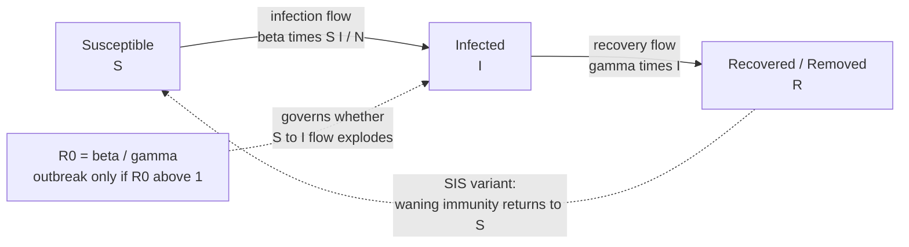

# 🦠 Network Dynamics and Contagion

> [!abstract] TL;DR
> Once you have a network, the interesting question is what *flows across it*: a virus, a rumor, a bank failure, a new dance move. **Network dynamics** studies these processes running **on** a fixed graph (as opposed to the slower dynamics **of** the graph itself rewiring). The workhorse is the **compartmental epidemic model**: **SIR** (Susceptible → Infected → Recovered, one-shot outbreak) and **SIS** (Susceptible → Infected → Susceptible, endemic churn). Their fate is decided by the **basic reproduction number** $R_0$ — the average number of secondary cases one case produces — and an **epidemic threshold**: spread only takes off when $R_0 > 1$. The crucial twist is **topology**: on a **scale-free** network, hubs act as **super-spreaders** and the epidemic threshold can **vanish**, so even feeble pathogens spread. Not everything spreads like a germ, though — **complex contagions** (adopting risky behaviors, norms, protests) need **social reinforcement** from *multiple* infected neighbors, which changes everything about who catches on and how you'd intervene.

## Intuition

**Analogy — a lit match in three different rooms.** Drop a lit match into a room and whether you get a fire depends on two things: how *ignitable* the stuff around it is, and how the stuff is *arranged*. Toss the match onto damp scattered leaves and it fizzles — each leaf might ignite one neighbor, or none, so the flame dies (this is $R_0 < 1$). Toss it into dry, densely packed brush and each patch lights several neighbors, so the fire runs away (this is $R_0 > 1$). Now change only the *arrangement*: pile most of the brush against a few central support beams that touch every other pile. Light any beam and the whole room goes, no matter how damp the leaves — that is a **hub** in a **scale-free** network, the reason a single super-spreader can ignite an outbreak that "shouldn't" have spread.

A contagion is any match: a flu virus, a meme, a margin call, a fashion. The **network** is the arrangement of brush. **Contagion dynamics** is the study of when the match catches, how fast the fire races, how big it gets, and — the engineer's question — which beams to soak (vaccinate, firewall, deplatform) to stop it. And crucially: some fires need one spark per patch (a *simple* contagion, like a virus), while others only catch when a patch is touched by flames on *several* sides at once (a *complex* contagion, like joining a risky protest).

---

## How It Works

### Dynamics ON a network vs dynamics OF a network

Two clocks tick in every real system. The **structure** changes slowly — you make and drop friendships, roads get built, trade routes shift: this is the dynamics *of* the network. Meanwhile a **state** rides on top of that structure and changes fast — you catch a cold, hear a rumor, panic and sell: this is dynamics *on* the network. When the process on top is much faster than the rewiring underneath (a flu burns through in weeks; the friendship graph barely moves), we treat the graph as **frozen** and study the spreading process alone. That separation of timescales is what makes contagion modeling tractable, and it is the regime this note lives in.

### Compartmental models: SIR and SIS

Divide the population into **compartments** by disease state and write rules for the flows between them.

- **SIR** — each node is **S**usceptible, **I**nfected, or **R**ecovered (immune or dead). Infected nodes transmit to susceptible neighbors and then recover *permanently*. Because R is an absorbing state, an SIR outbreak is a **one-shot wave**: it grows, peaks, and burns out as it runs out of susceptibles. Models measles, flu, COVID waves.
- **SIS** — recovery returns you to **S**usceptible; there is no lasting immunity. The infection can therefore become **endemic**, settling at a steady prevalence where new infections balance recoveries. Models the common cold, gonorrhea, computer worms that reinfect patched-then-unpatched machines, and recurring rumors.

The **mean-field** (well-mixed) SIR equations assume everyone can meet everyone with equal probability:

$$\frac{dS}{dt} = -\beta \frac{S I}{N}, \qquad \frac{dI}{dt} = \beta \frac{S I}{N} - \gamma I, \qquad \frac{dR}{dt} = \gamma I$$

where $\beta$ is the transmission rate per contact and $\gamma$ is the recovery rate, so $1/\gamma$ is the mean infectious period.

### $R_0$ and the epidemic threshold

The **basic reproduction number** is
$$R_0 = \frac{\beta}{\gamma}$$
— the expected number of secondary infections caused by one infected individual in a fully susceptible population. It is the single most important number in epidemiology, and it hides a sharp phase transition:

- $R_0 < 1$: each case replaces itself with *fewer* than one new case. The chain **dies out**. No epidemic, regardless of the seed.
- $R_0 > 1$: each case more than replaces itself. Infections grow **exponentially** early on (a pure reinforcing feedback loop) until susceptibles are depleted.
- $R_0 = 1$: the **epidemic threshold** — the knife's edge separating fizzle from firestorm.

Early growth is driven by a reinforcing loop; the eventual peak and burnout come from a balancing loop as the susceptible pool empties (see [[Feedback_Loops_and_Causality]]). The final fraction infected obeys the transcendental **final-size relation** $R_\infty = 1 - e^{-R_0 R_\infty}$, and **herd immunity** kicks in once a fraction $1 - 1/R_0$ of the population is immune — the basis of every vaccination target.

### Topology changes everything: hubs and the vanishing threshold

The mean-field $R_0 = \beta/\gamma$ assumes homogeneous mixing. Real contact networks are wildly **heterogeneous**. On a network, the reproduction number depends on the **degree distribution**:
$$R_0 \;\propto\; \frac{\beta}{\gamma}\cdot\frac{\langle k^2\rangle}{\langle k\rangle}$$
The quantity $\langle k^2\rangle / \langle k\rangle$ measures degree *heterogeneity*. On a **scale-free** network (degree distribution $P(k)\sim k^{-\gamma_{deg}}$ with $2 < \gamma_{deg} \le 3$), the second moment $\langle k^2\rangle$ **diverges** as the network grows. The startling consequence (Pastor-Satorras & Vespignani, 2001): the **epidemic threshold vanishes** — in the large-network limit there is *no* minimum transmissibility below which the disease dies out. Even a barely-transmissible pathogen persists, because sooner or later it reaches a **hub** with enormous degree that reignites the whole population. Hubs are **super-spreaders**: a small number of extremely well-connected nodes do most of the transmission. This is why highly-connected individuals, airports, and central servers dominate spread, and why *who* you immunize matters more than *how many* (see [[Small_World_and_Scale_Free_Networks]]).

### Simple vs complex contagion

Diseases are **simple contagions**: one exposure to one infected neighbor can transmit, and each contact is an independent chance. But many social things — adopting a risky new technology, joining a strike, changing a deep-seated norm, believing an unverified claim — are **complex contagions** (Centola & Macy, 2007). They require **social reinforcement**: you need to be exposed by *several* different neighbors before you adopt, because adoption carries risk, cost, or credibility hurdles that a single voice cannot overcome. This flips a famous result on its head. The **long-range "weak ties"** of a small-world network are superb at spreading *simple* contagions fast (one bridge is enough), but they *hurt* complex contagions, which need the **wide, redundant local bridges** of clustered communities to accumulate reinforcement. So behaviors often spread better through dense neighborhoods than through the shortcuts that speed up germs and gossip.

### Diffusion, cascades, and thresholds

The same machinery describes how *innovations* and *ideas* spread:

- **Rogers' Diffusion of Innovations** and the **Bass model** produce the classic **S-curve** of cumulative adoption: slow start (innovators, early adopters), steep middle (the early/late majority as social proof compounds), long tail (laggards). The Bass model splits adopters into those driven by external **innovation** (advertising, $p$) and internal **imitation** (word-of-mouth, $q$).
- **Granovetter's threshold model** (1978): each person has a personal **threshold** — the fraction (or number) of others who must already have acted before they will. A crowd's behavior is decided not by average radicalism but by the *distribution* of thresholds. One person with threshold 0 can trigger a riot if there's someone with threshold 1, then 2, then 3... a single missing threshold breaks the chain and nothing happens.
- **Watts' global cascade model** (2002): thresholds on a network. A cascade needs a connected **"vulnerable cluster"** of easily-influenced nodes to get started, and cascades are possible only in a specific window of connectivity — too sparse and the seed can't propagate, too dense and each node has too many neighbors to ever cross its threshold. Large cascades are therefore **rare but heavy-tailed** (see [[Cascades_and_Systemic_Risk]]).

### Flow / Architecture



---

## Key Concepts

### Secondary (intuitive)
- **Contagion:** anything that spreads person-to-person along connections — a germ, a rumor, a fad, a panic.
- **Susceptible / Infected / Recovered:** the three states in the simplest outbreak story — can catch it, has it and spreads it, done with it and now immune.
- **$R_0$ in one sentence:** on average, how many new people does one sick person infect? Above one and it grows; below one and it dies out.
- **Super-spreader:** a highly connected person (or place) who infects many others; a few of them cause most of the spread.
- **Herd immunity:** once enough people are immune, the germ runs out of new hosts and stops even reaching the unvaccinated.

### Undergraduate (formal)
- **Mean-field SIR/SIS:** ODE compartment models with transmission rate $\beta$ and recovery rate $\gamma$; SIR burns out, SIS can stay endemic at prevalence $I^*/N = 1 - 1/R_0$ when $R_0>1$.
- **Basic reproduction number:** $R_0=\beta/\gamma$; the **epidemic threshold** is $R_0=1$, a genuine phase transition between no-outbreak and outbreak.
- **Final-size relation:** $R_\infty = 1 - e^{-R_0 R_\infty}$ gives the total fraction infected after an SIR wave; **herd-immunity threshold** is $1-1/R_0$.
- **Diffusion S-curve:** logistic-shaped cumulative adoption; **Bass model** $\frac{dF}{dt} = (p + qF)(1-F)$ with innovation coefficient $p$ and imitation coefficient $q$.
- **Granovetter thresholds:** collective action determined by the *distribution* of individual activation thresholds, not the average.

### Graduate (dynamics & networks)
- **Degree-based / heterogeneous mean-field:** on a network the reproduction number scales as $R_0 \propto \frac{\beta}{\gamma}\frac{\langle k^2\rangle}{\langle k\rangle}$; the **epidemic threshold** is $\lambda_c = \langle k\rangle/\langle k^2\rangle$.
- **Vanishing threshold on scale-free graphs:** for $P(k)\sim k^{-\gamma_{deg}}$ with $2<\gamma_{deg}\le 3$, $\langle k^2\rangle\to\infty$ so $\lambda_c\to 0$ — no epidemic threshold in the thermodynamic limit (Pastor-Satorras & Vespignani).
- **Spectral threshold:** more generally the SIS threshold is $\beta/\gamma > 1/\lambda_{max}(A)$, the inverse of the **largest eigenvalue of the adjacency matrix** — topology enters through spectral radius.
- **Complex contagion:** adoption requires $\theta$ infected neighbors (a fractional/absolute threshold); wide bridges and clustering *aid* spread while long-range shortcuts (great for simple contagion) can *impede* it (Centola & Macy).
- **Watts cascade condition:** global cascades require a percolating vulnerable cluster; possible only within a connectivity window, producing rare, power-law-distributed cascade sizes.
- **Targeted immunization:** removing top-degree nodes raises $\lambda_c$ dramatically; **acquaintance immunization** (vaccinate a random neighbor of a random node) finds hubs without knowing the global structure — exploiting the **friendship paradox**.

---

## Python Demo

```python
# Contagion on networks, two ways:
#   PART A  Mean-field SIR ODEs (well-mixed population) -> S, I, R over time,
#           the effect of R0, and the epidemic threshold at R0 = 1.
#   PART B  Stochastic SIR on a numpy adjacency matrix -> how a HUB
#           (super-spreader) drives an outbreak that a homogeneous
#           network of the same average degree does not sustain.
import numpy as np
import matplotlib.pyplot as plt

# ============================================================
# PART A: deterministic mean-field SIR
#   dS/dt = -beta*S*I/N ; dI/dt = beta*S*I/N - gamma*I ; dR/dt = gamma*I
#   R0 = beta / gamma ;  epidemic iff R0 > 1
# ============================================================
def simulate_sir(beta, gamma, N=1000.0, I0=1.0, T=160.0, dt=0.1):
    steps = int(T / dt)
    S = np.zeros(steps); I = np.zeros(steps); R = np.zeros(steps)
    S[0], I[0], R[0] = N - I0, I0, 0.0
    for t in range(steps - 1):
        new_inf = beta * S[t] * I[t] / N     # reinforcing loop early on
        new_rec = gamma * I[t]               # balancing drain to R
        S[t + 1] = S[t] - new_inf * dt
        I[t + 1] = I[t] + (new_inf - new_rec) * dt
        R[t + 1] = R[t] + new_rec * dt
    return np.linspace(0, T, steps), S, I, R

gamma = 0.1                                   # infectious period ~ 1/gamma = 10 days
N = 1000.0

fig, ax = plt.subplots(1, 2, figsize=(13, 5))

# Left: one full SIR wave clearly above threshold (R0 = 3)
beta = 0.3
time, S, I, R = simulate_sir(beta, gamma, N=N)
R0 = beta / gamma
ax[0].plot(time, S, color="#2980B9", lw=2, label="Susceptible")
ax[0].plot(time, I, color="#C0392B", lw=2, label="Infected")
ax[0].plot(time, R, color="#27AE60", lw=2, label="Recovered")
ax[0].axhline(N * (1 - 1 / R0), color="grey", ls="--", lw=1,
              label="herd-immunity level  1 - 1/R0")
ax[0].set_title(f"SIR wave, R0 = {R0:.1f}  (grows, peaks, burns out)")
ax[0].set_xlabel("time (days)"); ax[0].set_ylabel("people")
ax[0].legend(); ax[0].grid(alpha=0.3)

# Right: infection curves spanning the epidemic threshold R0 = 1
for beta_i, style in [(0.08, "--"), (0.12, ":"), (0.20, "-."), (0.30, "-")]:
    t_i, _, I_i, _ = simulate_sir(beta_i, gamma, N=N)
    R0_i = beta_i / gamma
    verdict = "dies out" if R0_i < 1 else "epidemic"
    ax[1].plot(t_i, I_i, style, lw=2, label=f"R0 = {R0_i:.1f}  ({verdict})")
ax[1].set_title("Epidemic threshold: outbreak ONLY when R0 > 1")
ax[1].set_xlabel("time (days)"); ax[1].set_ylabel("infected")
ax[1].legend(); ax[1].grid(alpha=0.3)
plt.tight_layout(); plt.show()

# ============================================================
# PART B: stochastic SIR on a network (numpy adjacency matrix)
#   Compare a homogeneous random graph with one that has a single HUB.
#   Same number of nodes and similar average degree, very different fate.
# ============================================================
rng = np.random.default_rng(7)

def er_graph(n, avg_deg):
    p = avg_deg / (n - 1)
    A = (rng.random((n, n)) < p).astype(np.int8)
    A = np.triu(A, 1); return A + A.T                    # symmetric, no self-loops

def add_hub(A, hub=0, degree=None):
    n = A.shape[0]
    if degree is None: degree = n - 1                    # connect hub to (almost) everyone
    targets = rng.choice(np.delete(np.arange(n), hub), size=degree, replace=False)
    A[hub, targets] = 1; A[targets, hub] = 1; return A

def network_sir(A, p_inf, gamma_net, seed, T=80):
    n = A.shape[0]
    state = np.zeros(n, dtype=np.int8)                   # 0=S, 1=I, 2=R
    state[seed] = 1
    prevalence = [int((state == 1).sum())]
    for _ in range(T):
        inf_vec = (state == 1).astype(np.int8)
        n_inf_neighbors = A @ inf_vec                     # infected neighbors per node
        p_catch = 1.0 - (1.0 - p_inf) ** n_inf_neighbors  # prob at least one transmits
        new_inf = (state == 0) & (rng.random(n) < p_catch)
        recover = (state == 1) & (rng.random(n) < gamma_net)
        state[new_inf] = 1; state[recover] = 2
        prevalence.append(int((state == 1).sum()))
    attack_rate = (state == 2).sum() / n                  # fraction ever infected
    return np.array(prevalence), attack_rate

n, avg_deg, p_inf, gamma_net = 300, 4, 0.15, 0.2
A_homog = er_graph(n, avg_deg)
A_hub   = add_hub(er_graph(n, avg_deg), hub=0)

# Seed the SAME low-degree node in both networks for a fair comparison
prev_h, ar_h = network_sir(A_homog, p_inf, gamma_net, seed=n - 1)
prev_k, ar_k = network_sir(A_hub,   p_inf, gamma_net, seed=n - 1)

fig, ax2 = plt.subplots(figsize=(9, 5))
ax2.plot(prev_h, color="#8E44AD", lw=2, label=f"homogeneous graph  attack rate {ar_h:.0%}")
ax2.plot(prev_k, color="#E67E22", lw=2, label=f"graph with one HUB  attack rate {ar_k:.0%}")
ax2.set_title("Same avg degree, same seed: a single hub turns fizzle into outbreak")
ax2.set_xlabel("time step"); ax2.set_ylabel("currently infected")
ax2.legend(); ax2.grid(alpha=0.3)
plt.tight_layout(); plt.show()

print(f"Homogeneous network attack rate : {ar_h:.1%}")
print(f"Hub-containing network attack rate: {ar_k:.1%}  <- super-spreader effect")
```

Running Part A prints the two panels: on the left the full S/I/R wave with the classic infected "bump" that peaks and decays as susceptibles run out; on the right the infected curves for $R_0 = 0.8, 1.2, 2.0, 3.0$ — the $R_0<1$ curve slumps immediately while the $R_0>1$ curves rise into epidemics, visibly demonstrating the threshold. Part B seeds the *same peripheral node* in two networks of equal average degree; the homogeneous graph often lets the infection sputter out (low attack rate), while inserting a single hub reliably ignites a large outbreak — the super-spreader / vanishing-threshold effect made concrete.

---

## Real-World Applications

- **Epidemic forecasting & public health:** SIR/SEIR models estimated $R_0$ and hospital demand for COVID-19, influenza, and Ebola; the herd-immunity target $1-1/R_0$ set vaccination coverage goals (measles $R_0\approx 15$ demands roughly 93–95% coverage).
- **Targeted immunization / firewalling:** because scale-free contact networks have (near-)zero epidemic threshold, mass random vaccination is inefficient; **immunizing hubs** — or Cohen's **acquaintance immunization** (vaccinate a random friend of a random person, which preferentially finds hubs via the friendship paradox) — collapses the threshold cheaply. The same logic patches the most-connected routers to stop computer worms.
- **Viral marketing & product adoption:** the Bass diffusion model still forecasts new-product uptake (from color TVs to streaming subscriptions); "seeding" campaigns target high-degree influencers to exploit imitation-driven spread and the adoption **S-curve**.
- **Misinformation & rumor spread:** rumor/SIR-like models describe how fake news propagates and why it is hard to stop once it reaches hubs; platform interventions (rate-limiting resharing, deplatforming super-spreader accounts) are hub-targeting in disguise.
- **Financial contagion:** default and liquidity shocks propagate across the interbank lending network like an epidemic; "too connected to fail" is the super-spreader problem, and stress tests probe cascade thresholds (see [[Cascades_and_Systemic_Risk]]).
- **Social movements & norm change:** complex-contagion dynamics explain why online protests, hashtag activism, and behavior change (quitting smoking, going solar) spread through **clustered, reinforcing** communities rather than through weak long-range ties.

---

## Common Pitfalls

- **Treating $R_0$ as a fixed property of a pathogen.** $R_0=\beta/\gamma$ depends on behavior and *network structure*, not just biology; the same virus has very different $R_0$ in a dense city versus a sparse village, or before versus after masking. Reported $R_0$ values are context-bound estimates.
- **Assuming well-mixed (mean-field) dynamics.** Homogeneous-mixing ODEs overestimate early spread in clustered populations and *miss the vanishing threshold* on heterogeneous networks. When degree variance is huge, the mean-field $R_0$ is the wrong number entirely.
- **Modeling a complex contagion as a simple one.** Using an SIR/independent-cascade model for a behavior that actually needs social reinforcement predicts spread through weak ties that never materializes — and prescribes exactly the wrong seeding strategy (scattered influencers instead of dense clusters).
- **Ignoring the friendship paradox in interventions.** Random vaccination on a scale-free network barely moves the threshold because it usually misses hubs; "your friends have more friends than you do" is precisely why acquaintance immunization beats random.
- **Confusing correlation with contagion (homophily vs influence).** Adoption clustering among friends may be **homophily** (similar people befriend each other and independently adopt) rather than genuine social influence. Distinguishing them needs longitudinal or experimental data, not a snapshot.
- **Reading the S-curve backward.** A slow-starting adoption curve is *expected*, not a failure; killing a product during the flat innovator phase can abort a diffusion that was about to hit its imitation-driven takeoff.

---

## Related Concepts

- [[Small_World_and_Scale_Free_Networks]] — supplies the *substrate*: short paths speed simple contagions, while the fat-tailed degree distribution creates hubs and the vanishing epidemic threshold.
- [[Cascades_and_Systemic_Risk]] — threshold-based cascades (Granovetter, Watts) and financial contagion are the same dynamics applied to failures and adoption rather than germs.
- [[Feedback_Loops_and_Causality]] — early epidemic growth is a reinforcing loop; the peak-and-burnout is a balancing loop as susceptibles deplete — the SIR curve is loop-dominance in action.
- [[Vaccines_and_Antibiotics]] — the biology behind the R (removed/immune) compartment and herd immunity; the intervention side of the epidemic threshold.
- [[Social_Networks_and_Social_Ties]] — weak vs strong ties and clustering, which determine whether a contagion is a simple- or complex-contagion problem.
- [[Collective_Behavior_and_Crowds]] — Granovetter's threshold model of riots and crowds is the sociological root of the cascade models here.
- [[Social_Movements_and_Revolution]] — mobilization as complex contagion needing reinforcement across dense networks, not just weak-tie reach.
- [[Population_Ecology]] — the logistic/SIR machinery is shared with population growth and predator-prey dynamics; contagion is population dynamics of the infected compartment.

---

## Review Questions

1. **(Conceptual)** Explain why $R_0=1$ is a genuine *phase transition* rather than just a convenient cutoff. What qualitatively different long-run behaviors sit on either side of it, and why does the transition become *sharper* as population size grows?
2. **(Scenario)** You must halt an outbreak on a large scale-free contact network with a limited vaccine supply, and you do **not** have the full contact graph. Compare random vaccination, hub-targeted vaccination, and acquaintance immunization. Which do you choose, why does it work without global knowledge, and what network property makes it effective?
3. **(Trade-off / dynamics)** A public-health campaign to spread a *behavior* (e.g., adopting PrEP or quitting vaping) copies a viral-marketing playbook built for information: seed many well-connected influencers who each reach far via weak ties. It underperforms. Using the distinction between simple and complex contagion, explain what went wrong and how you would restructure the seeding strategy. When *would* the weak-tie playbook have been correct?

---

## Sources

- Pastor-Satorras, R., & Vespignani, A. (2001). "Epidemic Spreading in Scale-Free Networks." *Physical Review Letters, 86*(14), 3200–3203. — the vanishing epidemic threshold.
- Centola, D., & Macy, M. (2007). "Complex Contagions and the Weakness of Long Ties." *American Journal of Sociology, 113*(3), 702–734. — simple vs complex contagion.
- Granovetter, M. (1978). "Threshold Models of Collective Behavior." *American Journal of Sociology, 83*(6), 1420–1443. — the threshold model of cascades.
- Watts, D. J. (2002). "A Simple Model of Global Cascades on Random Networks." *PNAS, 99*(9), 5766–5771. — cascade condition and vulnerable clusters.
- Barabási, A.-L. (2016). *Network Science*, Ch. 10 "Spreading Phenomena." Cambridge University Press. — comprehensive modern treatment (freely available online).
- Rogers, E. M. (2003). *Diffusion of Innovations* (5th ed.). Free Press. — the adoption S-curve and adopter categories.

---

#complexity #contagion #epidemics #sir-model #diffusion
