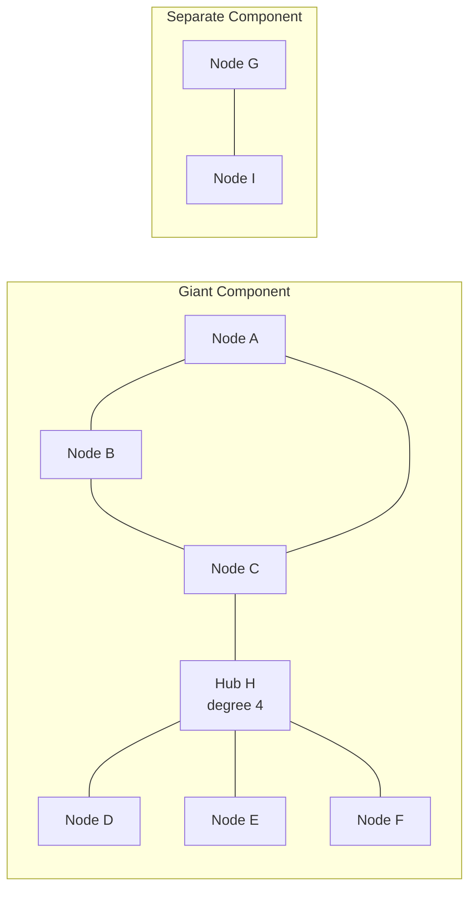

# 🕸️ Network Science Fundamentals

> [!abstract] TL;DR
> **Network science** studies complex systems by stripping them down to a **graph**: a set of **nodes** (the parts) joined by **edges** (their interactions). This one abstraction unifies friendships, proteins, routers, web pages, and power grids, so a structural discovery in one domain transfers to all the others. The core toolkit is a small set of measures — **degree**, **path length**, **diameter**, **connected components**, and the **clustering coefficient** — plus a null model, the **Erdős–Rényi random graph** `G(n, p)`, whose two signature properties are a **Poisson degree distribution** and a sudden **giant-component phase transition** at average degree 1. The field's founding insight, made quantitative in 1998–1999 by **Watts–Strogatz** and **Barabási–Albert**, is that *real* networks are emphatically **not** random: they are simultaneously highly clustered, short-diameter "small worlds" with heavy-tailed, hub-dominated degree distributions that no random graph can produce.

## Intuition

**Analogy:** Imagine you are handed the seating chart of a giant dinner party where a line is drawn between any two guests who already know each other. You throw away *everything* else — names, faces, jobs, the food — and keep only the dots and lines. Astonishingly, you can now answer deep questions just from the shape of the scribble. Are there a few socialites everyone is connected to, or is everyone equally acquainted? If a rumor starts at one table, how many handshakes until it reaches the far corner? Is the party one connected crowd, or three cliques who never mingle? You did not need to know a single person to answer these; the **structure of the connections** already encodes the behavior.

Network science is the science of that scribble. It claims that whether your dots are people, neurons, airports, or transistors, the *pattern of who-connects-to-whom* governs how information, disease, money, and failure flow through the system — often more powerfully than the properties of the dots themselves. This is [[General_Systems_Theory|systems thinking]] made numerical: study the organization, not the material, and one set of laws describes them all.

---

## How It Works

### Core Mechanics

1. **The universal representation: nodes and edges.** A **graph** `G = {V, E}` is a set of **nodes** (vertices) `V` and a set of **edges** `E` joining pairs of them. That is the entire ontology. A social network makes people the nodes and friendships the edges; the brain makes neurons the nodes and synapses the edges; the Internet makes routers the nodes and cables the edges. Because the representation is domain-blind, a theorem about graphs is a theorem about *all* of these at once.

2. **The dialects of edges.** Edges come in flavors that must match the system: **undirected** (friendship: if A knows B then B knows A) versus **directed** (a Twitter follow or a web hyperlink: A→B need not imply B→A); and **unweighted** (edge present or absent) versus **weighted** (edges carry a number — a distance, a bandwidth, a traffic volume, an interaction strength).

3. **The adjacency matrix.** The cleanest formal encoding is the `n × n` **adjacency matrix** `A`, where `A[i][j] = 1` if an edge joins node `i` to node `j`, else `0` (or the weight, if weighted). For an undirected graph `A` is **symmetric** (`A[i][j] = A[j][i]`). Two facts make the matrix powerful: the **degree** of node `i` is just the sum of row `i`, and the number of length-`ℓ` walks between `i` and `j` is the `(i, j)` entry of `A` raised to the power `ℓ`. The matrix is dense in memory though — `O(n²)` — so for large sparse networks practitioners store an [[Graph_Representation|adjacency list]] instead.

4. **Degree and the degree distribution.** A node's **degree** `k` is its number of edges. The **degree distribution** `P(k)` — the probability a randomly chosen node has degree `k` — is the single most diagnostic fingerprint of a network. A bell-shaped `P(k)` means nodes are statistically interchangeable; a heavy-tailed `P(k)` means a few **hubs** dominate while most nodes are sparsely connected.

5. **Paths, distance, and diameter.** A **path** is a sequence of edges leading from one node to another. The **geodesic** (shortest path) between two nodes defines their **distance**; the **average path length** is the mean distance over all node pairs, and the **diameter** is the *longest* geodesic — the network's worst-case reach. Computing these is exactly the job of graph traversal algorithms like [[BFS]] (for unweighted distance) and [[Dijkstra]] (for weighted distance).

6. **Connected components.** A **connected component** is a maximal set of nodes each reachable from the others. A network can fracture into many components; the largest is the **giant component**. Whether the system is "one whole" or "many islands" is a structural property found with [[BFS]]/[[DFS]] or [[Union_Find]] (and, for directed graphs, [[Strongly_Connected_Components]]).

7. **The clustering coefficient — do your friends know each other?** The local clustering coefficient of node `i` is the fraction of `i`'s neighbor-pairs that are themselves directly connected — the density of triangles around `i`. Formally, if `i` has degree `k` and there are `L` edges among its neighbors, `C_i = 2L / [k(k-1)]`. Averaged over all nodes it measures **transitivity**: the tendency for "a friend of a friend to be a friend." Real social and biological networks are strikingly high on this measure.

8. **The null model: the Erdős–Rényi random graph.** To decide whether a real network's structure is *surprising*, you need a baseline of pure chance. The **Erdős–Rényi model `G(n, p)`** builds it: take `n` nodes and connect every possible pair *independently* with probability `p`. This yields three signature properties. **(a)** The **degree distribution is Binomial**, which for large `n` and small `p` converges to a **Poisson** distribution with mean `⟨k⟩ = p(n-1)` — sharply peaked, no hubs. **(b)** The **clustering coefficient equals `p`**, which is tiny for sparse graphs, so random graphs have almost no triangles. **(c)** There is a dramatic **giant-component phase transition**: as `⟨k⟩` crosses `1`, the graph abruptly shifts from a dust of tiny fragments to a single component containing a finite fraction of all nodes. This is a genuine phase transition, mathematically analogous to water freezing.

9. **Why random graphs fail — and why that failure launched a field.** `G(n, p)` gets one thing right — real networks *do* have short average path lengths — but it fails on the other two counts, and the failures are what matter. First, real networks are **highly clustered** (your friends really do know each other), whereas random graphs have clustering near zero. Second, real networks have **heavy-tailed, hub-dominated** degree distributions, whereas random graphs are Poisson with no hubs. Resolving these two failures produced the two founding models of modern network science: the **Watts–Strogatz small-world model (1998)** reconciles *high clustering with short paths*, and the **Barabási–Albert scale-free model (1999)** explains *hubs* via **preferential attachment** ("the rich get richer"), yielding a power-law degree distribution `P(k) ~ k^(-γ)`. Together these two papers, both published in *Nature*/*Science* within a year, mark the birth of network science as a discipline.

### Flow / Architecture



*The triangle A–B–C shows high **clustering** — C's neighbors are linked to each other. **Hub H** carries a high **degree**. The edge C–H is a **bridge** giving a short path across the giant component, while G–I is a separate **connected component**.*

---

## Key Concepts

### Secondary
- **Node and edge:** a network is just dots (nodes) joined by lines (edges); people and friendships, or airports and flights.
- **Degree:** how many edges a node has — how many friends a person has, how many flights an airport runs.
- **Path and distance:** how many edges you must cross to get from one node to another; the shortest such route is the distance.
- **Connected component:** a group of nodes you can all reach from one another; a network can split into several separate groups.
- **Hub:** a node with unusually many connections — the popular person or the mega-airport that everything routes through.

### Undergraduate
- **Directed / undirected / weighted:** edges may have a direction (a follow, a hyperlink) or a numeric weight (distance, bandwidth); the model must match the real system.
- **Adjacency matrix:** the `n × n` table of `1`s and `0`s encoding every edge; symmetric for undirected graphs, and a node's degree is a row sum.
- **Degree distribution `P(k)`:** the histogram of node degrees — the network's fingerprint; bell-shaped means uniform nodes, heavy-tailed means hub-dominated.
- **Clustering coefficient:** the fraction of a node's neighbor-pairs that are also directly connected — a measure of how many triangles surround it.
- **Average path length and diameter:** the mean and the maximum shortest-path distance across all node pairs, quantifying how "close" the network is.
- **Erdős–Rényi `G(n, p)`:** the random-graph null model; every pair of the `n` nodes is joined independently with probability `p`.

### Graduate
- **The Poisson limit and its consequences:** the Binomial degree distribution of `G(n, p)` converges to Poisson with mean `⟨k⟩ = p(n-1)`; because its variance equals its mean, it has an exponentially light tail and can produce **no hubs** — the deep reason random graphs mismodel reality.
- **The giant-component phase transition:** at the critical average degree `⟨k⟩ = 1`, `G(n, p)` undergoes a continuous phase transition; below it, components are `O(log n)`, above it a unique giant component of size `Θ(n)` emerges, with critical exponents matching mean-field percolation theory.
- **Small-world reconciliation (Watts–Strogatz, 1998):** starting from a regular ring lattice (high clustering, long paths) and rewiring a fraction `p` of edges at random collapses the average path length to near-random values while clustering stays high — proving high clustering and short paths coexist, unlike in either a lattice or `G(n, p)`.
- **Scale-free networks and preferential attachment (Barabási–Albert, 1999):** growth plus preferential attachment (new nodes link to existing nodes in proportion to their current degree) produces a power-law degree distribution `P(k) ~ k^(-3)` with scale-free hubs, explaining the Internet, the Web, and metabolic networks — and their **robust-yet-fragile** character (resilient to random failure, catastrophically vulnerable to targeted hub removal).
- **Structure governs dynamics:** spectral properties of the adjacency and Laplacian matrices control synchronization, diffusion, epidemic thresholds, and community structure — the bridge from static topology to the dynamics running on top of it.

---

## Python Demo

```python
# Build an Erdos-Renyi G(n, p) random graph as a numpy ADJACENCY MATRIX,
# then measure its degree distribution (vs the theoretical Poisson), its
# average degree, and its clustering coefficient, and finally draw it by
# placing nodes on a circle and stroking edges with matplotlib.
# Dependencies: numpy + matplotlib + math (standard library) only.

import numpy as np
import matplotlib.pyplot as plt
from math import factorial

rng = np.random.default_rng(42)

# --- 1. Erdos-Renyi G(n, p) as a symmetric numpy adjacency matrix ----------
n = 60          # number of nodes
p = 0.08        # independent edge probability -> expected avg degree p*(n-1)

# Draw the upper triangle only (k=1 skips the diagonal, so no self-loops),
# then mirror it so the matrix is symmetric = undirected graph.
upper = np.triu(rng.random((n, n)) < p, k=1)
A = (upper | upper.T).astype(int)               # adjacency matrix, entries 0/1

# --- 2. Degree distribution + average degree -------------------------------
degrees = A.sum(axis=1)                          # row sums = node degrees
avg_degree = degrees.mean()
print(f"n = {n}, p = {p}")
print(f"average degree  measured : {avg_degree:.3f}")
print(f"average degree  expected : {p * (n - 1):.3f}   [ = p*(n-1) ]")

# --- 3. Average clustering coefficient -------------------------------------
# C_i = fraction of node i's neighbor-pairs that are themselves connected.
clustering = np.zeros(n)
for i in range(n):
    nbrs = np.flatnonzero(A[i])                  # indices of i's neighbors
    k = nbrs.size
    if k >= 2:
        sub = A[np.ix_(nbrs, nbrs)]              # adjacency among the neighbors
        links = sub.sum() // 2                   # each triangle edge counted twice
        clustering[i] = 2 * links / (k * (k - 1))
avg_clustering = clustering.mean()
print(f"clustering      measured : {avg_clustering:.3f}")
print(f"clustering      expected : {p:.3f}   [ = p for G(n, p) ]")

# --- 4. Plot: (a) degree histogram vs Poisson, (b) circular graph drawing ---
fig, (ax_hist, ax_net) = plt.subplots(1, 2, figsize=(12, 5))

# (a) Degree distribution as a density histogram, with the Poisson overlay.
bins = np.arange(degrees.min(), degrees.max() + 2) - 0.5      # integer-centered bins
ax_hist.hist(degrees, bins=bins, density=True,
             color="steelblue", edgecolor="white", label="measured")

lam = p * (n - 1)                                            # Poisson mean
k_vals = np.arange(degrees.min(), degrees.max() + 1)
poisson = np.array([lam**int(k) * np.exp(-lam) / factorial(int(k)) for k in k_vals])
ax_hist.plot(k_vals, poisson, "o-", color="crimson", label="Poisson pmf")
ax_hist.set_title("Degree distribution vs Poisson")
ax_hist.set_xlabel("degree k")
ax_hist.set_ylabel("P of k")
ax_hist.legend()

# (b) Draw the graph: nodes evenly spaced on a circle, edges as chords.
angles = np.linspace(0, 2 * np.pi, n, endpoint=False)
xs, ys = np.cos(angles), np.sin(angles)
for i, j in zip(*np.triu_indices(n, k=1)):                   # each edge once
    if A[i, j]:
        ax_net.plot([xs[i], xs[j]], [ys[i], ys[j]],
                    color="0.75", linewidth=0.5, zorder=1)
ax_net.scatter(xs, ys, s=20 + 18 * degrees, c=degrees,
               cmap="viridis", zorder=2)                     # node size/color = degree
ax_net.set_title("Erdos-Renyi graph, nodes on a circle")
ax_net.set_aspect("equal")
ax_net.axis("off")

plt.tight_layout()
plt.show()
```

Running it prints a measured average degree near the theoretical `p(n-1) ≈ 4.7` and a measured clustering coefficient near `p = 0.08`, and produces two panels: a degree histogram hugging the red Poisson curve, and a circular graph drawing where node size and color scale with degree. Notice that the histogram has **no heavy tail** and the drawing has **no dominant hubs** — that visible absence is precisely why real, hub-rich networks (the Web, the brain, air-traffic) demand the small-world and scale-free models rather than this random baseline.

---

## Real-World Applications

- **Social networks:** friendship, collaboration, and follower graphs. Degree distributions are heavy-tailed (a few mega-influencers), clustering is high (friends of friends are friends), and diameters are famously short — the "six degrees of separation." Analysis of ties, brokerage, and contagion is covered in [[Social_Networks_and_Social_Ties]].
- **Biological networks:** protein–protein interaction maps, gene-regulatory networks, metabolic pathways, and the neural connectome. These are scale-free and modular; hub proteins tend to be essential, and their removal is lethal — a direct medical consequence of degree structure.
- **Technological / infrastructure networks:** the Internet (routers and autonomous systems), power grids, and transportation networks. Their scale-free hubs make them **robust to random failures but fragile to targeted attacks**, a finding that reshaped how engineers reason about resilience and cascading blackouts.
- **Information networks:** the World Wide Web (pages linked by directed hyperlinks) and citation networks. Google's **PageRank** is a network-science algorithm end to end — it ranks a page by the eigenvector centrality of the web's adjacency matrix.
- **Epidemiology:** disease spread runs *on* a contact network; the epidemic threshold and super-spreader phenomena are dictated by the degree distribution's variance, which is why hub-targeted vaccination outperforms random vaccination.

---

## Common Pitfalls

- **Assuming networks are random.** The Erdős–Rényi model is a *null hypothesis*, not a description of reality. Treating a real network as Poisson underestimates hubs, ignores clustering, and gives dangerously wrong predictions for robustness and spreading. Its value is as a baseline to measure surprise *against*, not a model to trust.
- **Averaging away a heavy tail.** Reporting only the *average* degree of a scale-free network hides everything that matters. When variance diverges, the mean is not a meaningful summary — the tail (the hubs) drives the dynamics. Always look at the full distribution, ideally on log–log axes.
- **Confusing high clustering with short paths being incompatible.** The pre-1998 intuition was that you get one or the other (lattices cluster but are far-flung; random graphs are close-knit but triangle-free). Watts–Strogatz showed a tiny fraction of random long-range "shortcut" edges buys short paths while clustering stays high — the small-world effect. Do not assume the two measures trade off.
- **Ignoring edge direction and weight.** Collapsing a directed graph (who-follows-whom, who-cites-whom) into an undirected one, or a weighted graph into unweighted, silently destroys information — connected components become strongly-connected components, and influence flows the wrong way. Match the representation to the phenomenon.
- **Naive `O(n²)` thinking on huge sparse graphs.** Building a dense adjacency matrix or an all-pairs distance matrix is fine for a demo of 60 nodes but impossible for a billion-node social graph. Real network analysis leans on sparse [[Graph_Representation|adjacency lists]] and near-linear algorithms like [[BFS]].

---

## Related Concepts

- [[General_Systems_Theory]] — network science is the quantitative descendant of systems thinking: study organization over material, and one formalism spans every domain.
- [[Graph_Representation]] — the CS-side of the same object: adjacency matrix versus adjacency list, and the sparsity trade-offs that make large networks tractable.
- [[BFS]] — computes shortest-path distances, average path length, and connected components in unweighted networks.
- [[DFS]] — the other core traversal; the workhorse for component detection and cycle analysis.
- [[Dijkstra]] — shortest paths and geodesics in *weighted* networks (distances, latencies, costs).
- [[Union_Find]] — the near-linear way to track connected components and watch the giant component assemble as edges are added.
- [[Strongly_Connected_Components]] — the directed-graph analogue of connectivity, essential for the Web graph and citation networks.
- [[Social_Networks_and_Social_Ties]] — network science applied to sociology: weak ties, structural holes, small-world and scale-free social structure.

---

## Review Questions

1. **(Conceptual)** The Erdős–Rényi model gets *one* structural property of real networks roughly right and *two* badly wrong. Name all three properties, state which is right, and explain precisely why the Poisson degree distribution makes it impossible for `G(n, p)` to reproduce the hubs seen in the Web or the brain.
2. **(Scenario)** You are handed the adjacency matrix of an unknown 10,000-node network. Describe the sequence of measurements you would compute — and which algorithm you would use for each — to decide whether it is (a) essentially random, (b) a small-world network, or (c) scale-free. What would each measurement look like in each case?
3. **(Trade-off / design)** A power-grid operator and a public-health official both learn their systems are scale-free. The engineer wants maximum resilience; the epidemiologist wants to halt an outbreak with a limited vaccine supply. Explain how the *same* structural fact — the existence of hubs — leads them to *opposite-signed* interventions, and what the "robust-yet-fragile" property implies for each.

---

## Sources

- Barabási, A.-L. (2016). *Network Science.* Cambridge University Press. Free online at [networksciencebook.com](http://networksciencebook.com/) — the standard modern textbook.
- Newman, M. E. J. (2018). *Networks* (2nd ed.). Oxford University Press. — the comprehensive graduate reference on network measures and models.
- Watts, D. J., & Strogatz, S. H. (1998). "Collective dynamics of 'small-world' networks." *Nature, 393*, 440–442. — the small-world model.
- Barabási, A.-L., & Albert, R. (1999). "Emergence of scaling in random networks." *Science, 286*(5439), 509–512. — preferential attachment and scale-free networks.
- Erdős, P., & Rényi, A. (1960). "On the evolution of random graphs." *Publ. Math. Inst. Hung. Acad. Sci., 5*, 17–61. — the original random-graph theory and the giant-component transition.

---

#complexity #network-science #graph-theory #erdos-renyi #degree-distribution
