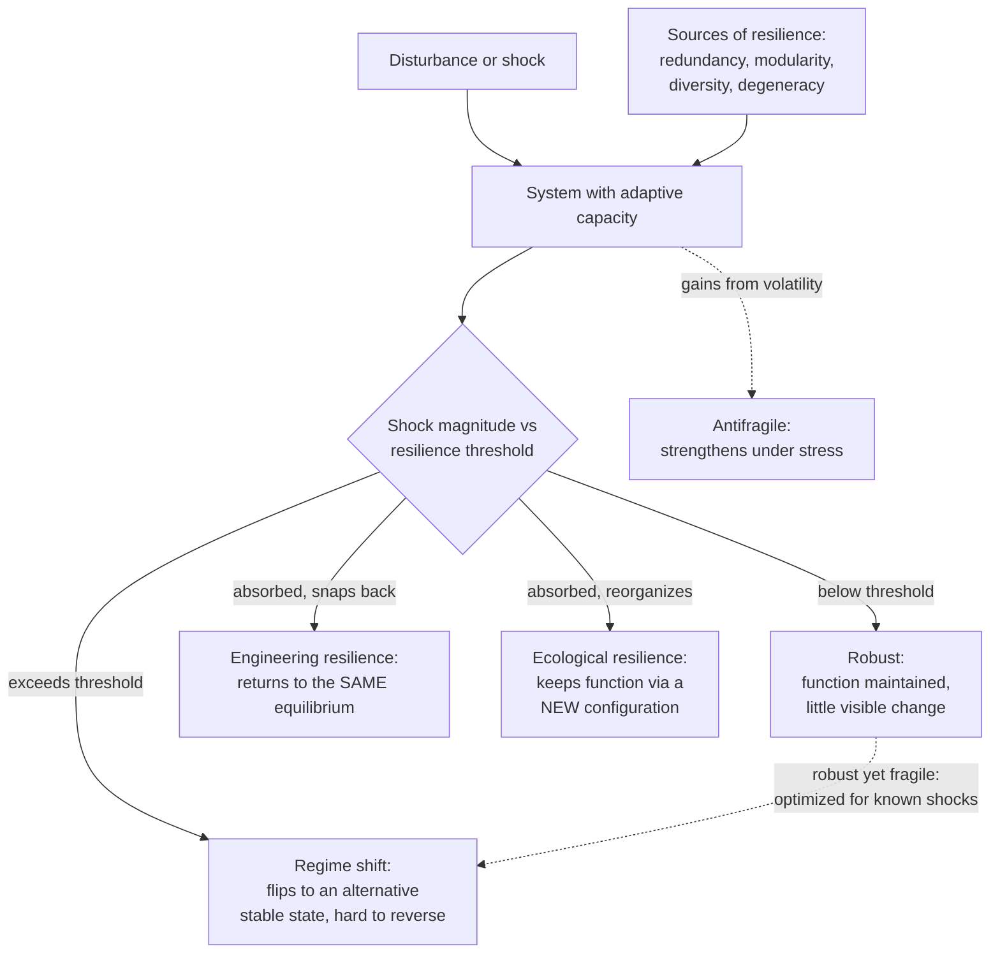

# 🛡️ Resilience and Robustness

> [!abstract] TL;DR
> **Robustness** is a system's ability to *keep functioning* when perturbed; **resilience** is its ability to *absorb a disturbance and reorganize or recover* while retaining the same identity and function. The two are not the same and can even trade off. Holling split resilience into **engineering resilience** (how fast you snap back to a single equilibrium) and **ecological resilience** (how big a shock you can absorb before flipping into a *different* stable state). Robustness is never free: making a system robust to expected shocks tends to make it *fragile* to rare, unanticipated ones — the **robust-yet-fragile** signature of highly optimized systems (Carlson & Doyle's *Highly Optimized Tolerance*). Networks show this vividly: **scale-free** topologies shrug off random node failure but shatter under **targeted attack** on their hubs — their Achilles' heel (Albert, Jeong & Barabási). Real resilience is built from **redundancy, modularity, diversity, and degeneracy**, and preserved by **adaptive capacity** cycling through Holling's **adaptive cycle** / **panarchy**. Taleb's **antifragility** pushes further: some systems *gain* from disorder rather than merely surviving it.

## Intuition

**Analogy:** Compare a **rigid steel bridge** with a **living forest**.

The steel bridge is engineered to be *robust*: it holds its shape against wind, traffic, and temperature swings with almost no visible change. But its robustness is bought by rigidity — hit it with a load it was never designed for (a resonant gust, an earthquake mode outside spec) and it does not bend, it *snaps*. Its whole safety margin is spent staying in one exact configuration, so when it fails, it fails catastrophically and all at once. That is **robust yet fragile**.

The forest is different. Individual trees fall in every storm — locally it looks *less* robust than the bridge. Yet the forest as a whole *absorbs* fires, droughts, and pest outbreaks, then *reorganizes*: seeds germinate in the gaps, species composition shifts, the system persists as "a forest" even though its exact makeup changes. That is **resilience** — not staying identical, but keeping the same function and identity through disturbance and renewal. Push it too far, though — clear-cut it, salt the soil, cross a threshold — and it can flip into a *different* stable state (grassland) that is itself robust and will not easily flip back. Robustness is about *resisting* change to one state; resilience is about *how much shock you can take before you land in a different one*.

---

## How It Works

### Core Mechanics

1. **Robustness = invariance of function under perturbation.** A property is robust if it stays roughly constant as some parameter, input, or component varies. Robustness is always *of a specific function, to a specific class of perturbation*. There is no such thing as "robust in general" — a system robust to one disturbance is usually fragile to another. Stating robustness without naming the perturbation set is meaningless.

2. **Resilience = absorb, then recover or reorganize.** Holling (1973) defined resilience as the *magnitude of disturbance a system can absorb before it reorganizes into a qualitatively different structure*. Where robustness asks "does it stay the same?", resilience asks "how much can it take, and does it come back as itself?".

3. **Engineering resilience vs ecological resilience.** These are two rival meanings, and confusing them causes real mistakes:
   - **Engineering resilience** assumes *one* stable equilibrium and measures *how fast* the system returns to it after a shock — a spring's return time, a control loop's settling time. It prizes efficiency and constancy.
   - **Ecological resilience** assumes *multiple* stable states and measures *how large* a shock the system can absorb *before it crosses a basin boundary* into a different state. It prizes persistence of function, not speed of return. A lake can be "engineering-resilient" (returns quickly to clear water after small nutrient pulses) yet "ecologically fragile" (one big pulse flips it permanently to turbid, algae-dominated water).

4. **Alternative stable states and basins of attraction.** Picture a ball in a landscape of valleys. Each valley is a **stable state**; the valley walls are **thresholds**. Engineering resilience is the steepness of *your* valley (fast return). Ecological resilience is *how deep and wide* the valley is (how big a kick before the ball rolls over the ridge into the next valley). A **regime shift / tipping point** is the ball crossing a ridge — often hard to reverse because of **hysteresis**.

5. **The robustness-fragility tradeoff (Highly Optimized Tolerance).** Carlson & Doyle showed that systems optimized to tolerate common perturbations become extraordinarily robust to those — *and* extraordinarily fragile to rare or unanticipated ones. Complexity added to buy robustness against known threats creates new, hidden failure modes. This **robust-yet-fragile** duality is the signature of engineered and evolved complexity alike: the internet, jet aircraft, and the cell are all superbly robust to the disturbances they were shaped by and shockingly brittle to a few specific others.

6. **Network robustness: random failure vs targeted attack.** Albert, Jeong & Barabási (2000) tested network *connectivity* under node removal. In a **scale-free** network (degree distribution follows a power law, dominated by a few high-degree **hubs**):
   - Under **random failure**, removing nodes almost always removes low-degree nodes (there are vastly more of them), so the giant connected component barely shrinks — the network is *extremely robust*.
   - Under **targeted attack** on the highest-degree hubs, connectivity collapses almost immediately — the hubs were holding everything together. This is the **Achilles' heel** of scale-free networks: robust to error, fragile to attack. A **random (Erdős–Rényi)** network, with a homogeneous degree distribution, responds *the same* to random failure and to targeted attack, because no node is special.

7. **Percolation and critical thresholds.** Connectivity loss is a **percolation** phenomenon. As you remove a fraction `f` of nodes, there is a **critical threshold** `f_c` at which the giant connected component disintegrates into small fragments — a phase transition. Scale-free networks have `f_c` near 1 for random failure (you must remove almost everything to disconnect them) but a tiny `f_c` for hub-targeted attack.

8. **The four structural sources of resilience.**
   - **Redundancy** — duplicate components so one can fail without loss of function (backup servers, two kidneys). Costs efficiency.
   - **Modularity** — compartmentalize so a failure in one module cannot cascade through the whole (bulkheads in a ship, circuit breakers). Contains contagion but can slow global coordination.
   - **Diversity** — different components respond differently to the same shock, so no single disturbance takes out all of them (a diverse crop portfolio, a varied investment mix).
   - **Degeneracy** — *structurally different* elements that can perform the *same* function under some conditions (unlike redundancy, which duplicates identical parts). Degeneracy is a deeper, more flexible resilience because the substitutes also do *other* things, so the system adapts rather than merely fails over.

9. **Adaptive capacity and the adaptive cycle (panarchy).** Resilience is not static — it is maintained by **adaptive capacity**: the system's ability to reconfigure while keeping function. Holling's **adaptive cycle** describes ecosystems (and firms, economies) cycling through four phases: **exploitation (r)** → **conservation (K)** → **release / creative destruction (Ω)** → **reorganization (α)** → back to exploitation. Systems become *most efficient and least resilient* in the conservation phase (over-connected, rigid, "an accident waiting to happen"); the release phase frees up locked resources; reorganization is where novelty and innovation enter. **Panarchy** nests these cycles across scales (leaf ↔ tree ↔ forest ↔ biome), so fast small cycles and slow large cycles interact — enabling both stability and change.

10. **Antifragility (Taleb).** Beyond resilience lies **antifragility**: systems that *improve* under stressors, volatility, and disorder rather than merely tolerating them. A muscle, an immune system, and an evolutionary lineage all *strengthen* from bounded, repeated stress. The opposite of fragile is not robust (which is neutral to shocks) but antifragile (which benefits from them). The practical prescription: seek **convexity** — limited downside, open-ended upside — and avoid suppressing small stressors, because doing so accumulates hidden fragility that erupts as a rare catastrophe (the over-managed forest that stores fuel for one mega-fire).

### Flow / Architecture



---

## Key Concepts

### Secondary
- **Robustness:** a system keeps working even when part of it is disturbed or breaks.
- **Resilience:** a system can take a hit, then bounce back and still be recognizably itself.
- **Redundancy:** having spare, backup parts so one failure does not stop the whole system.
- **Hub:** a highly connected node; in some networks a few hubs hold everything together.
- **Random failure vs targeted attack:** losing parts by chance is very different from an enemy deliberately taking out the most important parts.

### Undergraduate
- **Engineering vs ecological resilience:** engineering resilience = *how fast* you return to one equilibrium; ecological resilience = *how big* a shock you can absorb before flipping to a different stable state.
- **Alternative stable states and thresholds:** many systems have more than one self-maintaining configuration; a *tipping point* is crossing the boundary between them, often with **hysteresis** (hard to reverse).
- **Robust-yet-fragile:** optimizing a system to tolerate common disturbances tends to make it brittle to rare, unexpected ones (Highly Optimized Tolerance).
- **Achilles' heel of scale-free networks:** power-law hub structure makes a network extremely tolerant of random failure but extremely vulnerable to attacks that target hubs.
- **Percolation threshold:** the critical fraction of removed nodes `f_c` at which a connected network shatters into disconnected pieces — a phase transition.
- **Modularity and diversity:** compartments stop failures from cascading; variety ensures no single shock disables everything at once.

### Graduate
- **Percolation on heterogeneous networks:** for a degree distribution with power-law exponent `2 < gamma < 3`, the giant component survives random removal up to `f_c` approaching 1 (divergent second moment of the degree distribution means no finite critical point) — this is the analytic root of scale-free robustness (Cohen, Erez, ben-Avraham, Havlin).
- **Highly Optimized Tolerance (HOT):** Carlson & Doyle model design or evolution as constrained optimization; the resulting power-law event distributions and robust-yet-fragile behavior are *structural consequences* of optimizing for a specific perturbation environment, not accidents.
- **Degeneracy vs redundancy (Edelman & Gally):** degeneracy — non-identical elements yielding the same output under some conditions — is pervasive in biology and is a more powerful, evolvable source of robustness than pure redundancy because degenerate elements also contribute functional novelty.
- **Panarchy and cross-scale resilience:** Gunderson & Holling formalize nested adaptive cycles; **"revolt"** (fast, small cycles triggering change in slow, large ones) and **"remember"** (large slow cycles constraining and re-seeding small ones) are the cross-scale couplings that govern whether a system innovates or collapses.
- **Resilience-efficiency frontier:** redundancy, modularity, and slack cost throughput; there is a Pareto frontier between efficiency (maximized by tight optimization, minimal slack, high connectivity) and resilience (maximized by buffers, diversity, and looser coupling). Efficiency-maximizing pressure — markets, natural selection, cost cutting — systematically erodes resilience until a shock reveals it (the 2008 financial network, just-in-time supply chains).
- **Antifragility as convexity:** Taleb formalizes antifragility as a convex response to volatility — by Jensen's inequality, a convex payoff means the *average* outcome under a spread of shocks exceeds the outcome at the average shock, so variance itself becomes beneficial.

---

## Python Demo

```python
# PERCOLATION-STYLE NETWORK ATTACK (numpy only, no networkx).
#
# We build two networks with the SAME number of nodes and (approximately)
# the same number of edges, stored as numpy adjacency matrices:
#   (1) a SCALE-FREE-ish network via preferential attachment (Barabasi-Albert
#       style): a few high-degree hubs, many low-degree nodes.
#   (2) a RANDOM (Erdos-Renyi) network: homogeneous, no hubs.
#
# We then remove nodes two ways:
#   - RANDOM FAILURE : remove nodes in random order.
#   - TARGETED ATTACK: remove nodes in order of DESCENDING degree (hubs first).
#
# For each fraction removed we measure the size of the LARGEST CONNECTED
# COMPONENT (the "giant component"), normalized by N. The classic result
# (Albert, Jeong & Barabasi 2000): the scale-free network is ROBUST to
# random failure but FRAGILE to targeted attack, while the random network
# responds almost identically to both.

import numpy as np
import matplotlib.pyplot as plt

rng = np.random.default_rng(42)
N = 600          # number of nodes
M = 2            # edges each new node brings in the scale-free build


def build_scale_free(n, m, rng):
    """Preferential attachment: new nodes prefer to link to high-degree nodes."""
    A = np.zeros((n, n), dtype=np.int8)
    repeated = []                       # node ids repeated by their degree
    for i in range(m):                  # seed: small connected clique
        for j in range(i + 1, m):
            A[i, j] = A[j, i] = 1
            repeated += [i, j]
    for new in range(m, n):
        chosen = set()
        while len(chosen) < m:          # pick m distinct targets, degree-weighted
            t = repeated[rng.integers(len(repeated))]
            if t != new:
                chosen.add(t)
        for t in chosen:
            A[new, t] = A[t, new] = 1
            repeated += [new, t]
    return A


def build_random(n, n_edges, rng):
    """Erdos-Renyi: place n_edges random distinct undirected edges."""
    A = np.zeros((n, n), dtype=np.int8)
    placed = 0
    while placed < n_edges:
        i, j = int(rng.integers(n)), int(rng.integers(n))
        if i != j and A[i, j] == 0:
            A[i, j] = A[j, i] = 1
            placed += 1
    return A


def largest_cc_fraction(A, removed):
    """Size of the largest connected component among surviving nodes, / N."""
    n = A.shape[0]
    alive = ~removed
    visited = np.zeros(n, dtype=bool)
    best = 0
    for s in range(n):
        if alive[s] and not visited[s]:
            stack, size = [s], 0        # iterative DFS over surviving nodes
            visited[s] = True
            while stack:
                u = stack.pop()
                size += 1
                for v in np.nonzero(A[u])[0]:
                    if alive[v] and not visited[v]:
                        visited[v] = True
                        stack.append(v)
            best = max(best, size)
    return best / n


def simulate(A, order, fractions):
    """Remove nodes in the given order; record giant-component fraction."""
    n = A.shape[0]
    out = []
    for f in fractions:
        removed = np.zeros(n, dtype=bool)
        removed[order[: int(f * n)]] = True
        out.append(largest_cc_fraction(A, removed))
    return np.array(out)


# Build both networks with matched edge counts for a fair comparison.
A_sf = build_scale_free(N, M, rng)
n_edges = int(A_sf.sum() // 2)
A_er = build_random(N, n_edges, rng)

fractions = np.linspace(0.0, 0.6, 31)

# Removal orders. Targeted = static highest-degree-first (the classic protocol;
# recomputing degrees after each removal makes the collapse even sharper).
deg_sf = A_sf.sum(axis=1)
deg_er = A_er.sum(axis=1)
targeted_sf = np.argsort(-deg_sf)
targeted_er = np.argsort(-deg_er)
random_order = rng.permutation(N)

sf_random   = simulate(A_sf, random_order,  fractions)
sf_targeted = simulate(A_sf, targeted_sf,   fractions)
er_random   = simulate(A_er, random_order,  fractions)
er_targeted = simulate(A_er, targeted_er,   fractions)

# --- Plot -------------------------------------------------------------------
fig, (ax_deg, ax_att) = plt.subplots(1, 2, figsize=(12, 4.6))

# Left: the two degree distributions (why the difference exists).
ax_deg.hist(deg_sf, bins=range(1, int(deg_sf.max()) + 2), alpha=0.6,
            label="Scale-free (has hubs)", color="crimson")
ax_deg.hist(deg_er, bins=range(1, int(deg_er.max()) + 2), alpha=0.6,
            label="Random (homogeneous)", color="steelblue")
ax_deg.set_title("Degree distributions")
ax_deg.set_xlabel("node degree")
ax_deg.set_ylabel("number of nodes")
ax_deg.set_yscale("log")
ax_deg.legend(fontsize=8)

# Right: robustness curves.
ax_att.plot(fractions, sf_random,   "o-",  color="crimson",   label="Scale-free, random failure")
ax_att.plot(fractions, sf_targeted, "s--", color="crimson",   label="Scale-free, targeted attack")
ax_att.plot(fractions, er_random,   "o-",  color="steelblue", label="Random, random failure")
ax_att.plot(fractions, er_targeted, "s--", color="steelblue", label="Random, targeted attack")
ax_att.set_title("Giant component vs fraction of nodes removed")
ax_att.set_xlabel("fraction of nodes removed  f")
ax_att.set_ylabel("largest connected component  S / N")
ax_att.grid(True, alpha=0.3)
ax_att.legend(fontsize=8)

plt.tight_layout()
plt.show()

# Numeric takeaway: how much does hub-targeting hurt the scale-free net?
i = np.argmin(np.abs(fractions - 0.10))   # at 10% removed
print(f"At f = {fractions[i]:.2f} nodes removed:")
print(f"  Scale-free  random failure : S/N = {sf_random[i]:.3f}  (barely dented)")
print(f"  Scale-free  targeted attack: S/N = {sf_targeted[i]:.3f}  (shattered)")
print(f"  Random      random failure : S/N = {er_random[i]:.3f}")
print(f"  Random      targeted attack: S/N = {er_targeted[i]:.3f}")
```

Running it produces two panels. The left shows *why* the networks differ: the scale-free degree distribution has a long tail (a few hubs with very high degree), while the random network's degrees cluster around the mean. The right shows the payoff — the **scale-free/random-failure** curve stays high (you can delete a large fraction of random nodes and the giant component barely shrinks), while the **scale-free/targeted-attack** curve plummets almost immediately as the hubs go. The two **random-network** curves sit close together and decline moderately, because in a homogeneous network no node is special enough for targeting to matter. That gap between the two crimson curves *is* the robust-yet-fragile Achilles' heel made visible.

---

## Real-World Applications

- **The internet and power grids:** the internet's router topology is roughly scale-free, giving it remarkable tolerance of random router failures — and a documented vulnerability to attacks that knock out major hubs. Power grids show the flip side: cascading blackouts (2003 US Northeast) are resilience failures where local overloads propagate because the network lacked enough modularity and slack. See the deeper treatment in the sibling note on cascading failures.
- **Ecosystems and fisheries:** shallow lakes flip between clear and turbid states; coral reefs flip to algae-dominated states; fisheries collapse and fail to recover (Atlantic cod) — all classic **ecological-resilience** loss where a threshold was crossed and **hysteresis** prevents easy return. Conservation now targets resilience (buffers, diversity, connectivity) rather than a single "optimal" equilibrium.
- **Finance:** the 2008 crisis was a network-resilience failure. Decades of efficiency optimization created a densely connected, homogeneous, tightly coupled banking network — superbly efficient, robust to routine shocks, and catastrophically fragile to the correlated shock it was not designed for. Post-crisis regulation (capital buffers, ring-fencing, stress tests) is explicitly redundancy + modularity + diversity.
- **Supply chains:** just-in-time logistics maximizes efficiency by stripping out inventory slack (redundancy). COVID-19 and the Suez blockage exposed the resulting fragility; firms are now re-adding buffers and multi-sourcing (diversity) — a deliberate move back along the efficiency-resilience frontier.
- **Biology and medicine:** the cell is the canonical robust-yet-fragile system — buffered against countless perturbations by degeneracy and feedback, yet exploitable by a handful of targeted interventions (this is precisely how cancer therapeutics and antibiotics attack "hub" molecules). The immune system is antifragile: controlled exposure (vaccination, training) strengthens it.
- **Organizations and cities:** resilient organizations build modular teams, cross-trained (degenerate) staff, and diverse revenue streams; resilience thinking in urban planning designs for absorbing shocks (floods, pandemics) and reorganizing, not just resisting them.

---

## Common Pitfalls

- **Conflating robustness with resilience.** A system can be highly robust (rarely changes) yet non-resilient (when it finally fails, it fails totally and cannot recover). The steel bridge is robust but not resilient; the forest is resilient but not robust at the level of individual trees. Optimizing one does not give you the other.
- **Mixing up engineering and ecological resilience.** Managing for fast return to a single equilibrium (engineering resilience) can *destroy* the capacity to absorb large shocks (ecological resilience) — the classic example is suppressing every small forest fire, which optimizes short-term stability while accumulating fuel for one unstoppable mega-fire. Fast recovery from small shocks and survival of big ones are different, sometimes opposed, goals.
- **Assuming robustness is free or universal.** Every robustness is *to a specific perturbation set*; buying it almost always creates fragility elsewhere (robust-yet-fragile). Adding complexity to harden against known threats introduces new, unmonitored failure modes. Always ask: "robust to what, and fragile to what instead?"
- **Optimizing efficiency until resilience silently disappears.** Slack, redundancy, and diversity look like waste on a spreadsheet, so competitive and cost pressure removes them — right up until a shock reveals they were the resilience. The fragility is invisible precisely because it only manifests in the rare event.
- **Confusing redundancy with degeneracy.** Duplicating identical components (redundancy) fails against *common-mode* faults that hit all copies at once (same software bug in both "redundant" servers). Degeneracy — *different* elements that can cover the same function — is far more robust because a single fault mode rarely disables all of them.
- **Treating scale-free robustness as security.** "Robust to random failure" is not "secure against attack." The very hubs that make a network efficient and error-tolerant are its attack surface. Defending a scale-free system means protecting the hubs, not spreading defense uniformly.
- **Mistaking mere survival for antifragility.** Robust ≠ antifragile. A system that survives a stressor unchanged has not gained from it. Suppressing all small stressors to keep a system unchanged is the *opposite* of antifragility — it converts many small, informative shocks into one large, hidden, catastrophic one.

---

## Related Concepts

- [[Small_World_and_Scale_Free_Networks]] — the topology behind the whole story: power-law hubs are what make a network robust to random failure yet fragile to targeted attack. *(Planned sibling in this section — forward link.)*
- [[Cascades]] — how a single failure propagates through a network; the dynamic counterpart to the static percolation view of robustness. *(Planned sibling in this section — forward link.)*
- [[Ecological_Resilience]] — Holling's ecological resilience, alternative stable states, and the adaptive cycle developed in depth for social-ecological systems. *(Planned sibling — forward link.)*
- [[Feedback_Loops_and_Causality]] — negative feedback is the core mechanism of robustness and engineering resilience; runaway positive feedback is how thresholds are crossed and regimes shift.
- [[Emergence_and_Self_Organization]] — resilience via reorganization is a self-organizing, emergent property of the whole, not a property of any part.
- [[Stocks_Flows_and_System_Dynamics]] — buffers, slack, and redundancy are *stocks* that absorb shocks; draining them for efficiency is what erodes resilience.
- [[General_Systems_Theory]] — steady state, open systems, and equifinality are the classical roots of the robustness/resilience vocabulary.
- [[Systems_Thinking_Overview]] — resilience thinking is a keystone application of systems thinking to real ecosystems, infrastructures, and organizations.
- [[Community_Ecology]] — keystone species, succession, and species interactions determine which disturbances a community can absorb and how it reorganizes.
- [[Biodiversity_and_Conservation]] — biological diversity is a primary source of ecological resilience (response diversity to shocks); its loss lowers the tipping threshold.
- [[Ecosystems_and_Energy_Flow]] — the energy-and-matter flow view of ecosystems on which Holling built resilience theory.
- [[Population_Ecology]] — carrying capacity, logistic dynamics, and multiple equilibria underlie the alternative-stable-state picture of resilience.

---

## Review Questions

1. **(Conceptual)** A colleague says "our system is extremely robust, so it must be resilient." Explain, using the steel-bridge-vs-forest contrast, why this inference is wrong, and give a concrete case where high robustness coexists with low resilience.
2. **(Scenario)** You run a network that is roughly scale-free and currently very tolerant of random node failures, so leadership wants to cut the security budget. Using the demo's random-failure vs targeted-attack curves, argue why "robust to random failure" is a dangerous reason to reduce defenses, and specify *where* you would concentrate the remaining defensive resources and why.
3. **(Trade-off)** A firm can push itself along the efficiency-resilience frontier by removing inventory slack, consolidating suppliers, and increasing connectivity. Frame this as an engineering-vs-ecological-resilience choice, explain the robust-yet-fragile risk it creates, and describe how redundancy, modularity, diversity, and degeneracy would each buy back resilience at some efficiency cost. When, if ever, would you deliberately choose antifragility over efficiency?

---

## Sources

- Albert, R., Jeong, H., & Barabási, A.-L. (2000). "Error and attack tolerance of complex networks." *Nature, 406*, 378–382. — the scale-free "Achilles' heel": robust to random failure, fragile to targeted attack.
- Holling, C. S. (1973). "Resilience and Stability of Ecological Systems." *Annual Review of Ecology and Systematics, 4*, 1–23. — the founding distinction between engineering and ecological resilience and multiple stable states.
- Carlson, J. M., & Doyle, J. (2002). "Complexity and robustness." *PNAS, 99*(suppl 1), 2538–2545. — Highly Optimized Tolerance and the robust-yet-fragile signature of complex systems.
- Walker, B., Holling, C. S., Carpenter, S. R., & Kinzig, A. (2004). "Resilience, adaptability and transformability in social-ecological systems." *Ecology and Society, 9*(2), 5. — the adaptive cycle and panarchy in social-ecological systems.
- Taleb, N. N. (2012). *Antifragile: Things That Gain from Disorder.* Random House. — the concept of antifragility, convexity, and gaining from volatility.

---

#complexity #resilience #robustness #percolation #antifragility
