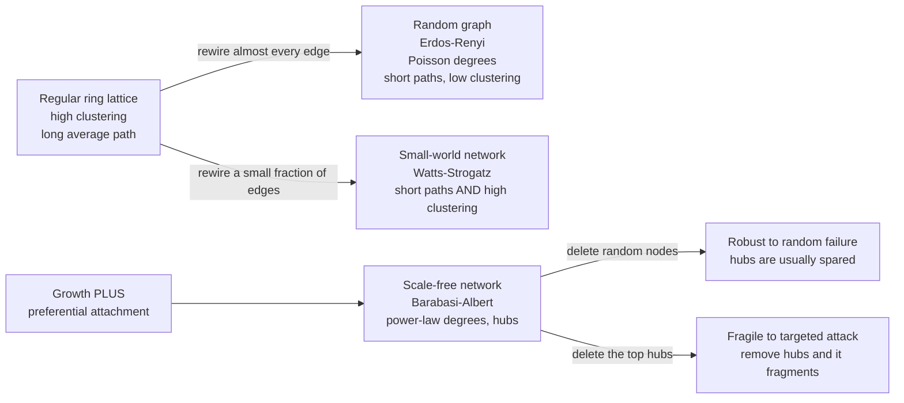

# 🕸️ Small-World and Scale-Free Networks

> [!abstract] TL;DR
> Most real networks are neither perfectly ordered lattices nor purely random graphs — they share two surprising structural signatures. **Small-world networks** have short average path lengths (any two nodes are only a few hops apart) *while* keeping high local clustering, a combination the **Watts-Strogatz model** reproduces by randomly rewiring just a tiny fraction of a regular lattice's edges. **Scale-free networks** have a **power-law degree distribution**, `P of k ~ k^-gamma`, meaning a few enormously connected **hubs** coexist with a mass of low-degree nodes; the **Barabási-Albert model** shows this emerges from two ingredients — **growth** plus **preferential attachment** ("the rich get richer"). Hubs make scale-free networks paradoxically **robust to random failure but fragile to targeted attack**. These patterns recur in the WWW, the internet, protein-interaction maps, citation graphs, and social networks — though the universality of the strict power-law claim has been sharply challenged.

## Intuition

**Analogy:** In 1967 the psychologist Stanley Milgram handed letters to random people in Omaha, Nebraska, and asked them to reach a stockbroker in Boston they had never met — but only by forwarding the letter to someone they knew on a first-name basis, who would forward it onward. The letters that arrived took, on average, just **five or six steps**. A country of hundreds of millions of people, and yet any two strangers are separated by a chain of only about six acquaintances. That is the "six degrees of separation," and it captures a paradox: your friends are almost all local — they know each other, live near you, went to your school — so the social world *feels* like a dense, cliquey village. But a few of your ties reach far away (a cousin who emigrated, a colleague from another city), and those rare long-range shortcuts are enough to make the whole planet navigable in a handful of hops.

Now shift the lens from *distances* to *popularity*. Count how many friends, followers, citations, or web links each node has. You will not find everyone hovering near an average. Instead a tiny handful of nodes — celebrities, `google.com`, the most-cited paper — accumulate a colossal share of the connections, while almost everyone else has very few. The distribution has no meaningful "typical scale," which is why it is called **scale-free**: zoom in on the low-degree nodes or out to the mega-hubs and the shape looks statistically the same. Small-world explains why the network is *tight*; scale-free explains why it is *lopsided*. This note is about how both structures arise and why they matter.

---

## How It Works

### Core Mechanics

Three reference topologies anchor everything:

1. **Regular lattice (ordered).** Every node connects to its `k` nearest neighbours on a ring. Clustering is **high** — your neighbours are also each other's neighbours — but the average path length is **long**, because to cross the ring you must step through every node in between. Order buys cliquishness at the cost of reach.

2. **Erdős-Rényi random graph (disordered).** Connect every pair of nodes independently with probability `p`. The degree distribution is **Poisson** — sharply peaked around the mean, with an exponentially thin tail, so *all* nodes have roughly the same degree and hubs essentially never occur. Average path length is **short** (it grows only like `log N`), but clustering is **low**. Randomness buys reach at the cost of cliquishness.

3. **The Watts-Strogatz interpolation (1998).** Start from the regular lattice and, with probability `p`, **rewire** each edge to a random distant node. The magic is in the middle. Rewiring even **1 percent** of edges introduces a few long-range shortcuts that collapse the average path length almost down to the random-graph value, while clustering barely drops because 99 percent of edges are still local. That regime — `L` almost as short as random, `C` almost as high as the lattice — is the **small-world regime**. It shows small-worldness is not exotic: it is the generic state of any locally structured network sprinkled with a few random long ties.

Watts-Strogatz explains **short paths plus clustering** but says nothing about *hubs* — its degree distribution is still peaked. To get hubs you need a different generative story:

4. **Scale-free structure.** The degree distribution follows a **power law**, `P of k` proportional to `k^-gamma`, with the exponent `gamma` usually between 2 and 3. On a log-log plot this is a straight line — a heavy tail that decays polynomially, not exponentially. Consequently a nonzero fraction of nodes have degrees orders of magnitude above the mean: the **hubs**. There is no characteristic degree scale, hence "scale-free."

5. **The Barabási-Albert model (1999)** derives that power law from two mechanisms working together:
   - **Growth** — the network is not fixed; new nodes are continually added over time.
   - **Preferential attachment** — a new node prefers to link to nodes that are *already* well connected, with probability proportional to their current degree. A node with twice the connections is twice as likely to receive the next link.
   Together these produce a **"rich get richer" / Matthew effect**: early, high-degree nodes keep accruing links fastest, growing into hubs. Remove *either* ingredient and the power law disappears — growth without preference gives an exponential distribution; preference without growth cannot sustain the feedback. The model yields a specific exponent, `gamma = 3`.

6. **Consequences of hubs — the robustness/fragility trade-off.** Because hubs are statistically rare, **random** node deletion almost always hits a low-degree node and barely dents connectivity: scale-free networks are extraordinarily **robust to random failure** (the internet keeps routing even as routers fail). But that same concentration is a liability under a **targeted attack**: deliberately removing the top few hubs — which carry a disproportionate share of all paths — shatters the network into disconnected fragments. Same structure, opposite fate, depending on whether failures are blind or intelligent. This is the deep link to network **resilience**.

### Flow / Architecture



---

## Key Concepts

### Secondary
- **Node and edge:** a node is a thing (a person, a web page, a protein); an edge is a connection between two of them.
- **Degree:** how many edges a node has — its number of direct connections. A node with a huge degree is a **hub**.
- **Path length and "six degrees":** the shortest number of hops between two nodes; averaged over all pairs, real networks give a startlingly small number even when they are enormous.
- **Clustering:** how likely it is that two of your neighbours are also connected to each other — high in friendship networks ("my friends are friends").
- **Three flavours in plain terms:** a *lattice* is orderly and cliquey but slow to cross; a *random* graph is fast to cross but not cliquey; a *small-world* network is both cliquey and fast; a *scale-free* network additionally has a few superstar hubs.

### Undergraduate
- **Watts-Strogatz model and the rewiring probability `p`:** interpolates from lattice (`p = 0`) to random graph (`p = 1`). For a wide window of small `p`, path length has already collapsed while clustering is still near-maximal — the **small-world regime**.
- **Power-law degree distribution:** `P of k` proportional to `k^-gamma`, a straight line on log-log axes, with `gamma` typically in the range 2 to 3. Contrast with the Poisson (bell-like) distribution of a random graph.
- **Barabási-Albert generative recipe:** growth + preferential attachment yields `gamma = 3`. The linear attachment kernel is essential; sub-linear preference kills the power law, super-linear preference produces a single dominant "winner-take-all" hub.
- **Robustness vs vulnerability:** scale-free topology tolerates random breakdowns exceptionally well yet collapses under hub-targeted removal — a direct trade-off flowing from degree heterogeneity.
- **Where they overlap:** a network can be small-world *and* scale-free simultaneously (many real ones are). Small-world is a statement about *paths and clustering*; scale-free is a statement about the *degree distribution*. They are distinct properties, not synonyms.

### Graduate
- **Why preferential attachment gives `gamma = 3`:** a mean-field / continuum argument treats degree `k_i` of node `i` as growing at a rate proportional to its share of total degree; solving `d k_i / d t = m k_i / sum of degrees` gives `k_i of t` scaling as a square-root of time, and back-substituting the arrival-time distribution yields `P of k` proportional to `k^-3`. The master-equation (rate-equation) treatment of Krapivsky-Redner-Ben-Naim makes this rigorous and shows how nonlinear kernels shift or destroy the exponent.
- **Ultra-small worlds:** for scale-free networks with `2 < gamma < 3` the average path length grows even more slowly than `log N` — roughly like `log log N` — because the hubs act as universal shortcuts. Such networks are "ultra-small."
- **Percolation and resilience thresholds:** Cohen and colleagues showed that for `gamma <= 3` a scale-free network has *no* percolation threshold under random removal — you must delete essentially all nodes to disconnect it — but the threshold for *targeted* hub removal is tiny. This formalises the robust-yet-fragile duality and connects directly to epidemic thresholds (in the same regime the epidemic threshold vanishes, so infections cannot be stopped by low-level immunisation).
- **The scale-free critique (Clauset, Shalizi, Newman; Broido & Clauset):** many claimed power laws were fitted by eyeballing a straight line on a log-log histogram — a statistically weak procedure. Rigorous maximum-likelihood fitting with goodness-of-fit tests and comparison against alternative heavy-tailed distributions (lognormal, stretched exponential) finds that **strong, unambiguous scale-free structure is rare**: Broido & Clauset (2019) analysed nearly 1000 networks and concluded that "scale-free networks are rare," with most real degree distributions better described as merely heavy-tailed. The takeaway is not that hubs are a myth but that "power law" is a strong claim requiring strong evidence, and several distinct mechanisms (fitness models, vertex copying, optimisation, mixtures) can generate heavy tails without pure preferential attachment.

---

## Python Demo

```python
# Barabasi-Albert preferential attachment from scratch (numpy only, NO networkx).
# We grow a network node-by-node: each new node makes m edges, choosing targets
# with probability proportional to their current degree ("rich get richer").
# Then we plot the degree distribution on log-log axes to expose the power-law
# (scale-free) signature, and contrast it with a random graph of the SAME mean
# degree, whose Poisson distribution has no hub tail.

import numpy as np
import matplotlib.pyplot as plt


def barabasi_albert(n, m, seed=0):
    """Grow an n-node BA network; each new node adds m preferential edges.
    Returns the final integer degree of every node.

    Preferential attachment is implemented with the classic 'repeated-endpoints'
    pool: every time an edge touches a node, that node id is appended once to the
    pool, so a uniform draw from the pool selects a node with probability exactly
    proportional to its current degree -- no explicit probabilities needed.
    """
    rng = np.random.default_rng(seed)
    degree = np.zeros(n, dtype=np.int64)
    pool = []  # degree-weighted list of node ids

    # Seed: connect the first m nodes in a small clique so the pool is nonempty.
    for i in range(m):
        for j in range(i + 1, m):
            degree[i] += 1
            degree[j] += 1
            pool += [i, j]

    # Grow: add nodes m, m+1, ..., n-1, each wiring to m distinct existing nodes.
    for new in range(m, n):
        chosen = set()
        while len(chosen) < m:
            chosen.add(pool[rng.integers(len(pool))])  # P(pick) ~ degree
        for target in chosen:
            degree[new] += 1
            degree[target] += 1
            pool += [new, target]
    return degree


def degree_pdf(degrees):
    """Empirical P(k): fraction of nodes at each observed degree k > 0."""
    counts = np.bincount(degrees)
    k = np.nonzero(counts)[0]
    return k, counts[k] / counts.sum()


n, m = 8000, 3
deg_ba = barabasi_albert(n, m, seed=42)

# Erdos-Renyi random graph with the SAME mean degree (~ 2m). A node's degree is
# Binomial(n-1, p); sampling it directly reproduces the exact ER degree
# distribution without ever building the n x n adjacency matrix.
p = 2.0 * m / (n - 1)
deg_er = np.random.default_rng(7).binomial(n - 1, p, size=n)

k_ba, pk_ba = degree_pdf(deg_ba)
k_er, pk_er = degree_pdf(deg_er)

fig, ax = plt.subplots(figsize=(8, 6))
ax.loglog(k_ba, pk_ba, "o", ms=5, color="#c0392b",
          label=f"Barabasi-Albert  scale-free   max degree = {deg_ba.max()}")
ax.loglog(k_er, pk_er, "s", ms=5, color="#2471a3",
          label=f"Erdos-Renyi  random          max degree = {deg_er.max()}")

# Reference line: theoretical BA power law P(k) ~ k^-3.
kk = np.array([m, k_ba.max()], dtype=float)
ax.loglog(kk, pk_ba[0] * (kk / m) ** -3.0, "k--", lw=1.5,
          label="slope -3   theoretical BA power law")

ax.set_xlabel("degree  k")
ax.set_ylabel("P of k")
ax.set_title("Degree distribution: scale-free hub tail vs. random peak")
ax.legend(fontsize=9)
ax.grid(True, which="both", alpha=0.3)
plt.tight_layout()
plt.show()

print(f"BA : mean degree {deg_ba.mean():5.2f}   max {deg_ba.max():5d}  (a hub)")
print(f"ER : mean degree {deg_er.mean():5.2f}   max {deg_er.max():5d}")
print(f"BA hub is {deg_ba.max() / deg_er.max():.1f}x larger than the biggest "
      f"random-graph node -- hubs exist only in the scale-free network.")
```

Running it, the BA points fall along a straight downward line on the log-log axes and hug the dashed `slope -3` reference — the visual fingerprint of a power law — with a tail stretching out to a hub of several hundred connections. The Erdős-Rényi points, despite having the *same average degree*, cluster in a tight hump around `k` = 6 and fall off a cliff: its most-connected node has maybe 15-20 links. The printout typically shows the BA hub is on the order of 20 to 40 times larger than the biggest random-graph node. That gap *is* the scale-free property: heterogeneity that a random graph structurally forbids.

---

## Real-World Applications

- **The World Wide Web:** the graph of pages linked by hyperlinks is scale-free — a few portals and `wikipedia.org`-class sites receive an outsized share of inbound links. Barabási and Albert's original 1999 paper measured this directly, and Google's PageRank is essentially an algorithm for ranking nodes in this hub-heavy topology.
- **The internet at the router / autonomous-system level:** heavy-tailed degrees, small-world paths, and the robust-yet-fragile property together explain why the internet shrugs off random hardware failures but is theoretically vulnerable to attacks on the biggest backbone routers.
- **Protein-interaction and metabolic networks:** the map of which proteins bind which is heavy-tailed, with a few highly-connected "party hub" proteins. These hubs are disproportionately **essential** — knocking them out is more often lethal — the biological echo of targeted-attack fragility (see [[Connectomics_and_Network_Neuroscience]] for the brain-network analogue and [[Systems_Genetics_and_Gene_Networks]] for gene-regulatory hubs).
- **Citation networks:** papers accrue citations preferentially — already well-cited papers get cited more — a textbook "rich get richer" process first modelled by Price's 1965 cumulative-advantage theory, the direct ancestor of Barabási-Albert.
- **Social and platform networks:** friendship, collaboration, and follower graphs are both small-world (six degrees) and heavy-tailed (a handful of accounts hold most of the attention). This structure governs how information, memes, and epidemics diffuse — content that reaches a hub can cascade to a vast audience (see [[Social_Networks_and_Social_Ties]]).
- **Power grids, airline route maps, and neural wiring:** all show small-world signatures — dense local structure plus a few long-range links that keep the whole system a few hops wide.

---

## Common Pitfalls

- **Conflating "small-world" with "scale-free."** They are independent properties. Small-world is about short paths + high clustering; scale-free is about a power-law degree distribution. A Watts-Strogatz network is small-world but *not* scale-free (its degrees are peaked). Always say which property you mean.
- **Declaring a power law by eyeballing a log-log plot.** A roughly straight line on log-log axes is weak evidence — lognormal and stretched-exponential distributions look nearly straight over the limited range real data spans. Fit by maximum likelihood and test against alternatives (Clauset-Shalizi-Newman); this is exactly what the Broido & Clauset critique targets.
- **Assuming preferential attachment is the *only* route to hubs.** Fitness models, vertex-copying (a new node copies an existing node's links), and constrained optimisation all generate heavy tails. Observing hubs does not prove "rich get richer" is the mechanism.
- **Forgetting that BA needs *both* growth and preference.** Growth alone (random attachment to a growing network) gives an exponential distribution; preference on a *fixed*-size network cannot sustain the feedback. Dropping either ingredient destroys the power law.
- **Reading "robust" as "safe."** Scale-free robustness is *specifically* to random failure. The very same degree heterogeneity makes the network acutely vulnerable to intelligent, hub-targeted attack — and to epidemics, which spread through hubs with no threshold. Robustness and fragility are two faces of one structure; see [[Resilience_and_Robustness]].
- **Ignoring finite-size and sampling effects.** Real measured networks are incomplete samples; sub-sampling a network can manufacture or destroy an apparent power law. The degree distribution you see may be an artifact of how the data was collected (e.g., traceroute sampling of the internet).

---

## Related Concepts

- [[Network_Science_Fundamentals]] — supplies the underlying vocabulary (nodes, edges, degree, path length, clustering coefficient, centrality) that small-world and scale-free properties are defined on top of.
- [[Resilience_and_Robustness]] — the robust-to-random-failure / fragile-to-targeted-attack duality of hubs is a central case study in network resilience and percolation-based failure analysis.
- [[Social_Networks_and_Social_Ties]] — the sociological home of Milgram's six degrees, Granovetter's weak ties as the long-range shortcuts, and preferential attachment in follower graphs.
- [[Connectomics_and_Network_Neuroscience]] — the brain is a canonical small-world network with rich-club hubs; hub vulnerability drives models of Alzheimer's spread, mirroring targeted-attack fragility.
- [[Systems_Genetics_and_Gene_Networks]] — gene-regulatory and protein-interaction networks are heavy-tailed, with essential high-degree hub genes, applying these topologies inside the cell.
- [[General_Systems_Theory]] — small-world and scale-free structure are the quantitative, network-theoretic descendants of GST's qualitative claim that organization (not material) governs system behaviour across domains.

---

## Review Questions

1. **(Conceptual)** A regular ring lattice has high clustering but long paths; a random graph has short paths but low clustering. Explain precisely how rewiring just 1 percent of the lattice's edges can collapse the average path length to nearly the random-graph value while leaving clustering almost untouched. What is it about a *few* long-range shortcuts that does the heavy lifting?
2. **(Scenario)** You are handed the degree list of a large measured network. Its most-connected node has 4000 links while the median node has 4. A colleague immediately concludes "this is a Barabási-Albert scale-free network produced by preferential attachment." List two reasons this conclusion is premature, name the statistical procedure you would run instead, and name at least one alternative mechanism that could produce the same heavy tail.
3. **(Trade-off)** A national telecom regulator must decide how to harden the internet backbone against outages. An engineer argues the network is "extremely robust because it's scale-free, so we don't need to worry." Explain why this reasoning is only half right, using the distinction between random failure and targeted attack, and state concretely which nodes you would protect first and why.

---

## Sources

- Milgram, S. (1967). "The Small-World Problem." *Psychology Today, 1*(1), 61–67. — the origin of "six degrees of separation."
- Watts, D. J., & Strogatz, S. H. (1998). "Collective dynamics of 'small-world' networks." [*Nature, 393*, 440–442](https://doi.org/10.1038/30918). — the rewiring model and the small-world regime.
- Barabási, A.-L., & Albert, R. (1999). "Emergence of Scaling in Random Networks." [*Science, 286*(5439), 509–512](https://doi.org/10.1126/science.286.5439.509). — growth + preferential attachment generate power laws.
- Barabási, A.-L. (2016). *Network Science.* Cambridge University Press. — freely available at [networksciencebook.com](http://networksciencebook.com); the standard modern textbook.
- Broido, A. D., & Clauset, A. (2019). "Scale-free networks are rare." [*Nature Communications, 10*, 1017](https://doi.org/10.1038/s41467-019-08746-5). — the rigorous critique of the universal scale-free claim.

---

#complexity #small-world #scale-free #barabasi-albert #preferential-attachment
