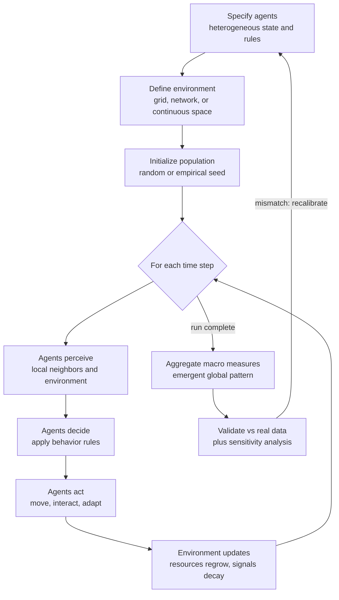

# 🌱 Agent-Based Modeling

> [!abstract] TL;DR
> **Agent-Based Modeling (ABM)** is a **bottom-up** simulation method: instead of writing an equation for the aggregate, you code a population of **autonomous, heterogeneous agents**, give each one simple **local rules** and a place to live (a grid, a network, a space), press play, and *watch what emerges*. The macro-patterns — segregation, cooperation, flocks, market crashes — are never programmed in; they are **grown** from micro-interactions. Joshua Epstein's slogan captures the whole epistemology: *"If you didn't grow it, you didn't explain it."* ABM is the primary experimental laboratory for [[Complex_Adaptive_Systems]] and the way we make [[Emergence_and_Self_Organization]] concrete enough to test.

---

## Intuition

**Analogy:** Imagine you want to understand why a stadium crowd forms a spontaneous **Mexican wave**. The old-school approach writes a single equation for "the wave" and fits its speed and width to data. The ABM approach does something completely different and stranger: you sit down and write the rulebook for *one single fan* — "stand up about a second after the person on your left stands, then sit back down" — hand that same tiny rulebook to fifty thousand simulated fans in their seats, and run it. Nobody coded a wave. Nobody is in charge of the wave. Yet a wave rolls around the stadium anyway, at a speed and width that *fall out* of the individual reaction times. You did not describe the wave; you **grew** it, and by growing it you discovered exactly which individual behaviors are necessary and sufficient to produce it.

That is the entire philosophy of agent-based modeling. You never model the forest — you model the trees, plus the rules by which trees shade, seed, and compete with their neighbors, and then the forest **appears in the simulation as a consequence**. If it appears, you have a candidate explanation. If it refuses to appear no matter how you tune the trees, you have learned that your micro-story is wrong.

---

## How It Works

### Core Mechanics

Every agent-based model is assembled from four ingredients and one loop.

1. **Agents.** Autonomous entities with internal **state** (position, wealth, opinion, health), a set of **behavior rules**, and — crucially — **heterogeneity**: they are *not* identical. Agent 4,192 can be poorer, more stubborn, or better-connected than agent 17. This variance is not noise to be averaged away; it is the engine of the interesting behavior.
2. **Environment.** The world the agents inhabit and sense: a 2-D lattice, a social network, a continuous plane, a landscape of resources. The environment has its own state and dynamics (grass regrows, pheromone evaporates, prices post).
3. **Interaction rules.** Agents act on **local** information — their neighbors, their patch, the signals within reach — never on a global blackboard. Interaction may be spatial (adjacent cells), topological (network ties), or mediated (a shared market price).
4. **Adaptation.** Optionally, agents **change their rules over time** — by learning, imitation, or selection — so the population co-evolves. Static rules give you emergence; adaptive rules give you a full [[Complex_Adaptive_Systems]] laboratory.

The **loop**: initialize the population, then repeatedly step time forward. On each step every agent **perceives** its local surroundings, **decides** via its rules, and **acts** (moves, interacts, reproduces, updates state); the environment then updates; and the modeler **aggregates** macro-measures (a segregation index, an average opinion, a population count). The scientific payload is the **time series of the aggregate**, which nobody wrote down directly.

### The generative approach

Epstein and Axtell reframed the goal of social science around this method: **to *explain* a macroscopic regularity is to exhibit a population of agents whose local interactions *generate* it.** Fitting a curve to aggregate data is description, not explanation; only a working micro-mechanism that *produces* the curve counts as an explanation. Hence the manifesto: *"If you didn't grow it, you didn't explain it."* This flips the usual burden of proof — a beautiful macro-equation that no plausible set of individuals could have produced is, on this view, suspect.

### ABM vs equation-based / system-dynamics modeling

The sharpest way to understand ABM is against its foil, aggregate **equation-based modeling** — of which [[Stocks_Flows_and_System_Dynamics]] is the canonical form. Both simulate over time; they differ in *what the unit of analysis is*.

- **System dynamics** tracks **aggregate stocks** (total infected, total predators) with differential equations. It assumes the population is **well-mixed and homogeneous** — every individual is the average individual, and space and network structure are erased.
- **ABM** tracks **each individual** and its **location or connections**. Heterogeneity and space are first-class. A vaccine-hesitant cluster, a superspreader with 300 contacts, a poor agent trapped in a poor neighborhood — these have no representation in a stock, but they are exactly where ABM earns its keep. When individual variance and local structure *matter to the outcome*, ABM sees what the aggregate equation is blind to; when they wash out, the equation is cheaper and clearer.

### Flow / Architecture



---

## Key Concepts

### Secondary
- **Model the individual, watch the group.** You write rules for one agent, copy it thousands of times, run it, and the group-level pattern shows up on its own.
- **Local rules, global patterns.** Each agent only sees its neighbors, yet the whole crowd can segregate, cooperate, or stampede.
- **Classic examples to remember.** **Schelling's segregation** (mild preferences produce sharp separation), **Boids** (three rules produce a flock), and **Sugarscape** (agents harvesting sugar on a grid reproduce wealth inequality).
- **"If you didn't grow it, you didn't explain it."** A pattern is explained only when you can build the little world that produces it.

### Undergraduate
- **The four building blocks.** Heterogeneous **agents**, an **environment**, **local interaction rules**, and optional **adaptation** — plus the perceive–decide–act loop over discrete time.
- **ABM vs system dynamics.** Individual-and-spatial versus aggregate-and-well-mixed. Choose ABM when heterogeneity, network topology, or space drive the outcome; choose stocks-and-flows when they average out.
- **Canonical models and what each proves.** **Schelling (1971)** — tolerant micro-preferences yield intolerant macro-segregation. **Axelrod's tournaments (1984)** — Tit-for-Tat wins the iterated Prisoner's Dilemma, showing how cooperation can emerge among selfish agents (see [[Repeated_Games_and_Folk_Theorems]]). **Epstein & Axtell's Sugarscape (1996)** — a whole "artificial society" grows wealth distributions, migration, trade, and combat from foraging rules. **Reynolds' Boids (1987)** — flocking from cohesion, alignment, separation.
- **The ODD protocol.** A standard template — **Overview, Design concepts, Details** — for *describing* an ABM so that others can replicate it. It exists because ABMs are code, and prose descriptions of code are notoriously ambiguous.
- **Tooling.** **NetLogo** (the teaching and prototyping standard, batteries-included), **Mesa** (Python, integrates with the scientific stack), and **Repast** (Java/C++, built for large-scale, high-performance runs).

### Graduate
- **Calibration and validation.** *Calibration* tunes parameters so outputs match empirical data; *validation* asks whether the model reproduces patterns it was **not** fitted to. **Pattern-Oriented Modeling** (Grimm) validates against *multiple* observed patterns at once, sharply constraining the many degrees of freedom.
- **The docking problem (alignment).** Because an ABM's behavior is emergent and implementation-dependent, two teams coding "the same" model in different platforms can get different results. **Docking** — deliberately reproducing one model in another framework (Axtell et al., 1996) — tests whether a finding is a property of the *theory* or an artifact of the *code*.
- **Sensitivity analysis.** Emergent outputs can hinge on obscure parameters (neighborhood radius, update order, boundary conditions). Global sensitivity analysis (Sobol indices, Latin-hypercube sampling) maps which inputs actually drive the variance — indispensable given the **parameter explosion** of rich models.
- **Update schemes matter.** Synchronous vs asynchronous updating, and the agent activation order, can change results qualitatively — a subtle validity threat unique to discrete-agent simulation.
- **Overfitting and the flexibility trap.** With enough free rules and parameters an ABM can reproduce almost any target, which makes a good fit weak evidence. Parsimony, out-of-sample pattern matching, and pre-registration of predictions are the defenses.
- **Relation to formal theory.** ABM sits between closed-form [[Repeated_Games_and_Folk_Theorems|game theory]] and pure data: it is the computational sibling of evolutionary game dynamics and of engineered [[Multi_Agent_and_Inverse_RL|multi-agent learning]], trading analytic tractability for the ability to include heterogeneity, space, and out-of-equilibrium transients.

---

## Python Demo

The **Deffuant bounded-confidence** model of opinion dynamics (Deffuant et al., 2000) is a perfect minimal ABM: a *population* of heterogeneous agents, one absurdly simple interaction rule, and a striking emergent macro-pattern. Each agent holds an opinion in `[0, 1]`. Repeatedly, two random agents meet — but they only influence each other **if their opinions are already within a confidence threshold `epsilon`** (you don't listen to people too far from you). When they do, they compromise, moving toward each other. Nothing tells the population to form factions, yet the emergent number of surviving opinion clusters obeys a clean rule of thumb: roughly `1 / (2 * epsilon)`. High tolerance produces **consensus**; low tolerance produces **fragmentation** into rival camps. Uses only `numpy` and `matplotlib`.

```python
# Deffuant bounded-confidence opinion dynamics: a population-level ABM.
# Heterogeneous agents hold opinions in [0,1]; two agents influence each
# other ONLY if their opinions differ by less than epsilon (bounded
# confidence). We watch macro opinion clusters emerge from this micro rule.
import numpy as np
import matplotlib.pyplot as plt

N       = 200     # number of agents (a whole population)
MU      = 0.5     # convergence rate: each meeting agent moves halfway
SWEEPS  = 60      # a "sweep" = N random pairwise encounters

def deffuant(epsilon, n=N, mu=MU, sweeps=SWEEPS, seed=1):
    r = np.random.default_rng(seed)
    x = r.uniform(0.0, 1.0, size=n)          # heterogeneous initial opinions
    history = [x.copy()]
    for _ in range(sweeps):
        for _ in range(n):                   # one sweep = n random encounters
            i, j = r.integers(0, n, size=2)
            if i == j:
                continue
            if abs(x[i] - x[j]) < epsilon:    # bounded confidence: only if close
                xi, xj = x[i], x[j]
                x[i] = xi + mu * (xj - xi)     # the two agents compromise,
                x[j] = xj + mu * (xi - xj)     # moving toward each other
        history.append(x.copy())
    return np.array(history)

def n_clusters(x, tol=0.02):
    """Count distinct opinion clusters in the final population."""
    s = np.sort(x)
    return 1 + int(np.sum(np.diff(s) > tol))

eps_low, eps_high = 0.15, 0.35               # low vs high tolerance
H_low  = deffuant(eps_low,  seed=1)
H_high = deffuant(eps_high, seed=1)

# --- visualize every agent's opinion trajectory over time ---
fig, ax = plt.subplots(1, 2, figsize=(13, 5), sharey=True)
for a, (H, eps) in zip(ax, [(H_low, eps_low), (H_high, eps_high)]):
    t = np.arange(H.shape[0])
    for k in range(N):                        # one faint line per agent
        a.plot(t, H[:, k], color="steelblue", alpha=0.15, lw=0.8)
    a.set_title("epsilon = {:.2f}  ->  {} clusters".format(eps, n_clusters(H[-1])))
    a.set_xlabel("sweep"); a.set_ylim(0, 1)
ax[0].set_ylabel("opinion")
plt.suptitle("Deffuant ABM: opinion clusters emerge from a local compromise rule")
plt.tight_layout(); plt.show()

print("low  tolerance eps={:.2f}: {} clusters  (fragmentation)"
      .format(eps_low,  n_clusters(H_low[-1])))
print("high tolerance eps={:.2f}: {} clusters  (consensus)"
      .format(eps_high, n_clusters(H_high[-1])))
print("emergent rule of thumb: number of clusters ~ 1 / (2 * epsilon)")
```

Running it, the trajectories start as a uniform smear of 200 distinct opinions and then **branch and merge**: for `epsilon = 0.15` the population splits into several stable, mutually-deaf factions; for `epsilon = 0.35` the same rule drives everyone into a single consensus. The number of factions was never coded — it is an **emergent aggregate property** of how tolerant the individuals are, exactly the kind of micro-to-macro claim ABM exists to make.

---

## Real-World Applications

> **Example — Epstein & Axtell's Sugarscape.** In *Growing Artificial Societies* (1996), agents with heterogeneous vision and metabolism forage for sugar on a 2-D grid. From those two attributes alone the model **grows** a right-skewed **wealth distribution** resembling real economies, plus migration waves, seasonal die-offs, trade prices, and even combat and disease when the rules are extended. Nobody encoded "inequality"; it emerged from luck of birthplace plus individual differences — a working demonstration that a skewed wealth curve needs no exotic assumptions.

- **Epidemiology.** Individual-based epidemic models (e.g., the Imperial College and network-SEIR COVID-19 models) simulate specific people, households, schools, and workplaces to test targeted interventions — school closures, superspreader effects, vaccine-hesitant clusters — that a well-mixed compartmental model literally cannot represent.
- **Economics and finance.** Agent-based artificial stock markets (the Santa Fe Artificial Stock Market) reproduce fat-tailed returns and volatility clustering from heterogeneous trading strategies, phenomena that equilibrium theory struggles to generate.
- **Ecology and conservation.** Individual-based models track specific animals' movement and energy budgets to predict how habitat loss or fishing quotas ripple up to population collapse or recovery.
- **Urban planning and traffic.** MATSim and similar platforms simulate millions of individual trips to evaluate congestion pricing, transit lines, and evacuation plans before any concrete is poured.
- **Operations and logistics.** Warehouse robot fleets, supply-chain resilience, and crowd-safety design (pedestrian evacuation) are routinely stress-tested as agent simulations.

---

## Common Pitfalls

- **Parameter explosion.** Rich agents invite dozens of tunable knobs; the input space grows combinatorially and becomes impossible to explore or defend. Start with the *simplest* model that could possibly show the effect (the KISS principle) and add complexity only when a specific pattern demands it.
- **Overfitting disguised as explanation.** A flexible ABM can reproduce almost any target series, so a good fit is weak evidence. Validate against **patterns it was not calibrated on**, and prefer parsimonious rule sets.
- **Skipping sensitivity analysis.** Emergent results can secretly hinge on a neighborhood radius, a boundary condition, or the agent update order. Without global sensitivity analysis you cannot know whether your headline finding is robust or an artifact.
- **The docking / reproducibility trap.** "The same" model in NetLogo and Mesa can diverge because of subtle implementation choices. Publish the code, follow the **ODD protocol**, and where stakes are high, dock the model in a second framework.
- **Confusing synchronous and asynchronous updating.** Updating all agents at once versus one-at-a-time can flip results (Conway's Life is a famous cautionary tale). State the scheme explicitly and check that conclusions survive changing it.
- **Mistaking a plausible story for a validated one.** A pretty emergent pattern proves your mechanism is *sufficient*, never that it is what actually happens in the world. Sufficiency in silico plus empirical validation is the real bar.
- **Reaching for ABM when an equation would do.** If heterogeneity and space wash out, a [[Stocks_Flows_and_System_Dynamics|system-dynamics]] model is cheaper, clearer, and easier to analyze. ABM earns its cost only when individuals and structure matter.

---

## Related Concepts

- [[Complex_Adaptive_Systems]] — ABM is the primary *method* for studying CAS: you code the heterogeneous, adapting agents and grow the emergent order in silico.
- [[Emergence_and_Self_Organization]] — ABM makes emergence experimental; the macro-pattern the agents produce is emergence you can measure and replicate.
- [[Stocks_Flows_and_System_Dynamics]] — the aggregate, well-mixed foil to ABM; the two are the complementary poles of dynamic simulation.
- [[Repeated_Games_and_Folk_Theorems]] — Axelrod's cooperation tournaments are the classic ABM study of the iterated Prisoner's Dilemma and how cooperation emerges among selfish agents.
- [[Multi_Agent_and_Inverse_RL]] — engineered cousin of ABM where agents *learn* their rules rather than being hand-coded; both study behavior emerging from many local optimizers.
- [[Collective_Behavior_and_Crowds]] — the sociological phenomena (panics, fads, segregation) that ABM most successfully reproduces from individual behavior.
- [[Social_Networks_and_Social_Ties]] — network topology is a common ABM environment; who talks to whom shapes which macro-patterns can emerge.
- [[Criticality_and_Phase_Transitions]] — many ABMs exhibit sharp regime changes (the Deffuant consensus/fragmentation transition in the demo) as a control parameter crosses a threshold.

---

## Review Questions

1. **(Conceptual)** Explain Epstein's dictum "if you didn't grow it, you didn't explain it." Why does this framing treat a well-fitting aggregate equation as *description* rather than *explanation*, and what would count as a genuine explanation on this view?
2. **(Scenario)** A public-health team must decide between a compartmental SEIR model (stocks and flows) and an agent-based model to plan a vaccination campaign. Give two concrete features of the real epidemic that would make you insist on ABM, and one situation in which the simpler equation-based model is the better choice. Justify each with the heterogeneity-and-space argument.
3. **(Trade-off / methodological)** You build an ABM whose emergent output matches historical data beautifully after tuning fourteen parameters. A reviewer is unimpressed. Explain, using the ideas of overfitting, sensitivity analysis, the docking problem, and pattern-oriented validation, what additional evidence would be needed before the fit should be believed as an explanation rather than a coincidence.

---

## Sources

- Epstein, J. M., & Axtell, R. (1996). *Growing Artificial Societies: Social Science from the Bottom Up*. Brookings Institution Press / MIT Press. — The Sugarscape model and the generative program.
- Epstein, J. M. (1999). "Agent-Based Computational Models and Generative Social Science." *Complexity*, 4(5), 41–60. — Source of "if you didn't grow it, you didn't explain it."
- Axelrod, R. (1984). *The Evolution of Cooperation*. Basic Books. — The iterated Prisoner's Dilemma computer tournaments.
- Grimm, V., et al. (2006). "A standard protocol for describing individual-based and agent-based models" (the ODD protocol). *Ecological Modelling*, 198(1–2), 115–126.
- Deffuant, G., Neau, D., Amblard, F., & Weisbuch, G. (2000). "Mixing beliefs among interacting agents." *Advances in Complex Systems*, 3(1–4), 87–98. — The bounded-confidence model in the demo.
- Bonabeau, E. (2002). "Agent-based modeling: Methods and techniques for simulating human systems." *PNAS*, 99(suppl. 3), 7280–7287.

---

#complexity #agent-based-modeling #simulation #bottom-up #abm
