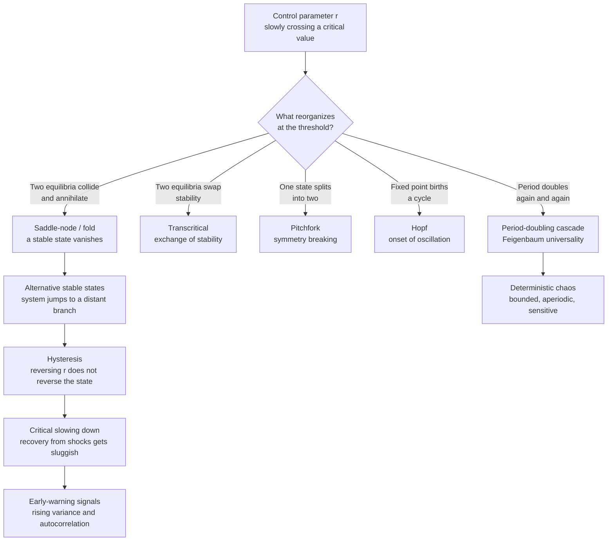

# 🔀 Bifurcations and Tipping Points

> [!abstract] TL;DR
> A **bifurcation** is a *qualitative* change in a system's long-run behavior when a control parameter drifts past a critical value: equilibria appear or vanish, a steady state loses stability, or a fixed point gives birth to an oscillation. The handful of ways this can happen are universal normal forms — **saddle-node (fold)**, **transcritical**, **pitchfork**, **Hopf** (birth of a limit cycle), and **period-doubling** (whose infinite cascade, governed by the universal **Feigenbaum constant** $\delta \approx 4.669$, drives the logistic map into chaos). A **tipping point** is a saddle-node bifurcation in a real system — a lake, a coral reef, the AMOC — where crossing the threshold triggers a sudden, self-propelling shift to an **alternative stable state**. Because the two states overlap, the shift shows **hysteresis**: reversing the cause does not reverse the effect. As the system nears the fold, its recovery from small shocks slows to a crawl, and this **critical slowing down** leaves a statistical fingerprint — **rising variance and autocorrelation** — the leading candidate for an **early-warning signal**.

---

## Intuition

**Analogy — the folding camp chair.** Push down gently on the seat of a rickety folding chair and it springs back; it has one stable configuration, "open." Lean your weight forward, though, and there is a precise angle where the chair suddenly folds flat with a bang — no gradual sag, just a jump to the "collapsed" state. That angle is a **bifurcation**: below it the "open" equilibrium exists and is stable; exactly at it the open state and an unstable balancing point merge and annihilate; beyond it "open" no longer exists, so the chair has nowhere to go but flat.

Now try to un-fold it by leaning *back*. You cannot simply retrace your steps — you have to physically lift and re-latch the chair, pushing it well past the point where it collapsed. The forward-collapse angle and the reverse-recovery angle are *different*. That gap is **hysteresis**, and it is why tipping points are so dangerous: the world crosses a threshold in one direction almost for free, but climbing back out requires overshooting far in the other direction. And just before the chair goes, you can *feel* it getting wobbly — small nudges take longer to settle. That growing wobble, made quantitative, is the **early-warning signal** researchers hunt for in ecosystems and the climate.

---

## How It Works

### Core Mechanics

1. **State, dynamics, and a knob.** Model the system as a state $x$ evolving by $\dot{x} = f(x, r)$, where $r$ is a slowly varying **control parameter** (nutrient load, temperature, harvesting pressure, growth rate). **Equilibria** are the states where $f(x^\*, r) = 0$; an equilibrium is **stable** if $\partial f / \partial x < 0$ there (perturbations decay) and **unstable** if it is positive (perturbations grow).

2. **A bifurcation is a change in the *portrait*, not the *position*.** Nudge $r$ and equilibria usually just drift smoothly. But at special **critical values** of $r$ the *number or stability* of equilibria changes — the qualitative phase portrait reorganizes. That structural change, not the quantitative drift, is the bifurcation.

3. **The five workhorse local bifurcations.**
   - **Saddle-node / fold** — a stable and an unstable equilibrium collide and mutually annihilate, so a steady state that existed simply *ceases to be*. This is the mathematics of a tipping point. Normal form: $\dot{x} = r + x^2$.
   - **Transcritical** — two equilibria pass through each other and *exchange stability*; the state persists but its role flips. Normal form: $\dot{x} = r x - x^2$.
   - **Pitchfork** — a single equilibrium loses stability and *splits into two* stable ones (supercritical) — the archetype of **symmetry breaking**. Normal form: $\dot{x} = r x - x^3$.
   - **Hopf** — a stable equilibrium loses stability and gives birth to a **limit cycle**: the origin of sustained **oscillation** (heartbeats, predator–prey cycles, the onset of flutter).
   - **Period-doubling (flip)** — in a discrete map, a stable cycle of period $2^n$ destabilizes into one of period $2^{n+1}$. Repeated infinitely, it is a **route to chaos**.

4. **The period-doubling cascade and Feigenbaum universality.** The **logistic map** $x_{n+1} = r\,x_n(1 - x_n)$ has a fixed point that period-doubles at $r = 3$, to period-4 near $r \approx 3.449$, to period-8 near $3.544$, with the doublings piling up geometrically and accumulating at $r_\infty \approx 3.5699$, where chaos begins. The *ratio* of successive parameter intervals converges to the **Feigenbaum constant** $\delta \approx 4.6692$ — a number that is the **same** for a huge class of unimodal maps, a startling universality (see [[Chaos_Theory_and_Sensitive_Dependence]]).

5. **Fold → alternative stable states → hysteresis.** Fold a positive feedback back on itself and the equilibrium curve becomes **S-shaped (a cusp)**: over a range of $r$ there are *two* stable branches separated by an unstable one — **alternative stable states**. Ramping $r$ up, the system clings to the lower branch until the *upper* fold, then jumps; ramping back down, it clings to the upper branch until the *lower* fold, then jumps back. The two jumps happen at different $r$, so the state traces a **hysteresis loop** — the effect is *path dependent* and the cause is not reversible on demand.

6. **Critical slowing down as an early warning.** Near a fold the dominant recovery rate $\lambda = \partial f/\partial x \to 0$, so the return time after a small shock $\sim 1/|\lambda|$ **diverges**. Under ongoing noise this sluggishness inflates two measurable statistics: **variance rises** (perturbations are not damped away) and **lag-1 autocorrelation rises** (each state resembles the last). Detecting this rise *before* the tip is the basis of **early-warning signals** for critical transitions.

### Flow / Architecture



---

## Key Concepts

### Secondary (intuition-level)
- **Bifurcation** — a threshold where a system's *behavior* suddenly changes kind, not just degree. Below it the chair springs back; above it, it folds flat.
- **Tipping point** — the specific threshold where a system flips into a very different state and tends to *stay* there.
- **Alternative stable states** — the same conditions can support two different "normal" situations (a clear lake vs a green algae-choked lake), and which one you get depends on history.
- **Hysteresis** — you cannot un-ring the bell by lowering the cause back to where it was; you have to push much further the other way.
- **Early-warning wobble** — a system about to tip becomes sluggish and jittery, recovering more slowly from small disturbances.

### Undergraduate (mechanism-level)
- **Equilibria and stability** — solve $f(x^\*, r) = 0$; the sign of $\partial f/\partial x$ at $x^\*$ decides stability. A bifurcation occurs where an equilibrium has $\partial f/\partial x = 0$ *and* the count or stability of roots changes.
- **Normal forms** — every generic local bifurcation is *equivalent* (by smooth change of coordinates) to a simple polynomial: fold $\dot{x}=r+x^2$, transcritical $\dot{x}=rx-x^2$, pitchfork $\dot{x}=rx-x^3$. This is why a lake and a laser can share the same tipping mathematics.
- **Logistic map** — the minimal model showing period-doubling; iterate $x_{n+1}=r\,x_n(1-x_n)$ and sweep $r$ to draw the **bifurcation diagram**.
- **Feigenbaum constants** — $\delta \approx 4.6692$ (ratio of successive doubling intervals) and $\alpha \approx 2.5029$ (branch-width scaling); universal across unimodal maps with a quadratic maximum.
- **Cusp and hysteresis loop** — an S-shaped equilibrium curve (two folds) produces bistability; the width of the loop measures how irreversible the transition is.

### Graduate (system-level)
- **Local vs global bifurcations** — saddle-node, transcritical, pitchfork, Hopf, and flip are **local** (detected from the Jacobian's eigenvalues crossing the imaginary axis at an equilibrium or the unit circle for a map). **Global** bifurcations (homoclinic, saddle-node of limit cycles, boundary crises) reshape trajectories over large regions and cannot be seen from linearization alone.
- **Catastrophe theory (Thom)** — René Thom classified how the *minima of a potential* $V(x; r)$ appear and vanish as control parameters vary; for up to four control parameters there are exactly **seven elementary catastrophes** (fold, cusp, swallowtail, butterfly, and three umbilics). The **cusp catastrophe** is precisely the fold-with-hysteresis geometry, with a bistable region bounded by two fold lines meeting at a cusp point.
- **Codimension** — the number of parameters that must be tuned to encounter a bifurcation. Fold/transcritical/pitchfork/Hopf are codimension-1 (a single knob suffices); the cusp is codimension-2. Higher-codimension **organizing centers** (Bogdanov–Takens, cusp) unfold whole families of lower ones.
- **Early-warning theory** — near a codimension-1 fold the leading eigenvalue $\lambda(r) \sim -\sqrt{r_c - r}$ approaches zero, so return time diverges and, for an Ornstein–Uhlenbeck approximation of the fluctuations, stationary **variance** $\sim \sigma^2/(2|\lambda|)$ and **lag-1 autocorrelation** $\sim e^{\lambda \Delta t} \to 1$ both climb. Complementary indicators include rising skewness, increased "flickering" between basins, and spatial correlation in extended systems. All are *necessary but not sufficient*: they can rise without a tip and can miss purely stochastic ("noise-induced") or rate-induced transitions.
- **Rate-induced tipping (R-tipping)** — a system can cross into another basin not because the parameter passed a fold but because it changed *too fast* for the state to track its moving equilibrium; classical bifurcation analysis, which assumes quasi-static change, does not capture this.

---

## Python Demo

Two self-contained `numpy` + `matplotlib` demonstrations. **(1)** draws the **logistic-map bifurcation diagram**, revealing the period-doubling cascade to chaos. **(2)** takes a bistable fold model and shows both the **hysteresis loop** and **critical slowing down** — rising variance and lag-1 autocorrelation as an early-warning signal before a tipping point.

```python
# Bifurcations and tipping points: (1) logistic-map cascade,
# (2) fold hysteresis + early-warning signals. numpy + matplotlib only.
import numpy as np
import matplotlib.pyplot as plt

# =====================================================================
# 1) LOGISTIC MAP BIFURCATION DIAGRAM: x -> r x (1 - x)
#    Sweep r, discard transients, plot the long-run attractor.
# =====================================================================
r = np.linspace(2.5, 4.0, 2000)      # control parameter across all columns
x = 1e-5 * np.ones_like(r)           # same seed for every r
n_iter, n_keep = 1000, 200           # iterate, then keep the last 200 (attractor)

rr, xx = [], []
for i in range(n_iter):
    x = r * x * (1.0 - x)            # vectorized map, all r at once
    if i >= n_iter - n_keep:
        rr.append(r.copy()); xx.append(x.copy())
rr = np.concatenate(rr); xx = np.concatenate(xx)

plt.figure(figsize=(10, 6))
plt.plot(rr, xx, ",k", alpha=0.25)   # 1-pixel markers reveal fine structure
for rc, lab, col in [(3.0, "period 2", "C0"),
                     (3.449, "period 4", "C1"),
                     (3.5699, "chaos onset", "C3")]:
    plt.axvline(rc, ls="--", color=col, alpha=0.7, label=f"r = {rc}  ({lab})")
plt.title("Logistic map: period-doubling route to chaos")
plt.xlabel("growth parameter r"); plt.ylabel("long-run state x")
plt.legend(loc="lower left"); plt.tight_layout(); plt.show()

# =====================================================================
# 2) FOLD BIFURCATION: dx/dt = -x^3 + x + r
#    Equilibria solve r = x^3 - x (an S-curve). Folds at r = +/- 2/(3*sqrt3).
# =====================================================================
def f(x, r):
    return -x**3 + x + r

r_fold = 2.0 / (3.0 * np.sqrt(3.0))  # ~0.385: the two saddle-node points

# ---- (a) Hysteresis: ramp r up then back down, integrating x (Euler) ----
def ramp(r_seq, x0, dt=0.02):
    x, out = x0, np.empty_like(r_seq)
    for i, rr_ in enumerate(r_seq):
        x += f(x, rr_) * dt          # quasi-static: r drifts slower than x relaxes
        out[i] = x
    return out

r_up   = np.linspace(-1.5, 1.5, 6000)
r_down = r_up[::-1]
x_up   = ramp(r_up,   x0=-1.2)       # starts on the lower branch
x_down = ramp(r_down, x0=+1.2)       # starts on the upper branch

xg = np.linspace(-1.3, 1.3, 400)     # analytic equilibrium S-curve r = x^3 - x
r_eq = xg**3 - xg
stable = np.abs(xg) > 1.0 / np.sqrt(3.0)   # outer branches stable, middle unstable

# ---- (b) Critical slowing down: ramp r slowly toward the fold with noise ----
rng = np.random.default_rng(1)
T, dt, sigma = 6000, 0.01, 0.03
r_series = np.linspace(-1.0, 0.42, T)      # creep up past the fold ~0.385 -> tips
x, xs = -1.0, np.empty(T)
for i in range(T):
    x += f(x, r_series[i]) * dt + sigma * np.sqrt(dt) * rng.standard_normal()
    xs[i] = x

win = 400                                   # rolling early-warning statistics
var = np.full(T, np.nan); ar1 = np.full(T, np.nan)
for i in range(win, T):
    seg = xs[i-win:i] - xs[i-win:i].mean()  # detrend by the window mean
    var[i] = seg.var()
    ar1[i] = np.corrcoef(seg[:-1], seg[1:])[0, 1]
tip = np.argmax(xs > 0.0)                    # index where the state jumps up

# ---- Plot the fold story ----
fig, ax = plt.subplots(1, 3, figsize=(16, 4.6))

ax[0].plot(r_eq[stable],  xg[stable],  ".", ms=2, color="C2", label="stable equilibria")
ax[0].plot(r_eq[~stable], xg[~stable], ".", ms=2, color="C3", label="unstable (tipping ridge)")
ax[0].plot(r_up,   x_up,   lw=1.4, color="C0", label="ramp r up")
ax[0].plot(r_down, x_down, lw=1.4, color="C1", ls="--", label="ramp r down")
for s in (+r_fold, -r_fold):
    ax[0].axvline(s, color="gray", ls=":", alpha=0.6)
ax[0].set_title("Fold bifurcation + hysteresis loop")
ax[0].set_xlabel("control parameter r"); ax[0].set_ylabel("state x"); ax[0].legend(fontsize=8)

ax[1].plot(r_series, xs, lw=0.8, color="C0")
ax[1].axvline(r_series[tip], color="C3", ls="--", label="tipping point")
ax[1].axvline(r_fold, color="gray", ls=":", label="fold r*")
ax[1].set_title("Stochastic approach to the tip")
ax[1].set_xlabel("control parameter r (ramping)"); ax[1].set_ylabel("state x"); ax[1].legend(fontsize=8)

axv = ax[2]; axa = axv.twinx()
axv.plot(r_series[:tip], var[:tip], color="C4", label="variance")
axa.plot(r_series[:tip], ar1[:tip], color="C5", label="lag-1 autocorr")
axv.set_title("Early-warning signals rise before the tip")
axv.set_xlabel("control parameter r (ramping)")
axv.set_ylabel("rolling variance", color="C4"); axa.set_ylabel("lag-1 autocorrelation", color="C5")
axv.tick_params(axis="y", colors="C4"); axa.tick_params(axis="y", colors="C5")

plt.tight_layout(); plt.show()

print(f"Fold (saddle-node) at r* = +/- {r_fold:.3f}")
print(f"System tipped at r = {r_series[tip]:.3f} (just past the fold)")
```

**What you should see:** the logistic diagram splits from one line into 2, 4, 8 branches at ever-closer values of $r$, then dissolves into a chaotic smear near $r \approx 3.57$ — pierced by clean *periodic windows* (the wide period-3 band near $r \approx 3.83$). In the fold figure, the up-ramp and down-ramp trace a **hysteresis loop** around the unstable middle branch; the stochastic run creeps along the lower branch and then jumps; and just before that jump, **both variance and lag-1 autocorrelation climb** — critical slowing down made visible.

---

## Real-World Applications

- **Shallow lakes — eutrophication (Scheffer).** Phosphorus loading nudges a clear, plant-dominated lake toward a turbid, algae-dominated state. The transition is a fold: once tipped, the lake stays green even after nutrients are cut back to pre-collapse levels, because turbidity self-reinforces (algae shade out the rooted plants that once held sediment down). Restoration requires overshooting far below the original threshold — textbook **hysteresis**.
- **Coral reefs — coral-to-macroalgae shifts.** Overfishing of herbivores plus warming pushes reefs across a tipping point into an algae-dominated stable state that resists reversal; the same alternative-stable-states logic governs kelp forests vs urchin barrens (see [[Community_Ecology]]).
- **Climate tipping elements (Lenton).** Large Earth subsystems behave as fold bifurcations: **AMOC** shutdown (see [[Thermohaline_Circulation_and_AMOC]]), **Greenland and West Antarctic ice-sheet** collapse, **Amazon** dieback, permafrost carbon release. Ice–albedo and salt-advection feedbacks create bistability, so partial reversal of forcing may not restore the prior state (see [[Climate_Sensitivity_and_Feedbacks]]).
- **Physiology and medicine.** Cardiac **fibrillation** onset and epileptic **seizures** are modeled as bifurcations; asthma attacks and depression relapse show critical-slowing-down warning signals (rising variance/autocorrelation in monitoring data) before a state transition.
- **Engineering — Hopf and flutter.** Aeroelastic **flutter** of a wing, "hunting" oscillation of rail bogies, and the onset of laser emission are Hopf bifurcations: a steady state loses stability to a growing limit cycle at a critical speed, power, or gain.
- **Finance and social systems.** Market regime shifts, bank runs, and bubble collapses exhibit bistability, hysteresis, and pre-crash rises in variance and autocorrelation — early-warning research borrowed directly from ecology.

---

## Common Pitfalls

- **Confusing a bifurcation with a mere large change.** A bifurcation is a *qualitative* change in the phase portrait (equilibria created/destroyed or changing stability), not just a big quantitative jump. A smooth, reversible, large response is not a bifurcation.
- **Assuming the tip is reversible.** Because of hysteresis, "we will simply lower the pressure back" fails: the return threshold is well past the collapse threshold. Managers and policymakers repeatedly discover the system has latched into a new basin.
- **Treating early-warning signals as sufficient.** Rising variance and autocorrelation are *necessary indicators* of critical slowing down but can appear without a tip, can be swamped by observation noise or short records, and **miss** noise-induced and **rate-induced** transitions that carry no slowing-down signature.
- **Over-reading a single detrending window.** Early-warning statistics are sensitive to the choice of rolling window, filtering, and how you remove the trend; a signal that flips with reasonable parameter changes is not robust. Always test sensitivity and use surrogates.
- **Ignoring rate-induced tipping.** A system can cross into another basin because a parameter moved *too fast* to track, even though it never passed a fold. Quasi-static bifurcation analysis silently assumes slow forcing.
- **Confusing chaos with a bifurcation.** Chaos is an *attractor type* (bounded, aperiodic, sensitive); a bifurcation is a *transition between* behaviors. The period-doubling cascade is a *sequence of bifurcations that leads to* chaos, not chaos itself (see [[Chaos_Theory_and_Sensitive_Dependence]]).
- **Reading noise-driven flickering as the tip itself.** Near a shallow fold, noise can bounce the system briefly across basins ("flickering") before the parameter truly forces the transition; mistaking flickering for the permanent shift misdates the tipping point.

---

## Related Concepts

- [[Chaos_Theory_and_Sensitive_Dependence]] — the **period-doubling cascade** (Feigenbaum) is the sequence of bifurcations that carries the logistic map *into* chaos; chaos is the destination, bifurcations are the road.
- [[Criticality_and_Phase_Transitions]] — the statistical-mechanics cousin: critical transitions, diverging correlation/return times, and the same **critical slowing down** and power-law fingerprints.
- [[Nonlinearity_and_Feedback]] — bifurcations *require* nonlinearity; saturating positive feedback is exactly what folds the equilibrium curve into the S-shape behind **multistability and hysteresis**.
- [[Feedback_Loops_and_Causality]] — reinforcing (positive) feedback creates the bistability that makes fold bifurcations and regime shifts possible; balancing feedback with delay underlies Hopf oscillations.
- [[Emergence_and_Self_Organization]] — a regime shift is a jump between emergent macro-states; symmetry-breaking pitchforks are how ordered patterns emerge from uniform ones.
- [[Thermohaline_Circulation_and_AMOC]] — the AMOC is the canonical **climate tipping element**, a salt-advection fold with hysteresis and a feared abrupt shutdown.
- [[Climate_Sensitivity_and_Feedbacks]] — the feedbacks quantified there set how close the climate sits to its tipping elements.
- [[Community_Ecology]] — **alternative stable states** and regime shifts (lakes, reefs, kelp/urchin) are the ecological face of the fold bifurcation.

---

## Review Questions

**Tier 1 — Conceptual.**
Using the folding-chair analogy, explain the difference between (a) the chair *gradually sagging* as you add weight and (b) the chair *suddenly folding flat*. Which one is a bifurcation, and why does the angle at which it folds forward differ from the angle needed to re-open it?

**Tier 2 — Applied / scenario.**
A lake has slid from clear to turbid after decades of fertilizer runoff. The local council proposes cutting phosphorus input back to the level it was at *just before* the collapse, expecting the lake to clear. Explain, in terms of alternative stable states and hysteresis, why this is likely to fail, and describe what the phosphorus level would actually have to do to restore the clear state.

**Tier 3 — Analysis / trade-off.**
You are monitoring a system that may be approaching a saddle-node tipping point. You observe rising variance and rising lag-1 autocorrelation in the residuals over the last year. (a) Why does approaching a *fold* produce exactly this signature — what is happening to the leading eigenvalue and the return time? (b) Give two distinct reasons these early-warning signals could mislead you (one where they rise but no tip comes, one where a tip comes with no warning), and name the class of transition responsible for the second.

---

## Sources

- Strogatz, S. H. (2015). *Nonlinear Dynamics and Chaos: With Applications to Physics, Biology, Chemistry, and Engineering* (2nd ed.). Westview Press. — bifurcations, normal forms, and the logistic map.
- Scheffer, M., Carpenter, S., Foley, J. A., Folke, C., & Walker, B. (2001). "Catastrophic shifts in ecosystems." *Nature*, 413, 591–596.
- Scheffer, M., et al. (2009). "Early-warning signals for critical transitions." *Nature*, 461, 53–59.
- Lenton, T. M., Held, H., Kriegler, E., Hall, J. W., Lucht, W., Rahmstorf, S., & Schellnhuber, H. J. (2008). "Tipping elements in the Earth's climate system." *PNAS*, 105(6), 1786–1793.
- Feigenbaum, M. J. (1978). "Quantitative universality for a class of nonlinear transformations." *Journal of Statistical Physics*, 19(1), 25–52.

---

#complexity #bifurcation #tipping-points #hysteresis #early-warning-signals
