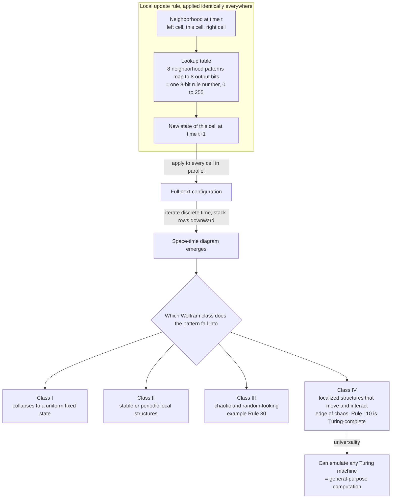

# 🔲 Cellular Automata

> [!abstract] TL;DR
> A **cellular automaton (CA)** is a discrete dynamical system: a grid of **cells**, each in one of finitely many **states**, all updated **simultaneously** in **discrete time** by the **same local rule** that looks only at a cell's immediate neighbors. Nothing is global — no equations of motion, no central controller, no lookahead — yet iterating a trivial rule over a whole lattice can produce fixed points, oscillations, chaos, or fully **general-purpose computation**. **Rule 30** manufactures apparent randomness from a two-line rule; **Rule 110** and **Conway's Game of Life** are proven **Turing-complete**; and Wolfram's *A New Kind of Science* elevates CA from a curiosity into an argument that much of the universe's complexity is **computationally irreducible** — you cannot shortcut it, you can only run it.

---

## Intuition

**Analogy:** Picture a stadium doing "the wave." Each spectator follows one dumb rule, checking only the people immediately to their left and right: *"if my neighbor just stood up, I stand up a moment later, then sit."* No one is directing the wave, no spectator can see the whole stadium, and the rule fits on a napkin — yet a coherent stripe of motion sweeps all the way around the arena. That travelling stripe is a **pattern the rule never mentions**; it lives at the scale of the crowd, not the person.

A cellular automaton is that stadium made mathematical and run for thousands of rounds. Replace spectators with cells on a grid, "standing / sitting" with a handful of discrete states, and "glance at your neighbors, then update" with a fixed lookup table applied to *every* cell at *every* tick simultaneously. The astonishing empirical fact is that some napkin-sized rules do not just make waves — they make gliders, logic gates, and pseudo-random noise, and a few of them can compute **anything a computer can compute.**

---

## How It Works

### Core Mechanics

A cellular automaton is defined by four ingredients, and nothing else:

1. **A lattice of cells.** A regular grid — a line (1D), a plane (2D), or higher. Cellular automata are spatially *discrete*: space is chopped into identical cells, not a continuum.
2. **A finite state set.** Each cell holds one of *k* states. The simplest and most studied case is *k = 2* (a cell is 0 or 1, "dead" or "alive"). States are *discrete*: there is no cell holding the value 0.37.
3. **A neighborhood.** Each cell "sees" a fixed, local set of neighbors. In 1D that is typically the cell plus its left and right neighbor (radius 1). In 2D the two standard choices are the **von Neumann neighborhood** (4 orthogonal neighbors) and the **Moore neighborhood** (all 8 surrounding cells, used by the Game of Life).
4. **A local transition rule.** A single lookup table maps *(neighborhood configuration) to (next state)*. The rule is **uniform** (same everywhere), **local** (only the neighborhood matters), **deterministic** (in the classic case), and applied **synchronously** — every cell computes its next state from the *current* configuration, then all update at once. Time, like space and state, is *discrete*.

For **elementary CA** — the 1D, two-state, radius-1 family — a cell's next state depends on 3 cells (left, self, right). There are 2^3 = 8 possible neighborhoods, and the rule assigns an output bit to each, so a rule *is* an 8-bit number: exactly **256 elementary rules**, numbered 0–255 in **Wolfram's numbering** (the bit for neighborhood pattern *i* is bit *i* of the rule number). Rule 30 and Rule 110 are two of these 256.

**Wolfram's classification.** Running each of the 256 rules from a simple seed, Wolfram observed that *all* CA fall into four qualitative classes — a taxonomy that generalizes far beyond elementary CA:

- **Class I — homogeneous.** Evolution dies to a single uniform state. All information is destroyed (analogous to a fixed-point attractor).
- **Class II — periodic.** Settles into stable or periodic local structures; a perturbation stays local (analogous to limit cycles).
- **Class III — chaotic.** Aperiodic, random-looking patterns; small perturbations spread rapidly. **Rule 30** is the exemplar — its center column passes stringent randomness tests and was used as a random-number generator.
- **Class IV — complex.** Localized structures that move, persist, and *interact* — neither frozen nor chaotic. This is the **"edge of chaos"**: rich enough to transmit, store, and process information. **Rule 110** and **Conway's Game of Life** live here, and both are **Turing-complete**.

**Computation and universality.** Class IV is not just pretty — it *computes*. Matthew Cook proved **Rule 110 is universal** (Turing-complete): with the right initial condition it emulates any Turing machine, so a 1D, 2-state, napkin-sized rule can in principle run any program. Conway's **Game of Life** is likewise universal — people have built AND/OR/NOT gates, memory, a programmable computer, and even a Game of Life *inside* the Game of Life, all out of gliders and glider guns. **John von Neumann** got there first, in the 1940s–50s: seeking the logic of *self-reproduction*, he designed a 29-state 2D CA containing a **universal constructor** — a configuration that builds a copy of itself (plus a copy of its own blueprint), anticipating the copy-plus-instructions architecture DNA would later be found to use.

**Wolfram's big claims.** In *A New Kind of Science* (2002), Wolfram argues two provocative theses. **Computational irreducibility:** for many systems there is *no shortcut* — the only way to know the outcome of *n* steps is to actually simulate all *n* steps; no closed-form formula compresses it. **The Principle of Computational Equivalence:** almost any process that is not obviously simple is computationally *universal*, and therefore all such processes are, in a precise sense, equivalent in sophistication — a swirling fluid, a growing shell, and a laptop are all "just computing," none fundamentally more powerful than the others.

### Flow / Architecture



---

## Key Concepts

**Secondary (intuition level)**
- A CA is a **grid of cells** where each cell is "on" or "off" and follows the **same simple neighbor rule** every tick — like a coloring game that updates itself.
- **Conway's Game of Life** has four rules (a live cell with 2 or 3 live neighbors survives; a dead cell with exactly 3 comes alive; otherwise you die of loneliness or overcrowding) and out of them come **gliders** that walk across the screen.
- Very simple rules can make surprisingly **complicated, life-like pictures** — the complexity is not built into the rule, it *grows* from running it.

**Undergraduate (mechanism level)**
- **Elementary CA** are the 256 one-dimensional, two-state, radius-1 rules; a rule is literally an **8-bit lookup table** and hence a number 0–255 (Wolfram numbering).
- **Wolfram's four classes**: I fixed, II periodic, III chaotic, IV complex — and the recognition that **Rule 30 is Class III** (a chaos/PRNG source) while **Rule 110 is Class IV**.
- **Game of Life zoology**: **still lifes** (block, beehive), **oscillators** (blinker, toad, pulsar), **spaceships** (the glider, period 4, moving diagonally), and the **Gosper glider gun** — a finite pattern that emits an infinite stream of gliders, proving Life supports unbounded growth.
- **Neighborhoods** (von Neumann vs Moore) and **boundary conditions** (periodic/toroidal, fixed, or reflecting) are *part of the model definition* and change the dynamics.
- **Synchronous vs asynchronous update**: the classic CA updates all cells at once from the previous state; updating cells one at a time (asynchronous) can yield qualitatively different behavior.

**Graduate (foundational level)**
- **Universality / Turing-completeness**: Cook's proof that **Rule 110** simulates a universal (cyclic-tag) system, and the constructions showing **Game of Life** is universal — logic gates, wires, and memory from gliders.
- **von Neumann's universal constructor** and the theory of **self-reproducing automata**: the copy-plus-blueprint logic that predates and parallels molecular biology.
- **Computational irreducibility**: when no algorithm predicts step *n* faster than running the system for *n* steps — a bound distinct from, but resonant with, undecidability and the halting problem.
- **The Principle of Computational Equivalence** and its philosophical payload: if "everything is computing" at the same maximal level, then complexity in nature is generic, not the product of special fine-tuning.
- **The edge of chaos and Langton's lambda (λ)**: λ is the fraction of neighborhood configurations that map to a non-quiescent state; sweeping λ from 0 upward drives a CA through order (Class I/II), through a narrow **critical region** where Class IV / long transients / maximal information transmission appear, and on into chaos (Class III) — a proposed link between **computation and phase transitions / criticality**.
- **Reversible and probabilistic CA**, **lattice-gas automata** (HPP, FHP) as discrete microdynamics whose macroscopic limit recovers the Navier–Stokes equations — CA as a bottom-up route to continuum physics.

---

## Python Demo

Two self-contained demos using only **numpy** and **matplotlib**. Part (a) builds the 256-rule elementary CA engine and renders the **space-time diagrams** of Rule 30 (chaos) and Rule 110 (complexity/universality). Part (b) implements **Conway's Game of Life** on a torus and watches a **glider** walk diagonally across the grid.

```python
# (a) Elementary 1D cellular automata: Rule 30 and Rule 110.
# A cell's next state depends on (left, self, right). There are 2^3 = 8
# neighborhoods, so a rule is an 8-bit lookup table -> a number 0..255.
import numpy as np
import matplotlib.pyplot as plt

def elementary_ca(rule, width, steps, seed_center=True):
    """Return a (steps x width) space-time array for an elementary CA rule."""
    # rule_bits[i] is the output for neighborhood index i, where
    # i = 4*left + 2*center + 1*right  (Wolfram numbering).
    rule_bits = np.array([(rule >> i) & 1 for i in range(8)], dtype=np.uint8)
    grid = np.zeros((steps, width), dtype=np.uint8)
    if seed_center:
        grid[0, width // 2] = 1                 # single live cell in the middle
    else:
        grid[0] = np.random.default_rng(0).integers(0, 2, width)
    for t in range(1, steps):
        row = grid[t - 1]
        left = np.roll(row, 1)                   # periodic (toroidal) boundary
        right = np.roll(row, -1)
        idx = (left << 2) | (row << 1) | right   # neighborhood index 0..7
        grid[t] = rule_bits[idx]                 # vectorized table lookup
    return grid

width, steps = 401, 200
r30 = elementary_ca(30, width, steps)            # Class III: chaotic / pseudo-random
r110 = elementary_ca(110, width, steps)          # Class IV: complex / Turing-complete

fig, ax = plt.subplots(1, 2, figsize=(14, 6))
ax[0].imshow(r30, cmap="binary", interpolation="nearest")
ax[0].set_title("Rule 30  -  Class III: chaos from a single seed")
ax[1].imshow(r110, cmap="binary", interpolation="nearest")
ax[1].set_title("Rule 110  -  Class IV: interacting structures (universal)")
for a in ax:
    a.set_xlabel("cell position")
    a.set_ylabel("time step (increasing downward)")
plt.tight_layout()
plt.show()

# Rule 30's center column is famously random-looking. A quick sanity check:
center_column = r30[:, width // 2]
print("Rule 30 center column, first 40 bits:")
print("".join(str(b) for b in center_column[:40]))
print(f"fraction of 1s in center column: {center_column.mean():.3f}")
```

```python
# (b) Conway's Game of Life: a glider walking across a 20x20 torus.
# Rules: a live cell survives with 2 or 3 live neighbors; a dead cell with
# exactly 3 live neighbors is born; all other cells become / stay dead.
import numpy as np
import matplotlib.pyplot as plt

def life_step(board):
    """One synchronous Game of Life update with periodic boundaries."""
    # Sum the 8 Moore neighbors by rolling the board in every direction.
    neighbors = sum(
        np.roll(np.roll(board, di, axis=0), dj, axis=1)
        for di in (-1, 0, 1) for dj in (-1, 0, 1)
        if not (di == 0 and dj == 0)
    )
    born = (board == 0) & (neighbors == 3)
    survive = (board == 1) & ((neighbors == 2) | (neighbors == 3))
    return (born | survive).astype(np.uint8)

board = np.zeros((20, 20), dtype=np.uint8)
glider = np.array([[0, 1, 0],
                   [0, 0, 1],
                   [1, 1, 1]], dtype=np.uint8)   # the classic period-4 spaceship
board[1:4, 1:4] = glider

frames = [board.copy()]
for _ in range(12):
    board = life_step(board)
    frames.append(board.copy())

# The glider returns to its shape every 4 steps, shifted one cell diagonally,
# so snapshots at t = 0, 4, 8, 12 show it translated across the grid.
snapshots = [0, 4, 8, 12]
fig, ax = plt.subplots(1, len(snapshots), figsize=(15, 4))
for k, t in enumerate(snapshots):
    ax[k].imshow(frames[t], cmap="binary", interpolation="nearest")
    ax[k].set_title(f"t = {t}")
    ax[k].set_xticks([])
    ax[k].set_yticks([])
fig.suptitle("Conway's Game of Life: a glider translating diagonally on a torus")
plt.tight_layout()
plt.show()
```

Running (a), Rule 30 fills the triangle with a mottled, seemingly random texture — one deterministic rule and one live cell, yet the center column behaves like a coin-flip stream. Rule 110 instead grows a forest of stable diagonal "wires" against which mobile structures collide and scatter — the visual signature of a system rich enough to carry and transform information. Running (b), the five-cell glider reappears unchanged every four ticks, one step down-and-right, the smallest proof that a CA can move a localized piece of "information" through space.

---

## Real-World Applications

- **Random number generation and cryptography.** Rule 30's center column was used as the default pseudo-random generator in **Wolfram's Mathematica** for years — a clean case of harnessing Class III chaos as an entropy source.
- **Biological pattern formation.** The pigmentation on mollusc **shells** (e.g. *Conus textile*) is astonishingly well reproduced by 1D CA rules acting along the growing shell lip, with time laid down as successive rows — nature literally printing a space-time diagram. CA and the closely related **reaction–diffusion** systems (Turing's morphogenesis) model animal coat markings, feather/scale spacing, and stripes.
- **Excitable media.** Heart tissue, neural fields, and the **Belousov–Zhabotinsky** chemical reaction are modeled as CA of excitable cells, reproducing **spiral waves** and reentrant arrhythmias — used in cardiology to study fibrillation and defibrillation.
- **Traffic flow.** The **Nagel–Schreckenberg** model is a probabilistic 1D CA in which cars accelerate, brake, and randomly dawdle; it spontaneously produces the **phantom jams** and stop-and-go waves seen on real highways, and underpins large-scale traffic simulators.
- **Fluid dynamics.** **Lattice-gas** and **lattice-Boltzmann** methods — CA of particles hopping and colliding on a lattice — recover the Navier–Stokes equations in the continuum limit and are used for flow through porous media and complex geometries.
- **Urban growth and ecology.** CA-based simulators such as **SLEUTH** model city sprawl and land-use change; forest-fire and epidemic CA (percolation-style spread) inform wildfire and outbreak planning.
- **Computer graphics and games.** CA drive **procedural generation** (cave systems, terrain), fire/smoke/fluid effects, and falling-sand games — cheap, local, embarrassingly parallel, and GPU-friendly.

---

## Common Pitfalls

- **Boundary conditions are part of the model, not a footnote.** Periodic (toroidal), fixed, and reflecting boundaries can produce different long-run behavior, especially near the domain edges. Silently changing the boundary can flip an oscillator into a dead state. State it explicitly.
- **Synchronous vs asynchronous updating changes the physics.** The classic CA updates every cell *from the same previous snapshot*. Updating cells in place, one at a time, is a *different system* — many Game-of-Life patterns simply break under asynchronous updates. Never update a cell using neighbors you have already updated this tick.
- **Confusing the rule-numbering convention.** "Rule 110" only means something under **Wolfram's specific bit ordering** (neighborhood index = 4·left + 2·center + right). Use a different bit order and your "Rule 110" is a different automaton. Fix the convention before comparing.
- **Mistaking deterministic chaos for true randomness.** Rule 30 *looks* random and passes many statistical tests, but it is fully deterministic and reproducible from its seed — excellent as a fast PRNG, dangerous as cryptographic randomness without careful analysis. Chaos is unpredictability of practice, not of principle.
- **Assuming complex output requires a complex rule.** The central lesson of CA is the opposite: **Rule 30, Rule 110, and Life are trivially simple rules** whose complexity is generated, not designed. Do not reverse-engineer a fancy rule to explain a fancy pattern.
- **Expecting to shortcut the simulation.** Because Class III/IV CA are typically **computationally irreducible**, there is generally no formula for the state at step *n*; you must actually run it. Treat "just derive a closed form" as usually impossible, not as a missing skill.
- **Reading intent into Class IV.** Localized, interacting structures (gliders, guns) *look* engineered, but they arise from the same blind local rule. Universality does not imply a designer — it is generic at the edge of chaos.

---

## Related Concepts

- [[Emergence_and_Self_Organization]] — CA are the cleanest laboratory for emergence: global patterns (gliders, waves, universality) that no cell's local rule mentions.
- [[Complex_Adaptive_Systems]] — CA are the minimal ancestor of agent-based models; add adaptation/heterogeneity to fixed CA cells and you approach a CAS.
- [[Chaos_Theory_and_Sensitive_Dependence]] — Wolfram Class III CA (Rule 30) are the discrete, spatial analogue of sensitive dependence: tiny changes in the seed diverge across the lattice.
- [[Criticality_and_Phase_Transitions]] — Langton's λ drives a CA through an order-to-chaos transition, placing complex Class IV behavior at a critical point, like a phase transition.
- [[Fractals_and_Self_Similarity]] — additive rules such as Rule 90 draw the **Sierpiński triangle**; CA are a natural generator of self-similar, fractal structure.
- [[Nonlinearity_and_Feedback]] — the CA transition rule is a nonlinear local feedback map; iterating it is what makes non-additive, surprising behavior possible.
- [[Logic_in_AI_and_Computation]] — Rule 110 and the Game of Life are Turing-complete, tying CA directly to universal computation, decidability, and the limits of prediction.
- [[Morphogenesis_and_Pattern_Formation]] — biological pattern formation (shells, coats, Turing patterns) is modeled by CA and their continuous cousin, reaction–diffusion.

---

## Review Questions

1. **(Conceptual)** Explain precisely why an "elementary" cellular automaton has exactly 256 rules, and how a single integer 0–255 encodes an entire dynamical system. Then describe what qualitative feature distinguishes a Class III rule (like Rule 30) from a Class IV rule (like Rule 110), and why only the latter can be Turing-complete.
2. **(Scenario)** You are told that a certain physical process — say, the pigment pattern on a growing seashell — is being modeled with a 1D cellular automaton. A colleague insists that because the shell pattern looks intricate, the underlying biological rule "must be complicated." Using the CA framework, construct an argument that the rule could be extremely simple, and describe an experiment (in simulation) that would demonstrate complexity emerging from simplicity.
3. **(Trade-off / foundational)** Wolfram claims most non-trivial systems are **computationally irreducible** and, via the **Principle of Computational Equivalence**, are all "computing" at the same maximal level. What would it mean, in practice, if this is true for a system you care about (climate, an economy, a protein)? Contrast the irreducibility bound with the classical goal of finding closed-form predictive equations, and take a position on whether "you can only simulate it" is a genuine law of nature or a temporary limit of our mathematics.

---

## Sources

- Wolfram, S. (2002). *A New Kind of Science*. Wolfram Media. [Full text online](https://www.wolframscience.com/nks/)
- Wolfram, S. (1983). "Statistical mechanics of cellular automata." *Reviews of Modern Physics*, 55(3), 601–644. [APS link](https://journals.aps.org/rmp/abstract/10.1103/RevModPhys.55.601)
- Cook, M. (2004). "Universality in Elementary Cellular Automata." *Complex Systems*, 15(1), 1–40. [Complex Systems journal](https://www.complex-systems.com/abstracts/v15_i01_a01/)
- Gardner, M. (1970). "Mathematical Games: The fantastic combinations of John Conway's new solitaire game 'life'." *Scientific American*, 223(4), 120–123. [Archive](https://web.stanford.edu/class/sts145/Library/life.pdf)
- Langton, C. G. (1990). "Computation at the edge of chaos: Phase transitions and emergent computation." *Physica D*, 42(1–3), 12–37. [ScienceDirect](https://www.sciencedirect.com/science/article/abs/pii/016727899090064V)
- von Neumann, J. (1966). *Theory of Self-Reproducing Automata* (ed. A. W. Burks). University of Illinois Press. [Archive](https://archive.org/details/theoryofselfrepr00vonn_0)

---

#complexity #cellular-automata #game-of-life #rule-30 #wolfram
