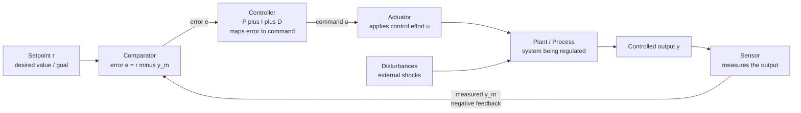

# 🛰️ Cybernetics and Control

> [!abstract] TL;DR
> **Cybernetics** (Wiener, 1948) is the science of *"control and communication in the animal and the machine"* — the study of how any system, biological, mechanical, or social, holds itself to a goal by continuously **sensing** its own output and **correcting** the difference. Its engine is the **closed negative-feedback loop** (setpoint → error → controller → actuator → plant → sensor → back to error). Two deep laws govern it: **Ashby's Law of Requisite Variety** (a regulator needs at least as much variety as the disturbances it must absorb) and the **Good Regulator Theorem** (every good regulator must contain a model of the thing it regulates). Cybernetics gave us homeostasis, teleological machines, control theory, and — through the Macy Conferences — the intellectual seedbed of AI, cognitive science, and management systems.

---

## Intuition

**Analogy — the thermostat and cruise control.** A thermostat has one job: keep the room at a **setpoint** (say 21 °C). It never computes a grand plan. It just compares the *measured* temperature to the target, and if the room is too cold it turns the heater on, if too warm it turns it off. The action depends entirely on the **error** — the gap between where things are and where they should be — and the correction always pushes to *shrink* that gap. Cruise control does the identical thing for speed: sensor reads 60 mph, you set 70, the error of 10 opens the throttle; as you climb a hill and slow down, the error grows and the throttle opens further; crest the hill and overshoot, the error flips sign and the throttle eases off.

That single circuit — *measure, compare to goal, correct the difference* — is the whole of cybernetics. Wiener's radical claim was that **it makes no difference whether the loop is built from copper and steam, from neurons and hormones, or from managers and memos**: a missile homing on a plane, a body holding its temperature, and a company hitting a quarterly target are all the *same kind of thing* — goal-seeking systems running negative feedback. Study the loop, not the material, and you have a science that spans the machine, the animal, and the organization.

---

## How It Works

### Wiener's founding move: purpose without mysticism

Before 1943 "purpose" and "goal-directedness" (**teleology**) were taboo in science — they smelled of vitalism, of things pulled by their future. Rosenblueth, Wiener, and Bigelow's paper *Behavior, Purpose and Teleology* (1943) dissolved the taboo: **goal-directed behavior is simply negative feedback**. A torpedo that curves toward a moving ship is not mystically drawn by its destination; it is *pushed* moment-to-moment by the error between its heading and the target's bearing. Purpose became a mechanism, not a metaphysics — and once purpose is a mechanism, it can be built. That single reframing is what made servomechanisms, guided missiles, and eventually goal-seeking software conceptually possible.

### The closed control loop and its six parts

Every cybernetic regulator is assembled from the same components. Name them once and you will see them everywhere:

1. **Setpoint (reference `r`):** the goal — the value the system is trying to hold or reach.
2. **Sensor (measurement):** reads the actual output and reports it back. Feedback is *information*, not energy — this is the "communication" half of Wiener's title.
3. **Comparator:** subtracts measured output from the setpoint to produce the **error** `e = r − y`. This subtraction is the heart of the loop; it is what makes the feedback *negative*.
4. **Controller:** maps error into a corrective command. A **PID** controller weights the error itself (P), its accumulated history (I, which erases steady-state offset), and its rate of change (D, which anticipates and damps).
5. **Actuator:** converts the command into physical effort applied to the world (throttle, heater, valve, muscle).
6. **Plant (process):** the system being regulated, with its own dynamics — inertia, lag, and susceptibility to outside **disturbances**.

The loop runs forever: any deviation the disturbance creates is sensed, turned into error, and corrected — the system *self-regulates*.

### Homeostasis and the ultrastable system

Biologists (Cannon) had named the body's self-regulation **homeostasis** — the maintenance of internal variables (temperature, pH, glucose) within survivable bounds despite a shifting world. Cybernetics recognised this as negative feedback in wetware. Ashby pushed further: he built the **homeostat** (1948), a physical machine of four coupled units that, when disturbed, *rewired its own parameters* until it found a new stable configuration. This is an **ultrastable system** — one with feedback not only on its variables but on its own *structure*, letting it discover stability rather than merely be tuned for it. It is a direct ancestor of adaptive control and reinforcement learning.

### Ashby's Law of Requisite Variety

Ashby's deepest result is quantitative. **Variety** is the number of distinguishable states a system can be in. Ashby's Law: *only variety can absorb variety* — to keep an output within a target set, **the regulator must command at least as much variety as the disturbances it faces**. If the environment can throw 100 distinct kinds of trouble at you but your controller has only 10 distinct responses, at least 90 disturbances will get through uncorrected. Formally, writing `V` for variety (in bits, log of the number of states),

$$V(\text{outcome}) \;\ge\; V(\text{disturbance}) - V(\text{regulator})$$

so the minimum residual disorder you cannot suppress is bounded below by how much your regulator's variety falls short of the disturbance's. This is why real regulators either grow their own repertoire (more sensors, more actions) or **attenuate** the incoming variety (constrain, buffer, standardise the environment) to a level they can match — Stafford Beer's practical corollary for management.

### The Good Regulator Theorem

Conant and Ashby (1970) proved the striking companion result: **every good regulator of a system must be a model of that system**. To regulate optimally against a set of disturbances, the controller's internal mapping *is* (isomorphic to) a model of the regulated process — you cannot reliably control what you cannot, in effect, simulate. This is the cybernetic charter for **model-based control**, internal world-models in cognition, and the "model in the head" that predictive-processing accounts of the brain now formalise.

### First- vs second-order cybernetics

Classical (**first-order**) cybernetics studies *observed systems* — the thermostat over there, watched by a detached scientist. Heinz von Foerster's **second-order cybernetics** (the *cybernetics of cybernetics*) insists the **observer is part of the system**: the act of observing, modelling, and setting the goal is itself a regulatory act performed by an included agent. This reflexive turn — systems that observe themselves, models that contain their modeller — reshaped constructivist epistemology, family therapy, and the theory of autopoietic (self-producing) systems (Maturana, Varela).



*The closed negative-feedback loop. Read it clockwise from the setpoint: the comparator subtracts the sensed output from the goal, the controller turns that error into a command, the actuator drives the plant, and the sensor closes the ring. Requisite Variety says the CTRL and ACT blocks together must command at least the variety that DIST injects; the Good Regulator Theorem says CTRL must embed a model of PLANT.*

---

## Key Concepts

### Secondary (intuition-level)

- **Feedback = self-correction.** The system watches its own result and adjusts. A thermostat, a toilet float valve, and your hand steadying a coffee cup are all the same trick.
- **Setpoint / error.** The goal, and the gap to the goal. Cybernetic machines act on the *gap*, not on the goal directly.
- **Negative feedback = stabilising.** Correction pushes *against* the error, shrinking it — this is what makes a system settle instead of run away.
- **Requisite variety, plain version.** "You need as many moves as your opponent." A goalkeeper who can only dive left will be scored on by any shot to the right.

### Undergraduate (mechanism-level)

- **The PID law:** `u(t) = Kp·e + Ki·∫e dt + Kd·(de/dt)`. **P** reacts to present error, **I** eliminates steady-state offset by accumulating past error, **D** damps by reacting to the error's trend. Tuning the three gains trades **rise time**, **overshoot**, and **settling time** against each other.
- **Open- vs closed-loop.** Open-loop (feedforward) acts without measuring the result — cheap but blind to disturbance and plant error. Closed-loop (feedback) measures and corrects — robust but can oscillate or go unstable if mis-tuned (see [[Feedback_Loops_and_Causality]]).
- **Homeostasis** as biological negative feedback; **teleology-as-feedback** (Rosenblueth-Wiener-Bigelow) reframing purpose mechanistically.
- **Variety and attenuation/amplification** (Ashby): a regulator matches disturbance variety by either amplifying its own response repertoire or attenuating the disturbances reaching it.

### Graduate (system-level)

- **Requisite Variety, information-theoretic form.** Casting variety as entropy, `H(outcome) ≥ H(disturbance) − H(regulator)`; the regulator can drive residual output entropy to zero only if its channel capacity matches the disturbance entropy — a direct bridge to [[Information_Theory]].
- **Good Regulator Theorem (Conant & Ashby, 1970).** Under an optimality-and-simplicity criterion, the optimal regulator is *isomorphic* to a model of the regulated system: successful regulation entails an internal model. Foundational for model-predictive control and the "brain as a model of its world" thesis.
- **Ultrastability and second-order adaptation.** Ashby's homeostat adds feedback on the controller's *own parameters*, searching parameter space for a stable regime — the conceptual root of adaptive/self-tuning control and, arguably, of learning.
- **Second-order cybernetics and autopoiesis.** Von Foerster's observer-included systems and Maturana-Varela's self-producing organisationally-closed systems; reflexivity as a formal property, not a philosophical flourish.
- **Beer's Viable System Model (VSM).** A recursive, five-subsystem cybernetic architecture (operations, coordination, control, intelligence, policy) for organisations, operationalised (and famously trialled) in Chile's **Project Cybersyn** — variety engineering applied to running an economy.

---

## Python Demo

```python
# Cybernetic negative feedback in action: a PID controller regulating a
# FIRST-ORDER PLANT toward a setpoint. We sweep the proportional gain to
# expose the fundamental tuning trade-off (rise time vs overshoot vs settling).
# numpy + matplotlib only.
import numpy as np
import matplotlib.pyplot as plt

# ---- Plant: first-order lag   tau * dy/dt = -y + K_plant * u ----
tau_p   = 2.0        # plant time constant (how sluggish the process is)
K_plant = 1.0        # plant DC gain
dt      = 0.02
T       = 30.0
steps   = int(T / dt)
t       = np.linspace(0, T, steps)

# Step setpoint: jump the goal from 0 to 1 at t = 1 s
setpoint = np.where(t >= 1.0, 1.0, 0.0)

def simulate_pid(Kp, Ki, Kd):
    """Closed-loop simulation: sensor -> comparator -> PID -> actuator -> plant."""
    y        = np.zeros(steps)   # plant output = the tracked variable (sensor read)
    integral = 0.0
    prev_err = 0.0
    for i in range(1, steps):
        err       = setpoint[i-1] - y[i-1]        # comparator: goal minus measurement
        integral += err * dt                      # I term: accumulate past error
        deriv     = (err - prev_err) / dt         # D term: rate of change of error
        u         = Kp*err + Ki*integral + Kd*deriv   # controller command -> actuator
        prev_err  = err
        dydt      = (-y[i-1] + K_plant * u) / tau_p    # first-order plant (Euler step)
        y[i]      = y[i-1] + dydt * dt
    return y

def step_metrics(y):
    """Overshoot % and 2%-settling time, measured after the step at t=1s."""
    final = 1.0
    peak  = y.max()
    overshoot = max(0.0, (peak - final) / final * 100.0)
    # settling: last time the response leaves the +/-2% band
    outside = np.where(np.abs(y - final) > 0.02 * final)[0]
    settle  = t[outside[-1]] if len(outside) else 0.0
    return overshoot, settle

# Three tunings: Ki fixed (so steady-state error is always killed), Kp swept.
tunings = [
    (0.6, 0.4, 0.0, "#2980B9", "Low gain Kp=0.6: sluggish, slow rise"),
    (2.5, 0.4, 0.0, "#27AE60", "Moderate Kp=2.5: fast, small overshoot"),
    (8.0, 0.4, 0.0, "#C0392B", "High gain Kp=8.0: big overshoot & ringing"),
]

fig, ax = plt.subplots(figsize=(10, 5.5))
ax.plot(t, setpoint, color="black", ls="--", lw=1.5, label="Setpoint r (the goal)")
for Kp, Ki, Kd, color, label in tunings:
    y = simulate_pid(Kp, Ki, Kd)
    os, ts = step_metrics(y)
    ax.plot(t, y, color=color, lw=2, label=label)
    print(f"{label:42s} | overshoot = {os:5.1f}%  | 2%-settling = {ts:4.1f}s")

ax.set_xlabel("Time (s)")
ax.set_ylabel("Controlled variable y")
ax.set_title("PID feedback control of a first-order plant: the tuning trade-off")
ax.legend(loc="lower right")
ax.grid(alpha=0.3)
plt.tight_layout()
plt.show()
```

**What you should see.** All three curves eventually reach the setpoint — the integral term guarantees zero steady-state error, the cybernetic promise that negative feedback erases the gap. But the *path* there depends entirely on gain: low `Kp` crawls up sluggishly (safe but slow), moderate `Kp` rises fast with a gentle overshoot (the sweet spot), and high `Kp` overshoots hard and rings before settling. This is the universal control trade-off — *responsiveness bought with stability* — and it is why aggressive correction, exactly as in the delayed-feedback story of [[Feedback_Loops_and_Causality]], can destabilise a goal-seeking loop.

---

## Real-World Applications

- **Engineering everywhere.** PID controllers run an estimated 90%+ of industrial control loops — chemical reactors, cruise control, aircraft autopilots, disk-drive head positioning, quadcopter attitude, 3D-printer temperature. The thermostat is the pocket edition of this vast family.
- **Physiology / medicine.** Homeostasis is negative feedback in the body: thermoregulation, blood-glucose (insulin/glucagon), blood pressure (baroreflex), pH. An artificial pancreas is literally a PID loop closed around a glucose sensor and an insulin pump (see [[Homeostasis_and_the_Nervous_System]]).
- **Artificial intelligence & cognitive science.** The **Macy Conferences** (1946–1953) put Wiener, von Neumann, McCulloch, Pitts, Bateson, and Mead in one room; cybernetics' feedback-and-goal framing seeded both symbolic AI and connectionism, and reframed the mind as an information-processing control system — the pivot documented in [[The_Cognitive_Revolution]]. Predictive-processing and reinforcement learning are its direct descendants.
- **Management & organisations.** Stafford Beer's **Viable System Model** applies requisite variety to firms; **Project Cybersyn** (Chile, 1971–73) built a real-time cybernetic control room to regulate a national economy. Modern OKRs, control charts (SPC), and autoscaling cloud systems are variety-management by another name.
- **Ecology & climate.** Gaia-style regulation, predator-prey balance, and carbon-cycle buffering are planetary negative-feedback loops; tipping points are where the regulator's requisite variety is finally exceeded.

---

## Common Pitfalls

- **Confusing negative feedback with "bad."** In cybernetics *negative* means *error-reducing / stabilising* — the good kind. *Positive* feedback amplifies and destabilises. Beginners invert the signs and mispredict every loop.
- **Ignoring requisite variety.** Deploying a low-variety controller against a high-variety world (a rules-based fraud filter against creative fraudsters, a rigid policy against a turbulent market). The uncovered variety leaks through as uncontrolled error; the fix is more response repertoire *or* attenuating the disturbance.
- **Regulating without a model.** Violating the Good Regulator Theorem — tuning a controller by trial-and-error with no model of the plant. It works until the operating point shifts, then fails, because the controller never captured the process it was steering.
- **Over-aggressive gain (instability).** Cranking `Kp` to respond faster; past a stability margin the loop overshoots, rings, and can diverge. Delay makes this far worse (stale error drives correction after it should have stopped) — the same mechanism as oscillation in [[Feedback_Loops_and_Causality]].
- **Integral windup.** When the actuator saturates, the I term keeps accumulating error it cannot act on; the controller then overshoots grossly when the actuator frees up. Anti-windup clamping is mandatory in real loops.
- **Forgetting the observer (first-order blindness).** Treating the goal and the model as god-given. Second-order cybernetics warns that *someone chose the setpoint and built the model* — and their biases are inside the loop.

---

## Related Concepts

- [[Feedback_Loops_and_Causality]] — the general theory of reinforcing and balancing loops; cybernetics is engineered *balancing* (negative) feedback made precise, with gain, delay, and stability margins.
- [[State_Feedback_Control]] — the modern state-space formalisation of the cybernetic loop: poles, gains, and controllability quantify what Ashby described in words.
- [[Homeostasis_and_the_Nervous_System]] — biology's living negative-feedback controllers (temperature, glucose, blood pressure) — homeostasis is cybernetics in wetware.
- [[The_Cognitive_Revolution]] — the Macy Conferences and cybernetic feedback framing helped birth cognitive science and AI by recasting mind as goal-directed information processing.
- [[Information_Theory]] — variety-as-entropy underpins Ashby's Law and the good-regulator result; regulation is fundamentally a channel-capacity problem.
- [[General_Systems_Theory]] — cybernetics' sibling: both seek trans-disciplinary laws of organised systems; GST supplies the ontology, cybernetics the control machinery.
- [[Complex_Adaptive_Systems]] — Ashby's ultrastable homeostat is an early adaptive system; requisite variety governs how well any agent can regulate a complex environment.
- [[BIBO_Stability]] — the stability criterion a closed loop must satisfy; excessive gain plus delay is exactly what pushes a cybernetic regulator across the boundary into instability.

---

## Review Questions

1. **(Conceptual)** Explain why Rosenblueth, Wiener, and Bigelow argued that "purpose" is not mystical but is simply negative feedback. Using a heat-seeking missile, describe precisely what plays the role of setpoint, error, and actuator, and why the missile is *pushed* rather than *pulled* toward its target.
2. **(Scenario)** A bank's rule-based fraud detector uses 12 fixed rules, but fraudsters continually invent new attack patterns. Using Ashby's Law of Requisite Variety, explain why fraud losses persist no matter how carefully those 12 rules are tuned, and give two structurally different remedies (one that raises the regulator's variety, one that attenuates the disturbance's variety).
3. **(Trade-off / dynamics)** You are tuning a PID temperature controller. Raising the proportional gain makes it reach the setpoint faster but it now overshoots and oscillates before settling. Explain the rise-time / overshoot / settling-time trade-off, why the integral term is still needed despite causing overshoot, and how adding derivative action or anti-windup would change the response. Tie your answer to why "more aggressive correction" can destabilise any negative-feedback loop.

---

## Sources

- Wiener, Norbert. *Cybernetics: or Control and Communication in the Animal and the Machine*. MIT Press, 1948 (2nd ed. 1961).
- Ashby, W. Ross. *An Introduction to Cybernetics*. Chapman & Hall, 1956 (the Law of Requisite Variety, the homeostat, ultrastability).
- Rosenblueth, A., Wiener, N., & Bigelow, J. "Behavior, Purpose and Teleology." *Philosophy of Science* 10(1), 18–24, 1943.
- Conant, R. C., & Ashby, W. R. "Every Good Regulator of a System Must Be a Model of That System." *International Journal of Systems Science* 1(2), 89–97, 1970.
- Beer, Stafford. *Brain of the Firm* (2nd ed., Wiley, 1981) and *The Heart of Enterprise* (Wiley, 1979) — the Viable System Model and Project Cybersyn.
- von Foerster, Heinz. *Understanding Understanding: Essays on Cybernetics and Cognition*. Springer, 2003 (second-order cybernetics; the Macy Conferences).

---

#complexity #cybernetics #control-theory #feedback #requisite-variety
