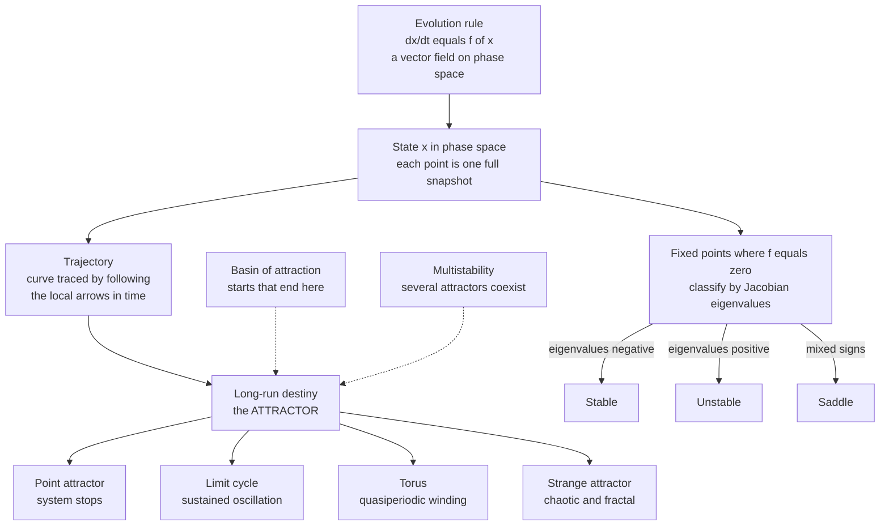

# 🌀 Dynamical Systems and Attractors

> [!abstract] TL;DR
> A **dynamical system** is anything whose state evolves in time according to a fixed rule — a set of differential equations `dx/dt = f(x)` or an iterated map `x_{n+1} = g(x_n)`. Instead of solving for a formula, you study the *geometry* of all possible motions in **phase space**: where the system can rest (**fixed points**), how it settles (**stability**), and the shapes it is inexorably drawn toward as time runs on (**attractors** — points, cycles, tori, or strange fractal sets). This qualitative view, founded by Poincaré, is the common language for modeling *any* changing system, from a pendulum to an ecosystem to a market.

---

## Intuition

**Analogy — a ball rolling in a hilly landscape.** Imagine a marble released somewhere on a landscape of hills and valleys, with a little friction. Wherever you drop it, it rolls downhill, overshoots, sloshes back and forth, and eventually comes to rest at the bottom of some valley. Three ideas fall out of this picture almost for free:

1. **The bottom of a valley is an attractor.** It is a resting state the system *converges to*. Friction (energy loss) is what makes it attract rather than orbit forever.
2. **Each valley has a basin.** Every starting point on the landscape belongs to exactly one valley — the set of release points that all funnel into the *same* resting spot is that valley's **basin of attraction**. A ridge line separates one basin from the next.
3. **Hilltops and ridges are unstable.** Balance the marble perfectly on a peak and it *could* stay — but the faintest nudge sends it rolling away. These are **unstable equilibria** and **saddles**.

Now abstract away the marble. Replace "position on the landscape" with the full **state** of any system — the angle and speed of a pendulum, the number of predators and prey, the voltages in a circuit — and replace "rolls downhill" with "obeys its equations of motion." The landscape picture still holds, except that in general systems there is no literal height to roll down: the state simply *flows* along arrows painted throughout the space of possibilities. Where those flows pile up is where the system ends up. That is the whole subject.

---

## How It Works

### Core mechanics

A **continuous dynamical system** is specified by a state vector `x` living in **phase space** and a rule giving its instantaneous velocity everywhere:

$$\frac{d\mathbf{x}}{dt} = \mathbf{f}(\mathbf{x}), \qquad \mathbf{x} \in \mathbb{R}^n$$

Read this geometrically, not algebraically. The function `f` assigns to *every* point in phase space a little arrow — a **vector field**. A **trajectory** (or orbit) is the curve you trace by always following the arrow under your feet. The **phase portrait** is the whole family of such curves, and it *is* the qualitative theory of the system: once you can sketch it, you understand the long-term fate of every possible initial condition without ever writing down a closed-form solution.

The machinery has a small number of moving parts:

1. **State and phase space.** The **state** is the minimal set of numbers needed to predict the future — for a pendulum it is `(angle, angular velocity)`, so its phase space is a 2D plane. Each *point* is one complete snapshot; each *trajectory* is one possible history. This is exactly the "state" of [[State_Space_Basics]] and the vector of stocks in a [[Stocks_Flows_and_System_Dynamics]] model.
2. **Fixed points (equilibria).** Where `f(x*) = 0` the arrow has zero length, the state stops moving, and the system sits still. These are the candidate resting states.
3. **Linearization and eigenvalues.** To classify a fixed point, zoom in until the curved vector field looks straight. The local behavior is governed by the **Jacobian** matrix `J = Df(x*)`, and its **eigenvalues** decide everything (see [[Eigenvalues_and_Eigenvectors]]). Negative real parts pull the state back in (**stable**); positive real parts push it away (**unstable**); mixed signs give a **saddle** — attracting along one direction, repelling along another. Imaginary parts add rotation, producing spirals and centers.
4. **Attractors.** An **attractor** is a set that trajectories converge to and that cannot be broken into smaller attracting pieces. It captures the system's *destiny*.
5. **Basins of attraction.** The set of initial states whose trajectories end on a given attractor. Phase space partitions into basins separated by **separatrices** (the ridge lines).
6. **Dissipative vs conservative.** A **dissipative** system loses phase-space volume as it evolves (friction, resistance, viscosity) — volumes shrink onto lower-dimensional attractors. A **conservative** system (frictionless, energy-preserving, Hamiltonian) preserves volume and therefore has *no attractors*: an undamped pendulum orbits forever on nested closed curves; it never settles.

### The zoo of attractors

Dissipative systems settle onto exactly four kinds of attractor, in order of increasing complexity:

- **Point attractor (fixed point).** The system stops. A damped pendulum hanging straight down; a cooling coffee reaching room temperature.
- **Limit cycle (periodic attractor).** The system settles into a *self-sustaining oscillation* — an isolated closed loop that nearby trajectories spiral onto, whether they start inside or outside it. A heartbeat, a firing neuron, a chemical clock. Unlike the concentric orbits of a frictionless pendulum, a limit cycle is *isolated* and *stable*: perturb it and it returns.
- **Torus (quasiperiodic attractor).** Two or more incommensurate oscillations superimposed — the trajectory winds forever around the surface of a doughnut without ever exactly repeating.
- **Strange (chaotic) attractor.** A bounded, fractal set on which trajectories never repeat and neighboring trajectories separate exponentially — the hallmark of **chaos** and sensitive dependence on initial conditions (the Lorenz butterfly is the icon). The system is deterministic yet unpredictable in the long run.

### Multistability and Lyapunov stability

A nonlinear system can possess **several attractors at once** — this is **multistability**. Which one you end up on depends only on *which basin your initial condition fell in*, so the same rules can produce qualitatively different destinies (a switch that latches on or off, a climate with an ice-age and a warm state). The precise notion of "settles down" is **Lyapunov stability**: an equilibrium is stable if trajectories that start *near* it stay near it, and **asymptotically stable** if they additionally converge to it — provable without solving the equations by finding a **Lyapunov function**, an abstract "energy" that never increases along trajectories.



---

## Key Concepts

**Secondary (intuitive level).** A dynamical system is just "a rule for what happens next," applied over and over. Draw the state as a dot in a space where each axis is one thing you are tracking; the rule sends the dot moving along arrows. Follow the arrows long enough and the dot ends up trapped in one of a few destinations — a resting point, a repeating loop, or a chaotic tangle. Those destinations are **attractors**, and the region of starting points that leads to each one is its **basin**. Stable spots pull nearby dots in; unstable spots (hilltops, ridges) push them away.

**Undergraduate (analytical level).** A system of `n` coupled first-order autonomous ODEs `dx/dt = f(x)` defines a flow on `R^n` (see [[Systems_of_ODEs]] and [[First_Order_ODEs]]; any higher-order ODE reduces to this form by stacking derivatives into the state). Fixed points solve `f(x*) = 0`. Local stability follows from the **Jacobian** `J = Df(x*)`: compute its eigenvalues `λ_i`. For a 2D system the trace `τ` and determinant `Δ` classify the point in the **trace–determinant plane** — stable node, unstable node, saddle (`Δ < 0`), stable/unstable spiral (complex eigenvalues), and center (`τ = 0`, `Δ > 0`). Real parts govern growth/decay; imaginary parts govern rotation frequency. This is precisely the pole picture of linear control theory: eigenvalues in the left half-plane mean asymptotic stability, mirroring [[Stability_Frequency_Response]]. The linearized flow near a fixed point is `x(t) ≈ x* + e^{Jt} v`, the matrix exponential of [[State_Transition_Matrix]]. The **Hartman–Grobman theorem** guarantees the linear picture is qualitatively faithful whenever no eigenvalue sits exactly on the imaginary axis (a **hyperbolic** fixed point).

**Graduate (system-level).** The subject is Poincaré's **qualitative theory of differential equations**: abandon closed-form solutions and instead classify the *topology* of the flow — its invariant sets and their stability — up to smooth change of coordinates. Central results: the **Poincaré–Bendixson theorem** (a bounded, non-empty limit set in the *plane* containing no fixed point must be a periodic orbit — which is *why chaos is impossible in 2D continuous systems* and needs at least three dimensions or a discrete map); **Lyapunov's direct method** (stability without solving, via a decreasing scalar function); **stable/unstable manifold** theory (the curved generalizations of eigenvector directions, whose tangling produces chaos); and **structural stability** — whether the whole phase portrait is robust to small perturbations of `f`. When it is *not* robust, an infinitesimal parameter change reorganizes the attractor set qualitatively: a **bifurcation** (saddle-node, Hopf, period-doubling). Dissipation contracts phase-space volume — Liouville's theorem says conservative Hamiltonian flows preserve it, so genuine attractors require dissipation — and the attractor's fractal (non-integer) dimension quantifies how tightly that contraction folds the flow. This framework is domain-agnostic: identical machinery describes lasers, neurons, gene-regulatory switches, climate, and epidemics, which is why "dynamical systems" is a *lingua franca* for modeling change itself.

---

## Python Demo

```python
# Phase portraits of two 2D dynamical systems, numpy + matplotlib only.
#   LEFT : damped pendulum  -> trajectories SPIRAL INTO a POINT attractor
#   RIGHT: Van der Pol      -> trajectories converge onto a LIMIT CYCLE
# The vector field is drawn with streamplot; sample trajectories are
# integrated with a hand-written RK4; the attractors are marked.
import numpy as np
import matplotlib.pyplot as plt

# ---- a minimal RK4 integrator for ds/dt = f(s), s = [x, y] ----
def rk4(f, s0, dt, steps):
    S = np.empty((steps, 2))
    S[0] = s0
    for i in range(steps - 1):
        k1 = f(S[i])
        k2 = f(S[i] + 0.5 * dt * k1)
        k3 = f(S[i] + 0.5 * dt * k2)
        k4 = f(S[i] + dt * k3)
        S[i + 1] = S[i] + (dt / 6.0) * (k1 + 2 * k2 + 2 * k3 + k4)
    return S

# ============================================================
# SYSTEM 1 -- Damped pendulum: a POINT ATTRACTOR (plus a saddle)
#   theta' = omega
#   omega' = -b*omega - (g/L) sin(theta)
# Friction bleeds energy, so all nearby motion spirals into the
# rest state (0, 0). The inverted position (+/- pi, 0) is a saddle.
# ============================================================
b, gL = 0.35, 1.0
def pendulum(s):
    th, om = s
    return np.array([om, -b * om - gL * np.sin(th)])

TH, OM = np.meshgrid(np.linspace(-4.0, 7.0, 26), np.linspace(-4.0, 4.0, 26))
U1, V1 = OM, (-b * OM - gL * np.sin(TH))

# ============================================================
# SYSTEM 2 -- Van der Pol oscillator: a LIMIT CYCLE attractor
#   x' = y
#   y' = mu*(1 - x^2)*y - x
# The origin is an UNSTABLE focus; every trajectory, whether it
# starts inside or outside, is drawn onto ONE isolated closed loop.
# ============================================================
mu = 1.0
def vanderpol(s):
    x, y = s
    return np.array([y, mu * (1.0 - x * x) * y - x])

X, Y = np.meshgrid(np.linspace(-4.0, 4.0, 26), np.linspace(-4.0, 4.0, 26))
U2, V2 = Y, (mu * (1.0 - X * X) * Y - X)

# recover the limit cycle itself = tail of a long trajectory (transient gone)
cycle = rk4(vanderpol, [0.1, 0.1], 0.01, 6000)[4000:]

# ---- plot ----
fig, ax = plt.subplots(1, 2, figsize=(13, 6))

# panel 1: damped pendulum
ax[0].streamplot(TH, OM, U1, V1, color="0.75", density=1.1, linewidth=0.7)
for th0 in (-3.0, 1.0, 5.5):
    tr = rk4(pendulum, [th0, 3.5], 0.02, 1500)
    ax[0].plot(tr[:, 0], tr[:, 1], lw=1.8)
ax[0].plot(0, 0, "*", ms=20, color="crimson", zorder=5, label="point attractor (stable)")
ax[0].plot([-np.pi, np.pi], [0, 0], "X", ms=11, color="black", zorder=5, label="saddle (unstable)")
ax[0].set_title("Damped pendulum -- point attractor")
ax[0].set_xlabel("angle  theta"); ax[0].set_ylabel("angular velocity  omega")
ax[0].set_xlim(-4, 7); ax[0].set_ylim(-4, 4); ax[0].legend(loc="upper right")

# panel 2: Van der Pol
ax[1].streamplot(X, Y, U2, V2, color="0.75", density=1.1, linewidth=0.7)
tr_in  = rk4(vanderpol, [0.1, 0.1], 0.01, 2500)   # spirals OUT to the cycle
tr_out = rk4(vanderpol, [3.5, 3.5], 0.01, 2500)   # spirals IN  to the cycle
ax[1].plot(tr_in[:, 0],  tr_in[:, 1],  lw=1.2, color="tab:blue",  label="start inside")
ax[1].plot(tr_out[:, 0], tr_out[:, 1], lw=1.2, color="tab:green", label="start outside")
ax[1].plot(cycle[:, 0], cycle[:, 1], lw=3.0, color="crimson", label="limit-cycle attractor")
ax[1].plot(0, 0, "o", ms=9, mfc="white", mec="black", zorder=5, label="unstable focus")
ax[1].set_title("Van der Pol -- limit-cycle attractor")
ax[1].set_xlabel("x"); ax[1].set_ylabel("y = dx/dt")
ax[1].set_xlim(-4, 4); ax[1].set_ylim(-4, 4); ax[1].legend(loc="upper right")

plt.tight_layout(); plt.show()

print("Pendulum : friction drains energy -> trajectories spiral into (0, 0).")
print("Van der Pol: inside AND outside starts both converge onto the SAME loop.")
```

The left panel shows a **point attractor**: the marble-in-a-valley picture made literal — every spiral loses energy and winds into the rest state, while the inverted saddle repels. The right panel shows a **limit cycle**: an oscillation the system *creates and maintains on its own*, drawing in trajectories from both sides. Swap in the Lotka–Volterra predator–prey equations and you get *neutral* closed orbits (a conservative center) instead — the difference between "orbits forever" and "attracts" is exactly dissipation.

---

## Real-World Applications

- **Physiology and the heartbeat.** The heart's pacemaker and firing neurons are modeled as **limit cycles** (FitzHugh–Nagumo, Hodgkin–Huxley). Health is a stable cycle; **arrhythmia** is the cycle destabilizing or the system falling onto a different attractor. Anaesthesia and seizures are studied as transitions between attractors of brain dynamics.
- **Ecology — predator and prey.** Population models are canonical 2D dynamical systems: Lotka–Volterra gives conservative orbits (a center), while more realistic models with crowding give a **stable limit cycle** — self-sustaining boom-and-bust population swings. See [[Population_Ecology]].
- **Climate and multistability.** Energy-balance and ocean-circulation models exhibit **multiple attractors** (an ice-covered "snowball" state and a warm state) separated by a basin boundary — the physics behind **tipping points**, where a slow forcing pushes the climate across a separatrix into a different basin.
- **Engineering and control.** Every feedback controller is a dynamical system designed so that the *desired operating point is an asymptotically stable attractor* with a large basin. Pole placement is literally choosing eigenvalues (see [[Stability_Frequency_Response]]); a badly designed loop can spawn an unwanted limit cycle (self-oscillation) or lose stability entirely.
- **Machine learning.** Gradient-descent training is a **dissipative dynamical system** whose attractors are the minima of the loss landscape — the marble-in-a-valley analogy is nearly exact (see [[Gradient_Descent]]). Recurrent networks and Hopfield associative memories store patterns *as* point attractors and retrieve them by falling into the nearest basin.
- **Economics and epidemics.** Business cycles are modeled as limit cycles; the SIR epidemic model is a low-dimensional dynamical system whose endemic equilibrium is a fixed-point attractor.

---

## Common Pitfalls

- **Confusing a closed orbit with a limit cycle.** A frictionless pendulum traces closed loops, but they are a *continuum of neutral orbits* (a conservative center), not attractors — perturb it and it stays on the new orbit forever. A limit cycle is an *isolated, stable* loop that actively pulls nearby trajectories in. Only dissipative systems have limit cycles.
- **Expecting attractors in a conservative system.** No friction means phase-space volume is conserved (Liouville), so volumes cannot contract onto a lower-dimensional set. Looking for "the attractor" of an ideal Hamiltonian system is a category error.
- **Trusting linearization at a non-hyperbolic point.** When an eigenvalue has zero real part (a center, or the onset of a bifurcation), the linear approximation is silent about stability — tiny nonlinear terms decide the outcome. Hartman–Grobman explicitly excludes this case.
- **Assuming a single global attractor.** Nonlinear systems are frequently **multistable**. Reporting "the equilibrium" hides the fact that the *initial condition* selects among several possible destinies; you must map the **basins**, not just find the fixed points.
- **Reading trajectories as if axes were time.** In a phase portrait the axes are *state variables*, not time. Trajectories cannot cross (uniqueness of solutions), and a loop means *periodicity in time*, not a return to the start of a graph.
- **Ignoring the dimension barrier to chaos.** By Poincaré–Bendixson, a *continuous* system in the plane cannot be chaotic — it can only reach a fixed point or a cycle. Strange attractors need three or more continuous dimensions (or a discrete map). Claiming chaos in a 2D flow is impossible.
- **Numerical artifacts mistaken for dynamics.** Too large an integration step can turn a stable spiral into a spurious growing oscillation or fabricate a "cycle." Always check that the phase portrait is stable under halving `dt`.

---

## Related Concepts

- [[Feedback_Loops_and_Causality]] — the *sign* of feedback is what makes a fixed point attract (balancing) or repel (reinforcing); delays turn a stable point into an oscillation or limit cycle.
- [[Stocks_Flows_and_System_Dynamics]] — the vector of stocks *is* the state; an SD model is a dissipative dynamical system whose equilibrium is a point attractor.
- [[General_Systems_Theory]] — the abstract "system with state and rule" framing that dynamical-systems theory makes mathematically precise.
- [[Systems_of_ODEs]] — a continuous dynamical system is exactly a system of coupled first-order ODEs; any higher-order ODE reduces to this form.
- [[First_Order_ODEs]] — the atomic building block; `dx/dt = f(x)` is the one-dimensional case.
- [[Eigenvalues_and_Eigenvectors]] — the eigenvalues of the Jacobian at a fixed point classify its stability (node, saddle, spiral, center).
- [[State_Space_Basics]] — "phase space" and "state space" are the same object; trajectories are its state evolving in time.
- [[State_Transition_Matrix]] — the linearized flow near a fixed point is the matrix exponential `e^{Jt}`.
- [[Stability_Frequency_Response]] — the control-theory mirror: eigenvalues in the left half-plane give asymptotic stability, right half-plane gives instability.
- [[Population_Ecology]] — Lotka–Volterra predator–prey is the textbook 2D dynamical system with a center or, with crowding, a limit cycle.
- [[Gradient_Descent]] — gradient flow `dx/dt = -∇L(x)` is a dissipative dynamical system whose attractors are the minima of the loss landscape — the ball-in-a-valley analogy realized.

---

## Review Questions

1. **(Conceptual)** A colleague says "our simulation reached a stable oscillation, so it must have a limit cycle." Under what condition is this correct, and how would you tell a genuine *limit cycle* apart from the neutral closed orbits of a conservative center using only the phase portrait? Why does energy dissipation matter to your answer?
2. **(Scenario)** You are modeling a 2D system and observe seemingly random, never-repeating output. A teammate concludes the system is chaotic. Using the Poincaré–Bendixson theorem, explain why a *two-dimensional continuous* system cannot be chaotic, and list the minimal changes to the model that *could* legitimately produce a strange attractor.
3. **(Trade-off)** You have a nonlinear system with two coexisting stable attractors (multistability) and must guarantee the system always ends in the "safe" one. Discuss the trade-offs between (a) redesigning `f` so the unsafe attractor disappears via a bifurcation, (b) enlarging the safe attractor's basin so almost all initial conditions fall into it, and (c) adding feedback control to actively push the state across the separatrix. What does each require you to know about the phase portrait?

---

## Sources

- Strogatz, S. H. (2015). *Nonlinear Dynamics and Chaos: With Applications to Physics, Biology, Chemistry, and Engineering* (2nd ed.). Westview Press. — The standard modern introduction to phase portraits, stability, and attractors.
- Guckenheimer, J., & Holmes, P. (1983). *Nonlinear Oscillations, Dynamical Systems, and Bifurcations of Vector Fields*. Springer. — The graduate reference for the qualitative theory and manifolds.
- Hirsch, M. W., Smale, S., & Devaney, R. L. (2013). *Differential Equations, Dynamical Systems, and an Introduction to Chaos* (3rd ed.). Academic Press. — Rigorous linkage of linear algebra, ODEs, and dynamics.
- Poincaré, H. (1892–1899). *Les Méthodes Nouvelles de la Mécanique Céleste*. Gauthier-Villars. — The origin of the qualitative, phase-space viewpoint.
- Milnor, J. (2006). "On the concept of attractor." In *Collected Papers of John Milnor VI*. — A careful discussion of what precisely counts as an attractor and a basin.

---

#complexity #dynamical-systems #attractors #phase-space #limit-cycle
