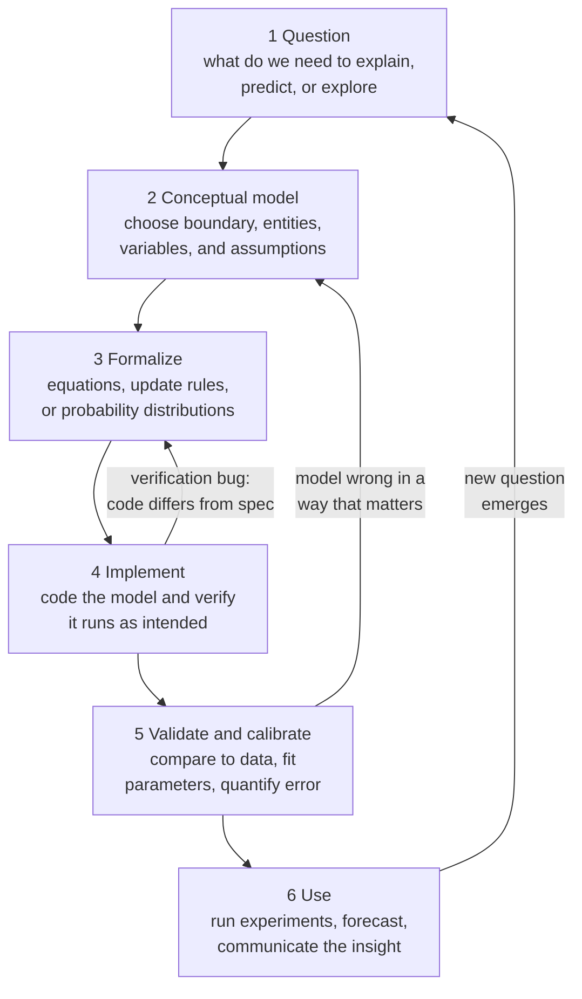

# 🗺️ Modeling and Simulation of Complex Systems

> [!abstract] TL;DR
> A **model** is a deliberately simplified stand-in for a system, built to answer a specific question — to **explain**, **predict**, **explore**, or **communicate**. Modeling is not a search for the one true equation of reality; as George Box put it, **"all models are wrong, but some are useful."** The craft lies in *choosing what to leave out*, picking the right **paradigm** (equation-based, system dynamics, agent-based, network, cellular-automaton, Monte Carlo, or statistical/ML) for the question, running the model forward as a **simulation**, and — crucially — **validating** it against reality with honest uncertainty. For complex systems the payoff of *simulating* rather than *solving* is that stochastic, individual-level models reveal **variance, rare events, and extinction** that clean averaged equations hide entirely.

---

## Intuition

**Analogy — a map is not the territory.** A subway map is *wrong* in almost every literal respect: the lines are not really colored, the stations are not evenly spaced, the tunnels are not straight, and the whole city is flattened onto a poster. Yet it is one of the most useful objects ever designed, because it throws away everything (streets, scale, geography) that would get in the way of the one question it answers: *which train do I take, and where do I change?* A road atlas of the same city keeps scale and geography and throws away the train lines — a different *wrong* map, useful for a different question. There is no "complete" map; a map that reproduced every detail of the territory would be the territory itself, and equally useless.

A model of a complex system is exactly this: a purpose-built map. The moment you ask "which details do I keep?" you have already committed to a question, a boundary, and a set of lies you can live with. The skill of modeling is not adding detail until the model matches reality — it is removing detail until the model **answers the question and no more**. Every extra variable you keep is a street on the subway map: it may be true, but it makes the map harder to read and no better at getting you to work.

---

## How It Works

### What a model is, and the four reasons to build one

A model is a representation of a system in some other medium — equations, code, a diagram, a scale replica — that preserves the features you care about and discards the rest. We build models for four distinct purposes, and confusing them is the source of endless argument:

1. **Explanation.** *Why* does this happen? A good explanatory model reproduces a phenomenon from a mechanism, so you understand the cause (the Boids rules *explain* flocking; the SIR mechanism *explains* an epidemic curve).
2. **Prediction.** *What will happen next, and by how much?* Prediction demands calibration and error bars; a model can explain beautifully yet predict terribly (and vice versa — a purely statistical forecaster can predict well while explaining nothing).
3. **Exploration.** *What if?* Simulation lets you run counterfactuals and experiments that are impossible, unethical, or too slow in the real world — a second Earth with different climate policy, a pandemic under different lockdown rules.
4. **Communication.** A shared, explicit model forces assumptions into the open and lets a team argue about *structure* instead of talking past each other with vague mental models.

**Box's aphorism is the whole philosophy.** "Essentially, all models are wrong, but some are useful." A model that were *not* wrong — that omitted nothing — would be a perfect copy and would offer no simplification, no insight, no leverage. Wrongness is not a bug to be eliminated; it is the *mechanism* by which a model becomes tractable. The real questions are never "is the model true?" but **"is it wrong in a way that matters for my question?"** and **"is it useful enough to act on?"**

### The modeling cycle

Modeling is iterative, not a straight line from idea to answer. The loop below is the discipline that separates a defensible model from a plausible-looking fantasy:



Read the back-arrows carefully — they are where the learning happens. Validation sending you back to the **conceptual** model (not just to tweak a parameter) is the honest response to "the model disagrees with reality." A verification bug sends you back to the **formalization**, because the code is not faithfully implementing the equations you wrote. And a finished, used model almost always spawns the **next** question, which is why real modeling projects are spirals, not lines.

### Choosing a paradigm

There is no universal modeling technique; the **question** and the **structure of the system** together dictate the tool. The central design choice is *what an individual unit of the model represents* — a continuous aggregate, an accumulation, a discrete individual, a node, a cell, or a random draw. Get that choice wrong and no amount of tuning will save you: a mean-field equation cannot represent a lone super-spreader, and an agent-based model of a smoothly mixing gas is a waste of a supercomputer. The paradigm menu, and when each earns its keep, is laid out in the Key Concepts below.

---

## Key Concepts

### Secondary

- **A model is a simplification with a purpose.** It keeps what matters for one question and throws away the rest — like a subway map or a globe.
- **All models are wrong, some are useful.** Being "wrong" (leaving things out) is the whole point; a model that omitted nothing would just be a copy.
- **Simulation is running the model forward in time** to watch what it does, especially when the system is too tangled to solve with pencil and paper.
- **Deterministic vs random.** A *deterministic* model gives the same answer every run. A *stochastic* model has chance built in, so every run differs — and you learn from the *spread* of many runs, not a single one.
- **Validation asks "does the model match reality?"** — always the real test, and always harder than making the model look plausible.

### Undergraduate

The core skill is matching **paradigm** to problem. Each represents its "atoms" differently and shines under different conditions:

| Paradigm | Unit of representation | Best when | Canonical example |
|---|---|---|---|
| **Analytical / equation-based** (ODE, PDE) | continuous aggregate quantities | system is well-mixed, homogeneous, smooth; you want closed-form insight | Lotka-Volterra, diffusion, mean-field SIR |
| **System dynamics** (stocks and flows) | accumulations plus feedback loops | policy questions, delays, endogenous feedback dominate | supply-chain bullwhip, World3, [[Stocks_Flows_and_System_Dynamics]] |
| **Agent-based (ABM)** | heterogeneous individuals with local rules | heterogeneity, space, adaptation, or emergence matter | Schelling segregation, epidemics on contact networks |
| **Network models** | nodes and edges | the *structure* of who-interacts-with-whom is decisive | contagion, power grids, [[Network_Science_Fundamentals]] |
| **Cellular automata** | cells on a lattice with a local update rule | local spatial physics produces global pattern | forest-fire spread, Game of Life, traffic jams |
| **Monte Carlo / stochastic** | random variables plus sampling | uncertainty, rare events, high-dimensional integrals | option pricing, risk, Gillespie chemical kinetics |
| **Statistical / ML** | data-driven functions fit to observations | data is rich but the mechanism is weak or unknown | demand forecasting, surrogate emulators |

Three vocabulary distinctions that interviewers and reviewers test:

- **Verification vs validation vs calibration.** **Verification** asks *"did I build the model right?"* — does the code faithfully implement the equations (a software question). **Validation** asks *"did I build the right model?"* — does the model's behavior match the real system (a science question). **Calibration** is the in-between step of tuning free parameters so the model fits observed data. A model can be perfectly verified (bug-free) and completely invalid (wrong mechanism). Calibrating a wrong model just launders its errors into plausible-looking parameters.
- **Deterministic vs stochastic, and why ensembles matter.** When a system is nonlinear, **the average of many stochastic runs is not the same as the deterministic run** (Jensen's inequality in action). A single stochastic trajectory is anecdote; the honest output is an **ensemble** — hundreds of runs whose distribution reveals the probability of each outcome, the variance, and the tail.
- **Sensitivity analysis.** Vary each input and measure how much the output moves. It tells you which assumptions actually drive the result (worth measuring precisely) and which are irrelevant (stop arguing about them). Local sensitivity perturbs one input at a time; **global** sensitivity (Sobol indices, Morris screening) explores the whole input space and captures interactions.

### Graduate

- **Uncertainty quantification (UQ).** Rigorous modeling separates **aleatory** uncertainty (irreducible randomness in the system) from **epistemic** uncertainty (our ignorance of parameters and structure). UQ propagates input distributions through the model to produce *distributions* of outputs, not point estimates. **Structural uncertainty** — the possibility that the model form itself is wrong — is the hardest and most-ignored kind, since no amount of data on one model tells you about the models you did not write.
- **Bias-variance tradeoff for models.** The same tension that governs machine learning governs all model-building. Too simple (high **bias**) and the model misses real structure; too complex (high **variance**) and it fits noise and generalizes poorly — **overfitting**. A model with a free parameter for every wiggle can reproduce *any* history and predict *nothing*; von Neumann's "with four parameters I can fit an elephant" is the warning. This is why **out-of-sample validation** and parsimony (Occam, AIC/BIC) are non-negotiable — see [[Bias_Variance_Tradeoff]] and [[Cross_Validation]].
- **Computational irreducibility.** Wolfram's claim that for some systems there is **no shortcut** — no closed-form solution, no formula that leaps ahead — and the *only* way to know the state at step N is to actually run all N steps. For such systems, **simulation is not a convenience, it is the fundamental method**. This is the deep reason complex systems resist the analytical tradition of physics: the fastest description of the behavior is the behavior itself.
- **Determinism does not imply predictability.** A perfectly deterministic model can be practically unpredictable when it is chaotic — sensitive dependence on initial conditions turns finite measurement error into total forecast loss beyond a horizon ([[Chaos_Theory_and_Sensitive_Dependence]]). This forces *probabilistic* forecasting (weather ensembles) even from deterministic equations.
- **Reproducibility.** A simulation result that cannot be reproduced is not a result. This demands fixed and reported **random seeds**, versioned code and data, recorded parameters and environment, and enough documentation that a stranger can regenerate every figure. The replication crisis is as real in computational science as in psychology, and stochastic models are especially fragile to it.

---

## Python Demo

One phenomenon — an **SIR epidemic** in a small population — modeled two ways. First the **aggregate, deterministic** paradigm: a mean-field ODE that treats infected people as a smooth continuous quantity. Then the **individual, stochastic** paradigm: a Gillespie exact simulation where every single infection and recovery is a discrete random event. Same parameters, same basic reproduction number `R0 = 4`. The deterministic model tells one clean, certain story; an **ensemble** of Monte Carlo runs reveals what that story hides — roughly a one-in-four chance the epidemic simply **fizzles out**, plus real variance in peak size and timing. Only `numpy` and `matplotlib`.

```python
# One epidemic, two paradigms: a deterministic mean-field ODE versus a
# stochastic individual-level Monte Carlo simulation (Gillespie SSA).
# The stochastic ensemble reveals extinction and variance the ODE hides.
import numpy as np
import matplotlib.pyplot as plt

rng = np.random.default_rng(42)

# ---- Shared setup: an SIR epidemic in a small, well-mixed population ----
N     = 200        # total population -- small enough that chance matters
I0    = 1          # a single index case (worst case for stochastic fade-out)
beta  = 0.40       # infection rate per contact
gamma = 0.10       # recovery rate  ->  R0 = beta/gamma = 4.0
R0    = beta / gamma
T_MAX = 120.0
grid  = np.linspace(0.0, T_MAX, 400)

# ==========================================================================
# (a) AGGREGATE / MEAN-FIELD: deterministic SIR ODE, solved by Euler.
#     Treats S, I, R as continuous quantities. With R0 > 1 it ALWAYS
#     predicts a full epidemic -- there is no notion of "getting lucky".
# ==========================================================================
def sir_ode(beta, gamma, N, I0, t_grid):
    dt = t_grid[1] - t_grid[0]
    S, I, R = float(N - I0), float(I0), 0.0
    S_t, I_t, R_t = [], [], []
    for _ in t_grid:
        S_t.append(S); I_t.append(I); R_t.append(R)
        infect  = beta * S * I / N          # mass-action infection flow
        recover = gamma * I
        S += -infect * dt
        I += (infect - recover) * dt
        R += recover * dt
    return np.array(S_t), np.array(I_t), np.array(R_t)

S_det, I_det, R_det = sir_ode(beta, gamma, N, I0, grid)
final_size_det = R_det[-1]

# ==========================================================================
# (b) INDIVIDUAL / STOCHASTIC: Gillespie exact stochastic simulation.
#     Every infection (S->I) and recovery (I->R) is a discrete random event
#     with an exponentially distributed waiting time. If I ever hits 0 the
#     epidemic is OVER -- extinction, which the ODE can never represent.
# ==========================================================================
def gillespie_sir(beta, gamma, N, I0, t_max, rng):
    t = 0.0
    S, I, R = N - I0, I0, 0
    ts, Is = [0.0], [I]
    while I > 0 and t < t_max:
        a_inf = beta * S * I / N            # propensity of an S->I event
        a_rec = gamma * I                   # propensity of an I->R event
        a0 = a_inf + a_rec
        if a0 <= 0.0:
            break
        t += rng.exponential(1.0 / a0)      # time to the next event
        if rng.random() < a_inf / a0:       # which event fired?
            S -= 1; I += 1                  # an infection
        else:
            I -= 1; R += 1                  # a recovery
        ts.append(t); Is.append(I)
    return np.array(ts), np.array(Is), N - S   # final size = total ever infected

def on_grid(ts, Is, t_grid):
    # step-interpolate an irregular Gillespie trajectory onto the fixed grid
    idx = np.clip(np.searchsorted(ts, t_grid, side="right") - 1, 0, len(Is) - 1)
    return Is[idx]

RUNS = 300
ensemble    = np.zeros((RUNS, len(grid)))
final_sizes = np.zeros(RUNS)
for k in range(RUNS):
    ts, Is, fs = gillespie_sir(beta, gamma, N, I0, T_MAX, rng)
    ensemble[k]    = on_grid(ts, Is, grid)
    final_sizes[k] = fs

faded  = final_sizes < 0.05 * N             # outbreaks that died out early
p_fade = faded.mean()

# ---- Plot: the tidy ODE, the messy ensemble, and the hidden distribution ----
fig, ax = plt.subplots(1, 3, figsize=(15, 4.5))

ax[0].plot(grid, S_det, label="S", color="tab:blue")
ax[0].plot(grid, I_det, label="I", color="tab:red")
ax[0].plot(grid, R_det, label="R", color="tab:green")
ax[0].set_title("a  Mean-field ODE: one clean, certain epidemic")
ax[0].set_xlabel("time"); ax[0].set_ylabel("individuals"); ax[0].legend()

for k in range(RUNS):
    ax[1].plot(grid, ensemble[k], color="tab:red", alpha=0.05, lw=0.8)
ax[1].plot(grid, ensemble.mean(axis=0), color="black", lw=2.0, label="stochastic mean")
ax[1].plot(grid, I_det, color="tab:blue", lw=2.0, ls="--", label="ODE prediction")
ax[1].set_title("b  {} Monte Carlo runs: variance and fade-outs".format(RUNS))
ax[1].set_xlabel("time"); ax[1].set_ylabel("infected I"); ax[1].legend()

ax[2].hist(final_sizes, bins=30, color="tab:purple", alpha=0.85)
ax[2].axvline(final_size_det, color="tab:blue", ls="--", lw=2.0, label="ODE final size")
ax[2].set_title("c  Final epidemic size is BIMODAL")
ax[2].set_xlabel("total ever infected"); ax[2].set_ylabel("runs"); ax[2].legend()

plt.tight_layout(); plt.show()

print("R0 = {:.1f}   (the ODE guarantees an epidemic)".format(R0))
print("ODE final size            = {:.0f} of {} infected".format(final_size_det, N))
print("Stochastic fade-out prob  = {:.0%}   (epidemic dies with I0 = {})".format(p_fade, I0))
print("Branching-process theory  = {:.0%}   (predicts 1 / R0 ** I0)".format((1.0 / R0) ** I0))
```

What the run shows, and why it is the whole point of this note:

1. **The ODE hides a coin flip.** Panel (a) is a single, certain epidemic — with `R0 = 4` the deterministic model has *no way to express* the roughly 25% of real outbreaks that die out before taking off. Branching-process theory predicts an extinction probability of `1/R0 = 0.25` from a single index case, and the simulation confirms it.
2. **The ensemble reveals variance.** Panel (b)'s spaghetti of surviving runs peaks at different heights and different times — genuine, irreducible uncertainty that a single curve cannot convey.
3. **The average is not a trajectory.** The black stochastic mean sits *below* the blue ODE curve, because it mixes full epidemics with fade-outs — averaging a nonlinear stochastic process does **not** reproduce the deterministic solution. Panel (c) makes this concrete: the true outcome distribution is **bimodal** (a spike near zero for fade-outs, a bump near the full attack size), and no single number — not the ODE value, not the ensemble mean — describes it. Reporting only the mean would be a lie of omission.

---

## Real-World Applications

> **Example — epidemic forecasting.** Public-health agencies run *both* paradigms deliberately. Deterministic compartmental models (SIR/SEIR) give fast, interpretable estimates of `R0` and the rough shape of a wave. But for questions about **emergence risk** (will this new variant take off from a handful of cases?) and **early-phase super-spreading**, agencies switch to stochastic, individual-based simulations — exactly because, as the demo shows, whether an epidemic ignites at all is a fundamentally random, small-numbers phenomenon that the ODE erases.

- **Climate projection (IPCC).** Because the climate is deterministic but chaotic, no single run is trusted. Modelers run **ensembles** across many models (structural uncertainty) and many initial conditions (internal variability), and report ranges, not points — textbook uncertainty quantification.
- **Computational fluid dynamics and engineering.** Aircraft, engines, and chips are prototyped in silico via PDE solvers, with mandatory **verification and validation** (the AIAA/ASME V&V standards) before any physical build.
- **Financial risk and derivatives.** Monte Carlo simulation prices path-dependent options and computes Value-at-Risk by sampling thousands of possible market futures — the canonical use of stochastic simulation for tail risk (see [[Monte_Carlo_Pricing]]).
- **Traffic and urban planning.** Cellular-automaton and agent-based models (the Nagel-Schreckenberg traffic model, MATSim) simulate millions of individual trips to test road pricing and transit changes that cannot be A/B tested on a real city.
- **Systems biology.** Gillespie's exact stochastic simulation algorithm — the very method in the demo — models gene expression and chemical kinetics where molecule counts are so low that deterministic rate equations fail and randomness dominates.

---

## Common Pitfalls

- **Confusing the map with the territory.** Falling in love with the model and forgetting it is a deliberate simplification. The model's clean answer is a property of the *model*, not a discovered fact about the world, until validated.
- **Reporting the mean of a nonlinear stochastic model as "the answer."** As the demo proves, the ensemble average can be a trajectory that *no single run ever follows* and that misses a bimodal reality. Always report distributions and tails, not just the center.
- **Confusing verification with validation.** A bug-free implementation of the wrong mechanism is a beautifully verified, completely invalid model. "The code runs and the numbers look reasonable" is not validation.
- **Overfitting / calibrating a wrong model.** Adding parameters until the model reproduces history perfectly. This inflates variance, destroys out-of-sample skill, and launders structural errors into plausible parameter values. Fit an elephant, predict nothing.
- **Treating deterministic as predictable.** Assuming that because the equations have no random term, the forecast is certain. Chaos ([[Chaos_Theory_and_Sensitive_Dependence]]) makes many deterministic systems unpredictable beyond a horizon; ignoring this produces false confidence.
- **Choosing the wrong paradigm for the question.** Modeling a heterogeneous, spatial, adaptive system with a mean-field equation (which averages away the very features that matter), or grinding an agent-based supercomputer job on a system a two-line ODE would nail.
- **Non-reproducible simulation.** Unreported seeds, unversioned code, lost parameters. A stochastic result nobody can regenerate is not evidence, and "it worked on my machine" is not a validation strategy.
- **Ignoring sensitivity.** Precisely calibrating a parameter the output does not depend on, while hand-waving the one that dominates it. Do the sensitivity analysis *before* the arguing.

---

## Related Concepts

- [[Stocks_Flows_and_System_Dynamics]] — the aggregate, feedback-centric modeling paradigm; this note is the meta-view that situates it among the alternatives.
- [[Complex_Adaptive_Systems]] — the systems whose heterogeneity and emergence force us toward agent-based simulation rather than closed-form equations.
- [[Chaos_Theory_and_Sensitive_Dependence]] — why determinism does not imply predictability, forcing ensemble forecasting even without any random term.
- [[Nonlinearity_and_Feedback]] — the reason the average of stochastic runs diverges from the deterministic solution, and why complex systems resist superposition.
- [[Emergence_and_Self_Organization]] — the macro-behaviors that individual-level simulation reveals but aggregate equations cannot express.
- [[Network_Science_Fundamentals]] — the network-model paradigm, for when the structure of interaction is the decisive feature.
- [[Bias_Variance_Tradeoff]] — the overfitting-vs-underfitting tension that governs statistical and ML models exactly as it governs all model complexity.
- [[Cross_Validation]] — the out-of-sample discipline that protects a fitted model from memorizing noise.
- [[Probability_and_Statistics]] — the mathematical foundation of stochastic simulation, Monte Carlo, and uncertainty quantification.
- [[Monte_Carlo_Pricing]] — Monte Carlo simulation applied to financial risk and derivatives, a flagship real-world use of the stochastic paradigm.
- [[Explanation_and_Laws_of_Nature]] — the philosophy-of-science account of what it means for a model to *explain* rather than merely fit.
- [[Popper_and_Falsification]] — validation reframed as an attempt to falsify the model against data, and why a model that predicts everything predicts nothing.

---

## Review Questions

1. **(Conceptual)** A colleague proudly shows a system-dynamics model that reproduces the last ten years of sales *exactly*, and argues this proves it will forecast the next ten. Using the ideas of validation, calibration, and the bias-variance tradeoff, explain why perfect in-sample fit is weak evidence — and possibly a red flag.
2. **(Scenario)** You must advise a health ministry on whether a newly detected pathogen (estimated `R0` around 3, currently two known cases) will cause an outbreak. Would you reach for a deterministic SEIR ODE or a stochastic individual-based simulation, and why? What single output would you report to the minister, and why would the deterministic model's answer be actively misleading here?
3. **(Trade-off)** Wolfram argues some systems are "computationally irreducible" — simulable but not solvable. Contrast this with the physicist's ideal of a closed-form solution. For a system you believe is computationally irreducible, what does it change about how you validate the model, quantify uncertainty, and communicate its limits to a decision-maker?

---

## Sources

- Box, G. E. P. (1976). "Science and Statistics." *Journal of the American Statistical Association*, 71(356), 791-799. — The origin of "all models are wrong, some are useful."
- Oreskes, N., Shrader-Frechette, K., & Belitz, K. (1994). "Verification, Validation, and Confirmation of Numerical Models in the Earth Sciences." *Science*, 263(5147), 641-646. — The classic critique of what validation can and cannot establish.
- Gillespie, D. T. (1977). "Exact Stochastic Simulation of Coupled Chemical Reactions." *Journal of Physical Chemistry*, 81(25), 2340-2361. — The stochastic simulation algorithm used in the demo.
- Wolfram, S. (2002). *A New Kind of Science*. Wolfram Media. — Computational irreducibility and simulation as a fundamental method.
- Wilensky, U., & Rand, W. (2015). *An Introduction to Agent-Based Modeling*. MIT Press. — A modern, practical treatment of paradigm choice, verification, and validation.

---

#complexity #modeling #simulation #monte-carlo #validation
