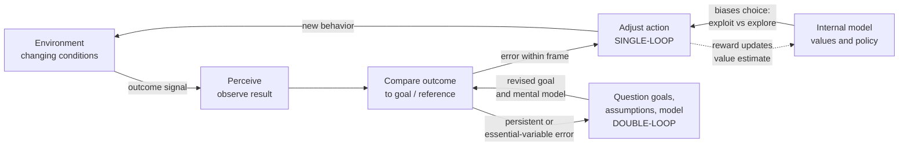

# 🧭 Adaptation and Learning in Systems

> [!abstract] TL;DR
> **Adaptation** is any change in a system that improves its **fit to an environment**, and **learning** is adaptation driven by a **feedback loop** — try something, sense the outcome, adjust. The same loop runs at wildly different **timescales**: genes adapt over generations, bodies adapt over a lifetime of development, behavior adapts over minutes of learning, and cultures adapt over years of imitation and transmission. Argyris and Schön split learning into **single-loop** (fix the action to hit a fixed goal) and **double-loop** (question the goal and the assumptions behind it). Ashby's **ultrastability** and **requisite variety** explain *when* a system has enough internal repertoire to stay viable in a varying world, and **reinforcement learning** gives the formal machinery — reward, value, policy — with its central tension: **exploration vs exploitation**. The perennial danger is **over-adaptation** — tuning so tightly to a transient environment that the system shatters when the environment moves on.

---

## Intuition

**Analogy:** Picture learning to ride a bike. On the first push you wobble, over-steer, and tip. Your body **senses** the fall, your inner ear reports the tilt, and next second you correct a little *less* violently. Fall, feel, adjust; fall, feel, adjust. After twenty minutes the corrections have become invisible and automatic — you have *adapted* to the physics of two wheels. Nobody handed you the equations; you closed a **feedback loop** between action and consequence until the errors shrank. That loop is the atom of all learning.

Now notice the loop runs at other speeds around you at the same time. Over a **single ride**, your muscles fatigue and you shift posture (developmental, minute-scale). Over **months**, you build the reflexes and mental map of your neighborhood's hills (behavioral learning). Over **generations**, human balance and grip evolved long before bicycles existed (genetic). And the very *idea* of a bicycle, plus the trick of "just keep pedaling," was handed to you by **culture**. Adaptation is not one thing; it is the *same error-correcting move* stacked across timescales, from DNA to habit to tradition.

---

## How It Works

### Core Mechanics

**Adaptation as improved fit.** A system is *adapted* to an environment when its structure or behavior raises some measure of viability — survival, reward, profit, stability — given the conditions it actually faces. Adaptation is always **relative to an environment**; a trait that is brilliant fit in one niche is a liability in another (thick fur in the Arctic, lethal in the desert). There is no context-free "better," only better *for this world*.

**The four levels and timescales.** The same error-correcting logic operates at nested speeds, each slower loop setting the stage for the faster ones:

1. **Evolutionary / genetic** (generations) — selection over heritable variation reshapes the population. Slow, blind, but capable of open-ended novelty.
2. **Developmental** (a lifetime) — a single organism's phenotype is shaped by its environment as it grows; the immune system and the brain wire themselves to local conditions.
3. **Learning / behavioral** (seconds to years) — an individual updates behavior from experience without changing its genes. Fast and reversible.
4. **Cultural** (years to centuries) — knowledge, norms, and techniques are transmitted and refined across individuals, a *Lamarckian* channel where acquired improvements are inherited directly.

Faster loops buy time and flexibility; slower loops encode hard-won regularities. A system that can only adapt genetically is at the mercy of the mutation rate; one that can *learn* can retune within its own lifetime.

**Learning as a feedback process.** Strip learning to its skeleton and you get a three-beat cycle: **trial → feedback → adjustment**. Emit an action, receive a signal about how well it worked, and change the disposition that produced it so that better actions become more likely. Whether the substrate is a neuron, a firm, or a gradient-descent optimizer, this is the invariant loop. It is the same negative-feedback structure that governs a thermostat, but pointed at *behavior* rather than temperature.

**Single-loop vs double-loop learning (Argyris & Schön).** Not all correction is equal:

- **Single-loop learning** adjusts *actions* to close the gap against a **fixed goal and fixed assumptions** — "sales missed target, so push harder on the same plan." The governing variables are never questioned. It is efficient and often sufficient, but blind to whether the goal itself is wrong.
- **Double-loop learning** turns the correction back onto the **goals, assumptions, and mental models** that generated the actions — "sales keep missing; maybe the *product* or the *market* is the problem, not our effort." It reframes the problem rather than grinding harder at it.

Single-loop asks "are we doing things right?"; double-loop asks "are we doing the right things?" Organizations (and people) default to single-loop because double-loop is threatening — it forces you to admit the frame itself may be broken.

**Ashby's ultrastability and requisite variety.** W. Ross Ashby, a founder of **cybernetics**, gave adaptation a mechanical account. An **ultrastable** system has *two* feedback loops: a fast one that regulates behavior within its current configuration, and a slow one that, when the fast loop cannot keep an *essential variable* (blood sugar, cash reserves) inside survivable bounds, **randomly reconfigures the controller itself** until stability is restored. That second loop is exactly double-loop learning rendered as a machine — his **Homeostat** demonstrated it in hardware. Ashby's **Law of Requisite Variety** states the deep constraint: *only variety can absorb variety*. A regulator can hold a system stable against a set of disturbances only if it commands at least as many distinct responses as there are distinct disturbances. **Adaptive capacity is bounded by internal variety** — a system with too few moves in its repertoire cannot survive a sufficiently varied world.

**Exploration vs exploitation.** Every adaptive agent faces the same dilemma: **exploit** the option currently believed best, or **explore** alternatives that might be better but are uncertain. Pure exploitation locks in early and misses superior options; pure exploration never cashes in what it has learned. The right balance depends on how *stationary* the world is — a stable environment rewards exploiting, a shifting one demands persistent exploration so the agent can *retrack* when the ground moves.

**Reinforcement learning as a formal model.** RL makes the adaptation loop mathematical. An agent in a **state** takes an **action**, receives a scalar **reward**, and updates: a **value** function estimating expected future reward, and a **policy** mapping states to actions. Learning is nudging value estimates toward observed returns and skewing the policy toward high-value actions — the incremental rule `new = old + α·(target − old)` *is* trial-feedback-adjust in one line, where the step-size `α` controls how fast old beliefs are overwritten.

**Holland's adaptive agents, genetic algorithms, and classifier systems.** John Holland modeled adaptation as **populations of candidate rules** competing and recombining. **Genetic algorithms** evolve a pool of solutions by selection, crossover, and mutation, discovering fit structures without a gradient. **Learning classifier systems** couple a genetic algorithm (which *generates* new condition-action rules) with a reinforcement mechanism (which *credits* rules that lead to reward), a two-loop architecture strikingly parallel to Ashby's.

**The credit assignment problem.** When reward arrives *late* — you win the chess game forty moves after the decisive blunder — *which* earlier action deserves the credit or blame? This **temporal credit assignment** problem is the central technical difficulty of learning from delayed feedback; value functions and eligibility traces exist precisely to propagate credit backward through time to the actions that earned it.

**Adaptability vs stability, and over-adaptation.** A system tuned to change fast is nimble but jittery and forgetful; a system tuned to change slowly is stable but sluggish to retrack. Push adaptivity too far and you get **over-adaptation** — the system fits a *transient* environment so tightly (the machine-learning analogue is **overfitting**) that when conditions revert or move on, its hard-won specialization becomes a fatal handicap. Robust adaptation keeps *slack*, *variety*, and *memory* in reserve rather than optimizing every last degree of freedom to the here-and-now.

### Flow / Architecture



---

## Key Concepts

### Secondary
- **Adaptation = fitting your surroundings.** A system changes so it works better where it lives — a plant turning toward light, a student changing how they study after a bad grade.
- **Learning is a loop.** Try something, see what happens, adjust. Repeat until it works. That loop is the engine behind every skill.
- **Different speeds of change.** Genes change over many generations; a body changes as it grows; behavior changes in minutes; ideas and customs change across a society.
- **Explore or stick with it?** Do you keep ordering your favorite dish, or try a new one that might be better? Every learner has to balance the two.

### Undergraduate
- **Levels and timescales of adaptation.** Genetic (slow, heritable) → developmental (a lifetime) → behavioral learning (fast, reversible) → cultural (transmitted across people). Faster loops give flexibility; slower loops store durable regularities.
- **Trial–feedback–adjustment.** The invariant three-beat structure of learning, an error-correcting negative-feedback loop aimed at behavior.
- **Single-loop vs double-loop learning.** Correcting *actions* against a fixed goal vs correcting the *goals and assumptions* themselves. "Doing things right" vs "doing the right things."
- **Exploration vs exploitation.** The core tradeoff of adaptive choice; the optimal balance depends on how nonstationary the environment is.
- **Reinforcement learning basics.** Reward, value, and policy; the incremental update `Q ← Q + α·(r − Q)` as a formal trial-feedback-adjust rule.
- **Requisite variety, intuitively.** To control a varied environment you need at least as many responses as the environment has disturbances — you cannot regulate variety you cannot match.

### Graduate
- **Ashby's ultrastability.** A two-tier control architecture: a fast behavioral loop plus a slow *step-function* loop that reorganizes the controller when essential variables leave viable bounds — a mechanical model of double-loop learning, demonstrated by the Homeostat.
- **Law of Requisite Variety.** *Only variety can absorb variety.* Formally, regulator variety must be at least disturbance variety minus the channel's inherent absorption; adaptive capacity is upper-bounded by internal variety. Connects cybernetics to information theory.
- **The credit assignment problem.** Temporal (which past action earned delayed reward?) and structural (which internal component deserves credit?) attribution; addressed by value functions, temporal-difference bootstrapping, and eligibility traces.
- **Holland's framework.** Genetic algorithms, the schema theorem, and **learning classifier systems** that fuse rule *generation* (a GA) with rule *evaluation* (reinforcement) — adaptation as competition and recombination in a population of internal models.
- **Stationarity and step-size.** In a nonstationary world, a **constant step-size** (exponential recency-weighting) tracks a drifting target where a **sample-average** estimator, whose effective step-size decays as 1/n, freezes and lags. Tracking vs asymptotic convergence is a genuine tradeoff.
- **Over-adaptation and evolvability.** Tight optimization to a transient regime is the systems analogue of overfitting; retaining redundancy, neutral variation, and modularity preserves **evolvability** and adaptive reserve at the cost of momentary efficiency.
- **Organizational learning.** Firms as adaptive systems: single- vs double-loop learning, exploration/exploitation balance (March's ambidexterity), and defensive routines that block double-loop reframing.

---

## Python Demo

A minimal **adaptive agent**: an **epsilon-greedy multi-armed bandit** learner turned loose in a **nonstationary** environment. Four arms pay off with means that (a) slowly random-walk and (b) undergo an **abrupt regime shift** at the halfway point where the best and worst arms swap. The agent only ever sees a noisy reward for the arm it pulls — it must *infer* which arm is best and *retrack* when the world flips. We pit two update rules against each other: a **constant step-size** learner (`α = 0.1`, exponential recency-weighting → adaptive) versus a **sample-average** learner (`α = 1/n` → sluggish, the classic non-adaptive estimator). We plot the learning curve, how the adaptive agent's value estimates track the moving truth, cumulative reward, and how its action preferences shift after the switch. Uses only `numpy` and `matplotlib`.

```python
# Adaptation as a feedback loop: an epsilon-greedy bandit that must retrack a
# nonstationary reward. Constant step-size (adaptive) vs sample-average (sluggish).
# numpy + matplotlib only.
import numpy as np
import matplotlib.pyplot as plt

K       = 4        # number of arms (actions)
STEPS   = 4000     # time steps
EPS     = 0.10     # exploration rate for epsilon-greedy
ALPHA   = 0.10     # constant step-size for the adaptive learner
DRIFT   = 0.004    # per-step random-walk std of the true means
SWITCH  = STEPS // 2   # abrupt regime shift halfway through

# --- Environment: precompute ONE nonstationary true-mean trajectory ---------
# Both agents face the identical world so the comparison is fair.
env_rng = np.random.default_rng(0)
means_traj = np.empty((STEPS, K))
m = np.array([1.0, 0.4, -0.2, -0.8])          # arm 0 starts clearly best
for t in range(STEPS):
    means_traj[t] = m
    m = m + env_rng.normal(0.0, DRIFT, K)     # slow random walk
    if t == SWITCH:
        m = m[::-1].copy()                    # abrupt shift: reverse the ranking

# --- One epsilon-greedy learner run over the shared environment -------------
def run(mode, seed):
    rng = np.random.default_rng(seed)
    Q = np.zeros(K)                # value estimates (the internal model)
    n = np.zeros(K)                # action counts
    rewards = np.empty(STEPS)
    choices = np.empty(STEPS, dtype=int)
    q_track = np.empty((STEPS, K))
    for t in range(STEPS):
        means = means_traj[t]
        # epsilon-greedy: explore with prob EPS, else exploit current best
        if rng.random() < EPS:
            a = rng.integers(K)
        else:
            a = int(np.argmax(Q))
        r = rng.normal(means[a], 1.0)          # noisy reward for chosen arm only
        n[a] += 1
        alpha = ALPHA if mode == "constant" else 1.0 / n[a]
        Q[a] += alpha * (r - Q[a])             # trial -> feedback -> adjustment
        rewards[t], choices[t], q_track[t] = r, a, Q
    return rewards, choices, q_track

r_ad,  c_ad,  q_ad  = run("constant", seed=1)   # adaptive learner
r_sa,  c_sa,  q_sa  = run("sample",   seed=2)    # sample-average learner

# --- Helpers ----------------------------------------------------------------
def moving_avg(x, w):
    c = np.cumsum(np.insert(x, 0, 0.0))
    return np.arange(w - 1, len(x)), (c[w:] - c[:-w]) / w

def trailing_freq(choices, w):
    onehot = np.eye(K)[choices]
    pad = np.vstack([np.zeros((1, K)), np.cumsum(onehot, axis=0)])
    freq = (pad[w:] - pad[:-w]) / w
    return np.arange(w - 1, STEPS), freq

optimal = means_traj.max(axis=1)               # reward ceiling each step

# --- Plots ------------------------------------------------------------------
fig, ax = plt.subplots(2, 2, figsize=(13, 9))

# (0,0) Learning curve: smoothed reward vs the moving optimal ceiling
xw, ad = moving_avg(r_ad, 100)
_,  sa = moving_avg(r_sa, 100)
_,  op = moving_avg(optimal, 100)
ax[0, 0].plot(xw, ad, label="adaptive (constant alpha)", color="C0")
ax[0, 0].plot(xw, sa, label="sluggish (sample-average)", color="C3", alpha=0.8)
ax[0, 0].plot(xw, op, label="optimal ceiling", color="k", ls=":", lw=1)
ax[0, 0].axvline(SWITCH, color="gray", ls="--", lw=1)
ax[0, 0].set_title("Learning curve (100-step moving-average reward)")
ax[0, 0].set_xlabel("step"); ax[0, 0].set_ylabel("mean reward")
ax[0, 0].legend(loc="lower left", fontsize=8)

# (0,1) Tracking: adaptive agent's value estimates vs the moving true means
for k in range(K):
    ax[0, 1].plot(means_traj[:, k], color=f"C{k}", lw=1.4, label=f"true mean arm {k}")
    ax[0, 1].plot(q_ad[:, k], color=f"C{k}", lw=1, ls="--", alpha=0.7)
ax[0, 1].axvline(SWITCH, color="gray", ls="--", lw=1)
ax[0, 1].set_title("Tracking: Q estimates (dashed) chase true means (solid)")
ax[0, 1].set_xlabel("step"); ax[0, 1].set_ylabel("value")
ax[0, 1].legend(loc="upper right", fontsize=7, ncol=2)

# (1,0) Cumulative reward vs a random-policy baseline
random_baseline = np.cumsum(means_traj.mean(axis=1))
ax[1, 0].plot(np.cumsum(r_ad), label="adaptive", color="C0")
ax[1, 0].plot(np.cumsum(r_sa), label="sluggish", color="C3", alpha=0.8)
ax[1, 0].plot(random_baseline, label="random policy", color="gray", ls=":")
ax[1, 0].axvline(SWITCH, color="gray", ls="--", lw=1)
ax[1, 0].set_title("Cumulative reward")
ax[1, 0].set_xlabel("step"); ax[1, 0].set_ylabel("cumulative reward")
ax[1, 0].legend(loc="upper left", fontsize=8)

# (1,1) Action preferences: trailing-window selection frequency (adaptive agent)
xf, freq = trailing_freq(c_ad, 200)
for k in range(K):
    ax[1, 1].plot(xf, freq[:, k], color=f"C{k}", label=f"arm {k}")
ax[1, 1].axvline(SWITCH, color="gray", ls="--", lw=1)
ax[1, 1].set_title("Action preference (200-step selection frequency)")
ax[1, 1].set_xlabel("step"); ax[1, 1].set_ylabel("fraction of pulls")
ax[1, 1].legend(loc="center right", fontsize=8)

plt.tight_layout()
plt.show()

# --- Summary numbers --------------------------------------------------------
print("total reward  adaptive : {:8.1f}".format(r_ad.sum()))
print("total reward  sluggish : {:8.1f}".format(r_sa.sum()))
print("optimal ceiling total  : {:8.1f}".format(optimal.sum()))
print("after the regime shift, the adaptive learner re-tracks the new best arm;")
print("the sample-average learner stays anchored to stale early estimates.")
```

Running it, the **learning curve** climbs toward the optimal ceiling, then dips sharply at the regime shift before the adaptive agent recovers; the sluggish sample-average agent recovers far slower. The **tracking** panel shows the constant-α agent's dashed value estimates chasing the solid true means and re-ordering them after the flip, while the **action-preference** panel shows the agent's pulls migrating from the old best arm to the new one. That migration *is* adaptation — behavior reorganizing to fit a changed world, driven by nothing but reward feedback.

---

## Real-World Applications

> **Example — the vertebrate immune system as a within-lifetime adaptive learner.** No gene "knows" tomorrow's pathogen. Instead the adaptive immune system runs a Darwinian loop *inside your body*: lymphocytes with randomly varied receptors are generated, those that bind an invader are **selected and cloned** (exploitation), while continual receptor diversity keeps a reserve for unknown threats (exploration). Memory cells store the "policy" so a second exposure is met faster. It is Holland's population-of-rules adaptation and Ashby's essential-variable regulation in biological form — and its failure modes (autoimmunity, allergy) are textbook **over-adaptation** to signals that were not really threats.

- **Reinforcement learning in production.** Recommender systems, ad allocation, and A/B/n testing are literal multi-armed bandits balancing exploration and exploitation; game and robotics agents (AlphaGo, dexterous manipulation) learn policies from delayed reward, solving the credit-assignment problem at scale.
- **Organizational learning.** Toyota's Andon cord and after-action reviews institutionalize single- and double-loop learning; March's exploration/exploitation framing explains why firms must be *ambidextrous* — exploiting current products while exploring new ones — or die when their market shifts.
- **Antibiotic and pesticide resistance.** Populations *adapt* to the very interventions meant to suppress them; over-reliance on one drug is low requisite variety, and rotation strategies are attempts to raise the "regulator's" variety to match an evolving disturbance.
- **Adaptive control and autonomous systems.** Aircraft autopilots, thermostats with learning schedules, and self-tuning controllers embody Ashby's two-loop ultrastability: fast regulation plus slower re-identification of the plant model.
- **Machine-learning training itself.** Learning-rate schedules are the step-size/stationarity tradeoff made explicit; **overfitting** is over-adaptation to the training set, and regularization, early stopping, and validation are the reserves that guard against it.

---

## Common Pitfalls

- **Confusing single-loop for double-loop.** Grinding harder at the same plan ("more effort, same strategy") *feels* like learning but never questions the goal or the model. Persistent error is the signal to reframe, not to redouble.
- **Optimizing to a transient environment (over-adaptation).** Tuning every parameter to current conditions maximizes short-term fit and destroys resilience when conditions revert. Keep slack, redundancy, and variety in reserve — perfect fit today is fragility tomorrow.
- **Using a sample-average estimator in a nonstationary world.** A 1/n step-size assumes the target is fixed; it freezes on stale evidence and cannot retrack. Nonstationary environments demand a **constant step-size** (recency-weighting) even though it never fully converges.
- **Collapsing exploration too early.** Greedy exploitation locks onto the first "good enough" option and is blind when a better one appears or the best one decays. Persistent (or scheduled) exploration is the price of staying adaptive.
- **Ignoring requisite variety.** Deploying a controller with fewer responses than the environment has disturbances guarantees eventual loss of control. You cannot regulate variety you cannot match — build the repertoire *before* the crisis.
- **Mishandling credit assignment.** Rewarding whatever happened *just before* success (or punishing whatever preceded failure) misattributes credit across time and reinforces superstition. Delayed reward needs value propagation, not last-action blame.
- **Treating adaptation as always good.** Adapting to a pathological environment (a corrupt incentive, a rigged metric) makes the system *worse*. Adaptation improves fit to whatever environment you actually inhabit — including a bad one.

---

## Related Concepts

- [[Complex_Adaptive_Systems]] — the umbrella framework: adaptation and learning are the mechanisms by which the many agents of a CAS co-evolve and self-organize.
- [[Feedback_Loops_and_Causality]] — learning *is* a negative-feedback loop pointed at behavior; this note supplies the causal-loop grammar underneath trial-feedback-adjust.
- [[Nonlinearity_and_Feedback]] — adaptive loops are nonlinear, producing thresholds, tipping points, and regime shifts like the one the demo agent must retrack.
- [[General_Systems_Theory]] — the cybernetics lineage (Ashby, ultrastability, requisite variety) that formalized adaptation as regulation.
- [[Systems_Thinking_Overview]] — situates adaptive capacity and requisite variety within the broader systems-thinking toolkit.
- [[Leverage_Points_and_Mental_Models]] — double-loop learning acts on mental models, one of Meadows' highest-leverage intervention points.
- [[RL_Fundamentals]] — the formal MDP machinery (reward, value, policy) that turns the adaptation loop into mathematics.
- [[Q_Learning_and_SARSA]] — concrete value-learning algorithms that solve temporal credit assignment via bootstrapping.
- [[Multi_Agent_and_Inverse_RL]] — adaptation when the environment is *other adapting agents*, where fitness landscapes deform (the Red Queen).
- [[Operant_Conditioning]] — the psychology of reinforcement: behavior shaped by consequences, the biological ancestor of RL.
- [[Reinforcement_Schedules]] — how the *timing* of reinforcement changes learning and extinction rates.
- [[Long_Term_Memory_Systems]] — the storage substrate that lets learned adaptations persist and generalize in cognitive systems.
- [[Evolutionary_Stable_Strategies]] — the equilibrium concept for adaptation among co-evolving strategies, the game-theoretic face of fitness.

---

## Review Questions

1. **(Conceptual)** Distinguish single-loop from double-loop learning, then explain how Ashby's ultrastable system (with its fast regulatory loop and slow step-function loop) is a mechanical realization of that distinction. Why do organizations so often stall at single-loop?
2. **(Scenario)** You run recommendations for a news app whose "best" articles change hourly. Your current model uses a sample-average estimate of each article's click-through and pure-greedy serving. Using the demo's lessons about step-size and exploration, diagnose why performance decays over a day and propose two concrete changes, naming the tradeoff each introduces.
3. **(Trade-off)** A team boasts their trading strategy is "perfectly optimized to the last two years of market data." Argue, using requisite variety and over-adaptation, why this is as much a warning as a boast. What would you keep in reserve to protect adaptive capacity, and what performance would you sacrifice to get it?

---

## Sources

- W. Ross Ashby, *Design for a Brain: The Origin of Adaptive Behaviour*, 2nd ed. (Chapman & Hall, 1960) — ultrastability, the Homeostat, and requisite variety.
- Chris Argyris & Donald A. Schön, *Organizational Learning: A Theory of Action Perspective* (Addison-Wesley, 1978) — single-loop and double-loop learning.
- John H. Holland, *Adaptation in Natural and Artificial Systems* (University of Michigan Press, 1975; MIT Press, 1992) — adaptive agents, genetic algorithms, classifier systems.
- Richard S. Sutton & Andrew G. Barto, *Reinforcement Learning: An Introduction*, 2nd ed. (MIT Press, 2018) — bandits, nonstationarity, step-size, credit assignment.
- James G. March, "Exploration and Exploitation in Organizational Learning," *Organization Science* 2(1), 71–87 (1991).

---

#complexity #adaptation #learning #feedback #reinforcement
