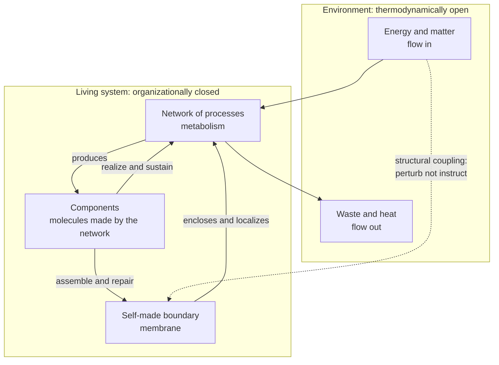

# 🔥 Autopoiesis and Living Systems

> [!abstract] TL;DR
> **Autopoiesis** (Greek *auto* = self, *poiesis* = making) is Maturana and Varela's definition of what it *means* to be alive: a living thing is not a substance or a list of parts but a **self-producing network of processes** that continuously manufactures the very components — and the boundary — that make the network exist. A cell is not a bag of molecules; it is the *ongoing activity of building itself*. The system is **closed in its organization** (the loop that keeps it whole refers only to itself) yet **open thermodynamically** (energy and matter must flow through it, or it dies). This single idea reframes life as self-maintenance, extends into cognition ("living is knowing"), into sociology (Luhmann: society reproduces itself out of communication), and into origin-of-life chemistry (Kauffman's and Eigen's **autocatalytic sets** that collectively catalyze their own production).

---

## Intuition

**Analogy:** Look at a **candle flame**. It has a stable, recognizable shape — you can point to it, photograph it, name it — yet *not one atom stays in it*. Wax vaporizes, combines with oxygen, burns, and the hot gases leave as soot and CO₂; fresh fuel is drawn up the wick every instant. The flame is not a *thing*; it is a **process that holds its own form by continuously rebuilding itself out of a through-flow of matter and energy**. Cut off the fuel or the oxygen and the "object" simply vanishes — there was never any object there to begin with, only a self-sustaining pattern of transformation.

A living cell is a flame that has learned to make its own wick, its own oxygen supply, and its own container. It, too, is a form maintained by constant self-reconstruction. The membrane that defines "inside" from "outside" is itself manufactured by the chemistry it encloses — and that chemistry only runs *because* the membrane holds it together. That circular, self-referential loop — the network makes the components that make the network — is **autopoiesis**. The candle self-*maintains* its shape; the cell self-*produces* its own components and boundary, which is the stronger, distinctly biological version.

---

## How It Works

### Core Mechanics

1. **A network of production processes.** A living system is a set of chemical/physical processes (metabolism) that transform inputs into the system's own components — proteins, lipids, nucleic acids, membranes.
2. **The components regenerate the network.** Those manufactured components are exactly what *carry out* the production processes. There is no separation between "the machine" and "the product": the product **is** the machine. This is **operational (organizational) closure** — every process both depends on and contributes to other processes in the same closed loop.
3. **The network makes its own boundary.** Crucially, the same network produces the **boundary** (the membrane) that spatially separates it from its environment and that makes the whole thing a distinct unity. The boundary is not imposed from outside; it is a *product of the system that is also a condition for the system*.
4. **Closed in organization, open in matter and energy.** "Closed" does **not** mean isolated. It means the *organization* — the pattern of who-produces-what — is self-referential and self-contained. Meanwhile the system is thermodynamically **wide open**: it must dissipate a continuous flow of energy and matter to resist decay (a **dissipative structure**, in Prigogine's sense). Stop the flow and the organization collapses.
5. **Structural coupling, not instruction.** The environment cannot *tell* an autopoietic system what to do; it can only **perturb** it. The system responds according to its *own* structure to stay viable. Over time, system and environment become mutually adapted through a history of perturbations — **structural coupling** — but the environment never programs the system. This is why Maturana rejected the metaphor of the cell (or brain) "processing information from" the world.
6. **Autopoietic vs allopoietic.** An **autopoietic** system produces *itself* (a cell, an organism). An **allopoietic** system produces *something other than itself* (a car factory produces cars, not factories; a crystal grows but does not make the machinery that grows it). This distinction is Maturana and Varela's proposed dividing line for "living."

### From life to cognition and society

- **The biology of cognition.** Because an autopoietic system continuously discriminates the perturbations that preserve its organization from those that destroy it, Maturana argued that **"to live is to know"** — cognition is not a special add-on of brains but the very activity of self-maintenance. Every living system *enacts* a world of relevance defined by what keeps it alive. This is the root of **enactivism**.
- **The observer and languaging.** Distinctions like "boundary," "system," and even "autopoiesis" are drawn by an **observer**. Maturana emphasized that scientific descriptions arise in **language**, a shared coordination of behavior among observers — pushing the theory toward a radical constructivism about how we know.
- **Social autopoiesis (Luhmann).** Niklas Luhmann applied the idea to society: a social system is not made of people but of **communications**, and each communication produces the next. Law, economy, science, and politics are **operationally closed autopoietic subsystems**, each reproducing itself through its own binary code (legal/illegal, payment/non-payment, true/false) and only *structurally coupling* to the others.

### Origin of life: collectively autocatalytic sets

If a full autopoietic cell is complex, how could self-production ever start from dead chemistry? The proposed bridge is the **collectively autocatalytic set** (Stuart Kauffman; related to Manfred Eigen's **hypercycles**): a *set* of molecules in which **every member is produced by a reaction catalyzed by another member of the set**, using a supply of simple food molecules. No single molecule copies itself, yet the *collective* catalyzes its own reproduction — a chemical foreshadow of organizational closure. Formalized as **RAF sets** (Reflexively Autocatalytic and Food-generated), such sets are shown to emerge almost inevitably once catalytic diversity crosses a threshold.

### Flow / Architecture



---

## Key Concepts

**Secondary (intuition level)**
- A living thing is more like a **flame or a whirlpool** than a rock: a *form kept alive by constant self-rebuilding* out of a through-flow of energy and matter.
- **Self-production**: the cell makes the parts that make the cell, *including* the skin that separates it from the world.
- **Closed but not isolated**: the *pattern* that keeps it whole is self-contained, but stuff must keep flowing through or it dies.

**Undergraduate (mechanism level)**
- **Autopoiesis vs allopoiesis**: a cell produces *itself*; a factory produces *cars* (something other than itself). This is the proposed line between living and non-living.
- **Organizational closure vs thermodynamic openness**: the same system is closed in *organization* and open in *matter/energy* — the two are not in contradiction, they are the whole point.
- **Structural coupling**: the environment does not *instruct* the system; it *perturbs* it, and the system compensates according to its own structure, building up a mutual history of adaptation.
- **Autocatalytic set / hypercycle**: a group of molecules that collectively catalyze one another's formation from food molecules — a candidate first step toward self-production and the origin of life.

**Graduate (foundational debate)**
- **Biology of cognition / enactivism**: Maturana's claim that self-maintenance *is* cognition — an autopoietic system "brings forth a world" of significance defined by its own viability, rejecting the mind-as-computer, representation-processing picture.
- **The observer problem and second-order cybernetics**: autopoiesis is a distinction drawn *by an observer in language*; the theory folds the knower into the known, aligning with radical constructivism and von Foerster's second-order cybernetics.
- **Social autopoiesis (Luhmann)**: whether society can be *literally* autopoietic (communications reproducing communications) or only metaphorically so — the most influential and most contested extension.
- **Autopoiesis vs the Free Energy Principle**: both describe boundary-maintaining systems that persist far from equilibrium; the **Markov blanket** formalizes the self/world cut that autopoiesis states qualitatively, and active inference recasts self-maintenance as surprise minimization.
- **The demarcation critique**: is autopoiesis *necessary and sufficient* for life? Critics note viruses, prions, growing crystals, fires, and even the whole Gaia biosphere blur the line; and organizational closure says nothing about **evolution, heredity, or open-ended novelty**, which many hold to be equally essential to "living."

---

## Python Demo

We model a **minimal autocatalytic loop** — the simplest caricature of self-production. An autocatalyst `X` catalyzes its own formation from a food resource `F` (`X + F → 2X`), while `X` continuously **decays** back to inert waste. Resource is supplied by a **throughput** inflow. The point: `X` maintains a stable, non-zero population **against constant decay only while resources flow through it** (organizational persistence bought with thermodynamic openness). The instant we **cut the throughput**, the food drains, self-production stalls, and the whole structure **collapses to zero** — exactly like starving the candle of fuel.

```python
# Minimal autocatalytic self-maintenance vs collapse.
# Reactions:  X + F --k--> 2X      (autocatalysis: X makes more of itself)
#             X       --d--> waste (decay: structure constantly falls apart)
# Resource F is replenished by an inflow (throughput). We run with throughput
# ON, then switch it OFF partway to show the self-sustaining loop collapse.
import numpy as np
import matplotlib.pyplot as plt

k       = 1.0    # autocatalytic rate constant
d       = 0.5    # decay rate of the autocatalyst
inflow  = 1.0    # resource supply rate while throughput is ON
dt      = 0.01
T       = 60.0
t_stop  = 30.0   # time at which we cut the throughput

steps = int(T / dt)
t = np.linspace(0.0, T, steps + 1)
X = np.zeros(steps + 1)   # autocatalyst concentration (the "living" structure)
F = np.zeros(steps + 1)   # resource / food concentration

X[0], F[0] = 0.1, 1.0     # seed of autocatalyst + initial food

for n in range(steps):
    phi = inflow if t[n] < t_stop else 0.0          # throughput ON then OFF
    reaction = k * X[n] * F[n]                       # X + F -> 2X
    dX = reaction - d * X[n]                          # gain from autocatalysis, loss to decay
    dF = phi - reaction                              # supplied minus consumed
    X[n + 1] = max(X[n] + dX * dt, 0.0)
    F[n + 1] = max(F[n] + dF * dt, 0.0)

# Analytic steady state WHILE throughput flows: F* = d/k, X* = inflow/d
F_star, X_star = d / k, inflow / d

fig, ax = plt.subplots(figsize=(9, 5))
ax.plot(t, X, lw=2.2, color="#d62728", label="X  autocatalyst (the structure)")
ax.plot(t, F, lw=2.0, color="#1f77b4", label="F  resource (food)")
ax.axvline(t_stop, ls="--", color="gray")
ax.axhline(X_star, ls=":", color="#d62728", alpha=0.6,
           label=f"predicted X* = {X_star:.2f}")
ax.text(t_stop + 0.6, X_star + 0.15, "throughput CUT\nself-production collapses",
        color="gray", fontsize=10)
ax.text(6, X_star + 0.15, "self-maintained\nfar from zero", color="#d62728", fontsize=10)
ax.set_xlabel("time")
ax.set_ylabel("concentration")
ax.set_title("Autopoietic loop: sustained by throughput, collapses without it")
ax.legend(loc="upper right")
plt.tight_layout()
plt.show()

print(f"steady state while flowing:  X ~ {X[int(t_stop/dt) - 1]:.3f} "
      f"(predicted {X_star:.3f}),  F ~ {F[int(t_stop/dt) - 1]:.3f} "
      f"(predicted {F_star:.3f})")
print(f"final state after throughput cut:  X = {X[-1]:.4f},  F = {F[-1]:.4f}")
```

Before `t_stop`, `X` climbs from its tiny seed and **locks onto a stable plateau** (`X* = inflow / d = 2.0`): production by autocatalysis exactly balances loss by decay, sustained purely by the resource flowing through. The structure is *not* at equilibrium — it is a dynamic steady state held open by throughput. After the cut, `F` is consumed to zero, autocatalysis has no fuel, and `X` **decays exponentially to nothing**. The "organism" was never the molecules; it was the *self-maintaining loop*, and the loop cannot run on a closed thermodynamic system.

---

## Real-World Applications

- **Cell and membrane biology.** The living cell is the paradigm case: metabolism synthesizes the enzymes, lipids, and transporters that constitute metabolism, and manufactures the **plasma membrane** that both encloses the reactions and regulates the matter/energy exchange keeping them running. Autopoiesis gives a principled answer to "what makes this alive?" beyond a parts list.
- **Origin-of-life research.** **Autocatalytic sets / RAF theory** (Kauffman, Hordijk, Steel) and **Eigen's hypercycles** model how collective self-production could bootstrap from prebiotic chemistry before genes or cells — a live research programme connecting to the **RNA world** and protocell (vesicle) experiments.
- **Sociology and organization theory (Luhmann).** Modeling law, economy, science, and mass media as **operationally closed autopoietic communication systems** reframes questions of social change, regulation, and why one subsystem (say, politics) cannot directly "steer" another (say, the economy) — only irritate it.
- **Cognitive science and robotics.** **Enactivism** — the view that cognition is embodied sense-making grounded in an organism's self-maintenance — descends directly from Maturana and Varela and shapes work in **embodied AI**, developmental robotics, and theories of biological autonomy and agency.
- **Systems / cybernetics and management.** Second-order cybernetics and the notion of **operationally closed, self-reproducing systems** inform organizational theory (organizations reproducing their own decisions), ecosystem resilience thinking, and "viable system" models.
- **Artificial life and synthetic biology.** Building minimal self-reproducing chemical or software systems ("wet" protocells, chemotons, self-replicating automata) is, in effect, an engineering test of whether autopoiesis can be constructed rather than merely observed.

---

## Common Pitfalls

- **Confusing "organizationally closed" with "isolated."** Closure refers to the *self-referential organization*, not to walls against the world. An autopoietic system is thermodynamically wide **open** — cut the through-flow and it dies. Reading "closed" as "sealed off" inverts the whole idea.
- **Treating the components as the system.** The living unity is the **process of self-production**, not the molecules at any instant (which are wholly replaced over time, like the atoms in a flame). Point to the loop, not the stuff.
- **Collapsing autopoiesis into mere self-organization.** A hurricane, a Bénard convection cell, or a growing crystal self-organizes but does **not** produce its own components and boundary. Self-organization is necessary background; **self-production of the producer** is the extra, defining step.
- **Over-literal social autopoiesis.** Luhmann's claim that society is made of communications (not people) is powerful but hotly contested; treating the biological metaphor as an exact identity smuggles in more than the theory can carry, and critics charge it downplays human agency and power.
- **Assuming autopoiesis explains evolution.** Organizational closure describes *maintenance of the individual*, not **heredity, variation, or natural selection**. A system can be perfectly autopoietic and evolutionarily sterile; life needs both. Do not use autopoiesis to explain adaptation over generations.
- **Ignoring the demarcation gray zone.** Viruses, prions, fire, and the Gaia biosphere all stress the autopoietic/allopoietic boundary. Presenting the criterion as a crisp, settled definition of "life" overstates the consensus.

---

## Related Concepts

- [[Emergence_and_Self_Organization]] — self-organization is the necessary substrate; autopoiesis adds the stronger requirement that the system produce its *own* components and boundary, not merely fall into an ordered pattern.
- [[Complex_Adaptive_Systems]] — autopoietic systems are a special, boundary-maintaining class of complex adaptive system, distinguished by operational closure and self-production.
- [[Feedback_Loops_and_Causality]] — the self-referential "the-network-makes-the-network" loop is the tightest possible positive/regulatory feedback, and structural coupling is feedback between system and environment.
- [[General_Systems_Theory]] — autopoiesis is a second-order-cybernetics refinement of the open-system concept, sharpening what it means for an open system to be *alive*.
- [[System_Boundaries_and_Hierarchy]] — the self-manufactured membrane is the canonical case where the boundary is not given by an observer but *produced by the system itself*.
- [[Functionalism_and_Systems_Theory]] — Luhmann recast sociology around **operationally closed autopoietic social subsystems** reproducing themselves through communication.
- [[Embodied_and_Extended_Cognition]] — **enactivism** grows directly out of Maturana and Varela's "living is cognition," treating mind as embodied self-maintaining sense-making.
- [[Predictive_Processing_and_Free_Energy]] — the Free Energy Principle and **Markov blankets** give a formal, information-theoretic cousin of boundary-maintaining self-organization.
- [[The_History_of_Life_on_Earth]] — **autocatalytic sets** and abiogenesis are the proposed chemical route from dead matter to the first self-producing units.
- [[Enzymes_and_Catalysis]] — collective **catalysis** among molecules is the mechanism that makes an autocatalytic set close on itself.
- [[The_Cell_Theory_and_Cell_Types]] — the cell as the minimal autopoietic unit grounds the abstract theory in concrete membrane-bound biology.

---

## Review Questions

1. **(Conceptual)** Explain precisely how a system can be *closed in its organization* yet *open in matter and energy*, and why these two claims are complementary rather than contradictory. Use the candle-flame or cell example to show what each kind of "openness/closure" refers to.
2. **(Scenario)** You are handed three systems: a growing salt crystal, a bacterium, and an automobile assembly line. Classify each as autopoietic or allopoietic, justify the classification against Maturana and Varela's criteria, and identify which one is the hardest to classify and why.
3. **(Trade-off / foundational)** Luhmann claims a legal system is *literally* autopoietic — communications producing communications through the code legal/illegal. Argue for or against transplanting a biological definition of life onto society. What does the analogy illuminate, what does it distort, and where does the concept of **structural coupling** do real explanatory work in your answer?

---

## Sources

- Maturana, H. R., & Varela, F. J. (1980). *Autopoiesis and Cognition: The Realization of the Living*. D. Reidel. [Springer](https://link.springer.com/book/10.1007/978-94-009-8947-4)
- Varela, F. J., Thompson, E., & Rosch, E. (2016 [1991]). *The Embodied Mind: Cognitive Science and Human Experience* (rev. ed.). MIT Press. [MIT Press](https://mitpress.mit.edu/9780262529365/the-embodied-mind/)
- Luhmann, N. (1995). *Social Systems*. Stanford University Press. [SUP](https://www.sup.org/books/title/?id=2225)
- Kauffman, S. A. (1993). *The Origins of Order: Self-Organization and Selection in Evolution*. Oxford University Press. [OUP](https://global.oup.com/academic/product/the-origins-of-order-9780195079517)
- Hordijk, W., & Steel, M. (2004). "Detecting Autocatalytic, Self-Sustaining Sets in Chemical Reaction Systems." *Journal of Theoretical Biology*, 227(4), 451–461. [ScienceDirect](https://www.sciencedirect.com/science/article/abs/pii/S0022519303003547)

---

#complexity #autopoiesis #living-systems #maturana-varela #self-maintenance
