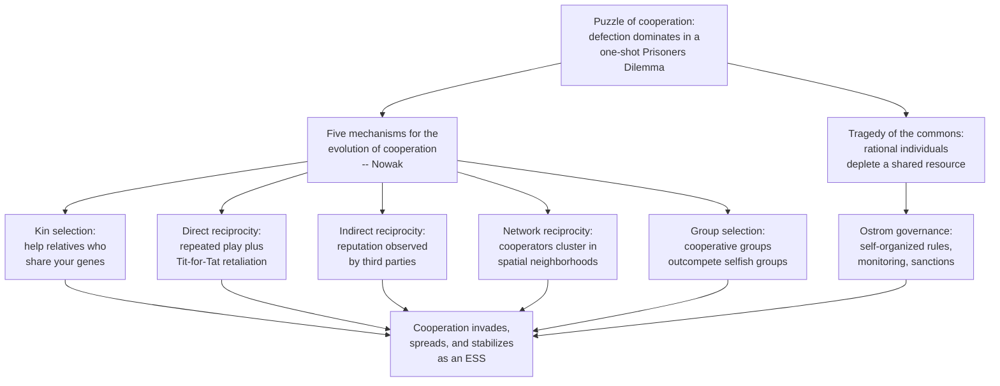

# 🤝 Cooperation and Evolutionary Game Theory

> [!abstract] TL;DR
> **Evolutionary game theory (EGT)** asks how cooperation can survive in a world where **defection pays more to the individual**. The canonical trap is the **Prisoner's Dilemma**: two rational agents both defect and end up worse than if both had cooperated — and scaled up, this becomes the **tragedy of the commons**. EGT reframes strategies as **inheritable phenotypes** and payoff as **fitness** (Maynard Smith), so a population *evolves* toward whatever strategies reproduce fastest. An **evolutionarily stable strategy (ESS)** is one that, once common, cannot be invaded by any rare mutant; the **replicator equation** describes how strategy shares change over generations. Axelrod's iterated tournaments showed that **nice, retaliatory, forgiving** strategies like **Tit-for-Tat** thrive when the game is repeated (the **shadow of the future**). Nowak distilled the whole field into **five mechanisms** — kin selection, direct reciprocity, indirect reciprocity, network/spatial reciprocity, and group selection — each a distinct route by which natural selection can build cooperators out of a soup of defectors.

---

## Intuition

**Analogy:** Two vampire bats return to the roost after a night of hunting. One found blood; the other starved and will die if it goes two nights empty. The lucky bat can **regurgitate** a share of its meal to keep its neighbor alive — at a small cost to itself, since it gave up a large survival benefit to a bat facing death. Pure self-interest says "keep it all." Yet real vampire bats *do* share blood, and the trick that makes it pay is simple: **they meet again tomorrow night, and roles reverse.** A bat that shares builds a partner who shares back; a bat that always hoards is remembered and cut off. What looks like altruism is really cooperation held in place by **repetition, memory, and the threat of retaliation** — the exact ingredients EGT formalizes.

Now shrink the bats to abstract "players" and shrink a night's blood to a "payoff." A one-off encounter between strangers rewards the cheat. But wrap that encounter in **repeated play, family ties, reputation, or a spatial neighborhood**, and cooperation stops being a sucker's move and becomes an evolutionarily winning one. The puzzle of cooperation is not "why are humans nice?" but "under exactly which structural conditions does natural selection favor being nice?"

---

## How It Works

### Core Mechanics

**1. The Prisoner's Dilemma (PD) — the atom of the problem.** Two players each choose to **cooperate (C)** or **defect (D)**. Payoffs obey `T > R > P > S`:

| | Opponent C | Opponent D |
|---|:---:|:---:|
| **You C** | R = 3 (reward) | S = 0 (sucker) |
| **You D** | T = 5 (temptation) | P = 1 (punishment) |

No matter what the opponent does, **defecting earns you more** — D strictly dominates C. So two rational players both defect and collect `P = 1` each, when mutual cooperation would have paid `R = 3` each. Individual rationality produces a collectively worse outcome. Scale this to `N` players drawing from a shared resource and you get the **tragedy of the commons** (Hardin): every herder gains by adding one more cow to the common pasture, but the sum of those rational choices destroys the pasture for all.

**2. From rationality to evolution (Maynard Smith).** Classical game theory assumes clever, rational agents. Evolutionary game theory drops that assumption. A **strategy is a phenotype** encoded in a gene or a cultural habit; **payoff is Darwinian fitness** (offspring, or imitators). No agent "reasons" — strategies that earn more simply **reproduce more**, so their share of the population grows. Equilibrium is not chosen by intellect; it is **the resting point of a dynamical selection process.**

**3. Evolutionarily stable strategy (ESS).** A strategy S* is an ESS if a whole population playing S* **cannot be invaded** by a small fraction of any mutant strategy S'. Formally, either S* does strictly better against itself than S' does against S*, or they tie and S* does strictly better against S'. In the one-shot PD, **Always Defect is the unique ESS** — cooperation cannot get a foothold. That is precisely why cooperation is a *puzzle*, and why we need extra structure to escape the trap.

**4. Replicator dynamics — the equation of selection.** Let `x_i` be the fraction of the population using strategy `i`, `f_i(x)` its expected payoff (fitness) against the current mix, and `f̄(x)` the population's mean fitness. The **replicator equation** is:

$$\dot{x}_i = x_i \,[\,f_i(x) - \bar{f}(x)\,]$$

A strategy's share **grows when it beats the average and shrinks when it lags** — natural selection written as an ODE. Its fixed points and stable attractors connect directly to Nash equilibria and ESS.

**5. The shadow of the future (Axelrod).** Repeat the PD indefinitely and defection loses its grip. If players meet again with high probability `w`, cooperation can be sustained because today's defection invites tomorrow's retaliation. Axelrod's 1980 computer tournaments pitted submitted strategies in a round-robin iterated PD; the winner, **Tit-for-Tat (TFT)** — cooperate first, then copy the opponent's last move — won by being:
- **Nice** — never the first to defect;
- **Retaliatory** — punishes defection immediately;
- **Forgiving** — returns to cooperation the moment the opponent does;
- **Clear** — simple enough for opponents to "read" and adapt to.

**6. Nowak's five mechanisms for the evolution of cooperation.** Martin Nowak organized every known escape route from the defection trap into five categories:

1. **Kin selection** (Hamilton): help relatives who share your genes; cooperation pays when `r · b > c` (relatedness × benefit exceeds cost).
2. **Direct reciprocity** (Trivers, Axelrod): "I help you, you help me" in **repeated** encounters; needs the shadow of the future.
3. **Indirect reciprocity** (Nowak & Sigmund): help those with a good **reputation**; cooperation pays when the probability of knowing someone's reputation exceeds the cost-to-benefit ratio. This is the engine behind gossip, ratings, and moral norms.
4. **Network / spatial reciprocity**: when interaction is **local** (a lattice or social network), cooperators form **clusters** that support one another and resist invasion by defectors on the boundary.
5. **Group selection**: groups with more cooperators **outcompete** groups of defectors, so cooperation can rise at the group level even while losing at the individual level within each group.

**7. Punishment and governance of the commons.** In **public goods games** (each player contributes to a common pot that is multiplied and split), free-riding is the dominant temptation — so cooperation collapses unless **costly punishment** of defectors is available, which re-stabilizes contribution (Fehr & Gächter). Elinor Ostrom's fieldwork went further: real communities avoid the tragedy of the commons **without** top-down privatization or state control, using self-designed institutions — clear boundaries, graduated sanctions, monitoring, and conflict resolution — her eight **design principles** for governing the commons.

### Flow / Architecture



---

## Key Concepts

### Secondary
- **The dilemma.** If everyone helps, everyone does well; but each person is tempted to grab the reward and skip the effort. When everyone gives in to that temptation, all end up worse off.
- **Why repetition changes everything.** If you will meet the same person again, cheating them today means they cheat you tomorrow — so being trustworthy becomes the smart move.
- **Tit-for-Tat.** A famous strategy: be kind first, then simply do to others what they just did to you. Nice, but not a pushover.
- **Tragedy of the commons.** A shared field, fishery, or atmosphere gets ruined when everyone takes as much as they individually want.

### Undergraduate
- **Prisoner's Dilemma payoff order** `T > R > P > S` with `2R > T + S` — the inequalities that define the dilemma and make mutual cooperation the social optimum.
- **Nash equilibrium vs. social optimum.** Mutual defection is the Nash equilibrium of the one-shot PD; mutual cooperation is the Pareto-superior outcome the equilibrium fails to reach.
- **ESS as uninvadability.** An ESS is a Nash equilibrium plus a stability condition against rare mutants; Always Defect is the ESS of the one-shot PD.
- **Replicator dynamics.** `ẋ_i = x_i (f_i − f̄)`: strategy shares track relative fitness; every ESS is an asymptotically stable rest point, but not every stable rest point is an ESS.
- **Axelrod's four traits of winners.** Nice, retaliatory, forgiving, clear — the empirical recipe from the iterated PD tournaments.
- **The shadow of the future.** Cooperation is sustainable when the discounted probability `w` of future interaction is high enough that long-run gains from cooperation beat the one-time temptation.

### Graduate
- **Hamilton's rule and inclusive fitness.** `r · b > c` — kin selection maximizes inclusive fitness; the formal foundation of biological altruism (see [[Kin_Selection_and_Altruism]]).
- **Direct reciprocity threshold.** In the repeated PD, cooperation can be an equilibrium iff `w > (T − R)/(T − P)`; the folk theorem shows a whole continuum of cooperative equilibria for patient players (see [[Repeated_Games_and_Folk_Theorems]]).
- **Indirect reciprocity condition.** Nowak & Sigmund: cooperation via reputation is favored when `q > c/b`, where `q` is the probability of knowing a partner's reputation — the mathematics of image scoring and social norms.
- **Network reciprocity condition.** On a graph of average degree `k`, cooperation is favored roughly when `b/c > k` — sparser networks help cooperators cluster and shield each other from exploitation.
- **Structural instability of Nash in EGT.** In cyclic games (rock-paper-scissors, and PD variants with mutation) the replicator flow can produce **limit cycles or chaos** rather than convergence, so an interior Nash point need not be an attractor.
- **Multi-level (group) selection and the Price equation.** The Price equation decomposes selection into within-group and between-group components, making explicit when altruism loses locally but wins globally.
- **Costly punishment and second-order free-riding.** Punishment stabilizes public goods, but punishers pay a cost that non-punishing cooperators avoid — the **second-order free-rider problem** — resolved by reputation, institutions, or coordinated ("pool") punishment.

---

## Python Demo

An **ecological / evolutionary iterated Prisoner's Dilemma tournament** — Axelrod's "ecological" experiment made concrete. We run a round-robin among six classic strategies, build the average-payoff matrix, then let **replicator dynamics** evolve the population over generations. Watch **Always Cooperate** get exploited and collapse, **Always Defect** spike while suckers exist and then starve once they are gone, and **Tit-for-Tat / Grim** inherit the world — cooperation emerging and stabilizing. `numpy` and `matplotlib` only.

```python
# Ecological iterated Prisoner's Dilemma: a round-robin tournament feeds a
# replicator dynamic. Nice-retaliatory strategies (TFT, Grim) win over time.
import numpy as np
import matplotlib.pyplot as plt

rng = np.random.default_rng(42)

# Payoff to ME given (my move, opp move); 0 = Cooperate, 1 = Defect.
# T=5 > R=3 > P=1 > S=0  (the Prisoner's Dilemma ordering)
PAY = np.array([[3, 0],    # I cooperate: (opp C -> R), (opp D -> S)
                [5, 1]])   # I defect:    (opp C -> T), (opp D -> P)

# Each strategy maps (my past moves, opp past moves) -> next move.
def all_c(mine, opp):  return 0
def all_d(mine, opp):  return 1
def tft(mine, opp):    return 0 if len(opp) == 0 else opp[-1]          # copy last
def grim(mine, opp):   return 1 if (1 in opp) else 0                   # never forgive
def tf2t(mine, opp):                                                   # forgive once
    return 1 if len(opp) >= 2 and opp[-1] == 1 and opp[-2] == 1 else 0
def rand(mine, opp):   return int(rng.integers(0, 2))                  # coin flip

STRATS = [all_c, all_d, tft, grim, tf2t, rand]
NAMES  = ["AllC", "AllD", "TFT", "Grim", "TF2T", "Random"]
n = len(STRATS)

def play_match(a, b, rounds=200):
    """Return (avg per-round payoff to a, to b) over one iterated match."""
    ma, mb, pa, pb = [], [], 0, 0
    for _ in range(rounds):
        x = a(ma, mb)          # a's move given full history
        y = b(mb, ma)          # b's move
        pa += PAY[x, y]
        pb += PAY[y, x]
        ma.append(x); mb.append(y)
    return pa / rounds, pb / rounds

# Build the tournament payoff matrix M[i, j] = avg payoff to i when facing j.
M = np.zeros((n, n))
for i in range(n):
    for j in range(i, n):
        pi, pj = play_match(STRATS[i], STRATS[j])
        M[i, j] = pi
        M[j, i] = pj

# Replicator dynamics: fitness of i = expected payoff vs a random opponent
# drawn from the current population mix x.  x_i(t+1) = x_i * f_i / mean_f.
GENERATIONS = 60
x = np.full(n, 1.0 / n)                 # start with equal shares
history = np.zeros((GENERATIONS, n))
for g in range(GENERATIONS):
    history[g] = x
    fitness = M @ x                     # f_i = sum_j M[i,j] x_j
    x = x * fitness / (x @ fitness)     # selection step (payoffs are >= 0)

# Plot how each strategy's share of the population evolves.
plt.figure(figsize=(9, 5))
for i in range(n):
    plt.plot(history[:, i], label=NAMES[i], linewidth=2)
plt.xlabel("generation")
plt.ylabel("fraction of population")
plt.title("Ecological iterated Prisoner's Dilemma: cooperation stabilizes")
plt.legend(); plt.grid(alpha=0.3); plt.tight_layout(); plt.show()

winner = NAMES[int(np.argmax(history[-1]))]
print("Head-to-head avg payoffs (rows vs cols):")
print("        " + "  ".join(f"{nm:>6}" for nm in NAMES))
for i, nm in enumerate(NAMES):
    print(f"{nm:>6}  " + "  ".join(f"{M[i, j]:6.2f}" for j in range(n)))
print(f"\nFinal shares: " +
      ", ".join(f"{nm} {s:.2f}" for nm, s in zip(NAMES, history[-1])))
print(f"Dominant strategy after {GENERATIONS} generations: {winner}")
```

Running it, `AllC` crashes first (defectors feast on unconditional cooperators), which briefly inflates `AllD`. But once the suckers are extinct, `AllD` only ever meets retaliators and its fitness collapses to the mutual-punishment payoff, while `TFT` and `Grim` — cooperating with their own kind at `R = 3` — pull ahead and dominate. The plot shows the signature story of the field: **defection wins the battle, reciprocity wins the war.**

---

## Real-World Applications

> **Example — cleaner fish and their clients.** On coral reefs, small *cleaner wrasse* eat parasites off larger "client" fish. The cleaner is tempted to **cheat** by biting healthy mucus (tastier than parasites) — a defection. But clients **remember and switch cleaners**, and bystander clients **watch** how a cleaner treats others before approaching. This is direct *and* indirect reciprocity operating in a living animal market: reputation and repeat business hold cheating in check exactly as EGT predicts.

- **Trench warfare "live-and-let-let" (WWI).** Opposing units repeatedly facing each other evolved tacit truces — shelling at predictable times, aiming to miss — a real historical Tit-for-Tat sustained by the shadow of the future, and broken only when high command rotated units to destroy the repetition.
- **Online reputation systems.** eBay feedback, Uber ratings, and Airbnb reviews are engineered **indirect reciprocity** — strangers cooperate because a permanent, observable reputation makes defection costly.
- **Open-source software and Wikipedia.** Public-goods problems solved by a mix of reputation, reciprocity, and Ostrom-style governance (maintainers, norms, graduated sanctions) rather than markets or state control.
- **Climate and fisheries as commons.** Emissions treaties and fishing quotas are attempts to escape a planetary tragedy of the commons; Ostrom's principles inform community-managed fisheries and irrigation systems worldwide.
- **Microbial cooperation and cancer.** Bacteria secrete shared "public-good" enzymes that cheaters exploit; tumors are cells that **defect** on the multicellular cooperation contract — EGT models both, and cheater-suppression is a therapeutic target.
- **Multi-agent AI and mechanism design.** Reinforcement-learning agents in shared environments face social dilemmas; designers use reputation, reciprocity, and payoff shaping (see [[Agent_Based_Modeling]]) to engineer cooperative equilibria.

---

## Common Pitfalls

- **Confusing the one-shot and iterated games.** Defection is unbeatable in a *single* PD; almost every cooperative result requires **repetition, structure, or relatedness.** Citing Tit-for-Tat's success to argue that cooperation is "naturally" rational, without the iterated assumption, is a category error.
- **Treating Tit-for-Tat as universally optimal.** TFT is fragile to **noise**: a single mistaken defection triggers endless mutual retaliation (an "echo"). Forgiving variants (Tit-for-Two-Tats, Generous TFT, Win-Stay-Lose-Shift) beat it under errors. There is **no strategy that wins in all environments** — success is frequency- and structure-dependent.
- **Mislabeling cooperation as altruism.** Reciprocity is **enlightened self-interest**, not selflessness — the cooperator expects a return. Conflating the two smuggles in moral claims EGT never makes.
- **Assuming group selection is easy.** Between-group selection must **overcome** within-group selection favoring defectors; this needs low migration, small groups, or strong assortment. Naive "for the good of the species" reasoning is the classic group-selection fallacy.
- **Ignoring the second-order free-rider problem.** Punishment stabilizes public goods, but *who pays to punish?* Non-punishing cooperators free-ride on enforcers; a model that adds punishment without explaining why punishers persist is incomplete.
- **Reading the tragedy of the commons as inevitable.** Hardin's parable implies only privatization or coercion can save the commons; Ostrom's Nobel-winning fieldwork shows **self-governed institutions routinely succeed** — the "tragedy" is a default, not a destiny.
- **Over-reading replicator convergence.** Assuming the dynamics always settle to a fixed ESS ignores that many games produce **cycles or chaos** (rock-paper-scissors, PD with mutation), where no single strategy ever dominates for long.

---

## Related Concepts

- [[Complex_Adaptive_Systems]] — cooperation is emergent macro-order arising from many locally-adapting agents; EGT is the selection engine inside a CAS.
- [[Agent_Based_Modeling]] — the workhorse method for simulating iterated and spatial cooperation games when analytics run out.
- [[Cellular_Automata]] — Nowak & May's spatial PD lives on a CA lattice, where cooperators survive as dynamic clusters.
- [[Emergence_and_Self_Organization]] — stable cooperation is a self-organized pattern, not a designed or centrally-imposed one.
- [[Network_Dynamics_and_Contagion]] — network reciprocity depends on graph structure; cooperation spreads and clusters like a contagion over social ties.
- [[Replicator_Dynamics]] — the exact ODE governing how cooperative vs. defecting strategy shares evolve over generations.
- [[Evolutionary_Stable_Strategies]] — the uninvadability concept that decides whether cooperation, once present, can persist against mutants.
- [[Repeated_Games_and_Folk_Theorems]] — the game-theoretic backbone of direct reciprocity and the shadow of the future.
- [[Nash_Equilibrium]] — mutual defection is the Nash equilibrium of the one-shot PD; the gap from the social optimum is the whole puzzle.
- [[Natural_Selection_and_Adaptation]] — payoff-as-fitness ties EGT directly to Darwinian selection; strategies are phenotypes.
- [[Kin_Selection_and_Altruism]] — Hamilton's rule and inclusive fitness, the first of Nowak's five mechanisms.
- [[Public_Goods]] — the N-player generalization of the PD, where free-riding and the tragedy of the commons appear.
- [[Externalities_and_Pigouvian_Tax]] — the economic framing of commons problems and the interventions that internalize them.

---

## Review Questions

1. **(Conceptual)** Explain precisely why cooperation is an equilibrium in the *iterated* Prisoner's Dilemma but not in the *one-shot* version. In your answer, define the "shadow of the future" and state (qualitatively) how the continuation probability `w` changes which strategies survive.
2. **(Scenario)** You are designing a peer-to-peer file-sharing network where users can either **upload** (cooperate, costly) or **only download** (defect, free). Free-riding is rampant. Choose **two** of Nowak's five mechanisms to engineer into the protocol, describe the concrete feature each becomes (e.g., a data structure or rule), and explain the failure mode each mechanism introduces.
3. **(Trade-off)** Tit-for-Tat won Axelrod's noiseless tournaments, yet more forgiving strategies (Generous TFT, Win-Stay-Lose-Shift) outperform it once players make mistakes. Analyze the trade-off between **retaliation** and **forgiveness**: what does a strategy gain and lose by moving in each direction, and how does the error rate shift the optimum?

---

## Sources

- Robert Axelrod, *The Evolution of Cooperation* (Basic Books, 1984).
- John Maynard Smith, *Evolution and the Theory of Games* (Cambridge University Press, 1982).
- Martin A. Nowak, "Five Rules for the Evolution of Cooperation," *Science* 314 (2006), 1560–1563.
- Elinor Ostrom, *Governing the Commons: The Evolution of Institutions for Collective Action* (Cambridge University Press, 1990).
- Josef Hofbauer and Karl Sigmund, *Evolutionary Games and Population Dynamics* (Cambridge University Press, 1998).
- Martin A. Nowak and Robert M. May, "Evolutionary Games and Spatial Chaos," *Nature* 359 (1992), 826–829.

---

#complexity #cooperation #evolutionary-game-theory #prisoners-dilemma #replicator-dynamics
