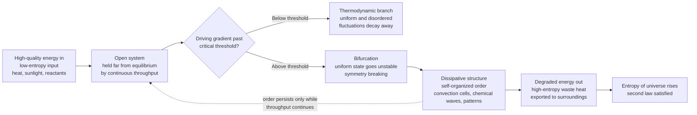

# 🌀 Dissipative Structures and Nonequilibrium Self-Organization

> [!abstract] TL;DR
> A **dissipative structure** is a stable, ordered pattern — convection cells, a chemical clock, a hurricane, a living cell — that appears spontaneously when an **open system is driven far from thermodynamic equilibrium** by a continuous flow of energy and matter. Ilya Prigogine (Nobel 1977) showed such order does **not** violate the second law: the structure lowers its *own* entropy only by **exporting even more entropy to its surroundings**, so the entropy of the universe still rises. Order here is not the frozen order of a crystal at equilibrium — it exists *only while the throughput continues*, paid for by the relentless dissipation of a gradient. Life itself is the supreme example.

---

## Intuition

**Analogy:** Pull the plug in a full bathtub and watch a **whirlpool** form above the drain. That vortex is a genuine structure — it has a shape, an axis, a direction of spin, and it holds that form for as long as you watch. Yet it is made of water molecules that are rushing *through* it and away down the drain; not one of them stays. Stop the flow — cap the drain — and the whirlpool vanishes instantly, leaving flat, featureless water. The pattern is not stored in the water like a shape carved in ice; it is a **standing form maintained by a continuous flow of matter and energy through the system**. That is a dissipative structure in miniature.

A **candle flame** tells the same story: a fixed teardrop shape held steady while wax and oxygen pour in and hot gas and light pour out. A **convection cell** in a pan of heated oil is a third telling. The common thread: these are islands of order that exist *because* something is flowing through and being degraded — order bought with dissipation, not order at rest.

---

## How It Works

### Core Mechanics

1. **Start from equilibrium and its opposite.** A *closed* system left alone relaxes to thermodynamic equilibrium — maximum entropy, no gradients, no flow, no structure (a sealed, cooled cup of coffee at room temperature). Nothing interesting can happen there; equilibrium is where dissipative order goes to die.

2. **Open the system and drive it.** Feed energy and matter in one side and let waste out the other. Now the system sits *away* from equilibrium, held there by continuous **throughput**. A small gradient (a gentle temperature difference) keeps it in the near-equilibrium **thermodynamic branch**: still uniform, still dull, fluctuations just decay away.

3. **Push past a threshold.** Increase the driving gradient. At a **critical value** the uniform state becomes *unstable* — a random fluctuation, instead of dying, gets amplified by **nonlinear feedback** (often **autocatalysis**, where a product accelerates its own production). The system can no longer stay uniform.

4. **Bifurcate and break symmetry.** At the instability the system faces a fork — a **bifurcation** — and must "choose" one of several new ordered states. Which one it lands in is decided by a microscopic fluctuation, so the outcome is history-dependent. Prigogine called this **order through fluctuations**: chance selects, the nonlinearity amplifies, and a macroscopic pattern crystallizes.

5. **Pay the entropy bill.** The structure has *lowered* its own internal entropy (it is more ordered than the uniform state). This is allowed only because it dumps a larger amount of entropy into the environment. The entropy balance of any open system splits in two:
   - `dS = d_iS + d_eS`
   - `d_iS` is entropy **produced inside** by irreversible processes — the second law forces `d_iS >= 0`, always.
   - `d_eS` is entropy **exchanged with the surroundings** — this term *can be negative*, i.e. the system can export entropy.
   A dissipative structure runs `d_eS < 0` large enough to hold its own entropy steady or falling while the universe's total entropy keeps climbing. **The second law is obeyed, not broken.**

6. **Order lives only on the flow.** Cut the throughput and the structure collapses back to the uniform equilibrium state. Unlike a crystal (equilibrium order, stable in isolation), a dissipative structure is **dynamically maintained** — it is a process wearing the mask of a thing.

### Flow / Architecture



---

## Key Concepts

### Secondary (intuitive)
- **Equilibrium is boring; flow is interesting.** A sealed, undisturbed system settles into featureless sameness. Structure needs a *through-flow* of energy or matter.
- **Order that costs energy.** A whirlpool, a flame, and a hurricane are all shapes held together by stuff moving through them; switch off the flow and the shape disappears.
- **Not against the second law.** The world's total disorder still increases; the ordered spot just shoves its share of disorder outward as waste heat. Your body builds intricate order every second and exhales the entropy bill as warm CO2.
- **Life eats order.** Schrödinger's phrase: an organism "feeds on **negentropy**" — it takes in low-entropy food and light and excretes high-entropy waste to keep itself from decaying into equilibrium (which, for a body, means death).

### Undergraduate (mechanism)
- **Entropy balance of an open system:** `dS = d_iS + d_eS`, with internal production `d_iS >= 0` (the second law) and exchange term `d_eS` of either sign. Local order is bought by making `d_eS` sufficiently negative.
- **Near vs far from equilibrium.** Near equilibrium, responses are linear and the uniform state is stable. Only **far from equilibrium**, where nonlinear kinetics dominate, can instabilities and self-organization appear.
- **Bénard convection.** Heat a thin fluid layer from below. Below a critical **Rayleigh number** heat crosses by conduction and the fluid is still; above it, buoyancy wins and the fluid breaks into a regular tiling of rotating **hexagonal convection cells** — a textbook nonequilibrium phase transition to spatial order.
- **Belousov-Zhabotinsky reaction.** A stirred cocktail of bromate, an acid, and a metal catalyst **oscillates** in color for minutes — a "chemical clock" — and in an unstirred dish makes expanding **target and spiral waves**. It runs on **autocatalysis**: an intermediate speeds its own formation, giving the nonlinear positive feedback instabilities need.
- **Autocatalysis and positive feedback.** A reaction whose product catalyzes itself is the chemical engine of amplification; it turns a tiny fluctuation into a macroscopic swing and underlies both oscillation and pattern formation.
- **Reaction-diffusion and the Turing instability.** Turing (1952) proved that two chemicals — a slow-diffusing **activator** and a fast-diffusing **inhibitor** — can spontaneously form stationary **spots or stripes** from a nearly uniform start. The counterintuitive punchline: **diffusion, which normally smooths things out, here *creates* pattern** (a "diffusion-driven instability").
- **Bifurcation to order.** As the control parameter passes its critical value the uniform solution loses stability and new, patterned solutions branch off — the nonequilibrium analogue of a phase transition.

### Graduate (foundational)
- **Onsager reciprocal relations.** In the linear near-equilibrium regime, cross-coupling coefficients between thermodynamic fluxes and forces are symmetric — the foundation of linear irreversible thermodynamics.
- **Minimum entropy production theorem (Prigogine).** In the *linear* regime, a system relaxes to the stationary nonequilibrium state that **minimizes entropy production** consistent with its constraints, and that state is stable. Crucially, this theorem **does not extend far from equilibrium** — its failure there is exactly what opens the door to self-organization.
- **Glansdorff-Prigogine stability criterion.** Far from equilibrium the uniform branch can violate the stability inequality; the sign of the excess entropy production determines whether a fluctuation grows into a dissipative structure.
- **Maximum entropy production principle (MEP).** A separate, more speculative hypothesis that driven nonequilibrium systems select the state that *maximizes* entropy production (used in climate and turbulence modeling). It is **contested**, lacks a general proof, and must not be conflated with Prigogine's minimum-production theorem, which governs a different regime.
- **The Brusselator.** Prigogine and Lefever's minimal autocatalytic model showing a **Hopf bifurcation** to sustained chemical oscillations — the abstract skeleton of the BZ reaction and a clean case study in nonequilibrium bifurcation theory.
- **Turing condition, precisely.** Linearize an activator-inhibitor system; the homogeneous state must be *stable to uniform perturbations* yet *unstable to a band of finite wavelengths* once the inhibitor diffuses sufficiently faster than the activator. The selected wavelength sets the pattern's spot spacing.
- **Arrow of time.** Irreversible entropy production gives macroscopic processes a direction absent from time-symmetric microscopic laws. Prigogine argued dissipative dynamics and the amplification of fluctuations make the **arrow of time** intrinsic rather than merely a matter of initial conditions — a claim still debated against the coarse-graining / Boltzmann view.
- **Fluctuation theorems.** Modern nonequilibrium statistical mechanics (Jarzynski equality, Crooks fluctuation theorem) makes the entropy-export picture quantitative, bounding the probability of transient second-law "violations" at small scales.
- **Life and dissipation-driven adaptation.** From Schrödinger's negentropy to Prigogine's living cell as a dissipative structure to Jeremy England's proposal that matter under drive can be **statistically pushed toward configurations that dissipate energy well** — a physics-first framing of self-organization and possibly the origin of life.

---

## Python Demo

The **Gray-Scott reaction-diffusion** model is the cleanest computational demonstration of Prigogine's thesis: two chemicals `U` and `V` react and diffuse on a grid, and from a **near-uniform initial state** a **Turing instability** amplifies microscopic seeds into a macroscopic pattern of **spots or stripes** — spatial order emerging *from* diffusion, not despite it. The reaction `U + 2V -> 3V` is autocatalytic (`V` makes more of itself), `U` is continuously *fed* and `V` is continuously *killed*: the grid is an open system held far from equilibrium by throughput, exactly the setting a dissipative structure requires.

```python
# Gray-Scott reaction-diffusion: spontaneous Turing-pattern formation.
#   dU/dt = Du*lap(U) - U*V^2 + F*(1 - U)      U is fed at rate F
#   dV/dt = Dv*lap(V) + U*V^2 - (F + k)*V      V is killed at rate F + k
# Autocatalysis (U + 2V -> 3V) plus faster-diffusing U (Du > Dv) triggers a
# diffusion-driven instability: a near-uniform grid self-organizes into a
# stationary pattern of spots/stripes -- a dissipative structure on a lattice.
import numpy as np
import matplotlib.pyplot as plt

rng = np.random.default_rng(0)

N      = 160        # grid is N x N (periodic boundaries)
Du, Dv = 0.16, 0.08 # U diffuses twice as fast as V -> Turing condition
F, k   = 0.055, 0.062  # feed / kill rates; this pair yields labyrinth stripes
dt     = 1.0
STEPS  = 10_000

# --- near-uniform initial state: U ~ 1 everywhere, V ~ 0 everywhere ---
U = np.ones((N, N))
V = np.zeros((N, N))
# scatter a few percent of cells with a small V seed so the instability has
# something microscopic to amplify EVERYWHERE (symmetry breaking by noise)
seed = rng.random((N, N)) < 0.05
V[seed] = 0.25
U[seed] = 0.50
init = V.copy()   # keep the featureless starting field for comparison

def laplacian(Z):
    """5-point Laplacian with periodic (wrap-around) boundaries."""
    return (np.roll(Z, 1, 0) + np.roll(Z, -1, 0) +
            np.roll(Z, 1, 1) + np.roll(Z, -1, 1) - 4.0 * Z)

# --- explicit time stepping of the reaction-diffusion PDEs ---
for _ in range(STEPS):
    Lu, Lv = laplacian(U), laplacian(V)
    reaction = U * V * V                    # autocatalytic term U*V^2
    U += dt * (Du * Lu - reaction + F * (1.0 - U))
    V += dt * (Dv * Lv + reaction - (F + k) * V)
    np.clip(U, 0.0, 1.0, out=U)             # keep concentrations physical
    np.clip(V, 0.0, 1.0, out=V)

# --- show the featureless start beside the self-organized pattern ---
fig, ax = plt.subplots(1, 2, figsize=(11, 5))
ax[0].imshow(init, cmap="inferno", vmin=0, vmax=1)
ax[0].set_title("Initial state: near-uniform, scattered seeds")
ax[1].imshow(V, cmap="inferno", vmin=0, vmax=V.max())
ax[1].set_title(f"After {STEPS} steps: emergent Turing pattern")
for a in ax:
    a.set_xticks([]); a.set_yticks([])
plt.tight_layout()
plt.show()

print(f"pattern contrast (std of V): {V.std():.3f}  (started near 0)")
print(f"tip: F,k = 0.030,0.062 -> spots;  0.055,0.062 -> stripes/mazes")
```

Running it, the left panel is a nearly blank field of tiny random seeds; the right panel is a rich labyrinth of stripes covering the whole grid. Nothing in the code drew that pattern — it was **self-selected** by the interplay of autocatalysis and unequal diffusion, the discrete cousin of the leopard's spots. Switch `F, k` to `0.030, 0.062` and the same machinery produces isolated **spots** instead: different dissipative structures on the same open, driven substrate.

---

## Real-World Applications

> **Example (atmosphere and mantle):** **Bénard-style convection** is everywhere the planet moves heat against gravity. The Sun's photosphere tiles into convective **granules**; Earth's mantle convects in cells that drive plate tectonics; the atmosphere organizes into Hadley cells and hexagonal cloud streets. Each is a dissipative structure converting a temperature gradient into organized flow.

- **Hurricanes and cyclones.** A tropical cyclone is a dissipative structure and a **Carnot-like heat engine**: it feeds on the ocean-atmosphere temperature gradient, self-organizes a coherent rotating eyewall, and exists only while that gradient is supplied. Move it over cold water or land — cut the throughput — and it dissipates.
- **Chemical oscillators and excitable media.** The **Belousov-Zhabotinsky** reaction and its relatives produce sustained oscillations and spiral waves used to study **cardiac arrhythmias** (spiral re-entry waves in heart tissue) and **calcium signaling** waves in cells.
- **Biological morphogenesis.** **Turing patterns** are now experimentally implicated in **animal coat markings** (leopard spots, zebra and angelfish stripes), **hair-follicle and feather spacing**, **digit formation** in the limb, and seashell pigmentation — the reaction-diffusion mechanism this note simulates (see [[Morphogenesis_and_Pattern_Formation]]).
- **Lasers as nonequilibrium transitions.** Below the pumping threshold a laser emits incoherent light; above it, the modes suddenly synchronize into a single coherent beam — a nonequilibrium phase transition and the founding example of Haken's **synergetics**.
- **Origin and maintenance of life.** Metabolism is a network of coupled dissipative structures; ecosystems degrade solar gradients; and dissipation-driven-adaptation theories propose that far-from-equilibrium chemistry is statistically nudged toward life-like, energy-dissipating organization.

---

## Common Pitfalls

- **"Self-organization violates the second law."** The single most common error. A dissipative structure lowers its *local* entropy only by **exporting more entropy than it destroys**; the entropy of the whole (system + surroundings) always rises. Order is bought, not stolen.
- **Confusing equilibrium order with dissipative order.** A crystal or a snowflake is **equilibrium** order — stable in isolation, needing no through-flow. A whirlpool, flame, or cell is **dissipative** order — it exists *only while energy flows through it* and vanishes the instant the flow stops. They are thermodynamically opposite kinds of pattern.
- **Applying "minimum entropy production" far from equilibrium.** Prigogine's minimum-entropy-production theorem holds **only in the linear, near-equilibrium regime**. Invoking it to explain hurricanes, life, or Turing patterns — all *far* from equilibrium — is a misuse; those regimes are precisely where the theorem breaks and self-organization becomes possible.
- **Treating the Maximum Entropy Production Principle as settled law.** MEP is a useful heuristic in some modeling but lacks a general proof and is actively contested; do not present it as an established theorem, and never conflate it with Prigogine's *minimum*-production result (different regimes, opposite extremum).
- **Assuming diffusion can only smooth.** Intuition says mixing erases structure. The **Turing instability** is the shock: coupling reaction to diffusion, with the inhibitor diffusing faster than the activator, makes a uniform state spontaneously break into pattern. Diffusion becomes the *creator* of order.
- **Thinking any energy input yields order.** Order requires a **gradient**, **nonlinear feedback (often autocatalysis)**, and driving **past a critical threshold**. Dumping energy into a system uniformly, or driving it only weakly, just heats it up — no structure appears until the bifurcation point is crossed.

---

## Related Concepts

- [[Emergence_and_Self_Organization]] — dissipative structures are the *thermodynamic* mechanism behind physical self-organization: how open, driven systems produce order with no controller.
- [[Criticality_and_Phase_Transitions]] — a bifurcation to a dissipative structure is a **nonequilibrium phase transition**; both involve instability of a uniform state at a critical control-parameter value.
- [[Nonlinearity_and_Feedback]] — autocatalysis and positive feedback are the nonlinear engines that amplify fluctuations into macroscopic dissipative order.
- [[Chaos_Theory_and_Sensitive_Dependence]] — far-from-equilibrium systems can bifurcate not only to ordered patterns but also to deterministic chaos; both live beyond the stable near-equilibrium branch.
- [[Complex_Adaptive_Systems]] — living and social systems are sustained dissipative structures that also learn and adapt, layering information processing atop energy throughput.
- [[Entropy_and_Second_Law]] — the entropy-balance split `dS = d_iS + d_eS` and the requirement `d_iS >= 0` are the exact thermodynamic accounting that lets local order coexist with the second law.
- [[Laws_of_Thermodynamics]] — the first and second laws set the energy and entropy budgets every dissipative structure must satisfy.
- [[Chemical_Thermodynamics]] — free energy, spontaneity, and affinity provide the driving forces that hold reacting systems away from equilibrium.
- [[Chemical_Kinetics]] — reaction rates and autocatalytic mechanisms supply the nonlinear kinetics behind chemical oscillators and reaction-diffusion patterns.
- [[Morphogenesis_and_Pattern_Formation]] — Turing's reaction-diffusion mechanism turns nonequilibrium chemistry into the spots, stripes, and body plans of developmental biology.

---

## Review Questions

1. **(Secondary)** A whirlpool over a drain and an ice crystal in a freezer are both "ordered." Explain, using the idea of flow-through, why only one of them will survive if you seal it off from its surroundings — and which one.
2. **(Undergraduate)** Write the open-system entropy balance `dS = d_iS + d_eS`, state the sign the second law forces on `d_iS`, and use the two terms to explain precisely how a living cell can build internal order every second without violating thermodynamics. Then explain what physically happens to the cell's order if you stop feeding it.
3. **(Graduate)** Turing showed that adding diffusion can *destabilize* a chemical state that is perfectly stable without diffusion. State the qualitative condition on the two diffusion coefficients (activator vs inhibitor) required for this instability, explain why it is called "diffusion-driven," and contrast it with the intuition that diffusion homogenizes. Why does Prigogine's minimum-entropy-production theorem not forbid the resulting pattern?

---

## Sources

- Prigogine, I., & Stengers, I. (1984). *Order Out of Chaos: Man's New Dialogue with Nature.* Bantam Books.
- Nicolis, G., & Prigogine, I. (1977). *Self-Organization in Nonequilibrium Systems: From Dissipative Structures to Order through Fluctuations.* Wiley-Interscience.
- Turing, A. M. (1952). "The Chemical Basis of Morphogenesis." *Philosophical Transactions of the Royal Society B*, 237(641), 37-72. [DOI](https://doi.org/10.1098/rstb.1952.0012)
- Schrödinger, E. (1944). *What Is Life? The Physical Aspect of the Living Cell.* Cambridge University Press.
- Prigogine, I. (1977). "Time, Structure and Fluctuations." Nobel Lecture in Chemistry. [nobelprize.org](https://www.nobelprize.org/prizes/chemistry/1977/prigogine/lecture/)
- Kondepudi, D., & Prigogine, I. (1998). *Modern Thermodynamics: From Heat Engines to Dissipative Structures.* Wiley.

---

#complexity #dissipative-structures #prigogine #self-organization #reaction-diffusion
