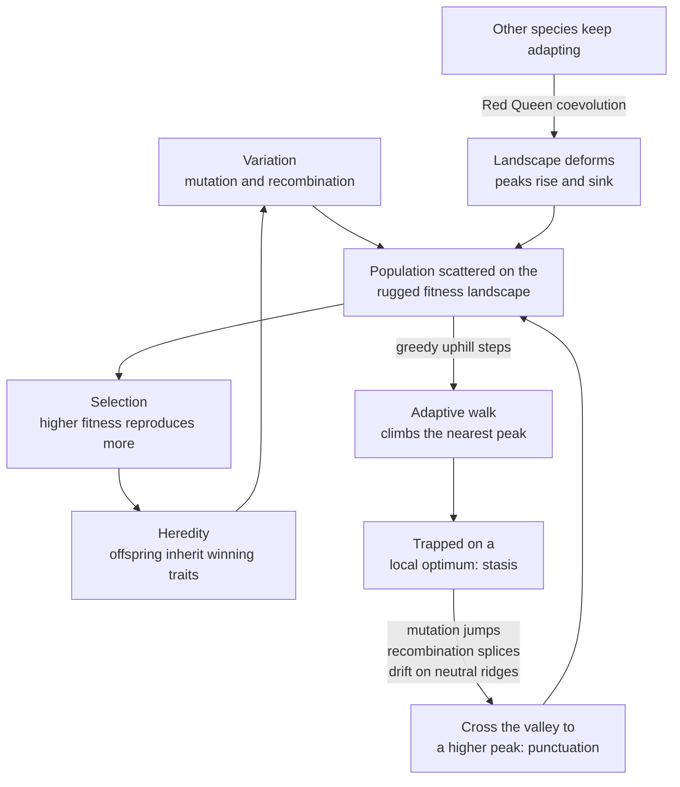

# 🏔️ Evolutionary Dynamics and Fitness Landscapes

> [!abstract] TL;DR
> Evolution is a **search algorithm**: **variation** proposes candidate designs, **selection** keeps the ones that reproduce best, and **heredity** passes winners forward — a blind, parallel hill-climb over a space of possible genomes. **Sewall Wright's fitness landscape** pictures that space as a terrain where every genotype has a height equal to its fitness, so adaptation becomes *climbing uphill*. The deep insight is that real landscapes are **rugged** — riddled with local peaks separated by valleys — because of **epistasis** (genes interacting), and **Kauffman's NK model** lets you dial that ruggedness with a single knob `K`. Ruggedness is what makes evolution hard: greedy hill-climbers get **stuck on local optima**, and escaping them requires the very things pure optimization lacks — **mutation** to jump, **recombination** to recombine, **drift** to wander neutral ridges, and a landscape that keeps **deforming** as everything else co-evolves.

---

## Intuition

**Analogy:** Imagine a vast, foggy **mountain range** where every point on the ground is one possible design for an organism — a specific genome — and the **altitude** at that point is how well that design survives and reproduces. High ground is good (a well-adapted creature), valleys are death. Now blindfold a hiker and give them one rule: *feel the slope under your feet and always step uphill.* That hiker is **natural selection** doing a local search. On a smooth single mountain, this works perfectly — every path leads to the summit. But real terrain is not one smooth cone; it is the **Himalayas in fog**: thousands of foothills, false summits, and deep ravines. A blindfolded uphill-only hiker will reliably climb *some* peak and then stop dead — because every direction from a foothill is downhill, even though a taller mountain looms across the valley they cannot see.

That trap is the whole story of evolutionary dynamics. A population is not one hiker but a **crowd of them scattered across the range**, each climbing, each occasionally taking a random misstep (**mutation**), sometimes swapping legs with another hiker (**recombination**), and drifting sideways along flat ridges (**neutral drift**). And here is the twist that makes biology unlike a textbook optimization problem: the mountains themselves are made of **other adapting creatures**, so as your population climbs, the terrain buckles and heaves beneath it — the peak you were climbing sinks as your prey evolves armor and your rival evolves speed. There is no fixed summit to reach; there is only the **Red Queen's race** to keep climbing as fast as the ground moves.

---

## How It Works

### Core Mechanics

**1. Evolution as an algorithm — variation, selection, heredity.** Strip evolution to its logic and three ingredients suffice. **Variation:** offspring differ from parents (mutation, recombination). **Selection:** some variants out-reproduce others in the current environment. **Heredity:** the winning variation is transmitted to the next generation. Iterate, and the population's *distribution* over designs shifts toward higher fitness. No foresight, no goal, no designer — just a **hill-climbing loop** running massively in parallel across every individual at once. This is why the same math describes bacteria, immune repertoires, and genetic algorithms.

**2. The fitness landscape (Sewall Wright, 1932).** Lay out **genotype space** — every possible sequence — as a high-dimensional grid, with neighboring genotypes one mutation apart. Assign each genotype a **fitness**. The resulting surface is the **adaptive landscape**: peaks are locally optimal genomes, valleys are unfit ones, and evolution is a **walk on this surface that tends uphill**. Wright's picture is a metaphor, not a literal 2-D map (genotype space has thousands of dimensions), but it captures the essential geometry: *where you can go next depends on where you are now, and selection biases every step upward.*

**3. Adaptive walks and hill-climbing.** An **adaptive walk** starts at some genotype and repeatedly moves to a fitter one-mutant neighbor until none exists — at which point it has reached a **local optimum** and freezes. On a **smooth (single-peak)** landscape every walk finds the global optimum; the problem is convex, like [[Gradient_Descent]] on a bowl. The trouble begins when the landscape is **rugged**.

**4. Ruggedness and epistasis.** Ruggedness comes from **epistasis** — when the fitness contribution of one gene *depends on the state of others*. If genes are independent, the landscape has a single peak (each gene independently optimized). If genes interact strongly, changing one gene helps in some backgrounds and hurts in others, carving the surface into **many peaks separated by fitness valleys**. Epistasis is the mathematical source of local optima, and local optima are the reason evolution and optimization are hard.

**5. Kauffman's NK model — a ruggedness knob.** Stuart Kauffman gave ruggedness a dial. A genome has `N` genes, each contributing to fitness, and each gene's contribution depends on `K` **other genes** (its epistatic partners). Total fitness is the average of the `N` per-gene contributions, each drawn from a random table indexed by that gene plus its `K` partners.
- `K = 0`: no epistasis — a single smooth peak, one global optimum, easy climb.
- `K = N - 1`: maximal epistasis — a fully random, maximally rugged landscape with an astronomical number of local optima, each shallow.
- **Intermediate `K`**: correlated ruggedness — the biologically interesting regime, tunable and realistic.
Turning `K` up trades a navigable landscape for a maze.

**6. The complexity catastrophe.** Kauffman's sting in the tail: as `K` grows with `N`, the **height of the typical local optimum sinks toward the mean fitness of the whole space**. In a maximally rugged landscape there are so many peaks, so close together, that the ones you can actually reach are barely better than random. More epistatic complexity paradoxically makes adaptation *worse*, because selection drowns in a sea of mediocre traps. This is the **complexity catastrophe** — an argument that real genomes must sit at *intermediate* `K`, rugged enough to be interesting but correlated enough to be climbable.

**7. Exploration vs exploitation.** Every search faces the same dilemma. **Exploitation** = climb the peak you're on (small steps, greedy). **Exploration** = jump to a new region that might hold a taller peak (big mutations, restarts). Pure exploitation traps you on the first local optimum; pure exploration is a random walk that never refines anything. Evolution's tricks — mutation rate, recombination, population size, drift — are all ways of **tuning this balance**.

**8. Recombination and why sex helps cross valleys.** A point mutation moves you one step; to reach a distant peak you'd have to walk *down* into a valley (through unfit intermediates), which selection forbids. **Recombination** (sex) sidesteps this: it takes the good "left half" of one parent's solution and the good "right half" of another and **splices them into a novel combination** in a single generation — teleporting the offspring to a genotype no gradual walk could reach without crossing a valley. When a landscape's peaks are built from reusable **building blocks**, recombination is a valley-crossing shortcut; when they're not, it just shreds good solutions. This is one leading explanation for the evolutionary maintenance of sex.

**9. Neutral networks and genetic drift.** Not every mutation changes fitness. Many are **neutral**, forming vast connected **neutral networks** — ridges of equal-fitness genotypes threading through the landscape. A population can **drift** along these ridges for free (random change, not selection-driven), and drift matters because a genotype that is a dead-end local optimum may sit one neutral step away from a genotype that opens onto a *new* uphill slope. Neutral drift lets evolution **explore laterally without paying a fitness cost**, quietly escaping traps that a strict hill-climber could never leave. (See genetic drift and bottlenecks in the Genetics vault.)

**10. The replicator equation.** Zoom out from individuals to strategy *frequencies*. The **replicator equation** states that a type's share of the population grows in proportion to *how much its fitness beats the population average*: `dx_i/dt = x_i * ( f_i - phi )`, where `phi` is mean fitness. Above-average types expand, below-average types shrink — selection as a differential equation. When fitness `f_i` depends on the frequencies of *other* types, you get **evolutionary game dynamics**: the landscape is defined by the population playing against itself. This is the formal bridge to [[Replicator_Dynamics]] and [[Evolutionary_Stable_Strategies]].

**11. Error catastrophe and the quasispecies (Eigen).** Manfred Eigen showed that selection cannot preserve information if mutation is too high. A population is really a **quasispecies** — a *cloud* of related mutants centered on a fittest "master" sequence, not a single genotype. There is an **error threshold**: below it the cloud stays concentrated on the peak; above it, mutation smears the population off the peak faster than selection can pull it back, and heredity dissolves — the **error catastrophe**. This sets a hard ceiling on genome length for a given mutation rate (why RNA viruses are short and error-prone) and inspires **lethal mutagenesis** as an antiviral strategy: push the virus *over* its error threshold.

**12. Coevolution and the Red Queen.** The most important departure from optimization: **the landscape is not fixed.** When your fitness depends on other species that are themselves evolving, adapting *deforms the terrain for everyone*. The peak you climb erodes as prey toughen and parasites adapt, so a species must keep evolving just to hold constant fitness — Van Valen's **Red Queen hypothesis** ("it takes all the running you can do to keep in the same place"). Coevolution turns a static optimization into an endless **arms race** on a heaving surface, and it is why "solved" and "optimal" rarely apply to living systems.

**13. Punctuated equilibrium in landscape terms.** Eldredge and Gould's fossil pattern — long **stasis** punctuated by rapid bursts of change — reads naturally on a rugged landscape. A population sitting on a **local peak** is stable (all neighbors are downhill), so it stays put for eons = stasis. A rare event — a large mutation, a recombination jackpot, a drift excursion across a neutral ridge, or an environmental shift that **reshapes the landscape** and drops a valley wall — lets it break free and rapidly climb a new peak = punctuation. Stasis and bursts are not two mechanisms; they are the two things a population *does* on a rugged surface.

### Flow / Architecture



---

## Key Concepts

### Secondary
- **Evolution is a search.** Try lots of small tweaks, keep what works, pass it on, repeat. That loop is all it takes.
- **Fitness landscape.** Picture every possible creature as a spot on a map, with taller ground meaning "survives and breeds better." Evolution walks uphill.
- **Local optimum.** A hilltop that is not the highest mountain. Once you're on it, every nearby step is downhill, so simple climbing gets *stuck*.
- **Mutation and sex.** Random tweaks (mutation) and mixing two parents (recombination) let a species jump to new ground it could not reach by tiny steps alone.
- **The Red Queen.** When your competitors and prey keep evolving, you have to keep evolving just to stay in the game — like running to stand still.

### Undergraduate
- **Variation, selection, heredity.** The three necessary and sufficient conditions for adaptation by natural selection; remove any one and evolution stops.
- **Wright's adaptive landscape.** Genotype (or allele-frequency) space mapped to mean fitness; peaks, valleys, and ridges. A metaphor for a very high-dimensional surface.
- **Epistasis creates ruggedness.** Independent genes give one smooth peak; interacting genes carve many peaks. Ruggedness is what makes optima *local*.
- **Adaptive walk.** Repeatedly move to a fitter one-mutant neighbor; halts at a local optimum. Contrast with continuous [[Gradient_Descent]].
- **Exploration vs exploitation.** Refining the current peak vs searching for a better one; the core trade-off of every heuristic search.
- **Recombination as valley-crossing.** Splicing building blocks reaches distant genotypes without walking through unfit intermediates.

### Graduate
- **Kauffman's NK model.** Fitness `F = average of N per-gene contributions`, each depending on `K` epistatic partners. `K` tunes ruggedness from smooth (`K=0`) to random (`K=N-1`); intermediate `K` gives correlated, biologically realistic landscapes.
- **Complexity catastrophe.** As `K -> N-1`, attainable local optima regress toward the mean fitness of the space, so unbounded epistatic complexity *degrades* adaptation — an argument for selection favoring intermediate `K`.
- **Quasispecies and the error threshold.** Eigen's model: selection acts on a mutant *cloud*, not a point; above a critical mutation rate `mu * L > ln s` the population delocalizes off the master sequence (**error catastrophe**), bounding genome length.
- **Replicator equation and evolutionary game theory.** `dx_i/dt = x_i (f_i - phi)`; frequency-dependent fitness yields dynamic, self-referential landscapes, linking to ESS, [[Replicator_Dynamics]], and [[Evolutionary_Stable_Strategies]].
- **Neutral theory and neutral networks.** Kimura's neutral evolution plus Schuster's genotype-phenotype maps: connected iso-fitness networks enable **drift-driven** exploration and constant-rate molecular clocks.
- **Coevolutionary dynamics and the Red Queen.** Van Valen's law and antagonistic coevolution produce non-stationary landscapes; "fitness" is only ever *relative to a moving field*, so equilibrium is atypical. Ties to [[Complex_Adaptive_Systems]] and [[Criticality_and_Phase_Transitions]].
- **Punctuated equilibrium.** Stasis on local peaks interrupted by rapid transitions after large mutations, drift excursions across neutral ridges, or landscape deformation.

---

## Python Demo

We build a **rugged 2-D fitness landscape** — a sum of Gaussian "hills" with one global peak and several tempting local peaks separated by valleys — and pit two search strategies against it. **Greedy hill-climbers** (small steps, accept only improvements = pure exploitation) reliably climb *the nearest* peak and freeze, so most get **trapped on local optima**. An **evolutionary population** (mutation + recombination + selection) explores broadly, and recombination lets offspring jump between basins, so it concentrates on the **global** peak. We visualize the landscape, the climbers' trapped endpoints, the evolving population, and the fitness convergence. Uses only `numpy` and `matplotlib`.

```python
# Rugged fitness landscape: greedy hill-climbers get trapped on local optima,
# while an evolutionary population (mutation + recombination) finds the global peak.
import numpy as np
import matplotlib.pyplot as plt

rng = np.random.default_rng(42)
LO, HI = 0.0, 10.0

# ---- A rugged landscape = sum of Gaussian hills (one global + several local) ----
#        cx,  cy,  height, width
peaks = np.array([
    [7.5, 7.5, 1.00, 0.9],   # <- global optimum
    [2.0, 2.0, 0.78, 1.1],   # a tempting local optimum
    [2.5, 7.5, 0.66, 0.8],
    [7.2, 2.5, 0.72, 1.0],
    [5.0, 5.0, 0.55, 0.7],
])
GLOBAL = peaks[0, :2]

def fitness(P):
    P = np.atleast_2d(np.asarray(P, dtype=float))
    x, y = P[:, 0], P[:, 1]
    f = np.zeros(len(P))
    for cx, cy, h, w in peaks:
        f += h * np.exp(-((x - cx) ** 2 + (y - cy) ** 2) / (2 * w ** 2))
    return f

# ---- Strategy 1: greedy hill-climber (exploitation only) ----
def hill_climb(start, steps=500, sigma=0.15):
    x = start.copy(); fx = fitness(x)[0]; traj = [x.copy()]
    for _ in range(steps):
        cand = np.clip(x + rng.normal(0, sigma, 2), LO, HI)
        fc = fitness(cand)[0]
        if fc > fx:                 # accept ONLY improvements -> greedy, no escape
            x, fx = cand, fc
        traj.append(x.copy())
    return x, fx, np.array(traj)

# ---- Strategy 2: evolutionary search (mutation + recombination + selection) ----
def evolve(pop_size=80, gens=60, sigma=0.55, elite_frac=0.3):
    pop = rng.uniform(LO, HI, size=(pop_size, 2))
    n_elite = int(pop_size * elite_frac)
    best_hist, mean_hist, snaps = [], [], {}
    for g in range(gens):
        fit = fitness(pop)
        order = np.argsort(fit)[::-1]
        pop, fit = pop[order], fit[order]
        best_hist.append(fit[0]); mean_hist.append(fit.mean())
        if g in (0, gens - 1):
            snaps[g] = pop.copy()
        parents = pop[:n_elite]                     # truncation selection
        children = [pop[0]]                         # elitism: keep the champion
        while len(children) < pop_size:
            a = parents[rng.integers(n_elite)]
            b = parents[rng.integers(n_elite)]
            gene_from_a = rng.random(2) < 0.5        # uniform crossover per coordinate
            child = np.where(gene_from_a, a, b)      # RECOMBINATION can leap basins
            child = child + rng.normal(0, sigma, 2)  # MUTATION explores locally
            children.append(np.clip(child, LO, HI))
        pop = np.array(children)
    return pop, np.array(best_hist), np.array(mean_hist), snaps

# ---- Run many independent hill-climbers from random starts ----
n_climbers = 60
climb_ends, climb_fits, climb_trajs = [], [], []
for _ in range(n_climbers):
    xe, fe, tr = hill_climb(rng.uniform(LO, HI, 2))
    climb_ends.append(xe); climb_fits.append(fe); climb_trajs.append(tr)
climb_ends = np.array(climb_ends); climb_fits = np.array(climb_fits)
reached = np.linalg.norm(climb_ends - GLOBAL, axis=1) < 0.7
print("greedy hill-climbers reaching GLOBAL optimum: {}/{}".format(reached.sum(), n_climbers))

# ---- Run the evolutionary population ----
final_pop, best_hist, mean_hist, snaps = evolve()
print("evolutionary best fitness: {:.3f}  (global optimum ~ {:.3f})"
      .format(best_hist[-1], fitness(GLOBAL)[0]))

# ---- Visualize ----
gx = np.linspace(LO, HI, 300); gy = np.linspace(LO, HI, 300)
GXg, GYg = np.meshgrid(gx, gy)
GZ = fitness(np.column_stack([GXg.ravel(), GYg.ravel()])).reshape(GXg.shape)

fig, ax = plt.subplots(1, 3, figsize=(18, 5.4))

# Panel 1: hill-climbers trapped on local peaks
ax[0].contourf(GXg, GYg, GZ, levels=25, cmap="terrain")
for tr in climb_trajs[:12]:
    ax[0].plot(tr[:, 0], tr[:, 1], lw=0.8, alpha=0.6, color="k")
ax[0].scatter(climb_ends[~reached, 0], climb_ends[~reached, 1],
              c="red", s=35, ec="k", label="trapped (local)")
ax[0].scatter(climb_ends[reached, 0], climb_ends[reached, 1],
              c="lime", s=45, ec="k", label="found global")
ax[0].scatter(*GLOBAL, marker="*", s=320, c="gold", ec="k", label="global peak")
ax[0].set_title("Greedy hill-climbers: most trap on LOCAL optima")
ax[0].legend(loc="upper left", fontsize=8)

# Panel 2: evolutionary population converges on the global peak
ax[1].contourf(GXg, GYg, GZ, levels=25, cmap="terrain")
ax[1].scatter(snaps[0][:, 0], snaps[0][:, 1], c="white", s=18, alpha=0.5,
              label="gen 0 (scattered)")
ax[1].scatter(final_pop[:, 0], final_pop[:, 1], c="magenta", s=28, ec="k",
              label="final gen (converged)")
ax[1].scatter(*GLOBAL, marker="*", s=320, c="gold", ec="k", label="global peak")
ax[1].set_title("Evolution: mutation + recombination find the GLOBAL peak")
ax[1].legend(loc="upper left", fontsize=8)

# Panel 3: convergence + climber outcome distribution
ax[2].plot(best_hist, lw=2, label="EA best fitness")
ax[2].plot(mean_hist, lw=2, ls="--", label="EA mean fitness")
ax[2].axhline(climb_fits.mean(), color="red", ls=":", lw=2,
              label="hill-climber mean (trapped)")
ax[2].axhline(fitness(GLOBAL)[0], color="gold", lw=2, label="global optimum")
ax[2].set_xlabel("generation"); ax[2].set_ylabel("fitness")
ax[2].set_title("Convergence: exploration beats greedy exploitation")
ax[2].legend(loc="lower right", fontsize=8)

plt.tight_layout(); plt.show()
```

Running it, the left panel shows climber paths fanning out to whichever peak was nearest — the red dots pile up on the local hills, and only a lucky handful (green) started close enough to reach the gold star. The middle panel shows the evolutionary population starting as scattered white dots and collapsing onto the global peak. The right panel makes the punchline quantitative: the evolutionary best (and even its *mean*) climb past the plateau where greedy hill-climbing stalls. **Ruggedness is the enemy of greed; variation is the cure.**

---

## Real-World Applications

> **Example — directed evolution in the lab (2018 Nobel Prize, Frances Arnold).** To engineer an enzyme with a new function, chemists cannot compute the optimal protein sequence — the fitness landscape over sequence space is astronomically large and rugged. So they *run evolution*: mutate a gene, express thousands of variants, **screen for the ones that work best**, breed those, and repeat. Each round is one adaptive step uphill; recombination (DNA shuffling) splices good fragments to cross valleys. Directed evolution is literally hill-climbing on a protein fitness landscape, and it has produced industrial enzymes and drugs that rational design could not.

- **Evolutionary computation / genetic algorithms.** GAs, evolution strategies, and genetic programming are engineering distillations of this note: a population of candidate solutions with mutation, crossover, and fitness-proportional selection, deployed for antenna design (NASA's evolved ST5 antenna), scheduling, neural architecture search, and circuit design — precisely where the objective landscape is rugged and non-differentiable.
- **Antibiotic and antiviral resistance.** Pathogen populations climb fitness peaks defined by our drugs. Combination therapy works by making the *joint* resistance peak require crossing a deep valley (multiple simultaneous mutations). **Lethal mutagenesis** (e.g., molnupiravir against RNA viruses) attacks the error threshold, pushing the quasispecies over the error catastrophe.
- **Cancer as somatic evolution.** Tumors are populations of cells adaptively walking a fitness landscape under selection from the immune system and therapy; drug resistance is evolution finding a new peak, and treatment sequencing tries to steer the landscape into evolutionary dead-ends.
- **Immune affinity maturation.** B-cells hypermutate and are selected for binding strength — a within-body adaptive walk on an antigen-binding landscape, generating high-affinity antibodies in days.
- **Optimization heuristics.** Simulated annealing, evolutionary strategies, and restart-based search all exist because gradient methods trap on local optima of rugged objectives — the same problem selection faces, addressed with the same exploration tricks (see [[Gradient_Descent]] for the smooth, convex contrast).
- **Cultural and technological evolution.** Firms, products, and ideas adapt on rugged "performance landscapes"; management theory (Levinthal, Rivkin) uses NK models to study why organizations get stuck on local strategic optima and when radical reinvention pays.

---

## Common Pitfalls

- **Treating the landscape as fixed.** The single biggest error. In coevolving systems the terrain deforms as everyone adapts (**Red Queen**), so "the optimal genotype" is a moving target. Optimizing against a frozen snapshot yields strategies that are stale on arrival.
- **Assuming evolution finds the global optimum.** It does not. Selection is a *local* hill-climber; it finds a **reachable local peak**, often a poor one (the panda's thumb, the vertebrate blind spot). "Adapted" means "locally good," not "best possible."
- **Reifying the 2-D picture.** Wright's landscape is a metaphor for a space of thousands of dimensions, where "valleys" in one projection are ridges in another and high-dimensional spaces have far more escape routes than a 2-D drawing suggests. Do not over-interpret the cartoon.
- **Ignoring the exploration/exploitation trade-off.** Too little mutation and the population freezes on the first local peak; too much and it dissolves off every peak (**error catastrophe**). Tuning mutation rate, population size, and selection pressure *is* the design problem in both biology and genetic algorithms.
- **Believing recombination is always good.** Crossover helps only when peaks are built from **modular, separable building blocks**. On landscapes with strong, non-decomposable epistasis, recombination mostly shreds good solutions — this is the **deceptive problem** in GA theory.
- **Conflating fitness with a fixed number.** Fitness is **frequency- and environment-dependent**. A genotype that is a peak when rare may be a valley when common (negative frequency dependence). This is why the replicator equation, not a static height field, is the honest model.
- **Cranking up complexity expecting better solutions.** Kauffman's **complexity catastrophe**: past a point, more interacting parts (`K`) makes the *attainable* optima *worse*, not better. Ruggedness has a sweet spot.
- **Reading punctuated equilibrium as anti-Darwinian.** Stasis-then-burst is *expected* on a rugged landscape; it is gradualism's consequence, not its refutation.

---

## Related Concepts

- [[Complex_Adaptive_Systems]] — fitness landscapes are the search substrate of every CAS; ruggedness, coevolution, and the edge of chaos all recur there, and Kauffman links the two directly.
- [[Natural_Selection_and_Adaptation]] — the biological mechanism (variation, selection, heredity) that *is* the hill-climbing process this note formalizes geometrically.
- [[Speciation_and_Macroevolution]] — crossing a fitness valley to a new peak is one route to a new species; punctuated equilibrium sits at this boundary.
- [[Replicator_Dynamics]] — the differential-equation form of selection on strategy frequencies, and the engine of frequency-dependent (deforming) landscapes.
- [[Evolutionary_Stable_Strategies]] — the game-theoretic equilibrium concept for coevolving strategies; a peak on a landscape the population itself defines.
- [[Gradient_Descent]] — the smooth-landscape optimizer; comparing it to adaptive walks shows exactly what ruggedness and local optima cost.
- [[Criticality_and_Phase_Transitions]] — the error threshold and the complexity catastrophe are phase transitions in evolutionary dynamics.
- [[Chaos_Theory_and_Sensitive_Dependence]] — coevolving, deforming landscapes produce non-equilibrium, history-dependent dynamics akin to the sensitivity studied there.
- [[Emergence_and_Self_Organization]] — adaptation is how complex, functional order self-organizes without a designer.
- [[Nonlinearity_and_Feedback]] — epistasis is nonlinear interaction among genes; coevolution is feedback between adapting populations.

---

## Review Questions

1. **(Conceptual)** Explain, using the fitness-landscape metaphor, why natural selection cannot in general reach the *globally* fittest genotype, and give two distinct mechanisms (other than a larger mutation) by which a population might nonetheless escape a local optimum. What does each mechanism cost?
2. **(Scenario)** You are tuning a genetic algorithm for a scheduling problem and it keeps converging to mediocre solutions. Diagnose the likely landscape situation, then decide how you would adjust mutation rate, population size, and the use of recombination — and explain how Kauffman's `K` (degree of epistasis in the problem) should inform whether crossover helps or hurts.
3. **(Trade-off)** Kauffman's complexity catastrophe says that increasing epistatic complexity `K` eventually *lowers* the fitness of reachable optima. Reconcile this with the intuition that "more complex organisms are more fit," and discuss why selection might drive genomes toward *intermediate* ruggedness rather than either extreme. How does the Red Queen change the answer?

---

## Sources

- Sewall Wright, "The Roles of Mutation, Inbreeding, Crossbreeding, and Selection in Evolution," *Proceedings of the Sixth International Congress of Genetics* (1932), 356–366.
- Stuart A. Kauffman, *The Origins of Order: Self-Organization and Selection in Evolution* (Oxford University Press, 1993).
- Manfred Eigen and Peter Schuster, *The Hypercycle: A Principle of Natural Self-Organization* (Springer, 1979); Eigen, "Selforganization of Matter and the Evolution of Biological Macromolecules," *Naturwissenschaften* 58 (1971).
- Leigh Van Valen, "A New Evolutionary Law," *Evolutionary Theory* 1 (1973), 1–30 (the Red Queen hypothesis).
- Sergey Gavrilets, *Fitness Landscapes and the Origin of Species* (Princeton University Press, 2004).
- Melanie Mitchell, *An Introduction to Genetic Algorithms* (MIT Press, 1996).

---

#complexity #evolution #fitness-landscape #nk-model #adaptation
