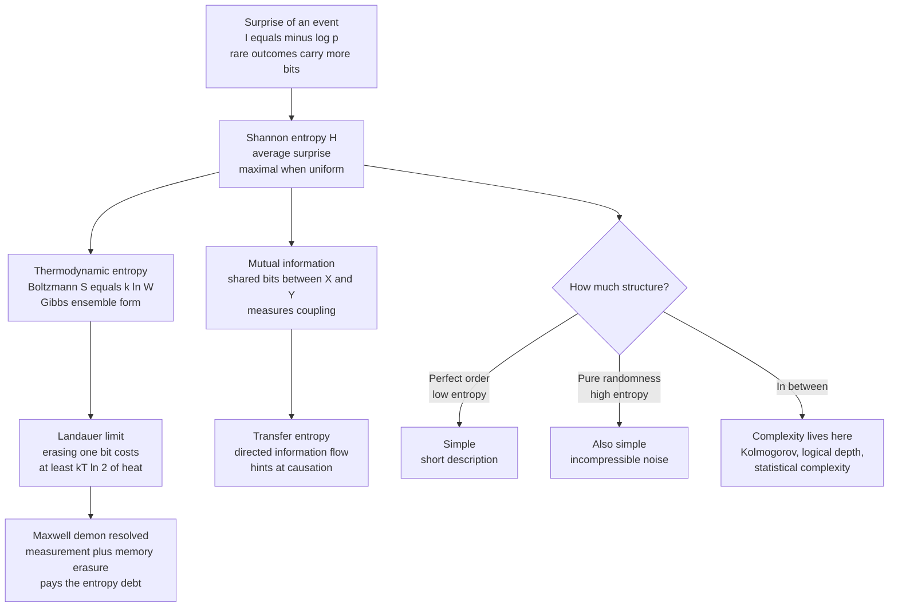

# 🎲 Information and Entropy in Systems

> [!abstract] TL;DR
> Shannon entropy measures how surprised you are, on average, by a system's next output — it is maximized when every outcome is equally likely and zero when the outcome is certain. The same mathematics reappears as thermodynamic entropy, ties the erasure of a bit to a minimum energy cost (Landauer), quantifies coupling and directed influence between parts (mutual information and transfer entropy), and exposes a crucial subtlety for complexity science: perfect order and pure randomness are both *simple*, so genuine complexity must live somewhere in between — it is emphatically **not** the same thing as entropy.

---

## Intuition

**Analogy:** Imagine a friend texts you the outcome of an event and you pay one cent per letter. If they are reporting a fair coin flip, "H" or "T" costs you one bit of genuine news every time — you could not have guessed it. If they are reporting the result of a coin that always lands heads, their message tells you nothing you did not already know, and a clever code could shrink it to almost nothing. **Entropy is the average length of the shortest honest message needed to tell you what happened.** A predictable system is cheap to describe; a maximally uncertain one is expensive.

Now push the analogy further. A page of the letter "A" repeated a million times is cheap — you say "A times a million" and you are done. A page of random static is also, in a strange sense, cheap to *characterize* — you just say "random, uniform." The genuinely expensive thing to describe is a page of English prose: neither repetitive nor random, but richly structured. That gap between "boring order," "boring noise," and "interesting structure in between" is the whole reason information theory and complexity science are joined at the hip.

---

## How It Works

### Core Mechanics

1. **Surprise is negative log-probability.** The information content of a single outcome `x` is `I(x) = minus log2 p(x)`, measured in **bits**. A one-in-a-million event carries about 20 bits of surprise; a certain event carries zero. Rare means informative.

2. **Entropy is average surprise.** `H(X) = minus sum p(x) log2 p(x)`. Over `K` outcomes it is maximized at `H = log2 K` exactly when the distribution is uniform, and it is zero when one outcome has probability 1. Entropy is therefore a measure of a system's **uncertainty**, its **unpredictability**, and equivalently the **incompressibility** of its output stream.

3. **The thermodynamic bridge.** Boltzmann's `S = k_B ln W` counts the microstates `W` compatible with a macrostate; Gibbs' `S = minus k_B sum p_i ln p_i` is the ensemble form. Strip the constant `k_B` and switch logarithm base and this *is* Shannon entropy. Physical entropy is missing information about which microstate the system actually occupies. This is why the second law — entropy tends to increase — reads in information terms as: **isolated systems lose information about their initial microstate.**

4. **Landauer's principle: information is physical.** Erasing one bit of information in any physical medium dissipates at least `k_B T ln 2` of heat (about 3 zeptojoules at room temperature). Computation itself need not cost energy; only **logically irreversible** steps — those that destroy information, like erasure — must pay. This turns the abstract notion of a "bit" into a thermodynamic quantity with a hard energy floor.

5. **Maxwell's demon, resolved.** A demon that sorts fast and slow molecules seems to lower entropy for free, violating the second law. The resolution (Szilard, then Bennett) is that the demon must **store measurements**, and to keep operating in a cycle it must eventually **erase its memory** — and by Landauer that erasure dumps exactly enough entropy to the environment to balance the books. The demon buys local order by paying an information-erasure tax elsewhere.

6. **Mutual information measures coupling.** `I(X;Y) = H(X) minus H(X given Y)` is the number of bits that knowing `Y` shaves off your uncertainty about `X`. It is symmetric, zero if and only if the variables are independent, and it captures **nonlinear** dependence that correlation misses. It is the natural currency for "how much do these two parts of the system share?"

7. **Transfer entropy adds direction.** Mutual information is symmetric, so it cannot tell a driver from a follower. **Transfer entropy** `T(Y to X)` asks: how much does knowing `Y`'s past reduce uncertainty about `X`'s future *beyond* what `X`'s own past already tells you? It is directional and model-free — a leading tool for inferring information flow and putative causation in brains, markets, and ecosystems (though it detects predictive influence, not proof of mechanism).

8. **Complexity is not entropy.** A crystal (perfect order) has near-zero entropy and is simple. An ideal gas (maximal disorder) has maximal entropy and is *also* simple to characterize. Measures such as **Kolmogorov complexity**, **logical depth**, **effective complexity**, and **statistical complexity** are all attempts to formalize the intuition that interesting structure peaks between these two extremes.

### Flow / Architecture



---

## Key Concepts

### Secondary (intuitive)
- **Bit:** the amount of information in one fair yes-or-no answer; the outcome of a fair coin flip.
- **Surprise:** how unexpected an outcome is — rare events are surprising and carry more information.
- **Entropy:** the average surprise of a source; high when anything could happen, zero when the result is a foregone conclusion.
- **Order vs disorder:** a tidy, predictable system has low entropy; a chaotic, anything-goes system has high entropy.
- **Information costs energy:** wiping information is not free — every erased bit ultimately warms the room a tiny bit.

### Undergraduate
- **Shannon entropy:** `H(X) = minus sum p(x) log2 p(x)`, maximized at `log2 K` by the uniform distribution (a special case of Jaynes' maximum-entropy principle: absent constraints, the least-committal distribution is uniform).
- **Joint, conditional, and mutual information:** `H(X,Y)`, `H(X given Y)`, and `I(X;Y) = H(X) + H(Y) minus H(X,Y)`; the chain rule and the fact that conditioning never increases entropy.
- **Relative entropy (KL divergence):** `D(p || q) = sum p log2 (p over q)`, the extra bits wasted by coding source `p` with a code built for `q`; mutual information is the KL divergence between the joint and the product of marginals. See [[Information_Theory]].
- **Boltzmann and Gibbs entropy:** `S = k_B ln W` and `S = minus k_B sum p_i ln p_i`; physical entropy equals missing information about the microstate, times `k_B ln 2` per bit.
- **Channel capacity:** the maximum reliable bit-rate through a noisy channel, `C = max I(X;Y)`; the ceiling on how fast any part of a system can inform another.
- **Differential entropy:** the continuous analogue `minus integral p ln p`; useful but coordinate-dependent and able to go negative, unlike discrete entropy.

### Graduate
- **Landauer's principle and reversible computing:** logically irreversible operations dissipate at least `k_B T ln 2` per erased bit; reversible (Bennett/Fredkin/Toffoli) computation can in principle approach zero dissipation. Grounds the thermodynamics of computation.
- **Maxwell's demon and the Szilard engine:** the single-molecule Szilard engine extracts `k_B T ln 2` of work per cycle but requires one bit of measurement; Bennett closed the loophole by charging the demon for memory erasure, not measurement.
- **Transfer entropy and directed information:** `T(Y to X) = sum p(x_{t+1}, x_t^{(k)}, y_t^{(l)}) log [ p(x_{t+1} given x_t^{(k)}, y_t^{(l)}) over p(x_{t+1} given x_t^{(k)}) ]`; a non-parametric, asymmetric estimate of information flow, related to Granger causality (equivalent for Gaussian variables).
- **Kolmogorov complexity `K(x)`:** the length of the shortest program that outputs string `x`; the algorithmic, description-based notion of information. It is **uncomputable** (no algorithm computes `K` for all inputs — a corollary of the halting problem; see [[Logic_in_AI_and_Computation]]), and for long random strings it converges to Shannon entropy per symbol.
- **The "complexity between order and randomness" family:**
  - **Logical depth** (Bennett): the *run time* of the shortest program — a crystal and random noise are both shallow; a structured object is deep because its short description takes long to unfold.
  - **Effective complexity** (Gell-Mann & Lloyd): the Kolmogorov complexity of the *regularities* only, discarding the incompressible random part.
  - **Statistical complexity** (Crutchfield & Young): the information stored in the minimal predictive model (the `epsilon`-machine) — zero for both a constant and a coin flip, large for structured processes.
- **Predictive information / excess entropy:** the mutual information between a process's past and future, `E = I(past ; future)`; how much of what you have seen actually helps predict what comes next — a scaling-based signature of structure and long-range order.
- **Entropy and the arrow of time:** microscopic dynamics are time-reversible, yet coarse-grained entropy grows; the asymmetry is imported from a low-entropy initial condition, and information-theoretically the past is the direction we retain records of.
- **Information in self-organization:** near a critical point (see [[Criticality_and_Phase_Transitions]]) mutual information, susceptibility, and predictive information peak — a candidate explanation for why adaptive systems tune themselves toward the "edge of chaos."

---

## Python Demo

```python
# Information and entropy in systems, three vignettes in one figure:
#   (1) Shannon entropy is maximized by a uniform distribution.
#   (2) Mutual information rises as two variables become more coupled.
#   (3) The logistic map's output entropy climbs through the
#       period-doubling route as the system slides into chaos.
# numpy + matplotlib only.

import numpy as np
import matplotlib.pyplot as plt


def shannon_entropy_bits(p):
    """Shannon entropy in bits of a discrete distribution (1D array)."""
    p = np.asarray(p, dtype=float)
    p = p[p > 0]                          # convention: 0 * log 0 = 0
    return -np.sum(p * np.log2(p))


# -- (1) Entropy vs peakedness -------------------------------------------------
K = 8                                     # number of outcomes
betas = np.linspace(0.0, 4.0, 200)        # 0 = uniform, large = peaked
base_logits = np.linspace(-1.0, 1.0, K)   # arbitrary shape to sharpen
ent_vs_beta = []
for b in betas:
    logits = b * base_logits
    p = np.exp(logits - logits.max())
    p /= p.sum()                          # softmax: beta controls sharpness
    ent_vs_beta.append(shannon_entropy_bits(p))
ent_vs_beta = np.array(ent_vs_beta)
max_entropy = np.log2(K)                  # reached ONLY by the uniform case

# -- (2) Mutual information vs coupling ----------------------------------------
def mutual_information_bits(joint):
    """MI in bits from a (normalized) joint probability table P[x, y]."""
    joint = joint / joint.sum()
    px = joint.sum(axis=1, keepdims=True)
    py = joint.sum(axis=0, keepdims=True)
    indep = px @ py                       # outer product P(x)P(y)
    mask = joint > 0
    return np.sum(joint[mask] * np.log2(joint[mask] / indep[mask]))

M = 8                                     # alphabet size for X and Y
couplings = np.linspace(0.0, 1.0, 100)
mi_vs_c = []
for c in couplings:
    # with prob c, Y copies X; otherwise X and Y are independent uniform
    joint = np.full((M, M), (1.0 - c) / (M * M))
    joint += np.eye(M) * (c / M)
    mi_vs_c.append(mutual_information_bits(joint))
mi_vs_c = np.array(mi_vs_c)
hx = np.log2(M)                           # MI saturates at H(X) when Y = X

# -- (3) Logistic map entropy through the period-doubling route ----------------
def logistic_entropy(r, n_bins=40, n_iter=6000, n_burn=2000):
    x = 0.4
    for _ in range(n_burn):               # discard transient
        x = r * x * (1.0 - x)
    hist = np.zeros(n_bins)
    for _ in range(n_iter):
        x = r * x * (1.0 - x)
        idx = min(int(x * n_bins), n_bins - 1)
        hist[idx] += 1
    hist /= hist.sum()
    return shannon_entropy_bits(hist)

r_values = np.linspace(2.8, 4.0, 500)
map_entropy = np.array([logistic_entropy(r) for r in r_values])

# -- Visualize -----------------------------------------------------------------
fig, ax = plt.subplots(1, 3, figsize=(15, 4.2))

ax[0].plot(betas, ent_vs_beta, color="steelblue")
ax[0].axhline(max_entropy, ls="--", color="crimson",
              label=f"uniform max = log2 K = {max_entropy:.2f} bits")
ax[0].set_xlabel("sharpness beta   [0 = uniform]")
ax[0].set_ylabel("Shannon entropy H   [bits]")
ax[0].set_title("Entropy is maximized by uniformity")
ax[0].legend()

ax[1].plot(couplings, mi_vs_c, color="seagreen")
ax[1].axhline(hx, ls="--", color="crimson", label=f"H(X) = {hx:.2f} bits")
ax[1].set_xlabel("coupling c   [0 = independent, 1 = Y equals X]")
ax[1].set_ylabel("mutual information I(X;Y)   [bits]")
ax[1].set_title("Coupling shows up as mutual information")
ax[1].legend()

ax[2].plot(r_values, map_entropy, color="darkorange", lw=0.9)
ax[2].axvline(3.5699, ls=":", color="gray", label="onset of chaos ~ 3.57")
ax[2].set_xlabel("logistic parameter r")
ax[2].set_ylabel("entropy of x-histogram   [bits]")
ax[2].set_title("Order to chaos: entropy climbs")
ax[2].legend()

plt.tight_layout()
plt.show()

# -- Console summary -----------------------------------------------------------
print(f"Uniform 8-way entropy:            "
      f"{shannon_entropy_bits(np.full(8, 1/8)):.4f} bits  (= log2 8 = 3)")
print(f"Peaked [0.9, then 0.1/7 x7]:       "
      f"{shannon_entropy_bits(np.r_[0.9, np.full(7, 0.1/7)]):.4f} bits")
print(f"MI at c = 0 (independent):         {mi_vs_c[0]:.4f} bits")
print(f"MI at c = 1 (Y = X):               {mi_vs_c[-1]:.4f} bits  (= H(X) = 3)")
print(f"Logistic entropy at r = 3.2 (per-2): {logistic_entropy(3.2):.3f} bits")
print(f"Logistic entropy at r = 3.9 (chaos): {logistic_entropy(3.9):.3f} bits")
```

The first panel confirms the maximum-entropy principle: entropy sits at `log2 8 = 3` bits when the distribution is flat and falls monotonically as probability concentrates. The second shows mutual information climbing from 0 bits (independent) to `H(X) = 3` bits (`Y` fully determined by `X`) as coupling increases — the information-theoretic fingerprint of interaction. The third traces the logistic map's output entropy: near zero in the periodic regime, jumping upward through the period-doubling cascade and into the chaotic band past `r ~ 3.57`, with sharp dips at the periodic windows — a concrete picture of dynamical entropy production rising as a deterministic system becomes unpredictable (see [[Chaos_Theory_and_Sensitive_Dependence]]).

---

## Real-World Applications

> **Example (neuroscience):** Transfer entropy and mutual information are workhorses for mapping **effective connectivity** in the brain — inferring, from EEG, MEG, or spike trains, which regions are driving which. Because transfer entropy is directional and model-free, it can flag information flow that linear correlation misses, and the "brain near criticality" hypothesis predicts that this shared information peaks when cortical dynamics sit at the edge between order and chaos.

- **Data compression and communication:** Shannon entropy sets the theoretical floor on lossless compression (Huffman, arithmetic, and LZ coders chase it) and channel capacity sets the ceiling on error-free transmission — the founding results behind every modem, disk, and deep-space link.
- **Energy limits of computing:** Landauer's principle is now experimentally verified (single-particle and colloidal experiments have measured the `k_B T ln 2` erasure cost), and it frames the long-term efficiency ceiling of digital hardware and the interest in reversible and adiabatic logic.
- **Machine learning:** the **information bottleneck** frames representation learning as trading off `I(input ; representation)` against `I(representation ; label)`; mutual-information objectives (InfoNCE, InfoMax) drive self-supervised learning. See [[Information_Theory]].
- **Ecology and climate causality:** transfer entropy and related measures infer directed influence in food webs and between climate drivers (for example CO2 forcing and temperature) from time series alone, complementing mechanistic models.
- **Econophysics:** transfer entropy between asset returns quantifies which markets lead others, and information flow spikes during crises — a lens on contagion in financial networks (see [[Network_Dynamics_and_Contagion]]).
- **Cell biology:** signaling pathways are analyzed as noisy channels with a measurable capacity (often surprisingly low, near 1 bit), quantifying how reliably a cell can read its environment.

---

## Common Pitfalls

- **Equating entropy with complexity or disorder.** This is the central error. Maximal entropy (random noise) is *simple*, not complex. Complexity measures are explicitly designed to be low at both the ordered and the random extremes; conflating "high entropy" with "highly complex" gets the science exactly backwards.
- **Reading mutual information as causation.** High `I(X;Y)` only says the variables share information — it is symmetric and could arise from a common cause. Even transfer entropy, though directional, detects **predictive** influence, not mechanism; a hidden common driver can fake it.
- **Undersampling bias in entropy estimation.** With finite data, naive plug-in estimators *underestimate* entropy and *overestimate* mutual information, sometimes wildly in high dimensions. Use bias corrections (Miller-Madow, NSB, or k-nearest-neighbour estimators) and never trust an MI estimate without a shuffled-data null.
- **Mixing up bits and nats.** Base-2 logs give bits, natural logs give nats (`1 nat approximately 1.44 bits`). Physical entropy uses `k_B` and natural logs. Forgetting the base silently corrupts every downstream number.
- **Treating Kolmogorov complexity as computable.** `K(x)` is a beautiful definition but **uncomputable** — you can upper-bound it (any compressor gives a bound) but never compute it exactly. Practical work uses compression length or minimum description length as proxies.
- **The Maxwell's-demon free-lunch fallacy.** Believing the demon defeats the second law. It does not: the entropy accounting only balances once you charge for the eventual *erasure* of the demon's memory. Information is physical, and forgetting has a price.
- **Abusing differential entropy.** Continuous (differential) entropy is not coordinate-invariant and can be negative, so comparing it across different variables or units is meaningless without care. Mutual information, being a difference of entropies, is invariant and safer.

---

## Related Concepts

- [[Information_Theory]] — the AI/ML foundations note on entropy, cross-entropy, KL divergence, and mutual information; the formal toolkit this note applies to whole systems.
- [[Entropy_and_Second_Law]] — the physics of entropy: Clausius, Boltzmann's `S = k_B ln W`, the arrow of time, and the explicit Landauer link back to information.
- [[Classical_Statistical_Mechanics]] — ensembles and partition functions that ground the Gibbs entropy and the microstate-counting picture.
- [[Criticality_and_Phase_Transitions]] — near critical points mutual information, susceptibility, and predictive information peak; the "edge of chaos" argument for why systems self-tune toward maximal informativeness.
- [[Chaos_Theory_and_Sensitive_Dependence]] — the logistic map and Kolmogorov-Sinai entropy production; positive Lyapunov exponents are the dynamical source of the rising entropy in the demo.
- [[Emergence_and_Self_Organization]] — how local information processing yields global order; complexity as structure that is neither fully ordered nor random.
- [[Feedback_Loops_and_Causality]] — the causal-loop view that transfer entropy tries to quantify from data.
- [[Network_Science_Fundamentals]] — information flow, and entropy-based centrality and community measures, on graphs.
- [[Network_Dynamics_and_Contagion]] — spreading processes whose directional information flow transfer entropy can trace.
- [[Logic_in_AI_and_Computation]] — the computability and complexity-class results (including the halting problem) behind the uncomputability of Kolmogorov complexity.

---

## Review Questions

1. **(Secondary)** A weather station in a desert reports "sunny" almost every day; one in a stormy coastal town swings unpredictably between sun, rain, and fog. Which station's daily report carries more information per message, and why does a perfectly predictable forecast carry essentially zero bits?
2. **(Undergraduate)** Show that among all distributions over `K` outcomes, the uniform distribution maximizes Shannon entropy, and state the value of that maximum. Then explain in one or two sentences why this makes entropy a poor stand-in for "complexity," using a crystal and a gas as your two examples.
3. **(Graduate)** A colleague claims Maxwell's demon lets them build a machine that cools a gas without doing work, "because measuring a molecule is free." Walk through the Szilard-engine and Landauer-erasure argument to show precisely where the entropy the demon appears to remove is actually paid back, and identify the single logically irreversible step that saves the second law.

---

## Sources

- Shannon, C. E. (1948). "A Mathematical Theory of Communication." *Bell System Technical Journal* 27, 379-423 and 623-656.
- Cover, T. M., & Thomas, J. A. (2006). *Elements of Information Theory* (2nd ed.). Wiley-Interscience.
- Landauer, R. (1961). "Irreversibility and Heat Generation in the Computing Process." *IBM Journal of Research and Development* 5, 183-191. And Bennett, C. H. (1982). "The Thermodynamics of Computation — A Review." *International Journal of Theoretical Physics* 21, 905-940.
- Schreiber, T. (2000). "Measuring Information Transfer." *Physical Review Letters* 85, 461-464.
- Crutchfield, J. P., & Young, K. (1989). "Inferring Statistical Complexity." *Physical Review Letters* 63, 105-108. And Gell-Mann, M., & Lloyd, S. (1996). "Information Measures, Effective Complexity, and Total Information." *Complexity* 2(1), 44-52.

---

#complexity #information-theory #entropy #shannon #complexity-measures
