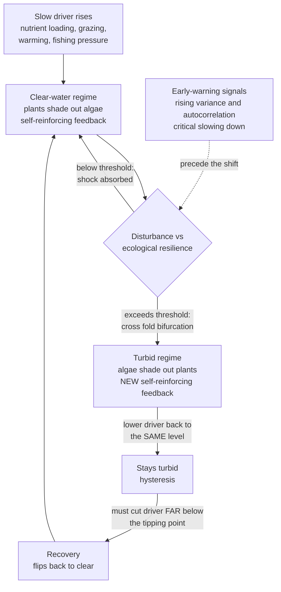

# 🌿 Ecological Resilience and Ecosystems

> [!abstract] TL;DR
> An ecosystem is a **complex adaptive system**: locally interacting species, nutrients, and disturbances self-organize into a coherent, self-reinforcing regime with no controller. **Ecological resilience** (Holling, 1973) is the *magnitude of disturbance a system can absorb before it flips into a qualitatively different state* — a different concept from **engineering resilience**, which measures only *how fast* a system returns to a single assumed equilibrium. Because ecosystems often have **alternative stable states**, a slow driver (nutrient loading, fishing pressure, warming) can push a system past a **fold bifurcation** into a new regime — a **regime shift** — that resists reversal because of **hysteresis**: you must lower the driver far below the tipping point to get back. Scheffer showed this in **shallow lakes** (clear ↔ turbid), **coral reefs** (coral ↔ macroalgae), **rangelands** (grass ↔ shrub), and **kelp forests** (kelp ↔ urchin barren). Resilience is generated and renewed through Holling's **adaptive cycle** (exploitation → conservation → release → reorganization), nested across scales as **panarchy** (Gunderson & Holling). Applied to people-and-nature together, this becomes **resilience thinking** in **social-ecological systems** (Folke, Ostrom) — and the framing behind **planetary boundaries**.

---

## Intuition

**Analogy:** Think of a **ball rolling in a landscape of valleys**. The ball is the ecosystem's current state; each valley is a self-maintaining regime; the ridges between valleys are thresholds. **Engineering resilience** asks only how *steep* your valley is — how quickly the ball rolls back to the bottom after a small nudge. **Ecological resilience** asks something else entirely: how *deep and wide* the valley is — how big a kick the ball can take before it rolls clear over the ridge into a **different valley**. A shallow lake sits in a "clear-water" valley; keep dumping fertilizer and you slowly *raise the valley floor and lower the ridge* until one ordinary storm tips the ball into the "green, turbid" valley next door. And here is the cruel twist: once the ball is in the turbid valley, dialing the fertilizer back to where it was does **not** roll it home, because the landscape itself deformed — the turbid state dug its own deep valley. That gap, where the same nutrient level supports two completely different lakes depending on history, is **hysteresis**, and it is why ecological restoration is so much harder than ecological destruction.

The lesson systems thinking draws from this: managing an ecosystem for *constancy* (a fast return to one "optimal" yield) can quietly flatten the ridges and destroy the very capacity to absorb the big, rare shock. Stability and resilience are not the same thing, and optimizing one erodes the other.

---

## How It Works

### Core Mechanics

1. **Ecosystems are complex adaptive systems.** Species, nutrients, and physical processes interact **locally** and **nonlinearly**, adapt and co-evolve, and produce emergent, self-reinforcing structure (food webs, succession, nutrient cycles) with **no central controller**. There is no equation you solve for "the" ecosystem state; you get history-dependent regimes with feedbacks. This is why the systems-thinking vocabulary — feedback, stocks and flows, thresholds, emergence — is the native language of ecology.

2. **Engineering resilience vs ecological resilience (Holling's split).** These are two rival meanings, and conflating them causes real management failures:
   - **Engineering resilience** assumes *one* stable equilibrium and measures the **speed of return** to it after a perturbation (a control-loop settling time). It prizes efficiency, constancy, and predictable yield.
   - **Ecological resilience** assumes *multiple* possible stable states and measures the **magnitude of disturbance** the system can absorb *before it crosses into a different basin of attraction*. It prizes persistence of function and identity, not speed of return. A managed lake can be highly engineering-resilient (snaps back fast from a small nutrient pulse) yet ecologically fragile (one big pulse flips it permanently).

3. **Alternative stable states and basins of attraction.** Many ecosystems are **multistable**: under the *same* external conditions, two (or more) self-maintaining regimes can exist, each held together by its own positive feedbacks. In a clear shallow lake, rooted plants stabilize sediment, take up nutrients, and shade out algae — a feedback that keeps the water clear. In the turbid state, suspended algae shade out the plants, wind resuspends bare sediment, and released phosphorus feeds still more algae — a *different* feedback that keeps the water green. Each regime resists change; the boundary between their basins is the **threshold**.

4. **Regime shifts and fold bifurcations.** As a **slow control variable** (nutrient loading, grazing pressure, temperature) crosses a critical value, one stable state loses stability at a **fold (saddle-node) bifurcation** and the system jumps abruptly to the alternative state. This is a **regime shift** — a large, persistent, often sudden reorganization. Small, smooth changes in a driver can produce a large, discontinuous change in state precisely because the underlying feedback is nonlinear.

5. **Hysteresis — why restoration is hard.** The forward tipping point (clear → turbid) and the backward recovery point (turbid → clear) occur at **different values of the driver**. Between them lies the bistable range where history decides the state. To restore a degraded system you cannot simply undo the driver to the level at which it collapsed — you must push it **far past** that, down to the lower fold, before the system flips back. Some shifts are effectively **irreversible** on human timescales (topsoil loss, species extinction, coral framework death). Prevention is cheaper than cure by a wide margin.

6. **Early-warning signals.** Approaching a fold, the system exhibits **critical slowing down**: recovery from small perturbations gets sluggish because the dominant eigenvalue approaches zero. Statistically this appears as **rising variance**, **rising lag-1 autocorrelation**, and **flickering** between states — potential leading indicators of a coming shift (Scheffer et al., 2009). They are probabilistic hints, not guarantees: noise can trigger false alarms and some tipping points give no warning.

7. **The adaptive cycle (r–K–Ω–α).** Resilience is not static; it is generated and renewed as ecosystems cycle through four phases:
   - **Exploitation (r)** — rapid colonization of open space; opportunists, weak connections, high potential to grow.
   - **Conservation (K)** — maturation; resources accumulate and lock up, connectivity and efficiency rise, but the system becomes **rigid and over-connected** — "an accident waiting to happen," *most efficient and least resilient*.
   - **Release (Ω)** — "creative destruction": fire, storm, or pest outbreak rapidly frees the accumulated capital.
   - **Reorganization (α)** — a brief window of high novelty where the released resources recombine, innovation enters, and the next exploitation phase is seeded.
   Resilience is highest in the α and early-r phases and lowest at late K.

8. **Panarchy — cross-scale interactions.** Adaptive cycles are **nested across scales** — leaf ↔ tree ↔ stand ↔ forest ↔ biome — running fast-and-small to slow-and-large (Gunderson & Holling). Two cross-scale couplings govern whether the whole innovates or collapses: **"revolt,"** where a fast small cycle in release (a spark) triggers change in a larger, slower cycle (a stand fire becomes a landscape fire); and **"remember,"** where a large slow cycle's accumulated structure (the seed bank, soil, surviving old trees) constrains and re-seeds the reorganization of the small cycles below it. Panarchy is why local resilience and system-wide transformation coexist.

9. **Keystone species and trophic cascades.** Not all species contribute equally. A **keystone species** exerts influence out of proportion to its abundance; removing it triggers a **trophic cascade** that can flip the whole regime. Sea otters eat urchins; remove otters and urchin populations explode and graze **kelp forests** down to bare **urchin barrens** — an alternative stable state. Wolves in Yellowstone suppress and redistribute elk, releasing willow and aspen and reshaping streams. Keystones are leverage points where a small intervention moves the whole system.

10. **Biodiversity and the diversity–stability debate.** Does diversity beget stability? The modern resolution distinguishes properties: diversity tends to *reduce* the variability of aggregate function (the **portfolio / insurance effect** — different species buffer different shocks) while individual populations may fluctuate more. The key resilience concept is **response diversity**: having multiple species that perform the *same* function but respond *differently* to disturbance (**functional redundancy** with varied tolerances), so the function persists even as species composition shifts. Biodiversity loss lowers the tipping threshold.

11. **Social-ecological systems and resilience thinking.** People and ecosystems form one coupled system. **Resilience thinking** (Folke, Walker) reframes management away from maximizing a single yield toward sustaining the *capacity to absorb shocks and reorganize*, and distinguishes **resilience** (absorb and persist), **adaptability** (adjust within the current regime), and **transformability** (deliberately create a fundamentally new regime when the old one is untenable). Ostrom's work on commons governance shows that **polycentric, multi-scale institutions** — not top-down single rules — are what sustain social-ecological resilience.

### Flow / Architecture



---

## Key Concepts

### Secondary
- **Ecosystem:** a community of living things plus their physical environment, all connected by flows of energy and nutrients.
- **Resilience:** how big a shock a natural system can take and still bounce back as recognizably the same system.
- **Tipping point:** a threshold where a small extra push flips the whole ecosystem into a very different state.
- **Keystone species:** a species whose presence holds the whole community together; removing it can collapse the system (sea otters, wolves).
- **Regime shift:** a large, lasting change from one kind of ecosystem to another — a clear lake turning green, a reef turning to seaweed.

### Undergraduate
- **Engineering vs ecological resilience:** engineering = *how fast* you return to one equilibrium; ecological = *how large* a disturbance you can absorb before flipping to a different stable state (Holling, 1973).
- **Alternative stable states and hysteresis:** many ecosystems have more than one self-maintaining regime; the tipping point (forward) and the recovery point (backward) sit at different driver levels, so restoration requires overshooting far past where collapse happened.
- **The adaptive cycle:** exploitation (r) → conservation (K) → release (Ω) → reorganization (α); systems are least resilient at the over-connected, rigid K phase.
- **Trophic cascade:** a change at one trophic level (removing a top predator) propagates down or up the food web and can trigger a regime shift.
- **Response diversity and the insurance effect:** having several species that do the same job but tolerate different conditions buffers aggregate function against shocks.
- **Early-warning signals:** critical slowing down near a fold shows up as rising variance, autocorrelation, and flickering — leading (but unreliable) indicators.

### Graduate
- **Fold bifurcation and the folded equilibrium manifold:** the S-shaped equilibrium curve of state versus driver, with two stable branches separated by an unstable middle branch; the folds are saddle-node bifurcations, and the bistable interval is the hysteresis width (Scheffer & Carpenter).
- **Fast–slow dynamics and Filippov-style shifts:** regime shifts are governed by the interaction of fast state variables (algae, turbidity) with slow control variables (sediment phosphorus, organic matter), the theoretical basis for treating loading as a quasi-static bifurcation parameter.
- **Panarchy couplings — revolt and remember:** Gunderson & Holling formalize nested adaptive cycles where fast small cycles trigger change upward ("revolt") and slow large cycles constrain and re-seed recovery downward ("remember"); cross-scale coupling determines whether disturbance yields renewal or systemic collapse.
- **Ecological vs engineering resilience as basin geometry:** engineering resilience ≈ the leading eigenvalue's magnitude at the fixed point (return rate); ecological resilience ≈ the width and depth of the basin (distance to the separatrix), and the two can be traded off — steepening one valley can shrink the whole landscape's capacity to absorb.
- **Diversity–stability, formally:** the portfolio effect (variance of a sum of imperfectly correlated populations grows slower than the mean), the insurance hypothesis (Yachi & Loreau), and response diversity distinguish *temporal stability of function* from *population-level constancy* — resolving the historical May-vs-empirical debate.
- **Resilience, adaptability, transformability:** Walker et al.'s tripartite framework for social-ecological systems, plus Ostrom's polycentric-governance and "panacea trap" critiques of one-size-fits-all resource rules; Folke's operationalization of resilience as adaptive capacity rather than mere persistence.

---

## Python Demo

Simulate Scheffer's **shallow-lake eutrophication model** (Carpenter–Scheffer form), a minimal system with **alternative stable states** and a **fold with hysteresis**. Nutrient loading `L` is the slow driver; internal recycling of phosphorus from the sediment is a **positive feedback** (a steep Hill term) that creates two stable regimes. We (1) compute the S-shaped equilibrium fold analytically, then (2) slowly ramp loading up and back down to show a **regime shift** that will not reverse until loading drops far below the tipping point. Uses only `numpy` and `matplotlib`.

```python
# Scheffer / Carpenter shallow-lake phosphorus model: alternative stable
# states, a fold bifurcation, and hysteresis. numpy + matplotlib only.
import numpy as np
import matplotlib.pyplot as plt

# State P = water-column phosphorus, a proxy for turbidity.
#   high P = algae-dominated TURBID lake,  low P = plant-dominated CLEAR lake.
#
#   dP/dt = L  -  s*P  +  r * P^q / (m^q + P^q)
#           ^      ^        \_____________________
#           |      |         internal loading: sediment RECYCLES phosphorus
#           |      |         once the lake is polluted -- a positive feedback
#           |      loss (sedimentation + outflow)
#           external loading (farm runoff, sewage) -- the control knob.
#
# The steep Hill term (q large) is the switch that creates TWO stable states
# over a range of loading L, separated by an unstable threshold.

s, r, m, q = 0.7, 1.0, 1.0, 8.0

def hill(P):
    return P**q / (m**q + P**q)

def hill_prime(P):
    return q * P**(q - 1.0) * m**q / (m**q + P**q)**2

# --- 1. Equilibrium fold curve (bifurcation diagram) -----------------------
# Parametrize equilibria by P: at steady state dP/dt = 0 => L = s*P - r*hill(P).
P_grid = np.linspace(0.01, 2.6, 3000)
L_eq   = s * P_grid - r * hill(P_grid)
dL_dP  = s - r * hill_prime(P_grid)          # >0 stable branch, <0 unstable

stable_L   = np.where(dL_dP > 0.0, L_eq, np.nan)   # NaN gaps break the line
unstable_L = np.where(dL_dP <= 0.0, L_eq, np.nan)

# Fold points: where dL/dP changes sign (local max = tip up, local min = recover).
folds  = np.where(np.diff(np.sign(dL_dP)))[0]
L_up   = L_eq[folds[0]]    # clear lake tips to turbid above this loading
L_down = L_eq[folds[1]]    # turbid lake clears only below this loading

# --- 2. Dynamic run: slowly ramp loading UP then DOWN ----------------------
dt, steps = 0.02, 40000
t     = np.arange(steps) * dt
Lmax  = 0.60
half  = steps // 2
L_t   = np.concatenate([np.linspace(0.0, Lmax, half),
                        np.linspace(Lmax, 0.0, steps - half)])   # triangle ramp

P = 0.05                                    # start clean, in the clear state
P_traj = np.empty(steps)
for k in range(steps):
    P += dt * (L_t[k] - s * P + r * hill(P))
    P = max(P, 0.0)
    P_traj[k] = P

# --- 3. Plot ---------------------------------------------------------------
fig, (axA, axB) = plt.subplots(1, 2, figsize=(13, 5))

# Panel A: the hysteresis fold, with the simulated path overlaid.
axA.plot(stable_L,   P_grid, color="seagreen", lw=2.6, label="stable regimes")
axA.plot(unstable_L, P_grid, color="crimson",  lw=2.0, ls="--",
         label="unstable threshold")
axA.plot(L_t, P_traj, color="steelblue", lw=1.0, alpha=0.7, label="simulated path")
axA.axvline(L_up,   color="gray", ls=":", lw=1)
axA.axvline(L_down, color="gray", ls=":", lw=1)
axA.annotate("clear -> turbid\ntipping point", xy=(L_up, 0.80),
             xytext=(L_up + 0.03, 0.35), fontsize=8,
             arrowprops=dict(arrowstyle="->"))
axA.annotate("turbid -> clear\nrecovery", xy=(L_down, 1.27),
             xytext=(L_down + 0.10, 1.75), fontsize=8,
             arrowprops=dict(arrowstyle="->"))
axA.set_xlabel("nutrient loading  L")
axA.set_ylabel("phosphorus / turbidity  P")
axA.set_title("Alternative stable states + hysteresis")
axA.legend(fontsize=8, loc="upper left")

# Panel B: time series -- the regime shift and the failure to recover.
axB2 = axB.twinx()
line_L, = axB.plot(t, L_t,   color="darkorange", lw=1.8)
line_P, = axB2.plot(t, P_traj, color="steelblue", lw=1.8)
axB.set_xlabel("time")
axB.set_ylabel("nutrient loading  L", color="darkorange")
axB2.set_ylabel("phosphorus / turbidity  P", color="steelblue")
axB.set_title("Regime shift + delayed recovery")
axB.legend([line_L, line_P], ["loading L(t)", "state P(t)"],
           loc="upper right", fontsize=8)

plt.tight_layout()
plt.show()

print(f"Upper fold  L_up   = {L_up:.3f}  (clear lake flips to turbid above this)")
print(f"Lower fold  L_down = {L_down:.3f}  (turbid lake clears only below this)")
print(f"Hysteresis width   = {L_up - L_down:.3f}  loading units")
print("The lake tipped at high loading but did NOT recover when loading")
print("returned to the SAME level -- it stayed turbid until loading fell far lower.")
```

Panel A shows the signature **S-shaped fold**: a low (clear) stable branch and a high (turbid) stable branch in green, separated by the unstable threshold in red. The blue simulated path climbs the clear branch, then leaps up to the turbid branch when loading exceeds the **upper fold** — the tipping point. Panel B shows the same event in time: as loading ramps up (orange), turbidity `P` (blue) stays low, then jumps sharply. Crucially, when loading is ramped **back down through the very same values**, the lake stays green — it only clears once loading collapses toward the far-lower **lower fold**. That asymmetry between the two folds *is* hysteresis, and it is why "just stop polluting" rarely restores a tipped ecosystem.

---

## Real-World Applications

> **Example — shallow lakes (the canonical case).** Scheffer's work on European shallow lakes (Lake Veluwe, the Norfolk Broads) is the textbook regime shift. Decades of agricultural phosphorus runoff pushed clear, macrophyte-rich lakes past a threshold into turbid, algae-dominated states. Simply cutting external loading back to pre-collapse levels did **not** restore them — sediment phosphorus kept recycling. Managers had to overshoot: **biomanipulation** (removing bottom-feeding fish to release grazing zooplankton and let plants recolonize) plus deep loading cuts, exploiting the recovery fold rather than fighting the tipping fold.

- **Coral reefs.** Overfishing of herbivores plus nutrient pollution plus warming can flip a coral-dominated reef to a **macroalgae-dominated** state that suppresses coral recruitment — a persistent alternative regime (Caribbean reefs since the 1980s). Marine heatwaves add a bleaching driver on top.
- **Rangelands and drylands.** Overgrazing shifts productive **grassland** to woody **shrubland** or bare desert (bush encroachment, desertification), stabilized by altered fire and water-infiltration feedbacks — a regime shift that is expensive and slow to reverse.
- **Kelp forests ↔ urchin barrens.** Loss of sea otters (or lobsters, or sunflower stars) releases urchins that graze **kelp forests** into bare **urchin barrens**, a classic keystone-driven trophic cascade with alternative stable states along the North Pacific and elsewhere.
- **Fishery collapses.** The 1992 **Atlantic cod** collapse off Newfoundland did not recover for decades after fishing stopped, consistent with a shift to a new food-web configuration (forage fish and invertebrates dominating) that resists cod's return.
- **Fire-suppressed forests.** Managing for engineering resilience — extinguishing every small fire to keep forests constant — accumulates fuel and erodes ecological resilience, converting many small releases into one catastrophic mega-fire; a direct application of the adaptive cycle's warning about the rigid K phase.
- **Planetary boundaries.** Rockström and Steffen's **planetary boundaries** framework scales this logic to the whole Earth system: identifying control variables (climate forcing, biosphere integrity, nutrient flows) with thresholds beyond which self-reinforcing feedbacks risk global regime shifts. See [[Sustainability_and_Planetary_Boundaries]] for the Earth-system treatment.

---

## Common Pitfalls

- **Optimizing for constancy destroys resilience.** Managing an ecosystem (or fishery, or forest) for a single "maximum sustainable yield" and fast return to that equilibrium — engineering resilience — quietly flattens the basin and removes the capacity to absorb a large shock. Holling & Meffe called the tendency to control natural variability the **"pathology of natural resource management."** Constancy is not the same as resilience; suppressing all variation stores it up for a catastrophe.
- **Assuming degradation is reversible by undoing the cause.** Because of **hysteresis**, lowering the driver back to the level at which a system collapsed does not restore it. Restoration must overshoot to the recovery fold, and some shifts (extinction, topsoil loss) are effectively irreversible. Budgets and expectations built on "we can just fix it later" are wrong.
- **Ignoring slow variables.** The state you watch (algae, turbidity, cover) is fast; the variable that actually sets resilience is often slow and unmonitored (sediment phosphorus, soil organic matter, seed banks, groundwater). Managing the fast symptom while the slow variable drifts toward the fold guarantees a surprise.
- **Treating early-warning signals as guarantees.** Rising variance and autocorrelation *can* precede a tipping point, but noise and slow forcing can produce them without a shift, and some shifts give no warning at all. Use critical slowing down as a probabilistic hint, never as a green light to run a system close to its threshold.
- **Managing single species instead of the system.** Protecting a charismatic species while its keystone predator or its habitat feedbacks collapse ignores that regime identity lives in the *interactions*. Trophic cascades mean the leverage point is often a low-abundance keystone, not the most visible species.
- **Mistaking population fluctuation for instability.** In the diversity–stability debate, individual populations can fluctuate wildly while aggregate function stays stable (the portfolio effect). Judging health by the constancy of one population, rather than the persistence of function via response diversity, misreads a resilient system as a fragile one.
- **The panacea trap (Ostrom).** Applying one governance rule — privatize everything, or centralize everything — to every social-ecological system ignores context and scale. Resilient commons management is **polycentric and multi-scale**; single-lever solutions reliably fail because ecosystems and institutions are cross-scale panarchies, not single-scale machines.

---

## Related Concepts

- [[Resilience_and_Robustness]] — the general systems treatment of engineering vs ecological resilience, the adaptive cycle, and antifragility; this note develops the ecological half in depth.
- [[Bifurcations_and_Tipping_Points]] — the formal dynamical-systems account of the fold/saddle-node bifurcation, hysteresis, and critical transitions that underlie every regime shift here.
- [[Complex_Adaptive_Systems]] — ecosystems are the archetypal CAS: locally interacting, co-evolving, emergent, with no controller — the substrate on which resilience theory is built.
- [[Criticality_and_Phase_Transitions]] — critical slowing down and Scheffer's early-warning signals are the statistical physics of ecological tipping points.
- [[Dynamical_Systems_and_Attractors]] — multiple attractors, basins of attraction, and separatrices are the formal picture behind alternative stable states.
- [[Feedback_Loops_and_Causality]] — the competing positive feedbacks (plants shading algae vs algae shading plants) are what make each regime self-reinforcing.
- [[Nonlinearity_and_Feedback]] — nonlinear response is why a smooth change in a driver produces an abrupt, discontinuous regime shift.
- [[Stocks_Flows_and_System_Dynamics]] — sediment phosphorus and soil organic matter are slow *stocks* that silently set the tipping threshold.
- [[Leverage_Points_and_Mental_Models]] — keystone species and slow variables are high-leverage intervention points; managing the wrong variable is a low-leverage trap.
- [[Cascades_and_Systemic_Risk]] — trophic cascades are the ecological form of failure propagating through a networked system.
- [[Sustainability_and_Planetary_Boundaries]] — scales the regime-shift and threshold logic to the whole Earth system's safe operating space.
- [[Systems_Thinking_Overview]] — resilience thinking is a flagship application of systems thinking to real ecosystems and social-ecological systems.
- [[Ecosystems_and_Energy_Flow]] — the energy-and-matter-flow view of ecosystems on which Holling built resilience theory.
- [[Community_Ecology]] — keystone species, succession, and species interactions determine which disturbances a community absorbs and how it reorganizes.
- [[Population_Ecology]] — logistic dynamics, carrying capacity, and multiple equilibria underlie the alternative-stable-state picture.
- [[Biodiversity_and_Conservation]] — biological diversity (response diversity, functional redundancy) is a primary source of ecological resilience; its loss lowers the threshold.
- [[Biogeochemical_Cycles]] — nutrient (phosphorus, nitrogen) loading is the slow driver behind eutrophication regime shifts.
- [[Coral_Reefs_and_Tropical_Marine_Ecosystems]] — the coral ↔ macroalgae shift is a marine alternative stable state with strong hysteresis.
- [[Harmful_Algal_Blooms_and_Dead_Zones]] — eutrophication and hypoxia are the marine analog of the shallow-lake turbid regime.
- [[Marine_Fisheries_and_Ocean_Resources]] — fishery collapses (cod) and kelp-forest cascades are ecological-resilience failures with delayed or absent recovery.
- [[Ocean_Heat_Content_and_Marine_Heatwaves]] — warming is an added slow driver pushing reefs and kelp systems toward their thresholds.

---

## Review Questions

1. **(Conceptual)** Using the ball-in-a-landscape analogy, explain why a fishery managed for maximum sustainable yield can score high on *engineering* resilience yet be dangerously low on *ecological* resilience. What would you measure to tell the two apart, and why can improving one degrade the other?
2. **(Scenario)** A shallow lake in your region has been clear for decades but agricultural phosphorus loading has been creeping up, and monitoring shows rising variance and lag-1 autocorrelation in summer chlorophyll. Given the fold-and-hysteresis structure in the demo, what does that pattern suggest, what is the danger of waiting until the lake actually turns turbid, and why would simply returning loading to last year's level probably fail to fix it once it flips?
3. **(Trade-off)** A forest agency can either suppress every wildfire (maximize constancy and short-term timber yield) or allow periodic controlled burns (accept variability). Frame this as an adaptive-cycle and engineering-vs-ecological-resilience trade-off. What does suppression do to the system's position in the r–K–Ω–α cycle and to its resilience, and under what conditions would you deliberately choose *transformability* over trying to preserve the current regime?

---

## Sources

- Holling, C. S. (1973). "Resilience and Stability of Ecological Systems." *Annual Review of Ecology and Systematics, 4*, 1–23. — the founding distinction between engineering and ecological resilience and multiple stable states.
- Scheffer, M., Carpenter, S., Foley, J. A., Folke, C., & Walker, B. (2001). "Catastrophic shifts in ecosystems." *Nature, 413*, 591–596. — alternative stable states, hysteresis, and regime shifts across lakes, reefs, rangelands, and oceans.
- Gunderson, L. H., & Holling, C. S. (eds.) (2002). *Panarchy: Understanding Transformations in Human and Natural Systems.* Island Press. — the adaptive cycle and cross-scale panarchy.
- Folke, C. (2006). "Resilience: The emergence of a perspective for social-ecological systems analyses." *Global Environmental Change, 16*(3), 253–267. — resilience thinking, adaptability, and transformability in coupled systems.
- Scheffer, M. (2009). *Critical Transitions in Nature and Society.* Princeton University Press. — the fold/hysteresis theory and early-warning signals, including the shallow-lake model used in the demo.

---

#complexity #ecological-resilience #ecosystems #regime-shift #panarchy
