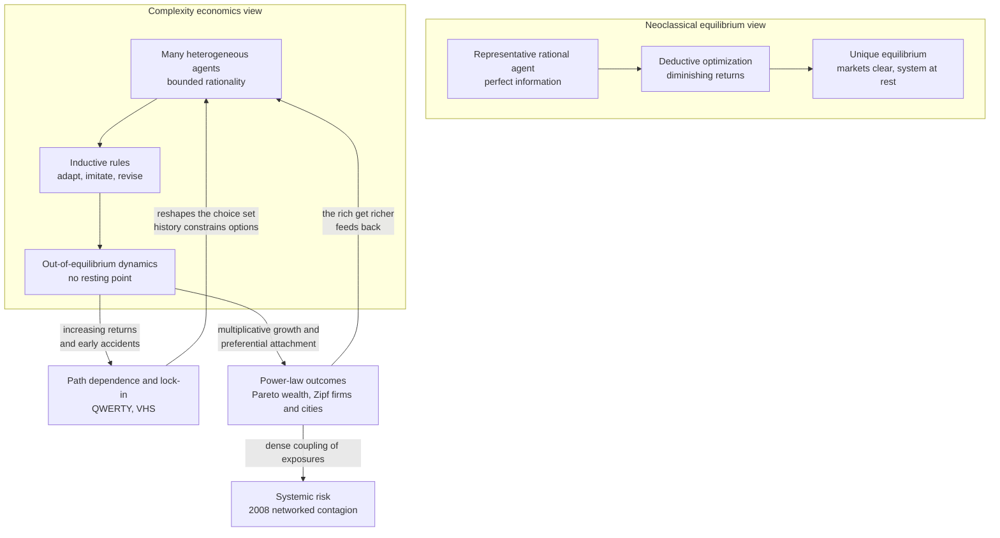

# 📊 Economic and Social Complexity

> [!abstract] TL;DR
> **Complexity economics** — the research program crystallized at the **Santa Fe Institute** by **W. Brian Arthur**, John Holland, and others — reframes the economy not as a machine sitting at a **unique equilibrium** but as a **complex adaptive system**: a churning population of **heterogeneous, boundedly-rational agents** who adapt to a world that they are collectively creating, and which therefore never comes to rest. Once you drop the assumptions of perfect rationality and diminishing returns, three phenomena that neoclassical theory treats as anomalies become **the main event**: **increasing returns** produce **path dependence and lock-in** (QWERTY, VHS); **inductive, adaptive expectations** replace deductive optimization (the **El Farol Bar** problem); and simple **multiplicative or preferential-attachment** dynamics generate the **power-law distributions** — Pareto's law of wealth, Zipf's law of city and firm sizes — that pervade real economic and social data. The same lens explains why **inequality is a robust emergent outcome** of even fair-looking local rules, and why **networked systems (2008)** convert efficiency into systemic fragility.

---

## Intuition

**Analogy — a cocktail party, not a set of scales.** Neoclassical economics pictures a market like a **balance scale**: supply on one pan, demand on the other, and prices slide until the pans hang level. Perturb it and it settles back. The scale has one resting position, and knowing the weights tells you exactly where it stops. It is a system *at rest*.

Now picture the economy as a **crowded cocktail party**. You choose who to talk to based on where the interesting conversations already are — but by joining one, you *change* where the interesting conversations are, which changes what everyone else does next. There is no "correct" arrangement the room settles into; it churns all evening. A rumor started in one corner can sweep the whole room or die in three seconds depending on who is standing where. Early accidents matter: the group that happened to form first pulls in latecomers, gets bigger, and pulls in more — the party has **increasing returns to attention**. Nobody has perfect information about the room; everyone is running a rough-and-ready **guess about what others will do**, and revising it. That churning, history-dependent, self-referential room — not the tidy scale — is what complexity economics says a real economy *is*.

---

## How It Works

### Core Mechanics

**1. The economy as a complex adaptive system.** Arthur's core move is to import the machinery of [[Complex_Adaptive_Systems]] into economics. Agents are **many, heterogeneous, and adaptive**; they interact **locally**; there is **no auctioneer** computing the equilibrium price. Macro-patterns (prices, business cycles, market shares, wealth distributions) **emerge** from micro-interactions and then feed back to reshape the agents. Because agents adapt to an environment made of other adapting agents, the system **co-evolves** and generally sits **out of equilibrium** — perpetual novelty, not a resting point.

**2. Increasing returns, path dependence, and lock-in.** Standard theory assumes **diminishing returns**, which guarantees a unique, efficient equilibrium and a self-correcting market. Arthur pointed out that much of the modern economy — technology, networks, knowledge — runs on **increasing returns**: the more a product is adopted, the more valuable and cheaper it becomes (learning-by-doing, network effects, complementary ecosystems). With increasing returns there are **multiple possible equilibria**, and **small early events** — an accident of timing, a lucky contract — get **amplified** until the market **locks in** to *one* outcome, which need not be the best. **QWERTY** beat the Dvorak keyboard; **VHS** beat the technically comparable Betamax; **light-water reactors** beat arguably better designs. The lock-in is **path-dependent**: history, not just fundamentals, selects the winner.

**3. Bounded rationality and inductive expectations — El Farol.** Perfect deductive rationality is impossible when the thing you must forecast is *what everyone else, also forecasting, will do*. Arthur's **El Farol Bar problem** makes this vivid: 100 people each decide whether to go to a bar that is only enjoyable if fewer than 60 attend. If everyone reasons "it'll be crowded, I'll stay home," the bar is empty and they were all wrong; if everyone reasons "it'll be empty, I'll go," it is packed. **No deductive fixed point exists.** Agents instead act **inductively**: each keeps a handful of hypotheses ("attendance mirrors last week," "it reverts to 50"), uses whichever has predicted best lately, and discards losers. The **aggregate attendance self-organizes** to hover around 60 — an emergent equilibrium in the *statistics* even though no agent is in equilibrium. This is the seed of the **Minority Game** and of adaptive-expectations models generally.

**4. Power laws are the fingerprint, not the exception.** Where equilibrium theory expects bell-curved, well-behaved outcomes, real economic quantities are **heavy-tailed**:
- **Pareto's law** — the top of the **wealth and income** distribution follows a power law; a small fraction owns a large share.
- **Zipf's law** — **city sizes** and **firm sizes** follow a rank-size power law with exponent near 1.
- **Trading volumes, returns, and price moves** have fat tails (the domain of **econophysics**).

These are not coincidences; they are the **generic output of a few simple mechanisms**.

**5. The mechanisms that manufacture inequality.** Persistent, heavy-tailed inequality emerges from surprisingly innocent local rules:
- **Multiplicative processes.** If wealth grows by random *percentage* shocks rather than additive ones, the log of wealth does a random walk and the level becomes **log-normal**, then power-law-tailed once you add a lower barrier or reset — Gibrat's law of proportional growth.
- **Preferential attachment.** "The rich get richer": resources flow to those who already have the most, the same [[Small_World_and_Scale_Free_Networks|Barabási–Albert]] mechanism that makes scale-free networks — producing Pareto tails in wealth and Zipf's law in firm size.
- **Kinetic exchange (econophysics).** Model money like energy in a gas: agents "collide" and randomly redistribute a stake. Even **fair, zero-sum, purely random** exchange drives the system toward extreme concentration (the *yard-sale model* condenses almost all wealth onto one agent) unless a redistribution term holds it back. **Inequality is the default, not a distortion.**

**6. Social complexity — Schelling segregation.** The same logic governs social patterns. Thomas Schelling's segregation model has agents with only a *mild* preference — "I move if fewer than a third of my neighbors are like me." No agent wants a segregated city, yet the mild preference, iterated, produces **near-total segregation**. Macro-pattern diverges sharply from micro-intent: a canonical demonstration that **aggregate social outcomes are emergent, not the sum of individual preferences**.

**7. Markets as ecosystems and the limits of prediction.** Trading strategies are like species: each exploits a niche, and by exploiting it changes the environment, opening and closing niches for others — a co-evolving **ecology** with no stable optimum. This is why **social systems resist prediction**: they are reflexive (forecasts change behavior), path-dependent, and near-critical, so tail events like the **2008 crisis** — where dense financial [[Cascades_and_Systemic_Risk|networks turned local defaults into systemic contagion]] — are structurally normal, not once-in-history flukes.

### Flow / Architecture



---

## Key Concepts

### Secondary
- **Equilibrium vs. churn.** Old picture: a market is a balance scale that settles to one price. New picture: an economy is a crowd that never fully settles because everyone keeps reacting to everyone else.
- **The rich get richer.** When advantages compound — more money earns more money, a popular product attracts more buyers — small early leads snowball into big, lasting gaps.
- **Lock-in.** Sometimes a worse option wins just because it got popular first and everyone else piled on. **QWERTY** keyboards are the classic example.
- **Emergent inequality.** Even simple, fair-seeming rules of trading can end with a few people holding most of the wealth — the pattern comes from the *rules interacting*, not from anyone planning it.

### Undergraduate
- **Complexity economics (Santa Fe / Arthur).** The economy modeled as a [[Complex_Adaptive_Systems|complex adaptive system]] of adaptive, heterogeneous agents, studied out of equilibrium and usually by simulation rather than closed-form solution.
- **Increasing returns and path dependence.** With network effects and learning-by-doing there are multiple equilibria; **small historical accidents get amplified** and the market **locks in**, possibly to an inferior standard.
- **Bounded rationality / inductive reasoning.** Agents cannot deduce optimal behavior in a self-referential world; they hold competing hypotheses and keep whichever predicts best — **El Farol** and the **Minority Game**.
- **Power laws in economics.** **Pareto** (wealth), **Zipf** (city and firm sizes), fat-tailed returns. Heavy tails mean the mean is not representative and extreme events dominate.
- **Schelling segregation.** Mild individual preferences, iterated on a grid, produce strong macro-segregation — social pattern diverging from individual intent.
- **Econophysics.** Applying statistical-mechanics tools (kinetic exchange, scaling, critical phenomena) to economic data and models.

### Graduate
- **Reflexivity and non-stationarity.** Because forecasts feed back into the process being forecast, social systems lack a fixed data-generating distribution; standard rational-expectations closure (a self-consistent fixed point) may not exist or may be one of many.
- **Multiplicative growth + reset → power laws.** A geometric random walk with a reflecting lower barrier (Gibrat + Kesten processes) yields a stationary **Pareto tail**; the exponent is set by the drift, variance, and reset rate — a rigorous origin story for Zipf's law.
- **Yard-sale / affine wealth models (Boghosian, Chakraborti).** Fair random kinetic exchange is **wealth-condensing**: without redistribution the Gini coefficient drives to 1. Adding a **redistribution parameter** and a **wealth-attained-advantage bias** produces a stationary distribution with a realistic Pareto tail plus partial condensation — a tractable model of *why* inequality is an attractor.
- **Minority Game phase transition.** The El Farol abstraction has a control parameter (memory versus population) with a genuine **phase transition** between an efficient, unpredictable regime and a crowded, herding regime — a statistical-mechanics account of market efficiency.
- **Networked systemic risk.** Financial systems as interdependent networks where dense counterparty coupling and leverage make [[Cascades_and_Systemic_Risk|first-order cascade transitions]] and "too-central-to-fail" institutions structurally likely — the formal skeleton behind 2008.
- **Limits of prediction.** Sensitive dependence, near-criticality, and reflexivity impose an in-principle horizon on social forecasting: the useful object is the **distribution of outcomes and tail risk**, not a point prediction.

---

## Python Demo

A **kinetic-exchange "yard-sale" model** of wealth. `N` agents each start with the **same** wealth. Repeatedly, random pairs "trade": a fraction of the poorer agent's wealth is put at stake and a (slightly biased) coin decides who wins it. Two ingredients make it realistic: a tiny **wealth-attained advantage** (the richer party is marginally more likely to win, as with better deals and access) and a small **redistribution** term (a flat tax rebated equally, standing in for the state). Starting from **perfect equality**, simple *local, fair-looking* exchange drives the system to **persistent, heavy-tailed inequality**. We track the **Gini coefficient** over time, draw the **Lorenz curve**, and plot the **wealth distribution's survival function on log-log axes** to reveal the Pareto-like tail. Uses only `numpy` and `matplotlib`.

```python
# Yard-sale kinetic exchange: fair local trades generate persistent inequality
# and a heavy-tailed wealth distribution. numpy + matplotlib only.
import numpy as np
import matplotlib.pyplot as plt

rng = np.random.default_rng(42)

N       = 10_000    # number of agents
SWEEPS  = 3_000     # each sweep pairs (almost) everyone once
F       = 0.20      # fraction of the POORER agent's wealth staked per trade
ZETA    = 0.02      # wealth-attained advantage: richer agent's win-bias
CHI     = 0.006     # redistribution rate: pull each wealth toward the mean

w  = np.ones(N)             # everyone starts perfectly equal
mu = w.mean()              # mean wealth is conserved by the redistribution

def gini(x):
    # Gini via the sorted-rank formula: 0 = perfect equality, 1 = one owns all.
    xs = np.sort(x)
    n = xs.size
    idx = np.arange(1, n + 1)
    return float(np.sum((2 * idx - n - 1) * xs) / (n * np.sum(xs)))

gini_t, times = [gini(w)], [0]
for s in range(1, SWEEPS + 1):
    # --- pair up agents at random for this sweep ---
    perm = rng.permutation(N)
    a, b = perm[0::2], perm[1::2]          # N/2 disjoint pairs
    wa, wb = w[a], w[b]

    # --- the trade: stake a fraction of the poorer party's wealth ---
    stake = F * np.minimum(wa, wb)
    # fair coin, nudged toward the richer agent by the advantage ZETA
    p_a_wins = 0.5 + ZETA * np.sign(wa - wb)
    a_wins = rng.random(a.size) < p_a_wins
    delta = np.where(a_wins, stake, -stake)
    w[a] = wa + delta
    w[b] = wb - delta

    # --- redistribution: a flat tax rebated equally (conserves total wealth) ---
    w += CHI * (mu - w)
    np.clip(w, 0.0, None, out=w)            # no negative wealth

    if s % 20 == 0:
        times.append(s); gini_t.append(gini(w))

# ---------------- Lorenz curve of the final distribution ----------------
xs = np.sort(w)
cum = np.concatenate([[0.0], np.cumsum(xs)])
lorenz = cum / cum[-1]
pop = np.linspace(0.0, 1.0, xs.size + 1)

# ---------- survival function (CCDF) on log-log to expose the tail ----------
xs_pos = xs[xs > 0]
ccdf = 1.0 - np.arange(xs_pos.size) / xs_pos.size

# ------------------------------- plotting -------------------------------
fig, (ax1, ax2, ax3) = plt.subplots(1, 3, figsize=(16, 4.5))

ax1.plot(times, gini_t, color="crimson", lw=2)
ax1.set_title("Inequality emerges from equality")
ax1.set_xlabel("sweep"); ax1.set_ylabel("Gini coefficient")
ax1.set_ylim(0, 1); ax1.grid(True, alpha=0.3)

ax2.plot(pop, lorenz, color="navy", lw=2, label="final wealth")
ax2.plot([0, 1], [0, 1], "k--", lw=1, label="perfect equality")
ax2.fill_between(pop, lorenz, pop, color="navy", alpha=0.12)
ax2.set_title("Lorenz curve  (Gini = {:.2f})".format(gini_t[-1]))
ax2.set_xlabel("cumulative share of population")
ax2.set_ylabel("cumulative share of wealth")
ax2.legend(fontsize=8); ax2.grid(True, alpha=0.3)

ax3.loglog(xs_pos / mu, ccdf, ".", ms=3, color="darkgreen")
ax3.set_title("Wealth survival function  (heavy tail)")
ax3.set_xlabel("wealth / mean  [log]")
ax3.set_ylabel("P(Wealth > w)  [log]")
ax3.grid(True, which="both", alpha=0.3)

plt.tight_layout(); plt.show()

top1 = xs[int(0.99 * N):].sum() / xs.sum()
print("Gini rose from {:.2f} to {:.2f}".format(gini_t[0], gini_t[-1]))
print("Top 1% of agents ended up holding {:.0%} of all wealth.".format(top1))
```

Starting from a Gini of **0** (everyone identical), the coefficient climbs and plateaus at a high value: the local, fair-looking trades **manufacture a persistent oligarchy**. The Lorenz curve bows far below the diagonal, and the log-log survival function shows a **roughly straight heavy tail** — the Pareto signature. The redistribution term (`CHI`) is the only thing preventing *total* condensation onto a single agent; drop it toward zero and the Gini marches to 1. The lesson is structural: **inequality is an attractor of simple exchange, not evidence of cheating** — which is exactly why complexity economics treats heavy tails as the norm.

---

## Real-World Applications

> **Example — Zipf's law of city sizes.** Rank the cities of almost any country by population and the size of the rank-`r` city is close to (largest city size) / `r`: the second city is about half the largest, the tenth about a tenth. This power law is astonishingly stable across countries and centuries, and it falls straight out of **proportional (multiplicative) growth** of many cities plus entry and exit — a textbook complexity-economics result that no equilibrium location model predicts on its own.

- **Technology standards and platform lock-in.** QWERTY, VHS/Betamax, x86, and modern platform wars (iOS/Android, dominant cloud providers) are increasing-returns races where **early leads and network effects lock in a standard** — sometimes an inferior one. Antitrust and "winner-take-all" market analysis lean directly on Arthur's path-dependence framework.
- **Wealth and income inequality policy.** Kinetic-exchange and multiplicative-growth models explain why inequality *re-concentrates* after redistributive shocks and why capital taxation, not just income policy, is needed to hold the Gini down — the redistribution term in the demo made concrete.
- **Financial-market microstructure and crashes.** Econophysics models fat-tailed returns, volatility clustering, and flash crashes as emergent properties of adaptive traders, feeding stress-testing and circuit-breaker design; the 2008 crisis is the canonical [[Cascades_and_Systemic_Risk|networked systemic-risk]] case.
- **Urban planning and residential segregation.** Schelling's model informs how planners think about tipping neighborhoods, school assignment, and integration policy — small preference thresholds can undo integration efforts, so interventions must target the **dynamics**, not just intentions.
- **Firm-size distributions and industrial policy.** The heavy-tailed distribution of firm sizes (a few giants, a long tail of small firms) shapes how shocks to large firms propagate through an economy — "granular" macroeconomics.

---

## Common Pitfalls

- **Assuming equilibrium is the natural resting state.** Treating out-of-equilibrium churn as "noise around the true equilibrium" throws away the phenomenon. In increasing-returns and adaptive settings, **there may be many equilibria or none**, and the transient *is* the behavior.
- **Reading inequality as evidence of unfairness (or of merit).** The yard-sale result shows extreme concentration arising from **symmetric, fair** rules. Neither "the winners cheated" nor "the winners are simply better" follows from the outcome; the concentration is a **structural attractor**. Diagnose the mechanism before the morality.
- **Fitting a Gaussian to a power law.** Using mean-and-variance thinking on heavy-tailed data (returns, wealth, firm sizes, cascade sizes) drastically **underestimates tail risk** — the failure mode behind many financial blowups. Check for power laws before trusting an average.
- **Confusing "a power law" with "one specific mechanism."** Multiplicative growth, preferential attachment, kinetic exchange, and self-organized criticality can all yield power laws. **Observing a heavy tail does not identify its cause** — you need the generative model, not just the log-log line.
- **Over-fitting agent-based models.** With enough free parameters an ABM reproduces any stylized fact. Without out-of-sample validation and sensitivity analysis, a matching Gini or tail exponent proves little — the same warning that applies to [[Complex_Adaptive_Systems|CAS models generally]].
- **Expecting point prediction from a reflexive system.** Because forecasts change behavior and the system sits near criticality, demanding "what will the market do next Tuesday" is the wrong question. The tractable outputs are **distributions, tail risks, and scenario envelopes**.
- **Ignoring the coupling that efficiency buys.** Optimizing a financial or supply network for cost strips out the slack that would absorb a shock, converting local failures into systemic cascades — the 2008 lesson that lean and fragile are two names for the same design.

---

## Related Concepts

- [[Complex_Adaptive_Systems]] — the parent framework; complexity economics is CAS theory applied to markets, firms, and money, with adaptive heterogeneous agents and emergent macro-order.
- [[Cascades_and_Systemic_Risk]] — the networked-contagion machinery behind 2008; dense economic coupling turns local failures into system-wide collapse.
- [[Small_World_and_Scale_Free_Networks]] — preferential attachment ("the rich get richer") is the same mechanism that produces scale-free networks and Pareto/Zipf economic tails.
- [[Nonlinearity_and_Feedback]] — increasing returns are positive feedback; they are what create multiple equilibria, amplification of early accidents, and lock-in.
- [[Criticality_and_Phase_Transitions]] — markets poised near critical points explain fat-tailed fluctuations and the Minority Game's efficiency transition.
- [[Fractals_and_Self_Similarity]] — power-law / scale-invariant structure is the geometric signature shared by wealth distributions and market price series.
- [[Agent_Based_Modeling]] — the primary method of complexity economics: grow the economy in silico and study what emerges rather than solving for equilibrium.
- [[Market_Equilibrium]] — the neoclassical supply-and-demand equilibrium that complexity economics reframes as a special case, not the general one.
- [[Returns_to_Scale]] — the microeconomic treatment of increasing/decreasing/constant returns whose *increasing* case drives Arthur's lock-in dynamics.
- [[Nash_Equilibrium_Applications]] — strategic interaction among agents; complexity economics replaces its fixed points with adaptive, out-of-equilibrium learning.
- [[Solow_Growth_Model]] — the equilibrium growth benchmark against which increasing-returns and endogenous, path-dependent growth stories are contrasted.
- [[Global_Financial_Crises]] — the macro account of 2008-style contagion this note models as an emergent, networked systemic-risk phenomenon.
- [[Market_Anomalies_and_Bubbles]] — behavioral-finance anomalies that adaptive, boundedly-rational agent models reproduce as normal rather than aberrant.
- [[Foundations_of_Behavioral_Finance]] — the bounded-rationality microfoundations that complexity economics shares with behavioral finance.
- [[Social_Class_and_Stratification]] — the sociological structure of inequality whose emergence these exchange and attachment mechanisms help explain.
- [[Poverty_Social_Mobility_and_Life_Chances]] — mobility and persistence of position, the human face of the wealth-condensation dynamics simulated here.
- [[Global_Inequality_and_Development]] — cross-national inequality patterns that multiplicative-growth and lock-in mechanisms illuminate.

---

## Review Questions

1. **(Conceptual)** Neoclassical theory predicts a market converges to a unique, efficient equilibrium; complexity economics predicts path-dependent lock-in that may be inefficient. Explain precisely which assumption — and its replacement — flips the prediction, and why *diminishing* versus *increasing* returns is the decisive fork.
2. **(Scenario)** A policymaker points to the yard-sale simulation and concludes "since even fair trading produces extreme inequality, redistribution is pointless — it will just re-concentrate." Using the roles of the redistribution term `CHI` and the wealth-attained-advantage `ZETA` in the model, construct the counter-argument, and say what the simulation implies about *which* policy levers actually move the steady-state Gini.
3. **(Trade-off / critique)** You observe that a country's firm sizes, city sizes, and top-wealth shares all follow power laws, and you are tempted to declare "the same mechanism generates all three." Explain why this inference is unsound, name at least two distinct mechanisms that each produce power laws, and describe what additional evidence you would need to identify the actual generative process in each case.

---

## Sources

- Arthur, W. B. (1989). "Competing Technologies, Increasing Returns, and Lock-In by Historical Events." *The Economic Journal, 99*(394), 116–131. — the foundational path-dependence / lock-in argument (QWERTY, VHS).
- Arthur, W. B. (1994). "Inductive Reasoning and Bounded Rationality." *American Economic Review, 84*(2), 406–411. — the El Farol Bar problem and inductive expectations.
- Arthur, W. B. (2021). "Foundations of complexity economics." *Nature Reviews Physics, 3*, 136–145. — a modern synthesis of the Santa Fe program.
- Schelling, T. C. (1971). "Dynamic Models of Segregation." *Journal of Mathematical Sociology, 1*(2), 143–186. — the segregation model of emergent social pattern.
- Boghosian, B. M. (2019). "The Inescapable Casino." *Scientific American, 321*(5), 70–77. — the yard-sale / affine wealth kinetic-exchange model of inequality.
- Gabaix, X. (2009). "Power Laws in Economics and Finance." *Annual Review of Economics, 1*, 255–294. — Zipf's law, Pareto tails, and the mechanisms behind them.

---

#complexity #complexity-economics #inequality #power-law #agent-based
