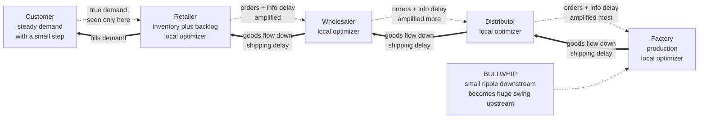

# 🏢 Organizational and Management Systems

> [!abstract] TL;DR
> An organization is not a machine you can tune part-by-part; it is a **complex adaptive system** whose behavior is generated by **feedback loops, delays, and stocks** that cut across the boxes on the org chart. Peter Senge's *The Fifth Discipline* names **systems thinking** as the discipline that integrates the other four (**personal mastery, mental models, shared vision, team learning**) into a **learning organization**. Recurring dysfunctions crystallize into a small library of **systems archetypes** — *limits to growth, shifting the burden, tragedy of the commons, fixes that fail, escalation, success to the successful* — that explain why smart people produce dumb collective outcomes. The **beer distribution game** demonstrates the sharpest lesson: when each stage optimizes locally under information and shipping delays, tiny demand ripples amplify into violent upstream oscillations — the **bullwhip effect** — even though no one is behaving irrationally. Stafford Beer's **Viable System Model** and Ashby's **Law of Requisite Variety** give the cybernetic reasons why; Deming and Ackoff give the management practice. The through-line: **structure drives behavior**, so blaming people (or reorganizing the boxes) rarely fixes a system whose loops are still wired for the old pathology.

---

## Intuition

**Analogy — steering a supertanker with a delayed rudder.** Imagine you are the captain of a supertanker, but the wheel is connected to the rudder through a two-minute lag, and you can only see the ship's heading through binoculars that update every minute. You want to hold a straight course. You notice you have drifted left, so you turn hard right. Nothing seems to happen — the delay hides your correction — so you turn *harder* right. Two minutes later all of your corrections arrive at once and the tanker swings violently to the right. Now you slam left, over-correct again, and the ship snakes down the channel in ever-wider swings, never settling. You did nothing "irrational" at any single moment; the **oscillation is a property of the loop** — of the delay between action and feedback — not of your skill or intent.

An organization is a fleet of such tankers lashed together. The sales team, the factory, the warehouse, and the supplier each steer their own local heading with their own delayed instruments, and each one's correction becomes the next one's disturbance. The behavior that emerges — boom-and-bust inventory, oscillating headcount, reorganizations that undo the last reorganization — is not a failure of the people at the wheels. It is the **structure of the connected loops**, and until you can *see the loops* you will keep firing captains and keep getting the same voyage.

---

## How It Works

### Organizations as complex systems, not machines

The dominant management metaphor is the **machine**: the org chart is a blueprint of parts, managers are engineers, and to fix a problem you locate the faulty part and replace it. This works for simple, decomposable, low-feedback tasks and fails everywhere else. A real organization is a **complex adaptive system** — many interacting agents whose local decisions are coupled through **stocks** (inventory, cash, headcount, backlog, morale, technical debt), **flows** (hiring, shipping, spending), and **feedback loops** with **delays**. Its aggregate behavior *emerges* from the interactions and cannot be read off the org chart, any more than you can read the traffic jam off the specs of one car. The foundational principle, inherited from Jay Forrester's system dynamics, is that **structure drives behavior**: swap out every individual and a badly-wired organization reproduces the same pathology, because the pathology lives in the loops.

### Senge's five disciplines and the learning organization

Peter Senge's *The Fifth Discipline* (1990) argues that organizations able to thrive in complexity are **learning organizations** — ones that "continually expand their capacity to create their future." He identifies five disciplines that must develop together:

1. **Personal mastery** — the individual commitment to lifelong learning, clarifying what truly matters and seeing reality objectively.
2. **Mental models** — surfacing, testing, and improving the deeply held assumptions and generalizations that drive our actions (the same paradigm-level structures named in [[Leverage_Points_and_Mental_Models]] and studied cognitively in [[Schemas_and_Mental_Models]]).
3. **Shared vision** — building genuine (not compliance-based) commitment to a picture of the future the group wants to create.
4. **Team learning** — the practice of dialogue and thinking together, so a team's collective intelligence exceeds the sum of individuals.
5. **Systems thinking** — the **fifth discipline** that *integrates* the other four, the conceptual cornerstone that lets people see wholes, interrelationships, and patterns of change rather than static snapshots and linear cause-effect chains.

Systems thinking is "the fifth discipline" precisely because without it the other four collapse into fads: a shared vision without systems thinking becomes a pretty poster; personal mastery without it produces skilled people trapped in a dumb structure.

### Systems archetypes: the recurring plots

Senge (drawing on Forrester and, in parallel, Donella Meadows) popularized a small catalog of **systems archetypes** — generic loop structures that recur across wildly different organizations. Knowing them lets you diagnose a mess quickly:

- **Limits to Growth** — a reinforcing growth loop eventually bumps into a balancing constraint (market saturation, resource limit, burnout). Pushing the growth engine harder is futile once the limit binds; the leverage is to *weaken the constraint*, not floor the accelerator.
- **Shifting the Burden** — a symptomatic quick-fix relieves pain but atrophies the fundamental solution and often breeds dependence (hiring contractors instead of fixing the hiring pipeline; hero firefighting instead of root-cause fixes). A vicious *addiction* side-effect loop grows.
- **Tragedy of the Commons** — many actors independently draw on a shared limited resource (a shared database, a common budget, a brand's goodwill); each rational local gain degrades the commons until it collapses for all. The fix is a higher-level regulator, not more exhortation.
- **Fixes that Fail** — a fix that works in the short term triggers a delayed consequence that makes the original problem worse (cutting maintenance to hit a quarterly number; the outage arrives two quarters later).
- **Escalation** — two parties each react to the other's advances as a threat, driving an arms race (competing feature wars, price wars, tit-for-tat retaliation between departments). The structure is two balancing loops coupled into a reinforcing whole.
- **Success to the Successful** — two activities compete for a limited resource; whichever gets an early edge is rewarded with more resource, starving the other regardless of intrinsic merit (the star team that always gets the headcount, so it always looks best).

Each archetype comes with a **leverage prescription** — the point where a small, well-placed intervention changes the pattern, echoing Meadows' hierarchy in [[Leverage_Points_and_Mental_Models]].

### The beer game and the bullwhip effect

The single most famous demonstration in the field is the **Beer Distribution Game**, a role-play developed at MIT in the 1960s. Four stations — **Retailer, Wholesaler, Distributor, Factory** — form a supply chain. Customer demand enters at the retailer; orders flow *upstream* with an information delay; beer flows *downstream* with a shipping delay. Each player sees only their own inventory and their immediate customer's orders, and each tries to minimize their own cost (holding cost + backorder cost). A tiny, one-time step increase in customer demand reliably produces **wild, amplifying oscillations** in orders and inventory that grow larger at each stage moving upstream — the factory swings hardest of all. This demand-amplification is the **bullwhip effect**.

Crucially, **no player is irrational or malicious**. The oscillation is generated by the *structure*: (1) **feedback delays** between ordering and receiving, (2) each stage **forecasting off its neighbor's orders** rather than true end demand, and (3) **local optimization** — under-weighting the "supply line" of orders already placed-but-not-yet-arrived, so panicked players double-order, then cancel, then double-order again. Sterman's controlled experiments showed people systematically **ignore the supply line**, the precise cognitive error that turns a smooth goal-seeking loop into a violent oscillator. This is *policy resistance* and *misperception of feedback* made visible.

### Policy resistance and unintended consequences

Because organizations are dense with feedback, interventions often provoke a compensating reaction that cancels them — **policy resistance**. Raise a sales quota and reps stuff the channel, borrowing next quarter's demand. Add headcount to a late project and (Brooks's Law) coordination overhead makes it later. Reward individual heroics and you *suppress* the systemic fixes that would end the fires. The general pattern: an intervention aimed at a symptom shifts the problem in time (a delay) or space (another department), so the local metric improves while the whole degrades. Every archetype above is, at root, a story of **unintended consequences** produced by acting on events instead of structure.

### Management cybernetics: VSM and requisite variety

Stafford Beer built a rigorous cybernetic theory of organization. His **Viable System Model (VSM)** claims any viable organization — a cell, a company, a nation — must contain five recursively-nested subsystems: **System 1** (the operational units that do the work), **System 2** (coordination that damps oscillation between units), **System 3** (internal management and resource allocation, with **3\*** audit), **System 4** (intelligence: sensing the outside world and the future), and **System 5** (policy and identity). "Recursive" means every viable System 1 unit is *itself* a whole VSM. The model diagnoses organizations by asking which system is missing or overloaded: pure hierarchy usually has no System 2 (chronic inter-unit oscillation) or a starved System 4 (blind to the future).

Underneath VSM sits **Ashby's Law of Requisite Variety** (see [[Cybernetics_and_Control]]): *only variety can absorb variety.* A regulator must command at least as many distinct responses as the disturbances it faces. In management terms, a control system (a manager, a policy, a dashboard) can only regulate an operation whose complexity it can match. When the environment's variety exceeds management's, you must either **amplify** management's variety (better information, more decision-makers, AI) or **attenuate** the environment's (standardize, modularize, decentralize) — the twin cybernetic moves. Over-centralization is a chronic requisite-variety failure: one executive brain cannot possibly match the variety of ten thousand front-line situations.

### Deming's system view and Ackoff's interactive planning

W. Edwards Deming insisted that quality is a property of the **system**, not the worker: his estimate that ~94% of problems belong to the system (management's responsibility) and only ~6% to special/local causes reframed quality as systemic. His **System of Profound Knowledge** rests on four pillars — *appreciation for a system, knowledge about variation, theory of knowledge, and psychology* — and he condemned management practices (individual ranking, MBO by the numbers, slogans) that optimize parts while degrading the whole. Russell Ackoff's **interactive planning** pushed the same logic into strategy: rather than predict-and-prepare, organizations should *idealize* (design the system they would build today if unconstrained) and then work backward, treating planning as continuous, participative, and holistic. Ackoff's slogan captures the whole field: *"A system is not the sum of the behavior of its parts, it is the product of their interactions,"* so improving each part in isolation can degrade the whole.

### Why reorganizations so often fail, and local vs global optimization

Reorganizations redraw the **boxes** (the parts) while leaving the **loops** (the interactions) — incentives, information flows, delays, and goals — untouched. Since structure-as-loops drives behavior, the same pathology re-emerges under new titles, and the reorg's disruption cost is pure loss. The deeper disease is **local optimization**: each department, rationally maximizing its own metric, produces a globally worse outcome (the beer game in miniature). A warehouse minimizing its own stock-outs over-orders; sales maximizing bookings sells un-buildable configurations; engineering maximizing velocity ships debt that ops pays for. The systemic cures are to **align goals across the whole** (shared vision, global metrics), **shorten or expose delays** (faster feedback, visible supply lines), and **intervene at high leverage** (rules, information flows, goals) rather than reshuffling parts.



---

## Key Concepts

### Secondary (intuitive level)
- An organization behaves like the **delayed-rudder supertanker**: corrections take time to bite, so people over-steer and the whole thing oscillates. The wobble is in the wiring, not the people.
- **Structure drives behavior** — if a team keeps producing the same mess with new members, fix the loops, not the roster.
- The **bullwhip effect**: a small change in what customers buy becomes a giant swing in what the factory makes, because each link only sees its neighbor.
- A **learning organization** is one that keeps getting better at seeing and reshaping its own system, instead of just running faster inside a broken one.

### Undergraduate (structural level)
- **Senge's five disciplines** and why *systems thinking* is "the fifth" that integrates personal mastery, mental models, shared vision, and team learning.
- The core **systems archetypes** as reusable loop templates — *limits to growth, shifting the burden, tragedy of the commons, fixes that fail, escalation, success to the successful* — each with a characteristic leverage point.
- The **beer game** mechanics: information delay, shipping delay, forecasting off local orders, and the **anchor-and-adjust** ordering rule that under-weights the supply line, producing amplification.
- **Local vs global optimization**: rational local metrics summing to a globally worse outcome; the reason **reorganizations** (redrawing boxes, not loops) usually fail.
- **Policy resistance**: feedback loops absorb or reverse interventions, so symptom-level fixes disappoint.

### Graduate (critical level)
- **Beer's Viable System Model**: the five recursively-nested systems and their diagnostic use; the pathologies of missing System 2 (oscillation) and starved System 4 (strategic blindness).
- **Ashby's Law of Requisite Variety** applied to management: control requires the regulator's variety to match the regulated system's; the **amplify vs attenuate** design choice, and why centralization is a requisite-variety failure. Connects to [[Cybernetics_and_Control]].
- **Sterman's experimental result**: the bullwhip is a robust *misperception-of-feedback* phenomenon; subjects reliably ignore the supply line even with full information and stationary demand, so the pathology is cognitive-structural, not informational alone.
- **Deming's System of Profound Knowledge** and the ~94/6 system-vs-special-cause split; the case against individual ranking and MBO as anti-systemic; contrast with **Ackoff's interactive planning** (idealized design, dissolving problems vs solving them).
- **Critiques**: VSM's abstraction can be hard to operationalize; systems archetypes risk becoming just-so stories applied post hoc; "learning organization" has been criticized as under-specified. The discipline is a diagnostic lens, not a deterministic algorithm.

---

## Python Demo

```python
# The Beer Distribution Game / bullwhip effect.
# Four echelons -- Retailer -> Wholesaler -> Distributor -> Factory -- each a
# LOCAL optimizer using an "anchor-and-adjust" ordering rule (Sterman 1989).
# Orders travel UP with an information delay; goods travel DOWN with a
# shipping delay. A single small STEP in customer demand (8 -> 12 units/wk)
# amplifies into large, growing oscillations upstream: the bullwhip effect.
#
# Key structural driver: each stage UNDER-weights its "supply line" (orders
# already placed but not yet received). beta < alpha_S => chronic over- and
# under-ordering => oscillation that grows toward the factory.
import numpy as np
import matplotlib.pyplot as plt

STAGES = ["Retailer", "Wholesaler", "Distributor", "Factory"]

def beer_game(T=52, Ld=2, alpha_S=0.30, beta=0.15, S_star=12.0, theta=0.30,
              base=8.0, step=12.0, step_week=4):
    N = 4                                   # 0=Retailer ... 3=Factory
    inv       = np.full(N, 12.0)            # on-hand inventory (a stock)
    backlog   = np.zeros(N)                 # unfilled orders owed downstream
    fcast     = np.full(N, base)            # exp-smoothing demand forecast
    supply_line = np.full(N, base * 2 * Ld) # ordered-but-not-yet-received

    # FIFO transit pipelines, each of length Ld, pre-filled at equilibrium
    ship_in  = [[base] * Ld for _ in range(N)]   # goods heading DOWN to stage i
    order_in = [[base] * Ld for _ in range(N)]   # orders heading UP to stage i

    H_inv = np.zeros((T, N))   # net inventory (on-hand minus backlog)
    H_ord = np.zeros((T, N))   # orders placed upstream

    for t in range(T):
        cust = step if t >= step_week else base

        # 1) receive goods arriving now (front of each shipping pipe)
        arriving = np.array([ship_in[i].pop(0) for i in range(N)])
        inv += arriving
        supply_line -= arriving

        # 2) receive incoming orders; retailer sees TRUE customer demand
        incoming = np.empty(N)
        incoming[0] = cust
        for i in range(1, N):
            incoming[i] = order_in[i].pop(0)
        demand_to_fill = incoming + backlog

        # 3) ship what inventory allows; unmet demand becomes backlog
        shipped = np.minimum(inv, demand_to_fill)
        inv -= shipped
        backlog = demand_to_fill - shipped
        for i in range(1, N):
            ship_in[i - 1].append(shipped[i])   # stage i ships down to i-1

        # 4) update each stage's demand forecast (exponential smoothing)
        fcast = theta * incoming + (1 - theta) * fcast

        # 5) anchor-and-adjust ordering decision (the local optimizer)
        net_inv  = inv - backlog
        SL_star  = fcast * 2 * Ld
        order_out = np.maximum(
            0.0,
            fcast
            + alpha_S * (S_star - net_inv)      # correct inventory toward target
            + beta   * (SL_star - supply_line)  # UNDER-weighted supply-line term
        )
        supply_line += order_out
        for i in range(N - 1):
            order_in[i + 1].append(order_out[i])  # order from i heads up to i+1
        ship_in[3].append(order_out[3])           # factory order = production start

        H_inv[t], H_ord[t] = net_inv, order_out

    return H_inv, H_ord

H_inv, H_ord = beer_game()

# Bullwhip metric: variance of orders at each stage relative to the retailer.
var = H_ord.var(axis=0)
print("Order variance by stage (bullwhip amplification):")
for name, v in zip(STAGES, var):
    print(f"  {name:12s} var={v:6.1f}   x{v / var[0]:5.2f} vs Retailer")

fig, ax = plt.subplots(1, 2, figsize=(13, 5))
weeks = np.arange(H_ord.shape[0])
for i, name in enumerate(STAGES):
    ax[0].plot(weeks, H_ord[:, i], label=name)
    ax[1].plot(weeks, H_inv[:, i], label=name)
ax[0].axvline(4, color="gray", ls=":", lw=1)
ax[0].set_title("Orders placed upstream -- amplifies toward the Factory")
ax[0].set_xlabel("week"); ax[0].set_ylabel("order rate"); ax[0].legend(fontsize=8)
ax[1].axhline(0, color="gray", ls=":", lw=1)
ax[1].set_title("Net inventory -- swings below zero are backlog")
ax[1].set_xlabel("week"); ax[1].set_ylabel("on-hand minus backlog"); ax[1].legend(fontsize=8)
plt.tight_layout(); plt.show()

# Takeaway: a one-time 50% demand step (week 4) produces order oscillations
# whose amplitude GROWS at every stage upstream -- the factory whipsaws hardest.
# No agent is irrational; the bullwhip is a property of delays + local
# optimization + under-weighting the supply line. Sharing TRUE end demand,
# shortening delays, or fully accounting for the supply line (beta -> alpha_S)
# damps the oscillation.
```

Running it, the printed variances rise monotonically from Retailer to Factory (often a several-fold amplification), and the order plot shows the classic bullwhip: a small step at week 4 becomes an ever-larger swing at each upstream echelon, with net inventory diving deep into backlog before overshooting into gluts. Set `beta = alpha_S` (fully valuing the supply line) and the oscillation collapses — proof that the pathology is *structural and cognitive*, not a data problem.

---

## Real-World Applications

- **Supply chains (the bullwhip, in reality):** Procter & Gamble coined the term "bullwhip" after noticing that steady diaper sales produced wildly swinging factory orders. Modern countermeasures are exactly the systemic ones — **share point-of-sale demand** (Walmart's Retail Link, Vendor-Managed Inventory), **shorten replenishment cycles**, and remove batching/promotion distortions — not "order better." See [[Stocks_Flows_and_System_Dynamics]] and [[Feedback_Loops_and_Causality]].
- **Software organizations:** Brooks's Law ("adding people to a late project makes it later") is a *fixes-that-fail* / limits-to-growth archetype; hero firefighting instead of fixing the CI pipeline is *shifting the burden*; two teams competing for the same platform team's time is *success to the successful*. Applied in [[Engineering_Organization_Design]].
- **Quality and manufacturing:** Toyota Production System and Deming's teaching in postwar Japan operationalized the systems view of quality — reduce variation, empower the line to stop the system (andon), optimize the whole flow not local station throughput.
- **Reorganizations and change programs:** most large reorgs redraw boxes and fail; systems-informed [[Change_Management]] instead targets incentives, information flows, and goals (high-leverage points) and treats resistance as feedback, not obstinacy.
- **Public policy and healthcare:** shifting-the-burden and tragedy-of-the-commons archetypes explain welfare dependence traps, antibiotic resistance, and shared-budget over-draw; VSM has been used to (re)design health services and even Chile's Project Cybersyn (Beer, 1971-73).
- **Strategy:** Ackoff-style **idealized design** workshops and Senge-style **learning labs** with simulation "microworlds" let leadership teams rehearse policy consequences before betting the company.

---

## Common Pitfalls

- **Blaming people for structural failures.** The default reflex is to find who to blame; but if the loops reward the behavior, the next person will do the same. Deming's ~94/6 rule: most problems are the system's, and the system is management's job.
- **Reorganizing the boxes, not the loops.** Redrawing the org chart while leaving incentives, delays, and information flows untouched imports all the disruption cost and none of the cure. Ask what *loops* change, not what titles change.
- **Ignoring the supply line (the beer-game error).** Ordering to fix current inventory while forgetting the orders already in transit causes over-ordering, then cancellation, then oscillation — in inventory, hiring, capacity, and budgets alike.
- **Optimizing parts in isolation.** Local KPIs that each department maximizes can sum to a globally worse outcome. If every team is "green" and the company is failing, suspect local optimization.
- **Treating quick fixes as solutions.** Symptomatic relief (contractors, overtime, discounts) that atrophies the fundamental capability is *shifting the burden* — it feels like progress while the disease deepens and dependence grows.
- **Expecting instant response and over-correcting.** Delays mean interventions look like they failed before they bite; leaders then pile on more, guaranteeing overshoot. Respect the lag.
- **Requisite-variety mismatch via over-centralization.** One executive brain cannot match the variety of thousands of front-line situations; hoarding decisions upward starves regulation. Push decisions to where the variety is.
- **Using archetypes as post-hoc stories.** The templates are diagnostic aids, not proofs. Fit the loop to evidence (stocks, delays, actual data), don't just narrate.

---

## Related Concepts

- [[Cybernetics_and_Control]] — Ashby's Law of Requisite Variety and negative-feedback control are the formal backbone of Beer's Viable System Model and management cybernetics; the beer game is a cybernetic control loop misbehaving because of delay.
- [[Leverage_Points_and_Mental_Models]] — Meadows' hierarchy of where to intervene is the "so what" of every archetype: aim at goals, rules, and information flows rather than parameters or the org chart.
- [[Feedback_Loops_and_Causality]] — reinforcing and balancing loops plus delays are the raw material out of which every systems archetype and the bullwhip effect are built.
- [[Stocks_Flows_and_System_Dynamics]] — inventory, backlog, headcount, and cash are the stocks whose accumulation and delay generate organizational oscillation; the demo is a small system-dynamics model.
- [[Schemas_and_Mental_Models]] — the cognitive-science account of mental models, which Senge's second discipline aims to surface and improve; misperception of feedback in the beer game is a mental-model failure.
- [[Engineering_Organization_Design]] — a concrete engineering-management application: structuring teams, incentives, and information flows so local optimization aligns with the global goal.
- [[Change_Management]] — systems-informed change targets high-leverage loops and treats resistance as policy-resistance feedback rather than obstruction, explaining why box-shuffling reorgs fail.

---

## Review Questions

1. **(Understanding)** In the beer game, no player behaves irrationally yet orders oscillate more violently at each upstream stage. Explain, in terms of *delays*, *local information*, and the *supply line*, why the amplification happens and why "just order better" is not the fix. Then name two structural interventions that damp the bullwhip and say which leverage point each occupies.
2. **(Application)** An engineering org keeps firefighting production incidents with heroic weekend efforts; leadership praises the heroes, and outages keep recurring. Identify the systems archetype, draw the two loops involved, explain why the praise makes the underlying problem worse over time, and propose the higher-leverage intervention.
3. **(Analysis / trade-off)** Deming claimed ~94% of problems belong to the system and only ~6% to special local causes, and he condemned individual performance ranking. Using Ashby's Law of Requisite Variety and the concept of local-vs-global optimization, argue both *for* his position and *against* it — under what organizational conditions might strong local accountability actually be the higher-leverage move, and what does that reveal about the limits of the pure systems view?

---

## Sources

- Senge, P. M. (2006). *The Fifth Discipline: The Art and Practice of the Learning Organization* (rev. ed.). Doubleday/Currency.
- Sterman, J. D. (2000). *Business Dynamics: Systems Thinking and Modeling for a Complex World.* Irwin/McGraw-Hill. (Ch. 17-18 on supply chains and the beer game; see also Sterman 1989, *Management Science* 35(3), 321-339.)
- Meadows, D. H. (2008). *Thinking in Systems: A Primer.* Chelsea Green Publishing. (Systems archetypes / "system traps.")
- Beer, S. (1985). *Diagnosing the System for Organizations.* Wiley. (The Viable System Model.)
- Ackoff, R. L. (1999). *Re-Creating the Corporation: A Design of Organizations for the 21st Century.* Oxford University Press. (Interactive planning; systems view of management.)

---

#complexity #systems-thinking #management #learning-organization #bullwhip
