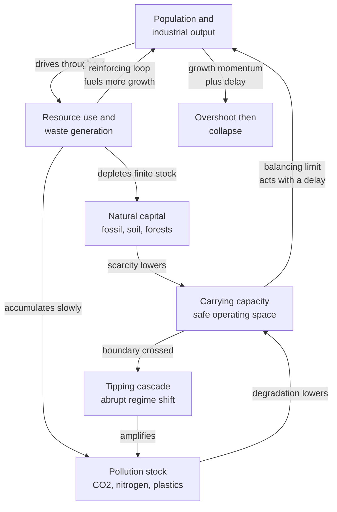

# 🌍 Sustainability and Planetary Boundaries

> [!abstract] TL;DR
> Sustainability is not fundamentally a moral question — it is a **systems** question. The Earth is a single coupled human–environment system built from **stocks** (people, natural capital, pollution, atmospheric carbon), **feedback loops**, **delays**, and **nonlinear thresholds**. When a growing subsystem draws down a finite stock faster than it can regenerate, and delays hide the damage until it is baked in, the system **overshoots** its carrying capacity and then **collapses** rather than gliding to equilibrium. The **Limits to Growth** study (Meadows et al., 1972) modeled this with World3; the **planetary boundaries** framework (Rockström & Steffen, 2009) quantifies nine biophysical limits that together define a **safe operating space for humanity**; **doughnut economics** (Raworth, 2017) sandwiches human wellbeing between a social floor and that ecological ceiling.

## Intuition — analogy FIRST

Imagine you inherit a **fishing lake** with a self-restocking fish population and a bank account. Each year you can eat fish (that regrow) and you can also burn down the surrounding forest for firewood (which does not regrow) and dump the ash back into the lake. For a while, life is wonderful: catches rise every year, the fire is warm, and the lake still looks blue. So you have children, they have children, and everyone scales up their catch.

Three things are quietly happening that you cannot see on any single day:

1. **The forest is a finite stock draining to zero.** Every log burned is gone forever. Nothing on today's dinner table tells you how many trees remain.
2. **The ash is a slow-accumulating stock.** One bucket does nothing; ten thousand buckets, assimilated only slowly, eventually poison the fish.
3. **The lake's capacity to feed you responds with a delay.** By the time catches visibly fall, the fishery is already overfished — you overshot the sustainable yield years ago, and the population has momentum it cannot instantly shed.

The tragedy is that the crash arrives *precisely when things look best*: the biggest population, the highest consumption, the most confidence. That is **overshoot-and-collapse**, and swapping "lake" for "biosphere," "forest" for "fossil fuels and topsoil," and "ash" for "CO2 and reactive nitrogen" turns the parable into planetary-scale sustainability. Nothing in the story is about greed or ignorance — it is about **stocks, delays, feedback, and finite limits**. That is why sustainability lives in the systems-thinking toolbox.

---

## How It Works

### The Earth as a coupled system

Sustainability science treats the planet as one system with four features that human intuition handles badly (all four are the recurring villains of [[Stocks_Flows_and_System_Dynamics]]):

1. **Stocks with inertia.** Atmospheric CO2, soil, biodiversity, fossil reserves, and human population are *accumulations*. They change only through their flows and carry the entire history of those flows. You cannot un-emit carbon or un-extinct a species; the stock remembers.
2. **Feedback loops.** A **reinforcing** loop drives growth — more people and capital produce more output, which funds more people and capital. **Balancing** loops eventually push back — scarcity raises extraction cost, pollution raises mortality. Growth is exponential *until* a balancing loop bites.
3. **Delays.** Reproduction, capital depreciation, pollution assimilation, and ocean thermal lag all mean the brakes engage long after the accelerator. Delay is what converts a smooth approach into an *overshoot*.
4. **Nonlinearity and thresholds.** Response is not proportional. Cross an ice-sheet or monsoon threshold and the system flips to a new regime that will not flip back at the old forcing — a **bifurcation** (see [[Bifurcations_and_Tipping_Points]]).

### The Limits to Growth logic (World3, 1972)

Meadows and colleagues coupled five global stocks — **population, industrial capital, non-renewable resources, pollution, and cultivated land** — into the World3 system-dynamics model. The core mechanism is stark: exponential growth of population and capital pressing against **finite** resource and pollution-sink limits, mediated by delays. Their central conclusion was not a date-stamped doomsday but a *structural* one: in most parameterizations the global system **overshoots** and then declines, because the signals that should slow growth arrive too late and the stocks that would cushion the fall are already depleted. Only scenarios that deliberately stabilized population *and* throughput *early* avoided collapse. The "standard run" has tracked observed data disturbingly well for fifty years.

### Planetary boundaries — quantifying the safe operating space

Rockström, Steffen, and colleagues asked a sharper question: for each critical Earth-system process, **how far can we push before we risk leaving the stable Holocene regime** that agriculture and civilization evolved within? They identified **nine boundaries**:

1. **Climate change** — CO2 concentration and radiative forcing.
2. **Biosphere integrity** — genetic and functional biodiversity, extinction rate.
3. **Biogeochemical flows** — nitrogen and phosphorus loading (fertilizer runoff).
4. **Ocean acidification** — carbonate saturation state of surface seawater.
5. **Land-system change** — forest and habitat conversion.
6. **Freshwater use** — blue and green water flows.
7. **Atmospheric aerosol loading** — particulate pollution.
8. **Stratospheric ozone depletion** — the one boundary we are moving *back* inside.
9. **Novel entities** — synthetic chemicals, plastics, radionuclides, engineered organisms.

Each boundary marks the edge of a **safe operating space**; beyond it lies a zone of rising, poorly quantified risk. As of the 2023 update, **six of the nine are transgressed**. Ozone is the success story — the Montreal Protocol pulled it back inside — which proves the framework describes a controllable system, not a fatalistic one.

### The Great Acceleration and the Anthropocene

Since roughly 1950, socio-economic indicators (population, GDP, energy use, fertilizer, water use, telecommunications) and Earth-system indicators (CO2, methane, ocean acidification, biosphere degradation) have all bent sharply upward in near-synchronous **hockey-stick** curves — the **Great Acceleration**. This is the empirical fingerprint of a reinforcing loop escaping its balancing loops, and it is the central evidence that humanity has become a planetary-scale geological force — the proposed **Anthropocene** epoch.



The diagram encodes the whole story: a **reinforcing** growth loop, two **balancing** limit loops (through resource scarcity and pollution), a **delay** on the limit signal, and a **nonlinear tipping** branch that, once crossed, feeds back to make things worse.

---

## Key Concepts

**Secondary (intuitive level).** *Sustainability* means living off the interest, not the principal — using renewable stuff no faster than it regrows and dumping waste no faster than nature can absorb it. *Carrying capacity* is the population and consumption a system can support indefinitely. *Overshoot* is temporarily living beyond that capacity by drawing down a buffer (the forest, the fish, the fossil reserve); the buffer runs out and the population crashes back down — usually below where it started. The **ecological footprint** makes this concrete: it estimates how many Earths our consumption would require if everyone lived a given way. Humanity currently uses natural resources as if it had roughly **1.7 Earths**, financed by drawing down natural capital.

**Undergraduate (analytical level).** Human impact is often decomposed with the **IPAT identity**:

$$I = P \times A \times T$$

Impact equals **P**opulation times **A**ffluence (consumption per person) times **T**echnology (impact per unit of consumption). Its climate-specific cousin is the **Kaya identity**:

$$\text{CO}_2 = P \times \frac{\text{GDP}}{P} \times \frac{\text{Energy}}{\text{GDP}} \times \frac{\text{CO}_2}{\text{Energy}}$$

reading off as population, income per capita, energy intensity of the economy, and carbon intensity of energy. This is why "just decarbonize energy" is insufficient if population, affluence, and total energy keep multiplying — you are fighting a product of growing terms. Carrying capacity itself is the fixed point of a **logistic** model, but the sustainability twist is that the capacity `K` is *not fixed*: it is a dynamic variable that the population itself erodes through resource depletion and pollution, which is exactly what generates overshoot (worked in the Python demo, and the moving-capacity idea extends [[Population_Ecology]]).

**Graduate (system-level).** Sustainability is a problem of **managing a slow-fast coupled dynamical system near multiple thresholds**. Formally, the Earth system has **alternative stable states** separated by **saddle-node (fold) bifurcations** with **hysteresis** — once a threshold like Arctic summer sea-ice loss, Amazon dieback, or AMOC collapse is crossed, reversing the forcing to its previous level does *not* restore the previous state (see [[Bifurcations_and_Tipping_Points]]). Worse, tipping elements are **coupled**, so one shift raises the probability of the next — a **tipping cascade** analogous to systemic-risk contagion in networks. Steffen et al.'s "Hothouse Earth" hypothesis argues these couplings could carry the planet to a much hotter stable state even after emissions stop. **Doughnut economics** (Raworth) reframes the goal-state: a two-boundary safe-and-just space between a **social foundation** (a floor of human needs — food, health, housing, voice) and an **ecological ceiling** (the nine planetary boundaries). The **degrowth vs green-growth** debate is a dispute about whether the affluence and technology terms of IPAT can be **decoupled** from impact fast enough (green growth) or whether the throughput term itself must shrink in rich economies (degrowth) — ultimately an argument about feedback gains, delays, and whether decoupling is *absolute* or merely *relative*.

---

## Python Demo

```python
# A simplified World3-style "limits to growth" toy model.
# Three coupled stocks -- Population, Natural capital (Resource), Pollution --
# with feedback and delay, integrated by Euler's method.
#
# The SAME model structure produces two utterly different fates depending only
# on parameters:
#   * "Business as usual": high throughput + NON-renewable resource + slow
#     pollution assimilation  ->  OVERSHOOT and COLLAPSE.
#   * "Sustainable": low throughput + RENEWABLE natural capital + fast
#     assimilation             ->  smooth approach to a living EQUILIBRIUM.
import numpy as np
import matplotlib.pyplot as plt

def simulate(alpha, beta, tau, rho,
             r=0.10, Kmax=10.0, Rhalf=15.0, Qcrit=12.0,
             R0=60.0, P0=0.5, Q0=0.0, T=250.0, dt=0.05):
    """alpha = per-capita resource throughput, beta = pollution per unit use,
    tau = pollution assimilation time (a DELAY), rho = resource regeneration
    rate (rho = 0 means a finite NON-renewable stock)."""
    n = int(T / dt) + 1
    t = np.linspace(0.0, T, n)
    P = np.zeros(n); R = np.zeros(n); Q = np.zeros(n); K = np.zeros(n)
    P[0], R[0], Q[0] = P0, R0, Q0
    for i in range(n - 1):
        # Carrying capacity is NOT fixed: the population erodes it by depleting
        # resources (scarcity feedback) and building up pollution (toxic feedback).
        fR = R[i] / (R[i] + Rhalf)               # low resources  -> low capacity
        gQ = 1.0 / (1.0 + (Q[i] / Qcrit) ** 2)   # high pollution -> low capacity
        K[i] = max(Kmax * fR * gQ, 1e-6)
        use = alpha * P[i]                        # material throughput ~ population
        dP = r * P[i] * (1.0 - P[i] / K[i])       # logistic toward a MOVING capacity
        dR = rho * R[i] * (1.0 - R[i] / R0) - use # regeneration minus extraction
        dQ = beta * use - Q[i] / tau              # emission minus delayed assimilation
        P[i + 1] = max(P[i] + dP * dt, 0.0)
        R[i + 1] = max(R[i] + dR * dt, 0.0)
        Q[i + 1] = max(Q[i] + dQ * dt, 0.0)
    K[-1] = max(Kmax * (R[-1] / (R[-1] + Rhalf)) *
                (1.0 / (1.0 + (Q[-1] / Qcrit) ** 2)), 1e-6)
    return t, P, R, Q, K

# Business-as-usual: heavy per-capita use, NON-renewable resource (rho=0),
# sluggish pollution sink (large tau).
t, P_b, R_b, Q_b, K_b = simulate(alpha=0.050, beta=0.60, tau=40.0, rho=0.00)
# Sustainable: dematerialised throughput, RENEWABLE natural capital (rho>0),
# clean tech and fast assimilation (small tau).
_, P_s, R_s, Q_s, K_s = simulate(alpha=0.012, beta=0.15, tau=8.0,  rho=0.04)

fig, ax = plt.subplots(2, 2, figsize=(12, 8))

ax[0, 0].plot(t, P_b, color="tab:red",   label="business as usual")
ax[0, 0].plot(t, P_s, color="tab:green", label="sustainable")
ax[0, 0].set_title("Population"); ax[0, 0].set_ylabel("people [arb. units]")
ax[0, 0].legend()

ax[0, 1].plot(t, R_b, color="tab:red",   label="business as usual")
ax[0, 1].plot(t, R_s, color="tab:green", label="sustainable")
ax[0, 1].set_title("Natural capital (resource stock)")
ax[0, 1].set_ylabel("resource [arb. units]"); ax[0, 1].legend()

ax[1, 0].plot(t, Q_b, color="tab:red",   label="business as usual")
ax[1, 0].plot(t, Q_s, color="tab:green", label="sustainable")
ax[1, 0].set_title("Pollution stock"); ax[1, 0].set_xlabel("time")
ax[1, 0].set_ylabel("pollution [arb. units]"); ax[1, 0].legend()

# The signature of overshoot: population rises ABOVE its own carrying capacity,
# then the depleted capacity drags it down.
ax[1, 1].plot(t, P_b, color="tab:red",  label="population")
ax[1, 1].plot(t, K_b, color="black", ls="--", label="carrying capacity K(t)")
ax[1, 1].fill_between(t, K_b, P_b, where=(P_b > K_b), color="tab:red",
                      alpha=0.20, label="overshoot")
ax[1, 1].set_title("Business as usual: overshoot then collapse")
ax[1, 1].set_xlabel("time"); ax[1, 1].set_ylabel("[arb. units]"); ax[1, 1].legend()

plt.tight_layout()
plt.show()

peak_b = P_b.max()
print(f"BAU  population: peak = {peak_b:5.2f}, final = {P_b[-1]:5.2f}"
      f"  (collapse ratio = {P_b[-1] / peak_b:4.2f})")
print(f"BAU  resource  : final = {R_b[-1]:5.2f}  (started at 60 -> exhausted)")
print(f"SUS  population: peak = {P_s.max():5.2f}, final = {P_s[-1]:5.2f}"
      f"  (settles near equilibrium)")
print(f"SUS  resource  : final = {R_s[-1]:5.2f}  (renews, stays healthy)")
```

Both runs share **identical structure** — the only differences are four parameters describing throughput, whether the resource regenerates, and how fast pollution clears. The business-as-usual run climbs to a proud peak, exhausts its non-renewable stock, and crashes *below* its starting point; the sustainable run glides to a living steady state. That the *same equations* yield paradise or ruin is the entire pedagogical point: **the outcome is a property of the loop structure and parameters, not of intentions.**

---

## Real-World Applications

- **Climate policy as a stock problem.** Net-zero targets exist because atmospheric CO2 is a **stock** with a tiny natural outflow (see [[Anthropogenic_Climate_Change]] and [[The_Oceanic_Carbon_Cycle]]). Stabilizing temperature requires driving *net* emissions to zero, not merely slowing their growth — a direct application of bathtub dynamics to the climate boundary.
- **Fisheries and maximum sustainable yield.** Real fisheries collapse (Grand Banks cod, 1992) are textbook overshoot: catch capacity and quotas lagged the stock decline, and the population crossed a threshold from which it has still not recovered — an ecological **hysteresis** loop.
- **Nitrogen and phosphorus boundaries.** The Haber–Bosch process fed billions but pushed the **biogeochemical-flows** boundary far past its limit; fertilizer runoff drives eutrophication and ocean **dead zones** (see [[Biogeochemical_Cycles]]). This is the boundary humanity has transgressed most severely.
- **Ocean acidification.** Roughly a quarter of emitted CO2 dissolves into the sea, lowering carbonate saturation and threatening shell-forming life — the "other CO2 problem" and a planetary boundary in its own right (see [[Ocean_Acidification]]).
- **The Montreal Protocol (ozone).** The one boundary being *repaired*: coordinated policy phased out CFCs and the stratospheric-ozone stock is recovering (see [[Atmospheric_Chemistry_and_Stratospheric_Ozone]]) — proof that steering the Earth system is possible.
- **Doughnut economics in governance.** Amsterdam formally adopted Raworth's doughnut in 2020 as a policy compass, and the framework now guides city and regional planning worldwide as an operational "safe and just space."

---

## Common Pitfalls

- **Confusing the flow with the stock.** "Emissions fell this year" does not mean atmospheric carbon fell — the stock keeps rising while the inflow exceeds the outflow. This single confusion underlies most public complacency about climate targets.
- **Ignoring the delay.** By the time damage is *visible*, the system has usually already overshot; the momentum in population, capital, and ocean heat means the response is committed years before it registers. Waiting for proof guarantees you act after the threshold.
- **Assuming smooth, reversible response.** Planetary systems have **tipping points** and **hysteresis** — beyond a threshold the change is abrupt and does not reverse when you back off the forcing. Linear, reversible mental models are dangerously optimistic here.
- **"Technology will decouple everything" (unbounded green growth).** The Kaya identity shows efficiency (T) must fall faster than P and A rise. **Relative** decoupling (impact per dollar falls) is common; **absolute** decoupling (total impact falls while the economy grows) is rare and contested. Assuming it will appear on schedule is a bet, not a plan.
- **Treating boundaries as bright cliffs.** The boundaries are risk-management *guardrails* set conservatively, not precise doom thresholds. Dismissing them because "nothing happened at exactly 350 ppm" misreads a probabilistic buffer as a deterministic edge.
- **Single-boundary tunnel vision.** Optimizing one boundary can worsen another — biofuels ease climate but stress land, water, and nitrogen. Sustainability is a *portfolio* of coupled constraints, not one number.
- **The Jevons paradox / rebound effect.** Efficiency gains can *increase* total consumption by lowering cost, a reinforcing loop that quietly eats the intended savings.

---

## Related Concepts

- [[Stocks_Flows_and_System_Dynamics]] — the foundational grammar: population, carbon, and natural capital are stocks; overshoot is what happens when flows drain a finite stock faster than it refills.
- [[Bifurcations_and_Tipping_Points]] — the mathematics of Earth-system thresholds, hysteresis, and tipping cascades that make sustainability nonlinear and partly irreversible.
- [[Feedback_Loops_and_Causality]] — reinforcing growth loops versus balancing limit loops are the engine of the whole dynamic.
- [[Nonlinearity_and_Feedback]] — why response is not proportional and why late signals produce overshoot.
- [[Cascades_and_Systemic_Risk]] — tipping elements are coupled; one regime shift raises the odds of the next, exactly like contagion in a network.
- [[Resilience_and_Robustness]] — the flip side of tipping: how much disturbance a system can absorb before its structure changes.
- [[Leverage_Points_and_Mental_Models]] — Meadows' hierarchy of where to intervene in a system; goals and paradigms outrank parameters.
- [[Population_Ecology]] — logistic growth and carrying capacity, here made dynamic so that the population erodes its own `K`.
- [[Biogeochemical_Cycles]] — the carbon, nitrogen, and phosphorus cycles whose human perturbation defines several planetary boundaries.
- [[Anthropogenic_Climate_Change]] — the climate-change boundary and the CO2 bathtub in full.
- [[Climate_Sensitivity_and_Feedbacks]] — the amplifying and damping loops that set how hard the climate boundary bites.
- [[Ocean_Acidification]] — the ocean-acidification boundary, driven by the same CO2 emissions.
- [[Atmospheric_Chemistry_and_Stratospheric_Ozone]] — the ozone boundary and the one clear success story of pulling back inside a limit.
- [[Mass_Extinctions_and_Paleoclimate]] — deep-time evidence that Earth systems can flip regimes and that biosphere integrity has hard limits.

---

## Review Questions

1. **(Conceptual)** Explain why overshoot-and-collapse, rather than a smooth approach to equilibrium, is the *expected* outcome when a growing population draws on a finite resource. Which two systems ingredients — name them — are jointly responsible, and what happens to the behavior if you remove either one?
2. **(Scenario)** A government announces that national CO2 emissions have fallen 3% and declares the climate problem "turning the corner." Using the Kaya identity and the stock–flow distinction, explain precisely what would have to be true for atmospheric CO2 concentration (the stock) to actually stabilize, and why a falling emissions *flow* is not sufficient.
3. **(Trade-off)** The degrowth camp argues rich economies must shrink material throughput; the green-growth camp argues technology can decouple growth from impact. Frame this dispute in terms of the IPAT identity, feedback gains, and the difference between *relative* and *absolute* decoupling. Under what measurable conditions would each side be right, and what evidence would settle it?

---

## Sources

- Meadows, D. H., Meadows, D. L., Randers, J., & Behrens, W. W. (1972). *The Limits to Growth*. Universe Books. — The original World3 study of overshoot and collapse.
- Rockström, J., et al. (2009). "A safe operating space for humanity." *Nature*, 461, 472–475. [https://doi.org/10.1038/461472a](https://doi.org/10.1038/461472a)
- Steffen, W., et al. (2015). "Planetary boundaries: Guiding human development on a changing planet." *Science*, 347(6223), 1259855. [https://doi.org/10.1126/science.1259855](https://doi.org/10.1126/science.1259855)
- Raworth, K. (2017). *Doughnut Economics: Seven Ways to Think Like a 21st-Century Economist*. Chelsea Green / Random House Business.
- Steffen, W., et al. (2018). "Trajectories of the Earth System in the Anthropocene." *PNAS*, 115(33), 8252–8259. [https://doi.org/10.1073/pnas.1810141115](https://doi.org/10.1073/pnas.1810141115) — the "Hothouse Earth" tipping-cascade argument.
- Richardson, K., et al. (2023). "Earth beyond six of nine planetary boundaries." *Science Advances*, 9(37), eadh2458. [https://doi.org/10.1126/sciadv.adh2458](https://doi.org/10.1126/sciadv.adh2458) — the latest boundary assessment.

---

#complexity #sustainability #planetary-boundaries #limits-to-growth #overshoot
