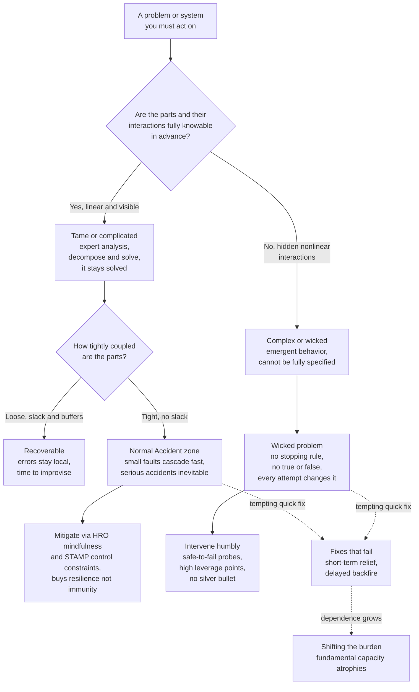

# ⚠️ Systems Failure and Wicked Problems

> [!abstract] TL;DR
> Complex systems do not fail mainly because parts break; they fail because *interactions* between parts produce behavior no one designed or foresaw. Charles Perrow's **Normal Accident Theory** shows that when a system combines **interactive complexity** (hidden, nonlinear couplings operators cannot see) with **tight coupling** (no slack, fast propagation, no time to intervene), serious accidents become a *normal*, structural property of the system — not operator error, not bad luck. Three Mile Island and the Challenger are the canonical cases; **High Reliability Organizations** are the counter-argument that disciplined *mindfulness* can beat the odds. Many of the hardest problems are worse than complicated: they are **wicked** (Rittel & Webber) — no definitive formulation, no stopping rule, no true-or-false solutions (only better or worse), every one unique and one-shot, and each a symptom of deeper problems. Climate change is **super-wicked** (time is running out, no central authority, those who cause it must solve it, we irrationally discount the future). The core competence is telling **complicated** (solvable by experts, decomposable) from **complex** (manageable, never "solved") — the heart of the **Cynefin** framework — and then intervening *humbly*: no silver bullets, expect **policy resistance** and unintended consequences, beware **fixes that fail** and **shifting the burden**, and treat the system as a partner to dance with, not a machine to yank.

---

## Intuition

**Analogy:** Compare **untangling a knot** with **calming an argument between two people.**

A knot is *complicated*. It may be maddeningly intricate, but it holds still while you work, it has a definite solution, an expert can solve it, and — crucially — once solved it *stays* solved. You can even cut it into sections and work each independently. This is a **tame problem**: fully specifiable, decomposable, and finished when it is finished.

An argument is *complex* and, if it is about deep values, *wicked*. The moment you intervene you *change* it — your attempt becomes part of the problem. There is no "correct" resolution, only outcomes that are better or worse and that people will disagree about. You get **one shot**: you cannot rewind and try a cleaner opening line, because the people now remember your first one. There is no bell that tells you it is "solved"; you simply run out of time, patience, or budget and stop. And what looked like *the* problem ("they are being stubborn") turns out to be a *symptom* of something deeper (a decade of unmet needs). Treating the argument like a knot — analyze it, decompose it, apply the expert fix — is exactly the move that makes it worse. Systems failure, at its root, is the mistake of reaching for the knot-untangling toolkit when you are standing in front of an argument.

---

## How It Works

### 1. Why complex systems fail: interactions, not components

Reliability engineering assumes failures propagate along *chains*: part A breaks, which breaks B, which breaks C. Add redundancy to each part and you drive the chain's probability toward zero. This works beautifully for **complicated** systems (a jet engine, a bridge) where interactions are *linear* — visible, expected, and traceable.

It fails for genuinely **complex** systems because the dangerous failures come from **unplanned interactions between components that were each working correctly**. Two independent, individually harmless faults meet in a way no designer imagined, at a speed no operator can follow. You cannot add redundancy against an interaction you never anticipated — and redundancy itself *adds* complexity, creating new hidden interactions. This is the deep reason complex systems are, in Richard Cook's phrase, "always running in degraded mode": they are riddled with latent faults that only become lethal in combination.

### 2. Perrow's two dimensions: interactive complexity and tight coupling

Charles Perrow (*Normal Accidents*, 1984), analyzing Three Mile Island, argued that accident-proneness is a **structural** property living on two axes:

- **Interactive complexity** — do components interact in *linear* (sequential, visible, expected) ways, or in *complex* (branching, hidden, nonlinear, feedback-laden) ways that produce interactions operators cannot see, understand, or predict *in real time*? High complexity means the system can present its operators with a situation that is literally *incomprehensible* while it is happening.
- **Coupling** — is the system **loosely coupled** (slack, buffers, substitutable parts, time to improvise a recovery) or **tightly coupled** (invariant sequences, no slack, one path, failures propagate in seconds with no time to intervene)?

A system that is **high on both axes** — nuclear power plants, chemical plants, nuclear weapons handling, space missions, parts of the financial system — has, Perrow argued, **normal accidents** (a.k.a. *system accidents*): serious accidents that are *inevitable in the long run* because the very features that make the system powerful also guarantee that unforeseen interactions will eventually meet an environment with no slack to absorb them. The accident is "normal" not because it is frequent but because it is *built into the structure*. Blaming the operator is then a category error: the operators were handed an incomprehensible situation and no time.

- **Three Mile Island (1979):** a minor maintenance event, a stuck-open relief valve, and an *ambiguous* indicator light combined so that operators, acting reasonably on the information they had, made the partial meltdown worse. No single part "failed" catastrophically; the *interaction* did.
- **Challenger (1986):** the technical trigger was O-ring failure in cold weather, but Diane Vaughan's classic study reframed it as **normalization of deviance** — an organization that, under schedule pressure, repeatedly redefined prior anomalies as "acceptable risk" until the deviant became the normal. The *organization* was the tightly-coupled, complexly-interacting system that failed.

### 3. The counter-argument: High Reliability Organizations (HRO)

If Perrow is right, disaster is only a matter of time. The **HRO** school (Weick & Sutcliffe; La Porte; Roberts) studied organizations that run terrifyingly hazardous technology — nuclear aircraft carriers, air-traffic control, nuclear plant operations — yet have *far* fewer accidents than the odds predict. Their edge is **collective mindfulness**, five habits that keep an organization's picture of reality honest:

1. **Preoccupation with failure** — treat every small anomaly and near-miss as a symptom, never explain it away.
2. **Reluctance to simplify** — resist the tidy story; preserve the messy detail that early warnings hide in.
3. **Sensitivity to operations** — keep leaders attentive to the actual front line, not an abstract dashboard.
4. **Commitment to resilience** — assume you *will* be surprised; build the capacity to contain and recover, not just to prevent.
5. **Deference to expertise** — in a crisis, decision authority migrates to whoever knows most, regardless of rank.

The Perrow-versus-HRO debate is unresolved and productive: Perrow says *structure* makes catastrophe inevitable; HRO says *culture and practice* can bend the odds. The mature position is that HRO practices genuinely lower accident rates but cannot repeal the structural risk of a truly tightly-coupled, complexly-interactive system — they buy resilience, not immunity.

### 4. Leveson's STAMP: accidents as control failures, not chains

Nancy Leveson (*Engineering a Safer World*, 2011) modernizes this into **STAMP** (Systems-Theoretic Accident Model and Processes). Her move: stop modeling accidents as *chains of failure events* and start modeling **safety as an emergent control property**. A system is safe when a set of **control constraints** (interlocks, procedures, feedback, human oversight) keep it inside a safe operating envelope. Accidents happen when the **control structure** is inadequate — a missing feedback path, a controller with a wrong mental model of the plant, unenforced constraints, or dysfunctional interactions between controllers — *even if every physical component works perfectly*. STPA (the hazard-analysis method built on STAMP) hunts for *unsafe control actions* rather than failed parts. This directly connects safety to [[Cybernetics_and_Control]]: safety is a regulation problem, and a regulator that cannot see or match the system's variety will lose control.

### 5. Tame vs wicked: Rittel & Webber

Horst Rittel and Melvin Webber (*Dilemmas in a General Theory of Planning*, 1973) noticed that social-planning problems resist the scientific-engineering method that tames technical problems. They defined **wicked problems** by ten properties; the load-bearing ones:

- **No definitive formulation** — how you state the problem already embeds a theory of its solution; framing *is* the fight.
- **No stopping rule** — nothing tells you it is solved; you stop when you run out of time, money, or patience.
- **Solutions are not true-or-false, only better-or-worse** — and stakeholders judge better/worse by conflicting values.
- **No immediate and no ultimate test** — consequences ripple out over years, so you cannot fully evaluate a solution.
- **Every solution is a "one-shot operation"** — no trial-and-error; every attempt changes the situation irreversibly and leaves consequences.
- **Every wicked problem is essentially unique** — no reliable catalog of solved cases to copy from.
- **Every wicked problem is a symptom of another problem** — the causal web has no natural boundary; where you cut it determines the "problem."
- **The planner has no right to be wrong** — unlike a scientist, whose refuted hypothesis is normal science, the planner is liable for the lives affected.

Poverty, healthcare, urban planning, drug policy, and climate are archetypal. The point is not that these problems are *hard* — hard is tame-and-difficult, like factoring a large number. Wicked is a different *kind*: the problem will not hold still to be solved.

### 6. Super-wicked problems

Levin, Cashore, Bernstein & Auld (2012) added a category for problems like **climate change**, layering four features on top of wickedness:

1. **Time is running out** — delay forecloses options irreversibly.
2. **No central authority** — or only a weak one; the problem is planetary, governance is fragmented.
3. **Those seeking to solve it are also causing it** — we are the emitters trying to cut emissions.
4. **Policies irrationally discount the future** — present-biased institutions systematically undervalue long-run harm.

Their prescription flips conventional planning: rather than seeking an optimal global agreement first, deploy interventions that **trigger self-reinforcing feedback** (path-dependent lock-in of clean technology, "sticky" policies that expand their own support over time) — using the same reinforcing-loop dynamics that normally *cause* runaway problems to instead entrench a solution.

### 7. Cynefin: complicated is solvable, complex is only manageable

Dave Snowden's **Cynefin** framework gives the decisive diagnostic — matching *sense-making* to the kind of system you are in:

- **Clear / Simple** (obvious cause-effect): *sense → categorize → respond*; apply **best practice**.
- **Complicated** (knowable cause-effect, needs expertise): *sense → analyze → respond*; apply **good practice**; experts and analysis *solve* it. Knots live here.
- **Complex** (cause-effect only visible in hindsight, emergent): *probe → sense → respond*; run **safe-to-fail experiments**, amplify what works, dampen what does not. You *manage* it; you never *solve* it.
- **Chaotic** (no discernible cause-effect): *act → sense → respond*; do something to establish stability first, then move toward complexity.
- **Disorder / Confusion** (the center): you do not yet know which domain you are in — the most dangerous place, because people default to whatever domain matches their own expertise.

The signature failure mode is **misdiagnosing a complex problem as complicated** — applying expert analysis, best practices, and confident master-plans to a system that will only reveal its behavior *after* you perturb it. That is how competent, well-resourced institutions produce spectacular failures.

### 8. Policy resistance, fixes that fail, and shifting the burden

Complex social systems exhibit **policy resistance**: their feedback loops absorb and neutralize well-intentioned interventions, so the harder you push, the more the system pushes back (see [[Leverage_Points_and_Mental_Models]]). Two of Peter Senge's **system archetypes** explain the most seductive traps:

- **Fixes that fail:** a quick fix relieves the *symptom* fast, but triggers a *delayed* side-effect that eventually makes the underlying problem worse — so the symptom returns, larger, demanding a bigger fix. Painkillers masking an injury; debt covering a cash shortfall; suppressing every small forest fire until fuel accumulates for a mega-fire.
- **Shifting the burden:** a symptomatic fix works well enough that it *atrophies* the system's capacity to apply the fundamental solution, creating dependence on the fix and eroding the real remedy (outsourcing a core skill; relying on caffeine instead of sleep; bailouts instead of reform).

Both are **fallacy-of-decomposition** failures: you optimized a part (the visible symptom) and degraded the whole, because in a complex system the parts are not separable — the interactions *are* the system.

### 9. Robustness-fragility and why silver bullets fail

Every complex system embodies a **robustness-fragility tradeoff**: optimizing it to be robust against the shocks you *expect* makes it fragile to the ones you do not (see [[Resilience_and_Robustness]]). Tight coupling and efficiency raise throughput *and* raise the size of the eventual cascade (see [[Cascades_and_Systemic_Risk]]). So the humble stance Donella Meadows urges in *Dancing with Systems* is not modesty for its own sake — it is the *correct* response to a system whose full behavior is unknowable in advance: get the beat of the system before intervening, use small **safe-to-fail probes**, expose your mental models, watch for delayed consequences, and give up the fantasy of the one clean master-solution.



---

## Key Concepts

### Secondary (intuitive level)
- **Complicated vs complex:** a knot is complicated — hard but solvable and it stays solved; an argument is complex — you change it by touching it and it never "stays solved."
- **Normal accident:** in some systems, serious accidents are *built in* — not caused by one careless person, but by the way the parts secretly interact with no time to react.
- **Tight coupling:** no slack. When something goes wrong there is no buffer and no time to fix it before it spreads.
- **Wicked problem:** a problem with no clear definition, no clear finish line, and no simple right answer — only better or worse.
- **Fixes that fail:** the quick fix feels great now but quietly makes the real problem worse later.

### Undergraduate (structural level)
- **Perrow's two axes:** *interactive complexity* (hidden nonlinear interactions operators cannot see) times *coupling* (slack vs no slack); high-high systems have normal accidents.
- **The Perrow / HRO debate:** structure makes catastrophe inevitable (Perrow) versus disciplined *collective mindfulness* can beat the odds (Weick & Sutcliffe) — resolved as "HRO buys resilience, not immunity."
- **Rittel & Webber's wicked criteria:** no definitive formulation, no stopping rule, better/worse not true/false, one-shot, unique, symptom of deeper problems.
- **Cynefin domains:** clear, complicated, complex, chaotic, disorder — and the matching action loop for each (*sense-analyze-respond* for complicated, *probe-sense-respond* for complex).
- **System archetypes:** *fixes that fail* (delayed side-effect returns the symptom worse) and *shifting the burden* (the fix atrophies the fundamental solution).
- **Policy resistance:** feedback loops absorb interventions, so pushing harder yields diminishing or reversed returns.

### Graduate (critical level)
- **Super-wicked problems (Levin et al.):** time running out, no central authority, causers are the solvers, irrational future-discounting — and the counter-strategy of engineering *reinforcing* lock-in for solutions.
- **STAMP / STPA (Leveson):** safety recast as an *emergent control property*; accidents arise from inadequate control structures and unsafe control actions, not from component-failure chains — a systems-theoretic, not reliability-theoretic, model.
- **Normalization of deviance (Vaughan):** organizational learning can *lower* the perceived risk boundary over time, so an institution drifts into failure while every local decision looks reasonable — the sociological engine behind Challenger and Columbia.
- **Drift into failure (Dekker) and the "efficiency-thoroughness trade-off" (Hollnagel):** under competitive pressure, systems continuously migrate toward the boundary of safe operation because efficiency is rewarded and the margin is invisible until it is gone.
- **Fallacy of decomposition for wicked problems:** because the interactions constitute the system, optimizing separable parts (the visible symptoms) is not merely insufficient but actively harmful; requisite variety and holistic framing are prerequisites, not luxuries.
- **The robustness-efficiency-fragility frontier:** tight coupling and optimization increase expected throughput while convexly increasing tail-risk cascade magnitude — so a *value-maximizing* coupling exists that is strictly interior, and cost pressure systematically pushes systems past it.

---

## Python Demo

```python
# TWO FAILURE SIGNATURES OF COMPLEX SYSTEMS (numpy + matplotlib only).
#
# PANEL A -- "Fixes that fail": a delayed-feedback system-dynamics model.
#   We track a problem SYMPTOM under three policies:
#     - do nothing            : symptom sits at its baseline level
#     - quick fix (symptomatic): relieves the symptom NOW, but the fix builds
#                                a side-effect stock that, after a delay, drives
#                                the symptom back ABOVE baseline (the trap)
#     - fundamental solution   : slow to bite, addresses the root inflow, and
#                                ends far better with no backfire
#
# PANEL B -- Tight-coupling tradeoff: raising coupling/efficiency raises
#   throughput linearly but raises expected CASCADE loss convexly, so the net
#   value of the system peaks at an INTERIOR coupling and then collapses --
#   the structural reason "more efficient" eventually means "more fragile".

import numpy as np
import matplotlib.pyplot as plt

# ----------------------------------------------------------------------------
# PANEL A : fixes that fail (Euler integration of a stock-and-flow model)
# ----------------------------------------------------------------------------
def simulate(policy, T=160, dt=1.0,
             inflow=1.0, d=0.10,          # root problem inflow, natural decay
             kf=0.50,                     # quick-fix strength (relief per unit symptom)
             ks=0.50, tau=10.0, kb=0.22,  # side-effect gen, its decay time, backfire gain
             tau_root=20.0):              # how fast a fundamental fix reduces the root inflow
    n = int(T / dt)
    S = np.zeros(n)          # observed problem SYMPTOM
    SE = np.zeros(n)         # hidden SIDE-EFFECT stock created by the quick fix
    S[0] = inflow / d        # start at the baseline equilibrium (= 10)
    for t in range(n - 1):
        if policy == "nothing":
            fix = 0.0
            in_eff = inflow
            dSE = 0.0
        elif policy == "quickfix":
            fix = kf * S[t]                         # symptomatic relief, acts immediately
            in_eff = inflow                         # root cause left untouched
            dSE = ks * fix - SE[t] / tau            # side effect builds, decays slowly
        else:  # "fundamental": attack the root inflow, no symptomatic fix
            fix = 0.0
            in_eff = inflow * np.exp(-(t * dt) / tau_root)
            dSE = 0.0
        dS = in_eff - d * S[t] - fix + kb * SE[t]   # kb*SE is the DELAYED backfire
        S[t + 1] = max(0.0, S[t] + dS * dt)
        SE[t + 1] = max(0.0, SE[t] + dSE * dt)
    return np.arange(n) * dt, S

t, S_none = simulate("nothing")
_, S_qf   = simulate("quickfix")
_, S_fund = simulate("fundamental")

# ----------------------------------------------------------------------------
# PANEL B : coupling / efficiency vs cascade risk tradeoff
# ----------------------------------------------------------------------------
c = np.linspace(0.0, 1.0, 400)            # coupling / efficiency knob in [0, 1]
throughput = c                            # more coupling -> more efficiency/output
cascade_loss = 0.9 * c**4                 # prob(spread) ~ c times cascade size ~ c^3
net_value = throughput - cascade_loss     # what you actually keep
c_star = c[np.argmax(net_value)]          # value-maximizing coupling (interior!)

# ----------------------------------------------------------------------------
# Plot
# ----------------------------------------------------------------------------
fig, (axA, axB) = plt.subplots(1, 2, figsize=(13, 5))

axA.axhline(S_none[0], color="gray", ls=":", lw=1.5, label="baseline (do nothing)")
axA.plot(t, S_qf,   color="crimson",   lw=2, label="quick fix (symptomatic)")
axA.plot(t, S_fund, color="seagreen",  lw=2, label="fundamental solution")
axA.annotate("relief first\n(feels like it works)", xy=(12, 5.5),
             xytext=(35, 3.0), fontsize=8,
             arrowprops=dict(arrowstyle="->", color="crimson"))
axA.annotate("...then backfires\nworse than baseline", xy=(140, S_qf[-5]),
             xytext=(70, 16), fontsize=8,
             arrowprops=dict(arrowstyle="->", color="crimson"))
axA.set_title("A: Fixes that fail (delayed backfire)")
axA.set_xlabel("time"); axA.set_ylabel("problem symptom S")
axA.legend(fontsize=8, loc="upper left")

axB.plot(c, throughput,   color="steelblue", lw=2, label="throughput (efficiency)")
axB.plot(c, cascade_loss, color="crimson",   lw=2, label="expected cascade loss")
axB.plot(c, net_value,    color="black", lw=2.5, label="net value kept")
axB.axvline(c_star, color="seagreen", ls="--", lw=1.5,
            label=f"optimal coupling c* = {c_star:.2f}")
axB.fill_between(c, net_value, 0, where=(c > c_star), color="crimson", alpha=0.10)
axB.set_title("B: Tight coupling -- efficiency vs cascade risk")
axB.set_xlabel("coupling / efficiency  c"); axB.set_ylabel("value (arb. units)")
axB.legend(fontsize=8, loc="lower center")

plt.tight_layout()
plt.show()

print(f"Quick-fix symptom ends at {S_qf[-1]:.1f} vs baseline {S_none[0]:.1f} "
      f"(WORSE) and fundamental {S_fund[-1]:.1f} (much better).")
print(f"Value-maximizing coupling c* = {c_star:.2f}; beyond it, cascade risk "
      f"overwhelms every extra unit of efficiency.")
```

Running it produces two panels. **Panel A** is the fix-that-fails signature: the quick fix drops the symptom *below* baseline almost immediately (it genuinely feels like it is working), but the hidden side-effect stock accumulates and, after a delay, drives the symptom *up past the baseline* to a worse steady state — the reinforcing backfire overwhelms the balancing relief. The fundamental solution moves slower at first (no instant relief) yet decays the problem toward zero permanently. The lesson is the archetype's whole point: *the more you rely on the fix that feels fast, the worse the long-run problem gets.* **Panel B** shows why tightening coupling to chase efficiency is self-limiting: throughput rises linearly, but expected cascade loss (probability of propagation times cascade size) rises convexly, so **net value peaks at an interior coupling `c*`** and collapses beyond it. Efficiency pressure that pushes the system past `c*` is buying throughput with tail-risk it cannot see — the quantitative face of the robustness-fragility tradeoff and of Perrow's tight-coupling danger.

---

## Real-World Applications

- **Nuclear and process safety:** Three Mile Island (Perrow's founding case), Chernobyl, Bhopal, and Fukushima are studied as system/normal accidents where correct-but-interacting components, tight coupling, and incomprehensible real-time state defeated competent operators. STAMP/STPA is now used in nuclear, aerospace, and automotive safety to design *control constraints* rather than merely stack up redundancy.
- **Aerospace and NASA:** Challenger and Columbia are the textbook cases of **normalization of deviance** — an organization slowly redefining anomalies as acceptable under schedule and budget pressure — and are why HRO mindfulness (preoccupation with failure, deference to expertise) is now safety doctrine.
- **Finance:** the 2008 crisis was a tightly-coupled, complexly-interactive **normal accident** of the financial network; efficiency optimization (leverage, interconnection, just-in-time funding) maximized throughput and minimized visible slack, producing exactly Panel B's over-coupled, fragile regime (see [[Cascades_and_Systemic_Risk]]).
- **Public policy and planning:** poverty, homelessness, drug policy, and healthcare reform are the original wicked problems; the repeated failure of confident master-plans and "silver bullet" reforms is *policy resistance* plus *fixes that fail*, and is documented across [[Regulatory_Politics_and_Administrative_Law]] and [[Policy_Analysis_and_the_Policy_Process]].
- **Climate change:** the paradigm **super-wicked** problem; the Levin et al. strategy of triggering self-reinforcing clean-technology lock-in (rather than waiting for an optimal global treaty) is now visible in the falling-cost dynamics of solar and batteries.
- **Software and site reliability:** Richard Cook's "How Complex Systems Fail" and modern SRE practice treat production systems as always-degraded, interaction-driven, and defended by resilience (blameless post-mortems, chaos engineering, safe-to-fail deploys) rather than the illusion of zero-defect components.

---

## Common Pitfalls

- **Treating a complex problem as complicated.** The master failure: applying expert analysis, best practices, and a confident up-front master-plan to a system whose behavior only emerges *after* you perturb it. Use safe-to-fail probes, not blueprints, in the complex domain.
- **Blaming the operator ("human error").** In a normal accident the operators were handed an incomprehensible situation with no time. "Human error" is usually the *starting point* of an investigation mislabeled as its conclusion; the real cause is the control structure and the coupling.
- **Mistaking the quick fix's relief for success.** Because fixes-that-fail relieve the symptom *first* and backfire *later*, the delay hides the causation. Always ask what stock the fix is quietly building and when it will feed back.
- **Optimizing efficiency until fragility is invisible.** Slack, buffers, and redundancy look like waste on a spreadsheet, so competitive pressure strips them out — pushing the system past `c*` into the fragile regime where the next unforeseen interaction cascades.
- **The fallacy of decomposition on a wicked problem.** Breaking a wicked problem into "solvable" sub-problems and optimizing each independently degrades the whole, because the *interactions between the parts are the problem*.
- **Expecting a stopping rule.** Wicked problems have none; teams burn out or declare false victory looking for a "solved" state that does not exist. Reframe success as *steering toward better*, continuously, not *reaching solved*.
- **Believing HRO or STAMP grants immunity.** They lower accident *rates* and buy *resilience*; they do not repeal the structural inevitability Perrow identified for genuinely tightly-coupled, complexly-interactive systems.

---

## Related Concepts

- [[Resilience_and_Robustness]] — the robustness-fragility tradeoff: optimizing for expected shocks creates fragility to unforeseen ones, the deep reason silver-bullet hardening fails.
- [[Cascades_and_Systemic_Risk]] — the dynamic mechanism by which a single fault in a tightly-coupled network becomes a system-wide failure (Panel B made concrete).
- [[Leverage_Points_and_Mental_Models]] — where and how to intervene in a system, why shallow parameter fixes meet policy resistance, and Meadows' "Dancing with Systems" humility.
- [[Cybernetics_and_Control]] — Leveson's STAMP recasts safety as a control/regulation problem; requisite variety explains why a regulator that cannot match the system's variety loses control.
- [[Feedback_Loops_and_Causality]] — balancing vs reinforcing loops and delays are the machinery of "fixes that fail" and "shifting the burden."
- [[Complex_Adaptive_Systems]] — the substrate on which wicked, emergent, non-decomposable behavior arises.
- [[Nonlinearity_and_Feedback]] — nonlinear interaction, not component fragility, is what makes complex-system failure unpredictable.
- [[Criticality_and_Phase_Transitions]] — tightly-coupled systems poised near criticality produce the heavy-tailed cascade sizes of Panel B.
- [[Stocks_Flows_and_System_Dynamics]] — the stock-and-flow model behind the Python demo's delayed backfire.
- [[Decision_Making_Under_Uncertainty]] — decision theory under deep uncertainty, where wicked problems and irreducible surprise defeat naive expected-utility optimization.
- [[Policy_Analysis_and_the_Policy_Process]] — the public-policy account of why interventions meet resistance and produce unintended consequences.
- [[Regulatory_Politics_and_Administrative_Law]] — how regulators try (and fail) to impose control constraints on complex socio-technical systems.

---

## Review Questions

1. **(Secondary / Understanding)** Using the knot-vs-argument analogy, explain the difference between a *complicated* problem and a *complex* or *wicked* one. Why does the very act of intervening change a wicked problem but not a knot?
2. **(Undergraduate / Application)** A hospital, under budget pressure, cuts nursing staff and adds an automated alerting system to compensate. Symptoms (missed alarms) drop for six months, then serious incidents rise above the old level. Map this onto the *fixes that fail* and *shifting the burden* archetypes, name the delayed feedback, and identify the fundamental solution the quick fix was suppressing.
3. **(Graduate / Analysis)** Perrow argues catastrophe is structurally inevitable in tightly-coupled, complexly-interactive systems; HRO researchers argue mindful practice can beat the odds. Using both Panel B's efficiency-vs-cascade tradeoff and Leveson's STAMP, construct a reasoned position on when an organization should (a) invest in HRO mindfulness, (b) redesign the control structure, or (c) *deliberately reduce coupling and efficiency* — and explain why a purely component-reliability strategy cannot resolve the dilemma.

---

## Sources

- Perrow, C. (1999). *Normal Accidents: Living with High-Risk Technologies* (updated ed.). Princeton University Press. (orig. 1984)
- Rittel, H. W. J., & Webber, M. M. (1973). "Dilemmas in a General Theory of Planning." *Policy Sciences*, 4(2), 155-169.
- Levin, K., Cashore, B., Bernstein, S., & Auld, G. (2012). "Overcoming the tragedy of super wicked problems: constraining our future selves to ameliorate global climate change." *Policy Sciences*, 45, 123-152.
- Snowden, D. J., & Boone, M. E. (2007). "A Leader's Framework for Decision Making." *Harvard Business Review*, 85(11), 68-76. (the Cynefin framework)
- Leveson, N. G. (2011). *Engineering a Safer World: Systems Thinking Applied to Safety.* MIT Press.
- Weick, K. E., & Sutcliffe, K. M. (2007). *Managing the Unexpected: Resilient Performance in an Age of Uncertainty* (2nd ed.). Jossey-Bass.

---

#complexity #wicked-problems #normal-accidents #systems-failure #resilience
