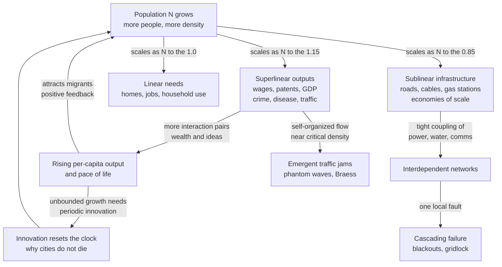

# 🏙️ Urban and Infrastructure Systems

> [!abstract] TL;DR
> A **city is a complex adaptive system**, not a machine: no one designs a metropolis, yet millions of local decisions self-organize into coherent neighborhoods, traffic flows, and economies. The signature discovery — from Geoffrey **West** and Luis **Bettencourt** at the Santa Fe Institute — is that cities obey **quantitative scaling laws**: double a city's population and its socioeconomic output (wages, patents, GDP, crime, disease) grows **superlinearly** by about **115%** (the "**15% rule**"), while its physical infrastructure (roads, gas stations, cables) grows **sublinearly** by only about **85%**, the same economies of scale that make big animals metabolically efficient. Traffic jams, segregation, and cascading blackouts are all **emergent** phenomena of the same underlying logic, and understanding that logic is the difference between planning *with* a city and fighting *against* it.

---

## Intuition

**Analogy:** Think about the difference between a **zoo animal** and the **city it lives in**. An elephant is 10,000 times heavier than a mouse, but it does **not** burn 10,000 times the calories — it burns only about 1,000 times as much. Big bodies are metabolically *efficient*: they share one heart, one circulatory network, one set of plumbing across a huge mass, so the "infrastructure cost per kilogram" falls as the animal grows. This is **Kleiber's law** — metabolism scales with body mass to the **3/4 power**, sublinearly.

Now walk out of the zoo into the city. A metropolis of 8 million people needs *proportionally fewer* miles of road, gas stations, and electrical cable per person than a town of 80,000 — the same economy-of-scale efficiency as the elephant, because everyone shares one road network, one grid, one water system. But here is the twist that makes a city *not* an organism: while its **infrastructure** scales down efficiently, its **social output** scales *up*. Pack more people together and each person, on average, earns more, invents more, walks faster, and (unfortunately) commits more crime and catches disease faster. A city is a machine for turning **social connections** into **wealth and ideas** — and because the number of possible connections grows faster than the number of people, the payoff grows faster than the population. That superlinear social return is why cities, unlike companies and unlike animals, seem to *never stop growing* and *almost never die*.

---

## How It Works

### Core Mechanics

**1. Cities are complex adaptive systems.** A city has no CEO of streets, no central planner of where the coffee shops go. It is built bottom-up from millions of **local decisions** — where to open a shop, which route to drive, which neighborhood to move into — that interact and feed back to produce **emergent** global structure: business districts, ethnic enclaves, rush-hour waves, land-value gradients. Like an ant colony or an economy, the order is **distributed**, not imposed (see [[Complex_Adaptive_Systems]]).

**2. Urban scaling laws.** West and Bettencourt found that an astonishing range of urban quantities $Y$ scale with population $N$ as a **power law**:

$$Y = Y_0 \, N^{\beta}$$

The exponent $\beta$ sorts every urban quantity into three regimes:

- **Superlinear ($\beta \approx 1.15$)** — **socioeconomic outputs** born of human interaction: wages, GDP, patents, R&D employment, restaurants, but *also* crime, contagious disease, and traffic. Doubling population multiplies these by $2^{1.15} \approx 2.22$, a **22% per-capita bonus** — the famous **15% rule** (each doubling adds roughly 15% *per person*). More people means more *pairs* of people who can interact, and interaction is where value and pathology both come from.
- **Sublinear ($\beta \approx 0.85$)** — **physical infrastructure**: length of roads, number of gas stations, electrical cable, water pipes. Doubling population multiplies these by only $2^{0.85} \approx 1.80$, a **built-in efficiency dividend**. Big cities are *greener per capita* because infrastructure is shared — the same [[Fractals_and_Self_Similarity|space-filling network geometry]] that gives Kleiber's 3/4-power metabolism.
- **Linear ($\beta \approx 1.0$)** — individual **human needs** that don't benefit from sharing: jobs, housing units, household water and electricity consumption. One person needs one home whether the city is large or small.

**3. The contrast with biology, and why cities don't die.** Kleiber's law is **sublinear** ($\beta = 3/4$) for *everything* — metabolism, lifespan, heart rate all follow from the sublinear cost of a shared distribution network. Sublinear scaling produces **bounded, S-shaped growth**: an organism grows fast, then stops at a fixed adult size and eventually dies. Companies, West argues, are effectively sublinear too — dominated by bureaucratic economies of scale — so they mature and die on a mortality curve much like organisms. **Cities are different** because their dominant scaling is **superlinear**: the social returns to size *accelerate*, producing **open-ended, super-exponential growth**. That same math predicts a finite-time singularity unless punctuated by **innovation** — each major innovation (steam, rail, computing) resets the clock. Cities almost never die because killing one would require dismantling a superlinear social network that keeps regenerating itself; you can bomb a city flat and it rebuilds, whereas a bankrupt company simply dissolves.

**4. Self-organization in urban form (Jane Jacobs).** Long before West quantified it, **Jane Jacobs** (*The Death and Life of Great American Cities*, 1961) argued that a healthy city is a problem of **"organized complexity"** — not the "disorganized complexity" of statistics nor the "simplicity" of two-variable engineering. Vibrant neighborhoods **self-organize** from **mixed use** (homes, shops, offices interleaved), short blocks, aged buildings, and dense sidewalks that put "**eyes on the street.**" Top-down modernist planning that zoned uses apart and bulldozed for highways *destroyed* the emergent order it could not see. Jacobs is the qualitative twin of West's quantitative laws: both say the city's intelligence lives in **local interaction** (see [[Emergence_and_Self_Organization]]).

**5. Traffic as an emergent phenomenon.** Congestion is not caused by "too many cars" in a simple sense — it is a **phase transition** in a self-organizing flow. The **fundamental diagram** plots traffic *flow* (cars per hour) against *density* (cars per km): flow rises with density up to a **critical density**, then **collapses** into a congested branch where more cars mean *less* throughput. Near that critical point, tiny perturbations — one driver tapping the brakes — propagate **backward** as a **"phantom traffic jam"**: a stop-and-go wave that travels upstream through cars while each individual car crawls forward, a soliton with no cause at its location. **Braess's paradox** delivers the counterintuitive kicker: **adding a road can make everyone's commute *worse***, because selfish route choice ([[Price_of_Anarchy|Nash routing]]) re-equilibrates onto the new link in a way that raises total travel time. Documented empirically in Stuttgart (1969) and New York's 42nd Street (2009), it means *removing* roads sometimes *improves* flow.

**6. Interdependent infrastructure and cascading failure.** A modern city is a **network of networks**: power feeds water pumps, water cools power plants, both depend on communications, communications depend on power. This **interdependence** means a local fault can **cascade** across systems — the 2003 Northeast blackout began with tree contact on one Ohio line and, through coupled control and grid networks, blacked out 55 million people (see [[Cascades_and_Systemic_Risk]]). Interdependent networks are **more fragile** than isolated ones: they undergo **abrupt, discontinuous collapse** rather than graceful degradation.

**7. Segregation dynamics (Schelling).** Thomas **Schelling's** 1971 model shows how **mild individual preferences** produce **stark collective segregation**: if each agent merely wants *at least a third* of its neighbors to be similar — a preference compatible with wanting to live in a mixed area — the emergent pattern is near-total spatial separation. The macro-outcome is **not** a reflection of macro-intent; it is emergent, and it is a warning against reading collective patterns as collective preferences (see [[Agent_Based_Modeling]]).

### Flow / Architecture



---

## Key Concepts

### Secondary
- **A city runs itself.** Nobody decides where all the shops, jobs, and neighborhoods go — they *emerge* from millions of people each making local choices.
- **Bigger is more efficient (physically).** A huge city needs *fewer* roads and pipes *per person* than a small town, because everyone shares the same network — like how a big animal burns fewer calories per kilogram than a small one.
- **Bigger is more productive (socially).** Pack more people together and each person tends to earn more and invent more, because there are more chances to meet and combine ideas. The same crowding also spreads crime and disease faster.
- **Traffic jams appear from nowhere.** One driver braking can create a jam that ripples backward for miles — a "phantom" jam with no crash to explain it.

### Undergraduate
- **The scaling exponent β.** Fit $Y = Y_0 N^{\beta}$ on log-log axes; the slope $\beta$ classifies a quantity as **sublinear** ($<1$, infrastructure), **linear** ($=1$, individual needs), or **superlinear** ($>1$, social output). The 15% rule is $\beta \approx 1.15$.
- **Kleiber's law vs urban scaling.** Biology is uniformly sublinear ($\beta = 3/4$), giving bounded growth and a fixed adult size; cities are dominated by *superlinear* social scaling, giving open-ended growth. Same power-law mathematics, opposite destiny.
- **The fundamental diagram of traffic.** Flow = density × speed; flow peaks at a **critical density**, beyond which the system tips onto a **congested branch**. Congestion is a *phase transition*, not a linear shortage.
- **Braess's paradox.** In a congestion game, adding capacity can raise the Nash-equilibrium travel time for everyone — capacity and throughput are not the same thing.
- **Schelling segregation.** Weak similarity preferences at the individual level produce strong segregation at the collective level; emergent outcomes need not mirror intentions.

### Graduate
- **Bettencourt's interaction-network derivation.** The exponents are not fudge factors: $\beta = 1 + \delta$ for socioeconomic and $\beta = 1 - \delta$ for infrastructure, with $\delta \approx 1/6$ derived from a model where people mix in a $D=2$ space-filling social network with dissipation minimized — predicting both $\approx 1.15$ and $\approx 0.85$ from one geometry.
- **Scale-Adjusted Metropolitan Indicators (SAMIs).** Because the *expected* value of any indicator is set by $N^{\beta}$, a city's real performance is its **residual** from the scaling curve — how much it over- or under-performs its size. This is the statistically correct way to rank cities, not raw per-capita figures.
- **Super-exponential growth and finite-time singularities.** Superlinear scaling makes the growth equation blow up in finite time; the system survives only by **innovation cycles that must arrive faster and faster** — a structural treadmill with a testable prediction about accelerating change (see [[Criticality_and_Phase_Transitions]]).
- **Nagel-Schreckenberg model.** A minimal **cellular automaton** (accelerate, brake to avoid collision, randomize, move) reproduces the fundamental diagram and spontaneous jams from four rules, proving congestion is emergent, not engineered (see [[Cellular_Automata]]).
- **Interdependent-network percolation.** Buldyrev et al. (2010) showed coupled networks exhibit **first-order (discontinuous) percolation transitions** — cascading collapse — whereas single networks fail continuously; a formal account of why coupled infrastructure is catastrophically fragile (see [[Resilience_and_Robustness]]).
- **The digital-twin / smart-city agenda.** Sensor-instrumented cities feed [[Network_Science_Fundamentals|network models]] and agent-based simulations for real-time control, but face the CAS ceiling: an adaptive system reacts to its own model, so prediction and control are fundamentally limited.

---

## Python Demo

We illustrate the **West-Bettencourt urban scaling laws** directly. We synthesize a realistic sample of cities whose populations span three orders of magnitude, then generate two indicators: **wages** (a socioeconomic output that should scale **superlinearly**, true exponent 1.15) and **road length** (infrastructure that should scale **sublinearly**, true exponent 0.85), each with multiplicative log-normal noise. We then **fit the exponent** by ordinary least squares on **log-log axes** and confirm we recover the planted slopes — showing how a single log-log line reveals whether a quantity enjoys the social bonus or the infrastructure discount. Uses only `numpy` and `matplotlib`.

```python
# Urban scaling laws: recover superlinear (wages) and sublinear (roads)
# exponents from synthetic city data via a log-log OLS fit.
# numpy + matplotlib only.
import numpy as np
import matplotlib.pyplot as plt

rng = np.random.default_rng(42)

# --- 1. Synthesize cities: populations from ~30k to ~30M (log-uniform) ---
n_cities = 400
log_pop = rng.uniform(np.log10(3e4), np.log10(3e7), size=n_cities)
pop = 10.0 ** log_pop

# --- 2. Plant known scaling exponents and add log-normal noise ---
BETA_WAGES = 1.15   # superlinear: socioeconomic output (the "15% rule")
BETA_ROADS = 0.85   # sublinear: infrastructure economy of scale
Y0_WAGES   = 50.0   # prefactor (arbitrary units)
Y0_ROADS   = 0.10   # prefactor (arbitrary units)

noise_w = rng.lognormal(mean=0.0, sigma=0.15, size=n_cities)
noise_r = rng.lognormal(mean=0.0, sigma=0.15, size=n_cities)
wages = Y0_WAGES * pop ** BETA_WAGES * noise_w
roads = Y0_ROADS * pop ** BETA_ROADS * noise_r

# --- 3. Fit the exponent = slope of log(Y) vs log(N) (OLS, degree 1) ---
def fit_exponent(N, Y):
    slope, intercept = np.polyfit(np.log10(N), np.log10(Y), 1)
    return slope, 10.0 ** intercept

beta_w_hat, y0_w_hat = fit_exponent(pop, wages)
beta_r_hat, y0_r_hat = fit_exponent(pop, roads)

print("Wages : planted beta = {:.2f}, recovered beta = {:.3f}  -> {}".format(
      BETA_WAGES, beta_w_hat, "SUPERLINEAR" if beta_w_hat > 1 else "sublinear"))
print("Roads : planted beta = {:.2f}, recovered beta = {:.3f}  -> {}".format(
      BETA_ROADS, beta_r_hat, "SUBLINEAR" if beta_r_hat < 1 else "superlinear"))
# Per-capita: wages per person grows with size; road km per person shrinks.
print("Per-capita wages exponent  = {:+.3f} (grows with city size)".format(beta_w_hat - 1))
print("Per-capita road exponent   = {:+.3f} (shrinks with city size)".format(beta_r_hat - 1))

# --- 4. Plot both indicators on log-log axes with fitted lines ---
grid = np.logspace(np.log10(pop.min()), np.log10(pop.max()), 100)
fig, axes = plt.subplots(1, 2, figsize=(13, 5.2))

for ax, (Y, bhat, y0hat, name, ref) in zip(
        axes,
        [(wages, beta_w_hat, y0_w_hat, "Wages (socioeconomic output)", 1.0),
         (roads, beta_r_hat, y0_r_hat, "Road length (infrastructure)", 1.0)]):
    ax.scatter(pop, Y, s=10, alpha=0.35, color="steelblue", label="synthetic cities")
    ax.plot(grid, y0hat * grid ** bhat, color="crimson", lw=2.2,
            label="fit  beta = {:.2f}".format(bhat))
    # A linear (beta = 1) reference anchored at the fit's midpoint for contrast.
    mid = grid[len(grid) // 2]
    y_mid = y0hat * mid ** bhat
    ax.plot(grid, y_mid * (grid / mid) ** 1.0, "k--", lw=1.3,
            label="linear reference beta = 1.0")
    ax.set_xscale("log"); ax.set_yscale("log")
    ax.set_xlabel("Population N (log scale)")
    ax.set_ylabel(name + "  (log scale)")
    ax.set_title(name)
    ax.legend(loc="upper left", fontsize=9)
    ax.grid(True, which="both", ls=":", alpha=0.4)

fig.suptitle("Urban scaling laws: superlinear social output vs sublinear infrastructure",
             fontsize=13)
plt.tight_layout(rect=[0, 0, 1, 0.96])
plt.show()
```

Running it prints recovered exponents of about **1.15** (wages) and **0.85** (roads), and the plots show the wage line **steeper** than the dashed linear reference (each doubling adds a per-capita bonus) while the road line is **shallower** (each doubling saves infrastructure per person). That single slope — above or below 1 — is the entire West-Bettencourt story in one number.

---

## Real-World Applications

> **Example — Santa Fe Institute city analytics and the "15% rule."** When Bettencourt and West pooled census and economic data across thousands of US, European, and Chinese metros, wages, GDP, patents, and violent crime all fell on the *same* superlinear line with $\beta \approx 1.15$, and road surface, electrical cable, and gas-station counts on the *same* sublinear line with $\beta \approx 0.85$ — regardless of country or era. The practical payoff is the **Scale-Adjusted Metropolitan Indicator**: a city's true economic health is its *deviation* from the curve, which is why San Jose (over-performing on patents for its size) and a struggling Rust Belt city of equal population must be judged against their *expected* $N^{1.15}$, not against each other's raw totals.

- **Transport engineering.** The **fundamental diagram** governs highway ramp-metering, variable speed limits, and adaptive signals that keep density *below* the critical point so flow does not collapse. Braess's paradox informs deliberate road *closures* (New York's 42nd Street, Seoul's Cheonggyecheon freeway removal) that *improved* flow.
- **Grid and utility resilience.** After the 2003 Northeast blackout, operators redesigned coupled power-communication networks to arrest [[Cascades_and_Systemic_Risk|cascades]], adding islanding and controlled load-shedding — direct applications of interdependent-network theory.
- **Smart cities and digital twins.** Singapore's *Virtual Singapore* and similar programs run agent-based and network simulations on live sensor feeds for congestion, energy, and flood management — operational [[Complex_Adaptive_Systems|CAS]] modeling at city scale.
- **Housing and integration policy.** Schelling's model reframes segregation: because it is emergent from weak preferences, effective policy targets the **tipping dynamics** (mixed-income mandates, anchor institutions) rather than assuming residents *intend* separation.
- **Epidemic response.** Superlinear scaling of contagious disease with density shaped COVID-era models that treated dense metros as higher-transmission environments requiring earlier, sharper intervention.

---

## Common Pitfalls

- **Treating a city like a machine.** The classic modernist error (Le Corbusier, urban renewal): assume the city is *complicated* with a blueprint, bulldoze the emergent order Jacobs described, and destroy the very interactions that generated value. Cities are **cultivated, not engineered**.
- **Reading superlinear scaling as universally good.** The *same* exponent that boosts wages and patents boosts crime, disease, and traffic. Bigness is a **package deal**: you cannot buy the innovation dividend without the pathology dividend.
- **Confusing per-capita rankings with performance.** Because expected output is $N^{\beta}$, ranking cities by raw per-capita GDP systematically flatters large cities and penalizes small ones. Always compare against the **scaling-law expectation** (residuals / SAMIs).
- **Assuming more roads means less congestion.** **Induced demand** and **Braess's paradox** mean added capacity often fills up or even worsens flow. Capacity ≠ throughput.
- **Fitting a power law to a short population range.** A power-law slope estimated over less than an order of magnitude of population is unreliable; scaling claims need data spanning multiple decades of $N$, plus checks against log-normal or piecewise alternatives.
- **Designing coupled infrastructure as if it were independent.** Optimizing power, water, and comms in isolation ignores the **discontinuous, first-order collapse** that interdependence creates. Redundancy in one layer does not protect against cross-layer cascades.
- **Mistaking emergent segregation for collective intent.** Schelling shows a strongly segregated city can arise from residents who each *prefer* diversity. Inferring group preferences from group patterns is a fallacy.

---

## Related Concepts

- [[Complex_Adaptive_Systems]] — the parent frame: a city is the archetypal CAS, self-organizing from local decisions with no central controller.
- [[Fractals_and_Self_Similarity]] — West's derivation of scaling laws rests on space-filling **fractal networks**; the same geometry underlies Kleiber's 3/4-power biological metabolism.
- [[Emergence_and_Self_Organization]] — Jane Jacobs's "organized complexity" and emergent neighborhood order are this concept applied to urban form.
- [[Cascades_and_Systemic_Risk]] — interdependent urban infrastructure fails through the cascade dynamics analyzed here (blackouts, gridlock).
- [[Network_Science_Fundamentals]] — roads, grids, and pipes are physical networks; their topology governs efficiency and fragility.
- [[Resilience_and_Robustness]] — interdependent-network percolation explains why coupled infrastructure collapses discontinuously rather than gracefully.
- [[Cellular_Automata]] — the Nagel-Schreckenberg model reproduces traffic jams and the fundamental diagram from four local rules.
- [[Agent_Based_Modeling]] — the method behind Schelling segregation and most smart-city simulations.
- [[Criticality_and_Phase_Transitions]] — traffic congestion is a phase transition at critical density; superlinear growth heads toward finite-time singularities.
- [[Price_of_Anarchy]] — the game-theoretic account of Braess's paradox and why selfish routing underperforms coordinated routing.
- [[Nonlinearity_and_Feedback]] — the positive feedback (people attract people) that drives superlinear urban growth.
- [[Urban_Sociology_and_the_City]] — the sociological tradition (Chicago School, Jacobs) that studies the same cities as lived social space.
- [[The_Circulatory_and_Respiratory_Systems]] — the biological space-filling networks whose 3/4-power allometry is the organismal counterpart to sublinear urban infrastructure.

---

## Review Questions

1. **(Conceptual)** Kleiber's law and urban scaling both take the form $Y = Y_0 N^{\beta}$, yet organisms grow to a fixed size and die while cities grow open-endedly and almost never die. Explain how the *sign* of the exponent relative to 1 produces these opposite destinies, and what role innovation plays in the urban case.
2. **(Scenario)** A mayor wants to relieve rush-hour congestion and proposes widening the main arterial highway from four lanes to six. Using the fundamental diagram, induced demand, and Braess's paradox, explain why this may fail to help — and might backfire — and propose an alternative intervention consistent with treating traffic as an emergent, self-organizing flow.
3. **(Trade-off)** Superlinear scaling means a larger city delivers roughly 15% more wages and patents *per capita* per population doubling — but also 15% more crime and faster disease spread. If you were advising a national government deciding whether to concentrate growth in a few mega-cities or spread it across many mid-size cities, what trade-offs (economic, social, infrastructural, resilience) would you weigh, and why can't you get the upside without the downside?

---

## Sources

- Geoffrey West, *Scale: The Universal Laws of Life, Growth, and Death in Organisms, Cities, and Companies* (Penguin, 2017).
- Bettencourt, L. M. A., Lobo, J., Helbing, D., Kühnert, C., & West, G. B. (2007). "Growth, innovation, scaling, and the pace of life in cities." *PNAS*, 104(17), 7301-7306.
- Bettencourt, L. M. A. (2013). "The Origins of Scaling in Cities." *Science*, 340(6139), 1438-1441.
- Jane Jacobs, *The Death and Life of Great American Cities* (Random House, 1961), esp. Ch. 22 "The kind of problem a city is."
- Buldyrev, S. V., Parshani, R., Paul, G., Stanley, H. E., & Havlin, S. (2010). "Catastrophic cascade of failures in interdependent networks." *Nature*, 464, 1025-1028.
- Schelling, T. C. (1971). "Dynamic models of segregation." *Journal of Mathematical Sociology*, 1(2), 143-186.

---

#complexity #cities #urban-scaling #infrastructure #traffic
