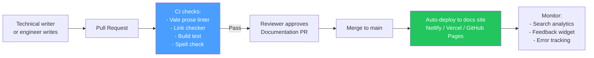

# Docs Workflow

> [!abstract] TL;DR
> A mature docs workflow uses docs-as-code (Markdown in Git, reviewed in PRs, CI validates and publishes), single-source-of-truth patterns (generate API reference from OpenAPI spec, SDK docs from type definitions), and metrics to continuously improve quality. Localization adds a translation layer via tools like Crowdin/Transifex before the final publish step.

## Docs-as-Code Pipeline



### CI Pipeline for Docs

```yaml
# .github/workflows/docs-ci.yml
name: Docs CI

on:
  pull_request:
    paths: ['docs/**', 'openapi.yaml']

jobs:
  lint:
    name: Prose Linting
    runs-on: ubuntu-latest
    steps:
      - uses: actions/checkout@v4
      - uses: errata-ai/vale-action@v2
        with:
          files: docs/
          reporter: github-pr-review

  links:
    name: Link Checker
    runs-on: ubuntu-latest
    steps:
      - uses: actions/checkout@v4
      - run: npm ci
      - run: npm run build        # build the docs site
      - name: Check links
        run: npx linkinator dist/ --recurse --skip "localhost" --verbosity error

  build:
    name: Build Test
    runs-on: ubuntu-latest
    steps:
      - uses: actions/checkout@v4
      - run: npm ci
      - run: npm run build
        env:
          DOCUSAURUS_URL: https://docs.example.com

  openapi-validate:
    name: OpenAPI Spec Validation
    runs-on: ubuntu-latest
    steps:
      - uses: actions/checkout@v4
      - run: npx swagger-cli validate openapi.yaml
```

---

## Single Source of Truth Patterns

### Generate API Reference from OpenAPI Spec

Instead of writing API reference manually (and letting it drift from the real API), generate it automatically:

```bash
# With Docusaurus OpenAPI plugin:
npx docusaurus gen-api-docs example
# Generates docs/api/*.mdx from openapi.yaml automatically

# With Redoc:
npx @redocly/cli build-docs openapi.yaml --output dist/api-reference.html
```

**CI integration:**

```yaml
- name: Generate API reference from OpenAPI spec
  run: |
    npx docusaurus gen-api-docs example
    git diff --exit-code docs/api/  # fail if generated files are out of date
    # This catches: spec changed but generated docs not committed
```

### Generate SDK Docs from TypeScript Types

```typescript
// TypeDoc generates HTML reference from TypeScript JSDoc comments
// Install: npm install typedoc --save-dev

// tsconfig.json and source code with JSDoc → HTML docs

// package.json
{
  "scripts": {
    "docs:sdk": "typedoc --out dist/sdk-reference src/index.ts"
  }
}
```

```yaml
# CI: regenerate and check for drift
- name: Generate SDK reference
  run: npm run docs:sdk
- name: Check SDK reference is up to date
  run: git diff --exit-code dist/sdk-reference/
```

### Changelog Automation

Use `conventional commits` + `semantic-release` to auto-generate changelogs:

```bash
# Commit format: type(scope): description
git commit -m "feat(users): add email verification endpoint"
git commit -m "fix(auth): correct token expiry calculation"
git commit -m "BREAKING CHANGE: rename user.enabled to user.status"

# semantic-release auto-generates:
# - CHANGELOG.md entry for each release
# - GitHub release notes
# - Version bump (semver)
```

```json
// .releaserc.json
{
  "branches": ["main"],
  "plugins": [
    "@semantic-release/commit-analyzer",
    "@semantic-release/release-notes-generator",
    ["@semantic-release/changelog", {
      "changelogFile": "docs/changelog.md"
    }],
    "@semantic-release/github"
  ]
}
```

---

## Localization and i18n

### Docusaurus i18n Setup

```bash
# Add a locale
npx docusaurus write-translations --locale fr
# Creates i18n/fr/code.json and i18n/fr/docusaurus-theme-classic/*.json

# Copy docs for translation
mkdir -p i18n/fr/docusaurus-plugin-content-docs/current
cp -r docs/* i18n/fr/docusaurus-plugin-content-docs/current/
```

```typescript
// docusaurus.config.ts
const config: Config = {
  i18n: {
    defaultLocale: 'en',
    locales: ['en', 'fr', 'de', 'ja'],
    localeConfigs: {
      en: { label: 'English' },
      fr: { label: 'Français' },
      de: { label: 'Deutsch' },
      ja: { label: '日本語' },
    },
  },
};
```

### Translation Workflow with Crowdin

```
1. Source docs in English (Markdown in Git)
         ↓
2. Push to Crowdin (via GitHub integration or CLI)
         ↓
3. Crowdin translators work on translations (community or paid)
         ↓
4. Crowdin pushes translated Markdown back to GitHub branch
         ↓
5. Technical writer reviews translation PR
         ↓
6. Merge → Auto-deploy with translated locale
```

```yaml
# crowdin.yml
project_id: "123456"
api_token_env: CROWDIN_TOKEN

files:
  - source: /docs/**/*.md
    translation: /i18n/%two_letters_code%/docusaurus-plugin-content-docs/current/**/%original_file_name%

  - source: /i18n/en/docusaurus-theme-classic/*.json
    translation: /i18n/%two_letters_code%/docusaurus-theme-classic/%original_file_name%
```

### Transifex Alternative

Transifex is an enterprise-grade translation platform with similar Git integration:
```bash
# Install CLI
pip install transifex-client

# Push source strings
tx push --source

# Pull translations
tx pull --all
```

---

## Docs Site Performance

### Static Generation (SSG)

All major docs site generators (Docusaurus, MkDocs, Sphinx) produce static HTML — no server needed at runtime. This gives:
- Unlimited scale (just a CDN)
- Fast initial page load (no server round-trip)
- Easy caching (HTML rarely changes)

### CDN for Docs

Host built docs on a CDN with global PoPs:

| Platform | CDN | Custom domain | Free tier |
|---|---|---|---|
| Vercel | Vercel Edge Network | Yes | Yes |
| Netlify | Netlify ADN | Yes | Yes |
| GitHub Pages | Fastly CDN | Yes (with CNAME) | Yes |
| Cloudflare Pages | Cloudflare (300+ PoPs) | Yes | Yes |

### Search Indexing

```javascript
// Algolia DocSearch (free for open-source docs)
// Apply at: https://docsearch.algolia.com/apply/

// Once approved, add to Docusaurus:
themeConfig: {
  algolia: {
    appId: 'YOUR_APP_ID',
    apiKey: 'YOUR_SEARCH_API_KEY',  // public search-only key
    indexName: 'YOUR_INDEX_NAME',
    contextualSearch: true,  // respect Docusaurus version filter
  },
},
```

---

## Docs Metrics

Track these to continuously improve documentation quality:

| Metric | Tool | What to look for |
|---|---|---|
| **Page views** | GA4, Plausible | Most/least visited pages |
| **Search queries with no results** | Algolia Dashboard | Topics to add |
| **Search queries with no clicks** | Algolia Dashboard | Misleading page titles |
| **Time on page** | GA4 | < 30s = user didn't engage; > 10min = page is confusing |
| **Page-level NPS ("was this helpful?")** | Custom widget | Lowest-scoring pages |
| **Bounce rate on getting started** | GA4 | If high → onboarding is failing |
| **"404 not found" errors** | Server logs or GA4 | Broken links, moved pages |

### Feedback Widget Implementation

```javascript
// Simple "Was this page helpful?" widget
function FeedbackWidget({ pageId }) {
  const [submitted, setSubmitted] = useState(false);

  const sendFeedback = async (helpful: boolean) => {
    await fetch('/api/docs-feedback', {
      method: 'POST',
      body: JSON.stringify({ pageId, helpful, timestamp: Date.now() }),
    });
    setSubmitted(true);
  };

  if (submitted) return <p>Thanks for your feedback!</p>;

  return (
    <div className="feedback-widget">
      <p>Was this page helpful?</p>
      <button onClick={() => sendFeedback(true)}>👍 Yes</button>
      <button onClick={() => sendFeedback(false)}>👎 No</button>
    </div>
  );
}
```

---

## Common Pitfalls

- **No broken link detection in CI.** Broken links accumulate silently. Add `linkinator` or `htmltest` to CI to catch them on every PR.
- **Generated API docs committed to Git.** Generated files in Git create merge conflicts. Instead, generate them in CI at build time and deploy directly — don't commit them.
- **Localization without a review process.** Machine translation or low-quality community translation can be worse than no translation. Add a native-speaker review step before publishing.
- **Docs metrics without baselines.** "Page views increased 20%" is only meaningful if you know the baseline and what drove the change. Track metrics consistently from launch.
- **Too many CI checks blocking docs PRs.** If Vale flags 200 style warnings on a PR that fixes a typo, writers learn to avoid PRs. Tune Vale aggressiveness and only block on errors, not warnings.

---

## Review Questions

1. What is single-source-of-truth for API documentation, and how does it solve the documentation drift problem?
2. Your CI link checker fails on every PR because of one external URL that's intermittently down. How do you fix this without disabling link checking?
3. Describe the full localization workflow from English source to published French documentation using Crowdin.
4. A docs page has 95% "was this helpful?" thumbs-down. You look at the GA4 data and see 3-minute average time on page. What does this tell you, and what is your next step?
5. Why should generated API reference files (from OpenAPI spec) not be committed to the Git repository?
