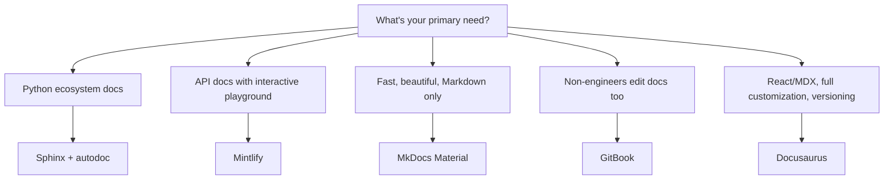

# Documentation Tools

> [!abstract] TL;DR
> Docusaurus (React/MDX) is the go-to for developer docs with versioning and OpenAPI integration. MkDocs + Material theme is the fastest way to a beautiful, Markdown-only site. Sphinx is standard for Python ecosystem projects with auto-generated API docs from docstrings. Mintlify is the modern hosted option with the best OpenAPI playground integration. Vale enforces prose quality in CI.

## Docusaurus

Docusaurus is Meta's open-source documentation site framework. It's the most popular choice for developer documentation.

### Setup

```bash
npx create-docusaurus@latest my-docs classic --typescript
cd my-docs
npm start  # local dev server at localhost:3000
```

### Project Structure

```
my-docs/
  docusaurus.config.ts      ← site config (title, navbar, plugins)
  sidebars.ts               ← sidebar navigation structure
  docs/                     ← documentation Markdown/MDX files
    intro.md
    getting-started.md
    api/
      authentication.mdx
  blog/                     ← optional blog section
  src/
    pages/                  ← custom React pages (landing page etc.)
    css/custom.css          ← theme overrides
  static/                   ← static assets (images, downloads)
```

### MDX — Markdown + React Components

```mdx
---
title: Getting Started
sidebar_position: 1
---

import Tabs from '@theme/Tabs';
import TabItem from '@theme/TabItem';
import CodeBlock from '@theme/CodeBlock';

# Getting Started

<Tabs>
  <TabItem value="npm" label="npm">
    ```bash
    npm install @example/sdk
    ```
  </TabItem>
  <TabItem value="yarn" label="yarn">
    ```bash
    yarn add @example/sdk
    ```
  </TabItem>
  <TabItem value="pnpm" label="pnpm">
    ```bash
    pnpm add @example/sdk
    ```
  </TabItem>
</Tabs>

:::tip
Set `API_KEY` in your environment — never hardcode keys in source files.
:::
```

### Versioning

```bash
# Create version 2.0 snapshot from current docs
npm run docusaurus docs:version 2.0

# Result:
# versioned_docs/version-2.0/   ← snapshot of current docs
# versioned_sidebars/            ← snapshot of current sidebars
# versions.json                  ← ["2.0"]
```

Version dropdown appears automatically in the navbar. Old versions remain accessible.

### Docusaurus Config (`docusaurus.config.ts`)

```typescript
const config: Config = {
  title: 'Example API Docs',
  url: 'https://docs.example.com',
  baseUrl: '/',
  favicon: 'img/favicon.ico',

  plugins: [
    // OpenAPI plugin — render your OpenAPI spec as interactive docs
    ['docusaurus-plugin-openapi-docs', {
      id: 'api',
      docsPluginId: 'classic',
      config: {
        example: {
          specPath: 'openapi.yaml',
          outputDir: 'docs/api',
          sidebarOptions: { groupPathsBy: 'tag' },
        },
      },
    }],
  ],

  themeConfig: {
    navbar: {
      items: [
        { type: 'doc', docId: 'intro', label: 'Docs' },
        { to: '/docs/api', label: 'API Reference' },
        { href: 'https://github.com/example/sdk', label: 'GitHub' },
      ],
    },
    algolia: {
      appId: 'YOUR_APP_ID',
      apiKey: 'YOUR_SEARCH_KEY',
      indexName: 'docs',
    },
  },
};
```

---

## MkDocs + Material Theme

MkDocs is a Python-based static site generator for documentation. The Material theme by Squidfunk is exceptional.

### Setup

```bash
pip install mkdocs-material
mkdocs new my-docs
cd my-docs
mkdocs serve  # localhost:8000
```

### `mkdocs.yml` Configuration

```yaml
site_name: Example Docs
site_url: https://docs.example.com
repo_url: https://github.com/example/project
repo_name: example/project

theme:
  name: material
  palette:
    - scheme: default
      primary: indigo
      accent: indigo
      toggle:
        icon: material/brightness-7
        name: Switch to dark mode
    - scheme: slate
      primary: indigo
      accent: indigo
      toggle:
        icon: material/brightness-4
        name: Switch to light mode
  features:
    - navigation.tabs
    - navigation.sections
    - navigation.expand
    - search.highlight
    - content.code.copy      # copy button on code blocks
    - content.tabs.link

plugins:
  - search
  - tags
  - blog

markdown_extensions:
  - admonition           # !!! note / !!! warning blocks
  - pymdownx.details     # collapsible sections
  - pymdownx.superfences # nested code blocks, Mermaid diagrams
  - pymdownx.tabbed:
      alternate_style: true
  - pymdownx.highlight:
      anchor_linenums: true

nav:
  - Home: index.md
  - Getting Started:
    - Installation: getting-started/install.md
    - Quickstart: getting-started/quickstart.md
  - API Reference:
    - Authentication: api/auth.md
    - Users: api/users.md
  - Changelog: changelog.md
```

### MkDocs Material Admonitions

```markdown
!!! note
    This is a note callout.

!!! warning "Important"
    This is a warning with a custom title.

??? tip "Click to expand"
    This content is collapsed by default.
```

---

## Sphinx

Sphinx is the Python ecosystem's standard documentation tool. It generates docs from reStructuredText (`.rst`) or Markdown (via MyST parser) and can auto-generate API reference from Python docstrings.

### Setup

```bash
pip install sphinx sphinx-autodoc-typehints myst-parser sphinx-rtd-theme
sphinx-quickstart docs
```

### Auto-Doc from Python Docstrings

```python
# mylib/client.py
class Client:
    """
    The main client for the Example API.

    :param api_key: Your API key, found in the dashboard.
    :type api_key: str
    :param base_url: Override the default API base URL.
    :type base_url: str, optional
    """

    def get_user(self, user_id: str) -> User:
        """
        Retrieve a user by their ID.

        :param user_id: The UUID of the user to retrieve.
        :type user_id: str
        :returns: The user object.
        :rtype: User
        :raises NotFoundError: If no user with ``user_id`` exists.

        Example::

            client = Client(api_key="sk_test_123")
            user = client.get_user("550e8400-e29b-41d4-a716-446655440000")
            print(user.name)
        """
```

```rst
.. automodule:: mylib.client
   :members:
   :undoc-members:
   :show-inheritance:
```

### When to Use Sphinx

- Python projects (auto-doc from docstrings is a major advantage)
- Large projects with complex cross-reference needs (`:ref:`, `:class:`, `:meth:` linking)
- ReadTheDocs hosting (native Sphinx support)
- Academic or technical writing with LaTeX PDF output

---

## GitBook

GitBook is a hosted documentation platform with a WYSIWYG editor plus Markdown support:

- **Good for:** teams where non-engineers need to contribute docs (product, support)
- **Pros:** no setup, WYSIWYG editing, good search, GitHub sync
- **Cons:** vendor lock-in, less flexible than static site generators, pricing per editor

GitBook is best when the documentation team includes non-technical contributors who need a Word-processor-like editing experience.

---

## Mintlify

Mintlify is a modern hosted docs platform optimized for API documentation:

```json
// mint.json
{
  "name": "Example API",
  "logo": "/logo.png",
  "favicon": "/favicon.ico",
  "colors": { "primary": "#4a9eff" },
  "topbarLinks": [
    { "name": "Dashboard", "url": "https://dashboard.example.com" }
  ],
  "navigation": [
    {
      "group": "Getting Started",
      "pages": ["introduction", "quickstart", "authentication"]
    },
    {
      "group": "API Reference",
      "pages": ["api-reference/users/get-user", "api-reference/users/create-user"]
    }
  ],
  "api": {
    "baseUrl": "https://api.example.com/v2",
    "auth": { "method": "bearer" }
  }
}
```

**Mintlify strengths:**
- Best-in-class OpenAPI playground (interactive API calls from docs)
- AI assistant answers questions from your docs
- Fastest time-to-publish (< 30 minutes to a live docs site)
- MDX components out of the box

---

## Vale — Prose Linter

Vale enforces a style guide on your documentation prose:

```bash
pip install vale
# Download styles (Google, Microsoft, etc.)
vale sync
```

```ini
# .vale.ini
StylesPath = .vale/styles

MinAlertLevel = suggestion

[*.md]
BasedOnStyles = Vale, Google
Google.Headings = YES
Google.We = YES     # flag use of "we" (prefer second-person "you")
```

```yaml
# .vale/styles/Custom/ForbiddenWords.yml
extends: substitution
message: "Use '%s' instead of '%s'"
level: warning
swap:
  utilize: use
  leverage: use
  "end users": users
  "e.g.,": "for example,"
```

```bash
# Run Vale on all docs
vale docs/
# output: docs/getting-started.md:12:5: Google.We 'we recommend' should be 'you recommend'
```

**Integrate in CI:**
```yaml
- name: Lint prose with Vale
  uses: errata-ai/vale-action@v2
  with:
    files: docs/
    reporter: github-pr-review  # inline PR comments
```

---

## Tool Selection Guide



---

## Common Pitfalls

- **Docusaurus: versioning too early.** Creating doc versions before v1.0 means maintaining multiple doc sets for an unstable API. Only version docs when you have active users on multiple API versions.
- **MkDocs: no search without plugin.** The default MkDocs has basic search; Material theme's search is much better. Always use the `search` plugin.
- **Sphinx: `.rst` syntax alienates contributors.** If your team doesn't know reStructuredText, switch to MyST parser (Markdown) to lower contribution barriers.
- **Vale: too strict out of the box.** Vale with Google style on an existing doc set will produce hundreds of warnings. Start with `MinAlertLevel = error` and tune up.
- **Using a CMS for docs.** WordPress, Notion, and Confluence don't support docs-as-code workflows well. Use a static site generator with Git integration for developer documentation.

---

## Review Questions

1. What is MDX and why does Docusaurus support it beyond plain Markdown?
2. Compare Sphinx's autodoc capability to Docusaurus. When would you choose Sphinx for an API reference?
3. You're building docs for a Python SDK that must also have a quickstart tutorial and an API reference. Which tool do you choose and why?
4. What does Vale do, and at what stage of the docs workflow should it run?
5. A non-technical product manager needs to contribute to documentation. Which tool would you recommend and why?
