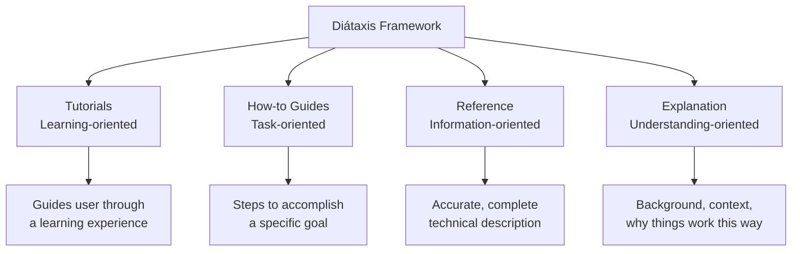
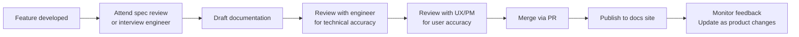

# Technical Writing Overview

> [!abstract] TL;DR
> Technical writers create documentation that helps users (developers, admins, end-users) achieve their goals with a product. Modern technical writing follows docs-as-code philosophy (Markdown in Git, reviewed in PRs, published by CI) and the Diátaxis framework (four distinct documentation types with different purposes). Quality is measured by time-to-hello-world, doc issue rate, and user satisfaction.

## Who Is a Technical Writer

A **technical writer** creates, maintains, and improves documentation. In practice this means:

- Writing API references, tutorials, how-to guides, and conceptual explanations
- Collaborating with engineers to understand what changed and document it accurately
- Advocating for users (developers, admins, end-users) by identifying where they get stuck
- Maintaining documentation quality as the product evolves

**Technical writing roles vary:**
- **Developer Documentation Writer** — focuses on API references, SDKs, tutorials for developers
- **User Documentation Writer** — end-user guides, help center articles, UI strings
- **Content Strategist** — plans the overall information architecture and documentation system
- **DevRel + Technical Writer hybrid** — increasingly common in startups

---

## Docs-as-Code Philosophy

Traditional documentation lived in Word documents or proprietary wikis. Modern developer documentation follows **docs-as-code**:

```
Source: Markdown/AsciiDoc files in Git repository
Review:  Changes proposed via pull requests (same as code)
CI/CD:   Automated build + publish on merge to main
Output:  Static site (Docusaurus, MkDocs, Sphinx)
```

**Benefits:**
- Documentation changes are reviewed with the same rigor as code
- History and blame tracked in Git
- Broken links and markup errors caught in CI
- Documentation lives next to the code it documents (same repo)
- Engineers can contribute to docs using the same tools they use for code

```bash
# Example CI pipeline for docs
name: Docs CI
on: [pull_request]
jobs:
  build:
    steps:
      - uses: actions/checkout@v4
      - run: npm ci
      - run: npx vale .  # prose linter
      - run: npm run build  # Docusaurus build
      - run: npx linkinator docs/build --recurse  # broken link check
```

---

## Documentation Types — Diátaxis Framework

The **Diátaxis framework** (by Daniele Procida) defines four distinct documentation types, each with a different purpose:



| Type | User's need | Analogy |
|---|---|---|
| **Tutorial** | "I want to learn" | Teaching a child to cook |
| **How-to guide** | "I want to accomplish X" | Recipe for a specific dish |
| **Reference** | "I want to look up a fact" | Encyclopedia entry |
| **Explanation** | "I want to understand why" | Article on the history of cooking |

**The critical insight:** mixing these types is the most common documentation mistake. A tutorial that keeps stopping to explain theory is bad. A how-to guide that teaches from scratch is frustrating for experienced users.

### Identifying Each Type

```
Tutorial:     "Get started with our API in 10 minutes"
              "Build your first chatbot with our SDK"

How-to guide: "How to set up webhooks"
              "How to migrate from v1 to v2"
              "How to debug authentication errors"

Reference:    "API endpoints"
              "Configuration options"
              "Error codes and meanings"

Explanation:  "How our rate limiting works"
              "Why we use JWT over session cookies"
              "Our approach to backwards compatibility"
```

---

## Measuring Documentation Quality

| Metric | How to measure | What it tells you |
|---|---|---|
| **Time to hello world** | User testing: time from signup to first API call | Onboarding friction |
| **Doc issue rate** | GitHub issues tagged "documentation" / month | Documentation gap rate |
| **Search queries with no results** | Docs site search analytics | Missing topics |
| **Page-level NPS** | "Was this page helpful?" widget | Per-page quality |
| **Time on page** | Analytics | Too high = confusion; too low = didn't engage |
| **Support ticket deflection** | Support tickets about documented topics | Doc effectiveness |

**Obsessing over the right metric:** "time to hello world" is the highest-leverage metric for developer documentation. If a developer can't get a working code sample in < 5 minutes, your docs have failed the most critical test.

---

## Technical Writing Tools

### Documentation Site Generators

| Tool | Stack | Best for |
|---|---|---|
| **Docusaurus** | React, MDX, Node | Developer docs, API docs, versioning |
| **MkDocs + Material** | Python, Markdown | Simple, fast, excellent theme |
| **Sphinx** | Python, reStructuredText | Python projects, auto-generated API docs |
| **GitBook** | Hosted, Markdown/WYSIWYG | Teams, non-engineers editing docs |
| **Mintlify** | MDX, hosted | SaaS API docs, OpenAPI integration |

### Supporting Tools

| Tool | Purpose |
|---|---|
| **Vale** | Prose linter — enforces style guide (passive voice, readability, brand terms) |
| **Grammarly Business** | Grammar, tone, clarity |
| **Loom** | Quick screen-recording for walkthroughs |
| **Figma** | Screenshots, annotated diagrams, UI walkthroughs |
| **Postman** | API exploration for writing accurate API docs |
| **Stoplight Studio** | OpenAPI editor with live preview |

---

## The Technical Writer Workflow



**Key relationship:** technical writers work most closely with engineers (for technical accuracy) and product managers (for user goals). Without both, docs are either technically wrong or misaligned with what users actually need.

---

## Common Pitfalls

- **Mixing Diátaxis types.** A tutorial that turns into a reference page loses the user. Know which type you're writing and stay in it.
- **Writing for the author, not the reader.** "Our patented XYZ technology enables..." — users don't care about technology names. They care about what it does for them.
- **Documenting the UI, not the task.** "Click the blue button" instead of "Start the export process." UIs change; tasks don't.
- **Documentation written after the fact.** Docs added after launch are rushed and incomplete. Treat documentation as a launch blocker, not a post-launch task.
- **No feedback loop.** Publishing docs without "was this helpful?" widgets or search analytics means you're writing blind. Add measurement from day one.

---

## Review Questions

1. What is the Diátaxis framework, and why does it recommend against mixing documentation types?
2. What is docs-as-code, and what are two concrete benefits over storing docs in Confluence or Word?
3. A user complains your API is "poorly documented." What specific metrics would you look at to diagnose the problem?
4. Your tutorial is 8,000 words. A how-to guide is 200 words. Which is likely more valuable to a new user vs an experienced one? Why?
5. What is "time to hello world" and why is it the most important metric for developer documentation?
