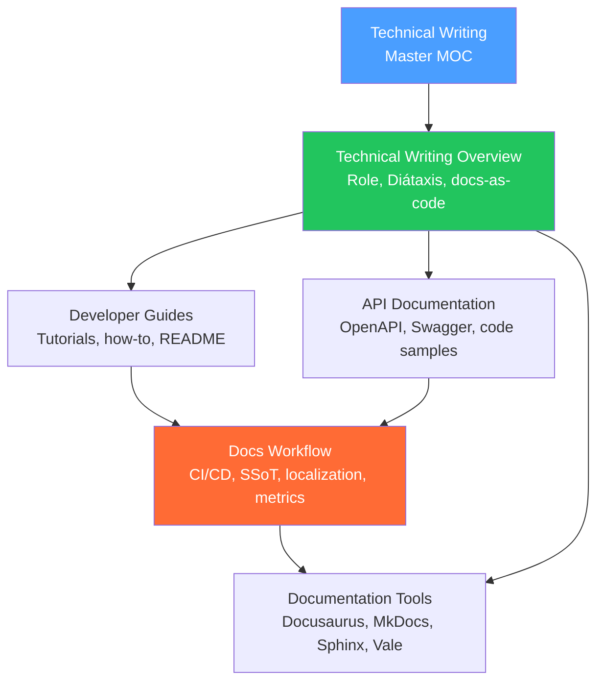

# Technical Writing — Map of Content

> [!info] About this vault
> 5 notes covering the technical writer's craft: the role and Diátaxis framework, API documentation (OpenAPI, interactive docs, code samples), developer guides (tutorials, how-to guides, READMEs), documentation tooling (Docusaurus, MkDocs, Sphinx, Vale), and the docs workflow (CI/CD pipeline, single-source-of-truth, localization, metrics).

---

## Concept Map

---

## Sections at a Glance

| # | Note | Difficulty | Entry Point |
|---|------|------------|-------------|
| 01 | [[Technical_Writing_Overview]] | Beginner | Start here |
| 02 | [[API_Documentation]] | Intermediate | After overview |
| 03 | [[Developer_Guides]] | Intermediate | After overview |
| 04 | [[Documentation_Tools]] | Beginner | Parallel with 02/03 |
| 05 | [[Docs_Workflow]] | Intermediate | After 02/03/04 |

---

## Learning Paths

### Path A — New Technical Writer

For someone entering technical writing from engineering or product:

1. [[Technical_Writing_Overview]] — role, Diátaxis framework, docs-as-code philosophy
2. [[Developer_Guides]] — writing tutorials vs how-to guides (the most common mistake)
3. [[API_Documentation]] — OpenAPI spec, endpoint descriptions, code samples
4. [[Documentation_Tools]] — pick your tool stack (Docusaurus vs MkDocs vs Sphinx)
5. [[Docs_Workflow]] — set up CI/CD, single-source-of-truth, feedback collection

### Path B — Developer Setting Up Docs

For an engineer who needs to set up documentation for their project:

1. [[Documentation_Tools]] — pick the right tool for your stack
2. [[Docs_Workflow]] — docs-as-code pipeline, CI checks (Vale, link checker, build)
3. [[Developer_Guides]] — write a good README and quickstart tutorial
4. [[API_Documentation]] — write or generate the API reference from OpenAPI spec
5. [[Technical_Writing_Overview]] — understand the Diátaxis framework for organizing content

---

## All Notes

| Note | Core Idea | Key Concepts |
|------|-----------|--------------|
| [[Technical_Writing_Overview]] | Technical writer role, docs-as-code (Markdown in Git, CI-published), Diátaxis framework (4 doc types), measuring docs quality | Diátaxis, docs-as-code, time-to-hello-world |
| [[API_Documentation]] | OpenAPI/Swagger spec (YAML, paths, components, examples), good endpoint descriptions (permissions, rate limits, errors), interactive docs (Swagger UI, Redoc, Stoplight), code samples, changelog | OpenAPI, operationId, code samples, changelog |
| [[Developer_Guides]] | Diátaxis in practice: tutorials (linear, always works, learning by doing), how-to guides (problem-oriented, steps only), README structure (install/quickstart/config/contribute), developer portals | Tutorial vs how-to, README, developer portal |
| [[Documentation_Tools]] | Docusaurus (React/MDX, versioning), MkDocs Material (Markdown, fast), Sphinx (Python/autodoc), GitBook (non-engineers), Mintlify (hosted API docs), Vale (prose linter) | Docusaurus, MkDocs, Sphinx, Vale |
| [[Docs_Workflow]] | Docs CI (Vale + link checker + build + OpenAPI validation), single-source-of-truth (generate API ref from spec), Crowdin/Transifex localization, docs site metrics | SSoT, Crowdin, docs metrics, docs CI |

---

## Key Frameworks Quick Reference

| Framework | What it is | Note |
|---|---|---|
| **Diátaxis** | 4 documentation types: tutorials, how-to, reference, explanation | [[Technical_Writing_Overview]], [[Developer_Guides]] |
| **Docs-as-code** | Markdown in Git, PRs, CI builds | [[Technical_Writing_Overview]], [[Docs_Workflow]] |
| **OpenAPI** | REST API description spec (YAML/JSON) | [[API_Documentation]] |
| **Time-to-hello-world** | Primary docs quality metric | [[Technical_Writing_Overview]] |
| **Vale** | Prose style linter | [[Documentation_Tools]], [[Docs_Workflow]] |
| **SSoT** | Single-source-of-truth: generate docs from code | [[Docs_Workflow]] |

---

## Cross-Vault Links

- [[DevRel/_MOC_DevRel_Master|DevRel Master MOC]] — technical writers and DevRel collaborate closely on documentation strategy
- [[Engineering_Leadership/_MOC_Engineering_Leadership_Master|Engineering Leadership MOC]] — documentation is part of technical leadership (ADRs, engineering standards)
- [[AI_Product_Builder/_MOC_AI_Product_Builder_Master|AI Product Builder MOC]] — AI-assisted writing tools and documentation for AI products

#MOC #TechnicalWriting #MasterMOC
