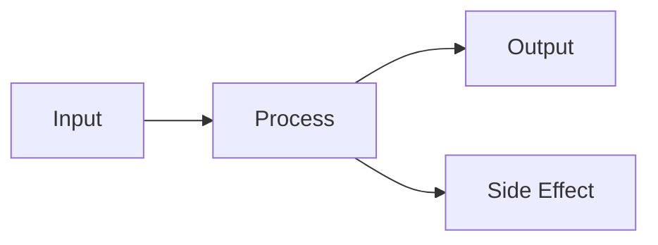

# {{title}}

> [!abstract] TL;DR
> *One sentence: what it is and why it matters.*

---

## Intuition

*Before definitions: what mental model makes this click?*
*Use an analogy from everyday life.*

**Analogy:** ...

---

## How It Works

### Core Mechanics

*Explain the mechanism. Step by step if needed.*

### Flow / Architecture



---

## Code Demo

*Minimal working example — the smallest code that makes it tangible.*

```python
# replace with the relevant language
```

---

## Real-World Example

*A concrete scenario from production systems, a known product, or a common interview question.*

> **Example:** ...

---

## Trade-offs

| Aspect | Pro | Con |
|--------|-----|-----|
| Performance | | |
| Complexity | | |
| Scalability | | |

---

## When to Use vs Avoid

**Use when:**
- 

**Avoid when:**
- 

---

## Common Pitfalls

- **Pitfall 1** — why it happens and how to avoid it
- **Pitfall 2** — why it happens and how to avoid it

---

## Related Concepts

- [[Related Note 1]] — how it connects
- [[Related Note 2]] — how it connects

---

## Review Questions

1. 
2. 
3. 

---

## Sources

- [Source 1](url)

---

#tag1 #tag2
