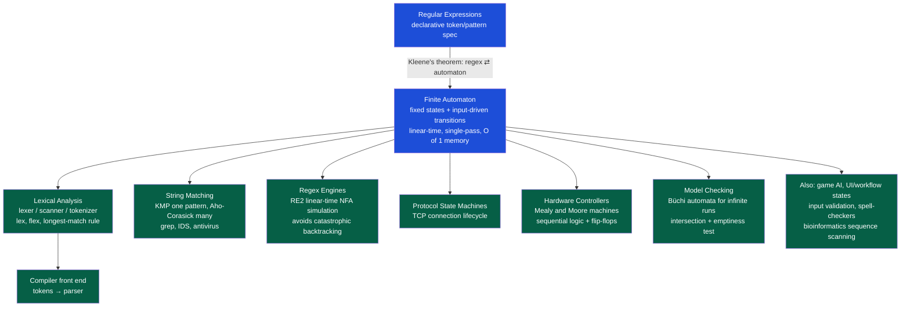

# ⚙️ Applications of Finite Automata

> [!abstract] TL;DR
> A finite automaton is nothing more than a small, fixed set of states plus rules for jumping between them as input arrives — yet that tiny idea powers compilers (lexers), text search (grep, KMP, Aho-Corasick), safe regex engines (RE2), network protocols (the TCP state diagram), digital hardware (Mealy and Moore controllers), and formal verification (model checking with Büchi automata). The practical skill is recognizing when a problem is **regular** — solvable with finite memory in a single linear scan — versus when it needs a stack or full computation.

---

## Intuition

**Analogy:** A **vending machine** is a finite automaton you touch every day. It remembers only one thing — "how much money have I received so far" — as a handful of states: `0¢`, `25¢`, `50¢`, `75¢`. Each coin is an input symbol that pushes it to a new state; reaching `75¢` triggers the "dispense" action and resets it to `0¢`. It does **not** remember the order of coins, who inserted them, or anything from yesterday. Its entire memory is *which state it is in right now*.

Once you see that pattern — **a fixed set of situations, and inputs that move you between them** — you notice it everywhere: a traffic light cycling Green → Yellow → Red, a turnstile that is `Locked` until a valid token arrives, a text-search cursor that "remembers how much of the target word it has matched so far," a TCP socket walking from `CLOSED` to `ESTABLISHED`, or a game enemy switching between `Patrol`, `Chase`, and `Flee`. All of these are finite automata: they react to a stream of inputs by moving through a *small, bounded* number of states. That boundedness is the whole point — it makes them fast, predictable, and cheap to implement in software or silicon.

---

## How It Works

Every application below is the same machine wearing a different costume. Formally a finite automaton is a 5-tuple — states, an input alphabet, a transition function `delta`, a start state, and accepting states — but in practice you only ever need two things: **the current state**, and **a table that says "given this state and this input, go here."** The engine loop is trivial:

```
state = start
for symbol in input_stream:
    state = delta[state][symbol]      # one table lookup, O(1)
check if state is accepting
```

That single loop touches each input symbol exactly once, does O(1) work per symbol, and uses O(1) memory (just `state`). That is why finite automata give **linear-time, single-pass, constant-memory** processing — the property every application exploits.

### The costumes

1. **Lexical analysis (compilers).** The first phase of a compiler is the **lexer** (a.k.a. scanner or tokenizer). Token classes are specified as regular expressions — `[A-Za-z_][A-Za-z0-9_]*` for identifiers, `[0-9]+` for integers — and by **Kleene's theorem** each regex is equivalent to a DFA. Tools like `lex`/`flex` compile all token regexes into one big DFA that walks the source characters once, emitting a stream of tokens. The **longest-match (maximal munch) rule** resolves ambiguity: on input `>=`, the DFA keeps consuming while a longer valid token is still reachable, so it returns `>=` rather than `>` then `=`.

2. **String matching (data structures & algorithms).** Searching for a pattern in text is a finite-automaton problem. **KMP** effectively compiles the pattern into a DFA whose state = "length of the pattern prefix matched so far"; on a mismatch the failure function is precisely the automaton's back-transition, so the text is scanned once with no backtracking. **Aho-Corasick** generalizes this to *many* patterns at once — a trie of all patterns plus failure links — matching a dictionary of thousands of strings in a single linear pass. This is what powers `grep`, intrusion-detection systems (Snort), and antivirus signature scanning (ClamAV).

3. **Regex engines.** A regex-based search can be run two ways. Backtracking engines (PCRE, most language built-ins) can blow up to exponential time on adversarial input — **catastrophic backtracking / ReDoS**. **Automaton-based** engines like Google's **RE2** and `grep` instead simulate an NFA/DFA directly (Thompson's construction), guaranteeing **linear time in the input length** regardless of the regex, at the cost of not supporting backreferences.

4. **Protocol & hardware state machines.** Network protocols are specified as FSMs: the **TCP connection** walks `CLOSED → LISTEN → SYN-RECEIVED → ESTABLISHED → ... → TIME-WAIT`, where each segment received is an input driving a transition. In digital hardware, **Mealy and Moore machines** implement controllers and sequential logic — a state register (flip-flops) plus next-state and output logic realizes exactly `delta`.

5. **Model checking & verification.** To prove a concurrent or safety-critical system never reaches a bad state, you model the system *and* the property as automata. Liveness properties over infinite executions use **ω-automata (Büchi automata)**; a temporal-logic formula is translated to a Büchi automaton, intersected with the system automaton, and checked for **emptiness** — if the intersection is non-empty, that run is a counterexample. This underlies tools like SPIN and hardware verification flows.

### Application Map



---

## Key Concepts

### 🟢 Secondary (intuition, no CS background)
- A finite automaton is a machine that is always in exactly **one of a small, fixed number of states**, and moves between them as inputs arrive (coins, letters, button presses).
- Its only "memory" is *which state it is in* — it cannot count arbitrarily high or remember unlimited history.
- Everyday examples: vending machines, traffic lights, turnstiles, elevator controllers, the "combo counter" in a video game.

### 🔵 Undergraduate (CS core)
- **DFA vs NFA equivalence** and the subset (powerset) construction — both recognize exactly the **regular languages**.
- **Kleene's theorem**: regular expressions and finite automata describe the same class, which is why regex specs can be *compiled* into DFAs for lexers.
- **KMP as a DFA**: the failure function is the automaton's mismatch transition; **Aho-Corasick** is the multi-pattern generalization.
- The **longest-match rule** in lexers; DFA **minimization** to keep the table small.
- The **regular boundary**: languages like balanced parentheses or `aⁿbⁿ` are **not** regular (needs a stack / pushdown automaton) — this is where finite automata stop and parsing begins.

### 🔴 Graduate (research / systems)
- **ω-automata**: Büchi, Rabin, and Streett automata accept *infinite* words, enabling reasoning about non-terminating reactive systems.
- **Automata-theoretic model checking**: translate a Linear Temporal Logic formula to a Büchi automaton, intersect with the system's automaton, and test **language emptiness** for counterexamples.
- **Thompson NFA simulation** (RE2): running an NFA directly in O(n·m) worst case to defeat catastrophic backtracking; symbolic and streaming automata for large alphabets.
- **Levenshtein / edit-distance automata** for fuzzy spell-checking; **weighted / probabilistic automata** in speech and NLP.
- Complexity framing: recognizing when a task is solvable in **O(1) space, one pass** (regular / streaming) versus requiring stack or unbounded memory.

---

## Python Demo

We build the classic **KMP string-matching automaton**: a pattern is compiled once into a DFA transition table `dfa[state][symbol]`, after which scanning any text is a pure single pass — exactly one O(1) table lookup per character, no backtracking. This is the "compile a regex/pattern into a DFA" idea from lexers and `grep`, in miniature. We then visualize the automaton and the state trajectory to *see* the linear single-pass scan.

```python
# KMP pattern -> DFA -> single linear-time scan of text, with visualization.
# Demonstrates the core FA property: O(1) work + O(1) memory PER input symbol.
# numpy / matplotlib only.
import numpy as np
import matplotlib.pyplot as plt


def build_dfa(pattern, alphabet):
    """Compile `pattern` into a KMP DFA (Sedgewick construction).

    dfa[state][c] = next state after reading alphabet symbol c while in `state`.
    State j means: the last j characters read equal the first j chars of pattern.
    Reaching state m == len(pattern) means a full match just completed.
    Build cost: O(m * |alphabet|). Scan cost: O(text length).
    """
    m = len(pattern)
    idx = {ch: i for i, ch in enumerate(alphabet)}
    R = len(alphabet)
    dfa = np.zeros((m + 1, R), dtype=int)

    dfa[0, idx[pattern[0]]] = 1          # only the first pattern char advances
    x = 0                                # "restart" state (simulates back edges)
    for j in range(1, m):
        for c in range(R):
            dfa[j, c] = dfa[x, c]        # mismatch: fall back like restart state
        dfa[j, idx[pattern[j]]] = j + 1  # match: advance one state
        x = dfa[x, idx[pattern[j]]]      # roll the restart state forward
    # Transitions out of the accept state m (lets us find OVERLAPPING matches)
    for c in range(R):
        dfa[m, c] = dfa[x, c]
    return dfa, idx


def scan(text, dfa, idx):
    """Single left-to-right pass. Returns match start indices and state trail."""
    m = dfa.shape[0] - 1
    state = 0
    matches, trail = [], [0]
    for i, ch in enumerate(text):
        state = dfa[state, idx[ch]]      # ONE lookup per character -> linear time
        trail.append(state)
        if state == m:                   # reached accept state -> pattern found
            matches.append(i - m + 1)
    return matches, trail


# --- Run it on sample input ------------------------------------------------
pattern = "ABABAC"
text    = "ABABABACABABABACAB"          # contains two occurrences (overlapping style)
alphabet = sorted(set(text + pattern))  # {'A','B','C'}

dfa, idx = build_dfa(pattern, alphabet)
matches, trail = scan(text, dfa, idx)

print("pattern :", pattern)
print("text    :", text)
print("matches :", matches)             # start indices where 'ABABAC' occurs
# Sanity check against Python's built-in search (naive), confirming correctness:
truth = [i for i in range(len(text) - len(pattern) + 1)
         if text[i:i + len(pattern)] == pattern]
print("verify  :", truth, "==", matches, "->", truth == matches)

# --- Visualize: (top) the automaton, (bottom) the single-pass state trail ---
fig, (ax_a, ax_t) = plt.subplots(2, 1, figsize=(11, 7),
                                 gridspec_kw={"height_ratios": [1, 1.3]})

# Top panel: draw states in a row with the forward (match) transitions
m = len(pattern)
xs = np.arange(m + 1)
ax_a.scatter(xs, np.zeros_like(xs), s=1200,
             c=["#065F46" if s == m else "#1D4ED8" for s in xs], zorder=3)
for s in xs:
    ax_a.text(s, 0, str(s), color="white", ha="center", va="center",
              fontsize=11, fontweight="bold", zorder=4)
for j in range(m):                       # forward "match" edges labeled by pattern
    ax_a.annotate("", xy=(j + 1, 0), xytext=(j, 0),
                  arrowprops=dict(arrowstyle="-|>", color="#111", lw=1.5))
    ax_a.text(j + 0.5, 0.12, pattern[j], ha="center", fontsize=11, color="#B91C1C")
ax_a.text(m, -0.28, "ACCEPT", ha="center", color="#065F46", fontweight="bold")
ax_a.set_title(f"KMP DFA for pattern '{pattern}'  (state j = j chars matched)")
ax_a.set_xlim(-0.6, m + 0.6); ax_a.set_ylim(-0.6, 0.6); ax_a.axis("off")

# Bottom panel: state vs text position -> proves each char visited exactly once
ax_t.step(range(len(trail)), trail, where="post", color="#1D4ED8", lw=2)
ax_t.axhline(m, color="#065F46", ls="--", lw=1, label="accept state (match)")
for pos in matches:
    ax_t.scatter(pos + len(pattern), m, color="#B91C1C", s=90, zorder=5)
ax_t.set_xticks(range(len(text) + 1))
ax_t.set_xticklabels([""] + list(text), fontsize=9)
ax_t.set_ylabel("DFA state"); ax_t.set_xlabel("text position (each visited once)")
ax_t.set_title("Single linear-time pass: state rises on partial match, resets on mismatch")
ax_t.legend(loc="upper right")
plt.tight_layout()
plt.savefig("finite_automaton_demo.png", dpi=120)
print("saved finite_automaton_demo.png")
# plt.show()
```

Expected output:

```
pattern : ABABAC
text    : ABABABACABABABACAB
matches : [2, 9]
verify  : [2, 9] == [2, 9] -> True
saved finite_automaton_demo.png
```

The bottom panel makes the key property visible: the x-axis is the text scanned strictly left to right, each character consumed **once**, while the DFA state climbs on partial matches and drops on mismatches — never re-reading text. That is the same linear-time guarantee a lexer relies on to tokenize a whole source file in one pass. See [[String_Matching_Overview]], [[KMP_Algorithm]], and [[Aho_Corasick]] for the full DSA treatment.

---

## Real-World Applications

- **Compilers / interpreters** — `lex`/`flex`, and the hand-written scanners in GCC, Clang, and V8, compile token regexes into DFAs to tokenize source in one linear pass (first phase before parsing).
- **`grep`, `ripgrep`, RE2** — automaton-based regex search over gigabytes of text with linear-time guarantees; RE2 is used inside Google (and by Cloudflare) precisely to avoid ReDoS.
- **Intrusion detection & antivirus** — Snort and ClamAV use **Aho-Corasick** to scan packets/files against thousands of attack or malware signatures simultaneously in a single pass.
- **Networking** — the **TCP** connection lifecycle is a published finite-state machine; every socket implementation is a direct encoding of that diagram. See [[TCP_Protocol]].
- **Digital hardware** — controllers, bus arbiters, and protocol engines are Mealy/Moore FSMs synthesized to flip-flops and combinational logic. See [[Sequential_Circuits_and_FSMs]].
- **Formal verification** — SPIN, NuSMV, and hardware model checkers translate temporal-logic specs to (Büchi) automata and check emptiness of the product to find bugs in protocols and safety-critical code.
- **Game AI** — enemy/NPC behavior is classically an FSM (`Idle`, `Patrol`, `Chase`, `Attack`, `Flee`); state charts drive animation and decision logic.
- **Everyday software** — input validation, syntax highlighting in editors, URL routing, spell-checkers via Levenshtein automata, and DNA/protein motif scanning in bioinformatics.

---

## Common Pitfalls

- **Catastrophic backtracking (ReDoS)** — a "regular" expression run on a *backtracking* engine (not an automaton) can take exponential time on inputs like `(a+)+$`. Fix by using an automaton-based engine (RE2) or rewriting the pattern; a true DFA is immune.
- **Assuming everything is regular** — trying to match balanced brackets, nested comments, or `aⁿbⁿ` with a pure finite automaton is impossible (they require a stack / pushdown automaton). Recognizing this boundary is the whole practical value of the pumping lemma — see [[Non_Regular_Languages_and_the_Pumping_Lemma]].
- **Forgetting the longest-match rule** — a lexer that returns the *first* accepting token instead of the *longest* will tokenize `>=` as `>` then `=`, or `elsex` as the keyword `else` plus `x`.
- **NFA→DFA state explosion** — subset construction can produce up to `2ⁿ` states. For large or Unicode alphabets, keep DFAs lazy/on-the-fly or simulate the NFA directly instead of fully determinizing.
- **Not handling overlapping matches** — after reaching the accept state you must define its outgoing transitions (as in the demo) or you will miss overlapping occurrences and matches immediately following one another.
- **Encoding state implicitly in code** — scattering booleans and `if` flags instead of one explicit `state` variable/table makes "impossible" state combinations reachable; model it as an explicit FSM.

---

## Related Concepts

- [[Finite_Automata_DFA_and_NFA]] — the underlying machine (DFA/NFA, subset construction) that every application in this note instantiates.
- [[Regular_Expressions_and_Kleenes_Theorem]] — why regex specs can be *compiled* to automata; the theoretical backbone of lexers and regex engines.
- [[Non_Regular_Languages_and_the_Pumping_Lemma]] — the boundary: which problems finite automata *cannot* solve and need a stack (parsing) instead.
- [[String_Matching_Overview]] — the DSA decision hub tying together the matching algorithms below.
- [[KMP_Algorithm]] — single-pattern matcher that is, in effect, a DFA built from the pattern's failure function.
- [[Aho_Corasick]] — multi-pattern automaton (KMP generalized) behind grep-of-many, IDS, and antivirus.
- [[Z_Algorithm]] — an alternative linear-time single-pattern matcher for contrast.
- [[TCP_Protocol]] — a real-world protocol whose connection lifecycle *is* a finite-state machine.
- [[Sequential_Circuits_and_FSMs]] — how Mealy/Moore machines realize automata in digital hardware.

---

## Review Questions

1. **(Secondary)** Describe a vending machine or elevator as a finite automaton: list its states, its input symbols, and one transition. What is the one thing it "remembers," and what can it *not* remember?
2. **(Undergraduate)** A lexer must distinguish the keyword `for` from an identifier `form`. Explain how a single DFA handles both, and how the **longest-match rule** determines the answer. Then explain why KMP can be viewed as "compiling the pattern into a DFA."
3. **(Graduate)** You are asked to build a search feature and must choose between a backtracking regex library and an automaton-based one (RE2). Under what input conditions does the backtracking engine fail, why is the automaton immune, and what regex feature must you give up to get that guarantee? Separately, describe how an ω-automaton lets a model checker reason about a server that is *supposed* to run forever.

---

## Sources

- Sipser, M. *Introduction to the Theory of Computation*, 3rd ed. — Ch. 1 (regular languages) and the applications discussion.
- Aho, Lam, Sethi, Ullman. *Compilers: Principles, Techniques, and Tools* (the "Dragon Book"), Ch. 3 — lexical analysis and regex-to-DFA.
- Cox, R. "Regular Expression Matching Can Be Simple And Fast" — swtch.com/~rsc/regexp/regexp1.html (the RE2 / linear-time argument).
- Sedgewick, R. & Wayne, K. *Algorithms*, 4th ed. — Substring Search (KMP as a DFA).
- Clarke, Grumberg, Peled. *Model Checking* — automata-theoretic verification and Büchi automata.

---

#theory-of-computation #finite-automata #compilers #string-matching #state-machines
