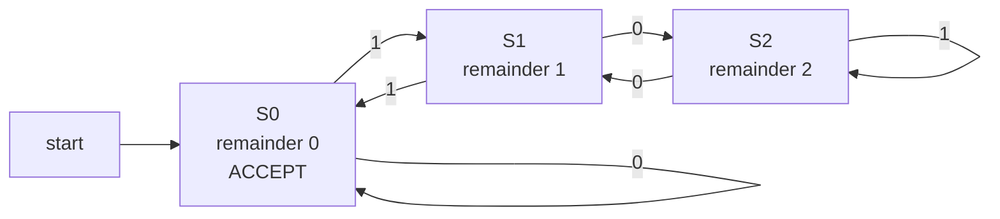

# 🔁 Finite Automata (DFA and NFA)

> [!abstract] TL;DR
> A **finite automaton** is the simplest useful model of computation: a machine with a *fixed, finite* set of states and **no memory** beyond "which state am I in." It reads an input string left to right, changing state on each symbol, and **accepts** if it finishes in an accept state. The **deterministic** version (DFA) has exactly one transition per state-symbol pair; the **nondeterministic** version (NFA) may have several, zero, or silent epsilon moves, and accepts if *some* path accepts. The deep result: **DFAs and NFAs recognize exactly the same languages — the regular languages** — and the *subset construction* mechanically converts any NFA into an equivalent DFA (at a possible exponential blow-up in states). Because their memory is finite, they cannot count without bound, which is precisely what makes some languages non-regular.

---

## Intuition

**Analogy — a turnstile / vending machine.** Think of a subway turnstile. It has just two states: `Locked` and `Unlocked`. It has no idea how many people passed before, no running tally, no history — only "which state am I in *right now*." Feed it an event (`coin` or `push`) and it *reacts* by possibly switching state. A vending machine is the same idea with more states: `0¢`, `25¢`, `50¢`, ... `Dispense`. Each coin nudges it forward; it "remembers" nothing except the total-so-far *encoded as a state*.

A finite automaton is exactly this: a device that reacts to each input symbol by hopping between a **finite** set of states. The entire "memory" of the machine is the *name of the current state*. If a task needs to remember more than a fixed number of distinct situations — say, "count arbitrarily many open brackets" — a finite automaton simply cannot do it, because it has only finitely many states to encode that count.

---

## How It Works

### The DFA — a deterministic 5-tuple

A **Deterministic Finite Automaton** is a 5-tuple $(Q, \Sigma, \delta, q_0, F)$:

1. **$Q$** — a finite set of **states**.
2. **$\Sigma$** — a finite **input alphabet** (e.g. `{0, 1}` or ASCII).
3. **$\delta : Q \times \Sigma \to Q$** — the **transition function**. *Deterministic* means it returns **exactly one** next state for every (state, symbol) pair — the machine never has a choice and never gets stuck.
4. **$q_0 \in Q$** — the single **start state**.
5. **$F \subseteq Q$** — the set of **accept (final) states**.

**Running a DFA.** Start in $q_0$. Read the input string one symbol at a time, applying $\delta$ to move to the next state. After consuming the whole string, look at where you landed: if it is in $F$, **accept**; otherwise **reject**. The **language of the DFA**, written $L(M)$, is the set of all strings it accepts. Crucially, on any given input a DFA follows **one single path** — its behavior is completely predictable.

### The NFA — nondeterministic, and easier to design

A **Nondeterministic Finite Automaton** relaxes the transition rule. Now $\delta : Q \times \Sigma \to \mathcal{P}(Q)$ returns a **set** of next states — possibly several, possibly the empty set (a dead branch). Many NFAs also allow **epsilon transitions** ($\varepsilon$-moves): edges the machine may follow *without consuming any input symbol*.

The acceptance rule changes to an existential one: an NFA **accepts a string if there exists at least one path** through the machine (making some choice at each branch, and freely taking any $\varepsilon$-moves) that consumes the whole input and ends in an accept state. You can picture it as the machine "guessing" the right choices, or equivalently as exploring **all** paths in parallel and accepting if *any* of them succeeds.

> [!note] Nondeterminism is not randomness
> An NFA does not flip coins. "Accepts if *some* path accepts" is a definition about the existence of a successful path, not a probability. NFAs are strictly a *design convenience* — they are often far smaller and more natural to draw than the equivalent DFA — but they are **no more powerful**.

### epsilon-closure and simulating an NFA

To run an NFA without guessing, track the **set of all states the machine could currently be in**. Two operations drive this:

- **$\varepsilon$-closure(S)** — expand a set of states $S$ to include every state reachable from it using only $\varepsilon$-edges. This is where "silent" moves get folded in.
- **Move + closure** — on reading symbol $a$, take the union of $\delta(s, a)$ over all current states $s$, then take the $\varepsilon$-closure of the result.

Start from $\varepsilon\text{-closure}(\{q_0\})$; after the last symbol, accept if the current set intersects $F$.

### The fundamental equivalence and the subset construction

The central theorem of this topic: **NFAs and DFAs recognize exactly the same class of languages.** Every DFA *is* an NFA (a degenerate one with singleton transition sets), and — the interesting direction — **every NFA can be converted into an equivalent DFA** by the **subset (powerset) construction**:

1. Each **DFA state is a *set* of NFA states** (a subset of $Q$) — precisely the set of NFA states the machine "could be in."
2. The DFA start state is $\varepsilon\text{-closure}(\{q_0\})$.
3. From a DFA state $S$ on symbol $a$: the next DFA state is $\varepsilon\text{-closure}\big(\bigcup_{s \in S} \delta(s, a)\big)$.
4. A DFA state $S$ is **accepting** iff it contains **at least one** NFA accept state.

Because an $n$-state NFA has $2^n$ possible subsets, the resulting DFA can have up to **$2^n$ states** — an **exponential blow-up** in the worst case (though usually far fewer subsets are *reachable*, as the demo shows).

### Regular languages and closure properties

The class of languages recognized by finite automata is exactly the **regular languages** — the same class described by regular expressions (see the companion note `Regular_Expressions_and_Kleenes_Theorem`). Regular languages are **closed** under many operations, each provable by an automaton construction:

- **Union / Intersection** — the **product construction**: run two DFAs simultaneously on state pairs $(p, q)$; accept when *either* (union) or *both* (intersection) accept.
- **Complement** — for a DFA, simply **swap accept and non-accept states** (this requires a *complete* DFA where every transition is defined).
- **Concatenation and Kleene star** — glue automata together with $\varepsilon$-transitions (the natural home of the NFA).

### Flow / Architecture

The diagram below is a small DFA over `{0, 1}` that accepts exactly the binary strings whose value is **divisible by 3**, reading the most-significant bit first. Each state records the value-so-far's remainder; the transition rule is `new = 2 * old + bit` taken modulo three.



Read left to right: reading a `0` doubles the value (remainder maps `0->0`, `1->2`, `2->1`); reading a `1` doubles and adds one (`0->1`, `1->0`, `2->2`). A string is accepted iff it ends back in `S0`. Note the machine never "counts" the number itself — it only ever remembers one of three states.

---

## Key Concepts

**Secondary (foundational).**
- A finite automaton is a machine with finitely many states that reads input and either accepts or rejects.
- A **DFA** has exactly one move per state and symbol — its run is fully predictable.
- The **accept states** decide the verdict: you accept iff you *end* in one.
- Turnstiles, traffic lights, and vending machines are everyday finite automata.

**Undergraduate (core theory).**
- The formal **5-tuple** $(Q, \Sigma, \delta, q_0, F)$ and the notion of the **language $L(M)$** recognized by a machine.
- **NFAs**: multiple/zero transitions and **$\varepsilon$-moves**; acceptance = existence of *some* accepting path.
- **$\varepsilon$-closure** and set-based NFA simulation.
- The **subset/powerset construction** proving **NFA = DFA** in power, with worst-case exponential state growth.
- **Regular languages** as the languages recognized by finite automata; equivalence with **regular expressions** (Kleene's theorem).
- **Closure properties** via product/complement/concatenation constructions.
- **DFA minimization** — every regular language has a *unique minimal DFA* (up to renaming), found by merging indistinguishable states (Hopcroft's algorithm), and characterized by the **Myhill-Nerode theorem** (see `Myhill_Nerode_and_DFA_Minimization`).

**Graduate (deeper structure and limits).**
- **Myhill-Nerode**: a language is regular iff its *right-congruence* has **finitely many equivalence classes**; the number of classes equals the size of the minimal DFA — a purely algebraic characterization of regularity.
- **Why finite memory bounds the model**: a DFA's only memory is its current state, so it cannot recognize languages needing an unbounded counter (like $\{0^n 1^n\}$); the **pumping lemma** turns this pigeonhole argument into a proof technique (see `Non_Regular_Languages_and_the_Pumping_Lemma`).
- **Two-way DFAs**, **alternating finite automata (AFA)**, and other variants that change convenience but *not* expressive power (still exactly regular).
- The **transition monoid / syntactic monoid** view: regular languages correspond to recognition by finite monoids, connecting automata to algebra.
- **State-complexity theory**: the exact blow-up of subset construction, and lower bounds proving some regular languages *require* $2^n$ DFA states even though their NFA is tiny.

---

## Python Demo

```python
"""
Finite Automata: DFA and NFA (numpy + matplotlib only)
======================================================
Demonstrates:
  1. A DFA (transition table) accepting binary strings divisible by 3 (MSB first).
  2. An NFA accepting strings that END IN "01".
  3. The subset (powerset) construction converting that NFA to an equivalent
     DFA, plus an empirical equivalence check over all strings up to length 8.
  4. A matplotlib visualization of the mod-3 DFA state-transition graph.
"""

import numpy as np
import matplotlib.pyplot as plt


# ---------------------------------------------------------------------------
# 1. DFA as a transition table:  L = { binary strings divisible by 3 }
#    State = value-so-far mod 3.  new = (2*state + bit) mod 3   (MSB first).
# ---------------------------------------------------------------------------
DFA_MOD3 = {
    "states": [0, 1, 2],
    "alphabet": ["0", "1"],
    "start": 0,
    "accept": {0},
    "delta": {                       # delta[state][symbol] -> next state
        0: {"0": 0, "1": 1},
        1: {"0": 2, "1": 0},
        2: {"0": 1, "1": 2},
    },
}


def dfa_accepts(dfa, string):
    """Run a deterministic FA: follow exactly ONE edge per symbol."""
    state = dfa["start"]
    for ch in string:
        state = dfa["delta"][state][ch]
    return state in dfa["accept"]


# ---------------------------------------------------------------------------
# 2. NFA:  L = { strings over {0,1} that END IN "01" }
#    Nondeterministic: q0 has TWO edges on '0'. Accept if SOME path ends in q2.
#    delta maps (state, symbol) -> set of states; symbol "" denotes epsilon.
# ---------------------------------------------------------------------------
NFA_END01 = {
    "states": {"q0", "q1", "q2"},
    "alphabet": ["0", "1"],
    "start": "q0",
    "accept": {"q2"},
    "delta": {
        ("q0", "0"): {"q0", "q1"},   # stay in the loop, OR guess the '0' of "01"
        ("q0", "1"): {"q0"},         # stay in the loop
        ("q1", "1"): {"q2"},         # saw '0', now a '1' completes "01"
        # every other (state, symbol) is the empty set -> a dead branch
    },
}


def epsilon_closure(states, nfa):
    """All states reachable from `states` using only epsilon-edges."""
    stack, closure = list(states), set(states)
    while stack:
        s = stack.pop()
        for nxt in nfa["delta"].get((s, ""), set()):
            if nxt not in closure:
                closure.add(nxt)
                stack.append(nxt)
    return closure


def nfa_accepts(nfa, string):
    """Simulate the NFA by tracking the SET of possible current states."""
    current = epsilon_closure({nfa["start"]}, nfa)
    for ch in string:
        nxt = set()
        for s in current:
            nxt |= nfa["delta"].get((s, ch), set())
        current = epsilon_closure(nxt, nfa)
    return len(current & nfa["accept"]) > 0     # accept iff SOME path succeeds


# ---------------------------------------------------------------------------
# 3. Subset (powerset) construction: NFA -> equivalent DFA.
#    Each DFA state is a frozenset of NFA states.
# ---------------------------------------------------------------------------
def subset_construction(nfa):
    start = frozenset(epsilon_closure({nfa["start"]}, nfa))
    dfa_states, dfa_accept, dfa_delta = {start}, set(), {}
    worklist = [start]
    while worklist:
        S = worklist.pop()
        if S & nfa["accept"]:                   # accept if S holds any NFA-accept
            dfa_accept.add(S)
        for sym in nfa["alphabet"]:
            move = set()
            for s in S:
                move |= nfa["delta"].get((s, sym), set())
            T = frozenset(epsilon_closure(move, nfa))
            dfa_delta[(S, sym)] = T
            if T not in dfa_states:
                dfa_states.add(T)
                worklist.append(T)
    return {"states": dfa_states, "alphabet": nfa["alphabet"],
            "start": start, "accept": dfa_accept, "delta": dfa_delta}


def subset_dfa_accepts(dfa, string):
    state = dfa["start"]
    for ch in string:
        state = dfa["delta"][(state, ch)]
    return state in dfa["accept"]


# ---------------------------------------------------------------------------
# 4. Visualize the mod-3 DFA (node layout on a circle via numpy).
# ---------------------------------------------------------------------------
def draw_dfa_mod3():
    labels = {0: "S0\nrem 0\nACCEPT", 1: "S1\nrem 1", 2: "S2\nrem 2"}
    angles = np.linspace(np.pi / 2, np.pi / 2 + 2 * np.pi, 3, endpoint=False)
    pos = {i: (np.cos(a), np.sin(a)) for i, a in zip([0, 1, 2], angles)}
    R = 0.30
    fig, ax = plt.subplots(figsize=(7, 7))

    for i, (x, y) in pos.items():                         # draw states
        ax.add_patch(plt.Circle((x, y), R, fill=False, lw=2))
        if i in DFA_MOD3["accept"]:                       # double circle = accept
            ax.add_patch(plt.Circle((x, y), R * 0.80, fill=False, lw=1.5))
        ax.text(x, y, labels[i], ha="center", va="center", fontsize=9)

    sx, sy = pos[0]                                       # start arrow into S0
    ax.annotate("", xy=(sx, sy + R), xytext=(sx, sy + R + 0.5),
                arrowprops=dict(arrowstyle="->", lw=2))
    ax.text(sx, sy + R + 0.58, "start", ha="center", fontsize=9)

    for s in DFA_MOD3["states"]:                          # draw transitions
        for sym, t in DFA_MOD3["delta"][s].items():
            x0, y0 = pos[s]
            x1, y1 = pos[t]
            if s == t:                                    # self-loop
                ax.annotate(sym, xy=(x0, y0 + R), xytext=(x0, y0 + R + 0.35),
                            ha="center", color="crimson", fontsize=11,
                            arrowprops=dict(arrowstyle="->", lw=1.5,
                                            connectionstyle="arc3,rad=1.2"))
            else:
                dx, dy = x1 - x0, y1 - y0
                d = np.hypot(dx, dy)
                ux, uy = dx / d, dy / d
                ax.annotate("", xy=(x1 - ux * R, y1 - uy * R),
                            xytext=(x0 + ux * R, y0 + uy * R),
                            arrowprops=dict(arrowstyle="->", lw=1.5,
                                            connectionstyle="arc3,rad=0.2"))
                mx, my = (x0 + x1) / 2, (y0 + y1) / 2
                ax.text(mx - uy * 0.14, my + ux * 0.14, sym,
                        color="crimson", fontsize=11)

    ax.set_xlim(-2, 2)
    ax.set_ylim(-2, 2.3)
    ax.set_aspect("equal")
    ax.axis("off")
    ax.set_title("DFA: binary strings divisible by 3  (edge labels = input bit)")
    fig.tight_layout()


if __name__ == "__main__":
    # --- DFA: divisibility by 3, checked against ground truth ---
    print("DFA  L = { binary strings divisible by 3 }")
    for s in ["0", "11", "110", "1001", "1010", "1111"]:
        val = int(s, 2)
        truth = (val % 3 == 0)
        print(f"  {s:>5} = {val:>2}   accepted={dfa_accepts(DFA_MOD3, s)!s:>5}"
              f"   (truth {truth})")

    # --- NFA vs its subset-construction DFA: 'ends in 01' ---
    dfa_from_nfa = subset_construction(NFA_END01)
    print("\nNFA vs subset-DFA   L = { strings ending in '01' }")
    for s in ["01", "101", "0", "0010", "1101", "00", "1"]:
        a_nfa = nfa_accepts(NFA_END01, s)
        a_dfa = subset_dfa_accepts(dfa_from_nfa, s)
        print(f"  {s:>5}   nfa={a_nfa!s:>5}   dfa={a_dfa!s:>5}   "
              f"agree={a_nfa == a_dfa}")

    # --- Empirical equivalence over ALL strings up to length 8 ---
    def all_binary(maxlen):
        yield ""
        for L in range(1, maxlen + 1):
            for i in range(2 ** L):
                yield format(i, f"0{L}b")

    mismatches = sum(
        nfa_accepts(NFA_END01, s) != subset_dfa_accepts(dfa_from_nfa, s)
        for s in all_binary(8)
    )
    print(f"\nEquivalence check over all strings up to length 8: "
          f"{mismatches} mismatches")
    print(f"NFA states: {len(NFA_END01['states'])}   ->   "
          f"reachable subset-DFA states: {len(dfa_from_nfa['states'])}")

    draw_dfa_mod3()
    plt.show()
```

Running it prints the DFA divisibility verdicts (each matching the arithmetic ground truth), shows the NFA and its constructed DFA agreeing on every test string, reports **0 mismatches across all 511 strings up to length 8** (an empirical witness of NFA-DFA equivalence), and pops up the mod-3 state diagram. Notice that the 3-state NFA yields only a handful of *reachable* subset states — the feared $2^n$ blow-up is a worst case, not the norm.

---

## Real-World Applications

- **Lexical analysis / tokenizers.** Compiler front-ends (`lex`, `flex`, and the lexers inside every language) specify tokens as regular expressions, compile them to an NFA, subset-construct a DFA, and *minimize* it. The DFA then scans source code in a single linear pass — one state transition per character.
- **Regex engines.** DFA/NFA-based engines such as Google's **RE2** and `grep` compile a pattern to an automaton, guaranteeing linear-time matching with no catastrophic backtracking (unlike backtracking regex engines).
- **String matching.** The Knuth-Morris-Pratt failure function *is* a finite automaton for the pattern (see `KMP_Algorithm`), and **Aho-Corasick** (see `Aho_Corasick`) is a DFA over a whole *set* of patterns — both scan text with O(1) work per character.
- **Protocol and hardware state machines.** TCP connection handling, USB, and countless embedded controllers are literally finite state machines; digital circuit design (Moore/Mealy machines) is finite automata in silicon.
- **Model checking.** Tools like **SPIN** and temporal-logic verifiers represent both a system and its specification as automata (Büchi automata for infinite runs) and check acceptance to prove safety/liveness properties.
- **Input validation and DPI.** Firewalls and deep-packet-inspection engines use DFAs to match signatures at line rate.

---

## Common Pitfalls

- **Confusing nondeterminism with probability.** An NFA does not "randomly" pick a branch. "Accepts if *some* path accepts" is an existence claim. Treating it as random or as "more powerful than a DFA" is the single most common misunderstanding.
- **Forgetting the $\varepsilon$-closure.** When simulating or subset-constructing an $\varepsilon$-NFA, you must take the $\varepsilon$-closure of the start set *and* after every symbol. Skip it and you silently drop reachable states, rejecting strings you should accept.
- **Non-total DFA breaks complementation.** Swapping accept/non-accept states only complements the language if the DFA is **complete** (every state has a transition on every symbol). Add an explicit **dead/trap state** for missing edges first, or you complement the wrong language.
- **Expecting the exponential blow-up every time.** Subset construction is $2^n$ in the *worst* case, but only *reachable* subsets appear; most practical NFAs yield modest DFAs. Conversely, do not assume it is always cheap — some languages provably *require* exponentially many DFA states.
- **Asking a DFA to count.** A DFA can only remember one of finitely many states, so it cannot recognize "$n$ zeros followed by $n$ ones" or "balanced parentheses." Reaching for a finite automaton on such a task is a design error — that is the job of a pushdown automaton or beyond.
- **Off-by-one on acceptance.** Acceptance depends on the state *after the last symbol*, not on merely *visiting* an accept state mid-run. Reporting a match the moment you touch an accept state (rather than at end-of-input, or at each valid end for a *scanner*) is a frequent bug.
- **Building a huge DFA by hand.** Designing directly as a DFA is error-prone; design an NFA (much smaller and intuitive), then let subset construction and minimization do the mechanical work.

---

## Related Concepts

- `Theory_of_Computation_Overview` — the map of computational models; finite automata are the simplest rung, below pushdown automata and Turing machines. *(sibling section note — being built out)*
- `Regular_Expressions_and_Kleenes_Theorem` — the language-description counterpart; Kleene's theorem proves regex and finite automata describe **exactly** the same regular languages. *(sibling section note — being built out)*
- `Non_Regular_Languages_and_the_Pumping_Lemma` — why finite memory is a hard limit; the pumping lemma proves languages like $\{0^n1^n\}$ are *not* regular. *(sibling section note — being built out)*
- `Myhill_Nerode_and_DFA_Minimization` — the unique minimal DFA and the algebraic characterization of regularity via equivalence classes. *(sibling section note — being built out)*
- [[KMP_Algorithm]] — the KMP failure function is a finite automaton over a single pattern; a concrete, high-performance DFA in the wild.
- [[String_Matching_Overview]] — situates automaton-based matching among the family of string-search algorithms.
- [[Aho_Corasick]] — a DFA built over an entire *set* of patterns (KMP generalized), used for multi-keyword search.

---

## Review Questions

1. **(Secondary)** A turnstile has states `Locked` and `Unlocked`, and events `coin` and `push`. Draw its DFA: which transitions leave each state, what is the start state, and (if the goal is "let exactly one person through per coin") which state would you treat as the meaningful outcome? Explain what the machine "remembers."
2. **(Undergraduate)** Give an NFA with 3 states for "binary strings ending in `01`," then run the subset construction by hand to produce the equivalent DFA. How many DFA states are *reachable*, and why is that far fewer than the theoretical maximum of $2^3 = 8$?
3. **(Graduate)** Prove that the language $L = \{\, w \in \{a,b\}^* : w \text{ has an equal number of } a\text{'s and } b\text{'s} \,\}$ is not regular. Frame your argument two ways: (a) via the pumping lemma, and (b) via Myhill-Nerode by exhibiting infinitely many pairwise-distinguishable prefixes. Then explain precisely which property of finite automata your proof exploits.

---

## Sources

- Michael Sipser, *Introduction to the Theory of Computation*, 3rd ed. — Chapter 1 (Regular Languages: DFAs, NFAs, the subset construction, closure, and Kleene's theorem).
- Hopcroft, Motwani, and Ullman, *Introduction to Automata Theory, Languages, and Computation*, 3rd ed. — Chapters 2-4.
- Dexter Kozen, *Automata and Computability* — lectures on finite automata and the Myhill-Nerode theorem.
- Russ Cox, "Regular Expression Matching Can Be Simple And Fast" — https://swtch.com/~rsc/regexp/regexp1.html (NFA/DFA construction behind RE2).
- Stanford CS103 / MIT 6.045 automata-theory lecture notes — DFA/NFA equivalence and subset construction.

---

#theory-of-computation #finite-automata #dfa #nfa #automata-theory
