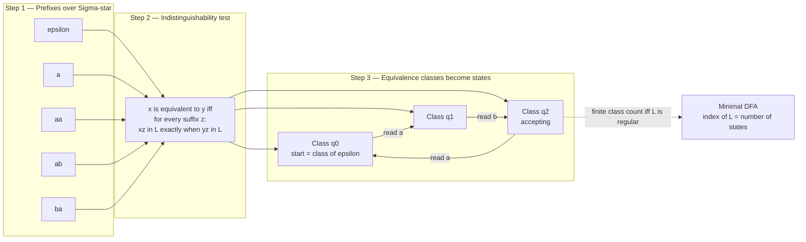

# 🧬 Myhill-Nerode Theorem and DFA Minimization

> [!abstract] TL;DR
> Two input prefixes are "the same" to a machine when **no future suffix can ever tell them apart**. The Myhill-Nerode theorem says a language is regular **if and only if** this indistinguishability relation carves the space of all strings into a **finite** number of equivalence classes — and that number is exactly the size of the language's **unique minimal DFA**. It is the clean, two-way characterization of regular languages (unlike the one-way pumping lemma) and the theoretical foundation of state minimization, equivalence checking, and automata learning.

---

## Intuition

**Analogy — the interchangeable receptionists.** Imagine a building where a receptionist tracks visitors and must eventually decide "approved" or "denied." Two receptionists are truly interchangeable if, no matter what sequence of events happens *from now on*, they would always reach the same verdict. If they are interchangeable, keeping both is waste — fire one, redirect everyone to the other, and behavior is unchanged. Keep collapsing interchangeable receptionists and you end up with the **smallest possible staff** where every remaining person genuinely handles a distinct situation.

That is exactly DFA minimization. A "situation" is *what the machine has read so far* (a prefix). Two prefixes `x` and `y` are indistinguishable when for **every** possible continuation `z`, the string `xz` is in the language exactly when `yz` is. The machine only needs to remember *which indistinguishable group it is in*, never the exact history. The minimal machine has **one state per truly-distinct situation** and not a single redundant state.

---

## How It Works

### Core Mechanics

**The Myhill-Nerode relation.** Fix a language `L` over alphabet `Σ`. Define, on the set of all strings `Σ*`:

$$x \equiv_L y \iff \forall z \in \Sigma^*:\; xz \in L \Leftrightarrow yz \in L$$

This is an **equivalence relation** — reflexive, symmetric, and transitive (see [[Set_Theory_and_Relations]]) — so it **partitions** `Σ*` into disjoint equivalence classes. Each class is a set of prefixes that share the *same future behavior*. The number of classes is called the **index** of `L`.

**The theorem (necessary and sufficient).**

> `L` is regular **if and only if** `≡_L` has a **finite** number of equivalence classes. Moreover, that number equals the number of states in the **minimal DFA** for `L`.

Contrast this with the [[Non_Regular_Languages_and_the_Pumping_Lemma|pumping lemma]], which is only *necessary*: a non-regular language must fail pumping, but failing to pump does not prove regularity. Myhill-Nerode is an *iff* — it decides membership in the regular class completely.

**Proving non-regularity.** To show `L` is **not** regular, exhibit an **infinite set of pairwise-distinguishable prefixes**. For `L = { aⁿbⁿ : n ≥ 0 }`, take the prefixes `a⁰, a¹, a², …`. For any `i ≠ j`, the suffix `z = bⁱ` distinguishes them: `aⁱbⁱ ∈ L` but `aʲbⁱ ∉ L`. So all powers of `a` lie in **different** classes → infinitely many classes → not regular. This is often cleaner than pumping because you never worry about an adversary's choice of decomposition — you just name one distinguishing suffix per pair.

**From classes to the minimal DFA.** The construction is direct and canonical:
1. **States** = the equivalence classes of `≡_L`. The states *are* the classes.
2. **Start state** = the class of the empty string `ε`.
3. **Transition** = from the class of `x`, reading symbol `a`, go to the class of `xa` (well-defined: the relation is a *right congruence*, so `x ≡_L y` implies `xa ≡_L ya`).
4. **Accepting states** = classes whose members are in `L`.

Because this construction is forced at every step, the minimal DFA is **unique up to isomorphism** — a *canonical form* for the language.

**DFA minimization algorithms** (given some DFA, compute the minimal one):
- **Table-filling / partition refinement (Moore's algorithm).** Mark every pair of states that is *distinguishable*. Base case: a pair is distinguishable if one state accepts and the other does not. Propagate: a pair `(p, q)` becomes distinguishable if on some symbol `a` the pair `(δ(p,a), δ(q,a))` is already marked. Repeat to fixpoint. Any pair left **unmarked** is equivalent → merge. Runs in `O(n²·|Σ|)`.
- **Hopcroft's algorithm.** A smarter partition refinement that always splits using the *smaller* half of a block ("process the smaller half"), achieving near-linear **`O(n log n)`** time — the asymptotically best known.

**State equivalence and merging.** Two states are equivalent precisely when they accept the *same language of suffixes* (the same future). Merging all equivalent states, after first deleting unreachable states, yields the canonical minimal DFA.

**Why canonicity matters.** Because the minimal DFA is unique, **equivalence of two regular languages is decidable**: minimize both and check if the results are isomorphic (or minimize the symmetric-difference automaton and check emptiness). This underpins compiler optimization, hardware/protocol **equivalence checking**, model checking, and fast regex engines. It also connects to **learning**: Angluin's **L\*** algorithm actively queries a language and provably reconstructs its *minimal* DFA — the Myhill-Nerode classes are what L\* is discovering.

### Flow / Architecture



---

## Code Demo

The **table-filling / partition-refinement** algorithm on the classic 8-state Hopcroft-Ullman DFA. We mark distinguishable pairs (accepting-vs-nonaccepting first, then propagate), merge the indistinguishable states with union-find, print the equivalence classes and before/after state counts, and **brute-force verify** that the minimized DFA accepts exactly the same language up to length 8.

```python
# DFA minimization via table-filling (Moore's algorithm) + brute-force verification.
# numpy / matplotlib only.
import numpy as np
import matplotlib.pyplot as plt
from itertools import product

# ---- 1. A DFA with redundant states (classic Hopcroft-Ullman 8-state example) ----
states   = ['A', 'B', 'C', 'D', 'E', 'F', 'G', 'H']
alphabet = ['0', '1']
start    = 'A'
accept   = {'C'}
delta = {
    'A': {'0': 'B', '1': 'F'},
    'B': {'0': 'G', '1': 'C'},
    'C': {'0': 'A', '1': 'C'},
    'D': {'0': 'C', '1': 'G'},
    'E': {'0': 'H', '1': 'F'},
    'F': {'0': 'C', '1': 'G'},
    'G': {'0': 'G', '1': 'E'},
    'H': {'0': 'G', '1': 'C'},
}

def run(d, s0, acc, w):
    cur = s0
    for ch in w:
        cur = d[cur][ch]
    return cur in acc

# ---- 2. Table-filling: mark distinguishable pairs ----
n   = len(states)
idx = {st: i for i, st in enumerate(states)}
dist = np.zeros((n, n), dtype=bool)          # dist[i][j] == states i,j distinguishable

# Base case: accepting vs non-accepting are trivially distinguishable
for i in range(n):
    for j in range(i + 1, n):
        if (states[i] in accept) != (states[j] in accept):
            dist[i][j] = dist[j][i] = True

# Propagate until fixpoint: (i,j) distinguishable if some symbol leads to a marked pair
changed = True
while changed:
    changed = False
    for i in range(n):
        for j in range(i + 1, n):
            if dist[i][j]:
                continue
            for a in alphabet:
                pi, pj = idx[delta[states[i]][a]], idx[delta[states[j]][a]]
                if pi != pj and dist[pi][pj]:
                    dist[i][j] = dist[j][i] = True
                    changed = True
                    break

# ---- 3. Merge indistinguishable states (union-find) ----
parent = list(range(n))
def find(x):
    while parent[x] != x:
        parent[x] = parent[parent[x]]
        x = parent[x]
    return x
def union(x, y):
    rx, ry = find(x), find(y)
    if rx != ry:
        parent[max(rx, ry)] = min(rx, ry)   # smaller index = class representative

for i in range(n):
    for j in range(i + 1, n):
        if not dist[i][j]:
            union(i, j)

classes = {}
for i in range(n):
    classes.setdefault(find(i), []).append(states[i])

# ---- 4. Build the minimized DFA ----
rep_of    = {states[i]: find(i) for i in range(n)}
min_states = sorted(set(rep_of.values()))
min_delta  = {r: {a: rep_of[delta[states[r]][a]] for a in alphabet} for r in min_states}
min_start  = rep_of[start]
min_accept = {r for r in min_states if states[r] in accept}

def run_min(w):
    cur = min_start
    for ch in w:
        cur = min_delta[cur][ch]
    return cur in min_accept

# ---- 5. Verify the two DFAs accept the SAME language up to length L ----
L, ok = 8, True
for length in range(L + 1):
    for tup in product(alphabet, repeat=length):
        w = ''.join(tup)
        if run(delta, start, accept, w) != run_min(w):
            ok = False
            print("MISMATCH on", repr(w))

print(f"Original states : {n}")
print(f"Minimal states  : {len(min_states)}")
print("Equivalence classes (merged states):")
for members in classes.values():
    print("   {" + ", ".join(sorted(members)) + "}")
print(f"Languages identical for all strings up to length {L}: {ok}")

# ---- 6. Visualize ----
fig, (ax1, ax2) = plt.subplots(1, 2, figsize=(11, 4.5))
ax1.imshow(dist, cmap='Reds', vmin=0, vmax=1)
ax1.set_xticks(range(n)); ax1.set_xticklabels(states)
ax1.set_yticks(range(n)); ax1.set_yticklabels(states)
ax1.set_title("Distinguishability table\n(filled = distinguishable pair)")
for i in range(n):
    for j in range(n):
        ax1.text(j, i, 'X' if dist[i][j] else '=', ha='center', va='center', fontsize=8)

ax2.bar(['Original', 'Minimal'], [n, len(min_states)], color=['#dc2626', '#059669'])
ax2.set_ylabel('Number of states')
ax2.set_title('DFA state count: before vs after')
for i, v in enumerate([n, len(min_states)]):
    ax2.text(i, v + 0.05, str(v), ha='center')
plt.tight_layout()
plt.savefig('dfa_minimization.png', dpi=120)
plt.show()
```

Expected output — the 8 states collapse to **5**, with classes `{A, E}`, `{B, H}`, `{C}`, `{D, F}`, `{G}`, and the brute-force check confirms identical languages:

```
Original states : 8
Minimal states  : 5
Equivalence classes (merged states):
   {A, E}
   {B, H}
   {C}
   {D, F}
   {G}
Languages identical for all strings up to length 8: True
```

---

## Key Concepts

### Secondary (intuition-level)
- A machine should only **remember what could still change its answer**. If two histories always lead to the same outcome for every possible future, they are the same situation.
- **Minimization** = repeatedly fusing states that behave identically until none can be fused. The result is the smallest machine recognizing the language.
- A single machine can be drawn many ways, but there is exactly **one smallest** drawing — its canonical fingerprint.

### Undergraduate
- **Myhill-Nerode relation** `x ≡_L y` ⟺ for all `z`, `xz ∈ L ⟺ yz ∈ L`; it is an equivalence relation whose classes partition `Σ*`. Its **index** is the class count.
- **Theorem:** `L` regular ⟺ `≡_L` has finite index, and that index = minimal DFA size. A true **iff**, unlike the necessary-only [[Non_Regular_Languages_and_the_Pumping_Lemma|pumping lemma]].
- **Non-regularity proofs:** find infinitely many pairwise-distinguishable prefixes (an infinite "antichain" of futures). Example: `aⁿbⁿ` via prefixes `a⁰, a¹, a², …`.
- **State equivalence:** states `p, q` are equivalent iff they accept the same suffix language; **table-filling / Moore** marks distinguishable pairs then merges the rest.
- Minimization requires **completing** the DFA (adding a trap state) and **pruning unreachable states** first.

### Graduate
- **Uniqueness up to isomorphism:** the minimal DFA is the *quotient automaton* `Σ*/≡_L`; its states literally are the Nerode classes. This gives a **canonical form** → equivalence of regular languages/automata is **decidable** (minimize and compare, or check emptiness of the symmetric-difference DFA).
- **Two congruences:** Nerode's is a **right** congruence (`x ≡ y ⟹ xa ≡ ya`) giving the minimal *automaton*; the **Myhill congruence** is the two-sided congruence (`uxv` behaves like `uyv`) giving the minimal *syntactic monoid* — the gateway to **algebraic automata theory** (star-free languages ⟺ aperiodic monoids, Schützenberger).
- **Algorithms:** Moore `O(n²|Σ|)`; **Hopcroft** `O(n log n)` via "process the smaller half" partition refinement; **Brzozowski's** elegant *reverse-determinize-reverse-determinize* also yields the minimal DFA. Minimization is an instance of **bisimulation / partition refinement** (Paige-Tarjan).
- **Learning:** Angluin's **L\*** uses membership + equivalence queries to build an *observation table* whose rows are Nerode-class approximations, converging to the **minimal** DFA — foundational for **model learning** of protocols and legacy systems.

---

## Real-World Applications

- **Regex engines and lexers.** Tools like `flex`, `re2c`, and Google's **RE2** compile regular expressions to DFAs and minimize them so that scanning input runs in the fewest possible states — smaller tables mean smaller cache footprint and faster tokenization for every compiler and search tool.
- **Hardware and protocol equivalence checking.** Verifying that an optimized circuit or a refactored protocol implementation is *behaviorally identical* to a golden reference reduces to checking automaton equivalence — decidable precisely because minimization gives a canonical form.
- **Model checking.** State-space reduction via bisimulation quotient (the same partition-refinement idea) shrinks enormous transition systems before verifying temporal properties, making otherwise intractable verification feasible.
- **Network intrusion detection / deep packet inspection.** Signature matchers (e.g., in Snort-style systems) compile thousands of patterns into DFAs; minimization and DFA compression keep the automaton small enough to run at line rate.
- **Automata learning (L\*).** Reconstructing minimal DFA models of black-box systems — TLS implementations, embedded controllers, undocumented network protocols — for testing, fuzzing, and security analysis.

---

## Common Pitfalls

- **Minimizing an incomplete DFA.** If the transition function is partial, add an explicit **trap/dead state** first. Treating "no transition" inconsistently makes indistinguishable states look different (or vice versa) and produces a wrong minimal machine.
- **Forgetting to remove unreachable states.** Table-filling only *merges equivalent* states; it never deletes states the start can't reach. Prune unreachable states **before** minimizing, or the result is not truly minimal.
- **Omitting the empty suffix in Myhill-Nerode proofs.** The suffix `z = ε` is what separates accepting from non-accepting prefixes. Always allow `z = ε` when reasoning about distinguishability.
- **Showing only one distinguishable pair for non-regularity.** You must exhibit an **infinite** set that is *pairwise* distinguishable (each pair has its own witness suffix). One or finitely many distinguishable prefixes prove nothing.
- **"Pumping lemma passes, therefore regular."** False — the pumping lemma is only *necessary*. Use **Myhill-Nerode** when you need a definitive *both-ways* verdict.
- **Expecting a unique minimal NFA.** Minimality and canonicity are DFA facts. Minimal **NFAs** are neither unique nor easy to compute (NFA minimization is PSPACE-complete).

---

## Related Concepts

- [[Finite_Automata_DFA_and_NFA]] — DFAs are the machines being minimized; Myhill-Nerode explains *why* a smallest DFA exists and is unique. *(sibling note — create if not yet present)*
- [[Non_Regular_Languages_and_the_Pumping_Lemma]] — the pumping lemma is the *necessary-only* tool; Myhill-Nerode is the *necessary-and-sufficient* counterpart and often gives cleaner non-regularity proofs. *(sibling note)*
- [[Regular_Expressions_and_Kleenes_Theorem]] — regex, DFA, NFA all describe the regular languages; the minimal DFA is their canonical representative. *(sibling note)*
- [[Theory_of_Computation_Overview]] — situates regular languages and automata within the broader computability/complexity landscape. *(sibling note)*
- [[Set_Theory_and_Relations]] — the Myhill-Nerode relation is an equivalence relation whose **partition into classes** is exactly the theory used here.
- [[Graph_Theory]] — a DFA is a labeled directed graph; reachability and quotienting are graph operations.
- [[Mathematical_Logic_and_Set_Theory]] — congruences, quotient structures, and canonical forms live in this foundational language.

---

## Review Questions

1. **(Secondary)** In plain words, what does it mean for two input histories to be "the same" to a machine, and why can such histories share a single state without changing the machine's answers?
2. **(Undergraduate)** Use the Myhill-Nerode theorem to prove that `L = { aⁿbⁿ : n ≥ 0 }` is not regular. Which prefixes do you choose, and what single suffix distinguishes each pair?
3. **(Graduate)** You are given two DFAs and must decide whether they recognize the same language. Describe an algorithm based on minimization, argue why it is correct (invoke uniqueness up to isomorphism), and state its complexity. How would Hopcroft's `O(n log n)` step fit in, and how does this connect to what Angluin's L\* algorithm is really discovering?

---

## Sources

- Hopcroft, J. E., Motwani, R., & Ullman, J. D. (2006). *Introduction to Automata Theory, Languages, and Computation* (3rd ed.). Addison-Wesley. — Chapters on DFA minimization and the Myhill-Nerode theorem.
- Sipser, M. (2012). *Introduction to the Theory of Computation* (3rd ed.). Cengage. — Regular languages, distinguishability, and the Myhill-Nerode method.
- Nerode, A. (1958). "Linear Automaton Transformations." *Proceedings of the AMS*, 9(4), 541–544. — Original formulation of the finite-index characterization.
- Hopcroft, J. (1971). "An n log n Algorithm for Minimizing States in a Finite Automaton." *Theory of Machines and Computations*, 189–196. — The near-linear minimization algorithm.
- Angluin, D. (1987). "Learning Regular Sets from Queries and Counterexamples." *Information and Computation*, 75(2), 87–106. — The L\* algorithm that learns the minimal DFA.

---

#theory-of-computation #myhill-nerode #dfa-minimization #regular-languages #equivalence-classes
