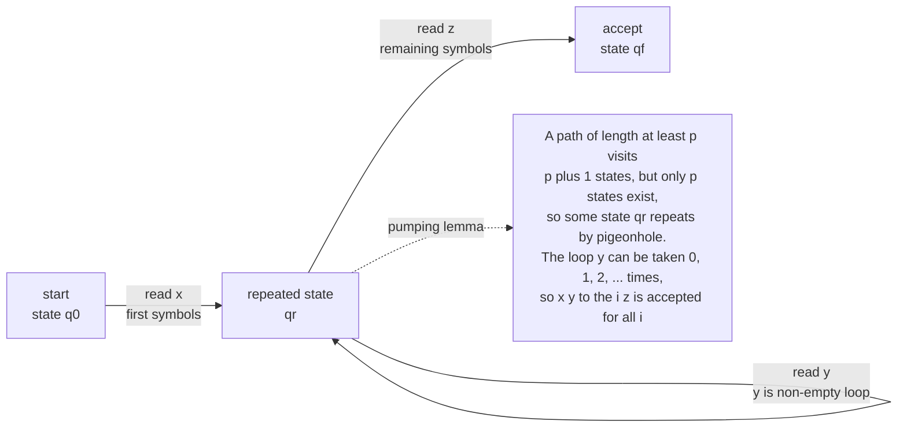

# 🔁 Non-Regular Languages and the Pumping Lemma

> [!abstract] TL;DR
> A finite automaton has only **finitely many states**, so it has **bounded memory** — it cannot count or match unbounded quantities. This means languages like $\{a^n b^n : n \geq 0\}$, which require remembering *how many* $a$'s you saw, are **not regular**. The **pumping lemma** is the standard tool that turns this intuition into proof: every regular language has a *pumping length* $p$ such that any accepted string of length $\geq p$ contains a repeatable loop $y$ that can be "pumped" $x y^i z$ for all $i \geq 0$ while staying in the language. If no such loop can survive pumping, the language cannot be regular — you need a stronger machine (a stack, a Turing tape).

---

## Intuition

**Analogy — the doorman with no notepad.** Imagine a doorman standing at a club entrance whose *only* memory is which of a fixed set of moods he is in — say 5 moods, and nothing else. He must let a guest in only if the number of people who entered **exactly equals** the number who later left. With just 5 moods and no notepad, he simply cannot keep an accurate running tally once more than a handful of people arrive: two *different* crowd sizes will inevitably put him in the *same* mood, and from that moment on he can no longer tell those two situations apart. He is doomed to make a mistake.

A **deterministic finite automaton** (DFA) is exactly that doorman. Its "moods" are its states, and there are only finitely many. Feed it a long enough run of $a$'s and, by the **pigeonhole principle** (more prefixes than states), it must revisit a state — creating a *loop*. Anything the machine accepts by passing through that loop once, it must also accept by going around the loop twice, three times, or zero times. If the language forbids that (as $a^n b^n$ does — extra loops would unbalance the counts), the machine cannot recognize it. **Unbounded counting demands unbounded memory, and finite automata have none.** That is the entire boundary between what regular expressions can match and what they cannot.

---

## How It Works

### Core Mechanics

**1. Bounded memory is the whole story.** A DFA with $k$ states can be in only $k$ distinct configurations. Its state *is* its memory. To recognize $\{a^n b^n\}$ it would need to remember the arbitrary integer $n$ after reading $a^n$ — but $n$ ranges over infinitely many values and there are only $k$ states. Something must give.

**2. The pigeonhole collision.** Read the prefixes $a^0, a^1, a^2, \dots, a^k$. That is $k+1$ prefixes, and the machine lands in one of only $k$ states after each. By the **pigeonhole principle** two prefixes $a^p$ and $a^q$ (with $p < q$) end in the *same* state. From that state the machine's future behavior is identical, so it can no longer distinguish "I have seen $p$ letters $a$" from "I have seen $q$ letters $a$." Appending $b^p$ then forces the same accept/reject verdict on $a^p b^p$ (which is in $L$) and $a^q b^p$ (which is not). Contradiction — no such finite machine exists.

**3. The pumping lemma (the formal tool).** Let $L$ be regular. Then there exists a **pumping length** $p \geq 1$ such that **every** string $s \in L$ with $|s| \geq p$ can be written as $s = xyz$ where:

- $|y| \geq 1$ (the loop is non-empty),
- $|xy| \leq p$ (the loop occurs within the first $p$ symbols), and
- $x y^i z \in L$ for **all** $i \geq 0$ (the loop can be pumped up *and* removed).

The pumping length can be taken to be the number of states of any DFA for $L$: a path of length $\geq p$ visits $\geq p+1$ states, so a state repeats, and the substring read between the two visits is exactly the pumpable $y$.

**4. Using it to prove non-regularity — an adversary game.** The quantifier structure is a two-player game, and getting the *order* right is everything:

1. **Assume** $L$ is regular. The adversary hands you a pumping length $p$ — you do **not** get to choose it.
2. **You choose** a single clever string $s \in L$ with $|s| \geq p$ (chosen so no valid split can survive pumping).
3. The **adversary chooses** any split $s = xyz$ obeying $|y|\geq 1$ and $|xy|\leq p$.
4. **You choose** a pumping count $i$ (often $i=2$ to pump up, or $i=0$ to pump down) that kicks $x y^i z$ **out of** $L$.
5. That contradicts the lemma, so $L$ is **not regular**.

The constraint $|xy| \leq p$ is your best friend: for $s = a^p b^p$ it *forces* $y$ to sit entirely inside the block of $a$'s, so pumping changes the number of $a$'s without touching the $b$'s and the counts no longer match.

**5. Myhill–Nerode — the definitive characterization.** The pumping lemma proves non-regularity but is only a *necessary* condition. The **Myhill–Nerode theorem** gives a *necessary-and-sufficient* one: $L$ is regular **iff** the relation "$u \equiv_L v$ when $uw \in L \Leftrightarrow vw \in L$ for all suffixes $w$" has **finitely many equivalence classes**. For $a^n b^n$ the prefixes $a^0, a^1, a^2, \dots$ are all pairwise distinguishable (append $b^i$ to separate $a^i$ from $a^j$), giving **infinitely many** classes — so it is not regular, and the number of classes equals the size of the **minimal DFA**.

### The Pigeonhole Loop Argument



---

## Key Concepts

### Secondary Level — the plain idea
- A finite automaton is a machine with a **fixed number of memory slots** (its states) and no extra scratch paper.
- With finite memory you **cannot count without a bound** — you cannot verify that the number of opening brackets equals the number of closing brackets when there could be millions.
- $a^n b^n$ (equal $a$'s then equal $b$'s) is the poster child of a language that is **impossible for a finite machine** but easy if you are allowed one counter or one **stack**.

### Undergraduate Level — the formal tool
- **Pumping lemma statement:** every regular $L$ has a length $p$ so that any $s\in L,\ |s|\geq p$ splits as $xyz$ with $|y|\geq1$, $|xy|\leq p$, and $xy^iz\in L$ for all $i\geq0$.
- **Adversary game / quantifier order:** $\exists p\ \forall s\ \exists (xyz)\ \forall i$. To *prove non-regularity* you negate it: choose $s$ adversarially and find one bad $i$.
- **Necessary, not sufficient:** passing the pumping lemma does **not** prove a language regular. There exist non-regular languages that satisfy the pumping condition.
- **Worked non-regular examples:**
  - $\{a^n b^n\}$ — pump the $a$-block, counts break.
  - $\{ww^R\}$ (even-length palindromes) — take $a^p b b a^p$; pumping $a$'s destroys the mirror.
  - $\{a^{n^2}\}$ — gaps between consecutive squares exceed $p$, so pumping lands *between* two squares.
  - $\{w : \#_a(w)=\#_b(w)\}$ — take $a^p b^p$; intersect with $a^\* b^\*$ (regular) to reduce to $a^n b^n$.

### Graduate Level — the exact boundary
- **Myhill–Nerode theorem:** regular $\iff$ finite index of $\equiv_L$; the index equals the minimal-DFA state count — a *complete* invariant that both proves non-regularity and *constructs* the minimal machine (see [[Myhill_Nerode_and_DFA_Minimization]]).
- **Closure-property proofs:** regular languages are closed under intersection, union, complement, and homomorphism. To show $L$ is non-regular, intersect it with a regular language to reduce to a *known* non-regular one (e.g. $\{w:\#_a=\#_b\}\cap a^\*b^\* = \{a^nb^n\}$).
- **Stronger pumping lemmas:** the standard lemma is not sufficient, but Jaffe's pumping lemma and the **block / interchange lemmas** give conditions that *are* necessary-and-sufficient (at the cost of more complex statements). Logical characterizations (regular = definable in monadic second-order logic, MSO) and the algebraic view (syntactic monoid finite) are the deepest equivalent statements.
- **Where the boundary leads:** the moment you need to match nested or balanced structure you must add memory — a **stack** yields a pushdown automaton and the **context-free languages** ($a^nb^n$ becomes trivial); an unbounded tape yields a **Turing machine**.

---

## Python Demo

```python
# Why {a^n b^n} is NOT regular, made concrete via the pigeonhole principle.
# A DFA over the alphabet {a, b} with k states is a transition table delta[state, symbol].
# Column 0 = symbol 'a', column 1 = symbol 'b'. Start state = 0.
#
# We show two things empirically:
#   (1) Reading the k+1 prefixes a^0, a^1, ..., a^k into a k-state machine MUST cause a
#       state collision (pigeonhole) -> the machine cannot distinguish two different a-counts,
#       so it misclassifies a^p b^p vs a^q b^p.
#   (2) The Myhill-Nerode requirement (distinct states needed) grows without bound with n,
#       so no FIXED number of states k can ever recognize a^n b^n for all n.

import numpy as np
import matplotlib.pyplot as plt

rng = np.random.default_rng(0)

def make_dfa(k):
    """Random DFA transition table: shape (k, 2). delta[s, 0]=next on 'a', delta[s, 1]=next on 'b'."""
    return rng.integers(0, k, size=(k, 2))

def state_after(delta, symbols, start=0):
    """Return the state reached after reading a sequence of symbol indices (0='a', 1='b')."""
    s = start
    for sym in symbols:
        s = delta[s, sym]
    return s

# ---- Part 1: the forced pigeonhole collision among a-prefixes ----
k = 5
delta = make_dfa(k)
a_states = [state_after(delta, [0] * n) for n in range(k + 1)]  # states after a^0 .. a^k

seen, p, q = {}, None, None
for n, s in enumerate(a_states):
    if s in seen:            # a collision is GUARANTEED: k+1 prefixes, only k states
        p, q = seen[s], n
        break
    seen[s] = n

# The machine now gives the SAME verdict to a^p b^p (in L) and a^q b^p (not in L):
final_pp = state_after(delta, [0] * p + [1] * p)   # a^p b^p
final_qp = state_after(delta, [0] * q + [1] * p)   # a^q b^p
print(f"k = {k} states")
print(f"Pigeonhole: a^{p} and a^{q} both land in state {a_states[p]} -> indistinguishable.")
print(f"Final state on a^{p} b^{p} = {final_pp},  on a^{q} b^{p} = {final_qp}  (identical: {final_pp == final_qp})")
print("=> any accept/reject choice misclassifies one of them. No 5-state DFA can recognize a^n b^n.")

# ---- Part 2: how the pigeonhole failure grows, and why NO fixed k survives ----
Ns = np.arange(0, 25)
required_states = Ns + 1                      # Myhill-Nerode: a^0..a^N are pairwise distinguishable

# For several fixed machine sizes, count distinct states reached after a^0..a^N (saturates at k).
fig, (ax1, ax2) = plt.subplots(1, 2, figsize=(12, 5))

for kk in [3, 6, 10]:
    d = make_dfa(kk)
    distinct = []
    for N in Ns:
        reached = {state_after(d, [0] * n) for n in range(N + 1)}
        distinct.append(len(reached))
    ax1.plot(Ns, distinct, marker="o", ms=3, label=f"k = {kk} states")
    ax1.axhline(kk, ls=":", color="gray", lw=1)

ax1.set_title("Distinct states reached after reading $a^n$ (saturates at k)")
ax1.set_xlabel("n  (number of a's read)")
ax1.set_ylabel("distinct states seen")
ax1.legend(); ax1.grid(alpha=0.3)

ax2.plot(Ns, required_states, color="crimson", lw=2, label="states REQUIRED (Myhill-Nerode) = n+1")
for kk in [3, 6, 10]:
    ax2.axhline(kk, ls="--", lw=1.2, label=f"fixed machine: k = {kk}")
    cross = kk  # required exceeds k once n+1 > k, i.e. n >= k
    ax2.scatter([cross], [kk], zorder=5)
ax2.set_title("Requirement grows without bound: every fixed k is eventually overwhelmed")
ax2.set_xlabel("n  (max number of a's to handle)")
ax2.set_ylabel("distinct states needed")
ax2.legend(); ax2.grid(alpha=0.3)

plt.tight_layout()
plt.show()

# Takeaway: the crimson line n+1 crosses ANY horizontal k. Beyond the crossing, pigeonhole
# forces a collision among the a-prefixes -> the machine mislabels some a^n b^m. There is no
# finite k that works for all n, which is exactly what "a^n b^n is not regular" means.
```

Running Part 1 prints a concrete collision (e.g. `a^0` and `a^2` sharing a state) and confirms the machine assigns the *same* final state to a valid string and an invalid one. Part 2 plots the crimson "states required" line ($n+1$) piercing every fixed-$k$ horizontal — the visual proof that unbounded counting cannot fit in bounded memory.

---

## Real-World Applications

- **Regex cannot parse nested structure.** HTML, XML, JSON, and programming-language brackets require matching arbitrarily deep nesting — an unbounded-counting task equivalent to $a^n b^n$. This is *why* you cannot reliably parse HTML with a regular expression (the famous Stack Overflow rant is literally the pumping lemma in disguise). You need a **context-free grammar** and a stack-based parser.
- **The lexer/parser split in compilers.** Compilers deliberately draw the line here: the **lexer** (tokenizer) recognizes identifiers, numbers, and keywords — all *regular*, implemented as a DFA and generated by tools like `lex`/`flex`. The **parser** handles nested expressions and blocks — *not* regular — implemented with a pushdown/stack machine generated by `yacc`/`bison` or a recursive-descent parser.
- **Protocol and format validation.** Deciding whether every `BEGIN` has a matching `END`, or that parentheses in a formula are balanced, is provably impossible with a finite-state validator alone — a real constraint when designing streaming validators with fixed memory.
- **Knowing when to escalate the machine.** The pumping lemma is the engineer's litmus test: if your matching problem needs to count or balance without bound, stop reaching for regex and reach for a grammar (PDA) or a general program (Turing machine).

---

## Common Pitfalls

- **Treating the pumping lemma as sufficient.** Passing the pumping condition does **not** prove a language is regular — the lemma is *necessary only*. There are genuinely non-regular languages that satisfy it. To *confirm* regularity, use Myhill–Nerode (finite index) or build a DFA/regex directly.
- **Getting the quantifiers backwards.** You do **not** pick $p$, and you do **not** pick the split $xyz$ — the adversary does. You only get to pick the *string* $s$ and the *pump count* $i$. Swapping who chooses what produces a "proof" that proves nothing.
- **Ignoring the $|xy| \leq p$ constraint.** This clause is what pins $y$ inside the first block. Forgetting it for $a^n b^n$ lets someone (wrongly) put $y$ across the boundary; using it correctly forces $y$ to be all $a$'s so pumping unbalances the counts.
- **Choosing a weak string.** Picking a string that *can* be pumped (e.g. one with slack) dooms the proof. Choose the tightest, most "boundary-hugging" string, typically $s = a^p b^p$ or $a^p b^{p+1}$.
- **Only pumping up.** Sometimes $i=2$ fails to yield a contradiction but $i=0$ (pumping the loop *out*) does. The lemma guarantees membership for *all* $i \geq 0$, so you may use whichever $i$ breaks it.
- **Confusing "for all $i$" with "for some $i$."** The lemma asserts membership for every $i$; your proof only needs *one* $i$ that escapes $L$ to reach a contradiction.

---

## Related Concepts

- [[Finite_Automata_DFA_and_NFA]] — the finite-memory machines whose bounded state count is *exactly* why non-regular languages exist; the pumping length is their state count.
- [[Regular_Expressions_and_Kleenes_Theorem]] — regexes denote precisely the regular languages, so the pumping lemma equally bounds what pattern-matching syntax can express.
- [[Myhill_Nerode_and_DFA_Minimization]] — the necessary-and-sufficient characterization; where the pumping lemma only refutes regularity, Myhill–Nerode decides it and builds the minimal DFA.
- [[Theory_of_Computation_Overview]] — situates this result in the Chomsky hierarchy; failing the pumping lemma means you must climb to context-free (stack) or beyond.
- [[Combinatorics]] — the **pigeonhole principle** used here (more prefixes than states forces a repeated state) is defined and generalized in the discrete-math note.

---

## Review Questions

**Secondary (conceptual):**
1. In one sentence, why can a machine with a fixed number of states never verify that a string has equal numbers of opening and closing brackets when the depth is unbounded?

**Undergraduate (application):**
2. Use the pumping lemma to prove $L = \{a^n b^n : n \geq 0\}$ is not regular. State who chooses $p$, which string $s$ you pick, why $|xy| \leq p$ matters, and which pump count $i$ delivers the contradiction.
3. A classmate claims a language is regular "because it passes the pumping lemma." Explain precisely why this argument is invalid, and name a correct method to *prove* regularity.

**Graduate (analysis):**
4. Given $L = \{w \in \{a,b\}^\* : \#_a(w) = \#_b(w)\}$, prove non-regularity two ways — once directly with the pumping lemma, and once by a closure-property reduction (intersect with a regular language). Then use Myhill–Nerode to argue the *same* conclusion and state what the number of equivalence classes tells you about any DFA for $L$.

---

## Sources

- Sipser, M. *Introduction to the Theory of Computation*, 3rd ed. (Cengage, 2013) — Chapter 1.4, "Nonregular Languages," the canonical treatment of the pumping lemma and the adversary-game proof structure.
- Hopcroft, J., Motwani, R., & Ullman, J. *Introduction to Automata Theory, Languages, and Computation*, 3rd ed. (Pearson, 2006) — pumping lemma, closure properties, and Myhill–Nerode.
- Kozen, D. *Automata and Computability* (Springer, 1997) — Lectures on the pumping lemma and the Myhill–Nerode theorem as the exact characterization of regularity.
- Jaffe, J. "A necessary and sufficient pumping lemma for regular languages," *SIGACT News* 10(2), 1978 — shows why the standard lemma is only necessary and gives a sufficient variant.
- [Wikipedia — Pumping lemma for regular languages](https://en.wikipedia.org/wiki/Pumping_lemma_for_regular_languages)

---

#theory-of-computation #pumping-lemma #non-regular-languages #pigeonhole #automata
