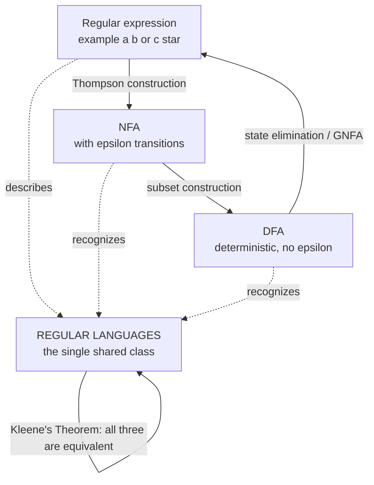

# 🔤 Regular Expressions and Kleene's Theorem

> [!abstract] TL;DR
> A **regular expression** is a tiny algebraic language for describing *sets of strings*, built from three symbols and three operations: **union** (`|`), **concatenation**, and **Kleene star** (`*`). **Kleene's Theorem** is the foundational bridge of automata theory: a language is *regular* if and only if it is described by a regular expression if and only if it is recognized by a finite automaton. Regexes, NFAs, and DFAs are three notations for the **exact same** class of languages — you can mechanically convert any one into the others. The "regex" in your programming language is a *superset* of this idea: backreferences push it beyond regular languages and open the door to catastrophic backtracking (**ReDoS**).

---

## Intuition

**Analogy first.** Think of a regular expression as a **stencil for words**. A stencil for a car license plate might say "one letter, then any run of digits" — it does not list every valid plate, it describes the *shape* every valid plate must have. A regex is exactly that: a compact rule that carves out a set of strings (the *language*) from all possible strings, without ever enumerating them.

Now the remarkable part. Every stencil you can write in this little language corresponds *exactly* to a **finite-state machine** — a device with a fixed number of memory positions that reads a string left-to-right and lands in an "accept" or "reject" state. Two utterly different-looking things — an algebraic formula and a wiring diagram of states — describe *precisely the same* patterns. That equivalence is Kleene's Theorem, and it is why "regular expression" and "finite automaton" are two dialects for one idea. See [[Finite_Automata_DFA_and_NFA]] for the machine side of this coin.

---

## How It Works

### The definition of a regular expression

Regular expressions are defined **inductively** over an alphabet `Σ`. There are three **base cases** and three **operations**.

**Base cases** (the atoms):
1. `∅` — the empty set (matches nothing at all).
2. `ε` — the empty string (matches exactly the zero-length string).
3. `a` — a single symbol, for each `a ∈ Σ` (matches just that one character).

**Operations** (build bigger expressions from smaller ones), given regexes `R` and `S`:
1. **Union / alternation** `R | S` — matches anything matching `R` *or* `S`. Language: `L(R) ∪ L(S)`.
2. **Concatenation** `R S` — a match of `R` immediately followed by a match of `S`. Language: `{ xy : x ∈ L(R), y ∈ L(S) }`.
3. **Kleene star** `R*` — zero or more copies of `R` concatenated. Language: `L(R)* = {ε} ∪ L(R) ∪ L(R)L(R) ∪ …`.

Precedence, highest to lowest: **star > concatenation > union**. So `ab|c*` means `(ab) | (c*)`. Parentheses override this. A language is defined to be **regular** precisely when *some* regular expression describes it — that is the definition of the class from the algebra side.

> Example: `a(b|c)*` describes "an `a` followed by any run of `b`s and `c`s": `a`, `ab`, `ac`, `abc`, `acbbc`, … The star handles "zero or more", the union handles "either symbol each time".

### Kleene's Theorem — the three-way equivalence

Stephen Kleene (1951) proved that the following three statements about a language `L` are **equivalent**:

1. `L` is described by some **regular expression**.
2. `L` is recognized by some **NFA** (nondeterministic finite automaton).
3. `L` is recognized by some **DFA** (deterministic finite automaton).

Because these are all equivalent, they define a single robust class — the **regular languages** — that is invariant to *how* you specify it. The proof is constructive: it gives algorithms to convert each representation into the others. Those constructions are the practical heart of the theorem.

### Construction 1 — regex to NFA (Thompson's construction)

Thompson's construction builds an NFA **compositionally**, mirroring the inductive structure of the regex. Each sub-expression becomes a small NFA "fragment" with exactly one start state and one accept state, glued together with **epsilon transitions** (moves that consume no input):

- **Symbol `a`**: `start --a--> accept`.
- **Concatenation `RS`**: epsilon-link `R`'s accept to `S`'s start.
- **Union `R|S`**: a new start epsilon-branches into both fragments; both accepts epsilon-merge into a new accept.
- **Star `R*`**: a new start epsilon-goes to the fragment *and* skips to a new accept; the fragment's accept loops back and also exits.

The result has `O(m)` states for a regex of length `m`, and every operation adds a constant number of states — clean, linear, and exactly what real regex engines compile to.

### Construction 2 — NFA to DFA (subset construction)

An NFA can be "in many states at once"; a DFA cannot. The **subset construction** builds a DFA whose states are *sets* of NFA states (the current epsilon-closure). This removes nondeterminism at the cost of up to `2^n` states in the worst case (an exponential blow-up that is genuinely unavoidable for some languages). Details live in [[Finite_Automata_DFA_and_NFA]].

### Construction 3 — automaton to regex (state elimination / GNFA)

To go the other way, convert the automaton into a **GNFA** (generalized NFA whose *edges are labelled with regexes*), then **eliminate states one at a time**. Removing a state `q` rewires every in-edge `p→q` and out-edge `q→r` into a direct edge `p→r` labelled `R_pq (R_qq)* R_qr`, absorbing `q`'s self-loop with a star. Keep eliminating until only the start and a single accept remain; the surviving edge's label is a regex for the whole language. This is the constructive proof that **every** finite automaton has an equivalent regex.

### Flow / Architecture — the equivalence triangle



---

## Key Concepts

### Secondary (plain-language takeaway)
- A regular expression is a rulebook for a **set of strings**, made from OR, "one thing after another", and "repeat zero or more times".
- Every such rulebook can be turned into a **machine** that reads a string and says yes or no — and vice-versa. They are two views of the same thing.
- The `regex` in your editor's search box is this idea, plus extra conveniences.

### Undergraduate (the CS-course core)
- **Inductive definition** over base cases `∅, ε, a` and operations union, concatenation, star; this *defines* the regular languages.
- **Kleene's Theorem**: regex `⇔` NFA `⇔` DFA, all equal in power to the class of regular languages.
- **Thompson's construction** (regex → NFA, linear size, uses epsilon moves), **subset construction** (NFA → DFA), **state elimination / GNFA** (automaton → regex).
- **Closure properties**: regular languages are closed under union, concatenation, star, **intersection**, **complement**, reversal, and homomorphism — closure under complement/intersection is easiest to see on DFAs.
- **Limits**: not every language is regular. The [[Non_Regular_Languages_and_the_Pumping_Lemma|pumping lemma]] proves languages like `{ aⁿbⁿ : n ≥ 0 }` are *not* regular because a finite machine cannot count unboundedly.

### Graduate (deeper structure)
- **Kleene algebra**: regexes form an algebra with identities — `R|S = S|R`, `(R|S)|T = R|(S|T)`, `∅|R = R`, `εR = R`, `∅R = ∅`, `R* = ε|RR*`, `(R*)* = R*`, and distributivity of concatenation over union. **Kleene algebra with tests (KAT)** extends this to reason about program control flow.
- **Decidability of equivalence**: whether two regexes denote the same language is **decidable** — convert both to minimal DFAs (unique up to isomorphism by the Myhill–Nerode theorem) and compare, or check that the symmetric difference automaton accepts nothing. This is `PSPACE`-complete for regexes in general.
- **Myhill–Nerode theorem**: gives an exact characterization of regularity via the number of equivalence classes of a right-congruence, and yields the *minimal* DFA.
- **Derivatives (Brzozowski)**: an alternative regex→DFA route that differentiates a regex by a symbol, giving elegant, algebraic matching and minimal-ish automata directly.

---

## Python Demo

```python
# Thompson's construction: compile a regular expression into an NFA, then
# simulate that NFA. This demonstrates Kleene's Theorem CONCRETELY --- the
# machine accepts EXACTLY the strings the regex describes.
# numpy/matplotlib only (no `re`, no networkx): we build the automaton by hand.

import numpy as np
import matplotlib.pyplot as plt

EPS = None  # marker for an epsilon (empty-string) transition


class NFA:
    """An NFA built by Thompson's construction. States are integers 0..n-1."""
    def __init__(self):
        self.n = 0            # number of states
        self.delta = {}       # (state, symbol) -> set of destination states
        self.start = None
        self.accept = None

    def new_state(self):
        s = self.n
        self.n += 1
        return s

    def add(self, src, symbol, dst):
        self.delta.setdefault((src, symbol), set()).add(dst)


# --- Recursive-descent parser that emits Thompson fragments (start, accept) ---
# Grammar, low -> high precedence:
#   regex  := concat ('|' concat)*
#   concat := factor+
#   factor := atom '*'*
#   atom   := '(' regex ')' | <symbol>
class Compiler:
    def __init__(self, pattern, nfa):
        self.s, self.i, self.nfa = pattern, 0, nfa

    def peek(self):
        return self.s[self.i] if self.i < len(self.s) else ''

    def eat(self):
        c = self.s[self.i]; self.i += 1; return c

    def regex(self):
        frag = self.concat()
        while self.peek() == '|':
            self.eat()
            frag = self._union(frag, self.concat())
        return frag

    def concat(self):
        frag = None
        while self.peek() not in ('', '|', ')'):
            f = self.factor()
            frag = f if frag is None else self._cat(frag, f)
        if frag is None:                     # empty -> epsilon fragment
            s, a = self.nfa.new_state(), self.nfa.new_state()
            self.nfa.add(s, EPS, a)
            frag = (s, a)
        return frag

    def factor(self):
        frag = self.atom()
        while self.peek() == '*':
            self.eat()
            frag = self._star(frag)
        return frag

    def atom(self):
        if self.peek() == '(':
            self.eat()
            frag = self.regex()
            self.eat()                       # consume ')'
            return frag
        c = self.eat()                       # a single symbol
        s, a = self.nfa.new_state(), self.nfa.new_state()
        self.nfa.add(s, c, a)
        return (s, a)

    # Thompson combinators ----------------------------------------------------
    def _cat(self, A, B):
        self.nfa.add(A[1], EPS, B[0])
        return (A[0], B[1])

    def _union(self, A, B):
        s, a = self.nfa.new_state(), self.nfa.new_state()
        self.nfa.add(s, EPS, A[0]); self.nfa.add(s, EPS, B[0])
        self.nfa.add(A[1], EPS, a); self.nfa.add(B[1], EPS, a)
        return (s, a)

    def _star(self, A):
        s, a = self.nfa.new_state(), self.nfa.new_state()
        self.nfa.add(s, EPS, A[0]); self.nfa.add(s, EPS, a)
        self.nfa.add(A[1], EPS, A[0]); self.nfa.add(A[1], EPS, a)
        return (s, a)


def build_nfa(pattern):
    nfa = NFA()
    start, accept = Compiler(pattern, nfa).regex()
    nfa.start, nfa.accept = start, accept
    return nfa


# --- Epsilon-closure as a numpy boolean reachability matrix ------------------
def epsilon_closure_matrix(nfa):
    """reach[i, j] is True iff j is reachable from i using only epsilon moves."""
    E = np.zeros((nfa.n, nfa.n), dtype=bool)
    np.fill_diagonal(E, True)                                  # reflexive
    for (src, sym), dsts in nfa.delta.items():
        if sym is EPS:
            for d in dsts:
                E[src, d] = True
    reach = E.copy()
    while True:                                               # boolean transitive closure
        composed = (reach[:, :, None] & reach[None, :, :]).any(axis=1)
        nxt = reach | composed
        if np.array_equal(nxt, reach):
            return reach
        reach = nxt


def closure_of(states, reach):
    out = set()
    for s in states:
        out.update(np.nonzero(reach[s])[0].tolist())
    return out


def accepts(nfa, reach, string):
    """Simulate the NFA on `string`; True iff a run ends in the accept state."""
    current = closure_of({nfa.start}, reach)
    for ch in string:
        move = set()
        for s in current:
            move |= nfa.delta.get((s, ch), set())
        current = closure_of(move, reach)
        if not current:                                      # stuck -> reject early
            return False
    return nfa.accept in current


if __name__ == "__main__":
    pattern = "a(b|c)*"     # an 'a' followed by any run of b's and c's
    nfa = build_nfa(pattern)
    reach = epsilon_closure_matrix(nfa)

    print(f"Regex : {pattern}")
    print(f"NFA   : {nfa.n} states, start={nfa.start}, accept={nfa.accept}\n")

    tests = ["a", "ab", "ac", "abc", "acb", "abbccb",
             "", "b", "ba", "abx", "aa"]
    print(f"{'string':10}{'accepted':>10}")
    print("-" * 20)
    for t in tests:
        print(f"{repr(t):10}{str(accepts(nfa, reach, t)):>10}")

    # Visualize the NFA's internal epsilon-closure reachability (pure numpy).
    plt.figure(figsize=(5, 4.2))
    plt.imshow(reach, cmap="Greys", interpolation="nearest")
    plt.title("Epsilon-closure reachability\nfor the NFA of  a(b|c)*")
    plt.xlabel("to state"); plt.ylabel("from state")
    plt.xticks(range(nfa.n)); plt.yticks(range(nfa.n))
    plt.colorbar(label="reachable via epsilon moves")
    plt.tight_layout()
    plt.savefig("thompson_nfa_closure.png", dpi=120)
    print("\nSaved epsilon-closure heatmap -> thompson_nfa_closure.png")

# Expected: 'a', 'ab', 'ac', 'abc', 'acb', 'abbccb' -> True;
#           '', 'b', 'ba', 'abx', 'aa'              -> False.
# The NFA accepts exactly L(a(b|c)*) --- Kleene's Theorem, made runnable.
```

Running it prints a match table where `a`, `ab`, `ac`, `abc`, `acb`, `abbccb` are accepted and `''`, `b`, `ba`, `abx`, `aa` are rejected — precisely the language `L(a(b|c)*)`. The heatmap shows which states are mutually reachable by epsilon moves, the exact structure the simulator collapses at each step.

---

## Real-World Applications

- **Lexical analysis (compilers).** Every tokenizer front-end (lex, flex, ANTLR's lexer) specifies token classes as regular expressions, compiles them via Thompson's construction, then runs the resulting DFA to slice source code into tokens. This is Kleene's Theorem doing production work millions of times a second.
- **`grep`, `RE2`, and search.** `grep` and Google's **RE2** implement matching as **automaton simulation** rather than backtracking, guaranteeing linear-time matching in the input length — a direct application of the NFA/DFA equivalence. RE2 deliberately *refuses* features (like backreferences) that would break the regular-language guarantee.
- **Input validation, syntax highlighting, log parsing.** Email/phone/URL shape checks, editor highlighting, and SIEM log rules are all regular-language pattern matching. See automaton-based matching alongside classic string search in [[String_Matching_Overview]].
- **Network intrusion detection.** Signature engines (Snort, Suricata) compile large regex rule sets into combined automata to scan traffic at line rate.
- **Protocol and format specification.** Token grammars for URIs, CSV, and many wire formats are regular and drive validators generated from the regex.

---

## Common Pitfalls

- **Confusing "regular expression" (the math) with "regex" (the tool).** The mathematical object has only union, concatenation, and star. Real libraries (PCRE, Perl, Python `re`) add **backreferences** (`\1`), lookaround, and recursion. With backreferences, `(a*)\1` matches `{ aⁿaⁿ }`, which is **not** a regular language — so these engines are strictly *more* powerful than finite automata and no longer enjoy the linear-time guarantee.
- **ReDoS — catastrophic backtracking.** Backtracking engines can take **exponential** time on adversarial input. A pattern like `(a+)+$` against a long string of `a`s followed by `!` explores exponentially many ways to split the `a`s before failing. This is the **ReDoS** denial-of-service vulnerability: attacker-supplied input freezes a thread. Mitigate by using automaton-based engines (RE2), avoiding nested/ambiguous quantifiers, adding timeouts, and treating user-supplied patterns as untrusted input (see [[OWASP_Top_10]] and [[API_Security]]).
- **Assuming regexes can match nested structures.** Balanced parentheses, matched HTML tags, and `aⁿbⁿ` are **not regular** — a finite machine cannot count without bound. Trying to force it is the classic "you can't parse HTML with regex" trap; you need a pushdown automaton / context-free grammar. The impossibility is proved by the [[Non_Regular_Languages_and_the_Pumping_Lemma|pumping lemma]].
- **Exponential DFA blow-up.** Subset construction can turn an `n`-state NFA into a `2^n`-state DFA. For patterns like `(0|1)*1(0|1)^k`, the minimal DFA is genuinely exponential — a real memory concern when compiling to DFAs eagerly.
- **Greedy vs lazy quantifiers ≠ different languages.** `a*` greedy and `a*?` lazy match the *same set of strings*; they differ only in *which* match a backtracking engine reports first. That distinction is an artifact of the tool, not of regular-language theory.
- **Forgetting epsilon-closure in simulation.** A hand-rolled NFA simulator that ignores epsilon moves will miss matches. Every step must close over epsilon transitions (as the demo's `closure_of` does).

---

## Related Concepts

- [[Finite_Automata_DFA_and_NFA]] — the machine side of Kleene's Theorem; DFAs, NFAs, epsilon transitions, and the subset construction that this note converts regexes into.
- [[Non_Regular_Languages_and_the_Pumping_Lemma]] — the boundary of regularity; proves which languages *cannot* be captured by any regex or finite automaton.
- [[Theory_of_Computation_Overview]] — where regular languages sit in the Chomsky hierarchy, below context-free and Turing-recognizable classes.
- [[String_Matching_Overview]] — practical substring/pattern search (KMP, Z, Rabin-Karp); complements automaton-based regex matching.
- [[OWASP_Top_10]] — security context for ReDoS as a denial-of-service risk from untrusted regex input.
- [[API_Security]] — input-validation and rate-limiting defenses relevant to ReDoS mitigation at the API boundary.

---

## Review Questions

1. **(Undergraduate)** State Kleene's Theorem in full. Given the regex `(0|1)*01`, sketch the Thompson NFA fragment for it and describe in one sentence the language it accepts.
2. **(Scenario)** You are asked to validate that user input is a run of `a`s and `b`s that is a *palindrome*. A colleague proposes a single regular expression. Explain, using the concept behind the pumping lemma, why no regular expression can do this, and what class of machine you actually need.
3. **(Trade-off / applied)** Your service lets customers submit their own search patterns. Compare using Python's built-in `re` (backtracking) versus Google's `RE2` (automaton-based). Which class of languages does each support, what is the worst-case time behavior of each, and how does that choice affect your exposure to ReDoS?

---

## Sources

- Sipser, M. *Introduction to the Theory of Computation*, 3rd ed. — Chapter 1 (regular languages, Kleene's Theorem, GNFA state elimination).
- Hopcroft, Motwani, Ullman. *Introduction to Automata Theory, Languages, and Computation*, 3rd ed. — regular expressions, Thompson construction, subset construction.
- Kleene, S. C. (1951). "Representation of Events in Nerve Nets and Finite Automata." *Automata Studies*, Princeton University Press.
- Cox, R. "Regular Expression Matching Can Be Simple And Fast." — https://swtch.com/~rsc/regexp/regexp1.html (Thompson NFAs, RE2, and why backtracking engines suffer ReDoS).
- OWASP. "Regular Expression Denial of Service (ReDoS)." — https://owasp.org/www-community/attacks/Regular_expression_Denial_of_Service_-_ReDoS

---

#theory-of-computation #regular-expressions #kleene-theorem #regex #regular-languages
