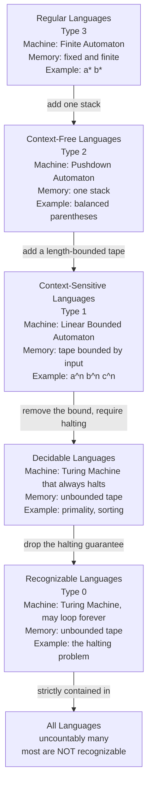

# 🧮 Theory of Computation Overview

> [!abstract] TL;DR
> The theory of computation is the mathematical study of **what can be computed and how efficiently** — the bedrock of computer science. It has three intertwined branches: **automata theory** (idealized machine models and the languages they recognize), **computability theory** (what any machine can solve *at all* — and the shocking discovery that some well-posed problems can never be solved by any algorithm), and **complexity theory** (what can be solved *efficiently* — the home of P vs NP). Its master idea is to pin every "problem" down as a **formal language** — a set of strings — so that questions about computers become precise questions about mathematics. This note is the entry point to the vault and maps the road ahead.

---

## Intuition

**Analogy — three clerks with three desks.** Picture hiring a clerk to answer yes/no questions about strings of symbols slid under the door.

- **Clerk A** has only a small **fixed checklist** in their head and no scratch paper. They can track "am I currently in state 3 or state 7?" but they cannot count arbitrarily high, because their memory is a fixed finite size no matter how long the input.
- **Clerk B** has the same head, plus a single **spike of papers** — a stack. They can push a note when they see an opening bracket and pop one when they see a closing bracket. Now they can match nested structure, which Clerk A never could.
- **Clerk C** has an **endless notebook** they can scribble on, erase, and revisit anywhere. This is essentially unlimited memory. Clerk C can, given enough time, compute *anything a real computer can*.

As you upgrade the desk, each clerk can answer strictly harder questions — a **ladder of increasingly powerful idealized computers**. The theory of computation is the science of exactly three questions about this ladder:

1. **What can be computed *at all*?** Is there a desk powerful enough to answer this question? Astonishingly, some perfectly precise questions (like "will this program eventually stop?") have **no** answer on *any* desk — this is **computability theory**.
2. **What can be computed *efficiently*?** Even when the endless-notebook clerk *can* answer, do they finish before the heat death of the universe, or must they scribble for exponentially long? This is **complexity theory**, and its billion-dollar mystery is **P vs NP**.
3. **How much power does each rung actually buy?** Exactly which problems need the stack, which need the notebook, and which need nothing but a checklist? This is **automata theory**, and it produces the **Chomsky hierarchy**.

The genius move that makes all three questions rigorous: treat a "problem" as a **language** — a set of strings the clerk should accept — so computing becomes membership testing, and everything reduces to sets and machines.

---

## How It Works

### Core Mechanics

**1. Everything is a language.** Fix a finite **alphabet** (say the symbols `0` and `1`). A **string** is a finite sequence of symbols; a **language** is any set of strings. The trick that unifies the whole field: encode every decision problem as "is string *w* in language *L*?"

- "Is *n* prime?" becomes "is the binary encoding of *n* in the language PRIMES?"
- "Does this graph have a Hamiltonian cycle?" becomes membership in the language HAM.
- "Is this bracket string balanced?" becomes membership in the language BALANCED.

A **machine decides / recognizes** a language if it accepts exactly the strings inside it. Now the vague word "compute" has a precise meaning, and the alphabet of strings is a universal currency (numbers, graphs, programs — all encode as strings).

**2. Machines form a hierarchy of power.** Each rung of the ladder is a machine model defined by *how much memory it may use and how it may access it*:

| Machine | Memory | Recognizes | Example language |
|---|---|---|---|
| **Finite automaton** (DFA / NFA) | fixed, finite (states only) | **Regular** languages | `a* b*`, "even number of 1s", most regex |
| **Pushdown automaton** (PDA) | one **stack** | **Context-free** languages | balanced parentheses, `aⁿbⁿ`, arithmetic expressions |
| **Linear bounded automaton** (LBA) | tape bounded by input length | **Context-sensitive** languages | `aⁿbⁿcⁿ`, "copy" language |
| **Turing machine** (TM) | **unbounded** tape | **Recursively enumerable** languages | anything computable, incl. the halting problem |

Each machine is strictly more powerful than the one above: a stack lets you count nesting a checklist cannot; an unbounded tape lets you do arithmetic and simulate any real program.

**3. The Chomsky hierarchy.** Noam Chomsky (1956) showed these machine classes correspond exactly to families of **grammars** (rewriting rules) and nest as strict subsets:

$$\text{Regular} \subsetneq \text{Context-Free} \subsetneq \text{Context-Sensitive} \subsetneq \text{Decidable} \subsetneq \text{Recognizable} \subsetneq \text{All Languages}$$

The subsets are *strict*: the **pumping lemma** proves `aⁿbⁿ` is not regular (no fixed memory can count), a similar argument proves `aⁿbⁿcⁿ` is not context-free, and a **counting argument** proves *most* languages are not even recognizable (there are uncountably many languages but only countably many programs).

**4. The Turing machine and the Church-Turing thesis.** The Turing machine (Alan Turing, 1936) is the top of the ladder and the accepted **definition of "computable."** The remarkable **Church-Turing thesis** states that every reasonable model of computation — Turing machines, Alonzo Church's **lambda calculus**, Gödel–Kleene **recursive functions**, register machines, and your laptop — computes *exactly the same class of functions*. Nobody has ever found a physically realizable model that computes more. This is why "algorithm" can be *defined* precisely as "what a Turing machine can do." (See [[Mathematical_Logic_and_Set_Theory]] for the logical backdrop and Gödel connection.)

**5. The great results the vault builds toward.**
- **The Halting Problem is undecidable** (Turing, 1936): no program can decide, for every program–input pair, whether it eventually halts. Proved by a self-referential diagonalization. This is the first proof that *some problems are unsolvable in principle*, not just hard.
- **P vs NP** (Cook–Levin, 1971): is every problem whose solution can be *checked* quickly also *solved* quickly? The central open question of computer science, worth a Clay Millennium Prize. (See [[Time_Complexity_Classes]].)
- **NP-completeness**: thousands of practical problems (SAT, traveling salesman, scheduling) are the "hardest in NP" — solve one efficiently and you solve them all.

### Flow / Architecture



*Each arrow means the lower class **strictly contains** the one above it: more memory buys strictly more languages. The jump from `DEC` to `RE` is where computability breaks — those languages a machine can recognize but never reliably reject.*

---

## Key Concepts

**Secondary (intuitive, no CS background needed)**
- **Alphabet, string, language** — the raw material: symbols, sequences of symbols, and sets of sequences.
- **State machine** — a device with a fixed set of "modes" that flips between them as it reads input; a traffic light or a vending machine is one.
- **Accept vs reject** — a machine answers a yes/no question about its input.
- **The ladder idea** — more memory = more solvable problems.

**Undergraduate (a first theory course)**
- **DFA / NFA and regular expressions** — three equivalent descriptions of the regular languages (Kleene's theorem).
- **Pumping lemma** — the standard tool proving a language is *not* regular (or not context-free).
- **Context-free grammars and pushdown automata** — the math behind parsing and compilers.
- **Turing machines, deciders vs recognizers** — decidable languages always halt; recognizable ones may loop on rejects.
- **The Halting Problem and reductions** — proving new problems undecidable by reducing halting to them; **Rice's theorem** (every nontrivial semantic property of programs is undecidable).
- **Complexity classes P, NP, NP-complete** — polynomial time, verifiable-in-polynomial-time, and the Cook–Levin theorem.

**Graduate (advanced theory)**
- **Space complexity and hierarchy theorems** — L, NL, PSPACE; Savitch's and the time/space hierarchy theorems proving strict separations.
- **The polynomial hierarchy, #P, and interactive proofs** — IP = PSPACE, PCP theorem and hardness of approximation.
- **Randomized and quantum models** — BPP, BQP; whether randomness or quantum superposition adds computational power.
- **Descriptive and Kolmogorov complexity** — measuring the intrinsic information of a string as the length of its shortest generating program (see [[Minimum_Description_Length_and_Model_Selection]]).
- **Oracle machines and relativization** — why P vs NP resists the classical proof techniques.

---

## Python Demo

```python
# The ladder of computational power, made concrete.
# Three recognizers of increasing strength, each needing strictly more memory:
#   DFA  : fixed finite memory (states only) -> a REGULAR language
#   PDA  : one unbounded stack               -> a CONTEXT-FREE language
#   LBA  : bounded working counters          -> a CONTEXT-SENSITIVE language
# We then (a) show a fixed-memory machine FAILS on nesting a stack handles,
# and (b) draw the nested containment of the language classes.
# numpy / matplotlib only.

import numpy as np
import matplotlib.pyplot as plt
from matplotlib.patches import Ellipse

# ---------------------------------------------------------------------------
# 1. REGULAR  ->  DFA for the language  a*b*  (any a's, then any b's).
#    Only a fixed set of states. It cannot count -- and does not need to.
# ---------------------------------------------------------------------------
def dfa_a_star_b_star(s):
    state = 0  # 0 = reading a's, 1 = reading b's, 2 = dead
    trans = {(0, 'a'): 0, (0, 'b'): 1,
             (1, 'a'): 2, (1, 'b'): 1}   # an 'a' after any 'b' is illegal
    for ch in s:
        state = trans.get((state, ch), 2)
    return state in (0, 1)

# ---------------------------------------------------------------------------
# 2. CONTEXT-FREE  ->  pushdown recognizer for balanced parentheses.
#    Needs a STACK whose height grows with nesting depth -> beyond any DFA.
# ---------------------------------------------------------------------------
def pda_balanced(s):
    stack = []
    for ch in s:
        if ch == '(':
            stack.append(ch)
        elif ch == ')':
            if not stack:
                return False
            stack.pop()
        else:
            return False
    return len(stack) == 0

# ---------------------------------------------------------------------------
# 3. CONTEXT-SENSITIVE  ->  recognizer for  a^n b^n c^n  (equal, in order).
#    Provably NOT context-free: one stack cannot verify three matched counts.
#    A linear-bounded automaton (bounded tape) can.
# ---------------------------------------------------------------------------
def lba_anbncn(s):
    i, na, nb, nc = 0, 0, 0, 0
    while i < len(s) and s[i] == 'a': na += 1; i += 1
    while i < len(s) and s[i] == 'b': nb += 1; i += 1
    while i < len(s) and s[i] == 'c': nc += 1; i += 1
    return i == len(s) and na == nb == nc and na > 0

# ---------------------------------------------------------------------------
# Print which recognizer accepts which sample string.
# ---------------------------------------------------------------------------
samples = ["", "aabb", "abab", "(())", "(()", "aaabbbccc", "aabbcc", "((()))"]
verdict = lambda ok: "accept" if ok else "reject"

print("Ladder of computational power -- which class accepts which string")
header = f"{'input':<12}{'DFA (reg)':>12}{'PDA (cfl)':>12}{'LBA (csl)':>12}"
print(header)
print("-" * len(header))
for s in samples:
    disp = "''" if s == "" else s
    print(f"{disp:<12}"
          f"{verdict(dfa_a_star_b_star(s)):>12}"
          f"{verdict(pda_balanced(s)):>12}"
          f"{verdict(lba_anbncn(s)):>12}")

# ---------------------------------------------------------------------------
# Why FIXED memory cannot climb to context-free: a finite counter capped at K
# saturates once nesting depth exceeds K. Only an unbounded stack always works.
# ---------------------------------------------------------------------------
def finite_counter_balanced(s, K):
    depth = 0
    for ch in s:
        if ch == '(':
            depth += 1
            if depth > K:            # fixed memory is exhausted -> gives up
                return "OVERFLOW"
        elif ch == ')':
            depth -= 1
            if depth < 0:
                return False
    return depth == 0

print("\nThe jump from regular to context-free (fixed memory K = 2):")
for s in ["()", "(())", "((()))"]:
    fin = finite_counter_balanced(s, K=2)
    print(f"  depth {s.count('('):>1}: finite counter -> {str(fin):<8} | unbounded stack -> {pda_balanced(s)}")

# ---------------------------------------------------------------------------
# Visualize the CONTAINMENT of the language classes as a nested Venn.
# ---------------------------------------------------------------------------
# (label, semi-width, semi-height, color, machine note)
layers = [
    ("All languages",       9.6, 8.2, "#f0f0f0", "uncountably many"),
    ("Recognizable",        8.0, 6.8, "#e3ccff", "Turing machine, may loop"),
    ("Decidable",           6.4, 5.4, "#cce3ff", "Turing machine, always halts"),
    ("Context-sensitive",   4.8, 4.0, "#ccffcc", "linear bounded automaton"),
    ("Context-free",        3.3, 2.7, "#ffe0b3", "pushdown automaton + stack"),
    ("Regular",             1.9, 1.5, "#ffcccc", "finite automaton"),
]

fig, ax = plt.subplots(figsize=(9, 8))
for name, w, h, color, note in layers:
    ax.add_patch(Ellipse((0, 0), 2 * w, 2 * h, facecolor=color,
                         edgecolor="black", lw=1.2, zorder=1))
for name, w, h, color, note in layers:
    ax.text(0, h - 0.42, name, ha="center", va="top",
            fontsize=10.5, fontweight="bold", zorder=3)
    ax.text(0, h - 1.05, note, ha="center", va="top",
            fontsize=7.5, style="italic", color="#333333", zorder=3)

# drop a sample language into its innermost class
for label, y in [("a*b*", -1.0), ("balanced ()", -3.1),
                 ("a^n b^n c^n", -4.5), ("primality", -5.9),
                 ("halting problem", -7.3)]:
    ax.plot(0, y, "ko", ms=4, zorder=4)
    ax.text(0.3, y, label, ha="left", va="center", fontsize=8, zorder=4)

ax.set_xlim(-10.5, 10.5)
ax.set_ylim(-9, 9)
ax.set_aspect("equal")
ax.axis("off")
ax.set_title("The Chomsky hierarchy: nested classes of formal languages",
             fontsize=12, fontweight="bold")
plt.tight_layout()
plt.savefig("chomsky_hierarchy.png", dpi=130)
print("\nSaved nested-Venn of the language classes to chomsky_hierarchy.png")
```

Running it prints the accept/reject table (the DFA takes `a*b*`, the PDA takes balanced parens, the LBA takes `aⁿbⁿcⁿ` — each language sits on a different rung), demonstrates that a fixed-memory counter *overflows* on nesting a stack handles effortlessly, and saves the nested-Venn showing `Regular ⊂ Context-Free ⊂ Context-Sensitive ⊂ Decidable ⊂ Recognizable ⊂ All`.

---

## Real-World Applications

> **Example — the automaton stack under every regex engine and compiler.** When you type a regular expression in `grep`, a text editor, or a firewall rule, it is compiled into a **finite automaton** and matched in linear time — the *regular* rung in action ([[String_Matching_Overview]] shows the same automaton idea inside string search). The moment a language needs to *balance nested structure* (matching braces, HTML tags, arithmetic precedence), a finite automaton is provably insufficient and every compiler moves up to a **pushdown automaton** and a **context-free grammar** in its parser (Yacc, ANTLR, LALR tables). This is not folklore — it is why `regex` famously cannot parse arbitrarily nested HTML: that language is not regular.

Beyond parsing:
- **Complexity theory classifies real algorithms.** Whether a scheduling, routing, or verification task is in P or is NP-complete tells engineers whether to seek an exact polynomial algorithm or settle for heuristics and approximation ([[Time_Complexity_Classes]], [[Big_O_Notation]]).
- **Cryptography is built on assumed hardness.** RSA and elliptic-curve schemes are secure precisely because factoring and discrete-log are believed to be *outside* efficient computation — a bet on complexity theory ([[Asymmetric_Cryptography_and_PKI]]).
- **Undecidability sets hard limits on tooling.** No static analyzer can perfectly detect all infinite loops, dead code, or malware behavior — Rice's theorem says every nontrivial semantic property of programs is undecidable, so every such tool must be conservative.
- **Kolmogorov complexity and information.** The shortest program generating a string measures its intrinsic information, tying computation to compression and randomness ([[Information_Theory_Overview]], [[Minimum_Description_Length_and_Model_Selection]]).

---

## Common Pitfalls

- **Confusing "hard" with "impossible."** NP-complete problems are (probably) *intractable* — slow for large inputs — but perfectly *decidable*. Undecidable problems like the halting problem are a different, absolute barrier: no algorithm exists at any speed. Complexity theory and computability theory answer different questions.
- **Assuming a bigger machine can recognize more than a Turing machine.** By the Church-Turing thesis, adding tapes, nondeterminism, or randomness does **not** expand what is *computable* — only, sometimes, how *efficiently*. A multi-tape TM and a one-tape TM decide exactly the same languages.
- **Thinking regex can match nested structure.** True regular expressions cannot count nesting depth (it is not a regular language). Modern "regex" libraries with backreferences and recursion are *not* the regular expressions of theory — they have escaped the regular rung.
- **Reading `⊂` as "sometimes contained."** The Chomsky inclusions are **strict**: there provably exist context-free languages that are not regular, and recognizable languages that are not decidable. The gaps are real and proven, not open questions.
- **Mixing up decidable and recognizable.** A *recognizer* may loop forever on strings it should reject; a *decider* always halts with yes or no. A language is decidable iff both it and its complement are recognizable.
- **Believing P vs NP is settled or obviously true.** It is famously open. "NP" means *verifiable* quickly, not *nondeterministically magical*; whether verification implies fast solving is the unsolved question.

---

## Related Concepts

- [[Time_Complexity_Classes]] — the applied face of complexity theory; P, NP, and Big-O growth rates that classify concrete algorithms.
- [[Big_O_Notation]] — the asymptotic language used to state complexity results precisely.
- [[Mathematical_Logic_and_Set_Theory]] — Turing machines, the halting problem, the Church-Turing thesis, and Gödel's incompleteness live here on the logic side.
- [[Logic_and_Proof_Techniques]] — diagonalization, proof by contradiction, and formal reasoning underpin every undecidability and separation proof.
- [[Set_Theory_and_Relations]] — languages *are* sets of strings; countability vs uncountability is why most languages are unrecognizable.
- [[String_Matching_Overview]] — practical string search built on the same automaton machinery as the regular languages.
- [[Information_Theory_Overview]] — Kolmogorov / algorithmic information measures a string's content as its shortest program, bridging computation and Shannon information.
- [[Minimum_Description_Length_and_Model_Selection]] — the statistical incarnation of shortest-program complexity.
- [[Asymmetric_Cryptography_and_PKI]] — security founded on problems believed to lie beyond efficient computation.

---

## Vault Roadmap — the six sections

1. **Automata and Regular Languages** *(this section)* — DFAs, NFAs, regular expressions, Kleene's theorem, the pumping lemma, closure properties, and minimization.
2. **Context-Free Languages and Pushdown Automata** — context-free grammars, PDAs, Chomsky/Greibach normal forms, parsing (CYK, LL, LR), and the CFL pumping lemma.
3. **Turing Machines and the Church-Turing Thesis** — the TM model and its variants, universal machines, and why all reasonable models coincide.
4. **Computability and Undecidability** — the halting problem, mapping reductions, Rice's theorem, the arithmetical hierarchy, and recursively enumerable vs decidable.
5. **Complexity Theory** — time/space classes, P, NP, the Cook–Levin theorem, NP-completeness catalogues, and coNP.
6. **Advanced Topics** — space complexity and hierarchy theorems, the polynomial hierarchy, randomized/quantum/interactive models, and descriptive complexity.

---

## Review Questions

1. **(Conceptual)** Explain, using the "three clerks" ladder, why a finite automaton cannot recognize the language of balanced parentheses but a pushdown automaton can. What exact capability does the stack add, and what feature of the language demands it?
2. **(Scenario)** You are asked to write a tool that flags any user-submitted program that will run forever. Your teammate promises a version that is correct on *every* input. Referencing the halting problem and Rice's theorem, explain why this promise is impossible, and describe the *conservative* compromise real linters and analyzers actually make.
3. **(Trade-off / distinction)** A problem is proven to be (a) undecidable versus (b) NP-complete. For each, state precisely what that verdict tells you about whether — and how — you should attempt to solve instances in practice, and why conflating the two leads to the wrong engineering decision.

---

## Sources

- Sipser, M. *Introduction to the Theory of Computation*, 3rd ed. Cengage, 2013 — the standard modern textbook covering all three branches.
- Hopcroft, J., Motwani, R., Ullman, J. *Introduction to Automata Theory, Languages, and Computation*, 3rd ed. Pearson, 2006 — the classic automata and Chomsky-hierarchy reference.
- Turing, A. M. "On Computable Numbers, with an Application to the Entscheidungsproblem." *Proc. London Math. Soc.*, 1936 — the founding paper: Turing machines and the undecidability of the halting problem.
- Chomsky, N. "Three Models for the Description of Language." *IRE Transactions on Information Theory*, 1956 — introduces the grammar hierarchy.
- Arora, S., Barak, B. *Computational Complexity: A Modern Approach*. Cambridge University Press, 2009 — the graduate reference for P vs NP and beyond.

---

#theory-of-computation #automata #computability #complexity #chomsky-hierarchy
