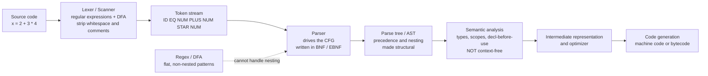

# 🌳 Applications of Context-Free Grammars

> [!abstract] TL;DR
> A **context-free grammar (CFG)** is a set of recursive rewrite rules — and almost every piece of *structured, nested text* you touch is defined by one. The grammar of every programming language is a CFG written in **BNF/EBNF**; compilers and interpreters lex the source into tokens and then **parse** those tokens against the CFG to build an **abstract syntax tree (AST)** that the rest of the compiler operates on; data and markup formats (JSON, XML, HTML, SQL) are context-free, which is exactly *why you cannot correctly parse them with regular expressions* — nesting is not regular. The catch: a CFG can only pin down **syntax**. Meaning — declaration-before-use, type checking, scope — is **not** context-free and needs a separate semantic-analysis phase. The practical skill is reading the grammar behind structured text and picking the right tool: a regex for flat/regular input, a real parser for anything nested or recursive.

---

## Intuition

**Analogy:** Every programming language, config file, and markup format you use has a **hidden blueprint** — the same way a building has architectural drawings that decide which walls are load-bearing and how rooms nest inside floors nest inside the building. You never see the blueprint while you walk around, but it is what makes the structure legal and lets an inspector understand it. A context-free grammar *is* that blueprint for text: a compact set of rules that says "an `if` statement contains a condition and a body," "a body contains statements," "a statement can itself be an `if` statement," and so on, recursively. The rules define what counts as valid syntax and, just as importantly, *how the pieces nest inside each other*.

When you write `2 + 3 * 4`, you already know it means `2 + (3 * 4)` and not `(2 + 3) * 4`. That knowledge — precedence, grouping, nesting — is not in the flat sequence of characters. It lives in the grammar. A CFG is the machine-readable version of the intuition every programmer has about "what shape is a valid program," and parsing is the act of recovering the blueprint from the flat text.

---

## How It Works

A CFG is a set of rules of the form `A → α`, where `A` is a single **non-terminal** (a structural category like `Expr` or `Statement`) and `α` is a string of terminals (actual tokens) and non-terminals. Because a non-terminal may appear on the right-hand side of its own rule — `Expr → Expr + Term` — grammars are **recursive**, and that single feature is what lets a finite set of rules describe the *infinite, arbitrarily-nested* set of valid programs. Finite automata and regular expressions cannot do this: they have no stack, so they cannot count matching brackets to unbounded depth. That gap is precisely the boundary between the regular languages and the context-free languages in the Chomsky hierarchy (see [[Context_Free_Grammars_and_Languages]]).

The dominant industrial use of CFGs is the **compiler/interpreter front-end**. Source text flows through a fixed pipeline: a **lexer** (itself powered by regular expressions and finite automata) chops the raw characters into a stream of tokens and discards whitespace and comments; the **parser** then consumes that token stream and matches it against the CFG, building a **parse tree** or, more usefully, a condensed **abstract syntax tree (AST)** where grouping and precedence have become *structural* rather than textual. Everything downstream — type checking, optimization, code generation — walks the AST, never the original characters. The act of parsing turns flat text into a tree that means something (see [[Parsing_and_Derivations]]).

### Flow / Architecture



The dashed edge is the whole lesson in one line: regular expressions and DFAs stop at the lexer because they cannot match arbitrarily nested structure. The moment you need to balance brackets to unbounded depth — expressions, blocks, tags — you have crossed from regular to context-free and you need a real parser.

---

## Key Concepts

### Secondary Level

**A language reference *is* a grammar.** Open the specification of almost any programming language — Python, Java, C, JSON — and you will find, usually in an appendix, a grammar written in **Backus-Naur Form (BNF)** or its extended cousin **EBNF**. This is not documentation *about* the language; it literally *defines* which strings of tokens are valid programs. A tiny BNF fragment for arithmetic:

```
<expr>   ::= <expr> "+" <term> | <expr> "-" <term> | <term>
<term>   ::= <term> "*" <factor> | <term> "/" <factor> | <factor>
<factor> ::= <number> | "(" <expr> ")"
```

Those three rules encode precedence (multiplication binds tighter than addition, because `term` sits *below* `expr`) and unlimited nesting (an `expr` can contain a parenthesized `expr`). BNF was invented by John Backus and Peter Naur to define ALGOL 60 in 1960, and essentially every language since has been specified the same way.

**The front-end pipeline in one sentence:** characters → (lexer) → tokens → (parser using the CFG) → syntax tree. The lexer handles the *flat* part with regular expressions; the parser handles the *nested* part with the CFG. Splitting the job this way keeps each stage simple and fast.

**Why you cannot parse HTML with a regex.** This is the most famous practical consequence of the theory. HTML and XML allow tags to nest to *arbitrary* depth — `<div><div><div>...</div></div></div>`. Matching each open tag to its correct close tag requires *counting*, and a regular expression (a finite automaton) has only finitely many states, so it cannot count without bound. Nesting is not regular; it is context-free. Any "regex to parse HTML" is quietly broken on some input. The right tool is a real parser built from the grammar (see [[Regular_Expressions_and_Kleenes_Theorem]] for the regular side of this boundary).

---

### Undergraduate Level

**Parser generators turn a grammar into a parser.** You rarely write a parser by hand for a serious language. Instead you feed the CFG to a **parser generator**:

| Tool | Era / Ecosystem | Parsing strategy |
|---|---|---|
| **yacc / bison** | Unix / C | Bottom-up **LALR(1)** (a practical restriction of LR) |
| **ANTLR** | Java / cross-language | Top-down **LL(\*)** with adaptive lookahead |
| **PLY / Lark** | Python | LALR and Earley |
| **tree-sitter** | Editors / IDEs | Incremental **GLR**, robust to errors |

You write the grammar rules plus small semantic actions ("when you reduce `expr + term`, build an `Add` node"), and the tool emits a parser. GCC historically used a bison-generated LALR parser; many modern compilers hand-write **recursive-descent** parsers (an `LL`-style method — one function per non-terminal) for better error messages, but the grammar underneath is still a CFG.

**LL vs LR, ambiguity, and precedence.** Real grammars must be *unambiguous* (one parse tree per program) or the tool needs extra precedence/associativity declarations to resolve conflicts. The classic **dangling-else** ambiguity (`if a then if b then c else d` — which `if` owns the `else`?) is resolved either by rewriting the grammar or by a disambiguation rule. Precedence-climbing and the layered `expr/term/factor` structure above are the standard tricks for encoding operator precedence *into* the grammar so the tree comes out correct.

**The syntax–semantics boundary.** A CFG captures *syntax* — the shape of valid programs. It **cannot** capture most *semantics*:

- **Declaration before use** — "every variable must be declared before it is referenced" requires remembering an unbounded set of names, which a context-free grammar cannot do.
- **Type checking** — "the two sides of `+` must have compatible types" depends on context arbitrarily far away.
- **Scope rules** — which `x` a name refers to depends on nesting of blocks and the symbol table.

These are enforced in a **separate semantic-analysis phase** that walks the AST with a **symbol table**, *after* parsing. The grammar says a program is well-*formed*; semantic analysis says it is well-*defined*. Confusing the two is a classic conceptual error.

**Data, markup, and query languages are context-free too.** JSON's grammar is a textbook CFG (a value is an object or array or scalar; an object contains values, recursively). XML/HTML nesting is context-free. **SQL** is defined by a large CFG, which is why database engines have a genuine parser, not a pile of regexes. Config formats (YAML, TOML) and protocol message formats sit in the same family. The unifying property: **recursive nesting**.

---

### Graduate Level

**Why semantics is provably not context-free.** The canonical proof uses a language like `L = { w c w : w ∈ {a,b}* }` — a string, a marker, then *the same string again*. This is the formal skeleton of "declare a name, then use exactly that name." One can show, via the **pumping lemma for context-free languages**, that `L` is not context-free: pumping any decomposition breaks the required equality of the two copies. Since "declaration-before-use" and "matched identifiers" reduce to this pattern, no CFG can enforce them, which is the formal justification for a distinct semantic phase (see [[The_Pumping_Lemma_for_Context_Free_Languages]]).

**Probabilistic CFGs and statistical parsing.** In natural-language processing, plain CFGs became **probabilistic context-free grammars (PCFGs)**: each rule carries a probability, so the probability of a parse tree is the product of its rule probabilities, and the parser (a probabilistic **CYK/Viterbi**) returns the *most likely* tree rather than merely *a* legal tree. This was the workhorse of statistical constituency parsing (the Penn Treebank era) before neural parsers, and it directly generalizes the phrase-structure grammars of linguistics (see [[Phrase_Structure_Grammar]]).

**Is natural language context-free?** For decades this was an open debate. Context-free phrase-structure grammars model most of English syntax well, but **cross-serial dependencies** in Swiss German and Dutch (verbs and their objects interleaved rather than nested, `a¹ b² a¹ b²` patterns) were shown to exceed context-free power (Shieber 1985). The consensus landed on **mildly context-sensitive** formalisms — **Tree-Adjoining Grammars (TAG)** and **Combinatory Categorial Grammar (CCG)** — that extend CFGs just far enough to cover these cases while keeping polynomial-time parsing (see [[Computational_Linguistics]]).

**Beyond languages and text.** CFGs appear wherever hierarchical structure is combined with recursion:

- **Domain-specific languages (DSLs)** — query languages, build scripts, shader languages, and template engines each ship a grammar.
- **Computer algebra and structured documents** — LaTeX, Markdown extensions, and math expression engines parse against grammars.
- **Bioinformatics** — **RNA secondary structure** is modeled with **stochastic context-free grammars (SCFGs)**: base-pairing (A–U, G–C) forms nested "stems" exactly analogous to matched brackets, so an SCFG + CYK predicts folding. This is one of the most elegant non-linguistic uses of CFGs.
- **Protocol and file-format parsing** — safe binary/text format parsers are increasingly generated from grammars to avoid the memory-safety bugs of hand-rolled parsers.

---

## Python Demo

```python
"""
A tiny expression-language interpreter built on a context-free grammar.

Grammar (CFG with precedence baked into the rule layering):
    expr   -> term  (("+" | "-") term)*        # lowest precedence, left-assoc
    term   -> power (("*" | "/") power)*        # higher, left-assoc
    power  -> atom  ("^" power)?                # highest binary op, RIGHT-assoc
    atom   -> NUMBER | "(" expr ")" | "-" atom  # literals, grouping, unary minus

We (1) tokenize the input, (2) parse it with a recursive-descent parser into an
abstract syntax tree, (3) evaluate the AST, and (4) draw the parse tree so you can
SEE how a flat string of characters becomes structured computation.

Standard library + numpy + matplotlib only -- no parser libraries.
"""
import numpy as np
import matplotlib.pyplot as plt

# ── 1. Lexer: characters -> tokens (the "regular" part of the pipeline) ────────
def tokenize(s):
    toks, i = [], 0
    while i < len(s):
        c = s[i]
        if c.isspace():
            i += 1
        elif c.isdigit() or c == '.':
            j = i
            while j < len(s) and (s[j].isdigit() or s[j] == '.'):
                j += 1
            toks.append(('NUM', float(s[i:j])))
            i = j
        elif c in '+-*/^()':
            toks.append((c, c))
            i += 1
        else:
            raise SyntaxError(f"illegal character {c!r}")
    toks.append(('EOF', None))
    return toks

# ── 2. Recursive-descent parser: tokens -> AST (the context-free part) ─────────
# AST node = ('num', value) | ('bin', op, left, right) | ('neg', child)
class Parser:
    def __init__(self, toks):
        self.toks, self.pos = toks, 0

    def peek(self):  return self.toks[self.pos][0]
    def next(self):  t = self.toks[self.pos]; self.pos += 1; return t

    def eat(self, kind):
        if self.peek() != kind:
            raise SyntaxError(f"expected {kind}, got {self.peek()}")
        return self.next()

    def parse(self):
        node = self.expr()
        self.eat('EOF')          # reject trailing garbage
        return node

    def expr(self):              # expr -> term (('+'|'-') term)*
        node = self.term()
        while self.peek() in ('+', '-'):
            op = self.next()[0]
            node = ('bin', op, node, self.term())
        return node

    def term(self):              # term -> power (('*'|'/') power)*
        node = self.power()
        while self.peek() in ('*', '/'):
            op = self.next()[0]
            node = ('bin', op, node, self.power())
        return node

    def power(self):             # power -> atom ('^' power)?   (right-assoc)
        node = self.atom()
        if self.peek() == '^':
            self.next()
            node = ('bin', '^', node, self.power())
        return node

    def atom(self):              # atom -> NUM | '(' expr ')' | '-' atom
        if self.peek() == '-':
            self.next()
            return ('neg', self.atom())
        if self.peek() == '(':
            self.next()
            node = self.expr()
            self.eat(')')
            return node
        return ('num', self.eat('NUM')[1])

# ── 3. Evaluator: walk the AST bottom-up ──────────────────────────────────────
OPS = {'+': lambda a, b: a + b, '-': lambda a, b: a - b,
       '*': lambda a, b: a * b, '/': lambda a, b: a / b,
       '^': lambda a, b: a ** b}

def evaluate(node):
    kind = node[0]
    if kind == 'num':
        return node[1]
    if kind == 'neg':
        return -evaluate(node[1])
    _, op, l, r = node
    return OPS[op](evaluate(l), evaluate(r))

def to_str(node):                # human-readable AST label per node
    return {'num': lambda n: f"{n[1]:g}",
            'neg': lambda n: "neg",
            'bin': lambda n: n[1]}[node[0]](node)

# ── 4. Layout + draw the parse tree with matplotlib ───────────────────────────
def layout(node, depth, counter):
    """Assign (x, y): x from an in-order leaf counter, y from depth."""
    kind = node[0]
    if kind == 'num':
        x = float(counter[0]); counter[0] += 1
        return x, [(to_str(node), x, -depth, True)], []
    children = [node[1]] if kind == 'neg' else [node[2], node[3]]
    xs, nodes, edges = [], [], []
    for ch in children:
        cx, cn, ce = layout(ch, depth + 1, counter)
        xs.append(cx); nodes += cn; edges += ce
    x = float(np.mean(xs))
    nodes.append((to_str(node), x, -depth, False))
    edges += [(x, -depth, cx, -(depth + 1)) for cx in xs]
    return x, nodes, edges

def draw(node, title, ax):
    _, nodes, edges = layout(node, 0, [0])
    for x1, y1, x2, y2 in edges:
        ax.plot([x1, x2], [y1, y2], '-', color='#555', lw=1.3, zorder=1)
    for label, x, y, is_leaf in nodes:
        fc = '#a9dfbf' if is_leaf else '#aed6f1'
        ax.text(x, y, label, ha='center', va='center', fontsize=12, fontweight='bold',
                bbox=dict(boxstyle='circle,pad=0.35', facecolor=fc,
                          edgecolor='#1c2833', linewidth=1.6), zorder=2)
    xs = [n[1] for n in nodes]; ys = [n[2] for n in nodes]
    ax.set_xlim(min(xs) - 1, max(xs) + 1)
    ax.set_ylim(min(ys) - 0.6, 0.6)
    ax.set_title(title, fontsize=11, fontweight='bold')
    ax.axis('off')

# ── 5. Run it ─────────────────────────────────────────────────────────────────
examples = ["2 + 3 * 4", "(2 + 3) * 4", "-2 ^ 2 ^ 3 + 10 / 4"]

fig, axes = plt.subplots(1, len(examples), figsize=(16, 5))
fig.suptitle("A CFG turns flat text into a structured, evaluatable tree",
             fontsize=13, fontweight='bold')

for ax, src in zip(axes, examples):
    ast = Parser(tokenize(src)).parse()
    result = evaluate(ast)
    print(f"{src:<24} =  {result:g}")
    draw(ast, f'"{src}"\n=  {result:g}', ax)

plt.tight_layout()
plt.savefig('cfg_expression_parse_trees.png', dpi=130, bbox_inches='tight')
plt.show()
print("\nPlot saved: cfg_expression_parse_trees.png")
```

**Expected output:**

```
2 + 3 * 4                =  14
(2 + 3) * 4              =  20
-2 ^ 2 ^ 3 + 10 / 4      =  -253.5
```

The three trees make the grammar visible. `2 + 3 * 4` puts `*` *below* `+`, so multiplication is evaluated first and the answer is `14` — precedence came from the *layering* of the grammar rules, not from any special-case code. Adding parentheses in `(2 + 3) * 4` restructures the tree so `+` sits below `*`, giving `20`. The last example shows **right-associativity** of `^` (`2 ^ 2 ^ 3 = 2 ^ 8 = 256`), unary minus binding the whole power (`-256`), and `/` binding tighter than `+` — all encoded purely in the CFG. That is the entire point: the parse tree *is* the meaning, recovered from a flat string by a handful of recursive rules.

---

## Real-World Applications

**Every compiler and interpreter.** CPython's grammar is a CFG (historically LL(1), now a PEG since Python 3.9); it lexes source to tokens and parses to an AST exposed through the `ast` module. Clang/LLVM and GCC parse C/C++ against their grammars into ASTs before any optimization. The Rust and Go compilers hand-write recursive-descent parsers over their published grammars. In *all* of them the AST — not the source text — is the object every later stage manipulates.

**Parser generators in production.** bison (yacc) powers the parsers of PostgreSQL's SQL front-end, Bash, and many language runtimes. ANTLR generates parsers for Java, C#, Python, and is used inside tools like Hibernate (HQL), Groovy, and countless DSLs. tree-sitter generates incremental GLR parsers that give editors like GitHub, Neovim, and VS Code fast, error-tolerant syntax highlighting and structural navigation — a CFG per language, recompiled into a parser.

**Data and configuration formats.** JSON parsers (`json.loads`), XML parsers (SAX/DOM), and YAML/TOML loaders are all grammar-driven precisely because their structures nest. Protocol Buffers, GraphQL, and every SQL dialect define a grammar and generate or hand-write a parser. The recurring bug report — "I tried to extract nested tags with a regex and it broke" — is the theory asserting itself: those formats are context-free, not regular.

**Natural language processing.** Constituency parsers (the Stanford Parser, Berkeley Neural Parser) produce phrase-structure trees rooted in CFG/PCFG theory; even modern neural parsers are trained on treebanks whose annotation scheme is a CFG. Grammar checkers and information-extraction pipelines consume these trees to reason about subjects, objects, and clauses.

**Bioinformatics.** Tools like Infernal and the Rfam database model non-coding RNA families with **stochastic context-free grammars**: nested base-pairing is formally a bracket-matching (context-free) problem, so CYK-style dynamic programming over an SCFG predicts secondary structure — a direct transplant of compiler-parsing math into molecular biology.

---

## Common Pitfalls

- **Trying to parse nested formats with regular expressions.** HTML, XML, JSON, and source code nest to unbounded depth; a regex (finite automaton) cannot count matching delimiters, so any regex "parser" for them is wrong on some input. Use a real parser. This is the single most common practical mistake and the most direct consequence of the regular-vs-context-free boundary (see [[Regular_Expressions_and_Kleenes_Theorem]]).

- **Expecting the grammar to enforce meaning.** A CFG defines *syntax*, not *semantics*. "Variable declared before use," type compatibility, and scope resolution are **not** context-free and will never be caught by the parser. They require a separate semantic-analysis pass over the AST with a symbol table. Blaming the grammar for undeclared-variable errors is a category mistake.

- **Ignoring ambiguity.** If a grammar admits two parse trees for one input (the dangling-else problem, or an expression grammar without precedence layering), the generated parser will emit shift/reduce conflicts or silently pick a tree you did not intend. Encode precedence and associativity *into* the grammar (layered rules) or via the tool's precedence declarations.

- **Left recursion in a top-down parser.** A rule like `expr -> expr + term` sends a naive recursive-descent (LL) parser into infinite recursion. LR/LALR tools (bison) handle left recursion fine; top-down parsers need it rewritten to the iterative `term (('+'|'-') term)*` form used in the demo above. Know which family your tool belongs to.

- **Hand-writing parsers when a generator is safer.** Ad-hoc string slicing to "parse" structured input tends to be subtly wrong and a source of memory-safety and injection bugs. If the input is context-free, write the grammar and let a generator (or a disciplined recursive-descent parser) do it.

- **Assuming natural language is context-free.** Phrase-structure CFGs approximate syntax well, but cross-serial dependencies push natural language into the mildly context-sensitive class. Choosing a strictly context-free formalism for full NL syntax will miss constructions that TAG/CCG capture (see [[Computational_Linguistics]]).

---

## Related Concepts

- [[Context_Free_Grammars_and_Languages]] — The formal foundation: what a CFG is, derivations, the context-free languages, and their place above the regular languages in the Chomsky hierarchy. This note is the "why it matters" companion to that "what it is" note.
- [[Parsing_and_Derivations]] — The algorithms (recursive descent, LL, LR/LALR, CYK, Earley) that turn a CFG plus an input string into a parse tree; the machinery every application in this note relies on.
- [[The_Pumping_Lemma_for_Context_Free_Languages]] — The tool that proves certain languages are *not* context-free, which is the formal reason semantic constraints like declaration-before-use need a phase beyond the grammar.
- [[Regular_Expressions_and_Kleenes_Theorem]] — The strictly weaker regular class used for the lexer; understanding its limits is exactly why "you can't parse HTML with a regex."
- [[Finite_Automata_DFA_and_NFA]] — The machine model behind lexers and regexes; a CFG is what you reach for when a finite automaton's fixed memory is no longer enough.
- [[Applications_of_Finite_Automata]] — The parallel "where it shows up" note one rung down the hierarchy; lexing is the shared boundary between the two.
- [[Phrase_Structure_Grammar]] — The linguistics view of the *same* mathematical object: CFGs and phrase-structure/X-bar grammars are two faces of one formalism, historically co-invented by Chomsky.
- [[Syntactic_Theory_and_Generative_Grammar]] — The broader generative-grammar framework in which context-free phrase structure is embedded, including why natural language needs more than context-free power.
- [[Computational_Linguistics]] — PCFGs, statistical constituency parsing, and the mildly-context-sensitive formalisms (TAG, CCG) used when CFGs are not quite enough for language.
- [[Tokenization]] — The lexing/token-stream stage that feeds the parser; where regular-expression matching hands off to the context-free grammar.

---

## Review Questions

### Secondary

1. In your own words, what is the difference between the **lexer** and the **parser** in a compiler front-end, and which one uses a context-free grammar? Why is splitting the job into two stages useful?
2. A colleague proposes extracting the contents of arbitrarily nested `<div>` tags from an HTML page using a single regular expression. Explain why this cannot work correctly in general, referring to the difference between regular and context-free languages.
3. Given the grammar in the Python demo, does `2 + 3 * 4` evaluate to `14` or `20`, and *which feature of the grammar* forces that answer?

### Undergraduate

1. Name two parser generators, state whether each is top-down or bottom-up, and give one reason a compiler team might hand-write a recursive-descent parser instead of using a generator.
2. Classify each of the following as enforceable by a CFG (syntax) or requiring a separate semantic phase, and justify each: (a) every `(` has a matching `)`; (b) every variable is declared before use; (c) the operands of `+` have compatible types; (d) a function is called with the right *number* of arguments as written in the source.
3. The rule `expr -> expr + term` causes an infinite loop in a naive recursive-descent parser but is fine for a bison-generated LALR parser. Explain the difference and rewrite the rule so a top-down parser can handle it.

### Graduate

1. Sketch the argument that "declaration-before-use" is not context-free by reducing it to a language of the form `{ w c w }` and invoking the pumping lemma for context-free languages. Why does this justify a distinct semantic-analysis phase rather than a cleverer grammar?
2. Swiss German cross-serial dependencies are cited as evidence that natural language is not context-free. Explain the pattern, name one mildly-context-sensitive formalism that handles it, and state why such formalisms are still preferred over unrestricted context-sensitive grammars in practice.
3. RNA secondary-structure prediction uses stochastic context-free grammars parsed with CYK-style dynamic programming. Draw the analogy between nested base-pairing and balanced brackets, and explain both why a CFG is the right expressive class and where it *fails* (hint: pseudoknots).

---

## Sources

- [Aho, Lam, Sethi & Ullman — *Compilers: Principles, Techniques, and Tools* (the "Dragon Book"), Ch. 4 Syntax Analysis](https://suif.stanford.edu/dragonbook/)
- [Sipser — *Introduction to the Theory of Computation*, Ch. 2: Context-Free Languages](https://math.mit.edu/~sipser/book.html)
- [Backus, J. & Naur, P. et al. — *Report on the Algorithmic Language ALGOL 60* (1960), the origin of BNF](https://www.masswerk.at/algol60/report.htm)
- [Shieber, S. (1985). Evidence Against the Context-Freeness of Natural Language. *Linguistics and Philosophy* 8.](https://link.springer.com/article/10.1007/BF00630917)
- [Jurafsky & Martin — *Speech and Language Processing* (3rd ed. draft), Ch. on Constituency Grammars and Parsing](https://web.stanford.edu/~jurafsky/slp3/)
- [Durbin, Eddy, Krogh & Mitchison — *Biological Sequence Analysis*, Ch. 9–10: RNA structure with stochastic context-free grammars](https://www.cambridge.org/core/books/biological-sequence-analysis/921BB7B78B745198829EF96BC7E0F29D)

---

#theory-of-computation #compilers #programming-languages #bnf #syntax
