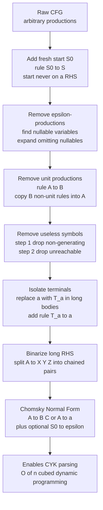

# Chomsky Normal Form and Grammar Transformations

> [!abstract] TL;DR
> A **normal form** rewrites a context-free grammar into a rigidly standardized shape without changing the language it generates, so that a single algorithm can process any grammar uniformly. **Chomsky Normal Form (CNF)** restricts every rule to `A -> B C` (two nonterminals) or `A -> a` (one terminal), with a single allowance for `S0 -> ε` from the start symbol; this binary shape makes every parse tree binary and unlocks the CYK algorithm's `O(n^3)` dynamic-programming membership test. Reaching CNF is a fixed pipeline — remove epsilon-productions, remove unit productions, delete useless symbols, then isolate terminals and binarize long right-hand sides — and **the order matters**.

---

## Intuition

**Analogy:** Before you can plug numbers into the quadratic formula, you first push every quadratic into the identical standard form `a·x² + b·x + c = 0`. You move terms across the equals sign, clear fractions to a common denominator, and collect like terms. None of this changes *which* numbers solve the equation — it only changes the equation's *shape* so that one formula works for every quadratic you will ever meet. You standardize the form so the algorithm can stay simple.

A grammar transformation does exactly this for a context-free grammar. The raw grammar might have empty rules, chains of rename-only rules, dead symbols, and sprawling right-hand sides. Converting it to Chomsky Normal Form is the same act of "clearing to a common denominator": you reshape the rules into a uniform binary skeleton while keeping the generated language identical, so that a single parser — CYK — can be pointed at *any* grammar and just work. Linking this to [[Context_Free_Grammars_and_Languages]], the language is the invariant; the production shape is the free variable we get to standardize.

---

## How It Works

### What Chomsky Normal Form is

A CFG is in **Chomsky Normal Form** when every production has one of exactly three shapes:

1. `A -> B C` — a nonterminal rewrites to exactly **two** nonterminals (and neither may be the start symbol, so no rule can regenerate the start on its right side).
2. `A -> a` — a nonterminal rewrites to exactly **one** terminal.
3. `S0 -> ε` — allowed **only** for the start symbol, and only if the empty string is in the language.

Two consequences make CNF the workhorse form. First, because every internal rule is binary, **every parse tree is a binary tree**: a derivation of a length-`n` string uses exactly `n - 1` binary steps plus `n` terminal steps, a bounded, predictable structure. That bounded fan-out is precisely what the proof of [[The_Pumping_Lemma_for_Context_Free_Languages]] leans on — a tall-enough binary tree must repeat a variable on some root-to-leaf path. Second, binary rules are what let the **CYK algorithm** fill an upper-triangular table in `O(n^3)` time to decide membership (see [[Parsing_and_Derivations]]).

### The transformation pipeline

You cannot jump straight to CNF; you first *simplify*, then *reshape*. The canonical order:

1. **Add a fresh start symbol.** Introduce `S0 -> S`. Now the start symbol never appears on any right-hand side, which is required so that the only tolerated empty production is `S0 -> ε`.
2. **Remove epsilon-productions.** Compute the **nullable** variables (those that can derive `ε`, found by fixpoint: `A` is nullable if it has a rule whose entire body is nullable). For each production, add every variant with some subset of nullable occurrences deleted, then discard the explicit `A -> ε` rules. Do this **before** unit removal, because deleting an `ε` can expose a brand-new unit rule (for example `C -> A B` with `B` nullable spawns `C -> A`).
3. **Remove unit productions.** A **unit production** `A -> B` only renames one variable as another. Compute the unit pairs `(A, B)` where `A` derives `B` through a chain of unit steps (reflexive-transitive closure), then give `A` a copy of every *non-unit* production of `B`, and finally delete all unit rules.
4. **Remove useless symbols**, in two ordered sweeps. A symbol is **useful** only if it is both **generating** (can derive some string of terminals) and **reachable** (can appear in a derivation from the start). Delete **non-generating** symbols first, *then* delete **unreachable** symbols — reversing this order can leave freshly-orphaned symbols behind.
5. **Isolate terminals and binarize.** In any body of length two or more, replace each terminal `a` by a new nonterminal `T_a` with rule `T_a -> a`. Then split any body longer than two, `A -> Y1 Y2 ... Yk`, into a cascade of binary rules by introducing fresh helper variables. The result is CNF.

### Related transformations

**Greibach Normal Form (GNF)** forces every production into the shape `A -> a α`, a single terminal followed by zero or more nonterminals. GNF guarantees each derivation step consumes exactly one input symbol, which cleanly witnesses the equivalence between CFGs and pushdown automata and enables top-down parsing with **no left recursion**. It is reached by substitution plus left-recursion elimination.

**Eliminating left recursion** rewrites `A -> A α | β` (which sends a recursive-descent or LL parser into an infinite loop) into the right-recursive `A -> β A'`, `A' -> α A' | ε`. **Left factoring** pulls a shared prefix out of alternatives (`A -> a B | a C` becomes `A -> a A'`, `A' -> B | C`) so a predictive parser can decide on one lookahead token. Both are essential preprocessing for the top-down parsers discussed in [[Parsing_and_Derivations]].

### Decidability that normal forms unlock — and the wall beyond

Standardized grammars make several questions **decidable**: **membership** (`is w in L?`, via CYK on CNF), **emptiness** (`is L empty?`, check whether the start symbol is generating), and **finiteness** (`is L finite?`, look for a "pumpable" reachable-and-generating cycle). But the standardization stops there: whether two CFGs generate the **same language** is **undecidable**, and whether a grammar is **ambiguous** is **undecidable** — the boundary studied in [[Theory_of_Computation_Overview]]. Normal forms tame the *form*, not the deep semantic questions.



---

## Key Concepts

**Secondary (intuitive level).** A grammar is a set of "replacement rules" for building sentences. A *normal form* is a tidy, standardized style of writing those rules — like insisting every recipe step do exactly one small thing — chosen so a machine can follow them mechanically. Rewriting a grammar into normal form never changes *what sentences it can build*, only *how the rules are phrased*.

**Undergraduate (needs CS background).** CNF: `A -> B C` or `A -> a`, plus `S0 -> ε`. The four simplification steps — nullable-variable elimination, unit-pair elimination, useless-symbol removal (generating then reachable), and terminal-isolation + binarization — and why epsilon-removal must precede unit-removal. CYK runs membership in `O(n^3)` time and `O(n^2)` space over a CNF grammar by filling spans bottom-up. Greibach Normal Form (`A -> a α`) supports left-recursion-free top-down parsing. Left-recursion elimination and left factoring are the standard LL-parser preprocessors.

**Graduate (system-level thinking).** Size blow-up is real and asymmetric: naive epsilon-elimination can be **exponential** in the number of nullable symbols per body, and unit-elimination can be **quadratic**; careful constructions keep CNF polynomial. GNF conversion combines substitution with left-recursion removal and can blow up the grammar substantially. The decidability frontier: membership, emptiness, and finiteness are decidable; **CFG equivalence, ambiguity, inherent ambiguity, and CFL universality are undecidable** (reductions from the Post Correspondence Problem in [[Theory_of_Computation_Overview]]). CYK's `O(n^3)` is not tight — Valiant reduced context-free recognition to Boolean matrix multiplication, giving sub-cubic `O(n^ω)` recognition.

---

## Python Demo

```python
# CFG -> Chomsky Normal Form, stage by stage, using only numpy + matplotlib.
# Grammar representation:
#   { "A": [ ("B","C"), ("a",), () ] }   where () denotes the empty string (epsilon)
# Uppercase-initial symbols are nonterminals ("S", "S0", "T_a", "X1");
# lowercase symbols are terminals ("a", "b", "c", "d", "f").

import numpy as np
import matplotlib.pyplot as plt
from itertools import combinations
from collections import defaultdict


def is_nt(sym):
    return sym[:1].isupper()


def n_prod(g):
    return sum(len(bodies) for bodies in g.values())


def dedupe(bodies):
    seen, out = set(), []
    for b in bodies:
        if b not in seen:
            seen.add(b); out.append(b)
    return out


def show(title, g, start):
    print(f"\n=== {title}   (start={start}, {n_prod(g)} productions) ===")
    order = [start] + sorted(k for k in g if k != start)
    for A in order:
        if A not in g or not g[A]:
            continue
        alts = ["ε" if not body else " ".join(body) for body in g[A]]
        print(f"  {A} -> {'  |  '.join(dict.fromkeys(alts))}")


# ---- Step 1: fresh start symbol so the start never appears on a RHS ----------
def add_start(g, start):
    g = {k: list(v) for k, v in g.items()}
    g["S0"] = [(start,)]
    return g, "S0"


# ---- Step 2: remove epsilon-productions (find nullable variables) ------------
def nullable_set(g):
    nullable, changed = set(), True
    while changed:
        changed = False
        for A, bodies in g.items():
            if A in nullable:
                continue
            if any(all(s in nullable for s in body) for body in bodies):
                nullable.add(A); changed = True
    return nullable


def remove_epsilon(g, start):
    nullable = nullable_set(g)
    new = {A: [] for A in g}
    for A, bodies in g.items():
        for body in bodies:
            if not body:
                continue  # drop explicit epsilon
            idx = [i for i, s in enumerate(body) if s in nullable]
            for r in range(len(idx) + 1):
                for drop in combinations(idx, r):
                    d = set(drop)
                    nb = tuple(s for i, s in enumerate(body) if i not in d)
                    if nb:  # never re-add an empty body (except start, below)
                        new[A].append(nb)
    if start in nullable:            # keep S0 -> epsilon only if epsilon in L
        new[start].append(())
    return {A: dedupe(b) for A, b in new.items()}, nullable


# ---- Step 3: remove unit productions  A -> B --------------------------------
def remove_unit(g):
    nts = set(g)
    unit = {A: {A} for A in g}       # reflexive-transitive closure of unit pairs
    changed = True
    while changed:
        changed = False
        for A in g:
            for B in list(unit[A]):
                for body in g[B]:
                    if len(body) == 1 and body[0] in nts and body[0] not in unit[A]:
                        unit[A].add(body[0]); changed = True
    new = {A: [] for A in g}
    for A in g:
        for B in unit[A]:
            for body in g[B]:
                if not (len(body) == 1 and body[0] in nts):  # keep non-unit rules
                    new[A].append(body)
    return {A: dedupe(b) for A, b in new.items()}, unit


# ---- Step 4: remove useless symbols  (non-generating THEN unreachable) -------
def remove_useless(g, start):
    def body_ok(body, live):
        return all((not is_nt(s)) or s in live for s in body)

    generating, changed = set(), True   # can this symbol derive a terminal string?
    while changed:
        changed = False
        for A, bodies in g.items():
            if A not in generating and any(body_ok(b, generating) for b in bodies):
                generating.add(A); changed = True
    g1 = {A: [b for b in bodies if body_ok(b, generating)]
          for A, bodies in g.items() if A in generating}

    reachable = set()                    # can this symbol appear in a derivation?
    if start in g1:
        stack = [start]; reachable.add(start)
        while stack:
            A = stack.pop()
            for body in g1[A]:
                for s in body:
                    if is_nt(s) and s in g1 and s not in reachable:
                        reachable.add(s); stack.append(s)
    return {A: b for A, b in g1.items() if A in reachable}


# ---- Step 5: isolate terminals, then binarize long right-hand sides ----------
def to_cnf(g):
    term_nt = {}
    def T(t):
        term_nt.setdefault(t, "T_" + t)
        return term_nt[t]

    stage = {A: [] for A in g}
    for A, bodies in g.items():
        for body in bodies:
            if len(body) >= 2:
                stage[A].append(tuple(s if is_nt(s) else T(s) for s in body))
            else:
                stage[A].append(body)
    for t, name in term_nt.items():
        stage.setdefault(name, [])
        if (t,) not in stage[name]:
            stage[name].append((t,))

    counter = [0]
    def fresh():
        counter[0] += 1
        return f"X{counter[0]}"

    final = defaultdict(list)
    for A, bodies in stage.items():
        for body in bodies:
            if len(body) <= 2:
                final[A].append(body)
            else:                        # A -> Y1 Y2 ... Yk  ==>  chained binary rules
                syms, cur = list(body), A
                while len(syms) > 2:
                    Z = fresh()
                    final[cur].append((syms[0], Z))
                    cur, syms = Z, syms[1:]
                final[cur].append((syms[0], syms[1]))
    return {A: dedupe(b) for A, b in final.items()}


# ---- Verification helpers ----------------------------------------------------
def language_upto(g, start, max_len):
    # All terminal strings of length <= max_len derivable from `start`.
    lang, changed = {A: set() for A in g}, True
    while changed:
        changed = False
        for A, bodies in g.items():
            for body in bodies:
                combos = {""}
                for s in body:
                    pset = lang[s] if is_nt(s) else {s}
                    combos = {a + b for a in combos for b in pset
                              if len(a) + len(b) <= max_len}
                    if not combos:
                        break
                for w in combos:
                    if w not in lang[A]:
                        lang[A].add(w); changed = True
    return lang[start]


def cyk(cnf, start, w):
    # O(n^3) membership test over a CNF grammar, filling an upper-triangular table.
    n = len(w)
    if n == 0:
        return () in cnf.get(start, [])
    term, binr = defaultdict(set), defaultdict(set)
    for A, bodies in cnf.items():
        for body in bodies:
            if len(body) == 1 and not is_nt(body[0]):
                term[body[0]].add(A)
            elif len(body) == 2:
                binr[(body[0], body[1])].add(A)
    table = np.empty((n, n), dtype=object)      # table[i, span-1]
    for i in range(n):
        for j in range(n):
            table[i, j] = set()
    for i in range(n):
        table[i, 0] = set(term.get(w[i], set()))
    for span in range(2, n + 1):
        for i in range(0, n - span + 1):
            cell = set()
            for cut in range(1, span):
                for Bx in table[i, cut - 1]:
                    for Cx in table[i + cut, span - cut - 1]:
                        cell |= binr.get((Bx, Cx), set())
            table[i, span - 1] = cell
    return start in table[0, n - 1]


# ---- Run the pipeline on a grammar that exercises every stage ----------------
# S -> A B C | S d S | A | E S      A -> a A | a
# B -> b | epsilon                  C -> c | A B
# E -> a E   (non-generating)       F -> f   (unreachable)
grammar = {
    "S": [("A", "B", "C"), ("S", "d", "S"), ("A",), ("E", "S")],
    "A": [("a", "A"), ("a",)],
    "B": [("b",), ()],
    "C": [("c",), ("A", "B")],
    "E": [("a", "E")],
    "F": [("f",)],
}
start = "S"

counts, labels = [], []
show("0. Original grammar", grammar, start);           counts.append(n_prod(grammar)); labels.append("original")
g1, s1 = add_start(grammar, start)
show("1. Fresh start symbol", g1, s1);                 counts.append(n_prod(g1));      labels.append("+start")
g2, nullable = remove_epsilon(g1, s1)
print("   nullable variables:", sorted(nullable))
show("2. Epsilon-productions removed", g2, s1);        counts.append(n_prod(g2));      labels.append("-epsilon")
g3, _ = remove_unit(g2)
show("3. Unit productions removed", g3, s1);           counts.append(n_prod(g3));      labels.append("-unit")
g4 = remove_useless(g3, s1)
show("4. Useless symbols removed", g4, s1);            counts.append(n_prod(g4));      labels.append("-useless")
cnf = to_cnf(g4)
show("5. Chomsky Normal Form", cnf, s1);               counts.append(n_prod(cnf));     labels.append("CNF")

# Membership: CYK on the CNF grammar must agree with the ORIGINAL grammar.
print("\n=== Membership check (CYK on CNF vs original language) ===")
tests = ["a", "aa", "ab", "aab", "abc", "adb", "z"]
for w in tests:
    in_cnf = cyk(cnf, s1, w)
    in_org = w in language_upto(grammar, start, len(w))
    flag = "OK" if in_cnf == in_org else "MISMATCH"
    print(f"  {w!r:6}  CYK/CNF={in_cnf!s:5}  original={in_org!s:5}  [{flag}]")

# Language equivalence up to a bounded length is the real correctness proof.
N = 6
same = language_upto(grammar, start, N) == language_upto(cnf, s1, N)
print(f"\nLanguages identical for all strings up to length {N}: {same}")
assert same, "CNF conversion changed the language!"

# Visualize how the grammar's size evolves through the pipeline.
x = np.arange(len(labels))
fig, ax = plt.subplots(figsize=(8, 4))
ax.bar(x, counts, color="#2563eb")
ax.set_xticks(x); ax.set_xticklabels(labels, rotation=20)
ax.set_ylabel("number of productions")
ax.set_title("Grammar size across the CNF transformation pipeline")
for xi, c in zip(x, counts):
    ax.text(xi, c + 0.1, str(c), ha="center", va="bottom")
plt.tight_layout(); plt.show()
```

Running it prints the grammar after every stage, shows the discovered nullable set `{'B'}`, drops the non-generating `E` and unreachable `F`, and ends with a pure CNF grammar. The CYK recognizer on the CNF grammar agrees with the original grammar on every test string, and the bounded language-equality assertion confirms the transformation preserved the language.

---

## Real-World Applications

- **Compiler front-ends.** Parser generators (ANTLR, Bison/yacc, and every LL/LALR toolchain) apply left-recursion elimination and left factoring so a generated top-down parser terminates and can decide productions with limited lookahead. Grammar simplification (dead-rule and unreachable-symbol removal) also surfaces mistakes in hand-written grammars.
- **Natural-language constituency parsing.** Treebank grammars (for example the Penn Treebank) are routinely converted to CNF so the **CYK/CKY** chart parser can run; NLTK's `CFG.chomsky_normal_form()` and probabilistic CKY in the Stanford and Berkeley parsers depend on exactly this preprocessing (see [[Computational_Linguistics]]).
- **Bioinformatics.** RNA secondary-structure prediction models base-pairing with **stochastic context-free grammars**; folding is solved by a CYK-style `O(n^3)` dynamic program over a CNF-shaped grammar.
- **Decision procedures and tooling.** Emptiness and finiteness checks (built on generating/reachable analysis) let grammar linters flag rules that can never fire or languages that are unexpectedly infinite.

---

## Common Pitfalls

- **Removing unit productions before epsilon-productions.** Epsilon-elimination *creates* new unit rules (deleting a nullable tail of `C -> A B` yields `C -> A`). Do epsilon first, or you will emit a grammar that is still not unit-free.
- **Deleting unreachable symbols before non-generating ones.** Reversing the useless-symbol order can leave symbols that became orphaned only *after* the first sweep. Always remove non-generating symbols first, then recompute reachability.
- **Forgetting the fresh start symbol.** Without `S0 -> S`, either the start symbol appears on a right-hand side (illegal in strict CNF) or you cannot cleanly represent a language that contains `ε`.
- **Naive epsilon-expansion exploding.** A body with `k` nullable symbols generates up to `2^k` variants; on grammars with many nullables this blows up. Use it deliberately and simplify afterward.
- **Assuming CNF removes ambiguity.** Binarization changes the *shape* of parse trees but preserves the language, and it does **not** make an ambiguous grammar unambiguous — ambiguity is undecidable in general.
- **Trying to test CFG equivalence.** Believing you can algorithmically confirm that a simplified grammar equals the original *for all inputs*. Equivalence of two CFGs is **undecidable**; the demo's bounded-length check is a practical sanity test, not a proof.

---

## Related Concepts

- [[Context_Free_Grammars_and_Languages]] — the base formalism; normal forms rewrite these grammars while holding the generated language fixed.
- [[Parsing_and_Derivations]] — CNF is the input CYK parses in `O(n^3)`; left-recursion elimination and left factoring make top-down parsers viable.
- [[The_Pumping_Lemma_for_Context_Free_Languages]] — its proof relies on the bounded binary tree structure that CNF guarantees.
- [[Applications_of_Context_Free_Grammars]] — compiler and NLP pipelines that consume normalized grammars in practice.
- [[Theory_of_Computation_Overview]] — situates the decidable CFL properties (membership, emptiness, finiteness) against the undecidable ones (equivalence, ambiguity).
- [[Phrase_Structure_Grammar]] — the linguistics view of the very same rewrite rules; PSG and CFG are two faces of one object.
- [[Syntactic_Theory_and_Generative_Grammar]] — Chomsky's generative program, the origin of the hierarchy these normal forms live in.
- [[Computational_Linguistics]] — treebank-to-CNF conversion feeding CKY constituency parsers.
- [[String_Matching_Overview]] — CYK is a chart/DP recognizer over string spans, kin to dynamic-programming string algorithms.

---

## Review Questions

1. **(Recall / conceptual)** State the three legal production shapes in Chomsky Normal Form. Why is the start symbol treated specially, and why must every internal rule be binary rather than allowing three symbols on the right?
2. **(Application / scenario)** You are handed the grammar `S -> A S A | a B`, `A -> B | S`, `B -> b | ε`. Walk the pipeline: which variables are nullable, which unit pairs appear *after* epsilon-removal, and why would swapping the epsilon and unit steps produce a still-non-normal grammar?
3. **(Analysis / trade-off)** CYK on CNF is `O(n^3)`. Given that CFG *equivalence* is undecidable, how can the demo justifiably "verify" that its CNF grammar generates the same language as the original? What exactly does the bounded-length check prove, what does it *not* prove, and when would you reach for Greibach Normal Form instead of Chomsky Normal Form?

---

## Sources

- Hopcroft, Motwani, Ullman — *Introduction to Automata Theory, Languages, and Computation* (3rd ed.), chapters on simplifying and normalizing CFGs.
- Sipser — *Introduction to the Theory of Computation* (3rd ed.), Section 2.1 (Chomsky Normal Form conversion).
- [Chomsky Normal Form — Wikipedia](https://en.wikipedia.org/wiki/Chomsky_normal_form)
- [Greibach Normal Form — Wikipedia](https://en.wikipedia.org/wiki/Greibach_normal_form)
- [CYK Algorithm — Wikipedia](https://en.wikipedia.org/wiki/CYK_algorithm)
- Jurafsky & Martin — [*Speech and Language Processing* (3rd ed. draft), Constituency Parsing / CKY](https://web.stanford.edu/~jurafsky/slp3/)

---

#theory-of-computation #chomsky-normal-form #grammar-transformation #cfg #normal-forms
