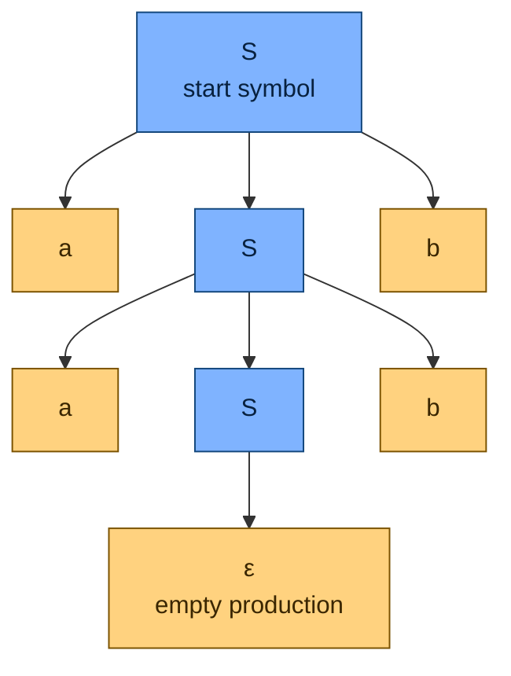

# 🌳 Context-Free Grammars and Languages

> [!abstract] TL;DR
> A **context-free grammar (CFG)** is a finite set of substitution rules that expand symbols into strings — one rung above regular languages on the Chomsky hierarchy. Because a rule can call itself recursively, a CFG can describe **nested, balanced, and counted** structure like `aⁿbⁿ`, matched parentheses, and arithmetic expressions that no finite automaton can capture. This recursion is exactly the power a stack provides, which is why CFGs are equivalent to [[Pushdown_Automata]] — and it is why CFGs define the syntax of essentially every programming language, data format, and markup language.

---

## Intuition

**Analogy:** Think of the fill-in-the-blank rules a language teacher gives you. "A **sentence** is a **noun phrase** followed by a **verb phrase**." "A **noun phrase** is *the* followed by an **adjective** followed by a **noun**." Each bold word is a placeholder you keep expanding until nothing but real words remain: `Sentence → NounPhrase VerbPhrase → the AdjectiveNoun VerbPhrase → the old cat slept`. You never need to know what surrounds a placeholder to expand it — the rule for **noun phrase** is the same whether it sits at the start of the sentence or buried three clauses deep. That "expand regardless of neighbours" property is precisely what **context-free** means.

Technically, a CFG is a recipe book of these expansion rules. You start from a single **start symbol**, repeatedly replace a placeholder (a *nonterminal*) with the right-hand side of one of its rules, and stop when the string contains only real characters (*terminals*). The set of all strings you can possibly reach is the **language** the grammar generates. Crucially, a rule may reference itself — `NounPhrase → NounPhrase and NounPhrase` — so a finite rule book generates an infinite language with unbounded nesting.

---

## How It Works

### Core Mechanics

A CFG is formally a **4-tuple** `G = (V, Σ, R, S)`:

1. **V — nonterminals (variables):** the placeholder symbols you expand, written in uppercase (`S`, `E`, `NounPhrase`). These are the "grammatical categories."
2. **Σ — terminals:** the actual alphabet symbols that appear in final strings (`a`, `b`, `+`, `id`). `V` and `Σ` are disjoint.
3. **R — production rules** of the form `A → α`, where `A` is a single nonterminal and `α` is any string of terminals and nonterminals (including the empty string `ε`). The left side being **exactly one nonterminal** is what makes the grammar context-free: you replace `A` no matter what surrounds it. (A *context-sensitive* rule would look like `xAy → xαy` — replacement depends on context.)
4. **S — start symbol:** a distinguished nonterminal in `V` where every derivation begins.

A **derivation** applies rules one at a time, `S ⇒ … ⇒ w`, until only terminals remain. The **language** `L(G)` is the set of all terminal strings derivable from `S`.

- **Leftmost derivation:** always expand the leftmost nonterminal next.
- **Rightmost derivation:** always expand the rightmost nonterminal next.
- Both can produce the *same* string, and a well-behaved string has **exactly one parse tree** even if it has many derivation orders. The **parse tree** (below) abstracts away the order and records only the hierarchical structure.

**Where the extra power comes from.** Regular languages (see [[Finite_Automata_DFA_and_NFA]]) have finite memory — a DFA cannot count without bound. The classic proof that `aⁿbⁿ` is *not* regular uses the [[Non_Regular_Languages_and_the_Pumping_Lemma|pumping lemma]]. A CFG conquers it in two rules: `S → a S b | ε`. Each application of `S → a S b` adds one `a` on the left and one `b` on the right, and the recursion "remembers" the pending `b` the way a **stack** remembers — which is why CFGs are exactly as powerful as [[Pushdown_Automata]].

**Ambiguity.** A grammar is **ambiguous** if some string has **more than one parse tree** (equivalently, more than one leftmost derivation). The two infamous cases are the **dangling else** (`if a then if b then x else y` — which `if` owns the `else`?) and **operator precedence** (`id + id * id` — is it `add-then-multiply` or `multiply-then-add`?). Ambiguity is a property of the *grammar*, not always the language: many ambiguous grammars can be rewritten unambiguously by layering nonterminals to encode precedence. But some languages are **inherently ambiguous** — no unambiguous grammar exists for them (e.g. `{aⁱbʲcᵏ : i=j or j=k}`). Deciding whether an arbitrary CFG is ambiguous is **undecidable**.

**Chomsky hierarchy placement:** `regular ⊂ context-free ⊂ context-sensitive ⊂ recursively-enumerable`. Each containment is strict. See [[Theory_of_Computation_Overview]].

**Closure properties.** CFLs are closed under **union**, **concatenation**, and **Kleene star** — but, unlike regular languages, they are **NOT closed under intersection or complement**. For example `{aⁿbⁿcᵐ}` and `{aᵐbⁿcⁿ}` are both context-free, yet their intersection `{aⁿbⁿcⁿ}` is not.

**Normal forms.** For algorithms it helps to force every rule into a rigid shape. **Chomsky Normal Form (CNF)** allows only `A → BC` and `A → a` (plus `S → ε`); it is the input format for the CYK parsing algorithm. **Greibach Normal Form (GNF)** forces every rule to start with a terminal. See [[Chomsky_Normal_Form]].

### Flow / Architecture

The diagram shows the **parse tree** (derivation tree) for the string `aabb` under the grammar `S → a S b | ε`. The start symbol at the root expands downward through production rules until every leaf is a terminal (or `ε`). Reading the leaves left to right yields the derived string.



Leftmost derivation for the tree above: `S ⇒ aSb ⇒ aaSbb ⇒ aabb`. Each internal node is a nonterminal, each rule application is a branching, and the frontier `a a b b` is the generated word.

---

## Code Demo

```python
# Context-Free Grammars in a nutshell: a random-derivation generator,
# a recursive-descent recognizer for a^n b^n (impossible for ANY DFA),
# and a matplotlib drawing of the resulting parse tree. numpy/matplotlib only.
import numpy as np
import matplotlib.pyplot as plt
import random

random.seed(7)

# --- 1. A CFG as a dict: nonterminal -> list of right-hand sides -------------
#     Each RHS is a list of symbols. Members of NON are nonterminals;
#     everything else is a terminal. [] denotes the epsilon production.
grammar = {"S": [["a", "S", "b"], []]}        # S -> a S b | epsilon
NON = {"S"}                                    # the set of nonterminals

# --- 2. Random derivation -> parse tree represented as (symbol, [children]) --
def derive(sym, depth=0, cap=8):
    if sym not in NON:
        return (sym, [])                       # terminal leaf
    choices = grammar[sym]
    if depth >= cap:                           # near the cap, force termination
        choices = [r for r in choices
                   if all(s not in NON for s in r)] or choices
    rhs = random.choice(choices)
    if not rhs:                                # epsilon production
        return (sym, [("epsilon", [])])
    return (sym, [derive(s, depth + 1, cap) for s in rhs])

def frontier(tree):                            # terminal string a tree yields
    sym, kids = tree
    if not kids:
        return "" if sym == "epsilon" else sym
    return "".join(frontier(k) for k in kids)

print("Random strings generated by  S -> a S b | epsilon :")
for _ in range(6):
    print("   '%s'" % frontier(derive("S")))

# --- 3. Recursive-descent recognizer: the CALL STACK does the counting -------
#     a finite automaton cannot do. Returns (matched?, index_consumed).
def match_S(s, i):
    if i < len(s) and s[i] == "a":             # try  S -> a S b
        ok, j = match_S(s, i + 1)
        if ok and j < len(s) and s[j] == "b":
            return True, j + 1
    return True, i                             # fall back to  S -> epsilon

def in_anbn(s):
    ok, j = match_S(s, 0)
    return ok and j == len(s)

tests = ["", "ab", "aabb", "aaabbb", "aab", "abb", "ba", "aabbb"]
print("\nRecognition of a^n b^n  (NO DFA can decide this language):")
for t in tests:
    print("   %-8r -> %s" % (t, "ACCEPT" if in_anbn(t) else "reject"))

# numpy sanity check: every a^n b^n up to n=200 must be accepted
ns = np.arange(0, 200)
all_ok = all(in_anbn("a" * n + "b" * n) for n in ns)
print("\nAll a^n b^n for n in [0, 200) accepted:", all_ok)

# --- 4. Draw the parse tree for a^3 b^3 with matplotlib ----------------------
def tree_anbn(n):
    if n == 0:
        return ("S", [("epsilon", [])])
    return ("S", [("a", []), tree_anbn(n - 1), ("b", [])])

_x = [0]
def layout(t, depth=0):
    sym, kids = t
    if not kids:
        x = _x[0]; _x[0] += 1
        return {"sym": sym, "x": x, "y": -depth, "kids": []}
    laid = [layout(k, depth + 1) for k in kids]
    return {"sym": sym, "x": float(np.mean([c["x"] for c in laid])),
            "y": -depth, "kids": laid}

def draw(node, ax):
    for c in node["kids"]:
        ax.plot([node["x"], c["x"]], [node["y"], c["y"]], "-", color="0.6", zorder=1)
        draw(c, ax)
    leaf = not node["kids"]
    ax.scatter(node["x"], node["y"], s=700,
               color="#ffd27f" if leaf else "#7fb3ff", edgecolor="k", zorder=2)
    label = "e" if node["sym"] == "epsilon" else node["sym"]
    ax.text(node["x"], node["y"], label, ha="center", va="center", fontsize=11, zorder=3)

root = layout(tree_anbn(3))
fig, ax = plt.subplots(figsize=(9, 5))
draw(root, ax)
ax.set_title("Parse tree for 'aaabbb' via  S -> a S b | epsilon")
ax.axis("off")
plt.tight_layout()
plt.savefig("anbn_parse_tree.png", dpi=120)
print("\nSaved parse tree to anbn_parse_tree.png")
```

Running it prints a batch of randomly derived balanced strings, an `ACCEPT/reject` table proving the recognizer nails `aⁿbⁿ` while rejecting `aab`, `abb`, and `ba`, and saves a rendered parse tree. The key takeaway is in `match_S`: the counting of `a`s against `b`s lives on the recursion (call) stack — the ingredient a DFA lacks and a pushdown automaton supplies.

---

## Real-World Applications

> **Example — Compiler front ends:** Every mainstream programming language publishes its **syntax as a CFG** in BNF/EBNF form (the C, Java, Python, and SQL reference manuals literally contain grammar productions). A parser generator such as **Yacc/Bison**, **ANTLR**, or Python's `lark` consumes that grammar and mechanically produces a parser that turns source text into an abstract syntax tree. The precedence and associativity of `+`, `*`, and parentheses are encoded by *layering nonterminals* (`Expr → Term`, `Term → Factor`) to make the grammar unambiguous — the direct industrial payoff of the ambiguity theory above. See [[Applications_of_Context_Free_Grammars]].

- **Data and markup formats:** JSON, XML, HTML, YAML, and Protocol Buffers all rely on **nesting** (objects inside arrays inside objects). A regular expression fundamentally cannot validate arbitrarily nested brackets — you need a CFG (or an equivalent stack-based parser).
- **Query and config languages:** SQL, GraphQL, regular-expression syntax itself, and shell command grammars are all specified with context-free rules.
- **Natural language syntax:** Chomsky introduced CFGs to model human grammar; constituency parsers in NLP build phrase-structure trees directly from CFG-style rules. See [[Phrase_Structure_Grammar]], [[Syntactic_Theory_and_Generative_Grammar]], and [[Computational_Linguistics]].
- **Bioinformatics:** stochastic CFGs model RNA secondary structure, where base pairing creates the same nested/balanced structure as parentheses.

---

## Common Pitfalls

- **Confusing an ambiguous grammar with an ambiguous language.** A *grammar* being ambiguous rarely means the *language* is — most expression grammars are ambiguous as first written but can be rewritten unambiguously by encoding precedence into extra nonterminals. Only **inherently ambiguous** languages resist every unambiguous grammar. And note: testing whether an arbitrary CFG is ambiguous is **undecidable**.
- **Assuming regex can match nested structure.** Balanced parentheses, matched HTML tags, and `aⁿbⁿ` are *not* regular. Trying to validate them with a regular expression is the single most common category error; you need a CFG / stack. (Some engines add recursive extensions, but "pure" regular expressions cannot.)
- **Left recursion crashing a recursive-descent parser.** A rule like `E → E + T` sends a naive top-down parser into infinite recursion. You must either eliminate left recursion or use a bottom-up (LR) parser. Bottom-up parsers, conversely, dislike certain right-recursive shapes.
- **Believing CFLs behave like regular languages under set operations.** They are **not** closed under intersection or complement. `{aⁿbⁿcⁿ}` — a classic intersection of two CFLs — is not context-free (it needs context-sensitivity).
- **Trying to enforce non-local constraints with a CFG.** "A variable must be declared before use," "the number of `a`s equals the number of `b`s equals the number of `c`s," and matching XML *tag names* are beyond context-free power — these are handled by later compiler phases (semantic analysis) or a stronger grammar class.
- **Forgetting the `ε` production changes the language.** Dropping `S → ε` from `S → aSb | ε` removes the empty string and forces `n ≥ 1`; epsilon productions also complicate CNF conversion and nullability analysis.

---

## Related Concepts

- [[Theory_of_Computation_Overview]] — parent map; places CFGs in the Chomsky hierarchy between regular and context-sensitive languages.
- [[Finite_Automata_DFA_and_NFA]] — the rung below; CFGs strictly extend what DFAs/NFAs (and regular expressions) can recognize.
- [[Non_Regular_Languages_and_the_Pumping_Lemma]] — proves `aⁿbⁿ` is *not* regular, motivating the jump to CFGs.
- [[Pushdown_Automata]] — the machine model **exactly equivalent** to CFGs; the stack supplies the recursion CFGs express.
- [[The_Pumping_Lemma_for_Context_Free_Languages]] — the tool for proving a language is *not* context-free (e.g. `aⁿbⁿcⁿ`).
- [[Chomsky_Normal_Form]] — the rigid rule format (`A → BC`, `A → a`) required by CYK parsing and many CFG algorithms.
- [[Parsing_and_Derivations]] — leftmost/rightmost derivations, parse-tree construction, and top-down vs bottom-up parsing.
- [[Applications_of_Context_Free_Grammars]] — BNF/EBNF, compiler front ends, and data-format grammars in depth.
- [[Phrase_Structure_Grammar]] — the linguistics twin: phrase-structure rules are mathematically identical CFG productions.
- [[Syntactic_Theory_and_Generative_Grammar]] — Chomsky's generative grammar, the origin of the CFG formalism.
- [[Computational_Linguistics]] — where the Chomsky hierarchy and CFG-based parsing meet natural-language processing.

---

## Review Questions

1. **(Recall / conceptual)** State the 4-tuple definition of a CFG and explain precisely *why* the term "context-free" is used. What would a rule have to look like to be *not* context-free?
2. **(Scenario)** You must validate that a configuration file has correctly nested `{ }` and `[ ]` brackets to arbitrary depth. A colleague proposes a regular expression. Explain why that cannot work, what language class the problem belongs to, and what machine model you would use instead.
3. **(Trade-off / analysis)** Regular languages are closed under intersection and complement, but context-free languages are not. Using `{aⁿbⁿcᵐ}` and `{aᵐbⁿcⁿ}`, show why closure under intersection fails, and explain what this non-closure implies for the practical task of combining two grammars.

---

## Sources

- Michael Sipser, *Introduction to the Theory of Computation*, 3rd ed., Chapter 2 "Context-Free Languages." Cengage, 2013. [Publisher](https://www.cengage.com/c/introduction-to-the-theory-of-computation-3e-sipser/)
- Hopcroft, Motwani, Ullman, *Introduction to Automata Theory, Languages, and Computation*, 3rd ed., Chapters 5–7. Pearson, 2006. [Publisher](https://www.pearson.com/en-us/subject-catalog/p/introduction-to-automata-theory-languages-and-computation/P200000003472)
- Noam Chomsky, "Three Models for the Description of Language," *IRE Transactions on Information Theory* 2(3), 1956. [PDF](https://chomsky.info/wp-content/uploads/195609-.pdf)
- Aho, Lam, Sethi, Ullman, *Compilers: Principles, Techniques, and Tools* ("Dragon Book"), 2nd ed., Chapter 4 "Syntax Analysis." Pearson, 2006. [Publisher](https://www.pearson.com/en-us/subject-catalog/p/compilers-principles-techniques-and-tools/P200000003472)
- Stanford CS103, "Context-Free Grammars" lecture notes. [Course site](https://web.stanford.edu/class/cs103/)

---

#theory-of-computation #context-free-grammar #cfg #parse-trees #formal-languages
