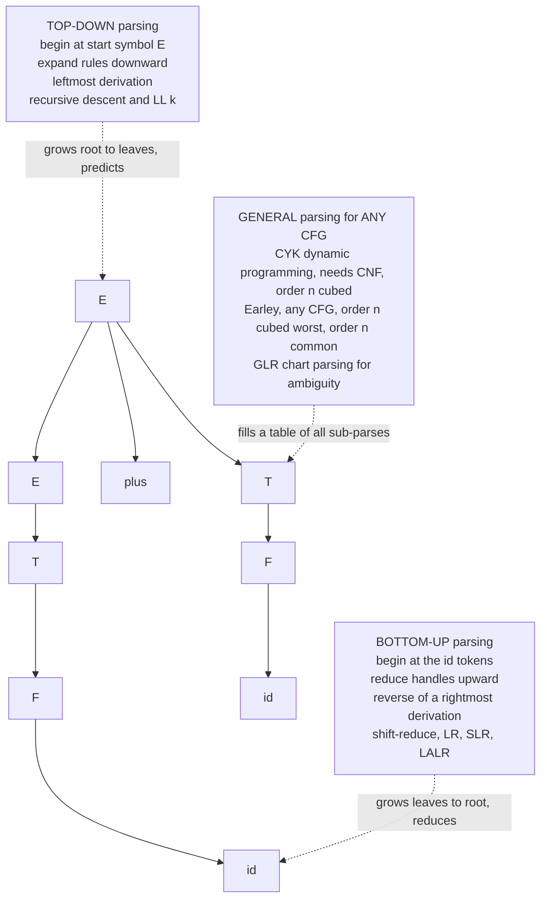

> [!abstract] TL;DR
> **Parsing** is the act of recovering the hidden hierarchical structure — the **parse tree** — of a flat string of tokens according to a grammar; it answers both *is this string in the language?* and *how could the grammar have generated it?*. A parse tree is exactly a **derivation** drawn as a tree, and the two great parsing families follow the two canonical derivation orders: **top-down parsers** (recursive descent, predictive LL(k)) trace a *leftmost* derivation by expanding the start symbol down toward the tokens, while **bottom-up parsers** (shift-reduce, LR / SLR / LALR — the engines behind yacc and bison) trace a *rightmost* derivation *in reverse* by reducing tokens up toward the start symbol. LR grammars capture exactly the **deterministic context-free languages** (the languages of deterministic pushdown automata) and are the most powerful practical linear-time parsers; for *any* CFG — including ambiguous ones — general algorithms like **CYK** (O(n³) dynamic programming over a grammar in Chomsky Normal Form) and **Earley** (O(n³) worst case, O(n) on many real grammars) always work, at the cost of speed.

---

## Intuition

**Analogy:** Think back to grade-school sentence diagramming. A teacher hands you a flat sentence — "the small dog chased a cat" — and asks you to draw the tree above it: this clump of words is the subject noun phrase, that clump is the verb phrase, and inside the verb phrase sits the verb and its object. You are not *inventing* the structure; you are *recovering* the structure that the rules of English grammar must have used to build that sentence. Parsing is exactly this, mechanised. The grammar is the rulebook; the token string is the finished sentence; the **parse tree** is the diagram you draw to explain *how the rulebook could have produced this exact string*.

The subtlety the analogy reveals: there is more than one way to *discover* the diagram. You could start at the top — "this must be a sentence, so it splits into a noun phrase and a verb phrase; let me try to make the words fit that shape" — working **top-down**. Or you could start at the bottom — "these two words look like a noun phrase, and those three look like a verb phrase; let me glue them into a sentence" — working **bottom-up**. Both build the *same* tree, but they build it in opposite directions, and that single choice of direction defines the entire landscape of parsing algorithms.

---

## How It Works

### From Grammar to Derivation to Parse Tree

A [[Context_Free_Grammars_and_Languages|context-free grammar]] is a set of rewrite rules like `E -> E + T`. A **derivation** is a sequence of rewrites starting at the start symbol `S` and ending at a string of terminals, where each step replaces one non-terminal by the right-hand side of one of its rules. The **parse tree** is that derivation drawn as a rooted tree: the root is `S`, each internal node is a non-terminal, its children are the symbols on the right-hand side of the rule applied, and the leaves read left-to-right spell the input.

A single parse tree usually corresponds to *many* derivations, because at each step you may choose *which* non-terminal to expand next. Two canonical choices matter:

- **Leftmost derivation** — always expand the *leftmost* remaining non-terminal. This is the order a **top-down** parser naturally produces: it decides the shape of the tree from the root down and from left to right, one prediction at a time.
- **Rightmost derivation** — always expand the *rightmost* remaining non-terminal. A **bottom-up** parser produces a rightmost derivation *in reverse*: each reduction it performs is the undoing of one step of a rightmost derivation, read from the last step back to the first.

If a grammar can produce **two distinct parse trees** for the same string, it is **ambiguous**. Ambiguity is a property of the *grammar*, not always of the *language*; some languages are *inherently ambiguous* (no unambiguous grammar exists), but most practical ambiguity is an artifact of how the grammar was written and can be engineered away.

### The Two Families



*The tree above is the single correct parse of `id + id`. A top-down parser builds it root-first, guessing rules before it has seen the matching tokens. A bottom-up parser builds it leaves-first, only committing to a rule once it has seen a complete right-hand side. General parsers sidestep the guessing entirely by tabulating every possible sub-parse.*

- **Top-down** expands from `E` and must *predict*, using lookahead, which rule to apply before consuming the matching tokens. Simple to hand-write, but restricted: the grammar must have no left recursion and enough determinism in its first tokens.
- **Bottom-up** keeps a **stack** (see [[Stack]]) of symbols seen so far, repeatedly deciding whether to **shift** the next token onto the stack or **reduce** a group of stack symbols (a *handle*) back into the non-terminal that produced them. More powerful, but the decision tables are too intricate to build by hand — hence parser generators.
- **General** parsers (CYK, Earley, GLR) give up linear time to guarantee they parse *every* CFG, including ambiguous grammars, by using [[DP_Patterns|dynamic programming]] to record all sub-parses of every substring.

---

## Key Concepts

### Secondary Level

**Parsing answers two questions at once.** *Recognition* asks the yes/no question "is this string in the language?" *Parsing* additionally answers "and here is the tree that proves it." A calculator that just checks whether `3 + * 4` is valid arithmetic is doing recognition; one that computes the answer must build and walk the tree.

**A parse tree is a proof.** Every internal node says "I applied this rule." Reading the applied rules from the root, leftmost-first, reconstructs a leftmost derivation; reading the reductions bottom-up reconstructs a rightmost derivation in reverse. The tree is the neutral object both directions converge on.

**Why direction matters — a concrete feel.** Parsing `1 + 2 * 3`:
- *Top-down* starts optimistic: "This is an expression. An expression is a sum of terms. The first term is... `1`. Then I expect a `+`. Good. Then another term `2 * 3`." It predicts the shape and checks the tokens fit.
- *Bottom-up* starts skeptical: "I see `1`. That is a term. Now `+`. Now `2`... hold on, is `2` a whole term, or is `2 * 3` the term? I will wait until I see `* 3` before I reduce." It refuses to commit until it has evidence.

The bottom-up parser's willingness to *wait and see* is exactly why it can handle more grammars than the top-down parser, which must guess early.

**Ambiguity is the enemy.** The classic school example is `1 + 2 * 3`. If the grammar does not encode that `*` binds tighter than `+`, both `(1 + 2) * 3 = 9` and `1 + (2 * 3) = 7` are valid parse trees. Real parsers must be told the answer through **precedence** and **associativity** rules.

---

### Undergraduate Level

**1. Recursive-descent parsing (top-down, hand-written).** Write one function per non-terminal; each function reads tokens and calls the functions for the symbols on its right-hand side. The call stack *is* the parse tree, unrolling top-down. Elegant and easy to debug, but two disciplines are mandatory:

- **No left recursion.** A rule `E -> E + T` makes `parse_E()` call `parse_E()` immediately, forever. Left recursion must be rewritten to right recursion or iteration: `E -> T E'` with `E' -> + T E' | epsilon`, or simply a `while` loop over `+ T`.
- **Left-factoring.** If two rules for `A` begin with the same prefix (`A -> if C then S | if C then S else S`), the parser cannot tell which to pick from the first token. Factor the common prefix out: `A -> if C then S A'` with `A' -> else S | epsilon`.

**2. Predictive LL(k) parsing.** "LL" means the parser scans **L**eft-to-right and produces a **L**eftmost derivation; the `k` is the number of lookahead tokens. An **LL(1)** parser drives recursive descent from a table indexed by *(non-terminal, next token)* built from two functions:
- **FIRST(A)** — the set of terminals that can begin a string derived from `A`.
- **FOLLOW(A)** — the set of terminals that can appear immediately after `A`.

A grammar is **LL(1)** iff, for every non-terminal, the FIRST sets of its alternative right-hand sides are disjoint (and, for nullable rules, disjoint from FOLLOW). If two entries land in the same table cell — a *conflict* — the grammar is not LL(1). LL parsers cannot handle left recursion or unfactored grammars, which is their principal limitation.

**3. Shift-reduce and LR parsing (bottom-up).** An **LR** parser scans **L**eft-to-right and produces a **R**ightmost derivation (in reverse). It maintains a stack and a **DFA of items** (the *LR automaton*); at each step a table says **shift** (push the next token), **reduce** (pop a handle, push its non-terminal), **accept**, or **error**. The power hierarchy, all linear-time:

| Parser | Table power | Notes |
|---|---|---|
| **LR(0)** | weakest | no lookahead on reductions; few real grammars qualify |
| **SLR(1)** | uses FOLLOW sets | simple, but rejects many useful grammars |
| **LALR(1)** | merged LR(1) states | the sweet spot: small tables, most languages; **yacc/bison** default |
| **LR(1)** | full lookahead states | most powerful deterministic; larger tables |

LR parsers accept a strict superset of LL grammars and handle left recursion naturally (in fact they *prefer* it), which is why production compilers favour them.

**4. General CFG parsing — CYK.** The **Cocke–Younger–Kasami** algorithm parses *any* CFG once it is in [[Chomsky_Normal_Form_and_Grammar_Transformations|Chomsky Normal Form]] (every rule `A -> B C` or `A -> a`). It fills a triangular **chart** `T[i][j]` = the set of non-terminals that can derive tokens `i..j`, using bottom-up [[Memoization_vs_Tabulation|tabulation]]:

```
for each single token: T[i][i] = { A : A -> token_i }
for span length 2..n, for each start i, for each split k:
    for each rule A -> B C:
        if B in left part and C in right part: add A to T[i][j]
input is accepted iff the start symbol S is in the top cell T[0][n-1]
```

Time **O(n³·|G|)**, space **O(n²·|G|)**. Backpointers recover the actual tree(s); the number of trees can be exponential, so they are enumerated lazily.

**5. General CFG parsing — Earley.** Earley's algorithm parses any CFG *directly*, no CNF needed, using top-down prediction plus bottom-up completion over sets of *dotted items*. Complexity is **O(n³)** worst case, **O(n²)** for unambiguous grammars, and **O(n)** for many practical (e.g. LR-like) grammars — making it a popular default for tools that must accept whatever grammar the user writes.

**6. Ambiguity, precedence, associativity.** Two evergreen problems:
- **Operator precedence / associativity.** A flat grammar `E -> E op E` is ambiguous. Fix it by *stratifying* the grammar into precedence levels (`E` for `+/-`, `T` for `*//`, `F` for atoms), or handle it in the parser with **precedence climbing / Pratt parsing** — a top-down technique that assigns each operator a binding power and recurses only while the next operator binds tighter. Pratt parsing is the go-to for expression parsing because it is compact and trivially extensible.
- **The dangling-else.** `if a then if b then s1 else s2` — does the `else` bind to the inner or outer `if`? The universal rule is "bind to the nearest unmatched `if`," which an LR parser implements for free by *preferring shift over reduce* on the else token.

**7. The compiler front-end pipeline.** Parsing never stands alone:

```
source text -> [ lexer / tokenizer ] -> tokens -> [ parser ] -> parse tree -> [ AST builder ] -> AST -> semantic analysis
```

[[Tokenization|Lexing]] uses a *regular* language (finite automaton) to chop characters into tokens; parsing uses a *context-free* grammar to assemble tokens into structure; the parser then emits an **Abstract Syntax Tree (AST)** — the parse tree with grammar bookkeeping stripped out. See [[Applications_of_Context_Free_Grammars]] for the downstream stages.

---

### Graduate Level

**Deterministic CFLs = LR(1) = DPDA.** Knuth's 1965 result is the deep theorem here: a language has an **LR(1)** grammar if and only if it is a **deterministic context-free language (DCFL)** — exactly the class recognised by a *deterministic* [[Pushdown_Automata|pushdown automaton]] (by empty stack, or equivalently DPDA with endmarker). This is why LR parsers are "the most powerful deterministic parsers": they cover the entire deterministic slice of the CFLs and nothing more. DCFLs are closed under complement (unlike general CFLs), which is precisely what unambiguous single-parse determinism buys you. LL(k) grammars are a *strict subset* of LR(k) grammars: every LL(k) language is a DCFL, but there are DCFLs (and even simple unambiguous grammars) that no LL(k) grammar can describe, because top-down parsing must commit before seeing the right context.

**The grammar-class ladder.** Ordered by the set of grammars each parser accepts:

```
LL(0) subset LL(1) subset LL(k) subset LALR(1) subset LR(1) subset unambiguous CFG subset all CFG
```

LR(1) captures all DCFLs; unambiguous-but-non-LR grammars exist (they need unbounded lookahead); ambiguous grammars need general parsers. The engineering tradeoff is a triangle: **grammar convenience vs parser power vs runtime cost**. LL/LR give linear time but constrain the grammar; CYK/Earley/GLR accept any grammar but pay O(n³).

**GLR and chart parsing.** **Generalized LR (Tomita 1985)** runs an LR automaton but, on a shift/reduce or reduce/reduce conflict, *forks* the stack into a **graph-structured stack**, exploring all interpretations in parallel and merging shared work. It behaves linearly on deterministic input and degrades gracefully to O(n³) on ambiguous regions — the standard technique for natural-language and for permissive tools (Bison has a GLR mode; tree-sitter, the incremental parser behind GitHub and many editors, is GLR-based).

**PEG and packrat parsing — a different formalism, not just a different algorithm.** A **Parsing Expression Grammar** looks like a CFG but replaces the *ambiguous* choice `A | B` with an **ordered choice** `A / B`: it tries `A` first and only falls back to `B` if `A` fails, so a PEG is *unambiguous by construction* and always describes a single-parse *recognizer*. **Packrat parsing** memoizes every (rule, position) result to guarantee linear time at the cost of O(n) memory. PEGs are not equivalent to CFGs: they can recognize some non-context-free languages (e.g. `aⁿbⁿcⁿ`) yet cannot express certain context-free languages, and their greedy ordered choice can silently hide alternatives (the *language-hiding* pitfall). **CPython adopted a PEG parser in 3.9 (PEP 617)**, replacing its old LL(1) grammar.

**Earley refinements and sub-cubic bounds.** Earley is O(n) on all LR(k) grammars and O(n²) on unambiguous grammars; **Leo's optimization (1991)** restores linear time on right-recursive grammars that otherwise degrade Earley to quadratic. Valiant (1975) showed CFG recognition reduces to Boolean matrix multiplication, giving an O(n^2.37...) bound — of theoretical interest only, as the constants are enormous.

**Statistical parsing.** In [[Computational_Linguistics|natural-language parsing]], grammars are ambiguous *by nature*, so a **Probabilistic CFG (PCFG)** attaches a probability to each rule and the **Viterbi CYK** algorithm (max-product instead of set-union, same O(n³) shape) returns the single *most probable* tree. Lexicalized and neural chart parsers extend this to state-of-the-art constituency parsing; see [[Phrase_Structure_Grammar]].

**Incrementality and error recovery.** Real IDEs re-parse on every keystroke and must recover gracefully from syntax errors. GLR and Earley naturally support incremental and error-tolerant parsing; LR parsers use *panic-mode* or *phrase-level* recovery to resynchronize after an error and keep reporting further ones.

---

## Python Demo

```python
"""
Parsing and Derivations: two complementary parsers.

  Part A -- TOP-DOWN: a hand-written recursive-descent parser for arithmetic
            expressions that builds an AST, honouring operator precedence
            (* / bind tighter than + -) and left-associativity. This traces
            a LEFTMOST derivation via the call stack.

  Part B -- BOTTOM-UP / GENERAL: the CYK dynamic-programming algorithm for an
            arbitrary CFG in Chomsky Normal Form. It fills the O(n^2) triangular
            chart in O(n^3) time and reports both membership and the full chart.

Visualization: the recursive-descent AST, the CYK chart, and a parser
complexity comparison. numpy + matplotlib only.
"""
import numpy as np
import matplotlib.pyplot as plt
from collections import defaultdict

# ============================================================================
# PART A -- TOP-DOWN: recursive-descent parser for arithmetic expressions
# Grammar (left-recursion removed, precedence stratified):
#   expr   -> term   (('+' | '-') term)*      left-associative, low precedence
#   term   -> factor (('*' | '/') factor)*    left-associative, high precedence
#   factor -> NUMBER | '(' expr ')'
# ============================================================================
def tokenize(text):
    toks, i = [], 0
    while i < len(text):
        c = text[i]
        if c.isspace():
            i += 1
        elif c.isdigit():
            j = i
            while j < len(text) and text[j].isdigit():
                j += 1
            toks.append(("num", int(text[i:j])))
            i = j
        elif c in "+-*/()":
            toks.append((c, c))
            i += 1
        else:
            raise ValueError(f"illegal character {c!r}")
    toks.append(("eof", None))
    return toks


class RecursiveDescent:
    """Each method mirrors one grammar rule; the call stack IS the parse tree."""
    def __init__(self, tokens):
        self.toks, self.pos = tokens, 0

    def _peek(self):
        return self.toks[self.pos][0]

    def _advance(self):
        tok = self.toks[self.pos]
        self.pos += 1
        return tok

    def parse(self):
        node = self.expr()
        assert self._peek() == "eof", "trailing input after a complete expression"
        return node

    def expr(self):                       # + and - , left associative
        node = self.term()
        while self._peek() in ("+", "-"):
            op = self._advance()[0]
            node = ("op", op, node, self.term())
        return node

    def term(self):                       # * and / , left associative
        node = self.factor()
        while self._peek() in ("*", "/"):
            op = self._advance()[0]
            node = ("op", op, node, self.factor())
        return node

    def factor(self):                     # NUMBER or ( expr )
        tok = self._peek()
        if tok == "num":
            return ("num", self._advance()[1])
        if tok == "(":
            self._advance()               # consume '('
            node = self.expr()
            assert self._peek() == ")", "missing closing parenthesis"
            self._advance()               # consume ')'
            return node
        raise ValueError(f"unexpected token {tok!r}")


def evaluate(node):
    if node[0] == "num":
        return node[1]
    _, op, left, right = node
    a, b = evaluate(left), evaluate(right)
    return {"+": a + b, "-": a - b, "*": a * b, "/": a / b}[op]


def ast_to_str(node):
    if node[0] == "num":
        return str(node[1])
    _, op, left, right = node
    return f"({ast_to_str(left)} {op} {ast_to_str(right)})"


EXPR = "3 + 4 * 2 - 1"
ast = RecursiveDescent(tokenize(EXPR)).parse()
print("PART A  --  Top-down recursive descent")
print(f"  input      : {EXPR}")
print(f"  parse (AST): {ast_to_str(ast)}")
print(f"  value      : {evaluate(ast)}   (note * bound tighter than + -)")

# ============================================================================
# PART B -- GENERAL: CYK parser for an arbitrary CFG in Chomsky Normal Form.
# Classic textbook grammar over terminals {a, b}:
#   S -> A B | B C
#   A -> B A | a
#   B -> C C | b
#   C -> A B | a
# ============================================================================
CNF = {
    "S": [("A", "B"), ("B", "C")],
    "A": [("B", "A"), ("a",)],
    "B": [("C", "C"), ("b",)],
    "C": [("A", "B"), ("a",)],
}
BINARY = [(lhs, p[0], p[1]) for lhs, ps in CNF.items() for p in ps if len(p) == 2]
TERMINAL = defaultdict(set)
for lhs, ps in CNF.items():
    for p in ps:
        if len(p) == 1:
            TERMINAL[p[0]].add(lhs)


def cyk(tokens):
    """Return chart T where T[length-1][start] = set of NTs spanning that span."""
    n = len(tokens)
    T = [[set() for _ in range(n)] for _ in range(n)]
    for i, w in enumerate(tokens):                    # length-1 spans (diagonal)
        T[0][i] |= TERMINAL.get(w, set())
    for length in range(2, n + 1):                    # bottom-up over span length
        for i in range(n - length + 1):
            for split in range(1, length):            # every way to cut the span
                left = T[split - 1][i]
                right = T[length - split - 1][i + split]
                for lhs, B, C in BINARY:
                    if B in left and C in right:
                        T[length - 1][i].add(lhs)
    return T


def accepts(T, n):
    return "S" in T[n - 1][0]


print("\nPART B  --  Bottom-up / general CYK  (O(n^3) dynamic programming)")
for word in ["baaba", "aa"]:
    toks = list(word)
    T = cyk(toks)
    ok = accepts(T, len(toks))
    print(f"  '{word}'  ->  in language: {ok}")

# ============================================================================
# VISUALIZATION
# ============================================================================
fig = plt.figure(figsize=(17, 6))
fig.suptitle("Parsing: Top-Down AST  |  Bottom-Up CYK Chart  |  Complexity",
             fontsize=13, fontweight="bold")

# ---- Panel 1: recursive-descent AST ----------------------------------------
ax1 = fig.add_subplot(1, 3, 1)


def ast_layout(node, depth, counter):
    if node[0] == "num":
        x = counter[0]
        counter[0] += 1
        return x, [("num", str(node[1]), x, -depth)], []
    _, op, left, right = node
    lx, ln, le = ast_layout(left, depth + 1, counter)
    rx, rn, re = ast_layout(right, depth + 1, counter)
    mx = (lx + rx) / 2.0
    nodes = [("op", op, mx, -depth)] + ln + rn
    edges = [(mx, -depth, lx, -(depth + 1)), (mx, -depth, rx, -(depth + 1))] + le + re
    return mx, nodes, edges


_, nodes, edges = ast_layout(ast, 0, [0])
for x1, y1, x2, y2 in edges:
    ax1.plot([x1, x2], [y1, y2], "-", color="#555", lw=1.3, zorder=1)
for kind, label, x, y in nodes:
    fc = "#f9e79f" if kind == "op" else "#a9dfbf"
    ax1.text(x, y, label, ha="center", va="center", fontsize=11, fontweight="bold",
             bbox=dict(boxstyle="circle,pad=0.32", facecolor=fc, edgecolor="#1c2833"),
             zorder=2)
xs, ys = [n[2] for n in nodes], [n[3] for n in nodes]
ax1.set_xlim(min(xs) - 0.7, max(xs) + 0.7)
ax1.set_ylim(min(ys) - 0.4, 0.5)
ax1.set_title(f'Top-down AST for "{EXPR}"\nvalue = {evaluate(ast)}', fontsize=10)
ax1.axis("off")

# ---- Panel 2: CYK chart for "baaba" ----------------------------------------
ax2 = fig.add_subplot(1, 3, 2)
chars = list("baaba")
T = cyk(chars)
n = len(chars)
ok = accepts(T, n)
for length in range(1, n + 1):
    for i in range(n - length + 1):
        nts = T[length - 1][i]
        x, y = i + length / 2.0, length
        is_top = (length == n and i == 0)
        fc = ("#a9dfbf" if ok else "#f5b7b1") if is_top else "#eaf2f8"
        ax2.text(x, y, ",".join(sorted(nts)) if nts else "-", ha="center", va="center",
                 fontsize=9, fontweight="bold" if is_top else "normal",
                 bbox=dict(boxstyle="round,pad=0.3", facecolor=fc, edgecolor="#34495e"))
for i, ch in enumerate(chars):
    ax2.text(i + 0.5, 0.35, ch, ha="center", va="center",
             fontsize=13, fontweight="bold", color="#7b241c")
ax2.set_xlim(0, n)
ax2.set_ylim(0, n + 0.8)
ax2.set_xticks([])
ax2.set_yticks(range(1, n + 1))
ax2.set_ylabel("span length", fontsize=9)
ax2.set_title(f'CYK chart for "baaba"\nS in top cell -> accepted = {ok}', fontsize=10)

# ---- Panel 3: parser complexity comparison ---------------------------------
ax3 = fig.add_subplot(1, 3, 3)
nn = np.arange(1, 41)
ax3.plot(nn, nn.astype(float), color="#27ae60", lw=2, label="LL / LR deterministic  order n")
ax3.plot(nn, nn.astype(float) ** 2, color="#2980b9", lw=2, label="Earley unambiguous  order n squared")
ax3.plot(nn, nn.astype(float) ** 3, color="#c0392b", lw=2, label="CYK / general Earley  order n cubed")
ax3.set_yscale("log")
ax3.set_xlabel("input length n", fontsize=9)
ax3.set_ylabel("work (log scale)", fontsize=9)
ax3.set_title("Grammar power vs parsing cost", fontsize=10)
ax3.legend(fontsize=8, loc="upper left")
ax3.grid(True, alpha=0.3)

plt.tight_layout()
plt.savefig("parsing_and_derivations.png", dpi=120, bbox_inches="tight")
plt.show()
print("\nPlot saved: parsing_and_derivations.png")
```

**Expected output:**

```
PART A  --  Top-down recursive descent
  input      : 3 + 4 * 2 - 1
  parse (AST): (((3) + (4 * 2)) - 1)
  value      : 10   (note * bound tighter than + -)

PART B  --  Bottom-up / general CYK  (O(n^3) dynamic programming)
  'baaba'  ->  in language: True
  'aa'  ->  in language: False

Plot saved: parsing_and_derivations.png
```

The recursive-descent parser demonstrates the **top-down** family: precedence is baked into the grammar's layering (`expr` above `term`), so `4 * 2` becomes a single subtree *before* it is added, and left-associativity falls out of the `while` loop. The CYK run demonstrates **general** bottom-up parsing: it fills the triangular chart for *any* CNF grammar, deciding membership by checking whether the start symbol reached the top cell — `baaba` parses, `aa` does not. The complexity panel makes the central tradeoff visual: deterministic LL/LR parsers run in linear time but restrict the grammar, whereas CYK/Earley accept every CFG at a cubic price.

---

## Real-World Applications

> **yacc / GNU Bison (LALR(1)) — the workhorses of production compilers.** Bison generates LALR(1) parsers and is the parser behind an enormous amount of infrastructure: the **PostgreSQL** SQL grammar, the **Ruby MRI** interpreter, **Bash**, **PHP (Zend)**, and countless domain-specific languages. LALR(1) hits the industrial sweet spot — compact tables, linear time, and enough grammar power for real programming-language syntax — which is exactly the *deterministic CFL* territory that Knuth's LR theorem carved out.

> **Clang, GCC, and Go — hand-written recursive descent.** Despite the theoretical superiority of LR, modern production C/C++ front-ends (**Clang**, and GCC since it abandoned its Bison grammar) and the **Go** compiler use *hand-written recursive-descent* parsers. The reason is pragmatic: hand-written top-down parsers give far better error messages, support ad-hoc error recovery, and are easier to maintain than machine-generated tables — a case where developer ergonomics beats formal power.

> **CPython's PEG parser (PEP 617, Python 3.9).** Python replaced its decades-old LL(1) grammar with a **PEG / packrat parser** in 2020. The LL(1) grammar had grown so contorted (to dodge its one-token-lookahead limit) that new syntax was becoming impossible to express cleanly. The PEG parser's unlimited lookahead and ordered choice let the language designers write the grammar the way they think, at the cost of memoization memory — a textbook illustration of the grammar-convenience vs cost tradeoff.

> **tree-sitter (GLR) — incremental parsing in every editor.** tree-sitter, used by GitHub, Neovim, and Atom for syntax highlighting and code navigation, is a **GLR-based incremental parser**. It re-parses only the edited region on each keystroke and tolerates syntax errors gracefully, exploiting GLR's ability to fork on ambiguity and merge shared sub-parses — behaviour that linear LL/LR parsers cannot provide.

> **Statistical constituency parsing in NLP.** Natural-language grammars are massively ambiguous, so NLP parsers use **probabilistic CYK (Viterbi CYK)** and its neural descendants to return the single most probable tree rather than all trees. The Stanford Parser, the Berkeley Neural Parser, and the constituency parsers evaluated on the Penn Treebank all trace their lineage to CYK over a PCFG.

---

## Common Pitfalls

- **Left recursion in a top-down parser** — A rule like `expr -> expr '+' term` makes `parse_expr()` call itself with no progress, causing infinite recursion / stack overflow. Recursive-descent and LL parsers *cannot* consume left recursion; you must rewrite it to right recursion or an iterative loop first. (Bottom-up LR parsers, by contrast, *prefer* left recursion because it keeps the stack shallow.)

- **Assuming LL(1) can handle any language** — Beginners force every grammar into LL(1) and then fight endless conflicts. Many perfectly reasonable languages are DCFLs that are LR(1) but *not* LL(k) for any k, because top-down parsing must commit to a rule before seeing the disambiguating right context. Reach for an LR/LALR generator or Earley/PEG rather than mangling the grammar.

- **Ignoring precedence and associativity** — A flat `E -> E op E` grammar is ambiguous, so a naive parser silently produces whichever tree it stumbles into, giving `1 + 2 * 3 = 9`. Encode precedence by stratifying the grammar into levels, declaring `%left`/`%right` precedence in yacc/bison, or using Pratt / precedence-climbing parsing for expressions.

- **The dangling-else, resolved by accident** — `if a then if b then s else t` is genuinely ambiguous. LR generators report a *shift/reduce conflict* and default to *shift*, which happens to give the conventional "else binds to nearest if" — but relying on the default silently masks a real ambiguity. Make the intent explicit in the grammar or with a precedence declaration.

- **Forgetting CNF (and its artifacts) for CYK** — CYK requires Chomsky Normal Form; feeding it a raw grammar simply fails. Worse, the binarization introduced during CNF conversion adds synthetic non-terminals (`X_YZ`), so the raw CYK tree does not match the original grammar — you must *undo* the binarization when reconstructing the user-facing parse tree. This is the single most common CYK implementation bug.

- **Confusing an ambiguous grammar with an inherently ambiguous language** — Most ambiguity is a fixable property of *how you wrote the grammar*, not of the language. Only a handful of languages are *inherently* ambiguous (no unambiguous grammar exists). Before concluding "this language is ambiguous," try to rewrite the grammar; usually you can.

- **PEG ordered choice silently hiding alternatives** — In a PEG, `A / B` tries `A` first and *never reconsiders* if `A` partially matches, so `("a" / "ab")` will never match `"ab"` because `"a"` wins first. Unlike a CFG's symmetric `A | B`, PEG choice is order-sensitive and can hide whole branches of your language. Order your alternatives longest/most-specific first.

---

## Related Concepts

- [[Context_Free_Grammars_and_Languages]] — the source formalism parsing operates on; a parse tree is a CFG derivation drawn as a tree, and the grammar's class determines which parser can handle it
- [[Pushdown_Automata]] — the abstract machine model of parsing; LR(1) grammars describe exactly the deterministic CFLs recognised by deterministic PDAs, and the shift-reduce stack *is* a PDA stack
- [[Chomsky_Normal_Form_and_Grammar_Transformations]] — CYK's prerequisite; converting to CNF, plus removing left recursion and left-factoring, are the grammar transformations that make specific parsers applicable
- [[Applications_of_Context_Free_Grammars]] — the downstream context: parsing is the middle stage of the compiler front-end pipeline (lex, parse, AST, semantic analysis)
- [[DP_Patterns]] — CYK and Earley are dynamic-programming algorithms over string spans; the CYK chart is a 2-D DP table filled bottom-up
- [[Memoization_vs_Tabulation]] — CYK is textbook tabulation over spans; packrat/PEG parsing is memoization over (rule, position) pairs — the same idea from opposite directions
- [[Stack]] — bottom-up shift-reduce parsers and the underlying pushdown automaton both drive their decisions off an explicit symbol stack
- [[String_Matching_Overview]] — situates parsing in the Chomsky hierarchy: lexing is a *regular* (finite-automaton) problem one rung below the *context-free* parsing problem
- [[Tokenization]] — the lexical stage that must run before parsing; it segments raw characters into the token stream the parser consumes
- [[Phrase_Structure_Grammar]] — the linguistics view of the same parse trees; constituency structure and X-bar theory are CFG parsing applied to natural language
- [[Computational_Linguistics]] — where CYK, Earley, PCFGs, and GLR are used at scale for ambiguous natural-language grammars

---

## Review Questions

### Secondary

1. In one or two sentences, explain the difference between *recognizing* a string and *parsing* it. Which one does a compiler need, and why?
2. Draw (or describe) the parse tree for `2 * 3 + 4` under a grammar where `*` binds tighter than `+`. Then explain what would go wrong if the grammar did not encode precedence.
3. A top-down parser and a bottom-up parser both parse `1 + 2 * 3` and produce the *same* tree. In plain language, describe how their *processes* differ — who "guesses early" and who "waits and sees," and why.

### Undergraduate

1. The grammar `E -> E + T | T`, `T -> T * F | F`, `F -> ( E ) | id` cannot be parsed by recursive descent as written. Identify the exact problem, rewrite the grammar to fix it, and state which property (LL or LR) the *original* left-recursive grammar is friendlier to.
2. Trace the CYK algorithm by hand for the string `baaba` using the grammar in the Python Demo (`S -> AB | BC`, `A -> BA | a`, `B -> CC | b`, `C -> AB | a`). Fill the length-1 and length-2 rows of the chart and explain how you would know the string is accepted.
3. LL(1) and LALR(1) parsers both run in linear time. Give one grammar feature that LALR(1) handles but LL(1) cannot, and explain *why* the top-down parser fails on it. When would you nevertheless choose to hand-write a recursive-descent parser over generating an LALR one?

### Graduate

1. State Knuth's theorem relating LR(1) grammars and deterministic context-free languages. Using it, explain precisely why LR parsers are called "the most powerful *deterministic* parsers" and give an example of a context-free language that *no* LR(1) grammar can capture. What kind of parser would you need for that language?
2. A PEG can recognize `{ aⁿbⁿcⁿ : n >= 0 }`, which is not context-free, yet PEGs cannot express some context-free languages. Explain the mechanism (ordered choice + unlimited lookahead + syntactic predicates) that gives PEGs this incomparable power, and describe one concrete way PEG's *ordered choice* can silently produce a parser that accepts a different language than the author intended.
3. Earley's algorithm is O(n³) worst case but O(n) on LR(k) grammars, while CYK is uniformly O(n³). Explain what structural property of a grammar lets Earley "collapse" to linear time, why CYK cannot exploit the same property, and how GLR achieves a similar linear-on-deterministic / cubic-on-ambiguous adaptivity through its graph-structured stack.

---

## Sources

- [Aho, A., Lam, M., Sethi, R., & Ullman, J. (2006). *Compilers: Principles, Techniques, and Tools* (2nd ed., "the Dragon Book"). Chapters 4–5.](https://www.pearson.com/en-us/subject-catalog/p/compilers-principles-techniques-and-tools/P200000003472/)
- [Knuth, D. E. (1965). On the translation of languages from left to right. *Information and Control*, 8(6), 607–639.](https://www.sciencedirect.com/science/article/pii/S0019995865904262)
- [Earley, J. (1970). An efficient context-free parsing algorithm. *Communications of the ACM*, 13(2), 94–102.](https://dl.acm.org/doi/10.1145/362007.362035)
- [Ford, B. (2004). Parsing Expression Grammars: A Recognition-Based Syntactic Foundation. *POPL 2004*.](https://bford.info/pub/lang/peg.pdf)
- [Pratt, V. R. (1973). Top down operator precedence. *POPL 1973*.](https://dl.acm.org/doi/10.1145/512927.512931)
- [van Rossum, G. et al. (2020). PEP 617 — New PEG parser for CPython.](https://peps.python.org/pep-0617/)
- [Sipser, M. (2013). *Introduction to the Theory of Computation* (3rd ed.). Deterministic context-free languages and DPDAs.](https://math.mit.edu/~sipser/book.html)
- [Grune, D. & Jacobs, C. (2008). *Parsing Techniques: A Practical Guide* (2nd ed.). Springer.](https://link.springer.com/book/10.1007/978-0-387-68954-8)

---

#theory-of-computation #parsing #cyk-algorithm #ll-parsing #lr-parsing
