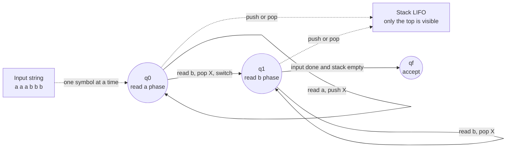

# 🤖 Pushdown Automata

> [!abstract] TL;DR
> A **pushdown automaton (PDA)** is a finite automaton bolted onto an **unbounded stack**. That one stack is the whole difference: it gives the machine just enough memory to match **nested, recursive structure** — `a^n b^n`, balanced brackets, arithmetic expressions — that a memoryless [[Finite_Automata_DFA_and_NFA|finite automaton]] provably cannot. PDAs recognize **exactly** the context-free languages, the same class generated by [[Context_Free_Grammars_and_Languages|context-free grammars]].

---

## Intuition

**Analogy first.** Imagine a clerk at a desk (the finite control) with a very short memory — they can only remember which of a handful of "moods" they are currently in. Next to the desk is a **spring-loaded stack of trays**, exactly like the plate dispenser at a cafeteria. The clerk can only ever touch the **top tray**: drop a new tray on top (**push**) or lift the top one off (**pop**). They can never peek in the middle or count how many trays are underneath.

That single restricted-access stack is astonishingly powerful. To check that a string looks like `aaabbb`, the clerk drops one tray for every `a`, then lifts one tray for every `b`. If the trays run out **exactly** as the `b`s run out, the counts matched. The clerk never had to *count* — they never needed a number bigger than "is the stack empty?" — yet they verified an unbounded count. That is a PDA: **a [[Finite_Automata_DFA_and_NFA|DFA/NFA]] plus a stack**, and the stack is the [[Stack|LIFO]] scratchpad that a plain finite machine lacks.

---

## How It Works

### Core Mechanics

A PDA reads its input **left to right, one symbol at a time**, and at every step it may also inspect and modify the **top of the stack**. A move is chosen based on **three things at once**:

1. the **current state** (the finite control's mood),
2. the **current input symbol** (or `ε` — a move that reads nothing), and
3. the **top stack symbol**.

Given those, the transition may **change state**, **consume** the input symbol (or not, if it is an `ε`-move), and **replace the top stack symbol** with a string of zero or more symbols. Replacing with the empty string is a **pop**; replacing with a longer string is a **push**; the stack grows and shrinks with no fixed bound.

**Formal definition (7-tuple).** A PDA is `M = (Q, Σ, Γ, δ, q0, Z0, F)`:

| Symbol | Meaning |
|--------|---------|
| `Q` | finite set of **states** |
| `Σ` | **input alphabet** |
| `Γ` | **stack alphabet** (often includes symbols not in `Σ`, e.g. a bottom marker `Z0`) |
| `δ` | **transition relation** `δ: Q × (Σ ∪ {ε}) × Γ → finite subsets of Q × Γ*` |
| `q0` | start state |
| `Z0` | initial stack symbol (bottom-of-stack marker) |
| `F` | set of accepting (final) states |

The signature of `δ` is the whole story: input **and** stack-top go in; a new state **and** a replacement stack-string come out. Because the codomain is a set of possibilities, the machine is naturally **nondeterministic**.

### Where the extra power comes from

A [[Finite_Automata_DFA_and_NFA|DFA]] has only its finite set of states as memory — a fixed number of bits, chosen before it ever sees the input. It literally cannot store an arbitrary count, which is exactly why `a^n b^n` is **not regular** (see [[The_Pumping_Lemma_for_Context_Free_Languages|pumping arguments]]). The stack removes that ceiling: it is **unbounded** memory, but **restricted** to LIFO access. That restriction is not a weakness — it is precisely the shape of **recursion and nesting**. Every push is a promise; every matching pop keeps it. This is why the stack matches brackets, tags, and grammar productions, but still cannot handle `a^n b^n c^n` (one stack tracks one nesting, not two — that needs [[Computability|Turing machines]]).

### Two acceptance criteria (equivalent)

- **Acceptance by final state** — the input is accepted if, after consuming all of it, the PDA is in a state in `F` (stack contents irrelevant).
- **Acceptance by empty stack** — the input is accepted if, after consuming all of it, the **stack is empty** (final state irrelevant).

These define the **same class of languages**: any PDA using one criterion can be mechanically converted to a PDA using the other. Our demo below uses the empty-stack idea (accept iff the stack drains exactly).

### Nondeterministic vs Deterministic — a crucial twist

For finite automata, **NFA and DFA are equally powerful** (subset construction determinizes any NFA). **For PDAs this collapses:**

- **NPDA (nondeterministic)** recognizes **all** context-free languages.
- **DPDA (deterministic)** recognizes only a **strict subset**, the **deterministic context-free languages (DCFLs)**.

Some CFLs — for example even-length palindromes `w w^R` — are recognized by **no** DPDA: the machine cannot know where the middle is without guessing. So `DCFL ⊊ CFL`. The DCFLs matter enormously in practice: they are exactly the languages a deterministic **LR parser** can handle in linear time, which is why real compilers care about them (see [[Parsing_and_Derivations]]).

### Flow / Architecture

The diagram shows the PDA for `L = { a^n b^n }`: push a marker `X` for each `a`, pop one for each `b`, accept when input is done and the stack is empty.



---

## Key Concepts

### Secondary (intuitive)
- A PDA is a **DFA with a stack** — a machine plus a [[Stack|LIFO scratchpad]] it can only touch at the top.
- The stack lets it **match nested things**: opening `a`s against closing `b`s, `(` against `)`, `<div>` against `</div>`.
- **Push** = "I owe a match later." **Pop** = "match delivered." Empty at the end = "all debts paid."

### Undergraduate (formal)
- The **7-tuple** `(Q, Σ, Γ, δ, q0, Z0, F)`; the transition relation reads **state + input + stack-top** and outputs **state + replacement string**.
- **Two equivalent acceptance modes:** final state and empty stack.
- **Fundamental equivalence:** a language is context-free **iff** some PDA recognizes it. There are mechanical constructions **CFG → PDA** (the standard PDA simulates a leftmost derivation on its stack) and **PDA → CFG** (variables encode "go from state p with X on top to state q, net-popping X"). This ties PDAs to [[Context_Free_Grammars_and_Languages|context-free grammars]] and to [[Parsing_and_Derivations|derivations]].
- **Why `a^n b^n` needs a PDA:** it is non-regular by the pumping lemma for regular languages, but a single stack recognizes it. The **pumping lemma for context-free languages** (see [[The_Pumping_Lemma_for_Context_Free_Languages]]) then shows where even the stack runs out, e.g. `a^n b^n c^n`.

### Graduate (deep)
- **`DCFL ⊊ CFL`:** nondeterminism is *strictly* stronger for PDAs, unlike finite automata. Palindromes and `L = {a^n b^n} ∪ {a^n b^{2n}}` separate the classes.
- **DCFLs and LR parsing:** deterministic PDAs correspond to languages parseable by deterministic **bottom-up LR** methods — the theoretical backbone of practical parsers (LR, LALR, SLR). This is the bridge to [[Parsing_and_Derivations]] and real [[Compilers|compiler front-ends]].
- **Closure asymmetries:** CFLs are **not** closed under intersection or complement, but **DCFLs are closed under complement** (you can determinize the accept/reject decision). Intersecting two CFLs can yield `a^n b^n c^n`, escaping the class entirely.
- **Undecidability nearby:** whether a CFG is **ambiguous**, whether two CFGs are **equivalent**, and whether a CFG generates all strings are all **undecidable** — a foretaste of [[Computability]].

---

## Python Demo

A concrete PDA with an **explicit stack** recognizing `L = { a^n b^n : n ≥ 0 }` — a context-free language **no** [[Finite_Automata_DFA_and_NFA|finite automaton]] can accept. We trace the stack step by step, plot it as a counter, and then show empirically that a **bounded-memory DFA cannot** do the same job. `numpy` / `matplotlib` only.

```python
# Pushdown automaton for L = { a^n b^n : n >= 0 }, a canonical context-free
# language that NO finite automaton (DFA/NFA) can recognize. The single stack
# is the ENTIRE source of the extra power: it counts the a's, then cancels
# them one-for-one against the b's.

import numpy as np
import matplotlib.pyplot as plt

# Stack alphabet: 'X' marks one unmatched 'a'. We use a Python list as the
# stack; index -1 (the end) is the TOP and the only cell the PDA may inspect.

def run_pda_anbn(s):
    """Deterministic PDA recognizing a^n b^n via ACCEPTANCE BY EMPTY STACK.
    Returns (accepted, trace); trace[i] = (pos, symbol, action, stack_after)."""
    stack = []                                     # empty stack; top == stack[-1]
    state = "q0"                                   # q0 = reading a's, q1 = reading b's
    trace = [(0, "<start>", "init", list(stack))]

    for i, sym in enumerate(s):
        if state == "q0" and sym == "a":
            stack.append("X")                      # PUSH one marker per 'a'
            action = "push X"
        elif state == "q0" and sym == "b":
            if not stack:                          # a 'b' with nothing to cancel
                return False, trace + [(i + 1, sym, "reject: no a to match", list(stack))]
            state = "q1"                           # switch to the b-phase
            stack.pop()                            # POP: cancel one 'a'
            action = "pop X, go q1"
        elif state == "q1" and sym == "b":
            if not stack:                          # more b's than a's
                return False, trace + [(i + 1, sym, "reject: too many b", list(stack))]
            stack.pop()                            # POP: cancel one 'a'
            action = "pop X"
        else:                                      # e.g. an 'a' after a 'b'
            return False, trace + [(i + 1, sym, "reject: bad symbol/order", list(stack))]
        trace.append((i + 1, sym, action, list(stack)))

    accepted = (len(stack) == 0)                   # accept iff stack emptied exactly
    return accepted, trace


tests = ["", "ab", "aabb", "aaabbb", "aab", "abb", "abab", "ba", "aaabb"]
print("string        accepted?   (in L = a^n b^n)")
for t in tests:
    ok, _ = run_pda_anbn(t)
    print(f"{t!r:>10}     {ok}")

# ---- Show the stack evolving for one accepted string --------------------------
demo = "aaabbb"
ok, trace = run_pda_anbn(demo)
print(f"\nStep-by-step stack trace for {demo!r}  (accepted={ok}):")
print(f"{'step':>4} {'read':>6} {'action':<22} stack (top on right)")
for pos, sym, action, stk in trace:
    print(f"{pos:>4} {sym:>6} {action:<22} {''.join(stk)}")

# ---- Plot: stack depth over time = the 'counter' a DFA cannot keep ------------
fig, ax = plt.subplots(figsize=(8, 4.5))
for word, color in [("aaabbb", "tab:green"),    # in L
                    ("aabbb",  "tab:red"),       # too many b's -> rejected
                    ("aaab",   "tab:orange")]:   # too few b's  -> rejected
    _, tr = run_pda_anbn(word)
    depths = [len(stk) for (_, _, _, stk) in tr]
    ax.plot(range(len(depths)), depths, marker="o", label=word, color=color)
ax.axhline(0, color="black", lw=0.8)
ax.set_xlabel("input position (steps)")
ax.set_ylabel("stack depth = unmatched a's")
ax.set_title("The stack is a counter: only a^n b^n returns to exactly 0")
ax.legend(title="input word")
ax.grid(alpha=0.3)
plt.tight_layout()
plt.savefig("pda_stack_depth.png", dpi=120)
print("\nSaved pda_stack_depth.png")

# ---- Why a DFA fails: bounded memory cannot count without limit ---------------
def bounded_counter_dfa(s, k):
    """A DFA has only FINITELY many states, so it can remember a count only up
    to k. Beyond k it SATURATES and can no longer tell a^n b^n from a^n b^m."""
    count, phase = 0, "a"
    for sym in s:
        if sym == "a" and phase == "a":
            count = min(count + 1, k)     # saturates at k -> information is lost
        elif sym == "b":
            phase = "b"
            count = max(count - 1, 0)
        else:
            return False
    return count == 0

k = 3
n = k + 2                                   # push n beyond the DFA's memory
good = "a" * n + "b" * n                     # truly in L
bad = "a" * n + "b" * (n + 1)               # NOT in L: one extra b
print(f"\nBounded DFA with k={k} units of memory, n={n} (> k):")
print(f"  a^{n} b^{n}   -> DFA says {bounded_counter_dfa(good, k)}, "
      f"PDA says {run_pda_anbn(good)[0]}")
print(f"  a^{n} b^{n+1} -> DFA says {bounded_counter_dfa(bad, k)}, "
      f"PDA says {run_pda_anbn(bad)[0]}")
print("The DFA accepts BOTH (wrong); the unbounded stack lets the PDA reject a^n b^(n+1).")
```

**What it shows.** The trace prints the stack rising to `XXX` on the `a`s and draining back to empty on the `b`s. The plot makes the stack visible as a **counter** — only `a^n b^n` returns to exactly zero. The final block is the punchline: a DFA with any *fixed* memory `k` **saturates** and can no longer distinguish `a^n b^n` from `a^n b^{n+1}` once `n > k`, while the PDA's **unbounded** stack draws the line correctly. The stack is the extra power.

---

## Real-World Applications

> **Example — recursive-descent parsers and the call stack.** Every hand-written recursive-descent parser *is* a PDA in disguise: the program's **call stack** is the pushdown store. When it enters `parseExpression()` inside `parseExpression()`, it is pushing; when a subexpression returns, it is popping. Nested parentheses in `((a+b)*c)` are matched by exactly this stack discipline.

- **Compiler front-ends.** LR / LALR parser generators (**yacc**, **Bison**, **ANTLR**'s LL variants) build a **deterministic PDA** — a parse table plus an explicit stack — that recognizes a **DCFL** in linear time. This is the direct industrial payoff of the DPDA theory (see [[Parsing_and_Derivations]], [[Compilers]]).
- **Bracket / tag matching.** Editors and linters that check balanced `()[]{}`, and HTML/XML well-formedness checkers matching `<tag>...</tag>`, run the balanced-parentheses PDA.
- **Expression evaluation.** The **shunting-yard** algorithm and RPN evaluators push operands/operators and pop to apply them — a PDA over an arithmetic grammar.
- **Protocol and format validators.** Nested/recursive message formats (JSON, S-expressions, nested TLV) are validated with stack-based recognizers.

---

## Common Pitfalls

- **Thinking a DPDA can do everything an NPDA can.** Unlike DFA-vs-NFA, **nondeterminism genuinely adds power** to PDAs. Palindromes `w w^R` need an NPDA. Assuming determinism is free is the single most common conceptual error.
- **Trying to recognize `a^n b^n c^n` with one stack.** A single stack matches **one** level of nesting. Two independent counts overflow it — this language is context-*sensitive*, not context-free. Reach for a [[Computability|Turing machine]], not a bigger PDA.
- **Confusing "empty stack" acceptance with "final state" acceptance.** They are equivalent in expressive power, but you must **pick one convention** per machine and be consistent; mixing them mid-proof causes wrong accept/reject sets.
- **Forgetting the bottom marker `Z0`.** Without a sentinel, an empty-stack machine can't tell "legitimately done" from "accidentally popped everything early," and pop operations on an empty stack are undefined.
- **Believing every CFG maps to a DPDA.** The CFG → PDA construction always yields a (possibly **nondeterministic**) PDA. Only the deterministic CFLs get a DPDA — which is why not every grammar is LR-parseable and why some need backtracking or GLR.
- **Assuming CFLs are closed like regular languages.** They are **not** closed under intersection or complement. Do not "intersect two CFLs" and expect a CFL.

---

## Related Concepts

- [[Context_Free_Grammars_and_Languages]] — PDAs recognize **exactly** the languages CFGs generate; there are mechanical conversions each way.
- [[Finite_Automata_DFA_and_NFA]] — a PDA **is** a finite automaton plus a stack; strip the stack and you drop back to the regular languages.
- [[Parsing_and_Derivations]] — deterministic PDAs are the theory behind LR/LALR bottom-up parsers that trace a derivation.
- [[The_Pumping_Lemma_for_Context_Free_Languages]] — the tool that shows where even a stack fails, e.g. `a^n b^n c^n`, bounding the CFL class.
- [[Theory_of_Computation_Overview]] — situates PDAs on the Chomsky hierarchy between finite automata and Turing machines.
- [[Computability]] — add a second stack (or an unbounded tape) and a PDA becomes Turing-complete, escaping the CFL limits.
- [[Compilers]] — LR parser generators realize DPDAs as parse-table-plus-stack machines in real toolchains.
- [[Stack]] — the LIFO data structure that *is* the PDA's memory; push/pop/peek are the only moves.
- [[Recursion_Fundamentals]] — recursion's call stack is a live pushdown store; recursive-descent parsing is a PDA in code.
- [[Python_Regular_Expressions]] — regex engines are (mostly) finite-automaton-based and famously **cannot** match arbitrarily nested brackets — the exact wall a PDA breaks through.

---

## Review Questions

1. **(Conceptual)** DFAs and NFAs recognize the same class of languages, yet DPDAs and NPDAs do **not**. Explain precisely why adding a stack breaks the determinization argument that works for finite automata. What structural feature of NPDAs resists the subset construction?
2. **(Scenario)** You must validate that HTML-like tags are properly nested (`<a><b></b></a>` is valid, `<a><b></a></b>` is not) in a streaming, single-pass, linear-time system. Which machine model do you implement, deterministic or nondeterministic, and why is that language a DCFL? Now change the requirement to also enforce that the number of `<a>` tags equals the number of `<p>` tags equals the number of `<div>` tags across the whole document — why does your PDA no longer suffice?
3. **(Trade-off)** A colleague proposes replacing your LR (DPDA-based) parser with a general NPDA/GLR parser "so it can handle any context-free grammar." What do you gain in language coverage, and what do you pay in determinism, time complexity, and error reporting? When is each the right call?

---

## Sources

- Sipser, M. *Introduction to the Theory of Computation*, 3rd ed., §2.2 "Pushdown Automata" — [https://math.mit.edu/~sipser/book.html](https://math.mit.edu/~sipser/book.html)
- Hopcroft, Motwani, Ullman. *Introduction to Automata Theory, Languages, and Computation*, 3rd ed., Ch. 6 (PDAs) and Ch. 7 (properties of CFLs).
- Kozen, D. *Automata and Computability*, Lectures 23–26 (Pushdown Automata, CFG↔PDA equivalence).
- Aho, Lam, Sethi, Ullman. *Compilers: Principles, Techniques, and Tools* (the "Dragon Book"), Ch. 4 — LR parsing and deterministic PDAs.
- Wikipedia — *Pushdown automaton* — [https://en.wikipedia.org/wiki/Pushdown_automaton](https://en.wikipedia.org/wiki/Pushdown_automaton)

---

#theory-of-computation #pushdown-automata #stack #context-free-languages #automata
