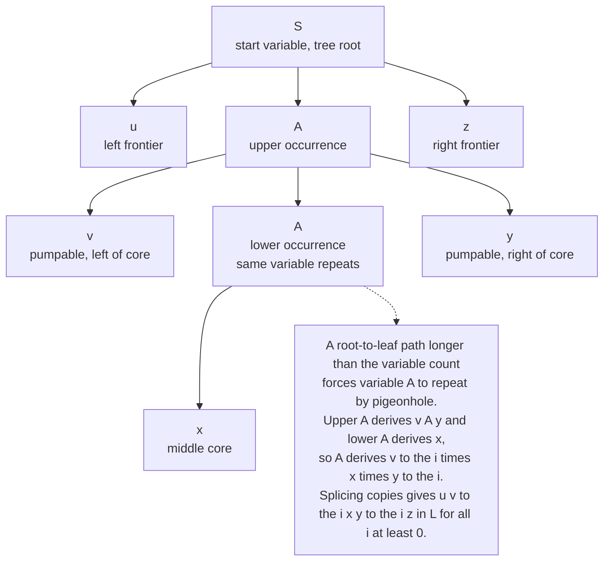

# 🌳 The Pumping Lemma for Context-Free Languages

> [!abstract] TL;DR
> A pushdown automaton has exactly **one stack**, so it can match **one** pair of quantities (all the $a$'s against all the $b$'s) but cannot simultaneously enforce a **three-way** equality — which is why $\{a^n b^n : n \ge 0\}$ is context-free but $\{a^n b^n c^n : n \ge 0\}$ is not. The **pumping lemma for context-free languages** turns this into proof: every CFL has a pumping length $p$ such that any string $s$ with $|s| \ge p$ splits into **five** parts $s = uvxyz$ with $vy$ non-empty, $|vxy| \le p$, and $uv^i x y^i z \in L$ for **all** $i \ge 0$. The signature is **two** pumpable substrings, $v$ and $y$, that must be pumped *together* — versus the single loop of the regular pumping lemma. It comes from the parse tree: a long enough string forces a **repeated nonterminal** on some root-to-leaf path, and the sub-derivation between the two copies is what you pump.

---

## Intuition

**Analogy — the librarian with one loop of tape.** Imagine a librarian who must verify a shelving rule by threading a single loop of tape through the books. To check that the number of red books equals the number of blue books, she lets out one centimetre of tape per red book, then reels it back in one centimetre per blue book — if the tape ends exactly where it started, the counts matched. This works beautifully for **two** quantities. But now demand that red, blue, *and* green counts all be equal. The moment she reels the tape back in matching blues against reds, the red count is *consumed* — the tape is back to zero and remembers nothing. She has no second loop of tape left to also check the greens. **One loop can bind two things together, never three.**

A **pushdown automaton** is exactly that librarian, and the loop of tape is its single **stack**. Push a symbol per $a$, pop one per $b$: $a^n b^n$ is trivial. But matching $b$'s against $a$'s empties the stack, leaving nothing to count the $c$'s — so $a^n b^n c^n$ is beyond reach. The pumping lemma is the formal fingerprint of this limitation. And its mechanism is a **tall parse tree**: if a string is long enough, its parse tree must be tall enough that some nonterminal *repeats* on a path from root to leaf. That repeated nonterminal hands you **two** pumpable pieces — one on each side of the sub-tree between the repeats — that grow in lockstep. Where the regular lemma pumps one loop, the context-free lemma pumps two, together.

---

## How It Works

### Core Mechanics

**1. Why one stack tops out at *two* quantities.** A pushdown automaton is a finite-state control plus a single unbounded stack. A stack is a *last-in-first-out* memory: you can compare one incoming quantity against what you have stored, but the act of comparing *destroys* what was stored. So a PDA can enforce **one** matching constraint. It verifies $a^n b^n$ (push on $a$, pop on $b$) or nested brackets (push open, pop close), but $a^n b^n c^n$ needs two *independent* counts held at once — first $a$ against $b$, then $b$ against $c$ — and a single stack cannot do that. Add a **second** stack, or an unbounded read-write **tape**, and it becomes easy: a Turing machine crosses off one $a$, one $b$, one $c$ per pass. That is why $a^n b^n c^n$ sits one full rung up the Chomsky hierarchy, in the **context-sensitive** languages (recognized by a linear-bounded automaton), not the context-free ones.

**2. The parse-tree / pigeonhole argument (where the lemma comes from).** Take any context-free grammar for $L$ and put it in **Chomsky Normal Form** (every rule is $A \to BC$ or $A \to a$), so its parse trees are binary. If the grammar has $b$ variables (nonterminals), any parse tree whose *frontier* (yield) is longer than $2^{b}$ symbols must have **height greater than $b$** — a binary tree of height $h$ has at most $2^{h}$ leaves. A path of length greater than $b$ passes through more than $b$ variable-labelled nodes, so by the **pigeonhole principle** some variable $A$ **repeats** on that path.

**3. The repeat gives two pumpable pieces.** Look at the two occurrences of $A$: an upper one and a lower one on the same path.

- The subtree rooted at the **upper** $A$ derives a substring $vxy$.
- The subtree rooted at the **lower** $A$ derives the middle substring $x$.
- Everything to the left of the path is $u$; everything to the right is $z$.

So the full string is $s = uvxyz$, and crucially $A \Rightarrow^{*} v\,A\,y$ (upper derives lower with $v$ on the left, $y$ on the right) while $A \Rightarrow^{*} x$. You can now **splice**: repeat the upper derivation to get $A \Rightarrow^{*} v^i A y^i \Rightarrow^{*} v^i x y^i$ for any $i \ge 1$, or excise it ($i = 0$) by grafting the lower subtree directly where the upper $A$ was. Every splice is a legal derivation, so $uv^i x y^i z \in L$ for all $i \ge 0$.

**4. The formal statement.** If $L$ is context-free, there is a **pumping length** $p \ge 1$ (take $p = 2^{b}+1$ for a CNF grammar with $b$ variables) such that every $s \in L$ with $|s| \ge p$ can be written $s = uvxyz$ with:

- $|vy| \ge 1$ &nbsp;— $v$ and $y$ are not *both* empty (at least one piece is pumpable);
- $|vxy| \le p$ &nbsp;— the pumped region plus core is confined to a window of $p$ consecutive symbols;
- $uv^i x y^i z \in L$ for **all** $i \ge 0$.

> [!note] Naming conventions
> This note follows Sipser's $s = uvxyz$ (full string $s$; pumpable pieces $v$ and $y$; core $x$). Hopcroft–Ullman instead write the full string as $z = uvwxy$, with the pumpable pieces $v$ and $x$. Same lemma, relabelled letters — do not confuse the outer string's name with the fifth piece.

**5. Contrast with the regular pumping lemma.** The regular version (see [[Non_Regular_Languages_and_the_Pumping_Lemma]]) pumps **one** loop $y$ inside $s = xyz$ with $|xy| \le p$. The context-free version pumps **two** substrings $v$ and $y$ *simultaneously* inside $s = uvxyz$ with $|vxy| \le p$. The extra pumped piece is the whole difference between a finite automaton's single loop of states and a PDA's two-sided parse-tree recursion.

**6. Using it to prove non-context-freeness — the adversary game.** As with the regular lemma, the quantifier structure $\exists p\ \forall s\ \exists (uvxyz)\ \forall i$ is a two-player game, and the order is everything:

1. **Assume** $L$ is context-free; the adversary hands you a pumping length $p$ — you do **not** choose it.
2. **You choose** one clever string $s \in L$ with $|s| \ge p$.
3. The **adversary chooses** any split $s = uvxyz$ obeying $|vy| \ge 1$ and $|vxy| \le p$.
4. **You choose** a pump count $i$ (usually $i = 2$ or $i = 0$) that kicks $uv^i x y^i z$ **out of** $L$ — for *every* legal split.
5. That contradicts the lemma, so $L$ is **not** context-free.

Your leverage is the clamp $|vxy| \le p$: the pumped window spans at most $p$ consecutive symbols, so on $s = a^p b^p c^p$ it can touch **at most two** of the three blocks — it can never reach from the $a$'s, across a full block of $p$ $b$'s, into the $c$'s. Pumping therefore changes at most two symbol counts and leaves the third fixed, breaking the three-way balance.

### Flow / Architecture



---

## Key Concepts

### Secondary Level — the plain idea

- A pushdown automaton is a finite machine plus **one stack** — a single loop of scratch memory it can push onto and pop from.
- One stack lets you bind **two** quantities together: count the $a$'s onto the stack, then cancel them one-for-one against the $b$'s. That is exactly why $a^n b^n$ and balanced brackets are easy.
- It **cannot** bind **three** quantities. Once the $a$'s have been cancelled against the $b$'s the stack is empty, so there is nothing left to check the $c$'s against — $a^n b^n c^n$ is impossible with a single stack.
- Poster-child non-context-free languages: three-way equality $a^n b^n c^n$; the **copy language** $\{ww\}$ ("say a word, then say the *same* word again"); the perfect squares $a^{n^2}$; and equal counts of $a$'s, $b$'s, and $c$'s.

### Undergraduate Level — the formal tool

- **Statement:** every context-free $L$ has a length $p$ so that any $s \in L$ with $|s| \ge p$ splits as $s = uvxyz$ with $|vy| \ge 1$, $|vxy| \le p$, and $uv^i x y^i z \in L$ for all $i \ge 0$.
- **Two loops, not one:** $v$ and $y$ are pumped **together** and in lockstep. This is the structural signature separating CFLs from regular languages, where a single loop $y$ is pumped.
- **The window clamp $|vxy| \le p$** is your main weapon: it pins the whole pumped region into one span of at most $p$ symbols, so on a string built from three equal blocks it can straddle at most two of them.
- **Case analysis on where $v$ and $y$ land.** For $s = a^p b^p c^p$ two cases cover everything: (a) $v$ and $y$ each lie **within a single block** — then pumping changes one or two block-counts but leaves at least one block untouched, breaking equality; (b) $v$ or $y$ **straddles a boundary** (e.g. contains both $a$ and $b$) — then pumping to $i = 2$ produces symbols **out of order** like $\ldots ab ab \ldots$, leaving $a^{*}b^{*}c^{*}$ entirely.
- **Worked non-context-free examples:**
  - $\{a^n b^n c^n\}$ — pick $s = a^p b^p c^p$; the window touches $\le 2$ blocks, so pumping unbalances the third.
  - $\{ww : w \in \{a,b\}^{*}\}$ (the copy language) — pick $s = a^p b^p a^p b^p$; no legal split can preserve the two-halves-identical structure.
  - $\{a^{n^2}\}$ — pick $s = a^{p^2}$; pumping adds $d$ symbols with $1 \le d \le p$, landing strictly **between** consecutive squares $p^2$ and $(p+1)^2$, so the length is no longer a perfect square.
  - $\{w : \#_a(w) = \#_b(w) = \#_c(w)\}$ — reduce it to $a^n b^n c^n$ by **intersecting with the regular language** $a^{*}b^{*}c^{*}$ (see the intersection technique below).

### Graduate Level — the exact boundary and stronger tools

- **Necessary, not sufficient.** Passing the pumping lemma does **not** prove context-freeness — there exist non-CFLs that satisfy the pumping condition. Unlike the regular case, where the Myhill–Nerode theorem gives a clean necessary-*and*-sufficient test (see [[Regular_Expressions_and_Kleenes_Theorem]] and the minimal-DFA characterization), **CFLs have no comparably simple decidable characterization** — many basic questions about CFLs (equivalence, universality) are undecidable.
- **Ogden's lemma — the stronger version.** Ogden (1968) strengthens the pumping lemma by letting you **mark** at least $p$ *distinguished positions* in $s$; the guarantee becomes: at least one of $v, y$ contains a marked position, and $vxy$ contains at most $p$ marked positions. Marking lets you steer the adversary's split away from "escape hatch" symbols. The canonical language it settles is
  $$L = \{\, a^i b^j c^k d^l : i = 0 \ \text{or}\ j = k = l \,\}.$$
  The **standard** pumping lemma fails here: given any $s$ with $i \ge 1$, the adversary can pump *within the $a$-block*, and pumping down to $i = 0$ lands in the unconstrained branch, so no contradiction ever appears. Ogden's lemma lets you **mark only the $b$, $c$, $d$ positions**, forcing $v$ and $y$ into that region, where pumping breaks $j = k = l$. Ogden's lemma is also the standard tool for proving **inherent ambiguity** (e.g. $\{a^i b^j c^k : i = j\ \text{or}\ j = k\}$ is context-free but *every* grammar for it is ambiguous).
- **The intersection-with-regular technique.** CFLs are **not** closed under intersection (e.g. $\{a^n b^n c^m\} \cap \{a^m b^n c^n\} = \{a^n b^n c^n\}$ — both are context-free, their intersection is not) nor under complement. But CFLs **are** closed under **intersection with a regular language** (product-construct a PDA against a DFA). This makes "$L \cap R$" a workhorse: to show a messy $L$ is not context-free, intersect it with a regular $R$ to expose a clean known non-CFL. Example: $\{w : \#_a = \#_b = \#_c\} \cap a^{*}b^{*}c^{*} = \{a^n b^n c^n\}$, which is not context-free — so the original is not either.
- **Where the boundary leads.** The moment you need to enforce two independent unbounded counts, a single stack is insufficient: a **second stack** (equivalently, an unbounded tape) yields a Turing machine, and the length-bounded tape of a **linear-bounded automaton** already suffices for $a^n b^n c^n$. This is the exact hand-off from context-free to context-sensitive in the Chomsky hierarchy of [[Theory_of_Computation_Overview]].

---

## Python Demo

```python
# Why a^n b^n c^n is NOT context-free: the TWO-substring pumping argument, made concrete.
#
# The CFL pumping lemma splits a long string s = u v x y z and pumps v and y TOGETHER:
#     s_i = u v^i x y^i z   must stay in L for all i >= 0   (IF L were context-free).
# The clamp |v x y| <= p forces the pumped "window" v x y to be a CONTIGUOUS span of
# length <= p. On s = a^p b^p c^p (length 3p) such a window can overlap AT MOST TWO of the
# three equal blocks -- it can never reach from the a's, across a full block of p b's,
# into the c's. Whatever v and y add, at least ONE symbol count is left untouched, so
# pumping (any i != 1) breaks the three-way equality  #a = #b = #c.  Contradiction => not CFL.
#
# numpy / matplotlib only (re and str are Python stdlib).

import re
import numpy as np
import matplotlib.pyplot as plt

p = 6                                   # any pumping length; a small concrete one for display
s = "a" * p + "b" * p + "c" * p         # the adversary's string  a^p b^p c^p
ORDERED = re.compile("a*b*c*")          # membership needs the a* b* c* shape too

print(f"s = a^{p} b^{p} c^{p}   (length {len(s)})   need  #a = #b = #c  after pumping\n")

def in_L(t):
    """Membership in {a^n b^n c^n}: ordered as a* b* c* AND all three counts equal."""
    na, nb, nc = t.count("a"), t.count("b"), t.count("c")
    return ORDERED.fullmatch(t) is not None and na == nb == nc

def pump(dec, i):
    u, v, x, y, z = dec
    return u + v * i + x + y * i + z

# Representative ADVERSARY-LEGAL decompositions of s (|vy| >= 1 and |vxy| <= p).
# Every window v x y below touches AT MOST TWO of the three blocks -- that is the crux.
decomps = {
    "v,y inside a-block":          ("a" * (p - 2), "a", "",  "a", "b" * p + "c" * p),
    "v in a, y in b (a|b border)": ("a" * (p - 1), "a", "",  "b", "b" * (p - 1) + "c" * p),
    "v,y inside b-block":          ("a" * p + "b" * (p - 2), "b", "", "b", "c" * p),
    "v in b, y in c (b|c border)": ("a" * p + "b" * (p - 1), "b", "", "c", "c" * (p - 1)),
    "v straddles a|b (disorders)": ("a" * (p - 1), "ab", "", "", "b" * (p - 1) + "c" * p),
}

# ---- Print the failure table: only i = 1 (the original string) is ever in L ----
print(f"{'decomposition':<30}{'|vxy|':>6}   "
      f"{'i=0 (#a,#b,#c)':>16}{'i=2 (#a,#b,#c)':>16}   {'pumps in L?'}")
print("-" * 92)
for name, dec in decomps.items():
    u, v, x, y, z = dec
    assert u + v + x + y + z == s,               f"{name}: does not reconstruct s"
    assert len(v) + len(y) >= 1,                 f"{name}: v and y both empty"
    assert len(v + x + y) <= p,                  f"{name}: window longer than p"
    c0 = pump(dec, 0); c2 = pump(dec, 2)
    trip = lambda t: f"({t.count('a')},{t.count('b')},{t.count('c')})"
    survives = all(in_L(pump(dec, i)) for i in range(0, 4))   # any i != 1 must fail
    print(f"{name:<30}{len(v + x + y):>6}   {trip(c0):>16}{trip(c2):>16}"
          f"   {'YES' if survives else 'NO  <-- leaves L'}")

# ---- Figure: counts diverge under pumping + windows touch at most two blocks ----
fig, axes = plt.subplots(2, 3, figsize=(15, 8))
fig.suptitle(r"Pumping $a^p b^p c^p$: two substrings $v,y$ cannot keep all three counts equal",
             fontsize=13, fontweight="bold")
I = np.arange(0, 5)

for ax, (name, dec) in zip(axes.flat, decomps.items()):
    na = np.array([pump(dec, i).count("a") for i in I])
    nb = np.array([pump(dec, i).count("b") for i in I])
    nc = np.array([pump(dec, i).count("c") for i in I])
    ax.plot(I, na, "o-", color="#d62728", label="#a")
    ax.plot(I, nb, "s-", color="#1f77b4", label="#b")
    ax.plot(I, nc, "^-", color="#2ca02c", label="#c")
    ax.axvline(1, ls=":", color="gray")
    ax.text(1, ax.get_ylim()[1], " i=1: s itself", fontsize=7, va="top", color="gray")
    ax.set_title(name, fontsize=9, fontweight="bold")
    ax.set_xlabel("pump count  i")
    ax.set_ylabel("symbol count")
    ax.legend(fontsize=7, loc="upper left")
    ax.grid(alpha=0.3)

# Last panel: how many DISTINCT block-types a window of length p covers, per start position.
ax = axes.flat[-1]
block = np.array([0] * p + [1] * p + [2] * p)     # 0=a-region, 1=b-region, 2=c-region
starts = np.arange(0, len(s) - p + 1)
distinct = [len(set(block[st:st + p])) for st in starts]
ax.bar(starts, distinct, color="#9467bd", edgecolor="black")
ax.axhline(2, ls="--", color="crimson", lw=1.5, label="hard ceiling = 2 blocks")
ax.set_ylim(0, 3)
ax.set_title(f"A window of length p={p} touches at most 2 blocks", fontsize=9, fontweight="bold")
ax.set_xlabel("window start position in s")
ax.set_ylabel("distinct block-types covered")
ax.legend(fontsize=7)
ax.grid(alpha=0.3, axis="y")

plt.tight_layout()
plt.savefig("cfl_pumping_anbncn.png", dpi=130)
plt.show()
print("\nSaved figure: cfl_pumping_anbncn.png")
print("\nConclusion: every legal split leaves L for some i (only i=1 survives), and no window "
      "of length <= p reaches all three blocks. Hence a^n b^n c^n is NOT context-free.")
```

**Expected output:**
```
s = a^6 b^6 c^6   (length 18)   need  #a = #b = #c  after pumping

decomposition                  |vxy|      i=0 (#a,#b,#c)  i=2 (#a,#b,#c)   pumps in L?
--------------------------------------------------------------------------------------------
v,y inside a-block                  2          (4,6,6)         (8,6,6)   NO  <-- leaves L
v in a, y in b (a|b border)         2          (5,5,6)         (7,7,6)   NO  <-- leaves L
v,y inside b-block                  2          (6,4,6)         (6,8,6)   NO  <-- leaves L
v in b, y in c (b|c border)         2          (6,5,5)         (6,7,7)   NO  <-- leaves L
v straddles a|b (disorders)         2          (5,5,6)         (7,7,6)   NO  <-- leaves L
```

Every adversary-legal split fails: pumping down ($i=0$) or up ($i=2$) always leaves at least one of $\#a, \#b, \#c$ behind, and the straddling split additionally scrambles the $a^{*}b^{*}c^{*}$ order. The final bar chart shows the geometric heart of the proof — no window of length $p$ ever covers all three blocks, so the two pumped pieces can never touch every symbol type at once.

---

## Real-World Applications

> **Example — the wall every compiler hits between syntax and semantics.** A programming language's *nesting* structure — balanced braces, matched parentheses, `if`/`end` pairing, arithmetic precedence — is context-free, so a compiler's **parser** (a pushdown machine built from a CFG via Yacc, Bison, ANTLR, or recursive descent) handles it in $O(n)$ to $O(n^3)$ time. But two staples of real languages are **provably not context-free**: (1) *declaration-before-use* — an identifier must be declared earlier in scope, which is essentially the copy language $\{ww\}$ ("this identifier is the *same* string as one seen before"), and (2) *type checking* / arity agreement, which the pumping lemma rules out for a grammar just as it rules out $a^n b^n c^n$. This is exactly why compilers add a **semantic analysis** phase — symbol tables, scope resolution, attribute grammars — *on top of* the context-free parser. The grammar cannot express these constraints; the pumping lemma is the formal reason.

Beyond compilers:

- **Natural language exceeds context-free.** **Cross-serial dependencies** in Swiss German and Dutch subordinate clauses (verbs and their objects interleaved as $a_1 a_2 \ldots b_1 b_2 \ldots$ rather than nested) form patterns like $\{a^m b^n c^m d^n\}$ that no CFG can generate. This was a landmark result (Shieber, 1985) showing some human languages are literally beyond the power of context-free grammars, motivating **mildly context-sensitive** formalisms — Tree-Adjoining Grammars and Combinatory Categorial Grammars — used in modern parsers. See [[Phrase_Structure_Grammar]] and [[Syntactic_Theory_and_Generative_Grammar]].
- **XML / JSON and markup validation.** Matching arbitrarily nested tags is context-free and a PDA handles it, but *cross-references* and *uniqueness* constraints (an `ID` attribute must be unique document-wide, or must match a referenced `IDREF`) are the copy-language pattern again — beyond CFG, which is why schema languages (XSD, RELAX NG) bolt on extra machinery.
- **RNA secondary structure in bioinformatics.** Nested base-pairing (stems and loops) is context-free and is modelled with stochastic CFGs, but **pseudoknots** — *crossing* base pairs, structurally the $\{a^m b^n c^m d^n\}$ pattern — are non-context-free and require beyond-CF grammars, a direct biological instance of the two-independent-counts barrier.

---

## Common Pitfalls

- **Pumping only one substring.** The commonest error: treating this like the regular lemma and pumping a single piece. The CFL lemma pumps **both** $v$ and $y$ together — a proof that only varies one of them is incomplete and usually wrong.
- **Ignoring the $|vxy| \le p$ clamp.** This window constraint is what *forces* $v$ and $y$ to touch at most two of three blocks. Skip it and the adversary could (illegally) spread $v$ and $y$ across all three blocks and appear to pump successfully. It is your single most important lever.
- **Assuming $v$, $x$, $y$ each sit neatly inside one block.** A legal $v$ or $y$ can **straddle a boundary** and contain mixed symbols (e.g. `ab`). You must handle that case too — usually it is the *easiest* to kill, because pumping to $i = 2$ scrambles the required $a^{*}b^{*}c^{*}$ order.
- **Treating the lemma as sufficient.** It is **necessary only**. A language can satisfy the pumping condition and still fail to be context-free — which is precisely why **Ogden's lemma** and the intersection-with-regular technique exist.
- **Misusing closure properties.** CFLs are **not** closed under intersection or complement — only under **intersection with a regular language**, union, concatenation, and Kleene star. Trying to "intersect two CFLs" to build a proof is invalid; intersect a CFL with a *regular* language instead.
- **Getting the quantifier order backwards.** As in the regular lemma, you do **not** choose $p$ and you do **not** choose the split $uvxyz$ — the adversary does. You choose only the *string* $s$ and the *pump count* $i$. Swapping who chooses what yields a vacuous "proof."
- **Thinking $a^n b^n c^n$ needs a full Turing machine.** It does not — it is **context-sensitive**, recognized by a linear-bounded automaton (or a two-stack PDA). "Not context-free" means "one stack is not enough," not "uncomputable."

---

## Related Concepts

- [[Non_Regular_Languages_and_the_Pumping_Lemma]] — the regular-language sibling of this lemma; the crisp contrast is **one** pumped loop $y$ (finite-state repetition) versus **two** pumped substrings $v, y$ (parse-tree recursion). Read them together.
- [[Theory_of_Computation_Overview]] — situates this result in the Chomsky hierarchy: failing the CFL pumping lemma pushes a language up to **context-sensitive** (linear-bounded automaton) or beyond.
- [[Finite_Automata_DFA_and_NFA]] — a pushdown automaton is exactly a finite automaton *plus one stack*; understanding the finite-memory limit first makes the "one extra stack, one extra matched quantity" jump obvious.
- [[Regular_Expressions_and_Kleenes_Theorem]] — regular languages are a strict subset of CFLs, and their closure under intersection is what powers the **intersection-with-regular** proof technique used here.
- [[Myhill_Nerode_and_DFA_Minimization]] — the *complete* necessary-and-sufficient characterization that regular languages enjoy; CFLs have **no** comparably simple one, which is why the pumping lemma is only necessary and Ogden's lemma is needed.
- [[Phrase_Structure_Grammar]] — context-free grammars *are* linguists' phrase-structure grammars; the parse trees pumped in this proof are the same constituency trees, and cross-serial dependencies are where natural language escapes context-freeness.
- [[Syntactic_Theory_and_Generative_Grammar]] — Chomsky's grammar hierarchy originates here; the fact that some human languages exceed context-free power is a direct application of these non-CF results.

---

## Review Questions

**Secondary (conceptual):**
1. Using the "one loop of tape" / single-stack picture, explain in one or two sentences why a pushdown automaton can verify that a string has equal numbers of $a$'s and $b$'s but cannot verify equal numbers of $a$'s, $b$'s, **and** $c$'s.

**Undergraduate (application):**
2. Use the pumping lemma to prove $L = \{a^n b^n c^n : n \ge 0\}$ is not context-free. State who chooses $p$, which string $s$ you pick, why $|vxy| \le p$ is essential, and the two cases (both pieces inside one block vs. a piece straddling a boundary) and which pump count $i$ delivers the contradiction in each.
3. Prove $\{w \in \{a,b,c\}^{*} : \#_a(w) = \#_b(w) = \#_c(w)\}$ is not context-free **without** pumping it directly. Which regular language do you intersect it with, why is that step legal, and what known non-CFL does it reduce to?

**Graduate (analysis):**
4. The language $L = \{a^i b^j c^k d^l : i = 0 \ \text{or}\ j = k = l\}$ **satisfies** the ordinary context-free pumping lemma yet is not context-free. First explain why the standard lemma fails to refute it (hint: consider pumping inside the $a$-block and the effect of pumping down to $i = 0$). Then describe precisely how **Ogden's lemma** — by marking positions — repairs the argument, and state which positions you would mark.

---

## Sources

- Sipser, M. *Introduction to the Theory of Computation*, 3rd ed. (Cengage, 2013) — §2.3, "Non-Context-Free Languages": the $s = uvxyz$ statement, the parse-tree proof, and the $a^n b^n c^n$ and $\{ww\}$ examples.
- Hopcroft, J., Motwani, R., & Ullman, J. *Introduction to Automata Theory, Languages, and Computation*, 3rd ed. (Pearson, 2006) — §7.2, the pumping lemma for CFLs, closure properties, and the intersection-with-regular technique.
- Bar-Hillel, Y., Perles, M., & Shamir, E. (1961). "On formal properties of simple phrase structure grammars." *Zeitschrift für Phonetik, Sprachwissenschaft und Kommunikationsforschung* 14, 143–172 — the original source of the lemma (hence "Bar-Hillel lemma").
- Ogden, W. (1968). "A helpful result for proving inherent ambiguity." *Mathematical Systems Theory* 2(3), 191–194 — the marked-position strengthening.
- Shieber, S. (1985). "Evidence against the context-freeness of natural language." *Linguistics and Philosophy* 8(3), 333–343 — Swiss German cross-serial dependencies.
- [Wikipedia — Pumping lemma for context-free languages](https://en.wikipedia.org/wiki/Pumping_lemma_for_context-free_languages)
- [Wikipedia — Ogden's lemma](https://en.wikipedia.org/wiki/Ogden%27s_lemma)

---

#theory-of-computation #pumping-lemma #context-free-languages #non-context-free #parse-trees
