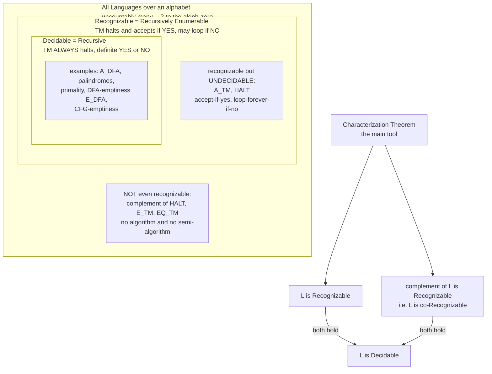

# 🧮 Decidability and Recognizability

> [!abstract] TL;DR
> Once you fix a model of computation (the Turing machine), you can sort every possible problem — every **language** — by *what a machine can do with it*. A language is **decidable** (a.k.a. *recursive*) if some Turing machine **always halts** and answers **yes or no** correctly — a genuine algorithm, a decision procedure. It is **recognizable** (a.k.a. *recursively enumerable*, *semi-decidable*) if some machine **halts and accepts** when the answer is yes, but is *allowed to loop forever* when the answer is no — you can confirm membership but not necessarily non-membership. The load-bearing theorem: **a language is decidable if and only if both it *and* its complement are recognizable** (`decidable = recognizable + co-recognizable`). The classes form a *strict* tower — `decidable ⊊ recognizable ⊊ all languages` — and a simple counting argument shows the tower is nearly empty at the top: there are only **countably many** programs but **uncountably many** languages, so *most problems have no algorithm at all — most are not even recognizable*.

---

## Intuition

**Analogy — a search for buried treasure with no map.** Imagine an island where treasure *might* be buried somewhere, and you have a shovel but no map telling you whether treasure exists.

- **Recognizable (semi-decidable) = keep digging.** You dig hole after hole, spiralling outward. *If* the treasure is really there, you will eventually hit it and shout "**Yes! Found it!**" — you halt and accept. But if there is **no** treasure, you never get to shout "there is none"; you just keep digging forever. Your procedure confirms a *yes*, but can never confirm a *no*.
- **Decidable = a machine that always gives a verdict.** Now suppose you also own a magic detector that, after a *guaranteed finite* sweep, prints **"treasure present"** or **"no treasure"** and switches off. This detector is a *decision procedure*: it **always halts** with the correct yes-or-no. Every question it answers, it answers *both* ways.

The whole subject is the gap between these two: the searcher who can only ever confirm a *yes*, versus the algorithm that always returns a definite *yes or no*. The astonishing fact — via the halting problem — is that some perfectly precise questions genuinely have only a searcher, never a detector.

---

## How It Works

### The setup: problems as languages

Fix a finite alphabet $\Sigma$ (say `{0,1}`). A **string** is a finite sequence of symbols, and a **language** $L \subseteq \Sigma^*$ is just a set of strings — equivalently, a yes/no problem ("is string $w$ in $L$?"). Because every input, program, graph, or number can be *encoded* as a string, this covers **every** decision problem uniformly. A Turing machine $M$ on input $w$ can do one of three things: **accept** (halt in $q_{accept}$), **reject** (halt in $q_{reject}$), or **loop** (never halt). That third possibility — looping — is the entire source of the distinction below (see `Turing_Machines_and_the_Church_Turing_Thesis`).

### Decidable (recursive) languages

$L$ is **decidable** if some Turing machine $M$ is a *decider* for it: on **every** input $M$ **halts**, and

- accepts $w$ if $w \in L$,
- rejects $w$ if $w \notin L$.

A decider is a **total algorithm** — a decision procedure with no infinite loops. These are the problems we can genuinely *solve*: primality, whether a DFA accepts a string, whether two regular expressions are equivalent, whether a context-free grammar is empty. If you can write a program that is *guaranteed to terminate* with the right yes/no, the language is decidable.

### Recognizable (recursively enumerable / semi-decidable) languages

$L$ is **recognizable** if some Turing machine $M$ is a *recognizer* for it: 

- if $w \in L$, then $M$ **halts and accepts** $w$;
- if $w \notin L$, then $M$ **either rejects or loops forever** (it is *not required* to halt).

So a recognizer confirms **membership** but may be silent (looping) on **non-membership**. The name *recursively enumerable* comes from an equivalent picture: $L$ is recognizable **iff** there is an **enumerator** — a machine that, left running forever, **prints out exactly the strings of $L$** (in any order, possibly with repeats). To recognize $w$, run the enumerator and accept the moment $w$ appears; if $w \notin L$ it simply never appears and you wait forever. *Recognizable = enumerable = semi-decidable* are three names for the same class.

> [!note] Decidable is a strengthening, not a different flavor
> Every decidable language is recognizable — a decider *is* a recognizer that also happens to halt on the *no* cases. The interesting question is always the *converse*: when can a recognizer be upgraded to a decider? Not always — and the halting problem is the proof.

### The characterization theorem (the key tool)

> **Theorem.** $L$ is **decidable** if and only if **both $L$ and its complement $\overline{L}$ are recognizable.**

**Why (⇐, the useful direction).** Suppose $M_1$ recognizes $L$ and $M_2$ recognizes $\overline{L}$. Build a decider that runs $M_1$ and $M_2$ **in parallel** (dovetailing — one step of each, alternating). Every string is in exactly one of $L$ or $\overline{L}$, so *one* of the two machines is *guaranteed* to halt-and-accept eventually. When $M_1$ accepts, **accept**; when $M_2$ accepts, **reject**. This composite machine **always halts** — a decider. Hence $L$ is decidable.

**Why (⇒).** If $L$ is decidable it is recognizable (a decider is a recognizer). Swapping accept/reject on the decider gives a decider — hence recognizer — for $\overline{L}$. So both are recognizable. $\blacksquare$

This is the single most important lever for **proving undecidability**: to show a recognizable language $L$ is **not** decidable, it suffices to show its **complement is not recognizable**. The halting problem $HALT$ is recognizable (just simulate); its complement is *not* recognizable; therefore $HALT$ is undecidable (see `The_Halting_Problem_and_Undecidability`).

### The strict hierarchy and the co-recognizable class

$$\text{Decidable} \;\subsetneq\; \text{Recognizable} \;\subsetneq\; \text{All Languages}$$

Both inclusions are **proper**:

- **Recognizable but not decidable:** the halting problem / the acceptance language $A_{TM} = \{\langle M, w\rangle : M \text{ accepts } w\}$. A recognizer just *simulates* $M$ on $w$; but no machine can always *decide* it.
- **Not even recognizable:** $\overline{A_{TM}}$ and $\overline{HALT}$. By the theorem, if these were recognizable then $A_{TM}$ would be decidable — contradiction. Other non-r.e. examples: $E_{TM} = \{\langle M\rangle : L(M) = \varnothing\}$ (does a machine accept *nothing*?) and $EQ_{TM}$ (do two machines recognize the same language?).

A language whose **complement is recognizable** is called **co-recognizable** (co-r.e.). The theorem then reads crisply: **decidable = recognizable ∩ co-recognizable**.

### Closure properties (a fingerprint of each class)

| Operation | Decidable (recursive) | Recognizable (r.e.) |
|---|---|---|
| Union | ✅ closed | ✅ closed |
| Intersection | ✅ closed | ✅ closed |
| Concatenation | ✅ closed | ✅ closed |
| Kleene star | ✅ closed | ✅ closed |
| **Complement** | ✅ closed | ❌ **NOT closed** |

Deciders close under complement by *swapping accept and reject* (safe, since they always halt). Recognizers **cannot** do this: swapping a looping branch does not turn it into a rejecting branch. In fact, *if* the recognizable class were closed under complement, then every recognizable language would be co-recognizable too, making every recognizable language decidable — which would collapse the hierarchy and refute the halting problem. The failure of complement-closure for r.e. languages **is** the strict hierarchy, viewed from a different angle.

### The counting argument — most languages are unrecognizable

Here is the humbling punchline, and it needs no simulation, only cardinality (see [[Set_Theory_and_Relations]] and [[Mathematical_Logic_and_Set_Theory]]):

1. **Programs are countable.** Every Turing machine / program is a *finite* string over a finite alphabet. The set of finite strings is **countably infinite** ($\aleph_0$). So there are only **countably many** Turing machines, hence at most countably many recognizable languages.
2. **Languages are uncountable.** A language over $\{0,1\}$ is a *subset* of the countably-infinite set $\Sigma^*$. By **Cantor's diagonal argument**, the set of all such subsets is **uncountable** ($2^{\aleph_0}$) — strictly bigger than countable.
3. **Therefore** the recognizable languages are a *vanishingly thin* countable sliver inside an uncountable ocean. **Almost every language is not recognizable at all** — most yes/no problems have *no algorithm and not even a semi-algorithm*. The languages we can compute with are the rare exceptions.

### Flow / Architecture



---

## Key Concepts

**Secondary (the plain-English core).**
- A **decidable** problem has an algorithm that *always finishes* and says yes or no.
- A **recognizable** problem has a searcher that *confirms a yes* but may run forever on a no.
- Some precise questions (does this program halt?) have a searcher but *provably no* always-finishing algorithm.
- There are far more problems than programs, so *most* problems cannot be solved by any program.

**Undergraduate (the formal machinery).**
- **Decidable / recursive**: a **decider** halts on all inputs with correct accept/reject.
- **Recognizable / recursively enumerable / semi-decidable**: a **recognizer** accepts all members; may loop on non-members. Equivalent to the existence of an **enumerator**.
- The **characterization theorem**: $L$ decidable $\iff$ $L$ and $\overline{L}$ both recognizable; proof by **dovetailing** two recognizers in parallel.
- **Co-recognizable** ($\overline{L}$ is r.e.); **decidable = r.e. ∩ co-r.e.**
- **Strict hierarchy** decidable $\subsetneq$ recognizable $\subsetneq$ all, with $HALT$ / $A_{TM}$ as the recognizable-undecidable witness and $\overline{HALT}$ as the non-recognizable witness.
- **Closure**: deciders close under $\cup, \cap, \overline{\phantom{x}}, \cdot, {}^{*}$; recognizers close under all *except complement*.

**Graduate (structure and boundaries).**
- The **counting/cardinality argument**: countably many machines vs. $2^{\aleph_0}$ languages via **Cantor diagonalization** — the class of computable problems has measure-zero flavor inside all problems.
- The **arithmetical hierarchy**: decidable $= \Delta_1$, recognizable $= \Sigma_1$, co-recognizable $= \Pi_1$; higher levels ($\Sigma_2, \Pi_2, \dots$) classify problems like $E_{TM} \in \Pi_2$ and $TOT$ (totality) that live *above* the r.e. boundary — a strict, infinite tower generalizing this one.
- **Post's theorem** and **Turing reducibility**: relativizing "decidable/recognizable" to an oracle produces the **Turing degrees**; the halting problem is the first jump $\mathbf{0}'$.
- **Rice's theorem** as a mass-produced undecidability engine: *every* non-trivial semantic property of a machine's *language* is undecidable — so decidability is the exception, not the rule, among interesting questions about programs.
- **Enumerability nuance**: $L$ is decidable iff it is enumerated **in lexicographic (increasing) order**; mere enumerability (any order) gives only recognizability.

---

## Python Demo

```python
"""
Decidability vs Recognizability  (numpy + matplotlib only)
==========================================================
1. A RECOGNIZER that searches for a WITNESS: is n a sum of three integer cubes,
   n = a^3 + b^3 + c^3  with a, b, c in Z ?  The search over Z^3 is UNBOUNDED.
     - When a witness exists (e.g. n = 29 = 3^3 + 1^3 + 1^3) it is FOUND and the
       machine HALTS and ACCEPTS.
     - When no witness exists (n = 4, since n = 4 (mod 9) is provably impossible)
       the search never terminates -- we only ever observe "still searching".
   This mirrors Hilbert's 10th problem: solvability of Diophantine equations is
   RECOGNIZABLE (semi-decidable) yet UNDECIDABLE in general.

2. A DECIDABLE contrast: "is n a perfect cube?" -- a BOUNDED search that ALWAYS
   halts yes/no; plus a decidable NON-membership certificate: n = 4 or 5 (mod 9)
   proves "no three-cube sum" without any search.

3. Two visualizations:
     (A) the nested classes  Decidable  <  Recognizable  <  All languages
     (B) the counting argument: countably many programs vs uncountably many
         languages  ->  the recognizable fraction collapses to zero.
"""

import numpy as np
import matplotlib.pyplot as plt
from matplotlib.patches import Rectangle


# --------------------------------------------------------------------------
# A DECIDABLE helper: is m a perfect cube of an integer?  (bounded, halts)
# --------------------------------------------------------------------------
def integer_cube_root(m):
    """Return c with c**3 == m if m is a perfect cube, else None. Always halts."""
    r = int(round(np.cbrt(abs(float(m)))))
    for cand in (r - 1, r, r + 1):            # guard against float rounding
        if cand ** 3 == abs(m):
            return cand if m >= 0 else -cand
    return None


# --------------------------------------------------------------------------
# 1. RECOGNIZER: search expanding shells of (a, b) in Z^2, solve for c.
#    Returns (verdict, examined, witness).
#      verdict True  -> witness found, machine ACCEPTS (halts)
#      verdict None  -> hit the search cap = "still searching" (would loop)
#    The cap exists ONLY so the program terminates on screen; conceptually the
#    radius grows without bound, so a genuine 'no' instance loops FOREVER.
# --------------------------------------------------------------------------
def recognize_sum_of_three_cubes(n, max_radius):
    examined = 0
    for radius in range(0, max_radius + 1):
        for a in range(-radius, radius + 1):
            for b in range(-radius, radius + 1):
                if radius > 0 and max(abs(a), abs(b)) != radius:
                    continue                  # only test the fresh boundary shell
                examined += 1
                c = integer_cube_root(n - a ** 3 - b ** 3)
                if c is not None:
                    return True, examined, (a, b, c)
    return None, examined, None               # cap reached: no verdict yet


# --------------------------------------------------------------------------
# 2. DECIDABLE certificate of NON-membership: n = 4 or 5 (mod 9) => impossible.
# --------------------------------------------------------------------------
def decidable_no_certificate(n):
    """Returns True iff we can PROVE (in O(1)) that n is NOT a sum of 3 cubes."""
    return n % 9 in (4, 5)


# --------------------------------------------------------------------------
# 3a. Visualization: the nested language classes.
# --------------------------------------------------------------------------
def draw_class_hierarchy(ax):
    boxes = [                                  # (x, y, w, h, label, color)
        (0.02, 0.02, 0.96, 0.96, "All Languages  (uncountable)", "#f4d7da"),
        (0.10, 0.10, 0.80, 0.72, "Recognizable  (recursively enumerable)", "#fde6c9"),
        (0.20, 0.20, 0.60, 0.42, "Decidable  (recursive)", "#d6ead6"),
    ]
    for x, y, w, h, label, color in boxes:
        ax.add_patch(Rectangle((x, y), w, h, facecolor=color,
                               edgecolor="black", lw=1.8))
        ax.text(x + w / 2, y + h - 0.045, label, ha="center", va="top",
                fontsize=10, fontweight="bold")
    ax.text(0.50, 0.34, "A_DFA, primes,\npalindromes\n(always halts)",
            ha="center", va="center", fontsize=9)
    ax.text(0.50, 0.70, "HALT, A_TM\n(recognizable but UNDECIDABLE)",
            ha="center", va="center", fontsize=9, color="#8a5a00")
    ax.text(0.50, 0.90, "co-HALT, E_TM\n(NOT recognizable)",
            ha="center", va="center", fontsize=9, color="#a11")
    ax.set_xlim(0, 1); ax.set_ylim(0, 1); ax.axis("off")
    ax.set_title("Nested classes: Decidable < Recognizable < All", fontsize=11)


# --------------------------------------------------------------------------
# 3b. Visualization: the counting argument (log10 of the counts vs size k).
#     programs of <= k bits ~ 2^(k+1)          -> log10 grows LINEARLY in k
#     languages on strings of length <= k ~ 2^(2^(k+1)) -> log10 grows like 2^k
# --------------------------------------------------------------------------
def draw_counting_argument(ax):
    k = np.arange(1, 13)
    log10_programs = (k + 1) * np.log10(2.0)                 # countable growth
    log10_languages = (2.0 ** (k + 1)) * np.log10(2.0)       # doubly exponential
    ax.plot(k, log10_programs, "o-", color="#1f6feb",
            label="programs  ~ 2^(k+1)  (countable)")
    ax.plot(k, log10_languages, "s-", color="#a11",
            label="languages  ~ 2^(2^(k+1))  (uncountable)")
    ax.set_yscale("log")
    ax.set_xlabel("input size k")
    ax.set_ylabel("number of decimal digits in the count  (log10)")
    ax.set_title("Countably many programs vs uncountably many languages")
    ax.legend(loc="upper left", fontsize=8)
    ax.grid(True, ls=":", alpha=0.5)


if __name__ == "__main__":
    CAP = 60                                   # search-shell cap for the demo

    print("RECOGNIZER  L = { n : n = a^3 + b^3 + c^3 for some integers a,b,c }")
    for n in (29, 2, 17, 4, 5, 13):
        verdict, examined, witness = recognize_sum_of_three_cubes(n, CAP)
        if verdict:
            a, b, c = witness
            print(f"  n={n:>3}: ACCEPT after {examined:>5} triples  "
                  f"witness {a}^3 + {b}^3 + {c}^3 = {a**3 + b**3 + c**3}")
        else:
            cert = " (mod-9 certificate PROVES no solution)" \
                   if decidable_no_certificate(n) else ""
            print(f"  n={n:>3}: still searching after {examined:>5} triples "
                  f"-> would LOOP FOREVER{cert}")

    print("\nDECIDABLE contrast  'is n a perfect cube?'  (always halts):")
    for n in (27, 64, 30, -8):
        c = integer_cube_root(n)
        print(f"  n={n:>3}: {'YES, ' + str(c) + '^3' if c is not None else 'NO'}")

    fig, (ax1, ax2) = plt.subplots(1, 2, figsize=(13, 5.5))
    draw_class_hierarchy(ax1)
    draw_counting_argument(ax2)
    fig.suptitle("Decidability vs Recognizability", fontsize=13, fontweight="bold")
    fig.tight_layout()
    plt.show()
```

Running it prints the recognizer **accepting** every solvable `n` (with an explicit witness such as $29 = 3^3 + 1^3 + 1^3$), and **never terminating** on $n = 4, 5, 13$ — each of which the $O(1)$ **mod-9 certificate** independently proves has *no* solution, the rare case where non-membership *is* decidable. The perfect-cube contrast always halts with a clean yes/no. The left plot shows the three nested classes with the halting problem stranded in the recognizable-but-undecidable ring; the right plot shows program counts crawling upward while language counts explode **doubly-exponentially**, the visual heart of "almost every language is unrecognizable."

---

## Real-World Applications

- **The limits of static analysis and verification.** No tool can decide, for *all* programs, whether they halt, whether two functions are equivalent, whether a variable is ever `null`, or whether dead code is truly unreachable — these are undecidable (Rice's theorem). Real linters, type checkers, and model checkers therefore ship **sound-but-incomplete** approximations: they *recognize* a decidable *subset* (terminating on it) and answer "unknown" elsewhere, rather than looping.
- **Compilers and optimizers.** Whether an optimization is *always* safe often reduces to an undecidable question, so compilers use conservative decidable analyses (abstract interpretation, data-flow lattices that provably terminate) that may miss opportunities but never diverge.
- **Automated theorem proving / SMT.** First-order validity is recognizable but undecidable; a prover *enumerates* proofs and halts when it finds one (a recognizer for the theorems), but on a non-theorem it may search forever — exactly the semi-decidable pattern.
- **Type systems and decidability by design.** Language designers deliberately restrict type systems so type-checking stays **decidable** (guaranteed to terminate). Systems whose type inference is undecidable (some dependently typed or Turing-complete type layers) can hang the compiler — a practical consequence of crossing the boundary.
- **Security and malware analysis.** "Does this binary ever exhibit malicious behavior?" is undecidable in general, so scanners rely on decidable heuristics, sandboxed bounded execution (a $k$-step recognizer), and signatures — never a complete decision procedure.

---

## Common Pitfalls

- **Confusing "recognizable" with "solvable."** Recognizable only promises *yes-detection*; it says nothing about *no*. A recognizer for the halting problem exists (just simulate) yet the problem is undecidable. Recognizable is a strictly weaker guarantee than decidable.
- **Assuming the complement of a recognizable language is recognizable.** The r.e. class is **not** closed under complement. $HALT$ is recognizable; $\overline{HALT}$ is *not*. This asymmetry is precisely why $HALT$ is undecidable, via the characterization theorem.
- **Thinking a loop-on-no recognizer can be "fixed" with a timeout.** Capping the search at $k$ steps yields a *decidable* language ("halts within $k$ steps"), but a **different, weaker** one — it can miss members that need more than $k$ steps. You cannot pick a single $k$ that works for all inputs; that is the whole difficulty.
- **Believing most problems are solvable because the ones we meet are.** The counting argument says the opposite: computable problems are a countable sliver among uncountably many languages. Our familiar problems are heavily selected for being nice.
- **Mixing up the two enumerations.** Enumerating a language *in any order* gives recognizability; enumerating it *in increasing/lexicographic order* gives decidability. The ordering is the entire difference.
- **Reading $E_{TM}$ (emptiness) as merely undecidable.** It is worse than undecidable — it is **not even recognizable**. "Is this machine's language empty?" cannot be semi-decided, because confirming emptiness would require ruling out acceptance on infinitely many inputs.

---

## Related Concepts

- `Turing_Machines_and_the_Church_Turing_Thesis` — the model that defines "compute"; accept/reject/**loop** is the trichotomy that makes decidable and recognizable diverge. *(sibling section note — being built out)*
- `The_Halting_Problem_and_Undecidability` — the canonical recognizable-but-undecidable language; its complement is the canonical non-recognizable one. *(sibling section note — being built out)*
- `Reductions_and_Undecidable_Problems` — the mapping-reduction toolkit that transports undecidability and non-recognizability from $HALT$ to new problems (Rice's theorem, $E_{TM}$, $EQ_{TM}$). *(sibling section note — being built out)*
- `Theory_of_Computation_Overview` — the map of models and language classes; this note sits at the computability tier above automata. *(sibling section note — being built out)*
- [[Finite_Automata_DFA_and_NFA]] — the acceptance problem $A_{DFA}$ is a clean *decidable* example (bounded simulation always halts) — the well-behaved bottom of the hierarchy.
- [[Regular_Expressions_and_Kleenes_Theorem]] — regular languages are all decidable; a concrete class living entirely inside the innermost box.
- [[Set_Theory_and_Relations]] — Cantor's **diagonal argument** and countable-vs-uncountable, the exact machinery behind "most languages are unrecognizable."
- [[Mathematical_Logic_and_Set_Theory]] — cardinals, Cantor's theorem, and Gödel incompleteness — the logical cousins of undecidability.

---

## Review Questions

1. **(Secondary)** In plain words, what is the difference between a machine that *decides* a problem and one that only *recognizes* it? Give an everyday example (like the treasure search) where you could confirm a "yes" but never confirm a "no," and explain why.
2. **(Undergraduate)** State the theorem "$L$ is decidable iff $L$ and $\overline{L}$ are both recognizable," and prove the harder direction by describing the **dovetailing** construction. Then use it to argue that if $\overline{HALT}$ were recognizable, the halting problem would be decidable.
3. **(Graduate)** (a) Explain, via cardinality, why there must exist languages that are not even recognizable — before exhibiting a single one. (b) The class $E_{TM} = \{\langle M\rangle : L(M) = \varnothing\}$ is not recognizable, whereas its complement is. Explain what asymmetry between "some input is accepted" and "no input is accepted" causes exactly one of the two to be semi-decidable, and locate both in the arithmetical hierarchy ($\Sigma_1$ vs $\Pi_2$).

---

## Sources

- Michael Sipser, *Introduction to the Theory of Computation*, 3rd ed. — Chapter 4 (Decidability) and Chapter 5 (Reducibility); the decidable-iff-both-recognizable theorem and the diagonalization/counting arguments.
- Hopcroft, Motwani, and Ullman, *Introduction to Automata Theory, Languages, and Computation*, 3rd ed. — Chapters 8-9 (recursive vs recursively enumerable languages, undecidability).
- Dexter Kozen, *Automata and Computability* — lectures on the r.e. sets, enumerators, and the arithmetical hierarchy.
- Robert I. Soare, *Turing Computability: Theory and Applications* — enumerability, Turing reducibility, and the structure of the r.e. degrees.
- Bjorn Poonen, "Hilbert's Tenth Problem over Rings of Number-Theoretic Interest" / survey work — background on why Diophantine solvability (the demo's example) is recognizable but undecidable.

---

#theory-of-computation #decidability #recursively-enumerable #recognizability #computability
