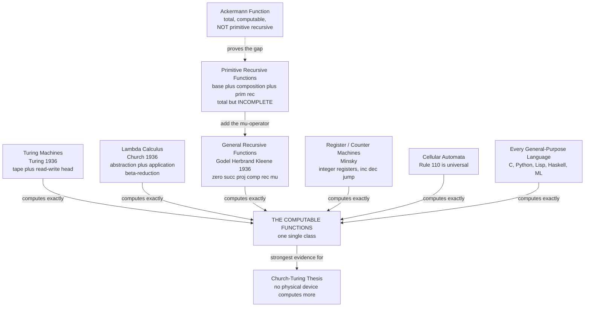

# 🧮 Recursive Functions and Lambda Calculus

> [!abstract] TL;DR
> The **Turing machine** is not the only way to define "computable." In the same year (1936), Alonzo **Church** defined computation as pure symbol substitution in the **lambda calculus**, while Gödel, Herbrand, Kleene, and Post defined it arithmetically as the **general recursive functions**. These look nothing alike — one is a tape with a moving head, one is `λx. f x`, one is `zero`, `successor`, and a minimization operator — yet all three (plus register machines, cellular automata, and every real programming language) compute **exactly the same class of functions**. That astonishing convergence is the strongest evidence for the **Church-Turing thesis**: computability is a natural, robust, *model-independent* idea, and the choice of model is a matter of convenience. Lambda calculus in particular became the theoretical bedrock of **functional programming** and, via the **Curry-Howard correspondence**, the bridge between computation and logic.

---

## Intuition

**Analogy — three inventors, three blueprints, one machine.** Imagine three engineers in 1936, working in different countries, each asked to build "a machine that can compute anything computable in principle." They never compare notes.

- The first, **Turing**, builds a physical-looking device: an endless paper **tape**, a head that reads and writes one symbol at a time, and a tiny rulebook of states. Computation *is* the head shuffling back and forth.
- The second, **Church**, throws away hardware entirely. His entire universe is **functions that take functions and return functions** — nothing else. No numbers, no memory, no loops. Computation *is* the act of substituting an argument into a function body and simplifying, over and over. He shows you can *encode* the number 3 as "a thing that does something three times," and addition as gluing two such things together.
- The third team — **Gödel, Herbrand, Kleene** — start from grade-school arithmetic. Begin with the dumbest possible functions (`the constant 0`, `add one`, `pick the i-th argument`), allow yourself to plug functions into functions and to define a value in terms of the previous value (**recursion**), and finally allow one "search until you find" operator. Computation *is* building bigger functions from these Lego blocks.

The three blueprints could not look more different. And yet — this is the miracle at the heart of computer science — **they build the identical machine**. Every function computable by Turing's tape is definable in Church's `λ`, is buildable from Kleene's Lego blocks, and vice versa. When definitions this alien-looking coincide *exactly*, mathematicians conclude they have not invented an arbitrary tool but *discovered a natural law*: there is one, robust, absolute notion of "computable," and it does not care which blueprint you use to reach it.

That is why a Python programmer, a Haskell programmer, and someone hand-simulating a Turing machine are, at the deepest level, all doing the same thing.

---

## How It Works

### Core Mechanics

**1. Lambda calculus — computation from three rules.** Church's entire language has just three kinds of expression:

- a **variable**: `x`
- an **abstraction** (function definition): `λx. E` — "the function that, given `x`, returns `E`"
- an **application** (function call): `E₁ E₂` — "apply `E₁` to `E₂`"

That is the *whole grammar*. There are no built-in numbers, booleans, loops, or data structures. Computation is a single rewrite rule, **beta-reduction**:

$$(\lambda x.\, E)\; A \;\longrightarrow_\beta\; E[x := A]$$

"Applying a function to an argument means substituting the argument for the bound variable in the body." You reduce until no more reductions are possible (**normal form**). Despite having *nothing else*, this system is **Turing-complete**.

**2. Church encodings — building data out of pure functions.** If all you have is functions, you must *represent* everything as a function:

- **Church numerals**: the number `n` is "apply a function `f` to a seed `x`, exactly `n` times." So `0 = λf.λx. x`, `1 = λf.λx. f x`, `2 = λf.λx. f (f x)`. `SUCC = λn.λf.λx. f (n f x)` adds one more application; `ADD` and `MUL` fall out as function composition.
- **Church booleans**: `TRUE = λa.λb. a` (pick the first), `FALSE = λa.λb. b` (pick the second). Then `IF p a b = p a b` — the boolean *is* its own if-statement.
- **Pairs, lists, trees**: all encodable as higher-order functions.

**3. Recursion with no names — the Y combinator.** A lambda term cannot refer to itself by name (there are no names, only bound variables). Yet recursion is essential. The trick is a **fixed-point combinator** `Y` (or the applicative-order variant `Z`) satisfying `Y F = F (Y F)`. Feeding a function a copy of itself lets it "call itself" without ever having a name — recursion *emerges* from pure substitution.

**4. Untyped vs typed lambda calculus.** The **untyped** calculus above is fully Turing-complete but permits non-terminating terms (e.g. `(λx. x x)(λx. x x)` reduces to itself forever). Adding a **type system** (the *simply typed* lambda calculus and its descendants) tames this: every well-typed term halts (strong normalization) — which also means the simply typed calculus is *not* Turing-complete. Richer type systems (System F, dependent types) trade off expressiveness against decidable type-checking. These typed calculi are the direct ancestors of **Haskell**, **ML**, and modern type theory.

**5. Recursive functions — computation from arithmetic.** The Gödel-Herbrand-Kleene approach builds functions on the natural numbers from:

- **Base functions**: the constant **zero** `Z()=0`, the **successor** `S(n)=n+1`, and the **projections** `Pᵢ(x₁,…,xₖ)=xᵢ`.
- **Composition**: plug functions into functions.
- **Primitive recursion**: define `f(0,…)` outright and `f(n+1,…)` in terms of `f(n,…)` — a bounded, guaranteed-to-halt loop.

These three give the **primitive recursive functions** — a vast class (addition, multiplication, exponentiation, factorials, primality) but *not all* computable functions. Add one more operator:

- **Minimization / the μ-operator**: `μy. [g(x, y) = 0]` = "return the *smallest* `y` making `g` zero" — an *unbounded* search that may never terminate.

Base functions + composition + primitive recursion + μ = the **general (partial) recursive functions** = **exactly the Turing-computable functions**.

**6. Ackermann's warning — why μ is not optional.** The **Ackermann function** `A(m,n)` is *total* (defined and halting on every input) and clearly *computable* — you can code it in five lines — yet it is provably **not primitive recursive**: it grows faster than *any* primitive recursive function. It is the canonical proof that primitive recursion is strictly weaker than general recursion, and that the μ-operator (or equivalently, nested recursion that is not primitively bounded) adds *genuine* computational power.

**7. The grand equivalence and the Church-Turing thesis.** Turing machines, the lambda calculus, the general recursive functions, Minsky register/counter machines, tag systems, cellular automata (Rule 110 is universal), and every general-purpose programming language all compute the **same** class of functions. Turing himself proved TM ≡ λ-calculus. The **Church-Turing thesis** is the (unprovable but overwhelmingly supported) claim that this class *is* the intuitive notion of "effectively calculable" — no physically realizable device has ever exceeded it. This convergence, arrived at *independently* by five people around 1936, is why we can define "algorithm" precisely and speak of "*the*" computable functions.

### Flow / Architecture



*Every model on the left converges on one identical class of functions; the Ackermann function proves the inner `Primitive Recursive` ring is a strict subset that only the μ-operator can escape.*

---

## Key Concepts

**Secondary (intuitive, no CS background needed)**
- **A function that returns a function** — the one idea underneath everything here; `λx. …` is just "a recipe waiting for an input."
- **Substitution is computing** — to "run" a lambda expression you literally copy the argument into the body and simplify, like expanding `f(x) = x + 1` at `f(3)`.
- **Numbers as verbs** — the number 3 encoded as "do something three times"; addition as "do the first thing, then the second."
- **The big surprise** — three utterly different definitions of "computable" turn out to describe the exact same set of solvable problems.

**Undergraduate (a first theory or PL course)**
- **The three forms**: variable, abstraction (`λ`), application; **beta-reduction** and **normal form**; **alpha-renaming** (bound variables are just placeholders) and capture-avoiding substitution.
- **Church encodings**: numerals, `SUCC`/`ADD`/`MUL`/`EXP`, booleans and `IF`, pairs and lists.
- **Fixed-point combinators**: `Y` (call-by-name) and `Z` (call-by-value); how recursion arises with no self-reference.
- **Primitive recursive functions**: base functions, composition, primitive recursion; why they are *total*.
- **General recursive functions**: the **μ-operator** and *partiality*; equivalence with Turing machines (Kleene's normal form theorem).
- **The Ackermann function**: total, computable, but not primitive recursive — the standard separating example.

**Graduate (advanced theory / type theory)**
- **Untyped vs typed calculi**: simply typed λ-calculus (**strong normalization** ⇒ *not* Turing-complete), System F (parametric polymorphism), Calculus of Constructions and **dependent types**.
- **The Curry-Howard-Lambek correspondence**: *propositions are types*, *proofs are programs*, *proof normalization is program evaluation*; and (Lambek) both correspond to **Cartesian closed categories** — linking logic, computation, and category theory ([[Category_Theory]]).
- **Confluence / Church-Rosser theorem**: normal forms are unique regardless of reduction order; reduction strategies (call-by-name, call-by-value, normal order) and their operational semantics.
- **Denotational semantics**: Scott domains and continuous functions giving meaning to recursion and fixed points; the semantics of programming languages built on λ-calculus.
- **Kleene's recursion (fixed-point) theorem** and its relation to the Y combinator; the arithmetical hierarchy of the general recursive functions.
- **Combinatory logic** (`S`, `K`, `I`): variable-free computation, equivalent to the lambda calculus.

---

## Python Demo

```python
# Computation from PURE SUBSTITUTION -- no numbers, no loops, no data types.
# Part 1: Church encodings. We build numbers, arithmetic, and booleans out of
#         nothing but Python lambdas, then DECODE them to check the math.
# Part 2: Recursion with NO name via the Z (applicative-order Y) combinator.
# Part 3: Primitive recursion vs the Ackermann function -- a total, computable
#         function that provably escapes primitive recursion (needs mu-power).
# numpy / matplotlib only (Python lambdas are the whole point).

import sys
import numpy as np
import matplotlib.pyplot as plt

sys.setrecursionlimit(20000)  # Ackermann recurses deep even for small inputs

# ======================================================================
# PART 1 -- CHURCH NUMERALS: the number n = "apply f to x, n times"
# ======================================================================
ZERO  = lambda f: lambda x: x                     # apply f zero times
SUCC  = lambda n: lambda f: lambda x: f(n(f)(x))  # one more application of f

# Arithmetic emerges as function composition -- still pure lambdas:
ADD = lambda m: lambda n: lambda f: lambda x: m(f)(n(f)(x))  # m-then-n f's
MUL = lambda m: lambda n: lambda f: m(n(f))                  # compose n, m times
POW = lambda b: lambda e: e(b)                              # b^e = e applied to b

# Decode a Church numeral to a Python int by feeding it "add 1" and seed 0.
church_to_int = lambda n: n(lambda k: k + 1)(0)

# Build 2 and 3 from ZERO and SUCC only -- no literals used.
TWO   = SUCC(SUCC(ZERO))
THREE = SUCC(SUCC(SUCC(ZERO)))

print("=== Part 1: arithmetic from pure function application ===")
print(f"  2 + 3 = {church_to_int(ADD(TWO)(THREE))}   (Church-encoded addition)")
print(f"  2 * 3 = {church_to_int(MUL(TWO)(THREE))}   (Church-encoded multiply)")
print(f"  2 ^ 3 = {church_to_int(POW(TWO)(THREE))}   (Church-encoded exponent)")

# ----- Church booleans: TRUE picks the first arg, FALSE picks the second -----
TRUE  = lambda a: lambda b: a
FALSE = lambda a: lambda b: b
AND   = lambda p: lambda q: p(q)(p)
OR    = lambda p: lambda q: p(p)(q)
NOT   = lambda p: lambda a: lambda b: p(b)(a)
IF    = lambda p: lambda a: lambda b: p(a)(b)          # the boolean IS the if
church_bool = lambda p: p(True)(False)                 # decode to Python bool

print(f"  AND TRUE FALSE = {church_bool(AND(TRUE)(FALSE))}")
print(f"  OR  TRUE FALSE = {church_bool(OR(TRUE)(FALSE))}")
print(f"  NOT TRUE       = {church_bool(NOT(TRUE))}")
print(f"  IF TRUE 'yes' 'no' -> {IF(TRUE)('yes')('no')}")

# ======================================================================
# PART 2 -- RECURSION WITH NO NAME: the Z fixed-point combinator.
# The function passed to Z never refers to itself; self-reference is
# manufactured purely by applying a function to a copy of itself.
# ======================================================================
Z = lambda f: (lambda x: f(lambda v: x(x)(v)))(lambda x: f(lambda v: x(x)(v)))

# factorial's body only knows a parameter 'rec' -- it has no name of its own:
FACT = Z(lambda rec: lambda n: 1 if n == 0 else n * rec(n - 1))
FIB  = Z(lambda rec: lambda n: n if n < 2 else rec(n - 1) + rec(n - 2))

print("\n=== Part 2: recursion emerging from the Z combinator ===")
print(f"  factorial(5) = {FACT(5)}   (no self-reference; Z supplies it)")
print(f"  fib(10)      = {FIB(10)}")

# ======================================================================
# PART 3 -- PRIMITIVE RECURSION vs GENERAL (mu) RECURSION
# 'mul' below is primitive recursive: a bounded loop, always halts fast.
# Ackermann is total and computable yet NOT primitive recursive -- it grows
# faster than every primitive recursive function, so only general recursion
# (nested / mu-style) can express it.
# ======================================================================
def prim_rec_mul(a, b):          # primitive recursion: bounded, obviously total
    return 0 if b == 0 else a + prim_rec_mul(a, b - 1)

_memo = {}
def ackermann(m, n):             # general recursive: total but NOT primitive rec
    if (m, n) in _memo:
        return _memo[(m, n)]
    if m == 0:
        r = n + 1
    elif n == 0:
        r = ackermann(m - 1, 1)
    else:
        r = ackermann(m - 1, ackermann(m, n - 1))
    _memo[(m, n)] = r
    return r

print("\n=== Part 3: primitive recursion vs Ackermann (needs mu-power) ===")
print(f"  prim_rec_mul(6, 7) = {prim_rec_mul(6, 7)}   (bounded, primitive recursive)")
for m in range(4):
    row = [ackermann(m, n) for n in range(6)]
    print(f"  A({m}, n) for n=0..5 = {row}")
print("  A(4,4) is a tower of 2s so tall it dwarfs the atoms in the universe.")

# ----- Visualize the explosive growth each Ackermann 'row' unlocks -----
ns = np.arange(0, 8)
rows = {m: np.array([ackermann(m, int(n)) for n in ns]) for m in (1, 2, 3)}

fig, ax = plt.subplots(figsize=(9, 6))
for m, ys in rows.items():
    ax.plot(ns, ys, marker="o", lw=2, label=f"A({m}, n)")
# a primitive-recursive comparison curve
ax.plot(ns, 2.0 ** ns, marker="s", ls="--", color="gray", label="2^n (primitive rec.)")

ax.set_yscale("log")
ax.set_xlabel("n")
ax.set_ylabel("value (log scale)")
ax.set_title("Ackermann rows: each fixed m unlocks a wildly faster growth rate\n"
             "no single primitive recursive function keeps up with A(n, n)")
ax.legend()
ax.grid(True, which="both", ls=":", alpha=0.5)
plt.tight_layout()
plt.savefig("ackermann_growth.png", dpi=130)
print("\nSaved growth comparison to ackermann_growth.png")
```

Running it prints `2 + 3 = 5`, `2 * 3 = 6`, `2 ^ 3 = 8` — all computed with **nothing but function application** (no Python arithmetic touches the Church numerals until the final decode) — then the Church booleans, then `factorial(5) = 120` produced by a function that *never names itself* (the `Z` combinator manufactures the recursion), and finally the Ackermann table showing values that erupt far past any `2^n` curve, with a saved log-scale plot dramatizing why the μ-operator is not optional.

---

## Real-World Applications

> **Example — Lisp, Haskell, and the `lambda` in your everyday code are the lambda calculus made executable.** McCarthy's **Lisp** (1958) borrowed Church's `λ` directly — its `lambda` special form is beta-reduction with parentheses. **Haskell** and **ML** are essentially *typed* lambda calculi with syntax sugar: their laziness, higher-order functions, currying, and type inference (Hindley-Milner) are lambda-calculus theory shipped as a compiler. Every time you write `map(lambda x: x * 2, xs)` in Python, `xs.map { it * 2 }` in Kotlin, or `iter.map(|x| x * 2)` in Rust, you are using an anonymous function — a lambda abstraction — exactly as Church defined it ([[Lambda_Expressions]], [[Kotlin_Lambda_and_Higher_Order]], [[Iterators_and_Functional_Patterns]]).

Beyond programming languages:
- **Proof assistants and verified software.** The **Curry-Howard correspondence** — *programs are proofs, types are propositions* — is the engine of Coq, Agda, Lean, and Isabelle. Writing a program of type `T` *is* constructing a proof of proposition `T`; type-checking *is* proof-checking. This underlies verified compilers (CompCert), verified cryptography, and the Lean-formalized mathematics library `mathlib`.
- **Semantics of programming languages.** Denotational and operational semantics — the formal meaning assigned to `if`, `while`, and recursion by language designers and compiler writers — are defined in terms of the lambda calculus and fixed points (Scott-Strachey semantics).
- **Reasoning about computability limits.** The recursive-function view makes it clean to *diagonalize* and prove the **halting problem** undecidable and to state Rice's theorem; the general recursive functions are precisely the recognizable ones. (See [[Theory_of_Computation_Overview]] for where this sits in computability theory.)
- **Complexity classes as function classes.** Restricting the recursion schemes (e.g. **bounded recursion on notation**, Bellantoni-Cook) characterizes **polynomial time** *without ever mentioning a machine or a clock* — a whole field called *implicit computational complexity*.

---

## Common Pitfalls

- **Thinking lambda calculus is "just for FP hipsters."** It is one of the two or three most important formal systems in all of computer science: the definition of computability, the theory of programming-language semantics, and the logic-computation bridge all rest on it. Its minimalism is the *point*, not a limitation.
- **Confusing "primitive recursive" with "all recursion" or with "total."** Primitive recursive functions are a *strict, proper subset* of the computable functions. And beware the converse trap: the μ-operator makes functions **partial** (they may never halt), which is *exactly* what is needed to reach Turing-completeness — a system where everything halts (like the simply typed λ-calculus) is provably *weaker* than a Turing machine.
- **Expecting the naive Y combinator to work in Python.** In a call-by-value (strict) language, `Y = λf.(λx. f (x x))(λx. f (x x))` diverges immediately. You must use the **Z combinator** (the applicative-order variant, `λf.(λx. f (λv. x x v))(...)`) — the difference is evaluation strategy, a classic source of "why does my fixed point loop forever?" confusion.
- **Assuming a "more powerful" model can beat a Turing machine.** By the grand equivalence, lambda calculus, register machines, and cellular automata compute the *same* functions — none is more *powerful*, only more or less *convenient* or *efficient*. Adding features to a Turing-complete language never expands *what* is computable, only *how easily*.
- **Reading the Church-Turing thesis as a proved theorem.** It is a *thesis*, not a theorem: it equates the informal notion "effectively calculable" with the formal class of computable functions. The *equivalences among the formal models* are proved; the identification with intuition is empirical (though universally accepted).
- **Ignoring variable capture in substitution.** Beta-reduction requires *capture-avoiding* substitution (alpha-rename bound variables first). Substituting naively into `λx. (λx. x)` or `λy. x` where the argument contains `y` silently corrupts meaning — the single most common bug when people first implement a reducer.

---

## Related Concepts

- [[Theory_of_Computation_Overview]] — the map of the whole field; this note fleshes out the Church-Turing thesis and the models equivalent to the Turing machine mentioned there.
- [[Mathematical_Logic_and_Set_Theory]] — Gödel, the Entscheidungsproblem, and the logical backdrop; the Curry-Howard correspondence ties these computable functions to *proofs*.
- [[Logic_and_Proof_Techniques]] — the formal reasoning (and diagonalization) behind "not primitive recursive" and undecidability proofs.
- [[Category_Theory]] — the Curry-Howard-**Lambek** leg: typed lambda calculi correspond to Cartesian closed categories, unifying logic, computation, and structure.
- [[Generating_Functions_and_Recurrences]] — the mathematics of defining a value in terms of previous values, the arithmetic cousin of primitive recursion.
- [[Set_Theory_and_Relations]] — functions-as-sets vs functions-as-computable-rules; what the recursive functions add to the extensional set-theoretic picture.
- [[Lambda_Expressions]] — Java's lambdas: Church's `λ` as a language feature for functional-style code.
- [[Kotlin_Lambda_and_Higher_Order]] — higher-order functions and lambdas in Kotlin, direct descendants of the lambda calculus.
- [[Iterators_and_Functional_Patterns]] — Rust's closures and functional combinators as applied lambda calculus.
- [[Functionalism_and_Machine_Minds]] — the philosophical significance of a model-independent notion of computation for theories of mind and the computational theory of cognition.

---

## Review Questions

1. **(Conceptual)** Church's lambda calculus has no numbers, no loops, and no data types — only variables, `λ`-abstraction, and application. Explain how a Church numeral encodes the number 3, how `SUCC` adds one, and why "computation" in this system is nothing more than repeated substitution. Then state, in one sentence, the deep fact that makes this equivalent in power to a Turing machine.
2. **(Scenario)** A colleague claims: "Every function I can write in a for-loop, I can write with primitive recursion, so primitive recursion captures all computation." Using the **Ackermann function**, explain precisely why they are wrong, what the μ-operator (or unbounded/nested recursion) adds, and what *price* — in terms of totality — that extra power costs. Would restricting a language so that *everything provably halts* keep it Turing-complete? Why or why not?
3. **(Trade-off / significance)** Five people (Turing, Church, Gödel, Kleene, Post) independently defined "computable" around 1936 using wildly different formalisms — tapes, `λ`-terms, arithmetic recursion — and every definition coincided exactly. (a) Why do computer scientists treat this *convergence* as the strongest evidence for the Church-Turing thesis rather than for any single model? (b) Given the equivalence, on what grounds does a *practitioner* actually choose one model over another? (c) State one concrete engineering payoff of the fact that the choice of model is "merely convenience."

---

## Sources

- Church, A. "An Unsolvable Problem of Elementary Number Theory." *American Journal of Mathematics*, 58 (1936): 345-363 — introduces the lambda calculus and the notion of λ-definability.
- Turing, A. M. "On Computable Numbers, with an Application to the Entscheidungsproblem." *Proc. London Math. Soc.* (1936) — Turing machines; the appendix proves TM ≡ λ-calculus.
- Kleene, S. C. *Introduction to Metamathematics*. North-Holland, 1952 — the definitive treatment of general and primitive recursive functions and the μ-operator.
- Barendregt, H. P. *The Lambda Calculus: Its Syntax and Semantics*, rev. ed. North-Holland, 1984 — the standard reference on the (untyped and typed) lambda calculus.
- Sipser, M. *Introduction to the Theory of Computation*, 3rd ed. Cengage, 2013, ch. 3 — Turing machines, equivalent models, and the Church-Turing thesis for a modern audience.
- Sørensen, M. H. and Urzyczyn, P. *Lectures on the Curry-Howard Isomorphism*. Elsevier, 2006 — the programs-are-proofs correspondence in depth.

---

#theory-of-computation #lambda-calculus #recursive-functions #church-turing #functional-programming
