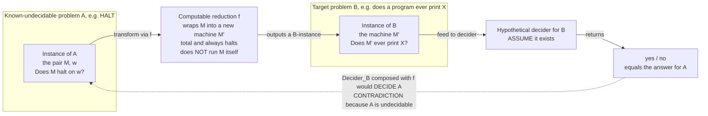

# ♻️ Reductions and Undecidable Problems

> [!abstract] TL;DR
> A **reduction** is a computable translator that turns every instance of one problem into an instance of another so that the yes/no answer is preserved. It is the **master technique of computability**: once we know *one* problem is unsolvable (the halting problem), we prove a new problem `B` is unsolvable by showing "if I could solve `B`, I could solve halting" — i.e. by reducing halting *to* `B`. This one move builds an entire **zoo of undecidable problems** (acceptance, emptiness, equivalence, totality) and culminates in **Rice's theorem**: *every non-trivial semantic property of the function a program computes is undecidable*. The same tool, sharpened to run in polynomial time, later separates the tractable from the intractable in complexity theory.

---

## Intuition

**Analogy — the "impossible errand" trick.** Suppose a wise elder has *proven* that no one in the village can ever fold a map so perfectly that it predicts tomorrow's weather. That is the village's known-impossible task. Now a stranger claims they own a magic box `B` that answers a *different* question. To debunk them without ever opening the box, you don't argue about the box directly. Instead you build a **little adapter**: you show how to phrase the map-folding problem *as* a question you could feed into their box. If the box really worked, you would run map-folding through the adapter, read off the box's answer, and thereby do the impossible. Since the impossible stays impossible, the box **cannot** exist.

That adapter is a **reduction**. In computation the "known impossible" task is the **halting problem** ("will this program stop?"), which Turing proved no algorithm can solve. To prove some new question `B` is *also* unsolvable, we never attack `B` head-on. We write a small, always-terminating program — the **reduction function `f`** — that rewrites any halting-question into an equivalent `B`-question. If a decider for `B` existed, gluing it after `f` would decide halting. That is impossible, so **no decider for `B` exists**. The direction is everything: we reduce the **known-impossible** problem *to* the **new** one, never the reverse.

---

## How It Works

### Core Mechanics

**1. What a mapping (many-one) reduction is.** A **mapping reduction** from language `A` to language `B`, written `A ≤ₘ B`, is a **total computable function** `f` such that for *every* string `w`:

$$w \in A \iff f(w) \in B$$

`f` must always halt (it is just an ordinary program that rewrites input to output) and it must preserve membership in **both** directions — yes maps to yes, and no maps to no. Note that `f` does **not** solve either problem; it only *translates* instances. Building `f` is usually a matter of writing source code that *constructs* a new program from an old one.

**2. The two theorems that make reductions useful.** From `A ≤ₘ B` you get a matched pair:

- **Positive transfer (solvability flows down):** if `B` is decidable, then `A` is decidable — run `f`, then the decider for `B`.
- **Contrapositive (unsolvability flows up):** if `A` is **undecidable**, then `B` is **undecidable**.

The second line is the workhorse. To prove `B` undecidable, pick a known-undecidable `A` (almost always the halting problem `HALT` or the acceptance problem `A_TM`) and exhibit `f` with `A ≤ₘ B`. The **direction is the single most confused point in the subject**: reducing `B` to `A` (`B ≤ₘ A`) proves nothing about `B`'s hardness — it would only show `B` is *no harder* than the known-hard `A`, which is the opposite of what you want.

**3. Recognizability transfers too.** The same `f` shows: if `A ≤ₘ B` and `B` is Turing-**recognizable**, so is `A`; contrapositively, if `A` is *not* recognizable, neither is `B`. Because `A ≤ₘ B` is equivalent to `Ā ≤ₘ B̄` (complements), reductions also prove problems lie *outside* the recognizable class — e.g. the non-halting language and the equivalence problem `EQ_TM` are neither recognizable nor co-recognizable.

**4. Building the undecidability zoo from `HALT`.** Starting from the halting problem, one short reduction each proves:

| Problem | Question | Reduce `HALT` by... |
|---|---|---|
| `A_TM` (acceptance) | Does machine `M` accept input `w`? | trivial repackaging of halting |
| `E_TM` (emptiness) | Is `L(M)` empty — does `M` accept *nothing*? | build `M'` that erases its input, runs `M` on `w`, accepts iff `M` halts |
| `EQ_TM` (equivalence) | Do `M₁`, `M₂` accept the same language? | reduce `E_TM` by comparing `M` against a machine that rejects everything |
| `TOTAL` (totality) | Does `M` halt on **every** input? | wrap `M` so it halts on all inputs iff `M` halts on `w` |
| `REGULAR` | Is `L(M)` regular? | a semantic property — falls to Rice's theorem |

Every one of these is proven the *same* way: a tiny code transformer that plants a copy of the halting question inside the target problem.

**5. Rice's theorem — the sledgehammer.** A property `P` of programs is **semantic** if it depends only on the **language/function the program computes**, not on its syntax, and **non-trivial** if some computable function has it and some other does not. **Rice's theorem (1953):** *every non-trivial semantic property of programs is undecidable.* So "does this program compute the identity?", "does it ever output `0`?", "does it halt on all inputs?", "is its language regular / empty / infinite?" are **all undecidable** in one stroke. The proof is itself a reduction from `A_TM`: given `⟨M, w⟩`, construct a program whose *behaviour* has property `P` **iff** `M` accepts `w`, so deciding `P` would decide acceptance. Crucially Rice's theorem is about **semantic** properties — *syntactic* properties ("does the source contain a `while`?", "is it under 100 lines?", "does it have three states?") are perfectly decidable because they read the code, not its meaning.

**6. Famous undecidable problems beyond programs.** Reductions reach across mathematics:

- **Post Correspondence Problem (PCP):** given a set of dominoes with a top and bottom string, can you order copies so the concatenated tops equal the bottoms? Undecidable — and a convenient *source* for reducing into grammar problems (e.g. whether a context-free grammar is **ambiguous**, or whether two CFGs generate a common string).
- **Hilbert's Tenth Problem:** is there an algorithm to decide whether a **Diophantine equation** (a polynomial with integer coefficients) has an integer solution? **No** — the MRDP theorem (Matiyasevich, 1970, building on Davis–Putnam–Robinson) proves it undecidable by showing every recognizable set is Diophantine.
- **The word problem for groups** (Novikov–Boone): no algorithm decides whether two products of generators are equal in a finitely presented group.
- **Validity in first-order logic** (the **Entscheidungsproblem**, Church & Turing 1936): no algorithm decides whether an arbitrary first-order formula is logically valid — the problem whose solution the whole theory was invented to refute.
- **Tiling / domino problems:** whether a set of Wang tiles can tile the plane is undecidable.

### Flow / Architecture



*Read the dashed arrow as the punchline: a working decider for `B`, glued after `f`, would decide the known-undecidable `A`. That contradiction forces `B` to be undecidable too. `f` is cheap and always halts; all the "impossible" work is quarantined in the assumed decider.*

---

## Key Concepts

**Secondary (intuitive, no CS background needed)**
- **Reduction = adapter.** Rephrasing a known-impossible task as a new task to expose the new task as impossible too.
- **Direction matters.** You translate the *hard, known-impossible* problem *into* the new one — never the other way.
- **Semantic vs surface.** Questions about what a program *does* (its behaviour) are far harder than questions about how its *code looks*.

**Undergraduate (a first theory course)**
- **Mapping reduction `A ≤ₘ B`:** a total computable `f` with `w ∈ A ⟺ f(w) ∈ B`.
- **Transfer lemmas:** `B` decidable ⇒ `A` decidable; `A` undecidable ⇒ `B` undecidable; same for recognizability and complements.
- **The zoo:** `A_TM`, `HALT`, `E_TM`, `EQ_TM`, `TOTAL`, `REGULAR` — proved undecidable by short reductions from halting/acceptance.
- **Rice's theorem:** every non-trivial semantic property of the recognized language is undecidable; syntactic properties are decidable.
- **Reductions in complexity:** the same idea with a polynomial-time `f` defines **NP-completeness** ([[Time_Complexity_Classes]]).

**Graduate (advanced theory)**
- **Turing (Cook) reductions vs many-one reductions:** oracle access with unbounded queries vs a single answer-preserving map; many-one is finer and needed to separate recognizability from co-recognizability.
- **The arithmetical hierarchy:** `HALT` is `Σ₁`-complete, `TOTAL` is `Π₂`-complete, `EQ_TM` is `Π₂`; `≤ₘ` is the ordering that defines these completeness levels.
- **MRDP theorem:** recognizable ⟺ Diophantine, collapsing Hilbert's tenth into the halting problem.
- **Productive/creative sets and the recursion theorem:** the self-reference machinery (`M` obtaining its own description) that powers Rice's theorem and the fixed-point constructions.
- **Rice–Shapiro theorem:** a sharper, "index-set" characterization of which semantic properties are even *recognizable*.

---

## Python Demo

```python
# A mapping reduction, made concrete:  HALT  <=m  PRINTS_X
#
#   HALT     : given a program M and input w, does M(w) halt?
#   PRINTS_X : given a program M', does M' ever print the sentinel "X"?
#
# The reduction f wraps M into a new program M' that:
#   1. simulates M(w) one step at a time, DISCARDING whatever M prints,
#   2. prints the sentinel "X" only AFTER M(w) has halted.
# Therefore   M' ever prints X   <=>   M(w) halts.  Answers are preserved.
#
# NOTE: real halting is undecidable, so nothing here DECIDES halting.
# We use a large step budget as a stand-in "oracle" purely to ILLUSTRATE that
# f preserves yes/no answers on examples we can run far enough to settle.
# numpy / matplotlib only.

import numpy as np
import matplotlib.pyplot as plt

STEP_BUDGET = 100_000
SENTINEL = "X"

# We model a "program" as a generator that YIELDS the strings it prints.
# Generator exhausted (StopIteration) == the program HALTED.
# Generator yields forever               == the program LOOPS forever.

def prog_halts_immediately(w):
    return
    yield  # (unreachable) marks this as a generator that prints nothing

def prog_print_then_halt(w):
    yield "hello"
    yield "world"          # then halts

def prog_loops_forever(w):
    i = 0
    while True:
        yield f"tick {i}"  # never halts
        i += 1

def prog_halts_after_len(w):
    for i in range(len(w)):
        yield f"step {i}"  # halts after len(w) steps

SOURCES = {
    "halts_now":        prog_halts_immediately,
    "print_then_halt":  prog_print_then_halt,
    "loops_forever":    prog_loops_forever,
    "halts_after_len":  prog_halts_after_len,
}
INPUTS = {"halts_now": "ab", "print_then_halt": "ab",
          "loops_forever": "ab", "halts_after_len": "abcd"}

# ---------------------------------------------------------------------------
# THE REDUCTION  f : HALT -> PRINTS_X
# It never solves halting; it just rewrites M into M'. Yielding a neutral
# "tick" per simulated step keeps M' responsive to the step budget, and the
# real sentinel is emitted ONLY once M(w) halts.
# ---------------------------------------------------------------------------
def reduce_halt_to_prints_x(source_gen, w):
    def m_prime(_ignored=None):
        inner = source_gen(w)
        while True:
            try:
                next(inner)      # advance M one step; discard its output
            except StopIteration:
                break            # M(w) has halted
            yield "tick"         # neutral progress token (never the sentinel)
        yield SENTINEL           # emitted only because M(w) halted
    return m_prime

# ---- stand-in bounded "oracles" (cannot truly decide, only illustrate) ----
def halts(gen_fn, w, budget=STEP_BUDGET):
    g = gen_fn(w)
    for _ in range(budget):
        try:
            next(g)
        except StopIteration:
            return True          # exhausted -> halted
    return False                 # still running -> treat as loop

def ever_prints(gen_fn, target, budget=STEP_BUDGET):
    g = gen_fn(None)
    for _ in range(budget):
        try:
            out = next(g)
        except StopIteration:
            return False
        if out == target:
            return True
    return False

# ---- run the reduction and check every answer is preserved ----------------
print("Reduction  HALT  <=m  PRINTS_X   (answers must match)\n")
rows = []
for name, gen_fn in SOURCES.items():
    w = INPUTS[name]
    a = halts(gen_fn, w)                              # answer to HALT
    m_prime = reduce_halt_to_prints_x(gen_fn, w)      # apply the reduction f
    b = ever_prints(m_prime, SENTINEL)                # answer to PRINTS_X
    rows.append((name, a, b, a == b))
    print(f"  {name:<18} HALT={str(a):<6} PRINTS_X={str(b):<6} match={a == b}")

assert all(r[3] for r in rows), "a valid reduction must preserve EVERY answer"
print("\nEvery answer preserved -> f is a valid mapping reduction.")
print("So if PRINTS_X were decidable, HALT would be too. HALT is NOT ->")
print("PRINTS_X is undecidable. Undecidability transferred through f.")

# ---------------------------------------------------------------------------
# Visualize: (left) the logic of a mapping reduction, (right) the answer map.
# ---------------------------------------------------------------------------
fig, (axL, axR) = plt.subplots(1, 2, figsize=(13, 6))

axL.set_title("Mapping reduction  A  <=m  B\nif B were decidable, so would A",
              fontsize=11, fontweight="bold")
boxes = [
    (0.82, "Instance of A\nM, w  --  does M halt on w?", "#ffd9d9"),
    (0.57, "Computable reduction f\nwrap M into M'  (total, always halts)", "#fff0cc"),
    (0.32, "Instance of B\nM'  --  does M' ever print X?", "#d9e8ff"),
    (0.09, "Decider for B  (ASSUMED)\noutput == answer for A", "#d9ffd9"),
]
for y, txt, c in boxes:
    axL.add_patch(plt.Rectangle((0.16, y - 0.06), 0.68, 0.12,
                                facecolor=c, edgecolor="black"))
    axL.text(0.5, y, txt, ha="center", va="center", fontsize=8.5)
for y0, y1 in [(0.76, 0.63), (0.51, 0.38), (0.26, 0.15)]:
    axL.annotate("", xy=(0.5, y1), xytext=(0.5, y0),
                 arrowprops=dict(arrowstyle="-|>", lw=1.6, color="black"))
axL.text(0.5, -0.03,
         "Decider_B  o  f  would DECIDE A  ->  contradiction",
         ha="center", va="center", fontsize=8.5, style="italic", color="#a00000")
axL.set_xlim(0, 1); axL.set_ylim(-0.08, 0.92); axL.axis("off")

axR.set_title("f preserves answers:   w in A   <=>   f(w) in B",
              fontsize=11, fontweight="bold")
names = [r[0] for r in rows]
yy = np.linspace(0.82, 0.14, len(names))
for name, y, r in zip(names, yy, rows):
    cA = "#2e7d32" if r[1] else "#c62828"
    cB = "#2e7d32" if r[2] else "#c62828"
    axR.scatter(0.22, y, s=320, color=cA, zorder=3)
    axR.scatter(0.78, y, s=320, color=cB, zorder=3)
    axR.annotate("", xy=(0.72, y), xytext=(0.28, y),
                 arrowprops=dict(arrowstyle="-|>", lw=1.3, color="#666666"))
    axR.text(0.5, y + 0.035, "f", ha="center", va="bottom", fontsize=8,
             style="italic", color="#666666")
    axR.text(0.22, y + 0.055, name, ha="center", fontsize=7.5)
    axR.text(0.22, y, "halt" if r[1] else "loop", ha="center", va="center",
             color="white", fontsize=6.5, fontweight="bold")
    axR.text(0.78, y, "X" if r[2] else "no X", ha="center", va="center",
             color="white", fontsize=6.5, fontweight="bold")
axR.text(0.22, 0.95, "HALT( M, w )", ha="center", fontsize=10, fontweight="bold")
axR.text(0.78, 0.95, "PRINTS_X( M' )", ha="center", fontsize=10, fontweight="bold")
axR.set_xlim(0, 1); axR.set_ylim(0.05, 1.0); axR.axis("off")

plt.tight_layout()
plt.savefig("mapping_reduction.png", dpi=130)
print("\nSaved reduction logic + answer-preservation map to mapping_reduction.png")
```

Running it prints a table showing `HALT` and `PRINTS_X` agree on every sample program (halting programs get `X`, the looping one never does), asserts answer-preservation, and saves a two-panel figure: the reduction's contradiction logic on the left, and the yes/no answer map — each `HALT` instance wired by `f` to a same-coloured `PRINTS_X` instance — on the right. The takeaway the code makes tangible: `f` never *solves* anything, it only *translates*, and that translation is exactly what carries undecidability from `HALT` into `PRINTS_X`.

---

## Real-World Applications

> **Example — why no static analyzer is ever perfect (Rice's theorem in production).** Every linter, type checker, dead-code eliminator, and antivirus engine is trying to decide a **semantic property** of programs: "does this branch ever execute?", "can this pointer be null here?", "does this binary ever exfiltrate data?". Rice's theorem says **all** such non-trivial semantic questions are undecidable, so no tool can be simultaneously *sound* (never wrong) and *complete* (never misses). Real tools therefore choose a side and stay **conservative**: a compiler's reachability analysis may report code as "possibly reachable" when it is not, a type checker rejects some safe programs, and malware scanners rely on signatures and heuristics rather than a true behavioural decision. The undecidability is not an engineering gap to be closed — it is a proven wall.

Further reach:
- **Compilers and language design.** Whether a context-free grammar is **ambiguous**, or whether two grammars are equivalent, is undecidable (via reductions from PCP) — which is why parser generators demand restricted grammar classes (LL, LALR) instead of accepting arbitrary CFGs.
- **Verification and model checking.** Full program equivalence (`EQ_TM`) is undecidable, so tools verify **bounded** or **abstracted** models, or restrict to **finite-state** systems where equivalence *is* decidable.
- **Complexity and cryptography.** The very same reduction technique, constrained to polynomial time, defines **NP-completeness**: proving a new problem NP-complete is a polynomial-time reduction from a known NP-complete problem ([[Time_Complexity_Classes]]) — the day-to-day tool for deciding whether to chase an exact algorithm or accept a heuristic.
- **Optimization and math tooling.** Hilbert's tenth problem's undecidability means no general algorithm settles integer-solution existence for arbitrary polynomial equations, bounding what symbolic solvers and integer-programming preprocessors can promise ([[Divisibility_and_Primes]]).

---

## Common Pitfalls

- **Reducing the wrong direction.** To prove `B` *hard*, reduce a **known-hard** `A` *to* `B` (`A ≤ₘ B`). Students routinely build `B ≤ₘ A` instead, which shows `B` is *no harder* than `A` — the opposite of the goal. Ask: "does my `f` let a `B`-decider settle the known-undecidable problem?" If not, the arrow is backwards.
- **Letting the reduction `f` do real work.** `f` must be **total and always halt** — it may *construct* a machine that runs forever, but `f` itself only assembles source code. If your "reduction" actually simulates the input program to decide something, you have smuggled in the impossible step and proven nothing.
- **Confusing semantic with syntactic properties.** Rice's theorem kills *semantic* properties (about the computed function), **not** syntactic ones. "Does the code contain a loop?" or "does the TM have 5 states?" are decidable; "does it *ever loop* on some input?" is not. Misapplying Rice to a syntactic property gives a false "undecidable" verdict.
- **Forgetting the non-triviality clause.** Rice's theorem needs the property to hold for *some* but not *all* computable functions. Trivial properties — "computes a computable function" (always true) or "solves the halting problem" (always false) — are decidable by a constant answer.
- **Assuming undecidable means unrecognizable, or vice versa.** `HALT` is undecidable yet **recognizable** (just simulate and accept on halt). `EQ_TM` is worse — neither recognizable nor co-recognizable. Mapping reductions, unlike Turing reductions, are precisely what let you separate these classes.
- **Thinking a fast/bounded checker refutes undecidability.** Timeout-based tools (like the demo's step budget) answer only "halts *within N steps*", a decidable approximation. They never decide the unbounded question; scaling `N` never closes the gap.

---

## Related Concepts

- [[Theory_of_Computation_Overview]] — the section entry point; places reductions inside computability theory and the road to complexity.
- [[Mathematical_Logic_and_Set_Theory]] — Turing machines, the halting problem, Gödel's incompleteness, and the Church–Turing thesis that underpin every reduction argument.
- [[Time_Complexity_Classes]] — the same reduction idea, restricted to polynomial time, defines NP-completeness; undecidability's "hardness" analogue.
- [[Predicate_Logic_and_Quantifiers]] — validity in first-order logic (the Entscheidungsproblem) is the undecidable problem Church and Turing originally targeted.
- [[Groups_and_Subgroups]] — the word problem for finitely presented groups is undecidable, a classic reduction target outside computer science.
- [[Divisibility_and_Primes]] — Hilbert's tenth problem: no algorithm decides integer solvability of Diophantine equations (MRDP theorem).
- [[Set_Theory_and_Relations]] — countability and diagonalization, the set-theoretic backbone that seeds the first undecidable language.
- [[Logic_and_Proof_Techniques]] — proof by contradiction and reduction arguments are the formal engine of undecidability proofs.
- [[Logic_in_AI_and_Computation]] — how decidability limits bound automated reasoning, verification, and AI planning.
- [[Paradoxes_and_Logical_Puzzles]] — the self-reference (liar/diagonal) intuition that makes the halting problem and Rice's theorem tick.
- [[Information_Theory_Overview]] — Kolmogorov complexity, another uncomputable quantity provable via reduction from halting.
- [[String_Matching_Overview]] — the decidable, practical end of language problems, contrasting with the undecidable questions here.

---

## Review Questions

1. **(Conceptual)** State precisely what `A ≤ₘ B` requires of the function `f`, and explain *why* `f` must always halt but is allowed to build a machine that never halts. Then articulate, in one sentence each, the two conclusions you may draw from `A ≤ₘ B` — one about decidability flowing *down*, one about undecidability flowing *up*.
2. **(Scenario)** A colleague wants a tool that, for any submitted program, decides whether it "ever prints the string `PASSWORD`". They argue this is easier than halting because it only checks output. Using Rice's theorem *and* an explicit reduction from the halting problem, prove their tool cannot exist. Where exactly does the halting question get planted inside the print-checking question?
3. **(Trade-off / distinction)** Contrast a problem proven **undecidable** with one proven **NP-complete**, given that *both* verdicts are established by "reductions". For each, state (a) what a reduction *transfers*, (b) what the practical engineering response should be, and (c) why treating an undecidable problem like an NP-complete one — "just throw more compute at it" — is a category error.

---

## Sources

- Sipser, M. *Introduction to the Theory of Computation*, 3rd ed. Cengage, 2013 — Chapter 5 (reducibility, `E_TM`, `EQ_TM`, PCP) and the treatment of Rice's theorem and mapping reductions.
- Rice, H. G. "Classes of Recursively Enumerable Sets and Their Decision Problems." *Transactions of the American Mathematical Society*, vol. 74, 1953 — the original statement and proof of Rice's theorem.
- Post, E. L. "A Variant of a Recursively Unsolvable Problem." *Bulletin of the American Mathematical Society*, vol. 52, 1946 — the Post Correspondence Problem.
- Matiyasevich, Y. *Hilbert's Tenth Problem*. MIT Press, 1993 — the MRDP theorem proving Diophantine solvability undecidable.
- Turing, A. M. "On Computable Numbers, with an Application to the Entscheidungsproblem." *Proc. London Math. Soc.*, 1936 — the halting problem and the undecidability of first-order validity, the root of the whole tree of reductions.

---

#theory-of-computation #reductions #undecidability #rices-theorem #mapping-reduction
