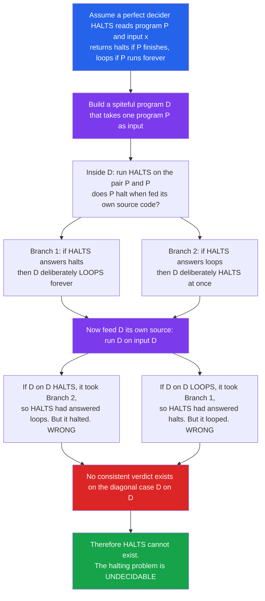

# 🛑 The Halting Problem and Undecidability

> [!abstract] TL;DR
> The **halting problem** asks for a single algorithm that, given *any* program and *any* input, decides whether that program eventually **halts** or **loops forever**. Turing proved in 1936 that **no such algorithm can exist** — not because we are not clever enough, but as a mathematical impossibility. The proof is a **self-reference trap**: assume a perfect halting-checker exists, then build a program that runs the checker on itself and does the *opposite* of what it predicts. This is the same diagonal move as **Cantor's** uncountability proof and **Gödel's** incompleteness. Its shadow is enormous: by **reduction**, essentially every non-trivial semantic question about programs ("will it crash?", "does it print `hello`?", "are these two programs equivalent?") is **undecidable** too. Perfect static analysis, verification, and bug detection are impossible *in general* — which is exactly why real tools are sound-but-incomplete approximations.

---

## Intuition

**Analogy — the impossible crash-predictor.** Imagine a startup sells `WillItHang`, a magic box that reads the source code of *any* program plus its input and lights **GREEN** if that program will eventually finish, **RED** if it will run forever. No waiting, no guessing — it is always right and always fast.

Now play a spiteful game with it. Write a new program **D** ("the Devil") that does this: feed **D**'s own source code into `WillItHang`, look at the light, and then do the *opposite* of what it predicts.

- If the box lights **GREEN** (predicting D finishes), D deliberately enters an infinite loop and never finishes.
- If the box lights **RED** (predicting D loops), D immediately finishes.

Now run **D on its own code**. Whatever `WillItHang` predicts about this exact run, D is wired to *disprove it*. GREEN becomes a lie the instant D loops; RED becomes a lie the instant D halts. The box cannot be right about D — so a box that is right about *everything* is a logical impossibility. That single spiteful program is enough to kill the whole idea.

The punchline: this is not a limitation of *this* gadget or *today's* computers. It is a **hard limit on computation itself**. There are perfectly precise yes/no questions about programs that **no** machine — however fast, however clever, quantum or otherwise — can answer for all inputs.

---

## How It Works

### The problem, stated precisely

Encode every program as a finite string (its source code) and feed programs to other programs — the ordinary reality of compilers and interpreters. Define the language

- **HALT** = the set of pairs `<P, x>` such that program `P` **halts** when run on input `x`.

To "decide" HALT means: an algorithm that, for *every* pair `<P, x>`, always stops and correctly answers **YES** (it halts) or **NO** (it loops forever). Turing's theorem: **HALT is undecidable** — no such always-terminating, always-correct algorithm exists.

### The proof — diagonalization and self-reference

The argument is a **proof by contradiction** driven by a program that talks about itself.

1. **Assume** a perfect decider `HALTS(P, x)` exists. It always terminates and returns `halts` or `loops`, correctly, for any program `P` and input `x`.
2. **Build a spiteful program `D`** that takes one input — another program `P`:
   - `D` runs `HALTS(P, P)` — it asks "does `P` halt when fed *its own code* as input?"
   - If `HALTS(P, P)` says **`halts`**, then `D` deliberately **loops forever**.
   - If `HALTS(P, P)` says **`loops`**, then `D` deliberately **halts**.
   Because `HALTS` always terminates, `D` is a perfectly legal program.
3. **Ask the fatal question: what does `D` do on input `D`?** Feed `D` its own source code and trace it:
   - If **`D` on `D` halts**, it must have taken the "`HALTS` said `loops`" branch — so the oracle claimed `D` loops on `D`, yet it halted. The oracle was **wrong**.
   - If **`D` on `D` loops**, it must have taken the "`HALTS` said `halts`" branch — so the oracle claimed `D` halts on `D`, yet it looped. The oracle was **wrong**.
4. **Contradiction.** On the single input `D`, the "perfect" decider is guaranteed wrong. The only faulty assumption was step 1. Therefore **`HALTS` cannot exist**, and HALT is undecidable. ∎

**Why "diagonalization"?** Line up all programs `P_0, P_1, P_2, ...` as rows and the same programs as inputs in columns. Cell `(i, j)` records whether `P_i` halts on input `P_j`. The program `D` is engineered to *disagree with the diagonal*: on input `P_i` it does the opposite of cell `(i, i)`. So `D` differs from **every** program `P_i` in at least column `i` — meaning `D` is on no row, exactly as **Cantor's** diagonal real is on no line of the list. The behaviour "flip your own diagonal entry" is impossible for any row to contain, and that is the whole trick.



### Recognizable but not decidable

HALT is **recognizable** (semi-decidable): to answer "does `<P, x>` halt?", just *run `P` on `x`*. If it halts, say **YES**. The catch is the **NO** case — if `P` loops, your simulation loops too, and you never get to announce "no." So HALT is a language you can confirm from one side but never decide from both. Its complement (programs that loop forever) is not even recognizable. This asymmetry — **recognizable minus decidable** — is the fingerprint of undecidability.

### Undecidability spreads by reduction

The halting problem is not a lone curiosity. To prove some other problem `Q` is undecidable, you **reduce** HALT to `Q`: show that a decider for `Q` could be used to build a decider for HALT. Since HALT has none, `Q` has none either. This turns one impossibility into thousands.

**Rice's theorem** is the industrial-scale version: *every non-trivial semantic property of a program's behaviour is undecidable*. "Non-trivial" means at least one program has the property and at least one does not; "semantic" means it depends on what the program *computes*, not on how its text looks. So "does this program ever crash?", "does it print `hello`?", "does it compute the same function as that one?", "does it have this bug?" are **all** undecidable. There is no general oracle for any of them.

### The Gödel connection

Turing's construction is a computational twin of **Gödel's incompleteness theorems** (see [[Mathematical_Logic_and_Set_Theory]]). Gödel built a sentence that says *"this statement is not provable"*; Turing built a program that does the opposite of what it is predicted to do. Both weaponize **self-reference** to expose a hard boundary — one on *provability* inside a formal system, the other on *decidability* by any machine. In fact, undecidability of the halting problem gives an alternative, arguably cleaner route to incompleteness: if a consistent, complete, effectively axiomatized theory of arithmetic existed, you could mechanically search its proofs to decide whether any program halts — which is impossible. **Kleene's recursion theorem** is the formal engine that guarantees a program *can* obtain and reason about its own code, making the "D on D" self-reference rigorous.

---

## Key Concepts

### Secondary (intuition, no formalism)
- A program can either **finish (halt)** or **run forever (loop)**.
- The dream: one master program that reads any code and tells you in advance which it will do.
- The dream is **impossible** — you can always build a spiteful program that does the opposite of the prediction, so the predictor is wrong about it.
- This is a **limit of computers themselves**, not of speed, memory, or cleverness.

### Undergraduate (formal computability)
- **Turing machine** as the formal program model; **encodings** `<M>` let machines take machines as input; a **universal Turing machine** simulates any `<M>` on any `w`.
- Languages: **A_TM** = `{ <M, w> : M accepts w }` and **HALT_TM** = `{ <M, w> : M halts on w }`; both are **undecidable** but **recognizable**.
- **Decidable** (Turing-decidable / recursive): a TM that always halts with the right yes/no answer. **Recognizable** (recursively enumerable): a TM that halts-and-accepts on members, but may loop on non-members.
- **Diagonalization proof** of A_TM undecidability; **reduction** `A_TM ≤ HALT_TM` (mapping / many-one reductions).
- **Rice's theorem**: every non-trivial property of the *language* a TM recognizes is undecidable.
- A language is **decidable iff both it and its complement are recognizable** — HALT is recognizable, its complement is not.

### Graduate (structure of the undecidable)
- **Arithmetical hierarchy**: HALT is **Σ⁰₁-complete** ("there exists a halting computation of length n"); its complement is Π⁰₁; deciding it would require an oracle above the whole hierarchy's first level.
- **Turing reductions and Turing degrees**: relative computability; the **halting oracle** `0′` sits strictly above the computable sets `0`; **Post's problem** and the Friedberg–Muchnik theorem show a rich lattice of intermediate degrees.
- **Kleene's recursion (fixed-point) theorem** formalizes self-reference: any program can effectively compute its own description, legitimizing the "D on D" move without hand-waving.
- **Rice–Shapiro theorem** refines Rice's theorem for recursively enumerable index sets.
- **Busy Beaver** `BB(n)` (Radó, 1962): the maximum number of steps a halting `n`-state TM runs before stopping. `BB` is **total but uncomputable** and grows faster than *any* computable function — a concrete, explicit witness to uncomputability; knowing `BB(n)` would decide halting for all `n`-state machines.

---

## Python Demo

```python
"""
The Halting Problem: three concrete demonstrations (numpy + matplotlib only).

  PART A - the self-referential contradiction: why a perfect HALTS decider cannot exist.
  PART B - a bounded "halts within k steps" check IS decidable, yet no finite k
           decides halting in general (stopping times are unbounded).
  PART C - visualize the diagonalization: the anti-diagonal program D disagrees with
           the assumed decider on its own diagonal entry, so it fits on no row.
"""

import numpy as np
import matplotlib.pyplot as plt
from matplotlib.patches import Rectangle

rng = np.random.default_rng(1936)  # a nod to Turing's 1936 paper

# ---------------------------------------------------------------------------
# PART A: the self-reference paradox, made explicit.
# Suppose HALTS(P, x) is a perfect oracle. Build the spiteful program D:
#     D(P):  if HALTS(P, P) == "halts"  ->  D loops forever
#            if HALTS(P, P) == "loops"  ->  D halts immediately
# Now ask what D does on input D. By construction D does the OPPOSITE of the
# oracle's own verdict about "D on D", so the oracle is guaranteed wrong.
# ---------------------------------------------------------------------------
def D_actual_behavior(oracle_claim_about_D_on_D):
    # D is wired to contradict whatever the oracle claims about D running on D
    return "loops" if oracle_claim_about_D_on_D == "halts" else "halts"

print("PART A - the diagonal contradiction")
print(f"{'oracle claims D-on-D':>22} | {'D-on-D actually':>16} | consistent?")
for claim in ("halts", "loops"):
    actual = D_actual_behavior(claim)
    verdict = "YES" if claim == actual else "NO  <-- contradiction"
    print(f"{claim:>22} | {actual:>16} | {verdict}")
print("Both possibilities contradict => a perfect HALTS oracle cannot exist.\n")

# ---------------------------------------------------------------------------
# PART B: bounded halting is decidable; unbounded halting is not.
# "collatz_halts_within" always terminates - it simulates at most k steps.
# But the number of steps needed to halt is UNBOUNDED across inputs, so no
# single finite k works for every program. The Collatz map is the classic
# example whose stopping time varies wildly (and is not known to halt for all n).
# ---------------------------------------------------------------------------
def collatz_halts_within(n, k):
    """Decidable check: run at most k steps. Returns (halted?, steps_used)."""
    steps = 0
    while n != 1 and steps < k:
        n = n // 2 if n % 2 == 0 else 3 * n + 1
        steps += 1
    return n == 1, steps

def loop_forever_halts_within(_, k):
    """Models `while True: pass` - for ANY finite k the honest answer is False."""
    return False, k

starts = np.arange(1, 5001)
stop_times = np.array([collatz_halts_within(int(n), 100_000)[1] for n in starts])

print("PART B - bounded check vs unbounded reality")
for k in (10, 50, 200):
    proven = np.mean(stop_times <= k) * 100.0
    print(f"  budget k={k:>4}: only {proven:5.1f}% of inputs are already proven to halt")
print(f"  max stopping time seen for n <= 5000: {stop_times.max()} steps")
print(f"  `while True: pass` halts within k? -> {loop_forever_halts_within(None, 10**9)[0]} "
      f"(false for every finite k)\n")

# ---------------------------------------------------------------------------
# PART C: Cantor / Turing diagonalization as a picture.
# Table T[i, j] = 1 means "the assumed decider claims program P_i HALTS on input
# P_j"; 0 means "claims it LOOPS". The anti-diagonal program D is defined to FLIP
# the diagonal: D on P_j = 1 - T[j, j]. Then D disagrees with every row P_i at
# column i, so D fits on NO row -> the table is necessarily incomplete, exactly
# like Cantor's missing real number.
# ---------------------------------------------------------------------------
N = 12
T = rng.integers(0, 2, size=(N, N))   # the assumed halting table (1 = halts, 0 = loops)
diagonal = np.diag(T)                 # what the table claims about P_i on P_i
D_row = 1 - diagonal                  # D flips every diagonal entry -> on no row

# ---------------------------------------------------------------------------
# Figure: left = Part B (unbounded stopping times); right = Part C (diagonalization).
# ---------------------------------------------------------------------------
fig, (axL, axR) = plt.subplots(1, 2, figsize=(14, 6))

axL.plot(starts, stop_times, lw=0.6, color="#2563eb", alpha=0.85)
for k, c in zip((10, 50, 200), ("#16a34a", "#f59e0b", "#dc2626")):
    axL.axhline(k, ls="--", color=c, lw=1.6, label=f"budget k = {k}")
axL.set_title("Part B: Collatz stopping time is unbounded\n"
              "no finite budget k decides halting for all inputs")
axL.set_xlabel("starting input n")
axL.set_ylabel("steps until it halts")
axL.legend(loc="upper left", fontsize=9)

# stack the table, a blank gap row, and D's constructed anti-diagonal row
display = np.vstack([T.astype(float), np.full((1, N), np.nan), D_row.astype(float)])
im = axR.imshow(display, cmap="Greys", vmin=0, vmax=1, aspect="equal")
im.cmap.set_bad(color="white")
for i in range(N):
    # box each diagonal cell the decider commits to
    axR.add_patch(Rectangle((i - 0.5, i - 0.5), 1, 1, fill=False, edgecolor="#dc2626", lw=2))
    # box D's flipped answer in the same column (bottom row of the display)
    axR.add_patch(Rectangle((i - 0.5, N + 0.5), 1, 1, fill=False, edgecolor="#2563eb", lw=2))
axR.set_title("Part C: diagonalization\n"
              "D = flipped diagonal (blue) differs from every P_i at column i")
axR.set_xlabel("input P_j   (black = table claims HALT, white = claims LOOP)")
axR.set_xticks(range(N))
axR.set_xticklabels(range(N))
axR.set_yticks(list(range(N)) + [N + 1])
axR.set_yticklabels([f"P{i}" for i in range(N)] + ["D"])

fig.suptitle("Why no algorithm decides halting: unbounded runtimes + the diagonal contradiction",
             fontsize=13, y=1.02)
fig.tight_layout()
plt.show()
```

Running it prints Part A's two-row contradiction table (the oracle is wrong on both branches), Part B's evidence that ever-larger step budgets still fail to certify halting for all inputs, and renders Part C's diagonalization matrix with the anti-diagonal program `D` boxed against the table's own diagonal.

---

## Real-World Applications

- **Static analysis and linters** — a perfect "does this code ever reach a null-dereference / divide-by-zero / unreachable branch?" checker would decide a semantic property, which Rice's theorem forbids. Real tools (ESLint, Coverity, Clang analyzer) are therefore **sound-but-incomplete or unsound-but-useful**: they over- or under-approximate and accept false positives/negatives.
- **Program verification and termination checkers** — proving that arbitrary code terminates is undecidable, so provers restrict the language. Microsoft's **Terminator**, and totality checkers in **Coq**, **Agda**, and **Lean**, only accept recursion they can *prove* well-founded; they reject some perfectly-terminating programs to stay sound.
- **Compilers** — many "does this optimization preserve behaviour / is this branch dead?" questions are undecidable, so compilers use conservative dataflow and **abstract interpretation** rather than exact answers.
- **Antivirus and malware detection** — deciding "will this binary ever exhibit malicious behaviour?" is undecidable, which is *why* detection relies on signatures, heuristics, sandboxing, and behavioural monitoring rather than a provably complete analyzer.
- **Type systems** — type checking in sufficiently expressive systems (e.g. certain dependent or higher-rank type features) can be undecidable, forcing annotations or restricted fragments; language designers deliberately choose **decidable** type systems.
- **Model checking and formal methods** succeed by working in **decidable fragments** (finite-state systems, bounded models) — trading Turing-completeness for the ability to answer questions at all.
- **Busy Beaver** — `BB(5)` was pinned down by a distributed proof effort, and `BB(6)` is astronomically large and effectively out of reach — a tangible face of uncomputability.

---

## Common Pitfalls

- **"Undecidable just means we haven't found the algorithm yet."** No — it is a *proof of impossibility*. No future algorithm, faster CPU, quantum computer, or smarter AI can decide the halting problem in general (assuming the Church–Turing thesis). It is a theorem, not an open engineering problem.
- **"Undecidable means we can't solve any instance."** False. We decide halting for countless *specific* programs every day. Undecidability forbids **one algorithm that works for all** program-input pairs — it says nothing about individual cases or restricted classes.
- **Confusing undecidable with intractable (NP-hard).** Different axes. NP-hard problems *have* algorithms (just slow); undecidable problems have **no** algorithm at all. SAT is decidable but hard; HALT is not decidable.
- **Confusing recognizable with decidable.** HALT is recognizable — run the program and say YES if it stops. The fatal gap is the **NO** side: you can never conclude "it loops forever" from a simulation that hasn't stopped yet.
- **Assuming a "bug detector" or "equivalence checker" could be perfect.** By Rice's theorem, every non-trivial semantic property is undecidable, so no tool can be simultaneously sound, complete, and terminating for such questions. Expect approximations.
- **Forgetting the model matters.** Halting is undecidable only for **Turing-complete** models. **Total** languages (primitive-recursive DSLs, terminating configuration languages) and genuinely **finite-state** systems have a *decidable* halting question. Real hardware is finite-state, but its state space is so astronomically large that the Turing-machine idealization is the useful model.

---

## Related Concepts

- [[Theory_of_Computation_Overview]] — the parent map; places computability between automata theory and complexity theory.
- [[Mathematical_Logic_and_Set_Theory]] — **Gödel's incompleteness** theorems: the same self-reference limit, one level up (provability instead of decidability).
- [[Set_Theory_and_Relations]] — **Cantor's diagonal argument** and uncountability: the exact combinatorial move reused to build the contradictory program `D`.
- [[Logic_and_Proof_Techniques]] — **proof by contradiction**, the deductive shape of Turing's argument.
- [[Non_Regular_Languages_and_the_Pumping_Lemma]] — a *different* impossibility technique (adversary/pumping) showing a weaker machine class hits its own hard limits.
- [[Finite_Automata_DFA_and_NFA]] — bounded-memory models for which halting *is* decidable, clarifying that undecidability is specific to Turing-complete power.

---

## Review Questions

**Secondary.** In one paragraph, explain why you can always outsmart a machine that claims it can predict whether *any* program will finish. What "spiteful" program would you write to prove it wrong?

**Undergraduate.**
1. State HALT_TM formally and prove it is undecidable by reducing A_TM to it. Where exactly does the diagonalization enter?
2. HALT is recognizable but not decidable. Explain what "recognizable" buys you, why the NO-case defeats decidability, and why HALT's complement is not even recognizable.
3. Use **Rice's theorem** to argue that "does this program ever print `hello`?" is undecidable. Identify the non-trivial semantic property and confirm it is neither always-true nor always-false.

**Graduate.**
1. A colleague claims their new AI-powered static analyzer detects *all* infinite loops with zero false positives and always terminates. Which of soundness, completeness, or termination must they be giving up, and why does Rice's theorem force the trade-off?
2. Sketch how undecidability of the halting problem yields an alternative proof of **Gödel's first incompleteness theorem**. Where does the assumption of a complete, consistent, effectively axiomatized arithmetic get used?
3. Explain why the **Busy Beaver** function `BB(n)` is total but uncomputable, and how an oracle for `BB` would decide halting for all `n`-state machines. What does this say about the growth rate of `BB` relative to computable functions?

---

## Sources

- Turing, A. M. (1936). "On Computable Numbers, with an Application to the Entscheidungsproblem." *Proceedings of the London Mathematical Society*, 2(42), 230–265.
- Sipser, M. (2013). *Introduction to the Theory of Computation* (3rd ed.), Chapters 4–5. Cengage.
- Hopcroft, J. E., Motwani, R., & Ullman, J. D. (2006). *Introduction to Automata Theory, Languages, and Computation* (3rd ed.). Pearson.
- Rice, H. G. (1953). "Classes of Recursively Enumerable Sets and Their Decision Problems." *Transactions of the American Mathematical Society*, 74(2), 358–366.
- Radó, T. (1962). "On Non-Computable Functions." *Bell System Technical Journal*, 41(3), 877–884.

---

#theory-of-computation #halting-problem #undecidability #diagonalization #turing
