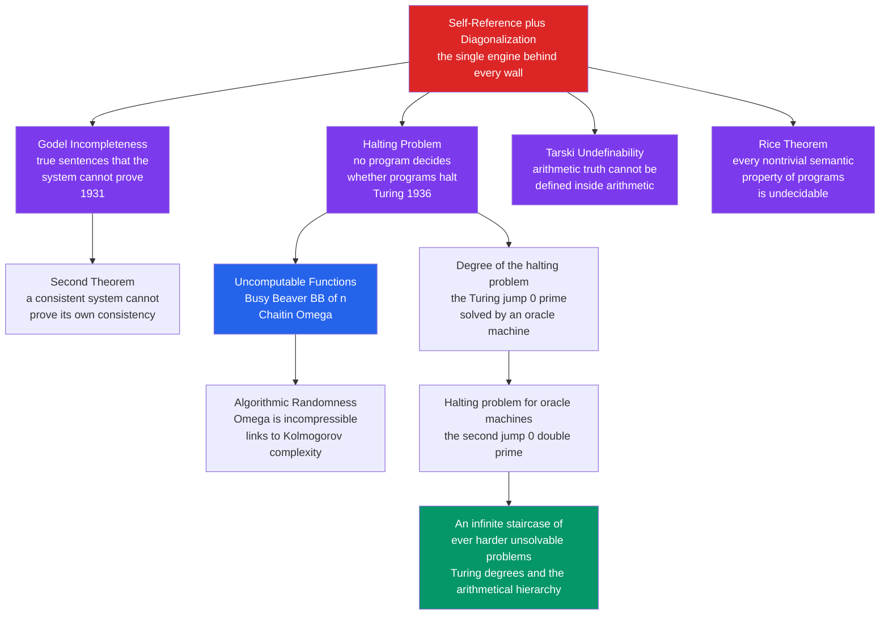

# 🚧 The Limits of Computation

> [!abstract] TL;DR
> Computation and formal logic have **hard, permanent walls** — not gaps waiting to be filled. Some perfectly well-posed problems (does this program halt?) can be solved by **no algorithm ever**; some true statements of arithmetic can be **proved by no consistent formal system that contains them**; and some crisply-defined functions (the **Busy Beaver**) can be **computed by no program at all**. The astonishing punchline of 20th-century logic is that these are all the **same phenomenon** wearing different masks: Turing's halting proof, Gödel's incompleteness theorems, Tarski's undefinability of truth, and Rice's theorem are four faces of one self-referential, diagonal argument. And the unsolvable problems do not stop — they climb an **infinite hierarchy** of ever-harder problems above the halting problem. This note is the capstone of computability: what these limits are, why they hold, and what they mean for verification, AI, and the reach of the mind.

---

## Intuition

**Analogy — the card the machine can never stamp.** Imagine the ultimate fact-checking machine. Feed it any statement and, given enough time, it stamps every provable truth **PROVED** and every falsehood **REFUTED**. It is supposed to be complete (settles everything) and honest (never stamps a lie).

Now hand it a single index card that reads:

> *"This card will never be stamped PROVED by this machine."*

Watch what happens. If the machine ever stamps the card **PROVED**, then the card's claim is false — but the machine just certified a falsehood, so it is a **liar**. To stay honest it must therefore *never* stamp the card. But then the card's claim is **true** — and here is a true statement the machine can never certify. The machine is forced to be either **dishonest** or **incomplete**. There is no third option, and no amount of engineering fixes it: a bigger, faster machine just gets its own, freshly-worded card.

That card is the whole subject. Gödel built exactly such a sentence out of arithmetic ("this sentence has no proof"), and Turing built exactly such a program out of code ("this program halts only if it loops"). The lesson is not "we are not clever enough yet." It is that **self-reference plus enough expressive power creates true things no proof can reach and functions no program can compute**. The walls are structural, permanent, and — once you see the card — inevitable.

---

## How It Works

### Core Mechanics

**1. One weapon: diagonalization.** Every limitative result is proved by the same move Cantor used to show the reals outnumber the integers. Lay all possible machines (or proofs, or definitions) in a list; then engineer an object that **deliberately disagrees with entry _n_ at position _n_**. The constructed object cannot equal anything in the list — yet the list was supposed to contain everything. Contradiction. The card above is diagonalization made friendly.

**2. The halting wall (Turing, 1936).** Suppose a program `HALTS(P, x)` could decide, for every program `P` and input `x`, whether `P` halts on `x`. Build `DIAG(P)` that runs `HALTS(P, P)` and does the opposite — loops if `P` halts, halts if `P` loops. Ask: does `DIAG(DIAG)` halt? Either answer contradicts itself. So `HALTS` cannot exist. The **halting problem is undecidable**. Every other undecidable problem is then proved undecidable by **reduction**: show that solving it would let you solve halting.

**3. The incompleteness wall (Gödel, 1931).** In any consistent formal system `T` strong enough to express arithmetic (Peano Arithmetic, ZFC, ...):
- **First theorem.** There is a sentence `G` — built by **Gödel numbering** (encoding formulas and proofs as numbers) so that `G` provably says *"I am not provable in T"* — such that `T` proves neither `G` nor its negation, yet `G` is **true** in the standard model. Truth outruns proof.
- **Second theorem.** `T` cannot prove its own consistency, `Con(T)`. The one thing you most want a foundation to certify — that it will never derive a contradiction — is exactly what it cannot certify from inside.

This detonated **Hilbert's program**, the early-1900s dream of a single complete, consistent, mechanically-checkable foundation for all mathematics. That dream is provably unrealizable.

**4. Why halting and incompleteness are the same wall.** Gödel's `G` is a coded statement that a certain search — "look for a proof of `G`" — never terminates. Incompleteness is the halting problem written in the language of proof; the halting problem is incompleteness written in the language of programs. Tarski's theorem (**arithmetic truth cannot be defined inside arithmetic**) and Rice's theorem (**every nontrivial semantic property of programs is undecidable**) are the same self-referential engine applied to *truth* and to *program behavior*. Four theorems, one idea.

**5. Uncomputable functions made concrete.** Undecidability is usually stated about *yes/no problems*, but it also produces explicit **functions no program can compute**:
- **The Busy Beaver, `BB(n)`.** Among all `n`-state Turing machines that *do* halt on a blank tape, `BB(n)` is the maximum number of steps any of them runs. It is a completely definite function — yet **uncomputable**, because a program for `BB` would let you solve halting (run any `n`-state machine for `BB(n)` steps; if it hasn't stopped, it never will). `BB` grows faster than *every* computable function.
- **Chaitin's Omega, `Ω`.** The probability that a random program halts. It is a perfectly definable real number, yet **uncomputable and algorithmically random** — its bits are incompressible; knowing the first `n` bits of `Ω` would settle the halting problem for all programs up to length `n`. `Ω` is where uncomputability and information theory meet.

**6. The limits have a hierarchy of their own.** Undecidability is not a single floor — it is an **infinite staircase**. Give a Turing machine a magic **oracle** that answers the halting problem for free; this stronger machine solves problems ordinary machines cannot — but it has its *own* halting problem, undecidable even to it. Iterate forever. This is the theory of **Turing degrees** (`0`, the **jump** `0'`, `0''`, ...) and the **arithmetical hierarchy** (`Σ₁`, `Π₁`, `Σ₂`, ...). There are strictly harder and harder unsolvable problems with no top.

**7. Could a physical machine break these walls? (Hypercomputation.)** People have proposed models — infinite-precision analog devices, machines that complete infinitely many steps in finite time — that would exceed Turing machines. None is known to be physically realizable, and the **Church–Turing thesis** (everything effectively computable is Turing-computable) has survived 90 years unscathed. The physical **Church–Turing–Deutsch** version conjectures the universe itself computes nothing a Turing machine cannot.

### Flow / Architecture



*Read top-down: one engine (self-reference plus diagonalization) forces four equivalent walls; the halting wall spawns uncomputable functions and, above it, an endless hierarchy of harder problems.*

---

## Key Concepts

**Secondary (intuitive, no CS background needed)**
- **Undecidable vs unproven.** "Undecidable" does not mean "nobody has solved it yet." It means **no algorithm can ever solve it**, at any speed, on any machine.
- **True but unprovable.** A statement can be *true* and yet have *no proof* inside a given rulebook — truth is a bigger notion than proof.
- **The self-reference trap.** Sentences and programs that talk about themselves ("this cannot be proved", "do the opposite of what you predict") are what create the walls. The liar paradox, made rigorous.
- **A function too big to compute.** The Busy Beaver `BB(n)` is a clear, definite number for each `n`, yet no program can print it for all `n` — it outgrows every possible program.

**Undergraduate (a first theory / logic course)**
- **Diagonalization and reduction.** The halting proof; proving new problems undecidable by reducing halting to them.
- **Rice's theorem.** *Any* nontrivial property of the language a program recognizes is undecidable — so perfect static analysis is impossible in principle.
- **Gödel's two theorems.** Gödel numbering, the Gödel sentence `G` = "I am not provable", why `T ⊬ G` and `T ⊬ ¬G`, and the second theorem `T ⊬ Con(T)`.
- **Tarski's undefinability of truth** and its kinship with Gödel and Turing.
- **Church–Turing thesis.** Why "computable" = "Turing-computable", and why it is a *thesis* (an empirical claim about the notion of algorithm), not a theorem.
- **Busy Beaver as an explicit uncomputable function**, and how it certifies halting if it were computable.

**Graduate (advanced computability and logic)**
- **Turing degrees and the jump.** `deg(∅)`, the halting set `∅'` (`0'`), iterated jumps `0''`, `0'''`, ...; relative computability `A ≤_T B`.
- **Oracle machines and relativization** — the halting problem *relative to* an oracle, and the relativized hierarchy above it.
- **The arithmetical hierarchy** `Σₙ / Πₙ / Δₙ`: classifying problems by quantifier alternation; the halting problem is `Σ₁`-complete.
- **Post's problem and the priority method** — the existence of intermediate degrees strictly between `0` and `0'` (Friedberg–Muchnik).
- **Chaitin's `Ω` and algorithmic randomness** — `Ω` is left-c.e., `Δ₂`, Martin-Löf random, and Turing-equivalent to the halting set; the link to [[Kolmogorov_Complexity_and_Algorithmic_Information]].
- **Hypercomputation models** (infinite-time Turing machines, Zeno machines, oracle-endowed analog computers) and the physical Church–Turing thesis.
- **Lucas–Penrose** — the argument that human insight (seeing `G` is true) transcends any fixed formal system, and the standard rebuttals.

---

## Python Demo

```python
# Making uncomputability VISCERAL: the Busy Beaver step function BB(n).
#
# BB(n) = the maximum number of steps that any HALTING n-state, 2-symbol
# Turing machine runs on a blank tape. It is perfectly well DEFINED, yet
# UNCOMPUTABLE -- a program for BB would solve the halting problem
# (run any n-state machine for BB(n) steps; if it has not stopped, it never will).
#
# The signature of that uncomputability is GROWTH: BB(n) eventually exceeds
# EVERY computable function. We contrast it here with fast-growing but
# perfectly computable references (n, n^2, 2^n, n!) on a log scale.
# numpy / matplotlib only.

import numpy as np
import matplotlib.pyplot as plt

# --- Known exact values of the Busy Beaver STEP function S(n) = BB(n) ---
# BB(1)=1, BB(2)=6, BB(3)=21, BB(4)=107 are proven.
# BB(5)=47,176,870 was proven in 2024 (the "BB(5) challenge").
# BB(6) is unknown and known only to be astronomically large
# (a lower bound far exceeds 10 ^ (10 ^ 15)); BB is uncomputable beyond.
n  = np.array([1, 2, 3, 4, 5], dtype=float)
BB = np.array([1, 6, 21, 107, 47176870], dtype=float)

# --- Computable reference functions for comparison ---
linear = n                    # n
square = n ** 2               # n^2
exp2   = 2.0 ** n             # 2^n
fact   = np.cumprod(n)        # n!  -> [1, 2, 6, 24, 120]

# --- Console table: BB dwarfs even the factorial by n = 5 ---
print(f"{'n':>2} | {'BB(n)':>12} | {'n!':>6} | {'2^n':>6} | {'BB / 2^n':>14}")
print("-" * 52)
for i in range(len(n)):
    ratio = BB[i] / exp2[i]
    print(f"{int(n[i]):>2} | {int(BB[i]):>12,} | {int(fact[i]):>6} | "
          f"{int(exp2[i]):>6} | {ratio:>14,.1f}")

# The ratio BB(n) / 2^n explodes -- no fixed computable function can bound BB.
print("\nBB(5) is ~", f"{BB[-1] / exp2[-1]:,.0f}", "times larger than 2^5.")
print("No computable f(n) stays above BB(n) for all n -- that IS uncomputability.")

# --- Plot: log scale so the explosion is visible ---
fig, ax = plt.subplots(figsize=(9, 6))
ax.semilogy(n, BB,     "o-",  color="#dc2626", lw=2.5, ms=9,
            label="BB(n)  (UNCOMPUTABLE)")
ax.semilogy(n, fact,   "s--", color="#7c3aed", lw=1.8, ms=7, label="n!  (computable)")
ax.semilogy(n, exp2,   "^--", color="#2563eb", lw=1.8, ms=7, label="2^n  (computable)")
ax.semilogy(n, square, "d--", color="#059669", lw=1.8, ms=7, label="n^2  (computable)")
ax.semilogy(n, linear, ".--", color="#6b7280", lw=1.5, ms=9, label="n  (computable)")

# Annotate the 2024 result and the vanishing point beyond n = 5.
ax.annotate("BB(5) = 47,176,870\n(proven 2024)",
            xy=(5, BB[-1]), xytext=(3.15, 6e6),
            fontsize=9, color="#dc2626",
            arrowprops=dict(arrowstyle="->", color="#dc2626"))
ax.annotate("BB(6): unknown,\nastronomically large\n(uncomputable beyond)",
            xy=(5, BB[-1]), xytext=(3.4, 40),
            fontsize=8.5, color="#333333")

ax.set_xlabel("number of states  n")
ax.set_ylabel("value  (log scale)")
ax.set_title("The Busy Beaver outgrows every computable function")
ax.set_xticks([1, 2, 3, 4, 5])
ax.grid(True, which="both", ls=":", alpha=0.4)
ax.legend(loc="upper left", fontsize=9)
plt.tight_layout()
plt.savefig("busy_beaver_growth.png", dpi=130)
print("\nSaved growth comparison to busy_beaver_growth.png")
```

Running it prints a table showing that by `n = 5` the Busy Beaver has left the factorial (`120`) and `2^5` (`32`) unimaginably far behind (`BB(5)` is about **1.47 million times** larger than `2^5`), and saves a log-scale plot where the red `BB` curve tears vertically off the top while every computable reference stays flat. The visceral point: `BB` is a single, unambiguous function whose *values are exact integers*, yet its growth **provably outruns anything a program could ever generate** — that gap, made of pure growth rate, is what "uncomputable" looks like.

---

## Real-World Applications

> **Example — why no static analyzer can be perfect (Rice's theorem in production).** Every linter, type checker, dead-code detector, and antivirus engine runs headlong into Rice's theorem: *any* nontrivial question about what a program *does* (Will it ever dereference null? Is it malware? Does this loop terminate?) is undecidable in general. So real tools are all **conservative approximations** — they answer "yes / no / maybe", accept false positives, or restrict to a decidable sub-language. This is not a failure of engineering; it is the theorem showing through the product.

- **Software verification and formal methods.** Model checkers, SMT solvers, and proof assistants (Lean, Coq, Isabelle) cannot decide all properties, so they trade completeness for soundness: they may loop, time out, or demand human-supplied invariants. Termination provers (Microsoft's Terminator, industrial WCET tools) work brilliantly on *real* code precisely because "unsolvable **in general**" is not "unsolvable for **the cases we care about**."
- **Type systems.** Full type inference is undecidable for sufficiently rich systems (e.g., System F, some dependent types); practical languages deliberately restrict expressiveness to stay decidable.
- **Compiler optimization.** Perfect dead-code elimination, alias analysis, and constant folding are undecidable, so compilers use sound heuristics and give up on hard cases.
- **Security.** Perfect malware detection is impossible (a corollary of Rice), which is why antivirus is signature- plus heuristic-based and why adversaries can always craft evasive variants.
- **AI and automated reasoning.** No general algorithm can verify that an arbitrary agent's program halts, satisfies a spec, or is "safe" — a foundational limit on AI verification, echoing the [[Computational_Theory_of_Mind]] debate over whether minds are Turing machines.
- **Randomness and cryptography.** Chaitin's `Ω` is the theoretical apex of incompressibility; the *practical* study of shortest programs is [[Kolmogorov_Complexity_and_Algorithmic_Information]], underpinning minimum-description-length inference and randomness testing.

---

## Common Pitfalls

- **Confusing undecidable with merely hard.** NP-complete problems are (probably) *intractable* but perfectly **decidable** — a correct algorithm exists, just slow. Undecidable problems have **no** algorithm at any speed. Different theorems, different verdicts; conflating them leads to hunting for algorithms that provably cannot exist.
- **"Gödel proves mathematics is broken / arbitrary."** No. Incompleteness constrains *formal derivation* inside a fixed system; it says nothing against the truth of arithmetic. Mathematicians routinely *see* `G` is true — from a stronger vantage point.
- **Thinking the Busy Beaver is ill-defined.** `BB(n)` is a perfectly precise integer for each `n`. It is not fuzzy or paradoxical — it is **well-defined but uncomputable**. Those are different things.
- **"The second theorem means we cannot trust ZFC."** It means ZFC cannot certify *its own* consistency from inside — exactly what you'd expect from the card analogy. Confidence in ZFC comes from stronger systems and long practice, not internal self-certification.
- **Reading `unprovable in T` as `unprovable forever`.** `G_T` is unprovable *in `T`* but is easily provable in a stronger system `T + Con(T)`. Undecidability is always **relative to a fixed system or machine**; move up a level and the specific card is settled (while a new one appears).
- **Overselling Lucas–Penrose.** "Humans see `G` is true, so minds beat Turing machines" quietly assumes humans *know* their own reasoning is consistent — which, by the second theorem, they cannot verify either. The argument is contested, not settled; see [[Functionalism_and_Machine_Minds]].
- **Treating Church–Turing as a proven theorem.** It is a **thesis** — a claim about the informal notion of "algorithm." No counterexample has ever been found, but it is confirmed by evidence, not deduced.

---

## Related Concepts

- [[Theory_of_Computation_Overview]] — the map of the whole field; this note is the capstone of its computability branch.
- [[Mathematical_Logic_and_Set_Theory]] — the logic-side home of Gödel's incompleteness theorems, ZFC, and the Church–Turing thesis.
- [[Logic_and_Proof_Techniques]] — diagonalization and proof by contradiction, the machinery behind every limitative result.
- [[Set_Theory_and_Relations]] — Cantor's diagonal argument and countability, the ancestor of Turing's and Gödel's proofs.
- [[Non_Regular_Languages_and_the_Pumping_Lemma]] — the same "not enough memory / a counting barrier" spirit, one rung lower on the Chomsky hierarchy.
- [[Kolmogorov_Complexity_and_Algorithmic_Information]] — where Chaitin's `Ω`, incompressibility, and uncomputability meet information theory.
- [[Computational_Theory_of_Mind]] — is the mind a Turing machine? The Lucas–Penrose debate lands here.
- [[Functionalism_and_Machine_Minds]] — the philosophy-of-mind stance on whether machines can think, and the incompleteness objections to it.
- [[The_Mind_Body_Problem]] — the broader backdrop for asking whether human reasoning transcends mechanism.

---

## Review Questions

1. **(Conceptual)** Using the "card the machine can never stamp" analogy, explain in your own words why Gödel's first incompleteness theorem and the undecidability of the halting problem are the *same* underlying result. What role does self-reference play, and what role does "enough expressive power to talk about itself" play?
2. **(Scenario)** A startup claims its tool `SafeCheck` will, for **any** submitted program, correctly report whether it will ever crash. Investors are impressed. Referencing Rice's theorem and the difference between "unsolvable in general" and "unsolvable for the cases we care about," explain precisely why the universal claim is impossible, and describe the honest, *conservative* product a competent team would actually ship instead.
3. **(Trade-off / graduate)** Contrast three kinds of "we cannot solve this": (a) a problem that is **NP-complete**, (b) a problem that is **undecidable** (Turing degree `0'`), and (c) a problem that is undecidable **even given a halting oracle** (degree `0''`). For each, state what it tells an engineer or a logician about what to attempt, and explain why the Busy Beaver function's growth rate is a fingerprint of category (b) rather than (a).

---

## Sources

- Turing, A. M. "On Computable Numbers, with an Application to the Entscheidungsproblem." *Proc. London Math. Soc.*, 1936 — the founding paper: Turing machines and the undecidability of the halting problem.
- Gödel, K. "On Formally Undecidable Propositions of Principia Mathematica and Related Systems." *Monatshefte für Mathematik*, 1931 — the incompleteness theorems.
- Radó, T. "On Non-Computable Functions." *Bell System Technical Journal*, 41(3), 1962 — introduces the Busy Beaver function.
- Chaitin, G. J. "A Theory of Program Size Formally Identical to Information Theory." *Journal of the ACM*, 22(3), 1975 — the halting probability `Ω` and algorithmic information.
- Sipser, M. *Introduction to the Theory of Computation*, 3rd ed., Cengage, 2013 — Chapters 4–6 on decidability, reducibility, and the arithmetical hierarchy.
- Soare, R. I. *Turing Computability: Theory and Applications*, Springer, 2016 — Turing degrees, the jump operator, and Post's problem.

---

#theory-of-computation #godel #incompleteness #busy-beaver #uncomputability
