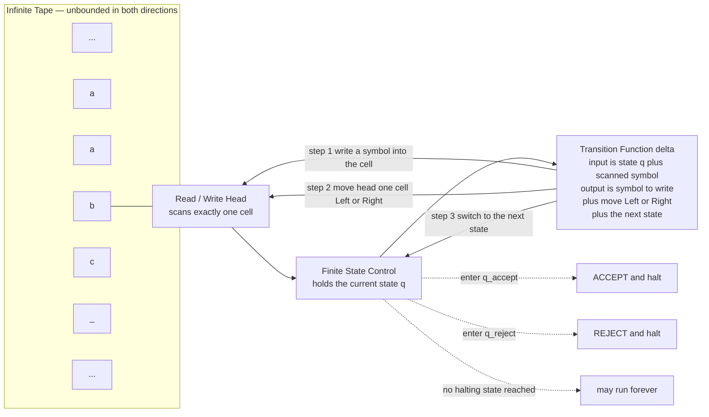

# ♾️ Turing Machines and the Church-Turing Thesis

> [!abstract] TL;DR
> A **Turing machine** is the simplest device that can compute *anything computable*: a finite state control plus an unbounded tape that a head reads, writes, and moves one cell at a time under a tiny rule table. Where finite automata have no memory and pushdown automata have only one stack, the Turing machine's rewritable tape lets it recognize languages like `a^n b^n c^n`, do arithmetic, and run any program. A single **Universal Turing Machine** can simulate *any other* Turing machine given its description — the theoretical seed of the stored-program computer. The **Church-Turing thesis** is the foundational claim that "effectively/algorithmically computable" *means exactly* "computable by a Turing machine" — a thesis (a definition of *algorithm*), not a provable theorem, backed by the fact that every other model ever proposed — lambda calculus, recursive functions, register machines, cellular automata, real programming languages — computes precisely the same class. This fixes the outer boundary of computation and sets the stage for undecidability.

---

## Intuition

**Analogy:** Imagine a clerk sitting in front of an *endless roll of paper tape* divided into squares. The clerk can see only the one square directly in front of them. In their head is a tiny booklet of rules, and their whole mental state is nothing more than "which page am I on." A rule reads: *"If you are on page 3 and the square shows an `a`, then: erase it and write `X`, shuffle one square to the right, and flip to page 5."* That is the entire job. Read one symbol, consult the current page, overwrite the symbol, step left or right, turn to the next page. Repeat forever, or until a page says "stop and accept" or "stop and reject."

Astonishingly, *that is all computation is*. There is no arithmetic unit, no RAM, no clever hardware — just a myopic clerk with an eraser, an infinite scratchpad, and a finite rulebook. The claim of this note is that anything your laptop, phone, or a supercomputer can ever compute, this clerk can also compute (given enough tape and patience). The clerk is a **Turing machine**; the rulebook is the **transition function**; the infinite tape is the memory that lifts the machine above finite automata and pushdown automata; and the sweeping assertion that *this clerk is the ceiling of what "algorithm" can mean* is the **Church-Turing thesis**.

---

## How It Works

### Core Mechanics

**1. The formal definition.** A (deterministic) Turing machine is a 7-tuple `M = (Q, Σ, Γ, δ, q0, q_accept, q_reject)`:
- `Q` — a finite set of **states** (the pages of the rulebook).
- `Σ` — the **input alphabet** (the symbols the input word is written in), not containing the blank.
- `Γ` — the **tape alphabet**, with `Σ ⊆ Γ` and a distinguished **blank** symbol `_ ∈ Γ`. The extra symbols are working scratch marks the machine writes for itself.
- `δ : Q × Γ → Q × Γ × {L, R}` — the **transition function**, the heart of the machine. Given the current state and the symbol under the head, it says: which symbol to write, whether to move the head Left or Right, and which state to enter next.
- `q0` — the **start state**; `q_accept` and `q_reject` — the two **halting states** (distinct).

**2. The tape and head.** The tape is a two-way infinite sequence of cells, initially holding the input word left-justified with blanks everywhere else. The head starts on the leftmost input cell. On every step the machine reads the current cell, applies exactly one `δ` rule, overwrites the cell, moves one cell, and updates its state. A **configuration** (state, tape contents, head position) is a complete snapshot; computation is a sequence of configurations linked by `δ`.

**3. Halting and acceptance.** The machine runs until it enters `q_accept` (halt, accept) or `q_reject` (halt, reject). Crucially, it may also **loop forever** on some inputs and never halt — this third outcome is not a bug but the very possibility that makes the [[The_Halting_Problem_and_Undecidability|halting problem]] undecidable. A machine that halts on *every* input is a **decider**; the language of all words it accepts is then **decidable** (recursive). A machine that accepts its language but may loop on non-members recognizes a **recognizable** (recursively enumerable) language. See [[Decidability_and_Recognizability]] for the full hierarchy.

**4. Why the tape is the whole story.** A finite automaton has only its current state — a bounded amount of memory — so it cannot even count unboundedly. A pushdown automaton adds a single **stack**, which is enough to match nested structure (`a^n b^n`) but not to compare *three* quantities, so `a^n b^n c^n` is beyond it. A Turing machine can write marks anywhere on an unbounded tape and revisit them, giving it read/write random-ish access. That single upgrade is the jump from "pattern matcher" to "general computer": it can cross off symbols, keep tallies, copy blocks, and simulate registers — enough to do arithmetic, evaluate logic, and ultimately run any algorithm. (Compare the step up from [[Pushdown_Automata]].)

**5. Robustness — the variants are all equally powerful.** The definition looks arbitrary, yet it is astonishingly stable. Every reasonable extension computes *exactly the same class of functions* as the one-tape model:
- **Multi-tape TM** — `k` independent tapes and heads. Convenient, and quadratically faster at most, but a single tape can simulate `k` tapes by interleaving tracks.
- **Multi-track TM** — one tape whose cells hold tuples; pure notation, folded into the alphabet.
- **Nondeterministic TM (NTM)** — `δ` returns a *set* of choices; the machine accepts if *some* branch accepts. A deterministic TM simulates it by breadth-first search over the computation tree. (The *time* cost of this simulation is the open **P vs NP** question, but the *computability* is identical.)
- **Two-way / one-way infinite tape, larger alphabets, "stay put" moves** — all inter-simulable.

This robustness is not a coincidence; it is *evidence* for the Church-Turing thesis: no matter how you sharpen the knife, you carve out the same class of computable functions.

**6. The Universal Turing Machine (UTM).** Here is Turing's deepest move (1936). A description of any Turing machine `M` — its states and transition table — is *itself just a finite string*, which we can write on a tape. Turing built a single machine `U` that takes as input `⟨M, w⟩` (an encoding of a machine `M` and an input `w`) and simulates `M` running on `w`, accepting iff `M` accepts `w`. One fixed machine, an interpreter for all machines. This is profound: it means **hardware and software are the same kind of thing** — a program is just data fed to a universal interpreter. Every stored-program computer (the von Neumann architecture, where instructions live in the same memory as data) is a physical UTM, and Turing published this in 1936, *years before* any electronic computer existed. The modern CPU fetching encoded instructions from memory is exactly this idea in silicon (see [[CPU_Datapath_and_Control]]).

**7. The Church-Turing thesis.** Alonzo Church (via the **lambda calculus**) and Alan Turing (via the machine) independently, in 1936, formalized "what can be computed by a mechanical procedure," and Turing proved their models equivalent. The **Church-Turing thesis** states:

> Every function that is *effectively calculable* — computable by any finite, mechanical, step-by-step procedure a human could in principle follow — is computable by a Turing machine.

It is **not a theorem**: "effectively calculable" is an informal, intuitive notion, so there is nothing to prove *against*. It is better read as a *definition*: it proposes that we *define* "algorithm" to mean "Turing machine." Its overwhelming support is the **confluence of models**: Turing machines, Church's lambda calculus, Kleene's general **recursive functions**, Post systems, register/counter machines, Markov algorithms, cellular automata (Rule 110), and every general-purpose programming language ever built all compute *exactly the same* class of functions. Independent people chasing "mechanical computation" from utterly different directions kept landing on the same island (see [[Recursive_Functions_and_Lambda_Calculus]]).

**8. Turing-completeness.** A system is **Turing-complete** if it can simulate any Turing machine — equivalently, if it can compute every computable function. Every mainstream programming language (C, Python, Java, Lisp) is Turing-complete; so, surprisingly, are Conway's Game of Life, the cellular automaton Rule 110, the x86 `mov` instruction alone, C++ templates, some spreadsheet configurations, Minecraft redstone, and (accidentally) many configuration and macro languages. Turing-completeness needs shockingly little: unbounded storage plus conditional iteration. Its dark twin: any Turing-complete system inherits the halting problem, so you can never fully analyze it in advance.

**9. Significance.** The Turing machine draws the *outer* boundary of computation — the line between what any conceivable computer can and cannot do *at all*, independent of speed or memory. Fixing that boundary is what makes **undecidability** meaningful: because the model is universal, showing "no Turing machine can decide X" (as with the [[The_Halting_Problem_and_Undecidability|halting problem]]) means *nothing algorithmic ever will*. The same machine, once you *count* the steps it takes and the cells it uses, becomes the standard model for measuring **time and space complexity** — so it is simultaneously the foundation of *computability* (what is solvable) and *complexity* (how expensive solving it is).

### Flow / Architecture



---

## Key Concepts

### Secondary (Foundational)

- **Tape.** The unbounded, rewritable memory. Unlike a finite automaton's fixed states or a stack's last-in-first-out access, the head can move to and edit *any* cell, which is the source of the machine's power.
- **Head.** The read/write pointer that sees exactly one cell at a time and moves one step left or right per transition.
- **State.** One of finitely many "pages" of the control; the machine's entire memory *besides the tape* is which state it is in.
- **Transition rule.** A single line of the rulebook: given (state, symbol), do (write, move, new state). The whole program is a finite table of these.
- **Halt / accept / reject.** Computation ends when an accept or reject state is entered — or never, if the machine loops.

### Undergraduate (Technical Depth)

- **Configuration and computation.** A configuration `u q v` records the tape, the state `q`, and the head at the start of `v`. `δ` defines a step relation on configurations; a computation is a (possibly infinite) chain of them from the start configuration.
- **Decider vs recognizer.** A **decider** halts on all inputs (decides a *recursive* language); a **recognizer** accepts its language but may loop on non-members (recognizes a *recursively enumerable* language). Every decidable language is recognizable; the converse fails (that gap *is* undecidability).
- **Model equivalence / robustness.** Multi-tape, multi-track, nondeterministic, and stay-put variants all recognize exactly the recursively enumerable languages. Simulations cost at most polynomial time (or a quadratic/exponential blow-up for the nondeterministic case), never any computational power.
- **Universal Turing machine.** A fixed `U` with `L(U) = { ⟨M, w⟩ : M accepts w }`. It reads a machine's description as data and interprets it — the abstract stored-program computer.
- **Turing-completeness.** The property of computing every Turing-computable function; requires only unbounded memory plus data-dependent looping/branching.

### Graduate (Research Frontier)

- **The Church-Turing thesis as a definition, not a theorem.** Because "effective procedure" is pre-formal, the thesis cannot be proved; it can only fail by counterexample (a physically realizable device computing a non-recursive function). None has appeared. Formalizations such as Gandy's axioms and Sieg's *computability by a person* attempt to *derive* the thesis from first principles about physical/mechanical constraints.
- **Physical and extended theses.** The **Physical Church-Turing thesis** asks whether *any physical process* can compute beyond a TM. **Hypercomputation** proposals (Zeno machines, oracle-augmented models, exploiting real-valued or relativistic tricks) are studied but require physically dubious infinities. The **Extended (or "strong") Church-Turing thesis** — that a TM can simulate any physical device with only *polynomial* slowdown — is the one genuinely under threat: **quantum computers** are believed (via Shor's algorithm) to violate its efficiency form, though *not* its computability form.
- **Oracles and relativization.** Attaching an oracle for a language `A` yields `TM^A`, defining the arithmetical/Turing hierarchy of degrees of unsolvability. Relativization results (e.g., oracles `A, B` with `P^A = NP^A` and `P^B ≠ NP^B`) show why P vs NP resists naive TM-simulation arguments.
- **Complexity as a refinement.** Bounding the tape cells (space) or steps (time) of a TM defines `P`, `NP`, `PSPACE`, `EXP`. The invariance across TM variants (the "reasonable machine" thesis) is what makes these classes machine-independent — the Church-Turing thesis's quantitative cousin.
- **Small universal machines and the Rule 110 result.** How simple can a UTM be? Work on `(2,3)` and `(2,5)` Turing machines, and Cook's proof that the elementary cellular automaton **Rule 110 is Turing-complete**, probe the minimal ingredients of universal computation and its emergence in trivial-looking systems.

---

## Python Demo

```python
# Turing machine simulator: recognizes L = { a^n b^n c^n : n >= 0 }.
#
# WHY THIS LANGUAGE: a^n b^n c^n is NOT context-free. No finite automaton
# (no memory) and no pushdown automaton (a single stack) can accept it --
# but a Turing machine, with its unbounded read/write tape, can. That gap
# is exactly the power the tape buys us over the weaker models.
#
# REPRESENTATION:
#   tape       : a Python list of symbols, blank = "_"
#   head       : integer index into the tape
#   state      : a string (the finite control)
#   delta      : dict  (state, symbol) -> (write_symbol, move, new_state)
#                move is -1 for Left, +1 for Right. Missing key => reject.
# numpy + matplotlib only.

import numpy as np
import matplotlib.pyplot as plt

BLANK = "_"

# --- Transition table for a^n b^n c^n --------------------------------------
# Strategy: cross the leftmost a as X, walk right and cross the first b as Y,
# then the first c as Z, walk back left, and repeat until every a is used.
# Finally verify only Y's and Z's remain, then accept.
delta = {
    # q0: find the next unmarked a (or discover all a's are done)
    ("q0", "a"):   ("X", +1, "q1"),
    ("q0", "Y"):   ("Y", +1, "q4"),
    ("q0", BLANK): (BLANK, +1, "qaccept"),   # empty input, n = 0
    # q1: walk right to the first unmarked b, cross it as Y
    ("q1", "a"):   ("a", +1, "q1"),
    ("q1", "Y"):   ("Y", +1, "q1"),
    ("q1", "b"):   ("Y", +1, "q2"),
    # q2: walk right to the first unmarked c, cross it as Z
    ("q2", "b"):   ("b", +1, "q2"),
    ("q2", "Z"):   ("Z", +1, "q2"),
    ("q2", "c"):   ("Z", -1, "q3"),
    # q3: walk back left to the marked X, then step right to restart
    ("q3", "a"):   ("a", -1, "q3"),
    ("q3", "b"):   ("b", -1, "q3"),
    ("q3", "Y"):   ("Y", -1, "q3"),
    ("q3", "Z"):   ("Z", -1, "q3"),
    ("q3", "X"):   ("X", +1, "q0"),
    # q4: all a's marked -- verify only Y's and Z's remain, then accept
    ("q4", "Y"):   ("Y", +1, "q4"),
    ("q4", "Z"):   ("Z", +1, "q4"),
    ("q4", BLANK): (BLANK, +1, "qaccept"),
}

def run_tm(word, max_steps=1000):
    """Run the TM; return (final_state, trace) where trace lists
    (state, head, tape_snapshot) after each step."""
    tape = list(word) if word else [BLANK]
    head, state = 0, "q0"
    trace = [(state, head, tape.copy())]
    for _ in range(max_steps):
        if state in ("qaccept", "qreject"):
            break
        if head < 0:                       # extend tape leftward with blanks
            tape.insert(0, BLANK); head = 0
        if head >= len(tape):              # tape is unbounded to the right
            tape.append(BLANK)
        key = (state, tape[head])
        if key not in delta:               # no applicable rule => reject
            state = "qreject"
            trace.append((state, head, tape.copy())); break
        write, move, state = delta[key]
        tape[head] = write
        head += move
        trace.append((state, head, tape.copy()))
    return state, trace

# --- Run on several inputs -------------------------------------------------
tests = ["aabbcc", "abc", "aabbc", "aaabbbccc", "aabbcccc", ""]
print("input        verdict   steps")
for w in tests:
    final, tr = run_tm(w)
    verdict = "ACCEPT" if final == "qaccept" else "REJECT"
    print(f"{w!r:12} {verdict:8} {len(tr) - 1}")

# --- Visualize the computation on a^2 b^2 c^2 ------------------------------
final, tr = run_tm("aabbcc")
width = max(len(t) for _, _, t in tr)
alphabet = [BLANK, "a", "b", "c", "X", "Y", "Z"]
sym_id = {s: i for i, s in enumerate(alphabet)}

grid = np.zeros((len(tr), width), dtype=int)
for r, (_, _, t) in enumerate(tr):
    for c, s in enumerate(t):
        grid[r, c] = sym_id[s]

fig, ax = plt.subplots(figsize=(8, 10))
ax.imshow(grid, aspect="auto", cmap="Pastel1", origin="upper")
for r, (st, hd, t) in enumerate(tr):
    for c, s in enumerate(t):
        ax.text(c, r, s, ha="center", va="center", fontsize=9)
    ax.text(-1.4, r, st, ha="right", va="center", fontsize=7, color="navy")
    if 0 <= hd < width:                    # red box marks the head position
        ax.add_patch(plt.Rectangle((hd - 0.5, r - 0.5), 1, 1,
                                   fill=False, edgecolor="red", lw=2))
ax.set_xticks(range(width))
ax.set_yticks(range(len(tr)))
ax.set_xlabel("tape cell")
ax.set_ylabel("computation step")
ax.set_title("Turing machine accepting a^2 b^2 c^2\nred box = head, blue text = state")
plt.tight_layout()
plt.savefig("turing_machine_anbncn.png", dpi=120)
print("saved turing_machine_anbncn.png")
```

Running it prints, for example, `'aabbcc' ACCEPT`, `'abc' ACCEPT`, `'aaabbbccc' ACCEPT`, and correctly `'aabbc' REJECT`, `'aabbcccc' REJECT`, and `'' ACCEPT` (the `n = 0` case). The saved figure shows the tape evolving row by row: the machine sweeps right marking `a→X`, `b→Y`, `c→Z`, sweeps back, and repeats — a mechanical dance that no pushdown automaton could perform, because it must track *three* counts at once. The finite control never "knows" it is comparing counts; correct behavior *emerges* from the tiny rule table plus the rewritable tape.

---

## Real-World Applications

> **The stored-program computer (von Neumann architecture).** Every general-purpose CPU is a physical Universal Turing Machine: instructions and data share one memory, and the processor is a fixed interpreter that fetches, decodes, and executes whatever program it is handed. Turing's 1936 UTM is the mathematical blueprint; the fetch-decode-execute cycle in [[CPU_Datapath_and_Control]] is its silicon realization. "Software" existing at all is the UTM insight — that a machine can be *reprogrammed by data* instead of rewired.

> **Compilers, interpreters, and virtual machines.** An interpreter (CPython, the JVM, a JavaScript engine) is a UTM in practice — one program that runs any other program supplied as input. The equivalence of Turing-complete models is why source in one language can be faithfully translated to another and why a VM can host arbitrary guest code.

> **Undecidability limits on tooling.** Because real languages are Turing-complete, Rice's theorem and the halting problem forbid a *perfect* general analyzer: no tool can always decide whether an arbitrary program halts, leaks memory, is a virus, or two programs are equivalent. This is why static analyzers, type checkers, and verifiers are necessarily *conservative* (sound but incomplete), and why antivirus is fundamentally an arms race, not a solved problem.

> **Smart-contract and configuration design.** Ethereum's EVM is deliberately Turing-complete but meters execution with **gas** to force termination (sidestepping the halting problem economically); Bitcoin Script is intentionally *not* Turing-complete (no loops) so that script termination is guaranteed. Choosing the *right* level of computational power is a real engineering decision rooted in these theorems.

> **Accidental Turing-completeness.** Systems never meant to compute — Conway's Game of Life, Rule 110, Magic: The Gathering, x86 page-fault handling, C++ templates, some SQL and spreadsheet setups — turn out to be Turing-complete. That makes them impossible to fully analyze or bound, a recurring source of security surprises and "we didn't know it could do that" bugs.

---

## Common Pitfalls

- **Thinking a Turing machine is a "real computer" or slow toy.** It is neither hardware nor a practical device; it is a *mathematical model* whose value is defining the *boundary* of computability, not being fast. The one-tape simulator above is deliberately inefficient — power, not performance, is the point.
- **Believing the Church-Turing thesis is a proven theorem.** It is a *thesis/definition* about the informal notion of "algorithm," supported by the convergence of all models but not provable, because there is no formal object on the "effectively calculable" side to prove equivalence against.
- **Confusing computability with efficiency (mixing up the two Church-Turing claims).** The *computability* thesis (what a TM can compute) is essentially unchallenged. The *extended/strong* thesis (that a TM simulates any device with only polynomial slowdown) is a different, stronger claim that quantum computing appears to threaten. Quantum computers do **not** compute anything a TM cannot; they may just do some tasks exponentially faster.
- **Forgetting the third outcome: looping.** Beginners assume a machine always accepts or rejects. The possibility of running forever is exactly what separates *decidable* from merely *recognizable* languages and is the crux of the halting problem — treating a recognizer as if it were a decider is a classic error.
- **Assuming variants add power.** Reaching for multi-tape or nondeterministic machines "to solve harder problems" misunderstands the theory: they add *convenience and sometimes speed*, never computability. If a one-tape TM cannot do it, no TM variant can.
- **Equating "Turing-complete" with "good" or "powerful enough."** Turing-completeness is cheap and often *undesirable* — it drags in undecidability. Many robust systems (regex engines without backreferences, Bitcoin Script, total functional languages, Datalog) are intentionally *sub-Turing* precisely to keep analysis and termination decidable.
- **Reading `a^n b^n c^n` as context-free.** It is a favorite trap: `a^n b^n` is context-free, so people over-generalize. Three matched counts break the single-stack limit of a PDA and require the full tape — the concrete reason Turing machines sit above pushdown automata.

---

## Related Concepts

- [[Theory_of_Computation_Overview]] — the map of the whole field; the Turing machine is its apex model, above regular and context-free languages.
- [[Pushdown_Automata]] — the model one rung below; adding a rewritable tape in place of a single stack is exactly the jump to Turing power (PDAs cannot do `a^n b^n c^n`).
- [[Decidability_and_Recognizability]] — deciders always halt (recursive languages) while recognizers may loop (recursively enumerable); the whole distinction is defined *in terms of* Turing machines.
- [[The_Halting_Problem_and_Undecidability]] — the first and canonical problem no Turing machine can decide; only meaningful *because* the TM is the universal model of algorithms.
- [[Recursive_Functions_and_Lambda_Calculus]] — the two other 1936 models that compute the exact same class, providing the core evidence for the Church-Turing thesis.
- [[CPU_Datapath_and_Control]] — the real fetch-decode-execute processor is a physical Universal Turing Machine; stored programs are the UTM idea in hardware.
- [[Computational_Theory_of_Mind]] — the philosophy that cognition is computation leans directly on the TM as its notion of "mechanical process."
- [[Kolmogorov_Complexity_and_Algorithmic_Information]] — defines the information content of a string as the length of the shortest program (Turing machine input) that outputs it; itself uncomputable, via a halting-problem-style argument.

---

## Review Questions

### Conceptual

1. Precisely why can a Turing machine recognize `a^n b^n c^n` while a pushdown automaton cannot? Frame your answer around the difference between a single stack and an unbounded, re-readable tape, and explain what "counting three quantities at once" requires. Then explain why *adding a second stack* to a PDA would already make it Turing-equivalent.

### Scenario

2. You are designing the execution engine for a new blockchain's smart contracts. One proposal makes the contract language fully Turing-complete; another restricts it to loop-free scripts. Using the halting problem, the notion of a decider, and the idea of metering (gas), argue the concrete engineering consequences of each choice for termination guarantees, static analysis, and denial-of-service risk. Which would you pick, and what safeguard would you attach to the Turing-complete option?

### Trade-off

3. State the difference between the (standard) Church-Turing thesis and the *extended* Church-Turing thesis. Explain why quantum computing is widely said to challenge one of them but not the other, and why the claim "a TM can compute anything a quantum computer can" is compatible with "a quantum computer can be exponentially faster." What kind of experimental or physical discovery *would* actually refute the standard thesis?

---

## Sources

- Sipser, M. *Introduction to the Theory of Computation*, 3rd ed. (2013), Chs. 3–4 — the standard treatment of Turing machines, variants, the UTM, and the Church-Turing thesis.
- Turing, A. M. "On Computable Numbers, with an Application to the Entscheidungsproblem," *Proc. London Math. Soc.* (1936) — the original paper defining the machine and the universal machine. [DOI](https://doi.org/10.1112/plms/s2-42.1.230)
- Hopcroft, Motwani & Ullman, *Introduction to Automata Theory, Languages, and Computation*, 3rd ed. (2006) — TM variants, recursive vs recursively enumerable, robustness.
- Cook, M. "Universality in Elementary Cellular Automata," *Complex Systems* 15 (2004) — proof that Rule 110 is Turing-complete. [Link](https://wpmedia.wolfram.com/sites/13/2018/02/15-1-1.pdf)
- Stanford Encyclopedia of Philosophy, "The Church-Turing Thesis" — its status as thesis vs theorem, physical and extended variants, hypercomputation. [Link](https://plato.stanford.edu/entries/church-turing/)

---

#theory-of-computation #turing-machine #church-turing-thesis #computability #universal-computation
